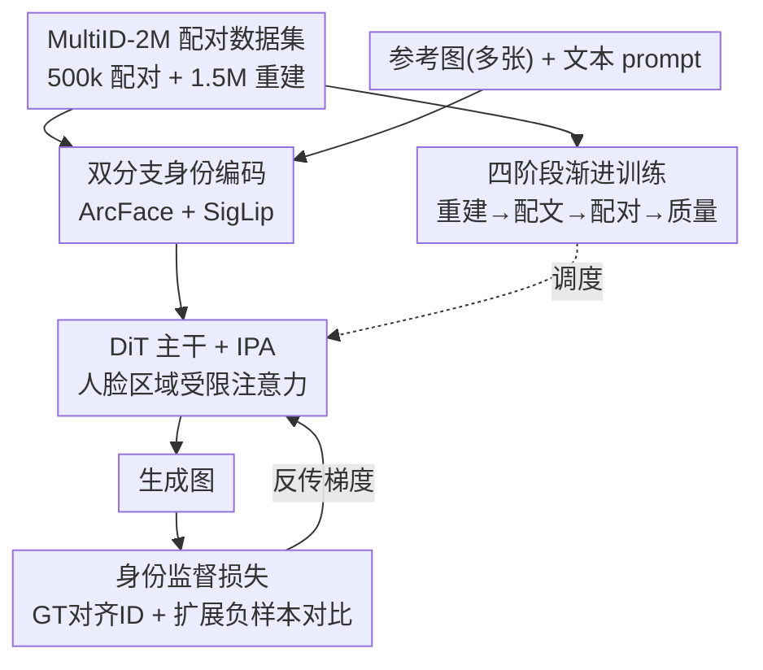

# WithAnyone: Toward Controllable and ID Consistent Image Generation

**会议**: ICLR 2026  
**OpenReview**: [https://openreview.net/forum?id=xFo13SaHQm](https://openreview.net/forum?id=xFo13SaHQm)  
**代码**: https://doby-xu.github.io/WithAnyone/ (有)  
**领域**: 扩散模型 / 身份一致生成  
**关键词**: 身份定制, copy-paste 伪影, 配对数据集, 对比学习, FLUX

## 一句话总结
针对身份定制生成里"模型直接把参考脸贴到输出上"的 copy-paste 顽疾，本文构建了 50 万张配对的多人数据集 MultiID-2M、给出能量化 copy-paste 的基准 MultiID-Bench，并用配对训练 + 扩展负样本的 ID 对比损失训出 WithAnyone（基于 FLUX），在保持最高 SimGT 的同时把 copy-paste 打到同档最低，打破了"像得越准、抄得越狠"的固有 trade-off。

## 研究背景与动机

**领域现状**：身份一致（ID-consistent）的文生图近年进展飞快，从 IP-Adapter、InstantID 到 PuLID、UMO，模型已经能合成和给定人物高度相似的肖像，最新工作甚至把"像"推到近乎完美复刻。主流做法是把参考人脸的 ArcFace 或 CLIP 嵌入通过 cross-attention / adapter 注入扩散主干。

**现有痛点**：作者观察到一个被普遍忽视的现象——真实照片里同一个人因姿态、表情、妆容、光照的自然变化，人脸相似度本来就会大幅波动（图 2 显示真实图像对的 SimRef 中位数才 0.46 左右）；但很多生成模型对参考图的"贴合"远远超过这个自然范围，表现为：让一张中性表情的参考脸"微笑"它不会笑、改头部姿态甚至改视线方向它都做不到。作者把这种失败模式正式命名为 **copy-paste 伪影**——模型不是在"理解身份后灵活合成"，而是把参考图直接拷进输出。

**核心矛盾**：copy-paste 的病根在数据。要训出"同一个人、不同姿态表情"的鲁棒身份条件，需要每个身份配多张参考图；但绝大多数人脸数据集都没有这种配对，于是现有方法只能退化成**单人重建训练**（reference 和 target 是同一张图）。重建目标天然鼓励"复制"，越训越像贴图。更糟的是评测指标 SimRef（与参考图的相似度）也在帮倒忙——直接复刻参考图能把 SimRef 刷满，哪怕 prompt 明确要求换姿态换表情。

**本文目标**：(1) 造一个有配对参考的大规模多人数据集；(2) 给一个能量化 copy-paste、不被"抄"刷分的基准；(3) 设计能从配对数据里榨出"身份而非像素"的训练范式。

**核心 idea**：用 GT（而非参考图）作为身份监督的锚点，配上"从同一身份的参考库里随机换一张当 target"的配对训练，再加上能从参考库拉数千个负样本的 ID 对比损失，逼模型依赖高层身份嵌入、放弃低层拷贝。

## 方法详解

### 整体框架

WithAnyone 建立在 FLUX 这一 DiT 架构上，输入是 1–4 张参考人脸 + 一段文本 prompt，输出是符合 prompt 场景、同时保持每个人身份的多人图像。整条路线由四块拼成：**数据**（MultiID-2M 提供"同人不同图"的配对监督）、**架构**（双分支编码每张参考脸 + 把人脸嵌入约束到对应人脸区域的受限注意力）、**身份监督**（GT 对齐的 ID 损失 + 扩展负样本的对比损失，与扩散损失一起优化）、**训练调度**（四阶段从纯重建逐步过渡到可控的身份条件合成）。这四块都围绕同一个目标：让模型学到的是"这个人是谁"，而不是"把这张脸抄过去"。

### 关键设计

**1. MultiID-2M 配对数据集：从根上铲掉 copy-paste 的土壤**

copy-paste 的根因是"reference 与 target 同图"的重建训练，所以作者先在数据层面把这个捷径堵死。MultiID-2M 用四阶段流水线构建：① 从网上收单人图、按 ArcFace 嵌入聚类建一个干净的"参考库"，得到约 3k 身份、约 100 万张参考图（平均每人 400 张）；② 用"人名 + 2/3/4 演员"等场景化检索 + 负关键词（去水印、去独照、去人群）抓多人合照并检测人脸；③ 把合照里的脸和单人聚类中心按余弦相似度匹配（阈值 0.4）来配对，给每张合照的每个人挂上若干张该身份的参考图；④ 用 Recognize Anything、美学打分、OCR 去水印、LLM 生成 caption 做过滤标注。最终得到约 50 万张带匹配参考的多人图 + 约 150 万张无标注多人图（供重建），覆盖约 2.5 万身份。关键在于"每个身份配数百张姿态/表情/发型各异的参考"，这让后续训练能随机抽"同人的另一张图"当 target，从根上提供了"身份不变、外观可变"的监督信号。出于合规，数据只取 CC 许可、公开人物，训练中身份只用匿名内部 ID 表示。

**2. 双分支身份编码 + 人脸区域受限注意力：既要判得准身份，又要管得住影响范围**

每张参考脸同时过两条编码分支：人脸识别网络（ArcFace）给出判别性强的身份嵌入，通用图像编码器（SigLip）给出互补的中层特征，二者拼起来兼顾"是谁"和"长什么样的细节"。这些身份特征通过 IPA（IP-Adapter 式）cross-attention 注入 DiT。一个关键约束是：每个人脸嵌入只允许 attend 到它对应人脸区域内的图像 token，而不是全图。这在多人场景下尤其重要——它防止 A 的身份特征"漏"到 B 的脸上造成身份串味（blending），让每张脸各管各的区域。相比 XVerse、UMO 那类把 VAE 人脸嵌入直接拼进输入的做法（VAE 偏低层特征、容易像素级 copy-paste），双分支 + 区域约束把"身份判别"和"空间归属"都交代清楚。

**3. 两个身份监督损失：把锚点从参考图挪到 GT，并用海量负样本拉开身份**

这是打破 trade-off 的核心。除扩散流匹配损失 $L_{diff}$ 外，作者加了两个针对身份的损失。其一是 **GT 对齐的 ID 损失**：ArcFace 取嵌入需要先做人脸关键点检测对齐，但生成图（经噪声扩散或一步去噪得到）上直接检关键点很不可靠——PortraitBooth 只好把 ID loss 限制在低噪声段（$t<0.25$）、PuLID 干脆把生成结果完全去噪（代价极高）。本文换个思路：用 **GT 的关键点**去对齐生成图，从而绕开在噪声图上检点，只最小化对齐后两者 ArcFace 嵌入的余弦距离

$$L_{ID} = 1 - \cos(g, t),$$

其中 $g$、$t$ 分别是生成图与 GT 的 ArcFace 嵌入。好处是 ID loss 能在**所有噪声层级**生效（图 7 显示它在高噪声段给出方差更大、信息量更高的梯度）、几乎零额外开销、还隐式监督了生成的关键点。其二是 **扩展负样本的 ID 对比损失**，用 InfoNCE 把生成图在嵌入空间拉近其参考、推远其他身份：

$$L_{CL} = -\log \frac{\exp(\cos(g, t)/\tau)}{\sum_{j=1}^{M}\exp(\cos(g, n_j)/\tau)},$$

$n_j$ 是来自不同身份的负样本。正因为有了带身份标签的参考库，每个样本能从中抽**数千个**负样本（实现里扩到 4096，而非只用 batch 内的 63 个），判别信号强得多。总损失为 $L = L_{diff} + \lambda_{ID}L_{ID} + \lambda_{CL}L_{CL}$，两个权重在各阶段都取 0.1。

**4. 四阶段渐进训练：从纯重建一步步退火到可控身份合成**

直接上配对训练会让初始化不稳，于是用四阶段把目标从"重建"平滑过渡到"可控身份条件生成"。阶段 1（约 20k 步）：固定 dummy prompt（如 "two people"）做重建预训练，逼模型先把身份条件通路学好、别被文本风格带偏，用全量 MultiID-2M 加 CelebA-HQ/FFHQ/FaceID-6M 子集增多样性。阶段 2（约 40k 步）：换成真实 caption 做重建，把身份学习和文本条件对齐，此时身份相似度达峰。阶段 3 **配对微调**：把 50% 样本换成配对实例——从该身份参考集里随机抽一张当输入、另一张不同的图当 target，这一"扰动"直接打断"输入即输出"的复制捷径，强迫模型靠高层身份嵌入而非低层拷贝。阶段 4 质量微调：在精选高质量子集 + 风格化变体上 finetune，提升纹理、光照和风格迁移能力，同时保住前面建立的身份一致性。

### 损失函数 / 训练策略
总目标 $L = L_{diff} + 0.1\,L_{ID} + 0.1\,L_{CL}$。其中 copy-paste 的量化指标 MCP（用于基准而非训练）定义为角距离之差的归一化：$M_{CP}(g\mid t,r) = \dfrac{\theta_{gt}-\theta_{gr}}{\max(\theta_{tr},\varepsilon)} \in [-1,1]$，其中 $\theta_{ab}=\arccos(\mathrm{Sim}(a,b))$。$M_{CP}=1$ 表示生成图完全贴合参考 $r$（彻底 copy-paste），$=-1$ 表示完全贴合 GT $t$。基准 MultiID-Bench 用 **SimGT**（与 GT 而非参考的相似度）作主指标，从评测端就不奖励"抄"。

## 实验关键数据

基线分两类：通用定制/编辑模型（OmniGen/OmniGen2、Qwen-Image-Edit、FLUX.1 Kontext、UNO、USO、UMO、GPT-4o）与人脸定制模型（UniPortrait、ID-Patch、PuLID、InstantID）。MultiID-Bench 含 435 个测试样例，身份为训练集无重叠的长尾人物。

### 主实验

单人子集（MultiID-Bench）上 WithAnyone 在保持高 SimGT 的同时把 copy-paste（CP）压到人脸定制模型里最低档：

| 方法 | SimGT ↑ | SimRef ↑ | CP ↓ | CLIP-I ↑ | Aes ↑ |
|------|---------|----------|------|----------|-------|
| InstantID | 0.464 | 0.734 | 0.337 | 0.764 | 5.255 |
| UMO | 0.458 | 0.732 | 0.359 | 0.783 | 4.850 |
| PuLID | 0.452 | 0.705 | 0.315 | 0.779 | 4.839 |
| UniPortrait | 0.447 | 0.677 | 0.265 | 0.793 | 5.018 |
| **WithAnyone** | **0.460** | 0.578 | **0.144** | **0.798** | 4.783 |

可以看到：InstantID/UMO 等靠刷 SimRef（0.73）拿到略高的 SimGT，但 CP 高达 0.34–0.36（在抄）；WithAnyone 的 SimRef 只有 0.58、却拿到几乎并列最高的 SimGT 0.460，CP 仅 0.144——说明它的"像"来自真正合成身份而非复刻参考。图 5 显示除 WithAnyone 外所有方法都落在一条"相似度↑则 copy-paste↑"的拟合曲线上，唯独本文明显偏离到理想的右上角。

多人子集（2 人 / 3–4 人）上 WithAnyone 的 SimGT 直接领先：2 人子集 SimGT=0.405（次优 UniPortrait 0.367），身份串味 Bld=0.079（低更好）；3–4 人子集 SimGT=0.414，Bld=0.045 最低，印证区域受限注意力对抑制多人身份混淆有效（GPT 在 ≥3 人子集因预先认识剧集人物而出现异常高分，不可直接比）。

### 消融实验

| 配置 | SimGT ↑ | SimRef ↑ | CP ↓ | 说明 |
|------|---------|----------|------|------|
| **Full Setting** | 0.405 | 0.551 | 0.161 | 完整模型 |
| w/o Phase 3 | 0.406 | 0.625 | 0.239 | 去配对微调：SimRef 飙到 0.625、CP 涨到 0.239（开始抄） |
| w/o GT-Align | 0.385 | 0.549 | 0.175 | 去 GT 对齐：SimGT 掉 0.02 |
| w/o Ext. Neg. | 0.368 | 0.455 | 0.074 | 负样本从 4096 砍到 63：身份学习显著变弱（SimGT 0.368） |
| FFHQ only | 0.224 | 0.246 | 0.027 | 只用 FFHQ：身份几乎学不出（SimGT 0.224） |

### 关键发现
- **配对微调（Phase 3）是抑制 copy-paste 的关键**：去掉它 SimRef 从 0.55 反弹到 0.625、CP 从 0.16 涨到 0.24，且 SimGT 几乎不变——证明它能在不牺牲"真·身份相似"的前提下专门压掉"抄"。
- **扩展负样本贡献最大**：把负样本从 4096 砍到 batch 内 63 个，SimGT 从 0.405 跌到 0.368，ID 对比损失基本失效，说明海量负样本带来的判别信号是身份保真的主力。
- **数据质量决定上限**：只用 FFHQ 训练 SimGT 仅 0.224，远逊于 MultiID-2M，印证"配对多人数据"本身就是核心贡献而非可替换部件。
- 用户研究（10 人对 230 组图按身份相似度/copy-paste/prompt 遵从/美学排序）显示 WithAnyone 四个维度平均排名都第一，且 CP 指标与人类判断中度正相关，说明该指标确实捕捉到了感知上有意义的伪影。

## 亮点与洞察
- **把"评测指标在帮倒忙"这件事说透了**：指出 SimRef 会隐式奖励 copy-paste，并设计 SimGT + MCP 把"抄"和"像"解耦——这是方法之外更通用的洞察，谁做身份定制都该警惕。
- **GT 对齐 ID 损失是个低成本巧招**：用 GT 关键点去对齐生成图、绕开在噪声图上检关键点，既让 ID loss 全噪声层级可用、又几乎零开销，比 PuLID 全去噪省得多，可直接迁移到其他需要在扩散中算感知/识别损失的任务。
- **"配对参考库 → 数千负样本"的连锁红利**：有了带身份标签的参考库，对比损失的负样本规模直接上 4096，这是单人重建数据根本拿不到的判别信号，是数据贡献撬动方法贡献的典型例子。

## 局限与展望
- 数据严重依赖"公开知名人物 + CC 许可"，对普通人/长尾身份的泛化、以及隐私合规之外的伦理风险（深伪滥用）需要额外约束。
- copy-paste 与身份保真本质仍是张力，WithAnyone 是"显著缓解并偏离 trade-off 曲线"，并非彻底消除；在极端姿态/遮挡下表现仍有待验证。
- 评测里 GPT-4o 等 VLM 对个体身份分辨力弱、且对部分剧集人物有先验知识导致分数异常，说明现有自动指标体系仍不完美，跨方法横比要带 caveat。

## 相关工作与启发
- **vs PuLID / InstantID**: 都把 ArcFace/CLIP 身份嵌入注入 DiT，但靠单人重建训练、用 SimRef 评测，结果 CP 高（0.31–0.34）；本文用配对数据 + GT 锚点把 SimRef 主动压低到 0.58 却拿到同等 SimGT，"像得真而非抄得狠"。
- **vs UMO / XVerse**: 它们把 VAE 人脸嵌入直接拼进输入，VAE 偏低层特征易致像素级 copy-paste；本文用 ArcFace+SigLip 双分支 + 人脸区域受限注意力，既判别身份又控制影响范围。
- **vs PortraitBooth**: 它把 ID loss 限制在低噪声段（$t<0.25$）丢掉高噪声监督；本文用 GT 对齐让 ID loss 在全噪声层级可用，高噪声段还提供更高方差的有效梯度。

## 评分
- 新颖性: ⭐⭐⭐⭐⭐ 把 copy-paste 形式化为可量化失败模式，并用配对数据 + GT 锚点 + 扩展负样本系统性破解 trade-off，问题定义与解法都新。
- 实验充分度: ⭐⭐⭐⭐⭐ 单人/多人/OmniContext 多基准 + 四组消融 + 用户研究，结论自洽且把每个组件贡献量化清楚。
- 写作质量: ⭐⭐⭐⭐ 动机与指标设计讲得透彻，架构细节略压缩在附录，正文图文配合好。
- 价值: ⭐⭐⭐⭐⭐ 数据集、基准、模型全开源，对身份定制生成是可直接复用的基础设施。

<!-- RELATED:START -->

## 相关论文

- [\[ICLR 2026\] Consistent Text-to-Image Generation via Scene De-Contextualization](consistent_text-to-image_generation_via_scene_de-contextualization.md)
- [\[CVPR 2025\] Consistent and Controllable Image Animation with Motion Diffusion Models](../../CVPR2025/image_generation/consistent_and_controllable_image_animation_with_motion_diffusion_models.md)
- [\[ICLR 2026\] OmniText: A Training-Free Generalist for Controllable Text-Image Manipulation](omnitext_a_training-free_generalist_for_controllable_text-image_manipulation.md)
- [\[ICLR 2026\] Any-step Generation via N-th Order Recursive Consistent Velocity Field Estimation](any-step_generation_via_n-th_order_recursive_consistent_velocity_field_estimatio.md)
- [\[CVPR 2026\] Match-and-Fuse: Consistent Generation from Unstructured Image Sets](../../CVPR2026/image_generation/match-and-fuse_consistent_generation_from_unstructured_image_sets.md)

<!-- RELATED:END -->
