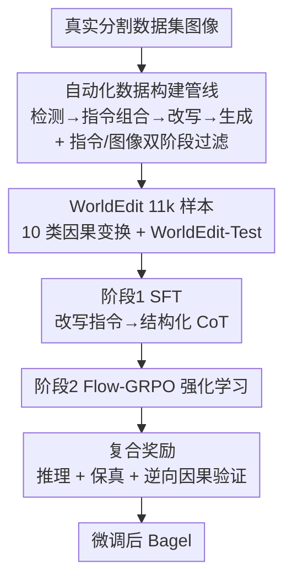

# WorldEdit: Towards Open-World Image Editing with a Knowledge-Informed Benchmark

**会议**: ICLR 2026  
**论文**: [OpenReview / Project Page](https://arxiv.org/abs/2026.worldedit)（⚠️ 缓存无 arXiv 号，以原文项目页为准）  
**代码**: 见论文 Project Page（有）  
**领域**: 扩散模型 / 图像编辑 / 多模态VLM  
**关键词**: 开放世界编辑, 隐式指令, 因果推理, 数据集与基准, 强化学习奖励

## 一句话总结
针对"只给原因不给结果"的隐式编辑指令（如"把球扔向仙人掌"），本文构建了强调真实世界因果变换的 11k 高质量数据集 WorldEdit 与配套基准 WorldEdit-Test，并用"CoT 监督微调 + Flow-GRPO 强化学习（含逆向因果验证奖励）"两阶段微调 Bagel，把开源模型的因果编辑能力拉到接近 GPT-4o / Nano-Banana 的水平。

## 研究背景与动机

**领域现状**：图像编辑模型在"显式指令"上已经很强——属性修改、风格迁移、姿态合成这类任务，只要说清"要变成什么样"，扩散模型和统一多模态模型都能做得不错。

**现有痛点**：但现实里大量指令是"隐式"的——只描述变化的**原因**，不描述**结果**。例如"一个水气球砸到仙人掌"，模型得自己推断出水花飞溅的轨迹、仙人掌的反应。论文发现，即使先把隐式指令用 LLM 改写（paraphrase）成更明确的提示词喂给预训练模型，多数模型的编辑结果依然很差：一方面隐式结果往往复杂且需要准确的世界知识（物理定律、物体交互逻辑）才能渲染；另一方面像莫比乌斯带的单面结构、积木坍塌的散落形态这种视觉表达，预训练模型本身就难以生成。

**核心矛盾**：作者把根因归结为编辑指令的 **"输入依赖性"（input-dependency）**。传统显式指令（如"移除物体"）与输入图像内容的相关性低——不管移除什么，变化逻辑都一致（抠掉目标区域 + 背景补全），所以模型在没见过的场景也稳。而世界知识驱动的隐式指令是**高度输入相关（input-contingent）**的：同一个动作"砸向仙人掌"，作用在不同材质的球上结果天差地别（形变程度、仙人掌反应都因质量、弹性、表面材料而异）。这种"指令—输入—结果"的强耦合，对模型泛化能力的要求远高于传统任务。

**本文目标**：(1) 提供能**训练**而非只能评测的世界知识编辑数据；(2) 让统一模型把预训练中隐含的因果逻辑真正用到编辑上。现有努力要么（AnyEdit）规模大但绝大多数仍是传统显式指令、真正世界知识驱动的样本极少；要么（KRIS-Bench、RISEBench）只提供基准、无法用于训练且规模有限。

**切入角度**：统一模型（既能理解又能生成）在大规模预训练中已经隐式捕获了世界编辑的因果逻辑与视觉关系，缺的只是一份"专门激发它把世界知识迁移到编辑过程"的数据。于是作者从"造数据 + 设计奖励把因果对齐显式化"两头入手。

**核心 idea**：用一条自动化管线造出**符合真实世界因果逻辑**的 11k 编辑样本，再用"CoT 监督 + 带逆向因果验证奖励的强化学习"两阶段微调，把统一模型的世界知识"逼"进编辑结果里。

## 方法详解

### 整体框架
WorldEdit 既是**数据集/基准**，也是一套**训练框架**。整体分两块：前半段是一条**自动化数据构建管线**——从真实分割图像出发，经"开放世界检测 → 指令组合 → LLM 改写视觉描述 → GPT-4o 生成编辑图"四步，配双阶段过滤（指令侧预过滤 + 图像侧后过滤），产出 11k 高质量样本并切出 WorldEdit-Test；后半段是在 Bagel 上的**两阶段微调**——先用改写成 CoT 的指令做监督微调（SFT），再用 Flow-GRPO 强化学习，由"推理 + 保真 + 逆向因果验证"三项复合奖励引导，把生成行为对齐到真实因果逻辑。

### 关键设计

**1. 开放世界因果编辑的任务定义：把"物理世界里的自然变化"补进编辑基准**

现有编辑基准（RISE-Bench 按认知推理类型、KRIS-Bench 按 Bloom 认知分类法）大量数据集中在语义操作（数量、空间位置）和逻辑推理（迷宫、数独）上，**真正模拟物理世界因果变换的数据被系统性低估**。本文据此重新定义任务，把变换归为两大类、共 10 种类型：**环境驱动变换**（由环境条件变化引起）——时间 Time（水果成熟）、温度 Temperature（冰融化）、湿度 Humidity（花枯萎）、酸度 Acidity（金属腐蚀）、光照 Light（织物褪色）；**力学驱动变换**（由施加物理力引起）——破碎 Break（盘子碎裂）、充气 Inflate（气球膨胀）、挤压 Squeeze（纸团皱缩）、扭转 Twist（拧布）、拉伸 Stretch（橡皮筋伸长）。这套定义直接决定了数据要"覆盖什么变化"和"怎么评测"，是后续管线和基准切分的基石。

**2. 自动化数据构建管线：四步生成 + 双阶段过滤，保证因果与画质都过关**

造世界知识编辑数据的难点是：既要因果逻辑成立，又要前后图像高度一致、画质真实。管线按四步走（对应图 2）：① **开放世界检测**——用检测模型从真实图像里抽出物体名与基础描述（如"a rusted bollard""a white rope securing a ship"），为后续编辑打基础；② **收集编辑指令**——把检测到的物体与 10 种编辑类型组合，对每个物体生成"如果……会发生什么"的问题（如"如果船断裂会怎样"），并在此**预过滤**掉因果薄弱的不合理组合（如"系船柱 + 充气"被剔除，因为系船柱现实中几乎不会膨胀）；③ **收集指令改写**——用预训练 LLM 把因果变化映射成详细的**视觉变化描述**，并过滤掉有错误或视觉变化太微弱（如"稍微绷紧的绳子"变化太小、难以编辑和评测）的回答；④ **收集编辑图像**——用 GPT-4o 依据改写后的指令生成编辑图，对复杂指令（失败超过 3 次）做**分解 + 多步编辑**提升质量，生成后再用 GPT-4o **后过滤**掉视觉一致性差或编辑错误的图（如"船被压碎却没有可信的结构损伤"会被拒）。这条"指令验证预过滤 + 图像评估后过滤"的双阶段策略，正是数据质量的保证。对"磁场线""静电效应"等公开数据里罕见的类型，再补少量合成数据增加多样性。最终得到 11k 样本：Break 最多（1,746），Twist 最少（304），指令解释长度多在 50–60 词。

**3. 两阶段训练：CoT 监督微调先"读懂因果"，强化学习再"对齐因果"**

光有数据不够，还要让模型把世界知识用出来。第一阶段 **SFT**：把指令改写成结构化的思维链（CoT）序列，用因果语言建模目标训练——**损失同时施加在文本 token 和图像 token 上**，让模型既学会解读隐式编辑命令、调用自身世界知识，又建立"语言指令 → 视觉修改"的稳健映射。第二阶段用 **Flow-GRPO** 强化学习进一步精修生成行为，由一个复合奖励引导（见设计 4）。这种"先监督打底、再强化对齐"的安排，针对的就是 SFT 后模型虽能模仿、但因果一致性仍不稳的问题——RL 阶段用奖励把"画对"和"因果讲得通"两件事一起优化。

**4. 复合奖励与逆向因果验证：用"反推原因"显式检验因果是否成立**

强化阶段的复合奖励由三项相加 $R = R_{\text{reason}} + R_{\text{fidelity}} + R_{\text{causal}}$：
$$R = R_{\text{reason}} + R_{\text{fidelity}} + R_{\text{causal}}$$
- **CoT 推理奖励 $R_{\text{reason}}$**：评估生成的 CoT 文本相对指令的连贯性、相关性、因果正确性，输出标量分，鼓励模型给出忠实反映变换过程的推理、提升可解释性；
- **图像质量奖励 $R_{\text{fidelity}}$**：用多模态模型同时看原图、生成图和指令，给出兼顾"指令遵循 + 视觉一致性"的分数，通过直接优化感知对齐与**编辑的最小侵入性**（minimal invasiveness），在执行精确改动的同时保住画质；
- **因果验证奖励 $R_{\text{causal}}$（本文核心、inversion-based）**：让多模态模型**反过来从输入图和输出图之间推断"发生了什么变换/原因"**，再算这个推断出的原因与原始指令的相似度作为奖励。它的巧妙之处在于：不是检查"图像看起来对不对"，而是检查"能不能从结果反推回正确的原因"——只有模型真正学到了底层物理与环境原理、让编辑结果在因果上**可解释**，逆向推断才会和原指令对上。这把"是否真懂因果"变成了一个可优化的标量信号。

### 损失函数 / 训练策略
- SFT 阶段：因果语言建模目标，损失同时覆盖文本 token 与图像 token。
- RL 阶段：Flow-GRPO 算法，优化复合奖励 $R = R_{\text{reason}} + R_{\text{fidelity}} + R_{\text{causal}}$（三项等权相加，⚠️ 是否有权重系数原文未明确，以原文为准）。
- Baseline 模型：Bagel。

## 实验关键数据

评测协议follow KRIS-Bench，用 Qwen-VL-Max 作为打分器，沿四个维度评分（满分 5）：**VC** 视觉一致性、**VQ** 视觉质量、**IF** 指令遵循、**KP** 知识合理性；结果在 10 个因果类别上报告并取总平均。

### 主实验（WorldEdit-Test，Overall 平均分）

| 模型 | 类型 | Overall Avg |
|------|------|------|
| GPT-4o | 商业 | **4.36** |
| Nano-Banana | 商业 | 4.22 |
| SeedEdit-3.0 | 商业 | 4.21 |
| **Ours（微调 Bagel）** | 开源 | **4.07** |
| Bagel-Think | 开源 | 3.35 |
| Flux-Kontext | 开源 | 3.21 |
| Bagel（原始） | 开源 | 2.76 |
| Omnigen | 开源 | 2.52 |
| Omnigen2 | 开源 | 2.51 |
| Emu2 | 开源 | 2.46 |
| Ip2p | 开源 | 2.44 |
| Magicbrush | 开源 | 2.14 |
| Anyedit | 开源 | 2.09 |

本文方法在开源模型里取得 SOTA（4.07），相比原始 Bagel（2.76）大涨 1.31，并显著缩小与商业模型（GPT-4o 4.36 / Nano-Banana 4.22）的差距——尤其在开源系统普遍翻车的"知识合理性 KP"维度上拉近最多。

### 直接给改写指令的对比（Table 2，Overall）

| 模型 | Overall |
|------|---------|
| GPT-4o* | 4.38 |
| Nano-Banana* | 4.25 |
| **Ours** | **4.07** |
| Bagel* | 3.01 |
| Omnigen2* | 2.62 |

即使把隐式指令改写成带明确视觉变化的提示词直接喂给模型，效果依旧远不如用 WorldEdit 微调：原始 Bagel* 靠改写只比自身提升约 0.25，仍远低于本文的 4.07。说明对城堡砖块的混乱散落、莫比乌斯带的抽象结构这类复杂细节，单靠文本改写无法传达，专门的训练数据不可替代。

### 消融实验（Table 3，去掉某项奖励后的 Overall）

| 配置 | Overall | 说明 |
|------|---------|------|
| Ours（完整） | 4.07 | 三项奖励齐全 |
| w/o 图像质量奖励 | 3.85 | 掉 0.22，画质明显变差 |
| w/o 因果验证奖励 | 3.91 | 掉 0.16，因果正确性下滑 |
| w/o CoT 推理奖励 | 3.94 | 掉 0.13，推理一致性下滑 |

### 关键发现
- **图像质量奖励贡献最大**（去掉掉 0.22）：视觉编辑里画质是硬约束，少了它生成结果可看性显著下降。
- **因果验证奖励 > CoT 推理奖励**（0.16 vs 0.13）：两者都在约束模型保持因果正确，逆向因果验证这一项更关键，印证"反推原因"比单看推理文本更能锁住因果一致性。
- 商业模型（GPT-4o、SeedEdit-3.0）在 VQ 和 IF 上一贯领先（大规模预训练 + 指令微调的红利），但在 time、acidity 这类需要显式因果推理的类别上仍吃力；本文方法在 stretch、squeeze、break 等强物理交互类别表现突出（移走重物后弹簧自然回弹、真空袋平滑塌缩、悬崖碎成连贯碎块）。
- 人类评测结论与 Table 1 一致：GPT-4o、Nano-Banana 多数类别领先；Flux-Kontext、Emu2 在知识合理性上明显偏低。

## 亮点与洞察
- **把"是否真懂因果"做成可优化信号**：逆向因果验证奖励不去问"图对不对"，而是"能不能从结果反推回原因"，巧妙地把抽象的因果理解转成标量奖励——这个"逆问题做监督"的思路可迁移到任何"过程难评、但结果可反推"的生成任务（如物理模拟、可控视频生成）。
- **"input-dependency"这个诊断很到位**：用"显式指令输入相关性低、隐式指令高度输入相关"解释了为什么传统编辑模型泛化好、世界编辑泛化差，一句话点破了问题本质。
- **数据管线的双阶段过滤可复用**：指令侧先用世界知识一致性剔除不合理组合（系船柱+充气），图像侧再用视觉合理性剔除烂图，这种"造数据前后都卡因果"的做法对任何需要高质量因果配对的数据集都适用。
- **SFT 损失同时压文本和图像 token**：让统一模型在"解释为什么变"和"画出怎么变"上一起学，而不是只学画。

## 局限与展望
- **依赖 GPT-4o / Qwen-VL-Max 等闭源模型**：数据生成（GPT-4o 造图与过滤）和评测（Qwen-VL-Max 打分）都重度依赖大模型，评测分数本身可能继承评判模型的偏好，且"用模型造数据微调模型"存在分布偏置风险。
- **类别分布严重不均**：Break 1,746 vs Twist 304，长尾类别样本稀少，罕见变换还得靠合成数据补，泛化到分布外因果类型的能力存疑。
- **仍未追平商业模型**：4.07 vs GPT-4o 4.36，差距主要在视觉质量与指令遵循，这部分受限于基座 Bagel 的生成上限。
- **奖励权重未充分探讨**：三项奖励等权相加，是否需要按类别/难度自适应加权，原文未展开（⚠️ 以原文为准）。
- 改进思路：引入更均衡的采样/数据增强缓解长尾；探索可验证的物理仿真信号替代部分模型打分奖励；把逆向因果验证扩展到多步因果链。

## 相关工作与启发
- **vs AnyEdit / ImgEdit / InstructPix2Pix**：它们强调任务复杂度、指令多样性或数据规模，但绝大多数仍是传统显式指令，没显式建模指令理解背后的推理与知识结构；WorldEdit 专门聚焦世界知识驱动的因果变换，且同时提供训练 + 评测数据。
- **vs KRIS-Bench / RISEBench**：这两者支持评测知识推理编辑，但**只给基准、不给训练数据**，规模也有限，且大量数据偏向语义操作与逻辑推理（迷宫、数独）；WorldEdit 既能训练又补齐了被低估的"物理世界因果变换"。
- **vs ReasonPix2Pix / EditWorld**：只提供了有限的、未经验证的知识编辑数据，受早期编辑技术所限画质差、知识不足；WorldEdit 用双阶段过滤保证了因果与画质。
- **vs 统一模型（Chameleon / Emu3 / Transfusion / Show-o）**：这些工作把 LLM 能力扩到视觉、在指令遵循和语义理解上更强，但面对隐式需要世界知识的指令仍力不从心；本文正是要把它们隐含的因果知识"激发"出来。

## 评分
- 新颖性: ⭐⭐⭐⭐ 任务定义（input-contingent 因果编辑）和逆向因果验证奖励都有清晰的新意，但整体是"数据集 + 两阶段微调"的组合拳。
- 实验充分度: ⭐⭐⭐⭐ 对比 13 个模型、4 维度、10 类别 + 改写指令对照 + 奖励消融 + 人类评测，较全面；缺数据规模/基座的消融。
- 写作质量: ⭐⭐⭐⭐ "input-dependency"的问题诊断清晰，管线与奖励讲得明白。
- 价值: ⭐⭐⭐⭐ 填补了世界知识驱动编辑"能训练的数据"空白，逆向因果验证奖励对生成对齐有借鉴意义。

<!-- RELATED:START -->

## 相关论文

- [\[ICML 2026\] WISE: A World Knowledge-Informed Semantic Evaluation for Text-to-Image Generation](../../ICML2026/image_generation/wise_a_world_knowledge-informed_semantic_evaluation_for_text-to-image_generation.md)
- [\[ICLR 2026\] ImagenWorld: Stress-Testing Image Generation Models with Explainable Human Evaluation on Open-ended Real-World Tasks](imagenworld_stress-testing_image_generation_models_with_explainable_human_evalua.md)
- [\[ICLR 2026\] ChronoEdit: Towards Temporal Reasoning for In-Context Image Editing and World Simulation](chronoedit_towards_temporal_reasoning_for_in-context_image_editing_and_world_sim.md)
- [\[CVPR 2026\] WiseEdit: Benchmarking Cognition- and Creativity-Informed Image Editing](../../CVPR2026/image_generation/wiseedit_benchmarking_cognition-_and_creativity-informed_image_editing.md)
- [\[ICLR 2026\] Verification of the Implicit World Model in a Generative Model via Adversarial Sequences](verification_of_the_implicit_world_model_in_a_generative_model_via_adversarial_s.md)

<!-- RELATED:END -->
