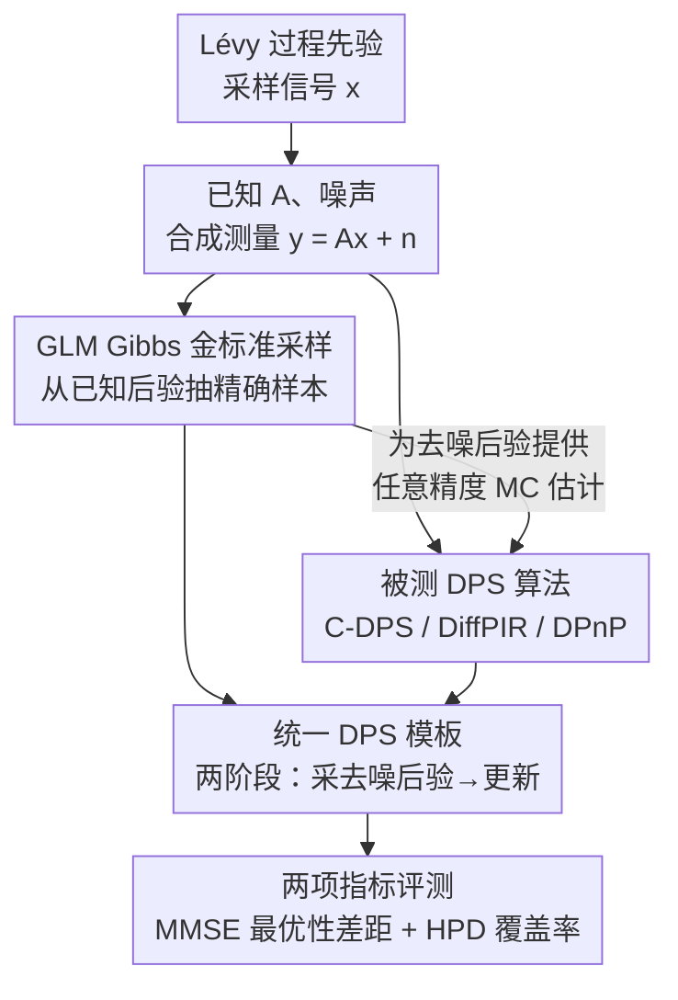

# A Statistical Benchmark for Diffusion-Posterior-Sampling Algorithms

**会议**: ICLR2026  
**OpenReview**: [https://openreview.net/forum?id=zDI2G8t0of](https://openreview.net/forum?id=zDI2G8t0of)  
**代码**: https://github.com/zacmar/dps-benchmark  
**领域**: 扩散模型 / 图像恢复 / 贝叶斯反问题 / Benchmark  
**关键词**: 扩散后验采样, 线性反问题, Gibbs 采样, 后验校准, MMSE 最优性

## 一句话总结
这篇论文为扩散后验采样（DPS）算法造了一把"标准尺"：用可以精确 Gibbs 采样的 Lévy 过程信号作为测试分布，拿到分布级别的"金标准"后验样本，再用 MMSE 最优性差距和后验覆盖率两项指标，把主流 DPS 算法（C-DPS / DiffPIR / DPnP）放在去噪、去卷积、缺失填补、部分傅里叶重建四类反问题上系统评测，结论是这些算法普遍**没有校准**。

## 研究背景与动机
**领域现状**：扩散模型因为能刻画复杂分布，被广泛拿来当贝叶斯反问题的先验——给定测量 $y = Ax + n$，想从后验 $p_{X|Y=y}$ 里采样来重建信号 $x$。这一类方法统称 DPS（diffusion-posterior-sampling）算法，在 MRI/CT 重建、去模糊、天气去伪影、蛋白设计、金融时间序列去噪等场景都拿到了 SOTA 或接近 SOTA 的成绩。

**现有痛点**：扩散先验天然缺一个把测量信息注入采样过程的机制——前向过程已知 $Y$ 和 $X_0$ 的关系，但很难刻画 $Y$ 和任意时刻 $X_t$ 的关系，于是各家算法只能对似然分数 $\nabla \log p_{Y|X_t}$ 做各种近似。问题是：**怎么判断这些近似到底好不好**？目前评测只有两条路，且都不靠谱。第一条是用下游感知指标（SSIM、FID、LPIPS），但 Pierret & Galerne、Cardoso 等人早就指出这些指标根本不适合衡量"后验采样"的统计质量。第二条是退回到极简的合成设定——用有限分量的高斯混合先验，但高斯混合是轻尾的（尾部按最宽分量指数衰减），无法复现真实资产收益、自然图像统计里那种幂律重尾极值。

**核心矛盾**：评测一个后验采样算法，本质上需要一个**已知的真值后验**做对照；但真实场景里后验是算不出来的，而能算的合成场景（高斯混合）又太简单，会**系统性高估**后验质量，把真实算法的缺陷掩盖掉。在医学影像、遥感、金融这种高风险场景，重建结果和它的不确定度一旦被高估，决策代价很大。

**本文目标**：造一个"既现实又可精确求解"的统计 benchmark——测试信号要有重尾等真实统计特性，同时它的后验又必须能拿到金标准样本，从而把算法误差从学习组件误差里**剥离**出来。

**切入角度**：作者盯上了**离散化 Lévy 过程**这类信号。它们由独立同分布的增量驱动，先验可以写成增量上的乘积形式 $p_X(x) = \prod_k p_U([Dx]_k)$；增量分布可选高斯/拉普拉斯/Student-t/Bernoulli-Laplace，后三者天然重尾或稀疏，比高斯混合现实得多。更关键的是，这类后验虽然非共轭、没有闭式解，却**存在高效的 Gibbs 采样器**能给出精确（金标准）样本。

**核心 idea**：用"可精确 Gibbs 采样的 Lévy 过程后验"当金标准，对 DPS 算法做**分布级别**的直接比对；并且把同一套 Gibbs 方法塞进反向扩散去采样"去噪后验"，从而给算法所需的各种量（MMSE 去噪器、它的 Jacobian）提供任意精度的 Monte Carlo 估计，实现算法误差与学习误差的解耦。

## 方法详解

### 整体框架
整个 benchmark 的运转逻辑是：先合成一个**分布已知**的测试信号 $x$（采样自某个 Lévy 过程先验），用已知前向算子 $A$ 和已知噪声模拟出测量 $y = Ax + n$；这样后验 $p_{X|Y=y} \propto \exp(-\frac{1}{2\sigma_n^2}\|Ax-y\|^2)\,p_X(x)$ 的两个组成部分（似然、先验）都是已知的。然后兵分两路：一路用**高效 Gibbs 方法**从这个后验里抽出"金标准"样本；另一路让被测的 DPS 算法在同一个 $(y, A)$ 上跑出它自己的后验样本。最后用两组样本做**分布级别**的对照，落地成两个具体指标（MMSE 最优性差距、最高后验密度覆盖率）。

这套框架还有一个画龙点睛之处：Gibbs 方法不仅能采样"原始反问题的后验"，还能采样反向扩散里每一步的**去噪后验** $p_{X_0|X_t=x_t}$（此时前向算子退化为单位阵、测量是带噪中间量 $x_t$、噪声方差跟着扩散时间表走）。这意味着 DPS 算法里所有原本要靠神经网络近似的量（MMSE 去噪器 $\mathbb{E}[X_0|X_t]$ 及其 Jacobian），都能换成任意精度的 Monte Carlo 估计，从而把"算法本身的近似误差"和"学习组件的逼近误差"彻底拆开。

### 关键设计

**1. Lévy 过程测试信号：用可精确求解的重尾先验取代高斯混合**

痛点很直接——合成评测必须有"已知真值后验"，但高斯混合先验太轻尾、会高估后验质量。作者改用离散化 Lévy 过程：信号 $x$ 由独立同分布的增量 $u = Dx$ 决定（$D$ 是有限差分矩阵，$x = D^{-1}u$，$D^{-1}$ 是全 1 下三角阵），于是先验写成乘积形式 $p_X(x) = \prod_{k=1}^d p_U([Dx]_k)$。增量分布 $p_U$ 选高斯、拉普拉斯、Student-t、Bernoulli-Laplace（尖峰-平板）四种，后三者按 Unser & Tafti 的稀疏过程分类属于稀疏/重尾，能复现资产收益、自然图像列那种幂律极值（论文用 AAPL 日内对数价格和自然图像列做了实证对照）。这个先验既现实又结构良好：乘积形式恰好能套进下一条的 Gibbs 框架，让后验可精确采样。

**2. GLM Gibbs 金标准采样器：给非共轭后验拿到精确样本**

有了先验还不够，关键是后验 $p_{X|Y=y}(x) \propto \exp(-\frac{1}{2\sigma_n^2}\|Ax-y\|^2)\prod_k p_U([Dx]_k)$ 在 $p_U$ 非高斯时**非共轭**，没有闭式采样也没法直接算矩。作者的办法是利用高斯、拉普拉斯、Student-t 都能写成**无限分量高斯混合**的潜变量表示，套进 Kuric 等人的高斯潜机（Gaussian Latent Machine, GLM）。具体把后验重写成统一形式 $p(x) \propto \prod_{k=1}^{m+d} \phi_k([Kx]_k)$，其中 $K = [A; D]$，前 $m$ 个 $\phi_k$ 是似然的高斯因子、后 $d$ 个是增量先验。引入潜变量 $Z$ 后，Gibbs 交替采样两个条件分布：$X|Z=z$ 是个高斯，协方差 $\Sigma(z) = (K^\top \Sigma_0(z)^{-1} K)^{-1}$、均值 $\mu(z) = \Sigma(z) K^\top \Sigma_0(z)^{-1}\mu_0(z)$；$Z|X=x$ 则拆成 $n$ 个独立的一维条件采样。Bernoulli-Laplace 因为带二元支撑指示+拉普拉斯幅度两个潜变量、采样嵌套更深，作者沿用并改造了 Bohra 等人的算法，还为它做了重度工程优化（定制 CUDA/Triton 采样核 + Woodbury–Sherman–Morrison 增量更新），相对基线实现累计提速 **74.61×**，把单次 Gibbs 迭代从 101.48 s 压到 1.36 s——这是把 Gibbs 嵌进扩散循环后能跑出可接受运行时的前提。这套 Gibbs 方法**无参、无偏、高效**，正好当金标准。

**3. 统一 DPS 模板：把不同算法纳入同一两阶段抽象，并接入金标准去噪后验**

不同 DPS 算法的更新规则五花八门——有的在反向扩散里近似似然分数，有的（如 DPnP）干脆跳出这个范式交替采样去噪后验和近端问题。为了能公平评测，作者把 DPS 迭代抽象成统一的两阶段模板（Algorithm 2）：给定当前迭代 $x_t$（噪声方差 $\sigma_t^2$），(i) 先从去噪后验 $p_{X_0|X_t=x_t} \propto \exp(-\frac{1}{2\sigma_t^2}\|\cdot - x_t\|^2)p_{X_0}(\cdot)$ 抽 $S$ 个样本 $\{\bar{x}_k\}$；(ii) 再用更新算子 $\mathcal{S}$ 结合 $x_t$、这些样本、测量 $y$、算子 $A$ 和内部参数 $\lambda$ 算出 $x_{t-1}$。关键在于：算法需要的任何统计量都能从这 $S$ 个样本里算——大多数方法用均值 $\bar{\mu} = \frac{1}{S}\sum_k \bar{x}_k$（即 $\mathbb{E}[X_0|X_t]$ 的 MC 估计）；C-DPS 需要 Jacobian，论文证明它（在已知缩放下）等于条件协方差，可用无偏估计 $\frac{1}{S-1}\sum_k(\bar{x}_k-\bar{\mu})(\bar{x}_k-\bar{\mu})^\top$；DPnP 则用单样本 $\bar{x}_1$。由于去噪后验始终是 sub-Gaussian，这些 MC 估计收敛性好（估协方差到给定精度的复杂度仅随维度线性增长）。把金标准 Gibbs 样本接进这一步，就能把学习组件**整体替换**成任意精度的 MC 量，干净地隔离误差来源。

**4. 两项统计指标：MMSE 最优性差距 + HPD 覆盖率**

有了金标准样本，benchmark 落地成两个互补的指标。第一个是 **MMSE 最优性差距**（单位 dB，越低越好，0 为完美）：$10\log_{10}\big(\|\hat{x}_{\text{est}}(y)-x\|^2 / \|\hat{x}^{\text{Gibbs}}_{\text{MMSE}}(y)-x\|^2\big)$，分母是金标准 Gibbs 给出的 MMSE 估计误差，分子是被测方法的误差，衡量算法离"理论最优点估计"差几个数量级。第二个是**最高后验密度（HPD）覆盖率**：对每个 $(x,y)$，按真值（未归一化）对数后验 $\log p_{X|Y=y}$ 给样本排序，取 $\lceil\alpha N_{\text{samples}}\rceil$ 位置的对数后验当阈值，若 $\log p_{X|Y=y}(x)$ 超过该阈值就算"覆盖"，整个测试集上被覆盖的比例就是覆盖率。一个**校准良好**的采样器在水平 $\alpha$ 上覆盖率应当约等于 $\alpha$：低于 $\alpha$ 说明样本过度聚集在众数附近（低估不确定度），高于 $\alpha$ 说明样本太发散。这两项一个查点估计准不准、一个查不确定度校不校准，正好补上感知指标查不到的统计维度。

### 损失函数 / 训练策略
本文不训练新模型——它是 benchmark。学习版 DPS 用的去噪器单独离线训练（细节在附录），所有方法的超参（含模型基线 $\ell_1/\ell_2$ 的 $\lambda$、各 DPS 算法的内部参数）都在验证集上**按算法、增量分布、前向算子分别网格搜索**，调到学习版去噪器上的参数记作带星号 $\lambda^\star$。这种"分别调参"保证横向比较公平。

## 实验关键数据

实验用 $d=64$ 维信号，四类反问题：去噪、去卷积、缺失填补、部分傅里叶重建；测试 6 种增量分布。对照方法含模型基线 $\ell_1$/$\ell_2$（即 Lévy 过程拉普拉斯/高斯增量的 MAP 估计）和三种 DPS 算法（C-DPS、DiffPIR、DPnP），$N_{\text{samples}}=50$。

### 主实验

MMSE 最优性差距（dB，越低越好，0 为完美；DPS 算法中加粗为最优）。节选去噪与去卷积：

| 任务 | 方法 | Gauss(0,0.25) | Laplace(1) | BL(0.1,1) | St(1) |
|------|------|------|------|------|------|
| 去噪 | C-DPS | 0.12 | 0.12 | 2.22 | 3.26 |
| 去噪 | **DiffPIR** | 0.16 | 0.09 | **0.72** | **0.93** |
| 去噪 | DPnP | 0.24 | 0.11 | 1.33 | 1.19 |
| 去噪 | $\ell_2$ 基线 | 0.00 | 0.16 | 8.61 | 3.25 |
| 去卷积 | C-DPS | 0.12 | 0.12 | 4.30 | 18.30 |
| 去卷积 | **DiffPIR** | 0.07 | 0.07 | **1.09** | **10.45** |
| 去卷积 | DPnP | 0.10 | 0.13 | 1.71 | 7.84 |
| 去卷积 | $\ell_2$ 基线 | 0.00 | 0.07 | 6.11 | 21.50 |

可以看到：高斯增量下 $\ell_2$ 基线几乎完美（0.00），因为此时 MMSE 与 MAP 重合，正好**验证了 benchmark 实现的正确性**；后验均值平滑时（缺失填补、部分去卷积）$\ell_2$ 常优于 DPS；后验近似分段常数时（稀疏增量去噪）$\ell_1$ 更好。DPS 算法里 DiffPIR 通常最强，在去卷积、缺失填补、部分傅里叶上常超过两个模型基线；在尖峰-平板（Bernoulli-Laplace）设定下 DPS 全面碾压模型基线。

### 替换金标准组件后的变化

| 算法 | 把学习组件换成金标准 MC 估计后（不重新调参） |
|------|------|
| DPnP | 性能**显著提升**：St(1) 缺失填补的最优性差距下降 10.46 dB（去噪后验质量越高它越好） |
| C-DPS / DiffPIR | 可能**变差**：DiffPIR 在 St(1) 缺失填补上沿用旧参数反而恶化 13.56 dB，但稍微在验证集手调超参又能比学习版好近 10 dB |

### 关键发现
- **DPnP 对去噪器质量"自动增益"**：换上更准的去噪后验样本、不重新调参就能变好，说明它对去噪器质量的依赖是良性的；C-DPS/DiffPIR 则把超参和具体去噪器**耦合**了，换去噪器必须重调。
- **点估计 vs 样本质量的根本张力**：后验样本保留高频结构、反映先验变异性，而 MMSE 点估计（样本平均）平滑得多——这解释了为什么 DPS 在感知指标上分高、而回归式方法在 PSNR 等失真指标上分高。作者据此建议**明确贝叶斯目标**（要点估计还是要样本质量）再选评测协议。
- **普遍未校准（核心结论）**：DPS 算法的覆盖率几乎总是远小于 $\alpha$，即样本过度聚集、低估不确定度。C-DPS/DiffPIR 的覆盖率几乎都是 0（仅 BL(0.1,1) 和 St(1) 例外，C-DPS 此时接近 1、DiffPIR 不稳定）；DPnP 的覆盖率最接近 $\alpha$ 但通常仍偏小。这和 Thong 等人的观察一致。

## 亮点与洞察
- **"可精确求解的现实先验"是整个工作的支点**：Lévy 过程同时满足"重尾现实"和"后验可 Gibbs 精采样"两个看似矛盾的要求，这正是高斯混合给不了的——选对测试分布比设计花哨指标更重要。
- **误差解耦的思路可迁移**：把"算法近似误差"和"学习组件逼近误差"通过任意精度 MC 估计拆开，是评测任何"近似+学习"混合方法的通用范式，不止 DPS，作者也点名可推广到 flow-matching 先验的采样算法。
- **统一 DPS 模板有独立价值**：两阶段抽象（采去噪后验 → 更新）把 C-DPS/DiffPIR/DPnP 乃至跳出常规范式的 DPnP 都纳进同一框架，本身就是理解这一族算法的好视角；而且金标准 Gibbs 让那些"需要从去噪后验抽单样本"的算法不必跑整条反向扩散，评测起来快得多。
- **"未校准"这个结论很有分量**：它说明当前 DPS 在不确定度量化上系统性失真，对医学/遥感等高风险场景是实打实的警示，也给后续"做校准的 DPS 算法"指明了一个可量化的改进目标。

## 局限与展望
- **维度受限**：实验只到 $d=64$ 的一维信号。作者坦承高维主要瓶颈在 Gibbs 里采样高维高斯，虽然可用 perturb-and-MAP + 无矩阵共轭梯度缓解，但能否扩到真实 2D 图像规模仍需验证。
- **线性+高斯噪声为主**：框架虽宣称支持非高斯似然，但金标准采样器目前只覆盖特定情形；非线性测量模型、非高斯噪声的高效采样器仍是开放难题，需要社区补齐才能即插即用。
- **只评了三种 DPS 算法**：C-DPS/DiffPIR/DPnP 虽覆盖了"需去噪样本/需 MMSE/需 Jacobian"三类，但 CSGM 类等其他算法没纳入（作者说明它们多半不以后验采样为目标）。
- **改进方向**：把 benchmark 推到 2D 图像、接入更一般的非线性反问题采样器、并基于"未校准"结论设计显式校准的 DPS 算法，都是自然的下一步。

## 相关工作与启发
- **vs Crafts & Villa / Cardoso / Boys（高斯混合先验评测）**: 他们也系统评测 DPS 并提供参考量保证公平，但都建在有限分量高斯混合先验上——轻尾、无法复现幂律极值，会高估后验质量；本文换成重尾 Lévy 过程先验，评测更接近真实统计。
- **vs Thong 等人（覆盖率检验）**: 同样查可信区域的覆盖、也发现 DPS 低估不确定度，但他们用经验图像分布当先验的替身（真值先验未知）；本文先验完全已知、后验有金标准，覆盖率检验更严格。
- **vs Bohra 等人（Gibbs 金标准）**: 本文复用了他们的高效 Gibbs 思路，但 Bohra 主攻"不同参数量的神经 MMSE 估计器质量"，本文把它扩展到**分布级别**的后验比对。
- **vs Pierret & Galerne（高斯先验闭式分析）**: 他们在高斯先验下推导反向 SDE 的闭式解和 Wasserstein 界，本文不限于高斯共轭、靠数值金标准覆盖更广的非共轭重尾先验。

## 评分
- 新颖性: ⭐⭐⭐⭐⭐ 用"可精确 Gibbs 采样的重尾 Lévy 先验"做金标准评测，思路精巧且填补了 DPS 缺统计基准的空白
- 实验充分度: ⭐⭐⭐⭐ 四类反问题 × 六种增量分布 × 三算法系统评测，含误差解耦与覆盖率分析；但维度受限于 $d=64$ 一维信号
- 写作质量: ⭐⭐⭐⭐⭐ 动机—框架—指标—结论逻辑清晰，统一 DPS 模板抽象到位
- 价值: ⭐⭐⭐⭐⭐ 开源可贡献的 benchmark + "DPS 普遍未校准"的硬结论，对反问题/不确定度量化社区有持续价值

<!-- RELATED:START -->

## 相关论文

- [\[ICLR 2026\] CL-DPS: A Contrastive Learning Approach to Blind Nonlinear Inverse Problem Solving via Diffusion Posterior Sampling](cl-dps_a_contrastive_learning_approach_to_blind_nonlinear_inverse_problem_solvin.md)
- [\[ICLR 2026\] LearnIR: Learnable Posterior Sampling for Real-World Image Restoration](learnir_learnable_posterior_sampling_for_real-world_image_restoration.md)
- [\[ICML 2026\] Triadic Dynamics Aware Diffusion Posterior Sampling for Inverse Problems: Optimizing Guidance and Stochasticity Schedules](../../ICML2026/image_restoration/triadic_dynamics_aware_diffusion_posterior_sampling_for_inverse_problems_optimiz.md)
- [\[ICLR 2026\] Adaptive Moments are Surprisingly Effective for Plug-and-Play Diffusion Sampling](adaptive_moments_are_surprisingly_effective_for_plug-and-play_diffusion_sampling.md)
- [\[NeurIPS 2025\] Improving Diffusion-based Inverse Algorithms under Few-Step Constraint via Learnable Linear Extrapolation](../../NeurIPS2025/image_restoration/improving_diffusion-based_inverse_algorithms_under_few-step_constraint_via_learn.md)

<!-- RELATED:END -->
