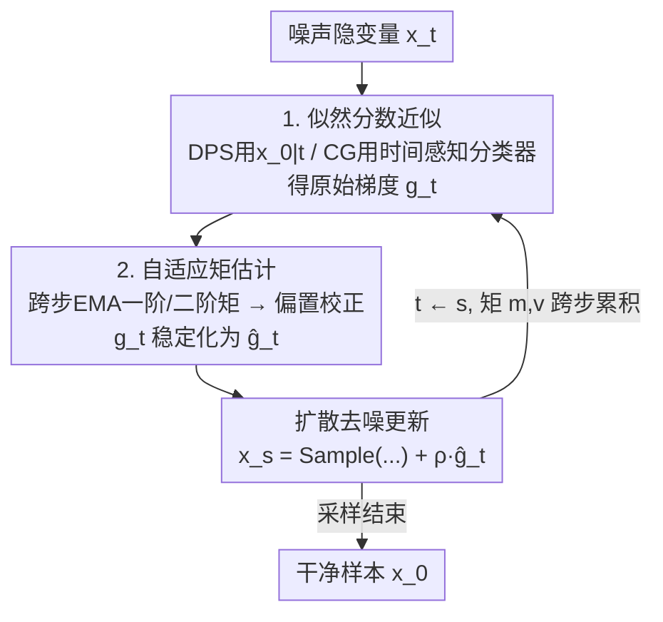

# Adaptive Moments are Surprisingly Effective for Plug-and-Play Diffusion Sampling

**会议**: ICLR2026  
**OpenReview**: [https://openreview.net/forum?id=qYDObsHldZ](https://openreview.net/forum?id=qYDObsHldZ)  
**代码**: https://github.com/christianbelardi/adam-guidance  
**领域**: 扩散模型 / 图像恢复  
**关键词**: 即插即用引导, 扩散采样, 似然分数, Adam, 逆问题

## 一句话总结
把优化器里的 Adam 自适应矩估计直接搬到扩散采样的引导梯度上——对跨采样步的似然分数估计维护一阶/二阶矩的指数滑动平均，几乎零额外成本就把 DPS、CG 这类即插即用引导方法的噪声梯度稳住，在图像恢复（超分/去模糊/补全）和类别条件生成上反超一众更复杂、更慢的方法。

## 研究背景与动机
**领域现状**：扩散模型的即插即用（plug-and-play）条件生成，指的是只用在边缘分布 $p(x)$ 上训练的无条件扩散模型，去采样某个条件分布 $p(x\mid y)$（$y$ 可以是低分辨率图、模糊核、分类标签等），全程不为具体任务重训。其数学骨架是贝叶斯分解：后验分数 = 先验分数 + 似然分数，

$$\nabla_{x_t}\log p(x_t\mid y) = \nabla_{x_t}\log p(x_t) + \nabla_{x_t}\log p(y\mid x_t).$$

先验分数由扩散网络 $\epsilon_\theta$ 直接给出，难点全在似然分数 $\nabla_{x_t}\log p(y\mid x_t)$。

**现有痛点**：似然分数需要对所有能生成 $x_t$ 的干净样本 $x_0$ 做积分 $p(y\mid x_t)=\int p(y\mid x_0)\,p(x_0\mid x_t)\,dx_0$，一般不可解，只能近似。DPS 用去噪网络的点估计 $x_{0\mid t}$ 替代积分，CG 则训练一个时间感知分类器直接吃噪声隐变量。但无论哪种近似，估出来的似然分数都**噪声极大**——既因为条件信息有限，又因为要穿过大网络反传梯度。

**核心矛盾**：以往整条文献线（DPS → UGD → TFG）都在卷"怎么把单步的似然分数近似得更准"，越做越复杂——拼蒙特卡洛平滑、拼数据空间/隐空间双重梯度、拼递归重访 timestep。可这些复杂方法在条件信号变弱（如 16× 超分而非 4×）时会迅速崩坏，甚至跌破最朴素的 DPS。问题的根本被忽略了：噪声不是单步精度问题，而是**跨步之间引导方向自相矛盾**——本文实测发现 DPS 相邻两步的引导梯度余弦相似度大半时间为负，等于自己跟自己打架。

**本文目标**：不再去抠单步近似得多准，而是问一个正交的问题——**能不能用更早采样步的信息，去抵消后续步的近似误差**？

**切入角度**：这恰好就是随机优化里 Adam/RMSProp 解决的事。随机梯度也是又吵又抖，Adam 用一阶矩（动量）平滑轨迹、用二阶矩（自适应步长）按历史方差缩放更新。扩散采样的逐步引导更新本质上就是在对似然项做梯度下降（见下文公式），那把 Adam 直接套上去为什么不行？

**核心 idea**：把似然分数估计当成"待优化的随机梯度"，跨采样步对它做 Adam 式自适应矩估计——既抑噪又保住引导信号，简单到几行代码，却出奇地有效。

## 方法详解

### 整体框架
即插即用采样的每一步，本质是在标准退火 Langevin 去噪更新里，把先验分数换成"先验 + 似然"的后验分数。把先验分数用 $s_\theta$ 近似、似然分数用 DPS 或 CG 的近似 $-\nabla\mathcal{L}(\cdot)$ 替入，采样更新写成：

$$x_s = x_t + (\sigma_t^2-\sigma_s^2)\big[s_\theta(x_t,t) - \nabla\mathcal{L}(\cdot)\big] + \sqrt{\sigma_t^2-\sigma_s^2}\,\tfrac{\sigma_s}{\sigma_t}\,\epsilon.$$

可以看到，方括号里的 $-\nabla\mathcal{L}(\cdot)$ 就是"似然梯度"，整步更新相当于在每个 timestep 对似然目标做一步梯度下降——这正是 Adam 能介入的口子。本文的改造极小：在算出原始似然梯度 $g_t=-\nabla\mathcal{L}(\cdot)$ 之后、用它更新样本之前，插入一个"自适应矩估计"模块，把 $g_t$ 替换成稳定化后的 $\hat g_t$，其余采样流程原样不动。套到 DPS 上叫 AdamDPS，套到 CG 上叫 AdamCG。

### 关键设计

**1. 跨采样步的自适应矩估计：把 Adam 直接当成引导梯度的稳压器**

针对的痛点是似然分数估计噪声大、相邻步方向打架。做法是仿照 Adam，对似然梯度 $g_t=-\nabla\mathcal{L}(\cdot)$ 及其逐元素平方维护两条指数滑动平均（$k$ 是跨采样步的步计数器）：

$$m_k = \beta_1 m_{k-1} + (1-\beta_1)g_t,\qquad v_k = \beta_2 v_{k-1} + (1-\beta_2)g_t^2,$$

再做偏置校正 $\hat m_k = m_k/(1-\beta_1^k)$、$\hat v_k = v_k/(1-\beta_2^k)$，最终稳定化的引导梯度为

$$\hat g_t = \frac{\hat m_k}{\sqrt{\hat v_k}+\delta}.$$

两个矩各司其职：一阶矩 $\hat m_k$（动量）把跨步的梯度信息累加起来，平滑掉随机抖动、让引导沿着一致方向稳步推进；二阶矩 $\hat v_k$ 按每个分量的历史方差自适应缩放步长——某个坐标历史上抖得厉害就缩小它的更新，抖得小就放大。这一点对扩散尤其关键：似然分数的尺度会随噪声水平 $\sigma_t$ 在不同 timestep 间剧烈变化，固定步长很难全程都合适，而二阶矩天然做了逐步、逐坐标的归一化。机制上为什么有效，论文给了直接证据：DPS 相邻步引导梯度余弦相似度多数为负（自相矛盾），而 AdamDPS 全程保持正余弦相似度，更新方向连贯，因此能稳定逼近目标而不是来回震荡。

**2. AdamDPS 与 AdamCG：同一招套在两类近似上，注入点略有不同**

DPS 用去噪点估计 $x_{0\mid t}=x_t-\sigma_t\epsilon_\theta(x_t,t)$ 替代积分，似然分数近似为 $-\nabla_{x_t}\mathcal{L}(f_\phi(x_{0\mid t}),y)$，引导模型 $f_\phi$ 可以是任意作用在干净数据上的可微函数（预训练分类器或高斯模糊核这类解析前向算子），但需要穿过去噪网络反传。CG 则训练一个时间感知分类器 $f_\phi(x_t,t)$ 直接吃噪声隐变量，似然分数近似为 $-\nabla_{x_t}\mathcal{L}(f_\phi(x_t,t),y)$，省掉点估计但要额外训分类器。

两个算法都把第 1 节的矩估计夹在"算梯度"和"更新样本"之间，区别仅在稳定化梯度 $\hat g_t$ 怎么注入采样：AdamDPS 把 $\rho\hat g_t$ 直接加到去噪采样结果上（$x_s=\text{Sample}(x_{0\mid t},x_t,t,s)+\rho\hat g_t$）；AdamCG 因为引导作用在隐变量上，把 $\rho\hat g_t\sigma_t^2$ 加进去噪估计再采样（$x_s=\text{Sample}(x_{0\mid t}+\rho\hat g_t\sigma_t^2,\,x_t,t,s)$）。$\rho$ 是引导强度。这说明该稳压器是"模型无关"的轻量插件——只要某个引导方法的核心是逐步对似然梯度做下降，就能接上，几乎不挑近似策略。

**3. 任务难度作为评测维度：揭穿"复杂方法在弱条件下反而更差"**

这不是算法组件，而是本文方法学层面的关键设计——主张现有 plug-and-play 评测过于偏爱"温和退化"（如 4× 超分这种条件信号很强的设定），掩盖了复杂方法的脆弱。本文系统地把难度拉满（4×→16× 超分、模糊强度 3→12），用相对 DPS 的提升作为统一标尺。结论很硬：随难度上升，TFG 等复杂方法只在最容易的一两档能赢 DPS，到最难档反而跌破 DPS；而 AdamDPS 在所有难度上都稳定优于 DPS，且优势随难度增大而更明显。这把"该不该信一个引导方法"从单点数字变成了跨难度的鲁棒性曲线，是本文反复强调"需要更全面评测标准"的依据。

### 损失函数 / 训练策略
方法本身**无需任何训练**——只在采样推理阶段改动引导梯度，扩散网络与（DPS 用的）引导模型都是现成的。唯一新增超参是 Adam 的 $\beta_1,\beta_2$ 与数值稳定项 $\delta$；所有对比方法（含本文）统一用贝叶斯优化在 32 张留出图上调参，重建任务以 LPIPS 为目标，类别条件生成以 CMMD 为目标（因为直接调准确率会诱导生成对抗样本）。

## 实验关键数据

### 主实验
数据集：ImageNet、CIFAR-10、Cats（Cats vs. Dogs 子集）。重建任务三档：16× 超分、模糊强度 12 的高斯去模糊、90% 随机掩码补全。对比 LGD / MPGD / RED-diff / DPS / UGD / TFG。

| 任务 | 指标 | 本文 (AdamDPS/AdamCG) | 之前最好 | 说明 |
|------|------|------|----------|------|
| ImageNet/Cats 三项重建 | LPIPS + FID（越低越好） | 全面最优 | DPS 多为次优 | 难设定下复杂方法退化，DPS 反而稳居第二 |
| CIFAR-10 类别条件 | 分类准确率 | 比次优 DPS **高 9.86 分** | DPS | — |
| ImageNet 类别条件（标准分类器） | Top-10 准确率 | **10.49%** | ≈1%（等同随机） | 除 AdamDPS 外所有方法都接近随机 |
| ImageNet 类别条件（时间感知分类器） | 分类准确率 | 比 CG **高 19+ 分** | CG | AdamCG vs CG |

### 消融实验

| 配置 | 关键发现 | 说明 |
|------|---------|------|
| AdamDPS（完整） | 各任务最优 | 一阶+二阶矩齐全 |
| $\beta_1=0$（去动量） | 全任务掉点 | 缺动量则方向不连贯 |
| $\beta_2=0$（去自适应缩放） | 全任务掉点 | 缺二阶矩则跨噪声水平步长失配 |
| 采样步数 12/25/50/100（DDPM & DDIM） | 各步数预算下都稳超 DPS | TFG 仅在低步数才有竞争力 |
| Wall clock（H100, 100 步, batch 8） | 相比 DPS 几乎零额外开销 | 远快于 TFG（其梯度计算随 $N_{\text{recur}}(1+N_{\text{iter}})$ 放大） |

### 关键发现
- **两个矩缺一不可**：去掉动量或去掉自适应缩放都会掉点，且二者相对重要性随任务而变——补全更吃动量、超分更吃自适应缩放。
- **方向连贯性是机制核心**：DPS 相邻步引导梯度余弦相似度大半为负（自相矛盾），AdamDPS 始终为正；采样轨迹可视化也显示 AdamDPS 更直地奔向真值，DPS 容易跑偏。
- **低终端 loss ≠ 好重建**：16× 超分时 TFG 末段把引导 loss 压得最低，重建质量却最差——它过拟合到稀疏的低分辨率信号上，产生可见伪影；说明条件信息匮乏时"过度优化"是有害的。
- **难任务才见真章**：在标准分类器的 ImageNet 类别条件这种极难设定下，DPS 和 TFG 都几乎压不下引导 loss、准确率接近随机，唯独 AdamDPS 能慢启动后加速、把 loss 真正降下来。

## 亮点与洞察
- **把成熟优化器原样迁移到采样动力学**：Adam 本是训练时的优化器，本文洞察到"逐步引导更新 = 对似然项做梯度下降"，于是把 Adam 的抑噪机制搬到推理采样里——一个跨领域的、几乎零成本的迁移，却打败了一堆精心设计的复杂引导框架，"surprisingly effective"名副其实。
- **诊断方式很值得借鉴**：用相邻步引导梯度的余弦相似度来量化"引导是否自相矛盾"，把"为什么有效"落到可观测信号上，而不是只甩准确率。这套诊断可迁移到任何带迭代引导/反馈的生成或采样方法。
- **评测方法学的提醒**：温和退化设定会系统性高估复杂方法；按难度扫描相对提升，能更诚实地暴露鲁棒性。这对整条 plug-and-play 引导文献的 benchmark 设计是有价值的批评。

## 局限与展望
- 方法本质是"梯度稳压器"，**上限受底层近似（DPS/CG）约束**——它让现有近似更稳，但并不提供更准的似然分数本身；若底层近似在某类条件上结构性偏差，矩估计也救不回来。
- $\beta_1,\beta_2$ 需逐任务调（论文用贝叶斯优化），不同任务对动量/自适应缩放的偏好不同，缺一套免调或自适应设定。
- 跨采样步维护矩，隐含假设"相邻步的似然梯度在同一坐标系下可累积"；在隐空间/数据空间反复切换或非常规噪声调度下，这个假设是否仍成立、矩该怎么对齐，论文未深究。
- 实验集中在图像逆问题与类别条件生成，是否能迁到文本到图像、分子设计等高维强结构条件上仍待验证。

## 相关工作与启发
- **vs DPS**：DPS 用点估计 $x_{0\mid t}$ 近似似然分数、每步独立做一次引导；本文不改这个近似，只在其梯度上叠加跨步 Adam 稳压，几乎零成本就把 DPS 的"自相矛盾"问题治好——是对 DPS 的正交增强而非替代。
- **vs CG（Classifier Guidance）**：CG 训练时间感知分类器直接给噪声隐变量打分；本文 AdamCG 同样只在其引导梯度上套 Adam，准确率反超 CG 19+ 分。
- **vs UGD / TFG**：这两者走的是"组合更多算法组件 + 递归重访 timestep"的复杂路线（TFG 把 DPS/MPGD/LGD/UGD/FreeDoM 统一进一个框架并引入大量超参与调度）。本文反其道而行——不加组件、不加递归，用单一轻量稳压器，在难任务与低步数预算下都更稳更快，揭示"复杂度并非提升的必要条件"。
- **vs LGD / MPGD**：LGD 用蒙特卡洛平滑稳定 DPS 似然分数，MPGD 在数据空间直接优化 $x_{0\mid t}$ 以绕开穿网络反传；它们与本文都想"稳住引导"，但本文的切口是时间维度（跨步矩估计）而非单步的平滑或投影。

## 评分
- 新颖性: ⭐⭐⭐⭐ 想法极简（搬 Adam）但角度正交、洞察扎实，属于"显然之后才显然"的好点子
- 实验充分度: ⭐⭐⭐⭐⭐ 合成+真实双线、多数据集多任务、难度/步数/超参/wall clock/轨迹与余弦诊断一应俱全
- 写作质量: ⭐⭐⭐⭐⭐ 动机—机制—证据闭环清晰，诊断图说服力强
- 价值: ⭐⭐⭐⭐ 即插即用、零训练、几乎零开销，可直接增强现有引导方法，并附带有价值的评测方法学批评

<!-- RELATED:START -->

## 相关论文

- [\[ICLR 2026\] Taming Score-Based Denoisers in ADMM: A Convergent Plug-and-Play Framework](taming_score-based_denoisers_in_admm_a_convergent_plug-and-play_framework.md)
- [\[CVPR 2026\] PnP-CM: Consistency Models as Plug-and-Play Priors for Inverse Problems](../../CVPR2026/image_restoration/pnp-cm_consistency_models_as_plug-and-play_priors_for_inverse_problems.md)
- [\[ICLR 2026\] A Statistical Benchmark for Diffusion-Posterior-Sampling Algorithms](a_statistical_benchmark_for_diffusion-posterior-sampling_algorithms.md)
- [\[ECCV 2024\] BrushNet: A Plug-and-Play Image Inpainting Model with Decomposed Dual-Branch Diffusion](../../ECCV2024/image_restoration/brushnet_a_plug-and-play_image_inpainting_model_with_decomposed_dual-branch_diff.md)
- [\[ICLR 2026\] CL-DPS: A Contrastive Learning Approach to Blind Nonlinear Inverse Problem Solving via Diffusion Posterior Sampling](cl-dps_a_contrastive_learning_approach_to_blind_nonlinear_inverse_problem_solvin.md)

<!-- RELATED:END -->
