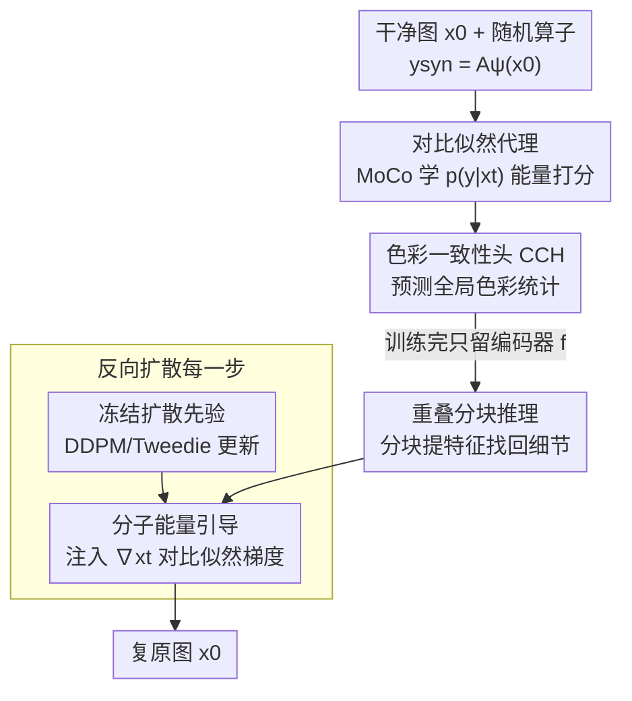

# CL-DPS: A Contrastive Learning Approach to Blind Nonlinear Inverse Problem Solving via Diffusion Posterior Sampling

**会议**: ICLR2026  
**OpenReview**: [https://openreview.net/forum?id=KoLYNHJRBY](https://openreview.net/forum?id=KoLYNHJRBY)  
**代码**: https://anonymous.4open.science/r/CL-DPS-4F5D （匿名仓）  
**领域**: 扩散模型 / 图像复原 / 逆问题求解  
**关键词**: 盲逆问题, 非线性算子, 扩散后验采样, 对比学习, 去模糊

## 一句话总结
CL-DPS 用一个离线训练的对比学习编码器去近似扩散后验采样里那个棘手的似然项 $p(y\mid x_t)$，从而在**不知道、也不估计测量算子参数**的前提下，第一次让扩散模型能解盲**非线性**逆问题（如旋转模糊、缩放模糊），在这些任务上现有方法全部崩溃而它能干净复原，同时在线性盲去模糊上也保持竞争力。

## 研究背景与动机
**领域现状**：逆问题（医学成像、计算摄影、地震成像等）要从被前向算子 $A_\psi(\cdot)$ 退化后的观测 $y$ 里恢复原信号 $x_0$。扩散模型（DM）因为能很好地刻画数据先验 $p(x_0)$，近来成了解逆问题的主力。最实用的范式是「扩散后验采样（DPS）」：拿一个预训练的无条件 DM 当先验，在反向采样的每一步往里注入一个似然引导项 $\nabla_{x_t}\log p(y\mid x_t)$，靠它把采样轨迹往「与观测一致」的方向掰。

**现有痛点**：这套范式有两个叠加的限制。其一，绝大多数 DM 逆问题求解器是**非盲（non-blind）**的——它们假设算子 $A_\psi$ 已知，才能算出似然项；但现实里精确拿到算子往往困难甚至不可能。其二，少数处理**盲（blind）**问题的工作（BlindDPS、GibbsDDRM、Sanghvi 等）虽然不要求已知算子，却**几乎都假设 $A_\psi$ 是卷积算子**，即只能处理**线性**模糊。BlindDPS 还得为模糊算子的参数额外训练一个 DM，进一步限制了通用性。

**核心矛盾**：真实世界里大量盲逆问题的算子是**非线性**的（旋转模糊、缩放模糊——它们不是简单的空间不变卷积）。一旦算子非线性，"把 $A_\psi$ 当卷积去联合估计"这条路从根上就走不通，现有盲求解器在这类任务上会灾难性失败（论文 Figure 1：除 CL-DPS 外所有方法都复原出一片乱码）。

**本文目标**：在既不知道算子形式、又不估计算子参数的前提下，给反向扩散提供一个对线性/非线性都成立的似然引导项。

**切入角度**：作者的关键观察是——DPS 真正需要的只是似然项 $p(y\mid x_t)$ 的**梯度**，而不是算子本身。那能不能跳过"估计算子→算似然"这条链，直接**学一个似然的代理（surrogate）**？对比学习正好是干这个的：InfoNCE 损失本质上就是在估计一个「query 与 positive key 之间」的对数似然比。

**核心 idea**：用一个 MoCo 式对比学习编码器 $f$，在离线阶段、跨大量随机采样的算子上，学出 $p(y\mid x_t)$ 的能量代理；推理时把这个代理的梯度作为 plug-in 引导项插进反向扩散——全程不碰算子参数。

## 方法详解

### 整体框架
CL-DPS 分**离线训练**和**在线采样**两段。离线阶段训练一个辅助编码器 $f$：给定干净图 $x_0$，随机采一个算子参数 $\psi\sim P_\Psi$ 合成测量 $y_{\text{syn}}=A_\psi(x_0)$，再随机采一个扩散时刻 $t$ 得到带噪状态 $x_t$，用 MoCo 式对比目标让 $f$ 学会给 $(x_t, y_{\text{syn}})$ 这对正样本打高分、给字典里的负样本打低分——这等价于在学似然 $p(y\mid x_t)$ 的能量打分。训练时额外挂一个**色彩一致性头（CCH）**修正对比目标对颜色不敏感的毛病，CCH 推理时丢弃。

在线阶段，预训练扩散先验**冻结不动**，只在标准 DDPM/DPS 反向更新的每一步后面加一个对比引导项：把当前状态 $x_t$ 和观测 $y$ 都做**重叠分块**、过编码器 $f$ 提特征，用两者特征内积的梯度 $-\eta\,\nabla_{x_t}\langle f(\{p^{x_t}_j\}), f(\{p^{y}_j\})\rangle$ 推动采样轨迹（Algorithm 1 第 12 行）。这个引导项是 sampler-agnostic 的，能直接接到 DPM-Solver++ 等现代采样器上。

### 关键设计

**1. 对比似然代理：把未知算子下的 $p(y\mid x_t)$ 变成离线可学的能量打分**

这是全文的核心。盲非线性设定下 $p(y\mid x_t)$ 既无解析式、算子又未知，DPS 引导项无从下手。作者用贝叶斯把它写成 $p(y\mid x_t)=\dfrac{p(y,x_t)}{\int p(\tilde y,x_t)\,d\tilde y}$，再把分子用一个神经编码器 $f$ 的能量打分近似：$p(y,x_t)\propto\exp(\langle f(x_t),f(y)\rangle/\tau)$；分母那个难算的积分用一个足够大的集合 $Y$ 上的有限和去逼近。于是

$$p(y\mid x_t)\approx \frac{\exp(\langle f(x_t),f(y)\rangle/\tau)}{\sum_{\tilde y\in Y}\exp(\langle f(x_t),f(\tilde y)\rangle/\tau)}.$$

最大化它的对数、等价地最小化负对数，正好就是 **InfoNCE 损失**——query 取 $q=f(x_t)$，positive key 取 $k^+=f(y_{\text{syn}})$，负样本取自 MoCo 的动态队列 $Y$。换句话说，标准对比目标天然就是这个似然代理的估计器，MoCo 那个超长队列（默认 $K=65536$）则提供了对总体 $Y$ 的廉价近似。训练时因为测试算子参数未知且会变，作者用从先验 $P_\Psi$ 采的随机算子合成 $y_{\text{syn}}=A_\psi(x_0)$（高斯/运动/旋转/缩放模糊等），让 $f$ 学会**跨一族算子**估计似然。理论上作者给了 Lemma 1：在能量模型假设下，对比对数概率的梯度等于真实似然梯度，并随字典规模 $n\to\infty$ 几乎必然收敛到 $\nabla_{x_t}\log p(y\mid x_t)$——这为「拿对比梯度当 DPS 引导」提供了依据。为什么有效：它彻底绕开了"先估算子再算似然"，把盲问题里最难的部分（未知非线性算子）吸收进一次性的离线训练，推理时只需前向 $f$ 即可拿到引导梯度。

**2. 色彩一致性头（CCH）：补回对比目标对颜色不敏感的缺口**

对比学习为了学到对增广/退化不变的表征，往往会**对颜色信息不敏感**，导致复原图出现明显的色偏（hue/brightness shift）。作者在编码器顶上挂一个轻量两层卷积头 $H_c$，让它去预测输入的**全局色彩统计**——即各通道空间均值 $\big(\mathrm{AP}(x_t)\big)_c=\frac{1}{N_1N_2}\sum_{i,j}x_{t,cij}$，再接全局池化和 sigmoid。色彩一致性损失为 $L_{CC}(x_t)=\lVert H_c(x_t)-\mathrm{AP}(x_t)\rVert_2^2$，与似然代理项合成总损失

$$L_{\text{CL-DPS}}=L_{p(y_{\text{syn}}\mid x_t)}+\lambda\,L_{CC}(x_t).$$

关键之处在于 CCH **只在训练时用、推理时丢弃**：它不改变采样流程，只是在训练阶段把"保留颜色统计"这个约束注入编码器，逼 $f$ 的表征里留住色彩信息，从而在复原时不漂色（Figure 8：去掉 CCH 衣服区域明显变色）。

**3. 重叠分块推理：用互信息下界把卷积编码器压掉的细节找回来**

卷积编码器天生会压缩低层细节（信息瓶颈），而逆问题恰恰需要这些细粒度信息来引导。作者不是整张图过一遍 $f$，而是把图像切成 $L_s$ 个**重叠**的 $n\times n$ 块（步长 $s<n$），逐块过 $f$ 再把特征堆叠起来：$f(\{p^x_j\}_{j\in[L_s]})=[f^\top(p^x_1)\dots f^\top(p^x_{L_s})]^\top$。为什么这样能找回信息，作者给了 Theorem 1：对任意图像，固定块大小、步长，**堆叠越多重叠块、编码特征关于原图的互信息 $I(x;f(\{p^x_j\}))$ 越大**（$U<V$ 时 $I_U\le I_V$），推论里单块是其特例下界。直觉就是：更密的重叠覆盖让编码输出对 $x$ 更"有信息量"，引导信号更稳。注意作者强调这跟已有的 patch-based 扩散先验、null-space 投影（DDNM）不是一回事——他们的分块既不是先验也不是投影，纯粹是给对比似然代理喂更细的局部特征。

**4. 分子能量引导：把代理梯度作为 plug-in 注入反向扩散**

有了 $f$，怎么用？CL-DPS 把它当成一个**即插即用的似然代理**接进标准 DPS（Algorithm 1）：相对无条件采样唯一的改动，就是在每个时刻 $t$ 的 DDPM 更新后加一步对比引导 $x_{t-1}\leftarrow x'_{t-1}-\eta\,\nabla_{x_t}\langle f(\{p^{x_t}_j\}),f(\{p^{y}_j\})\rangle$。这里作者采取「能量引导」视角：把对比打分当成**未归一化**的似然，**只用分子的梯度**（numerator-only），跳过那个要遍历整个字典的分母项。论文给了一个 denominator-aware 的变体（Appendix E），结果质量基本相当但计算开销明显更高——所以默认就用分子版，省算力。因为引导项独立于具体采样器，CL-DPS 能无缝接到 DPM-Solver++ (2M) 等加速采样器上（Remark 3 / Appendix F）。

### 损失函数 / 训练策略
辅助编码器用 InfoNCE 式对比目标 $L_{p(y_{\text{syn}}\mid x_t)}$ 加色彩一致性项 $\lambda L_{CC}$（公式 16）训练，编码器用 MoCo 的动量更新 $\theta_k\leftarrow m\theta_k+(1-m)\theta_q$。默认超参：温度 $\tau=0.07$、引导字典 $|Y|=256$、MoCo 队列 $K=65536$、动量 $m=0.996$、投影维度 $d=128$、块大小 $P=64$、步长 $S=32$。训练有两种模式：**Universal（UNI）**——一个编码器跨所有算子族联合训练；**Specialist（SPE）**——每个算子族（旋转、缩放…）单独训一个编码器，推理时按检测到的族选编码器、但仍把参数 $\psi$ 当未知。整个离线训练是一次性的、零额外标注（全用合成对），单图推理开销与标准 DPS 同量级。

## 实验关键数据
数据集：FFHQ、AFHQ、ImageNet（均 256×256）；指标：PSNR↑、FID↓、LPIPS↓；扩散先验取自 Chung et al. (2022b)。

### 主实验
非线性盲去模糊（旋转 + 缩放）是核心战场——作者明确指出**此前没有任何 DM 方法能做**，因此对比当前最强的线性盲求解器 + 一个经典非 DM 基线。下表为旋转模糊结果（节选）：

| 方法 | FFHQ PSNR↑ | FFHQ FID↓ | AFHQ PSNR↑ | ImageNet PSNR↑ |
|------|-----------|-----------|-----------|----------------|
| **CL-DPS (SPE)** | **22.74** | **33.66** | **21.46** | **20.05** |
| CL-DPS (UNI) | 22.27 | 36.55 | 21.61 | 19.92 |
| FastEM (WACV'24) | 15.96 | 268.4 | 11.57 | 13.90 |
| BlindDPS (CVPR'23) | 16.87 | 343.8 | 13.25 | 11.25 |
| GibbsDDRM (ICML'23) | 18.43 | 236.6 | 15.24 | 12.24 |

差距是数量级的：基线 FID 普遍 200–390（基本是噪声/乱码），CL-DPS 只有 33–45。所有 DM 基线在非线性设定崩溃，根因就是它们假设 $A_\psi$ 是卷积算子，而这个假设没法靠小修小补救回来。

线性盲去模糊（高斯 + 运动）上，CL-DPS 与 SOTA 持平甚至更优——例如 FFHQ/AFHQ 高斯模糊下它在 PSNR 和 FID 上都领先；运动模糊 FFHQ 上 PSNR 26.33、LPIPS 0.117 也属第一梯队。说明这套框架**不是只会非线性**，而是线性/非线性通吃。

### 消融实验
全部在 CL-DPS (SPE) 上、旋转+缩放三数据集均值。

| 配置 | 关键变化 | 说明 |
|------|---------|------|
| 块步长 S=32→S=16（增重叠） | PSNR 22.74→23.09，FID 33.66→32.10（FFHQ 旋转） | 印证 Theorem 1：更密重叠→更稳引导 |
| 无重叠 S=64 | PSNR 跌到 21.94，FID 升到 36.90 | 粗/不相连的块覆盖丢局部细节 |
| 字典 \|Y\|=64→256→1024 | 三指标单调改善，64→256 提升最大 | 越大字典越逼近真实似然梯度，但 256→1024 收益递减 |
| 队列 K=8192→65536 | 一致提升，65536→131072 几乎饱和 | K 提供更难的负样本 |
| 温度 τ | 0.05–0.10 较鲁棒，τ=0.15 全面变差 | logits 过平滑会削弱引导信号 |
| 投影维 d=128 vs 256 | 256 仅微弱提升 | 128 是性能/算力的甜点 |

补充实验还显示：UNI 编码器换成 ResNet-50 能基本补回 UNI 相对 SPE 的差距（FFHQ 旋转 FID 36.55→33.95）；族误分类鲁棒性上，错误路由比例 $\epsilon$ 从 0 升到 0.20 时 PSNR 才从 22.74 平缓降到 21.71，而实测一个两类 ResNet-18 族检测器准确率 99.1%、单图 ~1.1 ms，开销可忽略。

### 关键发现
- **字典/队列规模是似然代理质量的命脉**：$|Y|$、$K$ 越大，对比梯度越逼近真梯度，在高多样性的 ImageNet 上尤其明显——这与 Lemma 1「随字典增大而收敛」的理论一致。
- **重叠分块是把"对比表征丢细节"这一固有缺陷扳回来的关键**，去掉重叠（S=64）掉点最多。
- **分子-only 引导足够**：denominator-aware 变体质量几乎一样却更贵，说明分母项在实践中可省。
- 代价是慢：CL-DPS 因为每个去噪步都要反传过编码器，单图约 60.84 s，明显慢于基线，但作者认为换来"能做盲非线性"这一全新能力值得。

## 亮点与洞察
- **把"未知算子"问题转化成"离线表征学习"问题**：最巧的一步是认识到 DPS 只需要似然的梯度，于是用 InfoNCE 这个本就在估计对数似然比的目标，把盲非线性里最硬的部分（未知算子）一次性吸进离线训练。这个"用对比学习当似然代理"的视角可迁移到其他需要难算似然引导的采样问题。
- **理论与设计咬合得很紧**：Lemma 1 解释了为什么对比梯度能当似然梯度用、为什么字典越大越好；Theorem 1 用互信息证明了重叠分块为什么有用——两个设计点都有信息论/概率论的支撑，不是拍脑袋加模块。
- **CCH 是一个干净的"训练时约束、推理时丢弃"范式**：想给对比表征补某种它天生不敏感的属性（这里是颜色），加个轻量预测头进损失即可，不增推理成本，这个 trick 可复用到其他对比框架。
- **plug-in、sampler-agnostic**：引导项独立于采样器，能接 DPM-Solver++ 加速，工程上很友好。

## 局限与展望
- **推理慢**：作者自己承认，每步反传过编码器让单图达 ~60 s，远慢于训练-free 基线，限制了实时场景。
- **依赖算子族先验 $P_\Psi$ 与「族」概念**：SPE 模式要为每个算子族单训编码器，且推理时需先检测算子族（虽然检测准确率高）；如果真实退化落在训练时未覆盖的算子族外，泛化性存疑——论文只验证了模糊类算子。
- **理论假设的强度**：Lemma 1 的收敛建立在能量模型假设与无限字典极限上，有限字典下代理梯度与真梯度的偏差在复杂真实退化下有多大，缺乏定量刻画。
- **改进方向**：能否用更少的引导步数或缓存编码器特征来降推理成本；能否做成真正"通用一个编码器吃所有算子族"而不掉点（ResNet-50 只是部分补回）；以及把框架推广到去模糊以外的非线性退化（如非线性相位恢复、HDR）。

## 相关工作与启发
- **vs BlindDPS（CVPR'23）**：BlindDPS 给模糊算子的参数**专门训一个 DM**去联合估计，本质仍把算子当卷积、只能做线性盲；CL-DPS 不估计任何算子参数、直接学似然代理，因此能跨到非线性。在非线性任务上 BlindDPS 灾难性失败而 CL-DPS 成功。
- **vs GibbsDDRM（ICML'23）**：它构造数据-测量-算子的联合分布、用 Gibbs 采样解，但假设 $A_\psi$ 是卷积算子，根上限定在线性问题；CL-DPS 不做这个假设。
- **vs DPS / ΠGDM（非盲）**：这些方法用 Tweedie 公式近似已知算子下的似然，前提是算子已知；CL-DPS 把"已知算子算似然"替换成"对比代理学似然"，从而把适用范围从非盲推到盲。
- **vs DDNM（零样本线性复原）**：DDNM 靠修改 null-space 分量强制数据一致性，只对线性测量成立、无需辅助训练；CL-DPS 的重叠分块既不是先验也不是 null-space 投影，而是给对比似然代理喂局部特征，代价是要离线训编码器但换来非线性能力。

## 评分
- 新颖性: ⭐⭐⭐⭐⭐ 首个能解盲非线性逆问题的 DM 方法，"对比学习当似然代理"的视角切得很巧
- 实验充分度: ⭐⭐⭐⭐ 三数据集、线性/非线性双设定、丰富消融与理论，但慢且未超出模糊类退化
- 写作质量: ⭐⭐⭐⭐ 动机-理论-设计咬合紧凑，Lemma/Theorem 支撑清晰
- 价值: ⭐⭐⭐⭐ 打开了盲非线性逆问题这一空白，框架可即插即用，但推理成本待优化

<!-- RELATED:START -->

## 相关论文

- [\[ICLR 2026\] A Statistical Benchmark for Diffusion-Posterior-Sampling Algorithms](a_statistical_benchmark_for_diffusion-posterior-sampling_algorithms.md)
- [\[ICML 2026\] Triadic Dynamics Aware Diffusion Posterior Sampling for Inverse Problems: Optimizing Guidance and Stochasticity Schedules](../../ICML2026/image_restoration/triadic_dynamics_aware_diffusion_posterior_sampling_for_inverse_problems_optimiz.md)
- [\[ICLR 2026\] LearnIR: Learnable Posterior Sampling for Real-World Image Restoration](learnir_learnable_posterior_sampling_for_real-world_image_restoration.md)
- [\[ICLR 2026\] Adaptive Moments are Surprisingly Effective for Plug-and-Play Diffusion Sampling](adaptive_moments_are_surprisingly_effective_for_plug-and-play_diffusion_sampling.md)
- [\[ICML 2026\] Measurement-Consistent Langevin Corrector for Stabilizing Latent Diffusion Inverse Problem Solvers](../../ICML2026/image_restoration/measurement-consistent_langevin_corrector_for_stabilizing_latent_diffusion_inver.md)

<!-- RELATED:END -->
