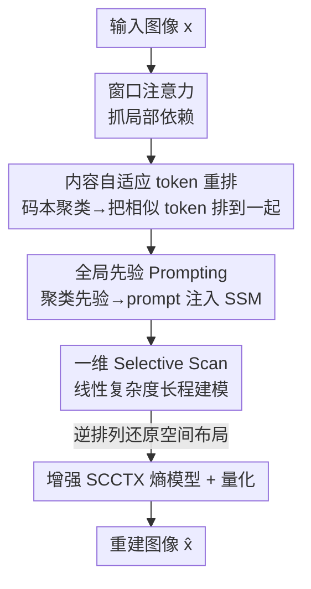

# Content-Aware Mamba for Learned Image Compression

**会议**: ICLR2026  
**OpenReview**: [https://openreview.net/forum?id=WwDNiisZQm](https://openreview.net/forum?id=WwDNiisZQm)  
**代码**: https://github.com/UnoC-727/CMIC  
**领域**: 图像压缩 / 低层视觉  
**关键词**: 学习式图像压缩, 状态空间模型, Mamba, 内容自适应扫描, 全局先验

## 一句话总结
针对 Mamba 在学习式图像压缩里"固定光栅扫描 + 严格因果"两大硬伤，本文提出内容感知 Mamba（CAM）：用基于码本聚类的 token 重排把内容相似的 token 排到一起扫描，再用冗余感知的 prompt 字典把全局先验注入 SSM 输出投影来打破因果性；最终 CMIC 模型在 Kodak/Tecnick/CLIC 上以 BD-rate −15.91%/−21.34%/−17.58% 全面超越 VTM-21.0，且显存比同类 Mamba 方法低近 80%。

## 研究背景与动机
**领域现状**：学习式图像压缩（LIC）走的是端到端 VAE 路线——分析变换把图像编码成隐变量、熵模型估计码率、合成变换重建图像，整体用率失真损失 $L_{RD}=R+\lambda\, d(x,\hat{x})$ 优化。为了消除空间上相距很远但语义相关区域之间的冗余，需要大的感受野：CNN 局部性不够，Transformer 能拿到全局感受野但代价是序列长度的平方复杂度。状态空间模型（Mamba）因此成了诱人的折中——线性复杂度 + 全局感受野，已经被 MambaVC、MambaIC 等用进 LIC。

**现有痛点**：但 Mamba 的 Selective Scan 是为一维序列设计的，搬到图像压缩上有两个根本毛病。其一，**扫描顺序与内容无关**：vanilla Mamba 按固定的光栅顺序（raster scan）处理 token，只看空间邻近性，完全不管特征相关性；这会把内容相关的 token 在序列里拆散、把无关的 token 凑到一起，导致语义相关却空间相距远的 token 之间的依赖建模不上去，率失真变差。其二，**严格因果性与图像的非因果本质冲突**：SSM 是因果序列模型，每个 token 只能看到光栅顺序里它前面的 token，后面的全局上下文被忽略。常见的多方向扫描虽然能缓解因果性，但计算量直接翻四倍，而且走的还是基于欧氏距离、与内容无关的扫描路径。

**核心矛盾**：要消除冗余，模型应该按"特征空间的接近度"去组织 token 之间的交互；可 Mamba 偏偏按"欧氏空间的接近度 + 单向因果链"来处理。扫描路径和冗余结构对不上，是 Mamba-based LIC 性能受限的症结，而不是 Transformer 那种"全局性 vs 复杂度"的取舍问题。

**本文目标**：在不牺牲 Mamba 线性复杂度的前提下，让它（1）按内容相似度而非空间相邻去扫描，（2）在每一步都能感知全局上下文、摆脱严格因果。

**切入角度**：既然问题出在"扫描顺序"和"信息只能往前流"，那就分别从这两处下手——先聚类再重排 token 序列解决前者，再把全局统计当 prompt 注入 SSM 解决后者。两者都复用同一份聚类结果，几乎不增加额外开销。

**核心 idea**：用"内容自适应的 token 重排"替代固定光栅扫描，用"基于聚类先验的 prompt 注入"替代多方向扫描来打破因果性，从而在线性复杂度下实现内容感知、非因果的长程建模。

## 方法详解

### 整体框架
CMIC 沿用标准 VAE 式 LIC 布局：分析变换 $g_a$ 把 RGB 图像 $x$ 编成隐变量 $y$，均值平移后均匀量化得 $\hat{y}=Q(y-\mu)+\mu$，合成变换 $g_s$ 重建 $\hat{x}$；超先验编解码器产出 $(\mu,\sigma)$ 配合空间-通道上下文 $\phi$ 定义条件高斯熵模型估算码率 $R$。非线性变换被切成六个分辨率阶段（编码端三次下采样、解码端三次上采样，深度配置 $\{L_1,L_2,L_3,L_3,L_2,L_1\}$）。每个阶段先用窗口注意力（window-attention）抓细粒度局部依赖，再用本文的 **CAM block** 补长程建模。

CAM block 的核心是 Content-Aware SSM：它先把 token 聚成若干类、把展平后的序列重排让相似 token 相邻；同时从 prompt 字典生成 sample-specific 的提示；重排后、注入提示的 token 交给一次一维 selective scan 做高效长程建模，扫完再用逆排列还原空间布局。熵模型基于 SCCTX，额外加了深度卷积做上下文建模、用门控 MLP 做参数聚合。整条 pipeline 的两个贡献组件就是 **内容自适应 token 重排（CTP）** 和 **全局先验 prompting（GPP）**。

### 关键设计

**1. 内容自适应 token 重排（CTP）：把扫描顺序从"空间相邻"改成"特征相似"**

固定光栅扫描把语义相关、空间却隔很远的 token 拆散，这是 Mamba 消冗余不力的直接原因。直觉解法是聚类后把同类 token 排到一起再扫，但逐样本在线 K-Means 既贵又训练不稳（每次重新初始化质心、对早期特征敏感）。本文借鉴 VQ-VAE，用一份**共享、可学习的码本**来存所有质心：把特征图 $X\in\mathbb{R}^{H\times W\times d}$ 的每个位置当一个 token $x_i$，用余弦相似度把 $N$ 个 token 分到 $K$ 类（论文固定 $K=64$），质心 $c_k$ 在训练阶段用 K-Means 更新——每轮按余弦距离 $\text{Distance}_{i,j}=\frac{x_i^\top c_j}{\|x_i\|_2\|c_j\|_2}$ 把 token 分到最近质心、再把各类归一化均值当新质心、空类质心保持不变，最后用衰减系数 $\lambda$ 做 EMA 平滑（每个训练 step 迭代 5 次，只占该 step 约 5% 时间）。每个 CAM block 持有自己的一套质心，跨所有图像共享、只在训练时更新，从而把数据集级的特征分布固化进码本。

拿到最终质心后，按 token 的类别标签 $g_i$ 构造一个排列 $\pi$：先把 $g_i=1$ 的 token 排在一起、再 $g_i=2$……得到重排序列 $\tilde{X}=X_{\pi(\cdot)}$，同类 token 在一维序列里变得连续，从而鼓励相似 token 间交互、让 SSM 关注特征空间的接近度；逆排列 $\pi^{-1}$ 缓存下来用于还原空间布局。推理时无需任何 K-Means 迭代，直接用训练好的质心做确定性、高效的类别分配。

**2. 全局先验 Prompting（GPP）：在不翻四倍计算的前提下打破 SSM 的因果性**

CTP 只改了扫描顺序，但 Mamba 的递推 $h_i=\bar{A}h_{i-1}+\bar{B}x_i,\ O_i=Ch_i+Dx_i$ 仍是严格单向因果——每个 token 的状态只依赖序列里它前面的 token，全局上下文进不来。多方向扫描能缓解但计算翻四倍。本文换个思路：注意到输出矩阵 $C$ 的作用类似 self-attention 里的 query（决定从隐状态里读什么），那就**用全局先验去调制 $C$**。

具体做法是引入一个**冗余感知的分布字典** $U\in\mathbb{R}^{K\times d_s}$：对每个聚类质心做可学习线性投影 $A:\mathbb{R}^d\to\mathbb{R}^{d_s}$，得 $U=A([c_1;\dots;c_K])$，每行就是一个语义簇对应的 prompt 向量。对含 $N$ 个 token 的输入，用 one-hot 隶属矩阵 $\Gamma\in\{0,1\}^{N\times K}$ 查字典生成 sample-specific 的 prompt 矩阵 $P=\Gamma U$，于是 prompt 信号反映了冗余在各语义簇上的分布。最后把 $P$ 注入状态空间方程、增广输出投影：

$$O_i=(C+P)h_i+Dx_i$$

这样每个 token 的输出同时融合了字典里的全局统计知识和当前样本的聚类语义布局，相当于在扫描过程中持续给模型喂全局先验，有效放松了严格因果链。和 MambaIRv2 的区别在于：后者的 prompt pool 是独立的可学习矩阵、直接梯度优化、没有显式语义约束；而本文的 prompt 字典显式绑在冗余感知的聚类质心上——质心由非梯度 K-Means 更新、映射 $A(\cdot)$ 可微并随率失真目标端到端训练，两条更新路径分工明确。

### 损失函数 / 训练策略
端到端率失真损失 $L_{RD}=R+\lambda\, d(x,\hat{x})$，码率 $R$ 含隐变量和超先验两项熵；失真用 MSE 和 MS-SSIM 两套，对应 $\lambda$ 各取一组（MSE 用 $\{0.0017,\dots,0.050\}$，MS-SSIM 用 $\{3,\dots,64\}$）。在 Flickr2W 上用 Adam 训练、初始学习率 $10^{-4}$，通道维 $\{C_1,C_2,C_3,C_4\}=\{128,192,256,320\}$，块深 $\{L_1,L_2,L_3\}=\{3,2,2\}$，注意力窗口 8，聚类数 64，K-Means 每 step 更新 5 次。

## 实验关键数据

### 主实验
在三个标准测试集上以 VTM-21.0 为参考算 BD-rate（越负越好），CMIC 全面 SOTA，且复杂度（参数/FLOPs/显存）相对同类 Mamba 方法大幅更优：

| 方法 | Kodak BD-rate | Tecnick | CLIC | Params(M) | 峰值显存(GB) |
|------|--------------|---------|------|-----------|-------------|
| VTM-21.0 | 0.00 | 0.00 | 0.00 | – | – |
| MLIC++ | −13.42 | −16.73 | −13.94 | 116.48 | 2.08 |
| FTIC | −12.94 | −13.89 | −10.21 | 69.78 | 4.90 |
| MambaVC | −8.10 | −11.82 | −10.94 | 47.88 | 14.73 |
| MambaIC | −13.01 | −15.27 | −15.23 | 157.09 | 20.32 |
| **CMIC（本文）** | **−15.91** | **−21.34** | **−17.58** | 69.11 | **4.44** |

相对 SOTA Transformer 方法 FTIC，BD-PSNR 提升 0.15/0.32/0.36 dB（Kodak/CLIC/Tecnick）；高分辨率（CLIC、Tecnick）上优势更大，印证 CAM 全局建模的威力。复杂度上：对比 MambaIC，参数减 56%、FLOPs 减 57%、解码延迟减 39%、**显存降 78%**（得益于单次 selective scan 替代二维四向扫描）。

### 消融实验
两大组件（CTP、GPP）逐一拆解，Tab. 2 的基线（两者都关）等价于 vanilla 单扫描 Mamba block（单位 BD-rate %，越负越好）：

| 配置 | Kodak | Tecnick | CLIC | 说明 |
|------|-------|---------|------|------|
| baseline（vanilla Mamba） | −13.26 | −17.74 | −14.87 | 两组件都关 |
| + CTP | −15.21 | −20.17 | −16.67 | 只加内容自适应重排 |
| + GPP | −14.27 | −19.13 | −15.34 | 只加全局先验 prompt |
| + CTP + GPP（完整） | **−15.91** | **−21.34** | **−17.58** | CMIC |

结构对比（Tab. 4）显示把 CAM 换成 Conv（−12.89）、2D Mamba（−14.13）、纯注意力（−13.06）、纯 CAM（−14.68）都不如 CAM 与注意力策略性混合的完整 CMIC（−15.91）。吞吐量（256×256、batch 8）从 baseline 23.19 仅降到 22.05 samples/s，2K 图解码时间只多 4%（0.387s→0.405s）。

### 关键发现
- **CTP 贡献大于 GPP**：单加 CTP 带来约 2.0%/2.4%/1.8% 的 BD-rate 提升，从完整模型移除 CTP 掉 1.6%–2.2%；单加 GPP 提升 0.5%–1.4%。两者高度互补，合计贡献 2.7%–3.6%。
- **CAM 只适合放在变换网络、不适合熵模型**：作者发现把 CAM 加进熵模型几乎不涨点反而增延迟，说明 CAM 的增益来自非线性变换处的长程冗余建模。
- **ERF 可视化印证机制**：去掉 CTP&GPP 时单层 ERF 在中心 token 处戛然而止（严格光栅因果）；开 GPP 后扫描序列之后也出现非零激活（"看到"了因果之外的全局语义）；开 CTP 后 ERF 不再是光栅图样、而是扩散到语义相关区域（如发丝、羽毛、海岸线、飞机），证明扫描确实改按内容走了。

## 亮点与洞察
- **把"扫描顺序"当成可学习的内容自适应变量**：以往 Mamba 视觉工作多在堆多方向扫描，本文反过来认定问题根源是"光栅顺序与冗余结构错配"，用一份共享码本聚类 + 序列重排就把扫描路径对齐到特征空间——这个"先聚类再扫"的思路对任何序列化处理图像的 SSM 都可迁移。
- **用聚类质心生成 prompt、绑死语义约束**：相比 MambaIRv2 让 prompt pool 自由梯度学习，本文把 prompt 字典显式挂在 K-Means 质心上，既给了全局先验又自带语义可解释性，且通过"非梯度更新质心 + 可微投影"两条路分工避免训练不稳。
- **"打破因果性"不靠加扫描方向而靠改输出投影**：把全局先验注入 $C\to C+P$，单次扫描就拿到非因果全局上下文，这是它显存只有 MambaIC 五分之一的关键——对实际部署很有价值。

## 局限与展望
- 作者承认 CAM 对熵模型几乎无增益，说明其机制更偏"变换端长程冗余建模"，对码率估计这类任务帮助有限。
- 聚类数 $K=64$ 固定、每个 block 各持一套跨数据集共享的质心；不同分辨率/内容是否需要自适应的簇数、码本如何随分布漂移更新，论文没深入探讨。
- 训练阶段每 step 多 5 次 K-Means 迭代、推理虽确定性但仍需余弦分配 + 重排/逆重排，序列长度极大时排列开销和缓存代价值得进一步量化。
- 评测集中在 Kodak/Tecnick/CLIC 这类自然图像，对屏幕内容、医学影像等冗余结构差异大的域是否同样受益，留待验证。

## 相关工作与启发
- **vs MambaVC / MambaIC**：同为 Mamba-based LIC，但它们沿用内容无关的（多方向）光栅扫描；CMIC 把扫描改成内容自适应重排 + prompt 注入，在三个数据集 BD-rate 再降 2.2%–10.1%，且显存大幅更低。
- **vs FTIC / TCM-L（Transformer / CNN-Transformer）**：它们靠注意力拿全局感受野但复杂度高；CMIC 用线性复杂度 SSM 在 BD-PSNR 上反超 0.15–0.53 dB，并把 FLOPs/延迟/显存压下来。
- **vs MambaIRv2**：两者都用 prompt 增强 SSM，但 MambaIRv2 的 prompt pool 是自由学习矩阵；CMIC 的 prompt 字典显式绑定冗余感知聚类质心，带语义约束，专为压缩的冗余结构设计。
- **vs Zhang et al. (2024b) 的聚类重排**：那是粗粒度、网格锚定的聚类 + CNN；本文是细粒度、非欧的码本聚类，且专为 Mamba 的一维扫描服务。

## 评分
- 新颖性: ⭐⭐⭐⭐⭐ 把 Mamba 扫描顺序与因果性这两处"为序列设计、不适配图像"的硬伤同时拆解，思路干净且可迁移
- 实验充分度: ⭐⭐⭐⭐⭐ 三数据集 RD + 复杂度 + 组件/结构/吞吐多维消融 + ERF 可视化机制验证
- 写作质量: ⭐⭐⭐⭐ 动机—方法—验证逻辑清晰，公式与图表对应到位
- 价值: ⭐⭐⭐⭐⭐ SOTA RD 同时把显存压到同类 Mamba 的 ~1/5，对实际编解码部署很有吸引力

<!-- RELATED:START -->

## 相关论文

- [\[CVPR 2026\] Learned Image Compression via Sparse Attention and Adaptive Frequency](../../CVPR2026/image_restoration/learned_image_compression_via_sparse_attention_and_adaptive_frequency.md)
- [\[ICLR 2026\] Trajectory-aware Shifted State Space Models for Online Video Super-Resolution](trajectory-aware_shifted_state_space_models_for_online_video_super-resolution.md)
- [\[CVPR 2026\] VEMamba: Efficient Isotropic Reconstruction of Volume Electron Microscopy with Axial-Lateral Consistent Mamba](../../CVPR2026/image_restoration/vemamba_efficient_isotropic_reconstruction_of_volume_electron_microscopy_with_ax.md)
- [\[AAAI 2026\] Depth-Synergized Mamba Meets Memory Experts for All-Day Image Reflection Separation](../../AAAI2026/image_restoration/depth-synergized_mamba_meets_memory_experts_for_all-day_image_reflection_separat.md)
- [\[ICLR 2026\] Improved Adversarial Diffusion Compression for Real-World Video Super-Resolution](improved_adversarial_diffusion_compression_for_real-world_video_super-resolution.md)

<!-- RELATED:END -->
