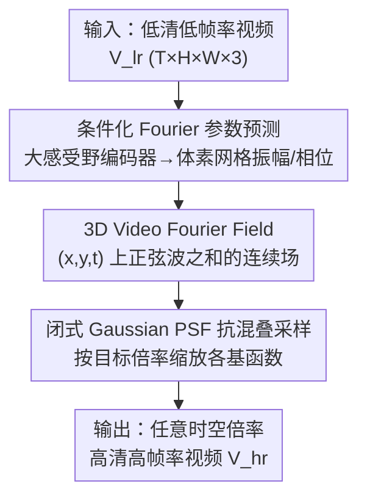

# Continuous Space-Time Video Super-Resolution with 3D Fourier Fields

**会议**: ICLR2026  
**OpenReview**: [https://openreview.net/forum?id=bLmImy7g1w](https://openreview.net/forum?id=bLmImy7g1w)  
**代码**: 项目页 https://v3vsr.github.io  
**领域**: 视频复原 / 连续时空超分  
**关键词**: 视频超分, 连续表示, Fourier 场, 抗混叠, 时空建模

## 一句话总结
这篇论文提出 V3，用一个统一的 3D Fourier 场（Video Fourier Field, VFF）把视频直接表示成 $(x,y,t)$ 空间里一组正弦波的和，抛弃了"空间 INR + 光流 warp"那套割裂又脆弱的做法，让任意空间/时间倍率的超分变成一次连续采样，还能闭式地塞进 Gaussian 点扩散函数做抗混叠，在多个基准上把 PSNR 拉高约 1.5–2 dB 的同时跑得更快、更省显存。

## 研究背景与动机
**领域现状**：连续时空视频超分（C-STVSR）的目标是从低分辨率、低帧率的视频里恢复出可以在空间和时间上任意倍率采样的高清高帧率视频。主流做法（VideoINR、MoTIF、BF-STVSR）把视频表示拆成两块：每一帧用一个 2D 隐式神经表示（INR）刻画空间内容，帧与帧之间的运动用另一个函数（通常是光流场）刻画，推理时靠显式 warp 把相邻帧的特征对齐、融合到中间帧。

**现有痛点**：这种"空间 × 时间"分解有几个硬伤。其一，光流估计在物体边界、遮挡区域最容易出错，而 warp 一旦对错位置，超分就跟着崩——错误恰好集中在画面最关键的地方。其二，光流通常只在相邻两帧之间估计，想把运动信息链到更长的时间窗里会累积误差、过度平滑、还要处理（去）遮挡，所以"时间建模"实际上很难超越相邻帧对。其三，抗混叠很别扭：表示在训练时并不知道将来会以什么倍率被采样，必须存下到最高倍率的高频细节，那么以低倍率采样时这些细节就超过了 Nyquist 极限会产生伪影；但 INR 把信息藏在抽象的隐空间里，想塞一个积分式的观测模型（点扩散函数 PSF）来压掉不可表示的频率非常麻烦、又费算力。

**核心矛盾**：把空间和时间割裂表示，本质上丢掉了时空相关性，并把运动补偿外包给了一个不可靠的光流模块；而连续表示又缺一个能直接、闭式做抗混叠的数学结构。

**本文目标**：找一种**统一、时空一致**的连续表示，同时满足四点——系统简单、绕开显式 warp、支持多帧长程运动上下文、内置高效的抗混叠机制。

**切入角度**：作者注意到一个经典事实——**平移运动在频域里等价于相位移动**（phase shift，Kuglin 1975）。如果把整段视频直接表示成 $(x,y,t)$ 三维空间上的正弦波叠加，那么运动这件事就自然地被编码进相位里，不需要再单独估光流、再 warp；而且正弦基天生带限、可以闭式地乘上 Gaussian PSF 的频率响应。

**核心 idea**：用"$(x,y,t)$ 上一组 3D 正弦波之和"这个极简的连续表示（VFF）替代"空间 INR + 光流 warp"，让时空超分变成对一个统一频域场的解析采样。

## 方法详解

### 整体框架
V3 要解决的是：给一段低分辨率、低帧率视频 $V_{lr}\in\mathbb{R}^{T\times H\times W\times 3}$，恢复出一个定义在连续域上的信号 $\hat V(x,y,t):\mathbb{R}^2\times[0,T]\to\mathbb{R}^3$，之后想要多高的空间倍率 $s$、多高的时间倍率 $r$，就在对应的网格点上采样即可得到 $V_{hr}\in\mathbb{R}^{rT\times sH\times sW\times 3}$。

整条 pipeline 很干净：低清视频先送进一个有大时空感受野的神经视频编码器（backbone 用 RVRT），编码器输出一个体素网格（voxel grid），每个体素上预测一组 VFF 参数——具体是 3D 正弦基的振幅 $a_i$ 和相位 $\phi_i$（频率 $\omega_i$ 全局共享、训练后固定）。这些参数就定义了局部的连续函数 $\hat V$，也就是 Video Fourier Field。最后用一个带 Gaussian PSF 的采样器，在任意 $(x,y,t)$ 坐标上闭式求值，得到超分后的视频。整个系统可微、端到端训练。

### 关键设计

**1. 3D Video Fourier Field（VFF）：把整段视频写成 $(x,y,t)$ 上的正弦波之和**

这是全文的地基，直接针对"空间/时间割裂 + 显式 warp"这个痛点。作者定义一组 $N$ 个 3D 正弦基函数 $\{B_i\}_{i=1}^N$，每个基由频率 $\omega_i\in\mathbb{R}^3$ 和相位 $\phi_i\in\mathbb{R}$ 决定：

$$B_i(x,y,t)=a_i\cdot\sin\!\big(\omega_i\cdot(x,y,t)+\phi_i\big)$$

视频信号就是这些基的有限叠加 $\hat V(x,y,t)=\sum_{i=1}^N B_i(x,y,t,a_i,\phi_i,\omega_i)$。作者称它"Fourier 场"是因为形式上像经典 Fourier 变换，但又不是严格的 Fourier 级数——真正的 Fourier 级数要用无穷多个整数频率的正交基来保证完备，这里只用有限个、频率连续、不强求正交的正弦基。放弃正交性换来的是一个**连续、带限**的表示：它可以在任意空间/时间分辨率上被查询，而这正是 C-STVSR 需要的。

为什么这个表示能绕开光流？因为平移运动在频域里就是相位移动，运动天然被编码进 $\phi_i$，不需要外接一个易错的光流模块去做帧对帧的 warp；而且它定义在 $(x,y,t)$ 联合空间，对长程、非线性、周期性运动也能一并建模，而不是被困在相邻两帧。为了让基函数数量可控，实践中把 $(x,y,t)$ 空间切成局部的轴对齐体素，每个体素拟合自己的 VFF（参数随局部内容调整），但拼起来仍然覆盖整个连续域。

**2. 条件化 Fourier 参数预测：用大感受野编码器把低清视频映射成场参数**

光有 VFF 的形式还不够，得知道**对一段具体的输入视频，这些振幅和相位该取多少**。作者用一个领域专用的神经视频编码器 $E$（RVRT，embedding 维度 90、12 个注意力头），它在很大的时空感受野上聚合每个输入体素的语义特征 $E(x)\in\mathbb{R}^{T\times H\times W\times F}$，再用一个小卷积网络把特征映射成 3D 网格上的 VFF 参数 $\{(a_j,\phi_j)\}_j$。和只能看相邻两帧光流的方法相比，这个大上下文让模型能联合推理多帧、更稳健地处理遮挡/去遮挡、捕捉简单帧间插值搞不定的非线性与周期运动。

一个关键的简化是：**频率 $\{\omega_i\}$ 不随体素变化、只在训练时学一次，推理时对所有视频、所有体素都固定**，每个体素只调振幅和相位去拟合输入。这样不仅省算力，作者还发现共享同一组频率基反而略微提升了重建视频的稳定性与连贯性。跨体素的全局一致性由编码器的大感受野来保证——虽然每个格子各拟合一个 VFF，但参数都来自看过大范围上下文的同一个 backbone。

**3. 闭式 Gaussian PSF 抗混叠采样：把信号理论上正确的点扩散函数硬编码进采样**

任意倍率超分必须处理混叠：训练时不知道将来以什么尺度采样，表示里塞了到最高倍率的高频，低倍率采样时这些高频就越过 Nyquist 极限。VFF 的好处是抗混叠可以**闭式**做。按 Fourier 理论，在方差为 $\sigma$ 的 Gaussian PSF 下采样，等价于把每个基函数乘上一个只依赖频率的因子：

$$\hat V_\sigma(x,y,t)=\sum_{i=1}^N B_i(x,y,t)\cdot\xi(\omega_i,\sigma),\qquad \xi(\omega_i,\sigma)=\exp\!\big(-\|\omega_i\|^2/8\pi^2\sigma^2\big)$$

其中 $\sigma$ 与有效采样率成反比（由 Nyquist 极限决定）。也就是说，无混叠采样退化成"逐基函数按频率缩放 + 相位移动"，可以用一次矩阵乘法加逐元素加法/缩放实现，比显式滤波或超采样高效得多。相比 VideoINR/MoTIF/BF-STVSR 把合适的 PSF 当成神经模型的一部分从数据里学，V3 直接把信号理论上正确的 PSF 写死进采样，不仅参数更省，泛化也更好、不受训练偏差影响。$\sigma$ 还能按维度单独设：比如空间上做 Gaussian 模糊、时间上做点采样，或给时间设一个小常数来模拟相机有限曝光带来的窄时间 PSF。

### 损失函数 / 训练策略
V3 用 JAX 实现，基函数数量 $N=512$。训练在 240fps 的 Adobe240 数据集上进行，空间上用 bicubic 随机降采样（倍率从 $U(1.2,4)$ 采）、时间上固定 $\times 8$ 子采样得到 30fps 输入，所有 ground-truth 帧（在时空上随机采）作为监督。训练 patch 为 $80\times80$ 像素、14 帧，用 L1 重建损失、AdamW（lr=$10^{-4}$）+ Cosine Annealing，梯度按全局 L2 范数 1 裁剪，训练 $2.5\times10^6$ 步。除 RVRT 里的光流分量（RAFT）只在最后 $3\times10^5$ 步微调外，其余参数全部从头训。batch size 16，在 16 张 GH200 上训练，推理仅需单张消费级 GPU（RTX 3090 Ti）。

## 实验关键数据

### 主实验
C-STVSR 主任务（空间 $\times4$、时间 $\times8$，Vid4 时间 $\times2$），PSNR/SSIM：

| 数据集 | 指标 | V3 (本文) | BF-STVSR (前 SOTA) | 提升 |
|--------|------|-----------|--------------------|------|
| Vid4 | PSNR | 26.76 | 25.85 | +0.91 dB |
| GoPro-Average | PSNR | 32.26 | 30.22 | +2.04 dB |
| Adobe-Average | PSNR | 32.29 | 30.12 | +2.17 dB |
| Adobe-Center | PSNR | 32.91 | 30.83 | +2.08 dB |

V3（13.7M 参数）在三个数据集上全部刷新 SOTA，多数场景 PSNR 领先 >1.5 dB；放大版 V3-Large（20.6M）进一步把领先扩到约 2 dB，说明模型还没到饱和点。

任意尺度空间视频超分（AVSR，REDS 验证集），V3 是首个在所有倍率（含分布外）上**都明显超过逐帧图像超分（AISR）**的 C-STVSR 方法，作者归因于统一时空基带来的更大时间上下文窗口、能跨帧利用冗余而不只是避免闪烁：

| 倍率 | V3 | BF-STVSR | RDN-LTE† (逐帧图像SR) |
|------|------|----------|------------------------|
| ×2 | 36.53 / 0.963 | 34.72 / 0.946 | 34.73 / 0.943 |
| ×4 | 29.92 / 0.849 | 29.11 / 0.820 | 28.75 / 0.804 |
| ×8 | 25.96 / 0.690 | 25.40 / 0.668 | 25.24 / 0.669 |

### 消融实验
"空间/时间解耦"边界情形（Adobe240，把另一维倍率设为 $\times1$）凸显了统一表示的价值：

| 配置 | VideoINR | MoTIF | BF-STVSR | V3 |
|------|----------|-------|----------|-----|
| 纯空间 S×4, T×1 | 31.84 / 0.904 | 32.95 / 0.916 | 33.03 / 0.917 | **34.25 / 0.938** |
| 纯时间 S×1, T×8 | 24.45 / 0.712 | 28.09 / 0.843 | 29.37 / 0.867 | **33.43 / 0.936** |

时间一致性（tOF↓，Vid4，越低越好）：V3 = 0.254，V3-Large = 0.250，明显优于 BF-STVSR 0.323、MoTIF 0.354、VideoINR 0.344。

计算开销（14×80×80 patch、$\times8$ 时间 $\times4$ 空间、RTX 3090 Ti）：

| 方法 | 推理时间 | 显存 |
|------|----------|------|
| VideoINR | 3.03 s | 2.6 GiB |
| MoTIF | 1.88 s | 8.4 GiB |
| BF-STVSR | 1.90 s | 10.4 GiB |
| V3 | **1.27 s** | 6.1 GiB |

### 关键发现
- 纯时间 $\times8$ 插帧这一情形 V3 比 BF-STVSR 高出 **4 dB**（33.43 vs 29.37），是所有对比里差距最大的——直接证明 VFF 的时间建模能力远强于"光流 + warp"，因为后者在突变运动边界、遮挡处会因光流不准而产生重影/重复纹理。
- V3 在抗混叠上把"信号理论正确的 PSF"硬编码进采样，比从数据里学 PSF 的方法泛化更好，尤其在分布外（REDS）尺度上仍稳定领先。
- 基函数分析显示模型学到了沿坐标轴更密集（对应横竖结构）、高频比低频更多的非均匀分布，幅度随频率升高而衰减，与经典 Fourier 分析一致——说明表示确实抓到了数据结构。

## 亮点与洞察
- **"运动 = 相位移动"是整篇文章的支点**：把视频写进 $(x,y,t)$ 频域后，平移运动自动变成相位，于是光流和 warp 这两个最脆弱的组件被整体删掉。这是一种"换坐标系让难题消失"的优雅思路，值得迁移到其他需要运动补偿的低层视觉任务。
- **抗混叠从"学"变成"算"**：因为基是正弦波，Gaussian PSF 的作用退化成对每个基乘 $\exp(-\|\omega_i\|^2/8\pi^2\sigma^2)$，一次矩阵乘搞定。把一个原本要靠网络隐式学的能力换成闭式公式，既省参数又带泛化保证，这是"用对的数学结构换掉黑箱"的范例。
- **共享频率基**：所有视频、所有体素共用一组训练后固定的频率，只调振幅相位——既省算力又提稳定性。这暗示对很多连续表示任务，"基固定、系数自适应"可能比"基也学"更鲁棒。
- 又快又好又省显存：1.27s 推理同时领先 1.5–2 dB，打破了"质量靠堆算力"的惯性认知。

## 局限与展望
- **作者承认**：在极高倍率下输出会偏平滑，这是所有回归式 SR 的通病——判别式训练目标偏好低失真而非感知真实；生成式模型（如扩散）会更好看但会幻想细节。没有幻想细节是低重建误差的代价。
- **作者承认**：VFF 是有限 3D Fourier 和，结构简单，理论上在极端高频内容下可能成为表示瓶颈；目前测试范围没观察到问题，必要时可增大 $N$。
- **作者展望**：可以把退化算子推广到 spatio-temporal 降采样之外的更复杂退化（传感器噪声、运动模糊、压缩伪影）；运动模糊尤其天然——只要把 $\sigma_{\text{time}}$ 设很大即可。
- **自己发现**：评测全部是合成退化（bicubic + 子采样），真实世界退化（未知核、压缩、噪声混合）下的表现尚未验证；另外编码器仍依赖 RVRT 这类重 backbone，VFF 的"简单"主要体现在表示侧，参数预测侧并不轻量。

## 相关工作与启发
- **vs VideoINR**：VideoINR 把视频参数化成空间 INR + 时间 INR 两个解耦表示，时间 INR 当光流预测器估反向运动场再 backward warp；但反向流随时间结构性变化、在运动边界处不连续难学。V3 用统一 $(x,y,t)$ 场，运动即相位，彻底不需要 warp。
- **vs MoTIF**：MoTIF 学前向运动轨迹 + softmax splatting 做前向 warp，把遮挡冲突丢给 decoder 处理；V3 不做任何特征 warp，遮挡靠大感受野编码器联合多帧推理。
- **vs BF-STVSR**：BF-STVSR 也在隐空间引入 Fourier 基、用 B 样条参数化运动场，但**仍依赖显式 warp**把两关键帧映到中间帧，且没有原理性的抗混叠机制。V3 既无 warp、又把抗混叠做成闭式，纯时间插帧场景直接领先它 4 dB。
- **vs 逐帧图像 SR（LTE/CLIT/HIIF）**：把图像任意尺度 SR 逐帧套用会忽略时间依赖、产生闪烁；V3 是首个在所有倍率上都超过逐帧 AISR 的 C-STVSR 方法，靠的是统一时空基带来的跨帧冗余利用。

## 评分
- 新颖性: ⭐⭐⭐⭐⭐ 用 3D Fourier 场统一时空、把运动转成相位、抗混叠做成闭式，是 C-STVSR 表示层面的真正范式转变。
- 实验充分度: ⭐⭐⭐⭐⭐ 覆盖 C-STVSR、纯空间 AVSR、纯时间 VFI、时间一致性、算力五个维度，含放大版 scaling 验证。
- 写作质量: ⭐⭐⭐⭐⭐ 动机层层递进，方法的数学动机（相位=运动、闭式 PSF）讲得清楚有说服力。
- 价值: ⭐⭐⭐⭐⭐ 又快又好又省显存、可单卡推理，对视频编辑/数字变焦等实际场景有直接价值。

<!-- RELATED:START -->

## 相关论文

- [\[CVPR 2026\] Time Without Time: Pseudo-Temporal Representation for Space-Time Super-Resolution](../../CVPR2026/image_restoration/time_without_time_pseudo-temporal_representation_for_space-time_super-resolution.md)
- [\[ICLR 2026\] Trajectory-aware Shifted State Space Models for Online Video Super-Resolution](trajectory-aware_shifted_state_space_models_for_online_video_super-resolution.md)
- [\[ICML 2026\] Phy-CoSF: Physics-Guided Continuous Spectral Fields Reconstruction and Super-Resolution for Snapshot Compressive Imaging](../../ICML2026/image_restoration/phy-cosf_physics-guided_continuous_spectral_fields_reconstruction_and_super-reso.md)
- [\[ICLR 2026\] SuperF: Neural Implicit Fields for Multi-Image Super-Resolution](superf_neural_implicit_fields_for_multi-image_super-resolution.md)
- [\[ICLR 2026\] Pixel to Gaussian: Ultra-Fast Continuous Super-Resolution with 2D Gaussian Modeling](pixel_to_gaussian_ultra-fast_continuous_super-resolution_with_2d_gaussian_modeli.md)

<!-- RELATED:END -->
