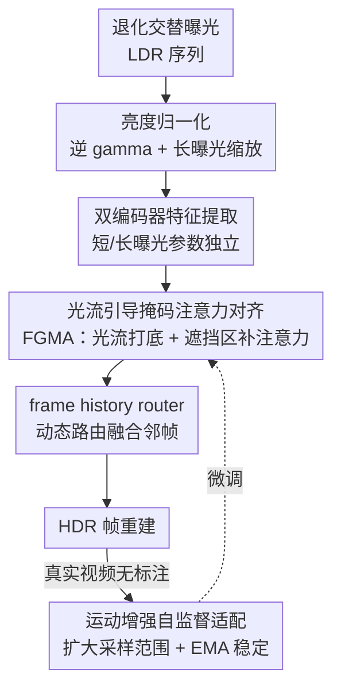

# DeAltHDR: Learning HDR Video Reconstruction from Degraded Alternating Exposure Sequences

**会议**: ICLR2026  
**OpenReview**: [https://openreview.net/forum?id=buzIPnGxA8](https://openreview.net/forum?id=buzIPnGxA8)  
**代码**: https://zhang-shuohao.github.io/DeAltHDR/ （有）  
**领域**: 图像/视频复原 · HDR 视频重建  
**关键词**: HDR 视频重建, 交替曝光, 光流引导掩码注意力, 自监督适配, 退化建模

## 一句话总结
DeAltHDR 首次正面处理「交替曝光 LDR 帧本身就带噪声和运动模糊」这一被忽视的现实问题，用一个光流引导的掩码注意力（FGMA）只在光流不可靠的遮挡区域才做跨帧注意力对齐、其余区域沿用廉价的光流 warp，从而在效率和质量间取得可调权衡；再配一套面向视频大运动改进的自监督适配方法，在合成与真实数据集上都超过了现有 SOTA。

## 研究背景与动机
**领域现状**：HDR 视频重建的主流路线是从交替短/长曝光的 LDR 序列出发，把相邻不同曝光帧对齐、融合，补出每帧缺失的动态范围。代表方法如 Chen et al.、LAN-HDR、NECHDR、HDRFlow 都在解决两件事——补偿相邻帧之间的亮度差异、以及消除因运动错位带来的 ghosting 鬼影。

**现有痛点**：这些方法几乎都默认输入 LDR 帧是干净的（无噪声、无模糊），把全部精力放在亮度对齐和去鬼影上。但交替曝光策略天生会引入退化：短曝光帧（尤其暗光下）噪声很重，长曝光帧则容易因相机抖动或物体运动而运动模糊。这个「假设干净、现实很脏」的鸿沟，让现有方法在真实场景里直接失效。

**核心矛盾**：退化让「对齐」这个本就困难的步骤雪上加霜。光流和可变形卷积在噪声/模糊下估不准；纯注意力对齐质量好但计算量和耗时都大得离谱，且计算成本固定、不能按预算调节。换句话说，对齐质量与计算开销之间存在硬 trade-off，而退化把这个 trade-off 推到了更糟的位置。另一方面，真实世界的成对训练数据稀缺，纯合成数据训练的模型一上真实场景就性能崩塌。

**本文目标**：(1) 在带噪声、带模糊的退化交替曝光序列上做高质量 HDR 视频重建；(2) 让对齐既准又省，并且推理开销可按算力预算动态调节；(3) 解决真实数据稀缺、合成到真实的域间隙问题。

**切入角度**：作者观察到——光流在大部分非遮挡区域其实够用且廉价，真正出问题的只是少数遮挡/不可靠区域。既然如此，没必要对整帧做昂贵的稠密注意力，只在「光流靠不住」的那一小撮像素上补注意力即可。最近的 BracketIRE 虽然考虑了退化，但它是为 HDR 图像而非视频设计的，直接搬到视频上效果次优。

**核心 idea**：用「光流打底 + 仅在不可靠区域补稀疏注意力」替代「整帧稠密注意力」来对齐退化帧，并让注意力占比成为一个可连续调节的旋钮；再把图像版的自监督微调改造成能吃下视频大运动的版本。

## 方法详解

### 整体框架
DeAltHDR 建立在多尺度编码器-解码器架构 Turtle 之上：处理第 $t$ 帧时，借助前后共 4 个邻帧辅助重建。输入端先做亮度归一化预处理——用逆 gamma 校正把 LDR 线性化，再把所有长曝光帧按曝光比 $\Delta e_{2i}/\Delta e_{2i-1}$ 缩放到与短曝光对齐的亮度，最后把线性帧和它的 gamma 变换版本拼接 $\{L_t^c\}=\{\hat L'_t,(\hat L'_t)^\gamma\}$（$\gamma=1/2.2$）一起喂进网络。

网络用两个结构相同但参数独立的编码器，分别处理短曝光与长曝光帧，提取多尺度特征 $\{F_t^i\}_{i=1,2,3}$。每个尺度的解码块里，原 Turtle 的对齐模块被替换成本文的**光流引导掩码注意力对齐（FGMA）**：它吃当前帧特征 $F_t^{in}$ 和邻帧特征 $F_{t-1}^i$，输出对齐后的邻帧特征 $F_{t-1\to t}^{out}$；对 4 个邻帧各算一次再拼接。最后由 Turtle 原有的 frame history router 做动态路由融合，按相关性自适应加权这些运动补偿后的邻帧特征。训练上采用两阶段范式：先在自建合成成对数据集上预训练，再用本文的运动增强自监督方法在无标注真实视频上微调。

### 关键设计

**1. 光流引导掩码注意力对齐（FGMA）：只在光流靠不住的地方才补注意力**

这是全文核心，针对「退化帧对齐难、纯注意力又太贵」的痛点。FGMA 的关键是先用前后向一致性检验把「不可靠区域」找出来，再把昂贵的注意力局限到这些区域。具体地，用轻量预训练光流网 SpyNet 算双向光流 $O_{t-1\to t}$ 和 $O_{t\to t-1}$；把 $L_t$ warp 到 $t-1$ 再 warp 回来得到 $L_{t\to t-1\to t}$，二者绝对差 $D_{t-1\to t}(i,j)=|L_{t\to t-1\to t}(i,j)-L_t(i,j)|$ 直接度量了双向 warp 的不一致性，也就是遮挡程度。引入敏感度因子 $s$ 得到二值遮挡掩码：

$$M_{t-1\to t}(i,j)=\begin{cases}1 & \text{if } s\cdot D_{t-1\to t}(i,j)/255 > 0.5\\ 0 & \text{otherwise}\end{cases}$$

对掩码标出的遮挡区，用注意力做对齐细化：query 由当前帧特征与掩码逐元素相乘得到 $Q=\mathrm{Proj}_q(F_t^{in}\odot M)$，key/value 来自邻帧特征。最终把光流 warp 的特征 $F^{flow}_{t-1\to t}=\mathrm{Warp}(F_{t-1}^i,O_{t\to t-1})$、掩码 $M$、注意力细化结果 $F^{att}_{t-1\to t}$ 三者拼接作为输出。

它有效的关键在于「稀疏 + 定向」：绝大多数像素走廉价光流，只有少数遮挡像素走注意力，于是在质量和算力间取得远好于纯注意力的平衡。和 MIA-VSR 那种「按相邻帧差异算掩码」不同，HDR 场景里相邻 LDR 帧的曝光和退化差异本来就巨大，直接用帧差当掩码会失效，所以这里用的是双向光流一致性而非帧差。

**2. 可调注意力占比：一个旋钮换取推理成本自适应**

针对「现有方法计算成本固定、无法按算力预算伸缩」的痛点。由于掩码里非零像素的比例由 $s$ 控制，调 $s$ 就能让模型从「纯光流主导」连续滑向「注意力主导」：作者设了 $s=0$（纯光流）、$s=15$（光流与注意力平衡）、$s=100$（注意力主导）、$s=\infty$（纯注意力）四个关键边界，外加 16 个采样点，于是测试时可在一条性能-成本曲线上任取一点——左下角最省但质量次优，右上角 PSNR 最高但开销最大。这让同一个模型无需重训就能部署到不同算力的设备上，是 FGMA 稀疏结构天然带来的红利。

**3. 双编码器参数独立：让短/长曝光各自专精不同退化**

短曝光帧噪声重、长曝光帧模糊重，两类输入的退化性质根本不同。本文为短、长曝光各配一个结构相同但**参数完全独立**的编码器，让它们分别专精提取各自退化下的特征。消融显示三个尺度全部参数独立时效果最好（PSNR 32.55），逐级共享参数会单调掉点（全共享只剩 31.96），印证了「用共享参数处理性质迥异的输入是次优的」这一判断。

**4. 运动增强自监督适配：把图像版自监督改造成吃得下视频大运动**

针对「真实成对数据稀缺、合成到真实有域间隙」的痛点。BracketIRE 的图像版自监督微调直接用到视频上只有微小增益，因为它采样的训练帧严格局限在输入子集内，覆盖不了视频里多样的运动幅度。本文的做法是：输入 5 个连续帧 $\{L_i^c\}_{i=t-2}^{t+2}$ 得到较好的输出 $\hat H_t$ 当作伪标签；再构造一个 3 帧子集（恒含当前帧 + 随机选一个长曝光邻帧 + 随机选一个短曝光邻帧）得到 $\tilde H_t$，用时序损失 $L_{time}=\|T(\tilde H_t)-T(sg(\hat H_t))\|_1$ 拉近二者（$T$ 为 $\mu=5000$ 的 tone-mapping，$sg$ 为 stop-gradient）。这种随机采样引入帧间运动多样性，提升时序一致性；再叠加一个 EMA 正则损失 $L_{ema}$ 稳定训练，总损失 $L_{total}=L_{time}+\beta L_{ema}$。论文正文进一步把采样范围从 $t\pm2$（5 帧）扩到 $t\pm6$（13 帧）以覆盖更大运动，并从中各随机取一短一长曝光帧维持稀疏帧的动态范围。

### 损失函数 / 训练策略
预训练阶段用 $\ell_1$ 损失加 VGG 感知损失：$L_{total}=L_1+\lambda_{vgg}L_{vgg}$，二者都在 $\mu$-law tone-mapped 域计算，$\lambda_{vgg}=0.5$。训练时混合三种对齐分支——30% batch 用纯光流、30% 用纯注意力、40% 用 FGMA（掩码大小由随机 $s$ 决定），这样模型同时学会三种模式，测试时才能自由调 $s$。优化器 AdamW（$\beta_1=0.9,\beta_2=0.999$），合成集训练 250 epoch（初始 lr $4\text{e}{-4}$）、真实集微调 20 epoch（初始 lr $1\text{e}{-6}$），余弦退火降到 $1\text{e}{-7}$，patch 192×192，batch 8，单卡 RTX A6000。

## 实验关键数据

### 主实验
合成数据集用 PSNR/SSIM/LPIPS/HDR-VDP-2（全参考），真实数据集用 CLIP-IQA/MANIQA（无参考）。

| 数据集 | 指标 | DeAltHDR | 之前 SOTA(HDRFlow) | 提升 |
|--------|------|----------|----------|------|
| 合成 | PSNR↑ | 32.55 | 32.26 | +0.29 |
| 合成 | SSIM↑ | 0.9644 | 0.9629 | +0.0015 |
| 合成 | LPIPS↓ | 0.192 | 0.196 | -0.004 |
| 合成 | HDR-VDP-2↑ | 77.02 | 76.56 | +0.46 |
| 真实(w/o 适配) | CLIPIQA↑ | 0.2621 | 0.2601 | +0.0020 |
| 真实(w/ 适配) | CLIPIQA↑ | 0.2679 | 0.2601 | +0.0078 |
| 真实(w/ 适配) | MANIQA↑ | 0.2774 | 0.2694 | +0.0080 |

时序一致性上（Table 2），DeAltHDR 的 TWE/tLP/tOF 全面优于 HDRFlow 和 NECHDR（tOF 3.21 vs 4.02 vs 4.36），说明重建视频更平滑、闪烁更少。计算成本上（Table 3），$s=15$ 时 FLOPs 128G、耗时 152ms，与最快的 HDRFlow（116G/128ms）相当，而显著快于 SCTNet（338G/356ms）、BracketIRE（382G/387ms）等。

### 消融实验

| 配置 | PSNR↑ | FLOPs(G) | 说明 |
|------|-------|----------|------|
| Flow-Guided Defor. Conv. | 32.42 | 102 | 替换对齐模块 |
| Guided Defor. Attention | 32.46 | 202 | 替换为 RVRT 注意力 |
| Patch Alignment | 32.41 | 178 | 替换为 PSRT |
| DeAltHDR (s=0, 纯光流) | 32.42 | 84 | 最省但次优 |
| DeAltHDR (s=15) | 32.55 | 128 | 平衡点 |
| DeAltHDR (s=∞, 纯注意力) | 32.65 | 169 | 质量上限 |

| 双编码器共享策略 | PSNR↑ | LPIPS↓ |
|------|------|------|
| 三级全独立 | 32.55 | 0.192 |
| 仅 level3 共享 | 32.40 | 0.195 |
| level2,3 共享 | 32.18 | 0.204 |
| 三级全共享 | 31.96 | 0.211 |

自监督适配（Table 6）：本文方法 CLIPIQA 0.2679 / MANIQA 0.2774，优于 TMRNet（0.2648/0.2732）和无适配基线（0.2621/0.2734）。

### 关键发现
- FGMA 同时拿到更高 PSNR 和更低 FLOPs：$s=15$ 时 128G FLOPs 就拿到 32.55，比可变形注意力（202G/32.46）又快又好，证明「定向稀疏注意力」确实比稠密对齐更划算。
- 调 $s$ 形成一条平滑的性能-成本曲线：从 $s=0$（84G/32.42）到 $s=\infty$（169G/32.65），同一模型免重训即可在算力和质量间取舍。
- 双编码器参数独立单调有效：从全共享 31.96 一路涨到全独立 32.55，证实短/长曝光退化性质不同、应各自专精。
- 即使只在合成数据上训练，DeAltHDR 直接上真实数据也已超过现有方法，说明模型设计本身泛化性强；自监督适配再叠加一层提升。

## 亮点与洞察
- **「光流打底、注意力补漏」的混合对齐思路很可迁移**：核心洞察是「不是所有像素都需要昂贵对齐，只有光流不可靠的遮挡区才需要」，用双向一致性检验定位这些区域。这套思路可直接搬到视频超分、视频去模糊等任何依赖跨帧对齐的任务。
- **把「计算预算」做成一个连续旋钮 $s$**：通过训练时混合三种对齐分支，让单个模型在测试时沿性能-成本曲线自由滑动，无需为不同设备重训多个模型——这是 FGMA 稀疏结构的免费红利，工程价值很高。
- **退化建模 + 自监督适配的组合拳**：正面承认「交替曝光帧本就带噪带糊」这个被全领域忽视的事实，并用合成预训练 + 真实自监督的两阶段把域间隙补上，是把方法推向真实落地的关键。

## 局限与展望
- 真实数据集仍依赖 iPhone「人为轻微抖动」来制造运动模糊，受控采集与野外真实退化分布可能仍有差距。
- 自监督适配把伪标签 $\hat H_t$ 当监督信号，质量受限于预训练模型本身——若预训练模型在某些极端场景就错，自监督会放大这种偏差。
- 可调 $s$ 虽灵活，但论文未深入分析在线如何根据内容自动选 $s$（目前是预设采样点），自动化按场景选择注意力占比是值得延伸的方向。
- 方法绑定在 Turtle 架构和三档曝光设置上，对其他曝光模式（如双曝光、多于三档）的泛化性未充分验证。

## 相关工作与启发
- **vs BracketIRE**：BracketIRE 首次考虑退化但只面向 HDR 图像，自监督微调采样帧严格限定输入子集；DeAltHDR 把场景扩到视频，并用运动增强采样（扩大范围、随机选长短曝光帧）解决视频大运动问题，直接搬图像版到视频只有微弱增益。
- **vs HDRFlow**：HDRFlow 是平衡性能/效率的代表性 SOTA，用高效光流估计做实时重建，但默认输入干净、计算成本固定；DeAltHDR 在相近耗时下质量更高，且支持推理成本动态可调。
- **vs MIA-VSR**：同样用稀疏注意力 + 掩码，但 MIA-VSR 的掩码来自相邻帧差异，在曝光和退化差异巨大的 HDR 交替曝光场景里不适用；本文改用双向光流一致性来定位不可靠区域。
- **vs LAN-HDR / NECHDR**：前者用亮度引导的稀疏注意力对齐、后者靠时间维插值补缺失曝光，二者都未处理噪声与模糊退化，真实场景下产生伪影。

## 评分
- 新颖性: ⭐⭐⭐⭐ 「光流不可靠区域才补注意力 + 注意力占比可调」是简洁而有效的新机制，正面填补退化 HDR 视频这一空白。
- 实验充分度: ⭐⭐⭐⭐ 合成/真实双数据集、全/无参考多指标、时序一致性、计算成本、三组消融齐全；自建数据集扎实。
- 写作质量: ⭐⭐⭐⭐ 动机清晰、公式完整、图表配合到位，FGMA 的双向一致性检验讲得明白。
- 价值: ⭐⭐⭐⭐ 把 HDR 视频重建推向真实退化场景且推理成本可调，工程落地价值高，思路可迁移到其他视频复原任务。

<!-- RELATED:START -->

## 相关论文

- [\[CVPR 2026\] LRHDR: Learning Representation-enhanced HDR Video Reconstruction](../../CVPR2026/image_restoration/lrhdr_learning_representation-enhanced_hdr_video_reconstruction.md)
- [\[CVPR 2026\] ExpoCM: Exposure-Aware One-Step Generative Single-Image HDR Reconstruction](../../CVPR2026/image_restoration/expocm_exposure-aware_one-step_generative_single-image_hdr_reconstruction.md)
- [\[ECCV 2024\] Intrinsic Single-Image HDR Reconstruction](../../ECCV2024/image_restoration/intrinsic_single-image_hdr_reconstruction.md)
- [\[ICLR 2026\] DeLiVR: Differential Spatiotemporal Lie Bias for Efficient Video Deraining](delivr_differential_spatiotemporal_lie_bias_for_efficient_video_deraining.md)
- [\[ICLR 2026\] Continuous Space-Time Video Super-Resolution with 3D Fourier Fields](continuous_space-time_video_super-resolution_with_3d_fourier_fields.md)

<!-- RELATED:END -->
