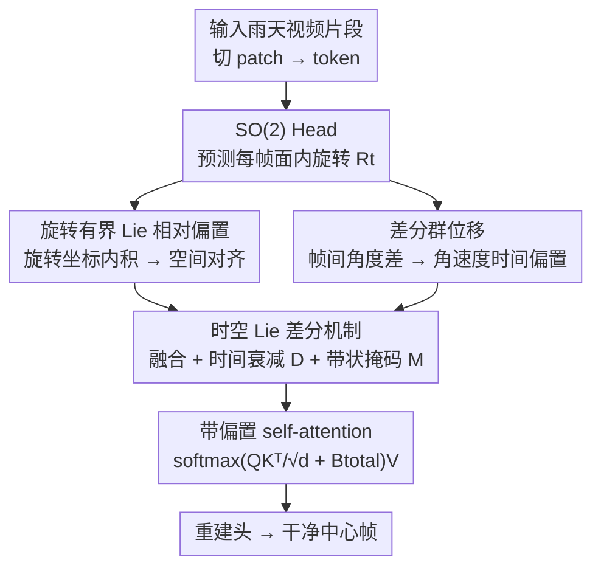

# DeLiVR: Differential Spatiotemporal Lie Bias for Efficient Video Deraining

**会议**: ICLR2026  
**OpenReview**: [https://openreview.net/forum?id=W2eNfLmCHY](https://openreview.net/forum?id=W2eNfLmCHY)  
**代码**: https://github.com/Shuning0312/ICLR-DeLiVR  
**领域**: 视频复原 / 视频去雨  
**关键词**: 视频去雨, Lie 群, 几何先验, 注意力偏置, 时空对齐

## 一句话总结
DeLiVR 把 SO(2) Lie 群的"每帧旋转 + 帧间角速度差分"两类几何先验直接写成注意力偏置加进 Transformer 的打分项里，不依赖光流就实现几何一致的跨帧对齐与时序去雨，在真实雨天 WeatherBench 上以 2.64M 参数刷到 SOTA。

## 研究背景与动机
**领域现状**：视频去雨要从带雨条纹、模糊、噪声的视频里恢复干净帧。早期靠手工先验（频域滤波、稀疏/低秩分解、高斯混合分层），后来 CNN/RNN/GAN 端到端学习，近年又上 Transformer 和扩散模型来捕捉长程时空依赖。

**现有痛点**：跨帧信息怎么用是关键。主流做法要么靠**光流对齐**，要么靠**无约束的隐式注意力**。光流在雨天会失效——它建立在"亮度恒定"假设上，而雨条纹恰恰破坏了这个假设（论文 Fig.1c 直接画出 $\nabla I\cdot v + I_t + \sigma_r \neq 0$ 的失败情形），且计算昂贵、对快速运动和相机抖动脆弱。隐式注意力虽然更鲁棒，但缺乏几何知识，当训练数据里有旋转、快速运动这类复杂运动学特征时，注意力在不同雨密度和轻微相机位姿变化下会"抓错对应"。

**核心矛盾**：网络缺少**物理上可解释的运动先验**来区分"真实跨帧对应"和"雨噪声"。光流给的是不可靠的显式运动，隐式学习又完全没有几何约束——两端都不理想。

**本文目标**：在不依赖光流的前提下，把"连续几何变换"这一物理先验**显式注入注意力**，让网络沿几何对齐的方向聚合特征，同时刻画帧间运动趋势。

**切入角度**：Lie 群天然适合表示连续几何变换。作者观察到雨天的跨帧失配主要来自**面内旋转**（相机位姿的轻微变化），于是用 SO(2) 旋转群来建模每帧朝向，并在其 Lie 代数上做差分得到角速度——这恰好对应雨条纹的方向变化趋势。

**核心 idea**：用 SO(2) Lie 群的旋转先验和帧间角速度差分构造一个"时空 Lie 偏置"，**直接加到 self-attention 的 logits 上**（$\mathrm{softmax}(QK^\top/\sqrt d + \text{Bias})V$），代替脆弱的光流对齐。

## 方法详解

### 整体框架
DeLiVR 的骨架是一个带偏置的时空 Transformer：输入一段视频片段（论文取 $T=5$ 帧连续窗口），先切 patch、embed 成 token；然后一个轻量 **SO(2) Head** 预测每帧的面内旋转 $R_t$，用来捕捉相机位姿变化。基于这些旋转构造两路互补先验——**空间偏置** $B_{space}$（旋转坐标的内积，强制几何一致对齐）和**时间偏置** $B_{time}$（相邻帧角度差，反映相对角位移）；再用**时间衰减 $D$** 和**带状掩码 $M$** 把两路偏置融成统一的时空偏置 $B_{total}$，直接加进自注意力打分。注意力聚焦在可靠的时空对应上，最后由重建头解码出干净的中心帧。

### 关键设计

**1. SO(2) Head：在 Lie 代数上预测有界的每帧旋转**

针对"相机位姿轻微变化导致跨帧失配"这个痛点，作者用一个轻量 head 为每帧 $X_t$ 预测一个旋转矩阵 $R_t\in SO(2)$。关键在于它不直接回归角度，而是在 Lie 代数 $\mathfrak{so}(2)$ 里用轴角表示 $\omega_t$ 参数化，再经指数映射 $\exp(\cdot)$ 转成合法旋转：$R_t = \exp(\tanh(\omega_t))$，并约束 $\|\omega_t\|\le\theta_{max}$。这里 $\mathfrak{so}(2)$ 是 $2\times2$ 反对称矩阵 $\begin{bmatrix}0 & -\theta\\ \theta & 0\end{bmatrix}$，指数映射把它变成标准旋转矩阵 $\begin{bmatrix}\cos\theta & -\sin\theta\\ \sin\theta & \cos\theta\end{bmatrix}$。$\tanh$ 加上界 $\theta_{max}$ 是为了避免退化解——不让网络预测出离谱的大旋转。相比直接回归角度，这种"先在切空间预测、再指数映射回流形"的做法数值稳定、处处可微，而且天然衔接后面的 Lie 偏置构造。

**2. 旋转有界 Lie 相对偏置：把几何一致性写进注意力 logits**

有了每帧旋转，怎么让注意力"知道"两个 token 在几何上是否对应？作者把每个 patch token 的位置嵌成单位归一化的 3D 坐标 $p_i$（$\|p_i\|=1$），对第 $t$ 帧用预测旋转转一下：$\tilde p_{t,i}=R_t p_i$。于是帧 $t$ 的 token $i$ 与帧 $s$ 的 token $j$ 之间的空间偏置定义为旋转后坐标的内积 $B_{space}[(t,i),(s,j)]=\langle\tilde p_{t,i},\tilde p_{s,j}\rangle$——它度量的是"在预测旋转下两者的几何一致相似度"。这个偏置直接加到注意力打分 $\text{Logits}=QK^\top/\sqrt d + B_{space}$。这样自注意力就显式地把每帧位姿纳入考虑，引导网络沿"几何上真正对齐"的对应去聚合特征，而不是被雨条纹误导。

**3. 差分群位移：用 Lie 代数差分估角速度，刻画帧间运动趋势**

空间对齐之外还需要时序一致性。对相邻两帧旋转 $R_{t-1},R_t$，它们的相对运动是 $\Delta R_t = R_{t-1}^\top R_t$；把它经对数映射投回 Lie 代数得到 $v_t=\|\log(\Delta R_t)\|$，整个序列 $\{v_t\}$ 就被解释成视频的"Lie 速度"。对一般帧对 $(t,s)$ 的角度差 $\theta_{t-1,t}=\|\log(R_t^\top R_s)\|$，转成时间偏置 $B_{time}[t-1,t]=-\theta_{t-1,t}/\kappa$（$\kappa$ 是缩放常数），即**位姿差异越大、惩罚越重**，注意力越不该把它们当强对应。为稳住训练，还加了速度正则 $R_v=(1-\beta)\cdot\mathrm{mean}(v_t)+\beta\cdot\mathrm{mean}(|v_t-v_{t-1}|)$，$\beta$ 平衡"整体运动幅度"与"运动平滑度"，鼓励帧间旋转既适度又平滑。这一路提供的是隐式光流给不了的、物理可解释的运动信息。

**4. 时空 Lie 差分机制：衰减 + 掩码融合两路偏置**

最后把空间偏置和时间偏置统一进一个机制：$B_{total}=(B_{space}+\alpha B_{time})\odot D\odot M$。其中 $\alpha$ 平衡时间偏置权重；时间衰减矩阵 $D[t,s]=\exp(-|t-s|/\tau)$ 让模型更看重短程交互（雨天下短程对应更可靠），逐渐压低长程连接；带状掩码 $M[t,s]=\mathbb{1}(|t-s|\le\delta)$ 把每帧的注意力限制在局部时间邻域内，防止隔太远的帧之间产生不稳定的虚假对应。融合后的偏置直接进注意力：$\text{Logits}=QK^\top/\sqrt d + B_{total}$。衰减和掩码这一步并非可有可无——消融里把它们加上带来了最后一档明显提升，因为它把"几何对齐"和"时序正则"紧耦合在同一注意力层内。

### 损失函数 / 训练策略
端到端训练，混合损失 $L=L_{rec}+\lambda_\theta R_\theta+\lambda_v R_v$：重建项 $L_{rec}$ 用 L1 保证像素级保真（从雨帧序列恢复干净中心帧）；$R_\theta$ 约束预测的 SO(2) 旋转幅度以稳住位姿预测；$R_v$ 即上面的 Lie 速度正则，强制时序平滑演化。网格搜索后取 $\lambda_\theta=\lambda_v=0.02$。实现用 PyTorch，8 张 3090，AdamW，初始学习率 $2\times10^{-4}$ 余弦退火 5000 epoch，batch 64，窗口 $T=5$。

## 实验关键数据

### 主实验
四个基准：合成 NTURain / Rain-Syn-Light / Rain-Syn-Complex，真实世界 WeatherBench；指标 PSNR↑ / SSIM↑ / LPIPS↓。

| 数据集 | 指标 | DeLiVR | 之前最好 | 说明 |
|--------|------|--------|----------|------|
| WeatherBench(真实) | PSNR↑ | **26.56** | 26.51 (S2VD) | 真实雨天刷新 SOTA |
| WeatherBench(真实) | SSIM↑ | **0.781** | 0.773 (VDMamba) | VDMamba 真实场景掉到 23.91/0.773 |
| Rain-Syn-Light | PSNR↑ | **30.53** | 28.76 (VDMamba) | +1.77 dB |
| Rain-Syn-Complex | PSNR↑ | **24.68** | 21.05 (MFGAN) | 复杂合成雨大幅领先 |
| NTURain | PSNR↑ | 34.06 | 36.29 (VDMamba) | 此项次于 VDMamba |

关键对比：VDMamba（CVPR25）在合成 NTURain 上很强（36.29），但迁到真实 WeatherBench 就明显掉点（23.91/0.773），而 DeLiVR 在真实场景反而最好——说明 Lie 群几何先验带来的是**泛化鲁棒性**而非过拟合合成分布。

### 消融实验
NTURain 上逐组件叠加（FVD 越低越好）：

| 配置 | PSNR↑ | SSIM↑ | FVD↓ | 说明 |
|------|-------|-------|------|------|
| Baseline（纯时空 Transformer） | 29.21 | 0.868 | 47.25 | 无 Lie 偏置 |
| + $B_{space}$ | 32.58 | 0.927 | 31.6 | 空间几何对齐 +3.37 dB |
| + $B_{time}$ | 33.14 | 0.935 | 22.5 | 加帧间运动建模 |
| + D&M（完整） | **34.06** | **0.952** | **18.5** | 衰减+带状掩码再提升 |

### 关键发现
- **空间偏置贡献最大**：单加 $B_{space}$ 就把 PSNR 从 29.21 拉到 32.58（+3.37 dB），印证"显式几何对齐"是核心。论文正文写 +1.37 dB，与表格 +3.37 dB 不一致（⚠️ 以原文表格为准，疑为笔误）。
- **替光流的可控对比**：在 12 层 Transformer、同训练协议下，把 Lie 旋转模块换成"RAFT 光流经 MLP 预测偏置"，DeLiVR 在 NTU-Rain 上 PSNR 高出 **+2.43 dB**，直接证明 SO(2) 流形上建模雨条纹方向比无约束光流更强更稳。
- **轻量高效**：DeLiVR 仅 2.64M 参数、82.52 ms/帧，远小于 Turtle(58.62M)/ViWS-Net(57.82M)；虽不如极简的 S2VD(0.53M/26.78ms)，但精度全面占优。
- **旋转扰动实验**：人为给若干帧注入小幅面内旋转制造失配，旋转感知模型表现出更清晰的时序稳定性、注意力熵更高且高值区更集中，提供了"确实在解决跨帧失配"的可解释性证据。
- **下游受益**：去雨作为预处理后，目标检测（mAP）和语义分割（mIoU）在雨天输入上的结果明显改善。

## 亮点与洞察
- **把几何先验做成"注意力偏置"而非"显式 warp"**：不去算光流再对齐，而是把旋转一致性直接写进 logits，既绕开亮度恒定假设的失效，又让对齐在注意力内部自适应发生——这个"几何先验注入注意力"的范式可迁移到任何需要跨帧/跨视图对齐的视频任务。
- **Lie 代数切空间预测的稳定性 trick**：预测 $\omega_t$ 再 $\exp$ 映射回 SO(2)，加 $\tanh$ 上界，是一个处处可微、数值稳定且物理合法的旋转参数化模板，比直接回归角度优雅。
- **差分得"Lie 速度"**：用 $R_{t-1}^\top R_t$ 的对数范数当帧间角速度，把时序运动变成可正则、可衰减的标量序列，思路干净。
- **真实/合成泛化反差的洞察**：合成榜单第一不等于真实场景能打，几何先验恰恰是抗分布漂移的关键——这对所有 low-level 视觉任务都是提醒。

## 局限与展望
- 作者承认：**仅靠旋转建模**，难以覆盖更复杂的非刚性雨动态或面内旋转之外的相机运动（平移、缩放、3D 旋转）；引入 Lie 偏置相比纯隐式对齐也带来额外计算开销。未来想扩到更丰富的变换群如 SE(2)/SE(3)。
- 自己观察：方法假设跨帧失配主导成分是**面内旋转**，对纯平移抖动或剧烈非刚性运动场景的有效性有待验证；窗口固定 $T=5$，长程时序一致性（被衰减+掩码主动压制）在长视频上是否够用存疑。
- 正文 +1.37 dB 与消融表 +3.37 dB 的数据不一致，是写作上的疏漏，读者引用时需以表 2 为准。

## 相关工作与启发
- **vs 光流对齐方法（RAFT-guided / Frame-Consistent Recurrent Deraining / 高分辨率光流递归网络）**：它们显式估计光流再对齐，雨天亮度恒定假设失效导致光流被污染；DeLiVR 用 SO(2) 旋转先验替代，受控对比下 NTU-Rain +2.43 dB、WeatherBench 上也全面超过两个 flow-based baseline，且不需要光流计算。
- **vs Transformer/Mamba 去雨（ViWS-Net / VDMamba / rainmanba）**：它们靠数据驱动的隐式注意力捕捉长程依赖，缺几何约束，在复杂运动和真实场景下泛化弱（VDMamba 真实 WeatherBench 掉到 23.91）；DeLiVR 注入显式几何偏置，真实场景反超。
- **vs 严格等变 Lie 网络（equivariant designs）**：完全等变设计计算昂贵且难处理时序动态；DeLiVR 只注入"轻量 Lie 差分偏置"，在几何一致性和效率间取得平衡（2.64M 参数）。

## 评分
- 新颖性: ⭐⭐⭐⭐⭐ 首次把 Lie 群差分偏置引入视频去雨，"几何先验直注意力"范式干净且独立于光流。
- 实验充分度: ⭐⭐⭐⭐ 四基准 + 逐组件消融 + 替光流可控对比 + 效率 + 下游任务，较全面；但正文与表格有一处数据不一致。
- 写作质量: ⭐⭐⭐⭐ 公式推导清晰、动机讲透；个别数字笔误。
- 价值: ⭐⭐⭐⭐ 轻量、真实场景泛化强，几何先验注入思路对 low-level 视频任务有迁移价值。

<!-- RELATED:START -->

## 相关论文

- [\[AAAI 2026\] SpatioTemporal Difference Network for Video Depth Super-Resolution](../../AAAI2026/image_restoration/spatiotemporal_difference_network_for_video_depth_super-resolution.md)
- [\[ICLR 2026\] Continuous Space-Time Video Super-Resolution with 3D Fourier Fields](continuous_space-time_video_super-resolution_with_3d_fourier_fields.md)
- [\[ICLR 2026\] DeAltHDR: Learning HDR Video Reconstruction from Degraded Alternating Exposure Sequences](dealthdr_learning_hdr_video_reconstruction_from_degraded_alternating_exposure_se.md)
- [\[CVPR 2026\] A Bit is All You Need! Efficient Video Capture via Single Bit Imaging](../../CVPR2026/image_restoration/a_bit_is_all_you_need_efficient_video_capture_via_single_bit_imaging.md)
- [\[ICLR 2026\] DISK: Differentiable Sparse Kernel Complex for Efficient Spatially-Variant Convolution](disk_differentiable_sparse_kernel_complex_for_efficient_spatially-variant_convol.md)

<!-- RELATED:END -->
