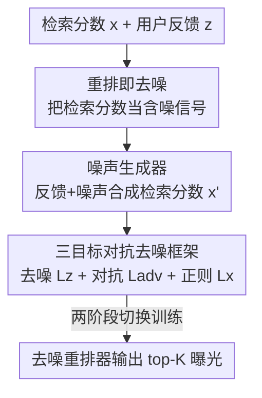

# Denoising Neural Reranker for Recommender Systems

**会议**: ICLR2026  
**OpenReview**: [https://openreview.net/forum?id=JlwYkFm91F](https://openreview.net/forum?id=JlwYkFm91F)  
**代码**: https://github.com/maowenyu-11/DNR  
**领域**: 推荐系统 / 重排  
**关键词**: 推荐系统, 多阶段重排, 去噪, 对抗学习, 检索分数

## 一句话总结
本文指出工业级两阶段推荐里"检索→重排"中被忽略的检索分数其实是有用但带噪的信号，于是把重排重新形式化成对检索分数的去噪任务，并配上一个对抗噪声生成器，用去噪 + 对抗 + 分布正则三个目标联合训练，在三个公开数据集和一个工业系统上稳定超过现有重排 SOTA。

## 研究背景与动机
**领域现状**：工业推荐通常是多阶段级联——先用一个简单高效的检索器（retriever）从百万级物品池里粗选出几十个候选并打分，再用一个更复杂但更慢的重排器（reranker）对这几十个候选做精排，最终曝光 top-K 给用户。为了让两阶段朝同一个目标（对齐用户行为）协同优化，已有工作绝大多数在做"reranker-aware retriever"，即让检索器去迎合重排器。

**现有痛点**：反方向——"retriever-aware reranker"，也就是让重排器去利用检索阶段产出的信息——几乎没人系统研究。现有重排方法（单点重打分、list-refinement、生成器-评估器、扩散式列表生成）基本都把检索分数丢掉，或者最多把它当成一个额外输入特征直接拼进模型。

**核心矛盾**：作者通过实证观察发现，检索器因算力受限只能用简单模型处理大候选池，因此它的打分**噪声明显大于**重排器（图 1e 显示重排器的误差分布更集中在 0 附近）。也就是说，重排阶段天然就是一个"对检索分数做降噪"的过程。但检索分数里的噪声带有不确定性，如果只是把它当特征塞进去（naive 方案），去噪过程可能反而偏离"对齐用户反馈"这个系统级目标。作者还从理论上证明：把检索分数直接当输入优化（$\mathcal{L}_{direct}$）只是在优化负数据对数似然的一个**上界**，其中两个残差项 $\mathcal{L}_1$、$\mathcal{L}_2$ 与重排器无关、不可控，从而导致重排结果与用户反馈之间存在系统性失配。

**本文目标**：要做一个"噪声感知（noise-aware）"的重排器——既能利用检索分数这个先验，又能显式地把它当成含噪信号来去噪，且去噪方向始终对齐用户真实反馈。

**核心 idea**：把重排建模为对检索分数的**噪声还原（noise reduction）问题**，并引入一个**对抗噪声生成器**来合成"检索器本可能产出的"带噪分数，让重排器在这些增广样本上学会鲁棒去噪——即用"去噪 + 对抗探索 + 分布正则"三个目标，逼近用户反馈对齐的真正目标。

## 方法详解

### 整体框架
DNR（Denoising Neural Reranker）站在一个概率视角看待两阶段推荐：对一个用户请求 $u$，检索器先产出连续检索分数 $x_u=[x_{i_1},\dots,x_{i_n}]\in[0,1]^n$（视为不可优化的先验 $p_x(x)$），真实用户反馈是二值标签 $z_u\in\{0,1\}^n$（点击/观看/分享等）。重排器是一个条件似然估计器 $q_\theta(z|x,u)$，目标是最大化观测反馈的对数似然 $\max_\theta \log p(z_u|u,\theta)$。

DNR 的关键转折是：不只在真实检索分数 $x$ 上去噪，而是额外引入一个**噪声生成器** $f_\phi(\cdot|z_u)$，从用户反馈出发合成"检索器可能产出的带噪分数后验" $p_\phi(x|z_u)$，再让重排器在真实分数和合成分数上一起去噪。整篇方法可以拆成三块协同工作：把重排重写成去噪任务（带理论局限分析）、构造噪声生成器合成检索分数、用三目标对抗框架联合训练去噪器与生成器。三者的数据流如下：

### 关键设计

**1. 把重排重写成对检索分数的去噪：先指出 naive 方案的理论局限**

作者先把"直接把检索分数当输入优化"的 naive 方案写成 $\mathcal{L}_{direct}=-\mathbb{E}_{x\sim p_x}[\log q_\theta(z_u|x)]$（二值反馈下即标准 BCE）。看起来很合理，但理论上它只是负数据对数似然的一个上界：

$$-\log p(z_u)=\mathcal{L}_{direct}+\mathcal{L}_1+\mathcal{L}_2,\quad \mathcal{L}_1=\mathbb{E}_{x\sim p_x}\Big[\log\tfrac{q_\theta(z_u|x)}{p_{z|x}(z_u|x)}\Big],\quad \mathcal{L}_2=-D_{KL}\big(p_x(x)\|p_{x|z}(x|z_u)\big).$$

其中 $p_{z|x}$ 是真实反馈概率、$p_{x|z}$ 是给定反馈后检索分数的后验——这两项都只由检索器先验和用户决定，**和重排器 $q_\theta$ 无关、无法被 $\mathcal{L}_{direct}$ 控制**。只有当 $\mathcal{L}_1,\mathcal{L}_2$ 也小时，优化上界才等价于优化真正目标；但 naive 方案管不到它们，于是出现"重排结果偏离用户反馈"的失配。这一分析把问题精确定位到"$p_x$ 与后验 $p_{x|z}$ 之间的鸿沟"，为后面引入噪声生成器去逼近后验提供了动机——这是本文区别于"把检索分数当普通特征"的根本出发点。

**2. 噪声生成器：从用户反馈反向合成带噪检索分数后验**

为了去填上面那个 $\mathcal{L}_2$ 里的后验鸿沟，作者给去噪重排器配一个噪声生成器 $f_\phi(\cdot|z_u)$，借鉴重参数化技巧，从用户反馈加噪声合成检索分数：

$$x'_u=(1-\lambda_c)z_u+\lambda_c\epsilon,\quad \epsilon\sim f_\phi,$$

其中 $\epsilon$ 表示检索分数里的"噪声行为"，$\lambda_c$ 控制噪声占比。这样合成出的 $x'_u\sim p_\phi$ 就是在模拟"检索器在这个请求下本可能产出的带噪分数"，相当于对后验 $p_{x|z}$ 的采样近似。生成器有两种实现：**启发式生成器**直接用预设分布——作者论证二值反馈下检索先验的共轭先验/后验都是 Beta 分布，于是取 $\epsilon\sim\mathrm{Beta}(\alpha,\beta)$（简单情形 $\alpha=\beta=0.5$，也可按数据观测噪声调参），这比常见的高斯噪声更贴合检索分数的噪声性质；**模型化生成器**则用一个 2 层 MLP 学一个可训练的 $f_\phi^{model}$，直接输出 $x'_u$，让噪声分布能自适应、个性化地拟合，此时噪声由模型学习、$\lambda_c$ 可直接取 1 无需手调。模型化生成器是后续对抗学习的主角。

**3. 三目标对抗去噪框架：把反馈对齐目标分解成去噪、对抗、正则三项**

作者把负对数似然目标分解（推导见原文附录 B.1，⚠️ 以原文为准）成三个可优化项加一个不可优化残差：

$$-\log p(z_u)=\mathcal{L}_z+\mathcal{L}_{adv}+\mathcal{L}_x+\delta_x,$$
$$\mathcal{L}_z=-\mathbb{E}_{x\sim p_\phi}[\log q_\theta(z_u|x)],\quad \mathcal{L}_{adv}=\mathbb{E}_{x\sim p_\phi}\Big[\log\tfrac{q_\theta(z_u|x)}{p_{z|x}(z_u|x)}\Big],\quad \mathcal{L}_x=D_{KL}\big(p_\phi(x|z_u)\|p_x(x)\big).$$

三项各司其职：**$\mathcal{L}_z$（增广去噪损失）** 让重排器 $q_\theta$ 在生成器合成的带噪分数 $x'_u$ 上预测真实反馈 $z_u$（同样可化简成 BCE），相当于让重排器见过"检索器各种可能的带噪表现"，从而更鲁棒；它和直接优化合起来构成重排器最终损失 $\mathcal{L}_\theta=\mathcal{L}_{direct}+\lambda_m\mathcal{L}_z$，此时生成器参数固定。**$\mathcal{L}_{adv}$（对抗噪声损失）** 反过来固定重排器、训练生成器去合成那些"难被正确去噪"的样本 $\min_\phi \log q_\theta(z_u|x'_u)$，鼓励生成器探索检索分数空间里重排器的薄弱区，进而逼重排器变强——但它不鼓励"过度探索"，因为离真实检索分数太远的合成分数会偏离用户反馈、反而违背 $\mathcal{L}_{adv}$，形成自我约束。**$\mathcal{L}_x$（分布正则）** 用 KL 散度把合成分数分布 $p_\phi$ 拉近真实检索分数先验 $p_x$，保证生成的噪声"像真的检索噪声"。残差 $\delta_x=-D_{KL}(p_\phi\|p_{x|z})\le 0$ 因 $p_{x|z}$ 未知不可直接优化，但期望随前三项优化而趋小。整个去噪器 + 对抗生成器构成一个 GAN 式的极小极大博弈，这正是 DNR 相比"单一去噪目标"更强的关键。

### 损失函数 / 训练策略
重排器最终损失为 $\mathcal{L}_\theta=\mathcal{L}_{direct}+\lambda_m\mathcal{L}_z$，框架对重排器骨干不做限制（可用 PRM、Pier 等）。训练分两阶段以保证稳定：前 $\lambda_e$ 个 epoch 先用启发式生成器（Gaussian/Beta）保证重排器在 $\mathcal{L}_z$ 上稳定收敛，之后再切换到模型化生成器，启用对抗学习 $\mathcal{L}_{adv}$ 与正则 $\mathcal{L}_x$。模型化生成器用 2 层 MLP 经 Eq.(4) 端到端输出 $x'_u$；当生成器不可微时可改用重参数化或 policy gradient。关键超参 $\lambda_c$（噪声占比）、$\lambda_m$（去噪损失权重）、$\lambda_e$（切换时机）分别在 $[0.1,1.0]$、$[0.1,1.0]$、$[0,200]$ 搜索。

## 实验关键数据

### 主实验
数据集：ML-1M、Kuaivideo、Amazon-Books 三个公开集 + 一个工业推荐系统（在线实验见原文附录）。检索器用协同过滤取 top-50 候选，重排器精排选 top-K=6 曝光，隐层维度统一 128。指标：H@6、N@6、M@6、F1@6、AUC。DNR-G / DNR-B 分别表示切换前用高斯 / Beta 启发式噪声。

| 数据集 | 指标 | 最佳 baseline | DNR-B | DNR-G |
|--------|------|--------------|-------|-------|
| ML-1M | N@6 | 76.18 (MG-E) | 77.12 | **77.67** |
| Kuaivideo | N@6 | 66.19 (MG-E) | 70.15 | **69.60**（H@6 达 50.30，最佳） |
| Book | N@6 | 80.75 (EGRank) | **83.53** | 82.57 |
| Kuaivideo | AUC | 90.93 (Pier) | 93.38 | 93.20 |

DNR 在三个数据集上对四类 baseline（传统重打分 SASRec/Caser/GRU4Rec/MiDNN、list-refinement DLCM/SetRank/PRM/MIR、生成器-评估器 EGRerank/Pier/NAR4Rec、扩散式 DiffuRec/DCDR）全面、统计显著（t-test $p<0.05$）地领先，尤其在噪声更大的工业数据 Kuaivideo 上提升最明显（H@6 从 46.89 提到 50.30）。

### 消融实验

| 配置 | 含义 | 结果趋势 |
|------|------|---------|
| c/+/w score | 把检索分数当拼接/加法/权重特征 | 都优于无分数的 PRM 骨干，证明检索分数确实有用 |
| DNR (PRM & Pier 骨干) | 去噪形式化 | 在两种骨干上都超过上面三种 naive 用法，且换骨干仍稳定提升 |
| w/ G、w/ B | 仅启发式生成器（无切换/对抗） | 优于 PRM，证明 $\mathcal{L}_z$ 有效 |
| G/B w/o $\mathcal{L}_{adv}$ | 去掉对抗目标 | 全面掉点 |
| G/B w/o $\mathcal{L}_x$ | 去掉分布正则 | 全面掉点 |
| DNR-G / DNR-B（Full） | 完整模型 | 最佳 |

以 Kuaivideo / N@6 为例：PRM 55.93 → w/G 67.34 → DNR-G 69.60；DNR-B 的 w/o $\mathcal{L}_x$ 为 69.93 而 Full 达 70.15，逐项验证三个目标都有贡献。

### 关键发现
- **检索分数确实是被低估的信号**：哪怕只是把它当特征拼进去（c/+/w score）都能稳定提升，但 DNR 的去噪式利用比这三种 naive 用法都好。
- **对抗 + 模型化生成器 > 启发式**：把启发式（w/G、w/B）换成模型化对抗生成器后一致更优，说明自适应学习噪声分布比手工设分布更贴合。
- **三个目标缺一不可**：去掉 $\mathcal{L}_{adv}$ 或 $\mathcal{L}_x$ 都掉点。
- **超参存在最优区间**：$\lambda_c,\lambda_m,\lambda_e$ 各自在搜索区间内有峰值，过度放大都会掉点，体现各组件需保持平衡。

## 亮点与洞察
- **把"重排"重新定义成"对检索分数去噪"**：这是最漂亮的视角转换——它把一个被所有人当噪声丢掉的信号（检索分数）变成了去噪的对象与先验，并用图 1 的噪声分布对比给了直接证据。
- **理论先证 naive 方案的局限再补设计**：先把"直接用检索分数"写成对数似然的上界、指出两个不可控残差项，再用噪声生成器去逼近后验填鸿沟，整条逻辑是"理论缺口 → 针对性设计"，比单纯堆模块有说服力。
- **GAN 式对抗用在重排上**：让噪声生成器专门合成"重排器难去噪"的检索分数，本质是对检索分数空间做困难样本增广，这个思路可迁移到任何"下游模型要消费上游带噪打分"的级联系统（如搜索的多路召回融合、广告分层竞价）。
- **模型无关**：对 PRM / Pier 等不同重排骨干都即插即用且稳定提升，工程落地成本低。

## 局限与展望
- **依赖"检索分数比重排分数更噪"这个经验假设**：在检索器本身已经很强、或检索分数不可得/不连续的系统里，这个前提可能不成立，去噪视角的收益会打折。
- **后验 $p_{x|z}$ 不可知**：残差 $\delta_x$ 只能"期望它变小"而无法直接优化，三目标是否真能把它压到足够小缺乏直接度量。
- **对抗训练 + 两阶段切换引入额外超参**（$\lambda_c,\lambda_m,\lambda_e$ 及切换时机），且对抗学习本身的稳定性/收敛性在更大规模下的表现需更多验证。
- **改进方向**：把噪声生成器换成更强的条件生成模型（如条件扩散）来更精细地建模检索噪声后验；或把去噪形式化扩展到三段以上的更深级联，逐级去噪。

## 相关工作与启发
- **vs reranker-aware retriever（级联联合优化主流）**：他们用后段模型去指导前段检索器学习；本文相反，用前段检索分数去约束后段重排器优化，是互补方向。
- **vs list-refinement（PRM / SetRank / MIR）**：它们建模候选间的相互影响来重排，但基本忽略检索分数；DNR 把检索分数当含噪先验显式去噪，可叠加在这些骨干之上。
- **vs 生成器-评估器 / 扩散式重排（Pier / NAR4Rec / DCDR / DiffuRec）**：它们靠生成多个候选列表再评估，计算开销大；DNR 不改变"列表生成"范式，而是从"如何利用检索分数"这个正交维度增强重排器。
- **vs 推荐里的对抗学习（IRGAN / AdvIR）**：IRGAN 用极小极大博弈采样难负样本、AdvIR 对 embedding 加扰动；DNR 借用对抗思想，但生成的是"难去噪的检索分数"，目的是增强重排器对检索噪声的去噪能力。

## 评分
- 新颖性: ⭐⭐⭐⭐⭐ "重排=对检索分数去噪"的视角转换 + 对抗噪声生成器，切口新且有理论支撑
- 实验充分度: ⭐⭐⭐⭐ 三公开数据集 + 工业系统 + 多骨干 + 逐项消融 + 超参敏感性，覆盖全面
- 写作质量: ⭐⭐⭐⭐ 从实证观察到理论分析再到方法设计，逻辑链清晰
- 价值: ⭐⭐⭐⭐ 模型无关、即插即用，对工业级联推荐有直接落地价值

<!-- RELATED:START -->

## 相关论文

- [\[ICLR 2026\] DiffusionBlocks: Block-wise Neural Network Training via Diffusion Interpretation](diffusionblocks_block-wise_neural_network_training_via_diffusion_interpretation.md)
- [\[CVPR 2026\] The Surprising Effectiveness of Noise Pretraining for Implicit Neural Representations](../../CVPR2026/image_restoration/the_surprising_effectiveness_of_noise_pretraining_for_implicit_neural_representa.md)
- [\[ICLR 2026\] SuperF: Neural Implicit Fields for Multi-Image Super-Resolution](superf_neural_implicit_fields_for_multi-image_super-resolution.md)
- [\[CVPR 2025\] A Physics-Informed Blur Learning Framework for Imaging Systems](../../CVPR2025/image_restoration/a_physics-informed_blur_learning_framework_for_imaging_systems.md)
- [\[ICML 2026\] Semi-Supervised Neural Super-Resolution for Mesh-Based Simulations](../../ICML2026/image_restoration/semi-supervised_neural_super-resolution_for_mesh-based_simulations.md)

<!-- RELATED:END -->
