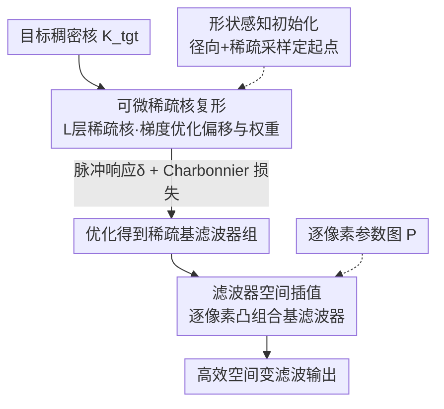

# DISK: Differentiable Sparse Kernel Complex for Efficient Spatially-Variant Convolution

**会议**: ICLR2026  
**OpenReview**: [https://openreview.net/forum?id=bbuxDoRD2D](https://openreview.net/forum?id=bbuxDoRD2D)  
**代码**: 待确认  
**领域**: 图像恢复 / 高效卷积  
**关键词**: 稀疏核分解, 空间变卷积, 可微优化, 实时渲染, 移动成像

## 一句话总结
把一个大而复杂的稠密卷积核重新表示成「一串稀疏核的级联」，用端到端可微优化（而非启发式搜索）学出每层稀疏采样点的偏移与权重，再配上形状感知初始化和滤波器空间插值，在移动设备上以接近 ground-truth 的画质实现最高约 20× 的空间变滤波加速。

## 研究背景与动机
**领域现状**：大核、复杂核的图像卷积是计算摄影、光学成像、动画渲染里的基础操作——景深虚化、各种点扩散函数（PSF）、旋转/径向运动模糊都靠它实现。核越大、形状越复杂，效果越逼真，但稠密卷积是 $O(M^2)$ 的开销（$M$ 为核边长），对手机这类资源受限设备根本跑不动。

**现有痛点**：为加速，业界主要走两条路，但都各有硬伤。一条是低秩分解（LowRank/SVD），它支持任意核，但本质是把一次大卷积换成若干次较小的**稠密**卷积，稀疏度受限、加速天花板低，而且在非凸核上会出现块状伪影。另一条是直接用真正稀疏的核去逼近稠密核（如 PST 并行模拟退火/并行回火），稀疏化彻底、加速明显，但它靠启发式搜索找采样模式，迭代成本高（动辄十万步），还因为优化地形非凸而经常错过高保真解。

**核心矛盾**：要同时拿到「任意/非凸核的通用性」和「真正稀疏带来的高加速」，就必须在一个高度非凸的离散采样空间里做优化；启发式搜索既慢又不可靠，而结构化分解（低秩、可分离 1D 核）又只能处理特定结构的核。

**本文目标**：(i) 给任意（含非凸）稠密核找到高保真的稀疏表示；(ii) 让优化稳定、迭代少；(iii) 把单核逼近推广到「每像素一个核」的空间变滤波，且不增加运行时成本。

**切入角度**：作者注意到「一串稀疏核的级联卷积」本身就能逼近一个大稠密核，而采样点的偏移和权重都是连续量——既然连续，就能求梯度。于是把离散启发式搜索改写成**端到端可微优化**，用梯度下降代替模拟退火。

**核心 idea**：把稠密核分解成「可微的稀疏核复形（Sparse Kernel Complex）」，用梯度优化所有层的偏移+权重；再用形状感知初始化稳住非凸核的收敛，用滤波器空间插值把空间变滤波的核合成成本从图像分辨率里解耦出来。

## 方法详解

### 整体框架
输入是一个已知的目标稠密核 $K_{tgt}$（以及空间变滤波时的逐像素参数图 $P$），输出是一组稀疏基滤波器，运行时用它们高效合成出与目标几乎一致的滤波结果。整条管线分三步：先用形状感知初始化给稀疏采样点一个好起点；再把「$L$ 层、每层 $N$ 个采样点」的稀疏核复形当成可微参数，用脉冲响应监督 + Charbonnier 损失端到端优化出每个偏移和权重；最后对空间变滤波，离线优化出一组覆盖效果范围的基滤波器，运行时按逐像素参数对基做凸组合插值，避免实时生成稠密核。

一个关键的表示是把 $L$ 层稀疏核的级联写成嵌套卷积：

$$I_{out} = (\dots((I_{in} * K_1) * K_2) * \dots * K_L),$$

每层稀疏核 $K_{sparse}=\{(o_i, w_i)\}_{i=1}^{N}$ 只有少量「偏移-权重」对，于是每像素开销从 $O(M^2)$ 降到 $O(\sum_{l=1}^{L} N_l)$，而 $\sum N_l \ll M^2$，加速由此而来。

### 关键设计

**1. 可微稀疏核复形：把稠密核拆成 L 层稀疏核做端到端梯度优化**

这一步直接针对「启发式搜索又慢又错过高保真解」的痛点。作者把分解写成一个连续优化问题：所有层、所有采样点的偏移 $o_{l,i}$ 和权重 $w_{l,i}$ 组成可学习参数集 $\Theta=\bigcup_{l=1}^{L}\{(o_{l,j}, w_{l,j})\}_{j=1}^{N_l}$，目标是最小化复合核与目标核的差异：

$$\Theta^* = \arg\min_{\Theta}\ \mathcal{L}\big(K_{target},\ F_{approx}(\Theta)\big),\quad F_{approx}(\Theta)=K_{s,1} * K_{s,2} * \dots * K_{s,L}.$$

由于偏移和权重都是连续可微的，整套级联可以用 Adam 一次性端到端优化所有层，不再像 PST 那样在离散空间里盲搜。好处是收敛更可靠、迭代数大幅下降——论文里它只用 1000 步就能超过 PST 跑 100,000 步（10,000 迭代 × 10 并行候选）的质量，约 1/100 的迭代量，这是「可微」相比「启发式」最直接的红利。

**2. 形状感知初始化：径向 + 稀疏采样让非凸核也能稳定收敛**

可微优化虽好，但非凸目标核的优化地形布满坏的局部最优，随机初始化经常让梯度消失或卡死。作者用两部分初始化稳住起点。其一是**径向初始化**：第 $l$ 层的采样点均匀分布在半径 $r_l = l\cdot\Delta r$ 的圆周上，半径随层号线性增长，使复合核的有效感受野逐层扩张，一开始就能覆盖大面积目标核：

$$o_{l,i}=\Big(r_l\cos\tfrac{2\pi i}{N_l},\ r_l\sin\tfrac{2\pi i}{N_l}\Big),\quad w_{l,i}=\tfrac{1}{N_l}.$$

其二是针对第一层 $K_{s,1}$（它对最终输出影响最大）的**稀疏采样初始化**：不在核的外接框里采样（非凸核的外接框含大量空白区），而是用拒绝采样直接从核的支撑集（非零像素）里取点。先把有效采样面积 $S$ 定为非零像素数，再按目标采样数 $N_s$ 推出采样半径 $r=\sqrt{S/(N_s\pi)}$。这样采样点天然贴合目标形状，避开空白区导致的梯度消失，显著降低陷入坏局部最优的风险。

**3. 滤波器空间插值：用基滤波器凸组合实现高效空间变滤波**

空间变滤波要给每个像素 $(x,y)$ 按参数 $P(x,y)$ 生成一个独立的核，实时生成稠密核太慢、预存所有核又太占内存——开销随图像分辨率线性增长，这是瓶颈所在。作者的做法是把核合成成本从分辨率里解耦：离线先优化出一组有序基滤波器 $\mathcal{F}=\{f_k(p_k)\}_{k=1}^{M}$，它们离散采样一个连续的一维滤波器空间（参数 $p_1<p_2<\dots<p_M$，每个基是一组稀疏的偏移+权重）。运行时对每像素由 $P(x,y)$ 得到一组插值权重 $\alpha(x,y)$，把核合成为基滤波器的凸组合：

$$f(x,y)=\sum_{k=1}^{M}\alpha_k(x,y)\cdot f_k,\quad \sum_k\alpha_k=1,\ \alpha_k\ge 0.$$

因为直接在「偏移+权重」层面插值，每像素只剩极少量可并行的乘加，核生成成本与图像分辨率无关，还因为基高度可压缩而省内存。论文进一步分析：优化得到的基比 PST/LowRank 的基「更线性可插值」，所以插值后仍能拼出锐利的复杂结构，而 PST 插出更多噪声、LowRank 插成模糊均值。

### 损失函数 / 训练策略
为避免学到的滤波器对特定图像过拟合，作者用**图像无关**的优化策略，利用线性平移不变（LSI）系统的核心性质——一个滤波器完全由它的脉冲响应刻画。具体地，把多层滤波器 $F_\theta$ 作用在离散狄拉克脉冲 $\delta$（中心单点为 1）上，得到合成核 $K_{syn}=F_\theta(\delta)$，再用 Charbonnier $L1$ 损失监督它逼近目标核：

$$\mathcal{L}=C(K_{syn}, K_{tgt}).$$

这种「脉冲响应监督」把整条多层滤波序列「坍缩」成一个等效核，可以直接、精确地对齐目标，不依赖任何具体图像。实现上用 PyTorch + Adam，学习率从 $1\times10^{-3}$ 线性衰减到 $1\times10^{-4}$，每个核优化 1000 步，单张 24GB GPU（算力约 RTX 4090）即可。

## 实验关键数据

### 主实验
评测核包括高斯核（$\sigma=5\sim11$）、几何基元（disk、ring）、正多边形、非凸形状（心形、四角星、& 符号）、动物剪影，以及光学 PSF（彗差 coma、球差）。基线为低秩分解 LowRank（SVD）和并行回火 PST。空间变滤波在移动端 Snapdragon 8 Gen 3 上测延迟。

下表为三种空间变滤波效果（Fig. 5）的延迟/质量对比，本文在与 PST 相当甚至更低延迟下取得最高 PSNR，且接近 GT 画质：

| 空间变效果 | 方法 | 延迟 (ms) | PSNR (dB) |
|------------|------|-----------|-----------|
| 1D tilt-shift 倾斜移轴 | GT（参考） | 241.33 | — |
| | **Ours 24×4** | **12.66** | **39.27** |
| | PST 24×4 | 12.61 | 32.49 |
| | LowRank 49×4 | 23.15 | 33.22 |
| 2D 旋转 bokeh | **Ours 32×4** | **17.04** | **35.67** |
| | PST 32×4 | 16.94 | 28.56 |
| 2D 径向运动模糊 | **Ours 32×4** | **26.01** | **34.21** |
| | PST 32×4 | 26.09 | 27.11 |

单核逼近上（Fig. 2/4），本文在所有测试上取得最低 LPIPS，常常大幅领先：高斯核 8×6 配置下 LPIPS 约 0.001–0.002，而 PST 8×6 约 0.008–0.019；$\sigma$ 越大 PST 退化越严重，本文仍视觉连贯。Fig. 1 给出的量级是 241.33ms → 12.66ms，约 **20×** 加速且画质接近 GT。

### 消融实验

| 配置 | 关键结论 | 说明 |
|------|----------|------|
| 稀疏采样初始化 (SS) | 最优 | 收敛最快、质量最高 |
| 递增径向初始化 (IR) | 次之 | 稳定但弱于 SS |
| 随机初始化 (Rand) | 最差 | 易陷坏局部最优 |
| 可微优化 vs PST | 1/100 迭代 | 本文 1000 步 vs PST 100,000 步 |
| 层数 × 采样数 | 越多越好 | 所有配置都稳定收敛，样本/层越多质量越高 |

### 关键发现
- **初始化是关键**：SS > IR > Random；即便给 PST 也用上 SS，它仍需 30× 以上的迭代才收敛，且最终质量明显低于本文——说明红利主要来自「可微优化」而非单纯换初始化。
- **可微 vs 启发式**：梯度优化在稀疏（如 12×4）配置下尤其稳，PST 在 $\sigma$ 增大或样本变少时噪声/伪影明显。
- **基的可插值性决定空间变质量**：本文优化出的基「更线性」，插值后能拼出锐利复杂结构；PST 插出噪声、LowRank 插成模糊。

## 亮点与洞察
- **把离散搜索改写成可微优化**：核心洞察是「采样点偏移+权重连续可微」，于是用梯度下降一举取代模拟退火，迭代量降到约 1/100——这是把一个工程加速问题重新表述成学习问题的范例。
- **脉冲响应监督做图像无关训练**：借 LSI「滤波器=脉冲响应」的性质，把多层级联坍缩成单个等效核来监督，训练完全不挂任何图像，泛化性天然好，这个 trick 可迁移到任何需要学滤波器/算子近似的场景。
- **在「滤波器空间」而非「图像空间」插值**：把每像素核合成成本与分辨率解耦，是空间变滤波提速的关键思路，可复用到 bokeh、运动模糊、可变 PSF 等任意逐像素算子。
- **形状感知（拒绝）采样**：对非凸核直接从支撑集采样而非外接框，避免空白区的梯度消失，是处理非凸目标的实用招。

## 局限与展望
- **假设目标稠密核已知**：方法在优化和滤波时都要求 $K_{tgt}$ 可得（与 LowRank/PST 同假设），不适用于「核未知、需从数据反推」的盲场景。
- **滤波器空间是一维的**：基滤波器沿一维参数离散采样，处理多参数（如同时变 intensity+angle）的 2D 各向异性效果时靠两参数控制，更高维的滤波器空间如何高效采样/插值文中未充分展开。
- **评测以合成/标准核为主**：核集合多为解析形状与典型 PSF，真实相机复杂 PSF、极端非凸/多模态核下的稳健性还需更多验证。
- **可改进方向**：把已知核的假设放宽为从图像对中联合估计核+稀疏分解；或把一维基扩成可学习的高维流形，覆盖更复杂的空间变效果。

## 相关工作与启发
- **vs LowRank/SVD 分解 (McGraw, 2015)**：低秩把大卷积换成若干小**稠密**卷积，稀疏度受限、非凸核上有块状伪影；本文优化的是**原生稀疏**核级联，加速更彻底、非凸保真更好。
- **vs PST 并行回火 (Schuster et al., 2020)**：同样追求真正稀疏的核，但 PST 靠启发式搜索、对超参敏感、需 10 万步且常错过高保真解；本文用可微优化，约 1/100 迭代且质量更高更稳。
- **vs 可分离/结构化分解 (Niklaus 2017、深度可分离卷积等)**：这些只能处理特定结构的核（2D→1D、空间×时间原子、depthwise+1×1）；本文是面向任意（含非凸）核的通用可微分解。
- **vs 解析快速模糊 (Kawase、Dual Filtering、Summed-Area Table)**：解析方法只对高斯等特定核有效、且缺乏从目标 $\sigma$ 到参数的系统映射；本文对任意核都能匹配目标响应，并补上了这个映射缺口。

## 评分
- 新颖性: ⭐⭐⭐⭐ 把启发式稀疏核搜索重述为端到端可微优化，并配脉冲响应监督 + 滤波器空间插值，角度清晰且实用。
- 实验充分度: ⭐⭐⭐⭐ 覆盖高斯/几何/非凸/PSF 多类核与三种空间变效果，含初始化与配置消融，移动端实测延迟；部分对比表数值排版较乱。
- 写作质量: ⭐⭐⭐⭐ 动机—方法—实验逻辑顺畅，公式与图示到位。
- 价值: ⭐⭐⭐⭐ 对移动成像/实时渲染的复杂滤波加速有直接落地价值，思路可迁移到一般算子近似。

<!-- RELATED:START -->

## 相关论文

- [\[ECCV 2024\] Spatially-Variant Degradation Model for Dataset-free Super-resolution](../../ECCV2024/image_restoration/spatially-variant_degradation_model_for_dataset-free_super-resolution.md)
- [\[ICCV 2025\] Emulating Self-Attention with Convolution for Efficient Image Super-Resolution](../../ICCV2025/image_restoration/emulating_self-attention_with_convolution_for_efficient_image_super-resolution.md)
- [\[ICLR 2026\] DeLiVR: Differential Spatiotemporal Lie Bias for Efficient Video Deraining](delivr_differential_spatiotemporal_lie_bias_for_efficient_video_deraining.md)
- [\[CVPR 2026\] Learned Image Compression via Sparse Attention and Adaptive Frequency](../../CVPR2026/image_restoration/learned_image_compression_via_sparse_attention_and_adaptive_frequency.md)
- [\[CVPR 2025\] Variational Garrote for Sparse Inverse Problems](../../CVPR2025/image_restoration/variational_garrote_for_sparse_inverse_problems.md)

<!-- RELATED:END -->
