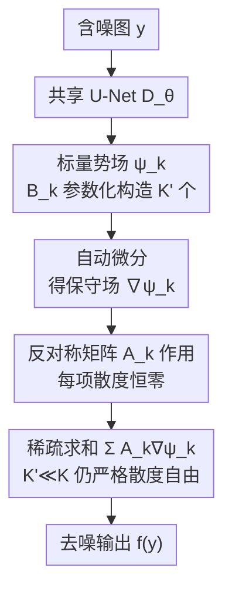

# Divergence-Free Neural Networks with Application to Image Denoising

**会议**: ICLR 2026  
**OpenReview**: [https://openreview.net/forum?id=a5lL1ygtkG](https://openreview.net/forum?id=a5lL1ygtkG)  
**代码**: https://github.com/sherbret/divergence_free_nn  
**领域**: 图像恢复 / 自监督学习 / 图像去噪  
**关键词**: 散度自由网络, SURE, 自监督去噪, 表示定理, 反对称矩阵

## 一句话总结
本文提出一种"设计上散度恒为零"的神经网络参数化方法 CENSURE：先用一个 representer 定理把散度自由向量场写成「反对称矩阵 × 保守场梯度」的结构化组合，再做稀疏近似让它在图像这种高维问题上可算，从而在噪声水平 $\sigma$ 未知且逐样本变化的自监督去噪场景下，比 Noise2Self、UNSURE 等约束类方法更稳更准。

## 研究背景与动机

**领域现状**：在没有干净图像、只有含噪观测的自监督去噪里，主流理论工具是 Stein 无偏风险估计（SURE）。SURE 给出一个恒等式 $\mathbb{E}\|f(y)-x\|_2^2 = \mathbb{E}[-n\sigma^2 + \|f(y)-y\|_2^2 + 2\sigma^2\,\mathrm{div}\,f(y)]$，把"和干净图的均方误差"改写成只依赖含噪观测 $y$、噪声水平 $\sigma$ 和估计器散度 $\mathrm{div}\,f(y)$ 的形式。于是即便没有 ground truth 也能训练去噪器。

**现有痛点**：SURE 的训练目标里带着 $2\sigma^2\,\mathrm{div}\,f(y)$ 这一项——它既需要知道每张图的 $\sigma$，又需要算神经网络的散度。后者对深度网络几乎不可解析，常用 Monte-Carlo 近似（额外引入超参 $\tau$，且训练曲线剧烈震荡、对 $\tau$ 极敏感）。更现实的难题是：真实传感器的噪声水平 $\sigma$ 往往未知、还逐张/逐设备地变。

**核心矛盾**：为了甩掉"需要 $\sigma$"这个包袱，一类方法把估计器 $f$ 限制在某个约束集 $\mathcal{S}$ 内，使得 $\mathbb{E}_{y,\sigma}[\sigma^2\,\mathrm{div}\,f(y)] = \lambda$ 恒为常数，从而把散度项整体从优化目标里消掉，只剩测量一致性 $\min_f \mathbb{E}\|f(y)-y\|_2^2$。但约束越强、表达力越差：**盲点网络（Noise2Self）** 强行让 $\partial f_i/\partial y_i = 0$，散度恒零但丢掉了像素自身这个最有信息量的输入，画质明显下降、还会出棋盘格伪影；**UNSURE** 只约束"期望散度为零" $\mathbb{E}_y\,\mathrm{div}\,f(y)=0$，更宽松更准，但它依赖 $\sigma^2$ 与 $\mathrm{div}\,f$ 统计独立这一前提——当 $\sigma$ 逐样本变化时该前提不成立（$y$ 本身依赖 $\sigma$），UNSURE 直接崩。

**本文目标**：构造一个表达力介于"盲点"和"期望散度"之间、且无论 $\sigma$ 是否恒定都能用的约束集，并给出能在图像这种高维问题上算得动、设计上严格散度为零的网络参数化。

**核心 idea**：要求散度**逐点恒为常数** $\mathrm{div}\,f(y)=nc\;(\forall y)$，得到约束集 $\mathcal{S}_{DC}$，它严格夹在 $\mathcal{S}_{BS}\subset\mathcal{S}_{DC}\subset\mathcal{S}_{CED}$ 之间；再用一个"反对称矩阵 × 保守场梯度"的 representer 定理 + 稀疏近似，把这种散度自由场实现成可扩展的网络 CENSURE。

## 方法详解

### 整体框架

CENSURE（Concealed and Erratic Noise level with Stein's Unbiased Risk Estimate）的目标是：造一个神经网络 $f$，它在数学上**逐点散度恒为零**（取 $c=0$），又能像普通去噪网络一样有表达力、还能在图像维度 $n$ 很大时算得动。整套方法分两层：理论层先回答"散度自由场长什么样"，工程层再回答"怎么把它实现成 U-Net 量级的网络"。

理论层基于一个 representer 定理（Theorem 1）：任意光滑散度自由场都可写成 $f=\sum_{k=1}^{K} A_k\nabla\psi_k$，其中 $A_k$ 是反对称矩阵、$\psi_k$ 是标量势场。因为反对称矩阵 $A$ 满足 $A^\top=-A$，$\mathrm{div}(A\nabla\psi)=\mathrm{tr}(AJ_{\nabla\psi})=0$（对称 Hessian 与反对称矩阵的迹积为零），所以每一项天然散度为零，求和后仍然为零。完备表示需要 $K=\binom{n}{2}\sim n^2$ 项，对图像而言完全不可行。

工程层做两件事把它"压"到可算：① **稀疏近似**——只保留 $K'\ll K$ 项（典型 $K'=8$），由于散度自由场对加法封闭，截断后仍**严格**散度为零，$K'$ 只影响表达力不影响零散度性质；② **共享参数化**——反对称矩阵 $A_k$ 和标量场里的矩阵 $B_k$ 都用"固定置换矩阵 $P_k$ 夹一个共享的块对角矩阵"来构造，标量势 $\psi_k$ 则共享同一个 U-Net $D_\theta$。最终可学参数只有 $\{\theta,\Theta,\Theta'\}$，规模几乎只比 $D_\theta$ 本身大一点点。

前向计算的数据流如下：含噪图 $y$ 进 U-Net $D_\theta$，经由 $K'$ 组矩阵 $B_k$ 构造出 $K'$ 个标量势 $\psi_k$，自动微分得到保守场 $\nabla\psi_k$，分别乘上反对称矩阵 $A_k$ 后求和，输出散度恒零的去噪结果 $f(y)$。

### 关键设计

**1. 常散度约束集 CENSURE：在"盲点"与"期望散度"之间找回表达力**

本文针对的痛点是约束类自监督去噪的"表达力—鲁棒性"两难：盲点约束 $\mathcal{S}_{BS}=\{\partial f_i/\partial y_i=c\}$ 太死（每个 $f_i$ 不许看像素 $y_i$），UNSURE 的期望散度约束 $\mathcal{S}_{CED}=\{\mathbb{E}_y\,\mathrm{div}\,f(y)=nc\}$ 又在 $\sigma$ 变化时失效。作者提出**逐点常散度**约束集

$$\mathcal{S}_{DC}^{c}=\{f\in L^1(\mathbb{R}^n,\mathbb{R}^n):\forall y,\ \mathrm{div}\,f(y)=nc\},$$

并证明它严格夹在两者之间 $\mathcal{S}_{BS}\subset\mathcal{S}_{DC}\subset\mathcal{S}_{CED}$（包含均为严格）。关键在于：$\mathcal{S}_{DC}$ 里的 $f$ 允许每个分量 $f_i$ 依赖自身像素 $y_i$（盲点禁止），因此比盲点更有表达力；同时它的散度**逐点**恒定，于是约束 $\mathbb{E}_{y,\sigma}[\sigma^2\,\mathrm{div}\,f(y)]=nc\,\mathbb{E}[\sigma^2]$ 无条件成立——这正是 UNSURE 做不到的：当 $\sigma$ 逐样本变化时 $\sigma^2$ 与 $\mathrm{div}\,f(y)$ 不独立，期望散度约束被破坏，而逐点常散度因为对每个 $y$ 都成立，不依赖任何独立性假设。

作者还给了配套理论：每个约束集都是仿射空间 $\mathcal{S}^c = c\,\mathrm{id} + \mathcal{S}^0$（Lemma 1），所以只需在 $\mathcal{S}^0$ 里求解，最优去噪器是恒等映射与 $\mathcal{S}^0$ 解的仿射组合（Prop. 1）；最优常数 $c^*=1-\frac{n\mathbb{E}[\sigma^2]}{\min_{f\in\mathcal{S}^0}\mathbb{E}\|f(y)-y\|^2}\in[0,1]$（Prop. 2）。由于 $c^*$ 需要知道 $\mathbb{E}[\sigma^2]$，未知时退而取 $c=0$（与 Noise2Self、UNSURE 同样的工程选择）。

**2. 散度自由场的表示定理与稀疏近似：把"零散度"变成可搭网络的结构**

要让网络"设计上散度为零"，得先知道散度自由场的通用形式。Theorem 1 给出充要条件：以反对称矩阵空间的一组基 $\{A_1,\dots,A_K\}$（$A_k^\top=-A_k$），$f$ 散度自由当且仅当存在标量场 $\psi_k$ 使

$$f=\sum_{k=1}^{K}A_k\nabla\psi_k .$$

这是 Richter-Powell 等人工作的推广，背后是经典 Hodge 分解。$n=3$ 时它正好退化成熟悉的"$f$ 是某向量场的旋度 $\nabla\times\psi$"。问题是完备表示需要 $K=\binom{n}{2}$ 项，随维度二次增长，图像维度下不可行。

本文的破解办法是**稀疏化**：只取 $K'\ll K$ 项（典型 $K'=8$），$f=\sum_{k=1}^{K'}A_k\nabla\psi_k$。这一步看似牺牲完备性，但有个关键的"免费午餐"——因为散度自由函数对加法封闭，**截断到任意 $K'$ 项后结果依然严格散度为零**，丢的只是表达力不是零散度性质。$K'=0$ 时 $f=0$（平凡散度自由但毫无用处），$K'=K$ 时回到完备但不可算，$K'$ 成了一个干净的"表达力—算力"旋钮。这与"软约束（往 loss 加惩罚项鼓励散度小）"有本质区别：软约束只是把残余散度压小、不保证为零，而这里无论怎么截断都精确为零。

**3. 反对称矩阵与标量势场的共享参数化：把网络压到 U-Net 量级**

有了 $f=\sum A_k\nabla\psi_k$ 的骨架，还得让 $A_k$ 和 $\psi_k$ 既可学、又便宜、又适配图像。

反对称矩阵用"置换夹共享块对角矩阵"构造：$A_k=P_k^\top\frac{\Theta-\Theta^\top}{2}P_k$，其中 $\Theta$ 是一个共享的、重复块对角的可学矩阵，$P_k$ 是各不相同的**固定**置换矩阵（典型是旋转/平移矩阵）。利用恒等式 $\{A:A^\top=-A\}=\{P_k^\top\frac{A-A^\top}{2}P_k\}$，这样构造的 $A_k$ 天然反对称、且因 $\Theta$ 稀疏共享而几乎不增参数。

标量势场不能用普通前馈网络（实验发现那样性能崩），而要内置图像处理结构。作者借鉴能量模型/即插即用方法的做法，设计

$$\psi_{\theta,B_k}(y)=\tfrac12\big(\|B_k y\|_2^2-\|B_k y-D_\theta(y)\|_2^2\big),$$

其中 $D_\theta$ 是一个共享的 U-Net、$B_k=P_k^\top\Theta'P_k$ 同样由共享块对角矩阵参数化。它的梯度（自动微分算，避免显式 Jacobian）

$$\nabla\psi_{\theta,B_k}(y)=B_k^\top D_\theta(y)+J_{D_\theta}(y)^\top\big(B_k y-D_\theta(y)\big),$$

第一项 $B_k^\top D_\theta(y)$ 正是已知对去噪有效的形式；引入 $B_k$ 一方面给各标量势制造多样性，另一方面用（转置后的）$B_k^\top$ 去抵消后面乘反对称矩阵 $A_k$ 可能带来的负面影响。最终可学参数仅 $\{\theta,\Theta,\Theta'\}$，由于 $\Theta,\Theta'$ 稀疏，总参数量只比裸 U-Net $D_\theta$ 略多。

### 损失函数 / 训练策略

因为 $f$ 设计上散度恒为零，SURE 目标里的散度项被约束直接消掉，训练只需最小化测量一致性：

$$\arg\min_f \mathbb{E}_y\|f(y)-y\|_2^2,\quad \text{s.t. } f\in\mathcal{S}_{DC}^0 .$$

训练数据是干净图合成加高斯噪声、$\sigma\sim\mathcal{U}([0,75])$ 随机抽取且**不**喂给损失或推理（模拟 $\sigma$ 未知）。所有方法共用同一骨干、自行训练以保证公平。CENSURE 不含 Monte-Carlo 散度项，因此完全不依赖超参 $\tau$，训练曲线平滑、无 UNSURE/MC-SURE 那种剧烈震荡。

## 实验关键数据

### 主实验

未知且非恒定噪声（$\sigma\in[0,75]$、单模型处理所有噪声水平）下，彩色图像去噪 PSNR（dB），约束类方法对比（同骨干）：

| 数据集 | $\sigma$ | Noise2Self | UNSURE ($\tau{=}10^{-2}$) | CENSURE (本文) | 监督 DRUNet light |
|--------|------|-----------|------|----------------|-------------------|
| Kodak24 | 15 | 34.08 | 29.48 | **34.21** | 35.18 |
| Kodak24 | 25 | 31.90 | 22.03 | **32.05** | 32.78 |
| Kodak24 | 50 | 29.07 | 15.58 | **29.24** | 29.77 |
| Kodak24 | 75 | 27.49 | 12.56 | **27.67** | 28.14 |
| CBSD68 | 25 | 30.70 | 22.15 | **30.83** | 31.61 |
| CBSD68 | 75 | 26.21 | 12.68 | **26.33** | 26.74 |

CENSURE 在所有噪声水平上稳定超过盲点法 Noise2Self（约 +0.1～0.15 dB），与监督上界差距很小；UNSURE 在 $\sigma$ 变化时彻底失效（PSNR 暴跌十几 dB），印证理论分析——其期望散度约束依赖 $\sigma^2\perp\mathrm{div}\,f$，而 $\sigma$ 变动时该独立性不成立。

### 约束集表达力对比（恒定噪声水平场景）

| 约束集 | 约束条件 | $\sigma$ 适用性 | 表达力 / 恒定 $\sigma$ 下排名 |
|--------|---------|----------------|-------------------------------|
| $\mathcal{S}_{BS}$（Noise2Self） | $\partial f_i/\partial y_i=c$ | 任意噪声、最通用 | 最低（第三） |
| $\mathcal{S}_{DC}$（CENSURE 本文） | $\mathrm{div}\,f(y)=nc\;\forall y$ | $\sigma$ 恒定或变化均可 | 居中（第二） |
| $\mathcal{S}_{CED}$（UNSURE） | $\mathbb{E}_y\,\mathrm{div}\,f(y)=nc$ | 仅 $\sigma$ 恒定 | 最高（第一）但 $\sigma$ 变即崩 |

恒定噪声下三者排名 UNSURE > CENSURE > Noise2Self，与包含关系 $\mathcal{S}_{BS}^0\subset\mathcal{S}_{DC}^0\subset\mathcal{S}_{CED}^0$ 完全一致：约束越松、表达力越强。

### 关键发现
- **逐点常散度是"稳健性"的来源**：CENSURE 唯一能在 $\sigma$ 未知且变化时仍满足约束 (7) 的方法，因为其散度对每个 $y$ 都恒定、不靠任何独立性假设；UNSURE 一旦 $\sigma$ 变化就因 $\sigma^2$ 与 $\mathrm{div}\,f$ 相关而崩溃。
- **$\tau$ 无关 = 训练更稳**：MC-SURE / UNSURE 依赖 Monte-Carlo 散度近似，性能对 $\tau$ 极敏感（$\tau=10^{-2}$ 与 oracle 的 $10^{-4}$ 差别巨大），训练曲线剧烈波动；CENSURE 因严格零散度而完全绕开 $\tau$，曲线平滑。
- **表达力可调但零散度免费**：稀疏项数 $K'$（典型 8）只影响表达力，截断后散度仍精确为零，给出一个干净的"算力—画质"旋钮。
- Neighbor2Neighbor 等非约束法在自然图像上 PSNR 整体更高，但依赖"相邻像素值相近"假设，泛化到非自然图像受限；约束类方法更通用。

## 亮点与洞察
- **把"零散度"从软惩罚变成硬结构**：用反对称矩阵 × 保守场梯度的 representer 定理，让网络无论怎么训练、怎么截断都精确散度为零，彻底消掉 SURE 损失里那一项，这是相比"加惩罚项"的质变。
- **稀疏截断仍严格零散度**：散度自由场对加法封闭这个性质被巧妙利用成"$K'\ll K$ 的免费午餐"，是把 $n^2$ 项压到 8 项还不破坏理论保证的关键。
- **约束集的"夹心"定位很优雅**：$\mathcal{S}_{BS}\subset\mathcal{S}_{DC}\subset\mathcal{S}_{CED}$ 把盲点、UNSURE 与本文统一进一条表达力—鲁棒性谱系，并精准卡在"既比盲点强、又比 UNSURE 鲁棒"的位置。
- 标量势场设计 $\psi=\frac12(\|B_k y\|^2-\|B_k y-D_\theta(y)\|^2)$ 让保守场梯度的首项落到已知有效的去噪形式上，是把 U-Net 嵌进散度自由框架而不损画质的关键 trick，可迁移到其他需要"梯度场具备某种归纳偏置"的任务。

## 局限与展望
- 取 $c=0$ 是因为最优 $c^*$ 需要知道 $\mathbb{E}[\sigma^2]$，在真正未知时只能退而求其次，未必最优。
- 稀疏项数 $K'=8$ 是经验选择，缺乏关于"$K'$ 多大才够表达"的理论刻画；表达力上仍弱于恒定 $\sigma$ 下的 UNSURE/MC-SURE。
- 仅在加性高斯白噪声、PSNR 指标上验证；对真实相机噪声、非高斯/空间相关噪声、以及 PSNR 之外的感知质量未展开。
- 方法本质是"用结构换鲁棒"，在 $\sigma$ 恒定且已知的理想场景下，更宽松的方法（MC-SURE，oracle $\tau$）能逼近监督上界、反超 CENSURE。

## 相关工作与启发
- **vs Noise2Self / 盲点网络**：都靠约束实现散度自由，但盲点强制 $\partial f_i/\partial y_i=0$、丢掉最有信息的像素自身，CENSURE 允许 $f_i$ 依赖 $y_i$，表达力更高、无棋盘格伪影。
- **vs UNSURE**：UNSURE 只约束期望散度，恒定 $\sigma$ 下更准，但依赖 $\sigma^2\perp\mathrm{div}\,f$，$\sigma$ 变化即失效且需 min-max 优化 + Monte-Carlo（对 $\tau$ 与学习率敏感）；CENSURE 逐点常散度无条件成立、无 $\tau$、训练稳。
- **vs MC-SURE**：MC-SURE 直接优化带散度项的 SURE 损失，理论上能达监督水平，但散度靠 Monte-Carlo 近似、训练震荡且需已知 $\sigma$；CENSURE 把散度项从设计上消去，牺牲一点理论上界换实际稳健性。
- **vs Richter-Powell et al. (2022)**：同样用 representer 思路构造散度自由场，但其参数化需算完整 Jacobian、随维度不可扩展；本文用稀疏近似 + 共享块对角参数化把它压到 U-Net 量级，才得以用于图像。

## 评分
- 新颖性: ⭐⭐⭐⭐⭐ 把散度自由场的 representer 定理 + 稀疏近似落到图像去噪，并提出夹心式的常散度约束集，理论与工程都新。
- 实验充分度: ⭐⭐⭐⭐ 多噪声水平、彩/灰度、约束类与非约束类基线齐全，但限于合成高斯噪声与 PSNR。
- 写作质量: ⭐⭐⭐⭐⭐ 理论推导（Lemma/Prop/Theorem）层层递进，约束集谱系与图 1 把动机讲得很清楚。
- 价值: ⭐⭐⭐⭐ 为"$\sigma$ 未知且变化"这一最现实场景提供了稳健、$\tau$ 无关的自监督去噪方案，思路可迁移到其他散度约束问题。

<!-- RELATED:START -->

## 相关论文

- [\[ICLR 2026\] Denoising Neural Reranker for Recommender Systems](denoising_neural_reranker_for_recommender_systems.md)
- [\[ICLR 2026\] SuperF: Neural Implicit Fields for Multi-Image Super-Resolution](superf_neural_implicit_fields_for_multi-image_super-resolution.md)
- [\[ICCV 2025\] IDF: Iterative Dynamic Filtering Networks for Generalizable Image Denoising](../../ICCV2025/image_restoration/idf_iterative_dynamic_filtering_networks_for_generalizable_image_denoising.md)
- [\[NeurIPS 2025\] Spiking Meets Attention: Efficient Remote Sensing Image Super-Resolution with Attention Spiking Neural Networks](../../NeurIPS2025/image_restoration/spiking_meets_attention_efficient_remote_sensing_image_super-resolution_with_att.md)
- [\[ICLR 2026\] LucidFlux: Caption-Free Photo-Realistic Image Restoration via a Large-Scale Diffusion Transformer](lucidflux_caption-free_photo-realistic_image_restoration_via_a_large-scale_diffu.md)

<!-- RELATED:END -->
