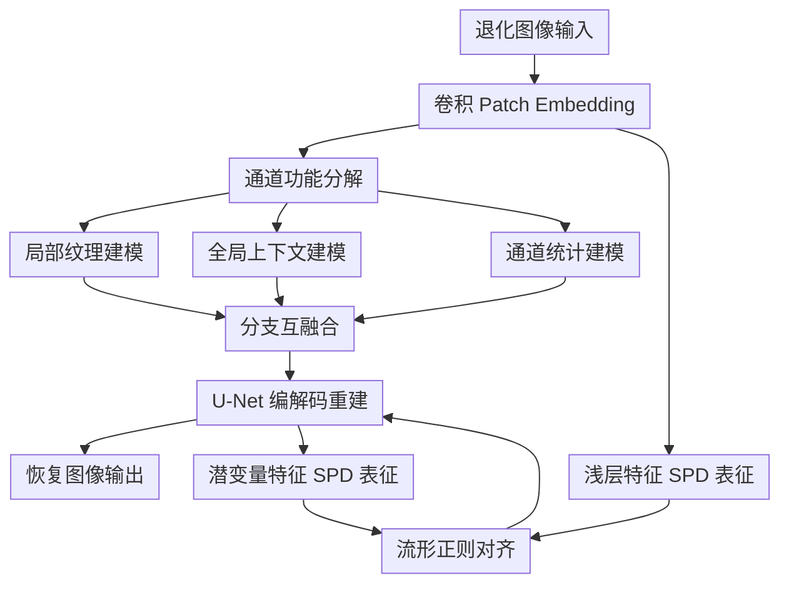

# Efficient Degradation-agnostic Image Restoration via Channel-Wise Functional Decomposition and Manifold Regularization

**会议**: ICLR 2026  
**论文**: [OpenReview: jDMAvoLsVj](https://openreview.net/forum?id=jDMAvoLsVj)  
**代码**: https://github.com/Amazingren/MIRAGE（有）  
**领域**: 图像恢复 / All-in-One Restoration  
**关键词**: 退化无关恢复、通道功能分解、SPD流形对比学习、混合退化、高效模型设计  

## 一句话总结
MIRAGE 通过“按通道拆分注意力特征给 CNN/Attention/MLP 三分支各司其职 + 在 SPD 协方差空间做浅层-深层对比对齐”，在 all-in-one 图像恢复里同时拿到更高精度和更低计算开销。

## 研究背景与动机
**领域现状**：退化无关图像恢复（degradation-agnostic IR）的目标是用一个模型同时处理去噪、去雨、去雾、去模糊、低照增强等多类退化。近年的主流路线大致分两类：一类靠 prompt/多模态/大模型增强泛化，效果强但代价高；另一类走轻量化架构，速度快但多退化场景精度容易掉。

**现有痛点**：统一模型最难的是“同一套参数要同时满足不同退化的表征需求”。加性退化（噪声、雨）更吃局部纹理建模，乘性退化（雾、低照）更依赖全局上下文，卷积退化（模糊）又要求跨尺度结构推理。很多方法不是把网络堆大，就是通过额外模块堆复杂度，结果是参数量、显存、FLOPs 都高。

**核心矛盾**：现有工作经常把“Transformer 通道冗余”当作可裁剪对象，但没有把这些冗余能力系统性地重分配为“有功能差异的子空间”。于是模型要么浪费容量，要么在复杂退化下表达不足。

**本文目标**：作者把问题拆成两个子目标。第一，如何在不增大模型体量的前提下，让一个 backbone 覆盖局部纹理、全局关系、通道统计三类互补能力。第二，如何让浅层与深层特征在多退化场景下保持一致语义，避免跨层漂移导致的泛化不稳。

**切入角度**：作者先做了通道冗余实证（PCA/SVD），观察到多尺度 attention 特征存在明显低秩冗余，尤其浅层更强；再观察到浅层和深层特征在统计结构上天然不对称，正好可构造“自然对比对”。基于这两点，提出“通道功能分解 + SPD 对比正则”的组合方案。

**核心 idea**：把注意力特征按通道切分给三条互补分支去做专职建模，再用 SPD 协方差对比学习把浅层细节与深层语义对齐，从而以小模型实现强泛化。

## 方法详解

### 整体框架
MIRAGE 是一个 U-Net 风格的 4-level encoder-decoder 主干，核心 block 叫 MDAB（Mixed Degradation Adaptation Block）。每个 MDAB 先做“通道维三分支并行处理”，再做“分支间互融合”，最后用 FFN + 残差收束。除了主干外，训练时额外引入 shallow-latent 的 SPD 对比损失；推理时这条正则支路不增加额外开销。

直观上看，它不是再塞一个昂贵 prompt 模块，而是把已有通道容量重新组织：一部分给卷积抓局部细节，一部分给注意力看全局上下文，一部分给 MLP 管通道统计。与此同时，用跨层对比把“浅层纹理感知”和“深层语义稳定性”拉到同一个结构化空间里。

### 关键设计
**1. 通道功能分解：把冗余通道变成功能互补的三路表征**

传统 attention-only 结构里通道冗余往往被当作“可剪枝垃圾”，MIRAGE 的做法是“重分工而非硬删减”。给定输入特征 $F_{in}\in\mathbb{R}^{H\times W\times C}$，先沿通道切成三份：$F^{att}_{in}, F^{conv}_{in}, F^{mlp}_{in}$，分别进入注意力、动态卷积、C-MLP 分支并行处理。这样每个分支只处理 $\frac{C}{3}$ 规模通道，计算显著下降，但总表示能力并没有被粗暴丢弃。

这背后的关键不是“多分支”本身，而是“分支和退化属性对齐”：卷积分支偏局部纹理，适合噪声/雨丝这类细粒度残留；注意力分支偏全局关联，适合雾/低照这类空间非均匀退化；MLP 分支补充通道统计混合，增强跨退化的稳健性。作者在文中强调，这是由实证冗余分析驱动的结构重组，而不是经验堆模块。

**2. 分支互融合：在低成本并行基础上补回跨机制交互**

并行分支会带来一个副作用：各自专注后，可能缺少跨分支的信息流。MIRAGE 在 MDAB 里加了 inter-branch mutual fusion：每个分支都会吸收另外两支的门控信息，并用可学习系数 $\lambda_{att},\lambda_{conv},\lambda_{mlp}$ 控制融合强度。其形式可写成：

$$
\begin{aligned}
F^{att'} &= F^{att} + \lambda_{att}\,\sigma(F^{conv}+F^{mlp}),\\
F^{conv'} &= F^{conv} + \lambda_{conv}\,\sigma(F^{att}+F^{mlp}),\\
F^{mlp'} &= F^{mlp} + \lambda_{mlp}\,\sigma(F^{att}+F^{conv}).
\end{aligned}
$$

相比直接 concat 后线性投影，这个机制在“轻量分工”和“信息耦合”之间找到了更稳定的折中。消融也验证了这一点：去掉融合后性能下降，说明三支并行不是简单拼接就够，关键在于融合前的互相调制。

**3. SPD 流形正则：用二阶统计做浅层-潜变量跨层对齐**

统一恢复里浅层和深层承担的语义并不对称。浅层更敏感于局部退化细节，深层更稳定于语义结构；如果二者长期漂移，模型在混合或未见退化上容易失配。作者把两者视作“天然对比对”，但不在欧氏空间直接拉近，而是先构造协方差矩阵进入 SPD 空间。

对浅层与潜变量特征 $X_s, X_l$，先算协方差：

$$
C_s=\frac{1}{N-1}(X_s-\mu_s)(X_s-\mu_s)^\top+\epsilon I,\quad
C_l=\frac{1}{N'-1}(X_l-\mu_l)(X_l-\mu_l)^\top+\epsilon I.
$$

再向量化并投影到对比嵌入，使用 InfoNCE：

$$
\mathcal{L}_{SPD}=-\log\frac{\exp(\mathrm{sim}(z_s,z_l)/\tau)}{\sum_{z_l'}\exp(\mathrm{sim}(z_s,z_l')/\tau)}.
$$

核心收益是保留通道间二阶依赖结构。文中案例显示，若换成欧氏对比，特征更易塌缩到近常数相似度；SPD 对齐则能保持有辨识度的对角主导结构，进而提升跨退化泛化。

**4. 训练目标组合：空间域、频域、结构域三重约束协同**

MIRAGE 的总损失为：

$$
\mathcal{L}_{total}=\mathcal{L}_1+\lambda_{fre}\mathcal{L}_{Fourier}+\lambda_{ctrs}\mathcal{L}_{SPD}.
$$

其中 $\mathcal{L}_1$ 保证像素重建，$\mathcal{L}_{Fourier}$ 对齐频域实部/虚部以约束纹理频率一致性，$\mathcal{L}_{SPD}$ 负责跨层结构对齐。论文中使用 $\lambda_{fre}=0.1$、$\tau=0.1$，并报告 $\lambda_{ctrs}=0.05$。这一设计让模型在“看起来清晰”与“结构上可泛化”之间同时受约束。

### 一个完整示例
以 CDD11 的三重退化样本（低照+雾+雪）为例，MIRAGE 的一次前向可理解为：

1. 输入先经 patch embedding 得到浅层特征，保留大量局部边缘和噪声混合信息。  
2. 在 MDAB 中按通道切三路：卷积分支优先修复雪粒与边缘断裂，注意力分支估计雾导致的全局对比度偏移，MLP 分支重排通道响应以稳定颜色与亮度统计。  
3. 三分支互融合后进入下一级编码，语义逐步抽象，解码阶段再将多尺度细节回灌到输出。  
4. 训练时浅层与潜变量分别构造协方差嵌入，SPD 对比损失促使“局部细节线索”和“深层语义线索”在结构上对齐，避免模型只顾某一类退化。  
5. 最终输出在该类复合退化上比同量级 OneRestore 更高，且在未见过的水下增强任务也能维持较强泛化。

这个例子反映了 MIRAGE 的关键点：不是靠更大模型“硬记住”所有退化，而是让不同机制对不同退化信号各尽其职，再通过结构化对齐统一起来。

### 损失函数 / 训练策略
训练流程遵循 all-in-one IR 常见设置，但重点在于目标函数组合与轻量架构匹配：

- 优化器：Adam，初始学习率 $2\times10^{-4}$，$\beta_1=0.9,\beta_2=0.999$，余弦退火。  
- 数据增强：随机裁剪 $128\times128$，水平/垂直翻转。  
- 训练轮数：3 退化约 130 epoch，5 退化约 150 epoch，复合退化约 170 epoch。  
- 模型规模：Tiny 6.21M（16G FLOPs），Small 9.68M（27G FLOPs）。  

推理阶段不需要 SPD 对比分支，因此“训练时加正则，测试时不增负担”是该方法在工程上很实用的一点。

## 实验关键数据

### 主实验
下表汇总了论文里最核心的多设置结果，能直接体现 MIRAGE 的“精度-效率”优势。

| 设置 | 方法 | 参数量 | 关键结果 | 相对对比 |
|------|------|--------|----------|----------|
| 3 退化 All-in-One | MIRAGE-S | 10M | 平均 PSNR 32.91 / SSIM 0.919 | 比 PromptIR(36M) +0.85dB；比 MoCE-IR(25M) +0.18dB |
| 3 退化 All-in-One | MIRAGE-T | 6M | 平均 PSNR 32.77 / SSIM 0.919 | 仅 6M 参数已超过多种更大模型 |
| 5 退化 All-in-One | MIRAGE-S | 10M | 平均 PSNR 30.68 / SSIM 0.914 | 比 PromptIR +1.53dB；比 MoCE-IR-S +0.60dB |
| CDD11 复合退化 | MIRAGE-S | 10M | 平均 PSNR 29.33 / SSIM 0.887 | 比 MoCE-IR(11M) +0.28dB |
| 零样本水下增强 | MIRAGE-S | 10M | 17.29dB / 0.773 | 比 MoCE-IR +1.38dB |

再看复杂度对比（来自论文 Table 6）：

| 方法 | 平均 PSNR（3退化） | 显存占用 | 参数量 | FLOPs |
|------|--------------------|----------|--------|-------|
| PromptIR | 32.06 | 9830M | 35.59M | 132G |
| MoCE-IR-S | 32.51 | 4263M | 11.48M | 37G |
| MoCE-IR | 32.73 | 6654M | 25.35M | 75G |
| MIRAGE-T | 32.77 | 3729M | 6.21M | 16G |
| MIRAGE-S | 32.91 | 4810M | 9.68M | 27G |

结论很直接：MIRAGE 不是“多花算力换分数”，而是在更低计算预算下拿到更好结果。

### 消融实验
论文 Table 7 / Table C 对核心模块做了系统消融，下面列最关键项：

| 配置 | 参数量 | 平均 PSNR | 相比 Full 变化 | 说明 |
|------|--------|-----------|----------------|------|
| att-only | 19.89M | 32.23 | -0.54dB | 纯注意力不仅更重，效果也更差 |
| w/o DynamicConv | 9.43M | 32.21 | -0.56dB | 局部自适应卷积对细节恢复很关键 |
| w/o C-MLP | 7.01M | 32.39 | -0.38dB | 通道统计建模不可缺 |
| w/o Fusion | 5.71M | 32.57 | -0.20dB | 并行后若不做互融合会损失性能 |
| w/o CL & SPD | 5.80M | 32.63 | -0.14dB | 跨层对比对齐确实有效 |
| w/o SPD（Euclidean CL） | 6.10M | 32.53 | -0.24dB | 欧氏对比劣于 SPD 结构对比 |
| Full（MIRAGE-T） | 6.21M | 32.77 | 0 | 精度和效率最平衡 |

### 关键发现
- 动态卷积分支是最“硬收益”模块之一，去掉后降幅最大（-0.56dB），说明局部纹理恢复仍然是 all-in-one IR 的基本盘。  
- SPD 对齐比普通欧氏对齐更稳，后者会出现更明显的表示塌缩倾向，印证“二阶结构信息”在跨层对齐中的必要性。  
- MIRAGE-T 的意义不只是小模型可用，而是证明“合理分解 + 合理对齐”能让 6M 级别模型逼近或超过 25M+ 方案。  
- 在复合退化与零样本设置中的持续优势，说明该方法学到的不是单任务技巧，而是跨退化可迁移表征。

## 亮点与洞察
- 把“通道冗余”从剪枝视角转成“功能重分配”视角，是这篇文章最有方法论价值的点。它避免了“剪完变轻但变弱”的常见问题。  
- SPD 对比学习的落地方式很务实：训练期引入，推理期零额外成本。很多几何方法理论漂亮但工程代价高，本文在这点上取了较好的平衡。  
- 消融结构设计非常完整，覆盖了分支、融合、对比损失和欧氏/SPD 对比替代，能让读者清楚看到每个部件的边际贡献。  
- 复合退化（CDD11）和零样本水下这两个场景的结果很关键，它们比单一基准更接近真实部署问题，说明方法不仅“榜单好看”，也具备实用潜力。

## 局限与展望
- 作者承认的局限是去模糊任务上仍略落后于个别更大模型，说明当前容量配置对某些强结构退化还不够充裕。  
- SPD 正则目前本质上仍是“SPD 特征后投影到欧氏空间做 InfoNCE”，并非完整黎曼几何优化；理论上还有继续提升空间。  
- 模型里 CNN/Attention/MLP 的通道比例是固定切分，未做到按退化类型自适应分配，可能限制了极端场景下的最优性。  
- 训练数据仍以合成退化为主，虽然有零样本与真实数据补充，但在更复杂相机 ISP 链路下的稳定性仍需更大规模验证。

可行的后续方向：
- 做退化感知的动态通道配比，让三分支容量可随输入自适应。  
- 探索更严格的 SPD 流形距离或 geodesic 对比目标，进一步减少表征塌缩。  
- 针对去模糊单独设计更强的跨尺度约束，同时保持总体轻量化。

## 相关工作与启发
- **vs PromptIR（NeurIPS 2023）**: PromptIR 通过 prompt 机制提升多退化适配，泛化好但模型较重（36M）；MIRAGE 选择“结构重组 + 流形正则”，在更小参数下拿到更高平均 PSNR，说明不一定要靠大 prompt 才能统一建模。  
- **vs MoCE-IR（CVPR 2025）**: MoCE-IR 用专家混合做复杂度感知，效果强但整体仍偏重；MIRAGE 的优势是计算开销更低且复合退化表现不弱，适合资源受限场景。  
- **vs DA-RCOT（TPAMI 2025）**: DA-RCOT 也做对比学习，但主要在残差特征空间；MIRAGE 强调 shallow-latent 配对和 SPD 二阶统计，实验证明其在参数更少时也能达到更优质量。  

对后续工作的启发：
- 在统一恢复任务里，先分析“冗余发生在哪”，再做结构重分配，通常比盲目叠模块更有效。  
- 跨层对齐若只用一阶向量相似度容易欠约束，加入二阶统计或结构先验会更稳。  
- 轻量模型要做强，不是只做剪枝，而是把每一部分计算预算放到最匹配的归纳偏置上。

## 评分
- 新颖性: ⭐⭐⭐⭐☆ 通道功能分解与 SPD 跨层对齐的组合有清晰新意，尤其是“冗余重分配”视角。  
- 实验充分度: ⭐⭐⭐⭐⭐ 覆盖 3/5 退化、复合退化、恶劣天气、零样本和完整消融，证据链较扎实。  
- 写作质量: ⭐⭐⭐⭐☆ 方法动机和消融解释比较清楚，工程细节也给得充分。  
- 价值: ⭐⭐⭐⭐⭐ 在 all-in-one IR 里给出了可复用的高效设计范式，兼顾学术与落地价值。

<!-- RELATED:START -->

## 相关论文

- [\[CVPR 2026\] Disentanglement-wise Image Dehazing through Cross-Domain Manifold Consensus](../../CVPR2026/image_restoration/disentanglement-wise_image_dehazing_through_cross-domain_manifold_consensus.md)
- [\[CVPR 2026\] DiffDecompose: Layer-Wise Decomposition of Alpha-Composited Images via Diffusion Transformers](../../CVPR2026/image_restoration/diffdecompose_layer-wise_decomposition_of_alpha-composited_images_via_diffusion_.md)
- [\[CVPR 2026\] Retrieve-to-Restore: Efficient All-in-One Image Restoration with a Retrieval-Based Degradation Bank](../../CVPR2026/image_restoration/retrieve-to-restore_efficient_all-in-one_image_restoration_with_a_retrieval-base.md)
- [\[CVPR 2026\] Degradation-Robust Fusion: An Efficient Degradation-Aware Diffusion Framework for Multimodal Image Fusion in Arbitrary Degradation Scenarios](../../CVPR2026/image_restoration/degradation-robust_fusion_an_efficient_degradation-aware_diffusion_framework_for.md)
- [\[CVPR 2026\] MMDIR: Multimodal Instruction-Driven Framework for Mixed-Degradation Document Image Restoration](../../CVPR2026/image_restoration/mmdir_multimodal_instruction-driven_framework_for_mixed-degradation_document_ima.md)

<!-- RELATED:END -->
