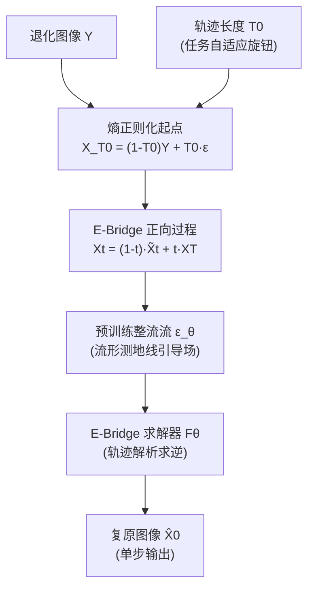

# Energy-oriented Diffusion Bridge for Image Restoration with Foundational Diffusion Models

**会议**: ICLR 2026  
**代码**: https://jinnh.github.io/E-Bridge/  
**领域**: image_restoration  
**关键词**: diffusion bridge, image restoration, geodesic trajectory, consistency model, single-step inference

## 一句话总结

提出 E-Bridge 框架，通过构造低能量流形测地线轨迹和闭合式一步一致性求解器，在单步推理下实现多任务图像复原的最优效果。

## 研究背景与动机

**领域现状**：扩散模型在图像复原中形成两大范式——基于纯噪声出发的条件生成（如 SR3、DiffBIR）和基于桥接过程的直接退化→干净映射（如 I2SB、UniDB）。后者通过缩短轨迹起点与目标的差距大幅减少采样步数。  
**现有痛点**：桥接模型的轨迹往往是预设的多项式插值，并非数据流形上的最短路径——在开始去噪之前强制进行"重新加噪"阶段，造成轨迹能量冗余；而借助大模型先验的方法（如 IRBridge）又依赖复杂的拼接机制，引入两个独立扩散过程之间的分布不匹配。  
**核心矛盾**：现有桥接轨迹路径能量高、推理需多步迭代，而减少步数又会严重损害复原质量，效率与质量难以兼顾。  
**本文目标**：重新设计复原轨迹，使其沿数据流形的测地线演进，并实现单步高保真复原。  
**核心 idea**：在随机最优控制框架下，证明最优轨迹期望应满足线性传输方程（Proposition 4.1）；由此构造从"熵正则化混合起点"出发的低能量扩散桥，结合预训练整流流网络作为几何引导场，再通过轨迹方程的解析求逆推导出闭合式一步映射函数，并以连续时间一致性目标训练之。

## 方法详解

### 整体框架

E-Bridge 分两条主线：**低能量测地线扩散桥**（E-Bridge 轨迹）和**一致性 E-Bridge 求解器**（E-Bridge-Solver）。前者定义从熵正则化起点 $X_{T_0}$ 到干净图像 $X_0$ 的高效轨迹，后者通过解析求逆实现单步直接预测干净图像，两者由连续时间一致性目标统一训练。

### 关键设计

**1. 低能量测地线桥轨迹：绕过冗余加噪阶段**

传统桥接模型（如 I2SB）的噪声方差 $\sigma_t^2 \propto t(1-t)$ 呈对称拱形，使反向复原过程必须先"加噪"再去噪，白白消耗轨迹能量。E-Bridge 通过随机最优控制能量 $J(u)$ 的分析，证明最优轨迹的期望须满足：

$$E[\tilde{X}_t] = \left(1 - \frac{t}{T_0}\right)X_0 + \frac{t}{T_0}Y$$

据此定义新桥轨迹：

$$X_t = (1-t)\tilde{X}_t + t X_T, \quad \alpha_t = 1-t,\ \beta_t = t$$

其中 $X_T \sim \mathcal{N}(0,I)$，$T_0 \in (0,1]$ 为可控时间跨度。通过 Lipschitz 稳定性分析（Proposition 4.2），$\alpha_t=1-t, \beta_t=t$ 与预训练整流流模型的线性 SNR 演化完全对齐，最小化适应能量，使预训练先验可直接插入而无需复杂拼接。

**2. 闭合式一步求解器：轨迹解析求逆**

E-Bridge 的核心理论洞见在于：对轨迹上任意状态 $X_t$，预训练整流流网络 $\epsilon_\theta$ 提供对末端噪声的估计 $\epsilon_\theta(X_t) = X_T - X_0$，代入轨迹定义后得到以 $X_0$ 为唯一未知量的线性方程，可解析求逆：

$$\hat{X}_0 := F_\theta(X_t, Y, t) = \frac{X_t - A(t)Y - B(t)\epsilon_\theta(X_t)}{C(t)}$$

其中 $A(t) = (1-t)\frac{t}{T_0}$，$B(t) = t$，$C(t) = 1 - (1-t)\frac{t}{T_0}$。这使得 E-Bridge 本质上是对数据流形端点的直接求解器，而非插值器，完全绕开迭代 ODE 求解的 $O(N \times C)$ 代价。

**3. 连续时间测地线一致性训练目标**

为使求解器在整条轨迹上保持输出稳定（测地线一致性：$\frac{dF_\theta}{dt} = 0$），采用连续时间一致性目标训练：

$$\nabla_\theta \mathcal{L}_{\text{E-Bridge}}(\theta) = \mathbb{E}_{X_t, Y, t}\left[\nabla_\theta F_\theta(X_t,Y,t)^\top \cdot \text{sg}\!\left(\frac{dF_{\theta^-}(X_t,Y,t)}{dt}\right)\right]$$

其中 $\text{sg}(\cdot)$ 为停止梯度算子，$\frac{dF_{\theta^-}}{dt}$ 为不一致性切向量。唯一稳定均衡点即不一致性向量归零，强制求解器在任意轨迹时刻输出不变的干净图像。模型以预训练扩散模型参数初始化，避免从头训练的代价。

**4. 任务自适应轨迹长度 $T_0$**

起始点 $X_{T_0} = (1-T_0)Y + T_0 \epsilon$ 的噪声混合比例由 $T_0$ 控制，形成"信息—熵权衡"：对退化轻微的去噪任务，取小 $T_0$ 使起始点贴近 $Y$，最大化信息保留；对退化严重的超分辨率，取 $T_0 \to 1$ 使起始点趋近纯噪声，释放模型的生成能力。这是一个原则性的任务自适应旋钮，无需修改模型结构。

## 实验关键数据

### 主实验（5 项复原任务，与 SOTA 对比）

| 任务 | 指标 | E-Bridge (NFE=1) | 最强基线 | Δ |
|------|------|-----------------|---------|---|
| 超分辨率 | LPIPS↓ | 0.452 | UniDB++(NFE=1) 0.658 | **-0.206** |
| 超分辨率 | FID↓ | 72.001 | UniDB++(NFE=1) 83.718 | **-11.7** |
| 去噪 | LPIPS↓ | 0.258 | UniDB++(NFE=1) 0.613 | **-0.355** |
| 去噪 | PSNR↑ | 25.241 | UniDB++(NFE=1) 25.420 | +0 (持平) |
| 雨滴去除 | PSNR↑ | 29.220 | UniDB++(NFE=1) 25.420 | **+3.8 dB** |
| 去摩尔纹 | PSNR↑ (NFE=5) | 20.849 | UniDB++(NFE=5) 20.527 | +0.32 dB |

> NFE=10 下超分辨率 FID=57.837，优于 IRBridge(NFE=100) 的 59.539，以 10 分之一步数超越。

### 消融实验（轨迹类型对超分辨率/去噪的影响）

| 配置 | NFE | SR PSNR↑ | SR LPIPS↓ | Denoising PSNR↑ |
|------|-----|----------|-----------|-----------------|
| (a) 标准扩散轨迹（从纯噪声） | 10 | 20.527 | 0.464 | 24.241 |
| (b) 传统桥接轨迹（有加噪阶段） | 10 | 19.945 | 0.446 | 24.391 |
| **(Ours) E-Bridge 测地线轨迹** | **10** | **21.282** | **0.346** | **26.069** |

单步（NFE=1）下 E-Bridge 优势最显著：SR PSNR 24.094 vs 传统桥接 22.039，提升 +2.0 dB。

### 关键发现

- 低能量测地线轨迹在步数越少时优势越突出，NFE=1 时超越所有多步基线的 LPIPS
- 任务自适应 $T_0$ 设计使同一模型无需重训即可覆盖退化程度迥异的 5 类任务
- 以预训练整流流（FLUX）作为几何引导场带来显著感知质量提升（MUSIQ/NIQE 优于基线）

## 亮点与洞察

- **理论驱动的设计**：从随机最优控制出发，用能量最小化推导出轨迹的应有形态，而不是启发式选择插值方式，Proposition 4.1 & 4.2 赋予设计严格的理论保证
- **大模型先验的优雅集成**：预训练整流流（FLUX 系列）不作为独立组件"拼接"，而是以几何引导场的形式内嵌于轨迹动力学，规避了 IRBridge 分布不匹配问题
- **闭合解消除迭代**：解析求逆直接得到单步求解器，推理复杂度从 $O(N \cdot C)$ 降至 $O(C)$，单步质量已超越 100 步基线

## 局限与展望

- 实验集中在学术级退化（合成噪声、双三次下采样等），真实世界盲复原场景的泛化性待验证
- $T_0$ 目前为手动任务特定选择，未来可探索从退化图像自动估计 $T_0$ 的自适应方案
- 基于整流流的预训练骨干（FLUX）参数量较大，轻量化部署路径有待探索

## 相关工作与启发

- **vs I2SB / UniDB**：同为桥接扩散，但 E-Bridge 用线性 SNR 轨迹替换对称拱形方差，消除冗余加噪，能量更低
- **vs IRBridge**：同样借大模型先验，但 IRBridge 需要"状态转移方程"硬拼两个独立过程，E-Bridge 直接将预训练网络嵌入同一轨迹动力学中，更一致
- **vs 连续时间一致性模型（ECM）**：E-Bridge-Solver 将 ECM 的自洽训练目标迁移到桥接轨迹，将"点到点"的一致性从生成任务扩展到复原任务

## 评分

- 新颖性: ⭐⭐⭐⭐ 能量最小化视角重新设计桥接轨迹，并将一致性模型迁移到复原桥接，组合独到
- 实验充分度: ⭐⭐⭐⭐ 5 类任务、多步数、完整消融，覆盖全面；感知与失真指标并重
- 写作质量: ⭐⭐⭐⭐ 理论推导清晰，Proposition → 设计 → 算法链条完整，图文一致
- 价值: ⭐⭐⭐⭐ 单步 SOTA 复原对实时应用价值大，轨迹自适应设计对多任务统一模型有借鉴意义

<!-- RELATED:START -->

## 相关论文

- [\[ICLR 2026\] Text-Aware Image Restoration with Diffusion Models](text-aware_image_restoration_with_diffusion_models.md)
- [\[ICLR 2026\] SFBD-OMNI: Bridge Models for Lossy Measurement Restoration with Limited Clean Samples](sfbd-omni_bridge_models_for_lossy_measurement_restoration_with_limited_clean_sam.md)
- [\[ICML 2026\] Consistent Diffusion Language Models](../../ICML2026/image_restoration/consistent_diffusion_language_models.md)
- [\[ICLR 2026\] Horizon Imagination: Efficient On-Policy Rollout in Diffusion World Models](horizon_imagination_efficient_on-policy_rollout_in_diffusion_world_models.md)
- [\[ICLR 2026\] LiveMoments: Reselected Key Photo Restoration in Live Photos via Reference-guided Diffusion](livemoments_reselected_key_photo_restoration_in_live_photos_via_reference-guided.md)

<!-- RELATED:END -->
