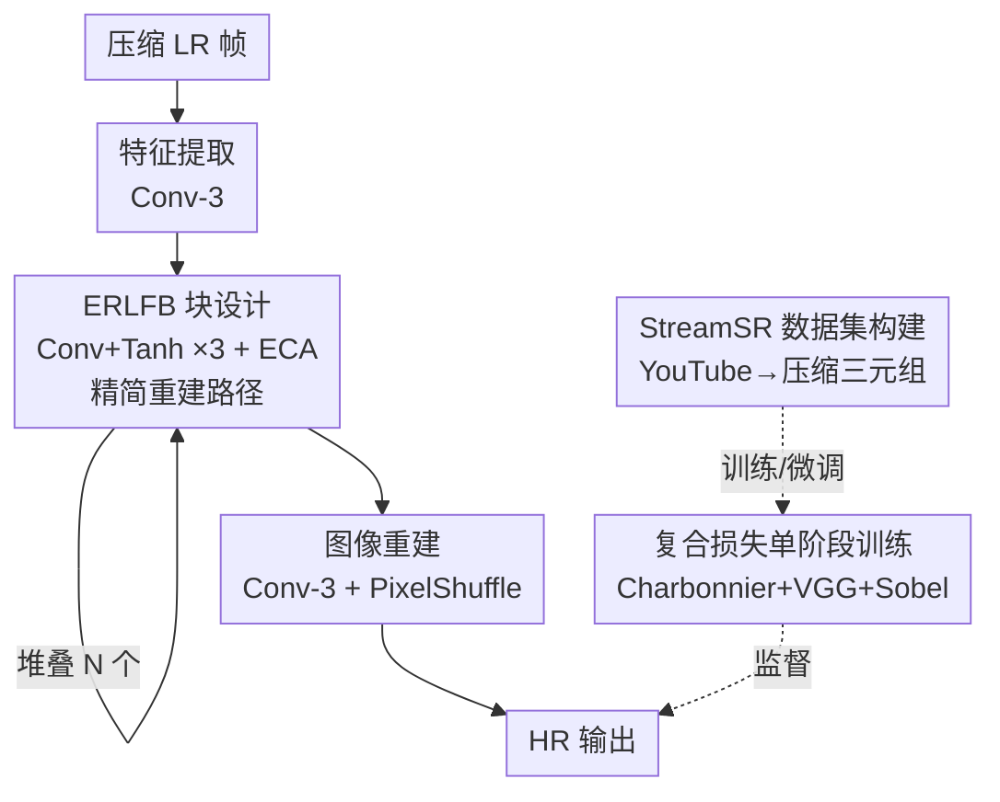

# Exploring Real-Time Super-Resolution: Benchmarking and Fine-Tuning for Streaming Content

**会议**: ICLR 2026  
**OpenReview**: [https://openreview.net/forum?id=HIG7riDJ9N](https://openreview.net/forum?id=HIG7riDJ9N)  
**代码**: https://github.com/EvgeneyBogatyrev/EfRLFN  
**领域**: 图像恢复 / 实时超分辨率  
**关键词**: 实时超分、流媒体、压缩伪影、轻量网络、基准数据集

## 一句话总结
针对压缩流媒体视频超分这个被现有数据集忽略的场景，本文构建了从 YouTube 采集的 5200 段压缩视频数据集 StreamSR、用它系统评测 11 个实时超分模型，并提出在 RLFN 基础上换用 tanh 激活 + ECA 注意力 + 复合损失的轻量模型 EfRLFN，在保持实时帧率（271 FPS）的同时取得新的质量-复杂度 SOTA。

## 研究背景与动机
**领域现状**：实时超分（real-time SR）近年因视频流媒体（YouTube、Twitch、Netflix）的爆发而受关注，NTIRE 系列挑战赛推动了一批轻量模型（RLFN、SPAN、Bicubic++、RT4KSR 等），NVIDIA 甚至把 VSR 集成进了 GPU 驱动。这些模型追求在消费级显卡上达到 30+ FPS 的同时尽量保住画质。

**现有痛点**：现实里流媒体视频是被编解码器**重度压缩**过的，带块效应、模糊、细节丢失等伪影；而主流实时超分模型几乎都在 DIV2K、Vimeo90K 这类**干净 HR-LR 对**上训练，根本没见过压缩退化。结果就是它们在标准数据集上漂亮、一到真实流媒体内容就拉胯——NVIDIA VSR 会过度平滑、抹掉纹理，SPAN/RLFN 也没针对压缩内容优化。

**核心矛盾**：评测基准与真实部署场景**脱节**。现有 UGC 数据集要么是分类/分割用途（YouTube-8M、Kinetics、YouTube-VOS）没有对齐的 LR-HR 对，要么是超分数据集（REDS、Vimeo90K）但不含真实流媒体的自然压缩退化、片段也太短，导致"基准上排第一"无法反映"流媒体场景里好用"。

**本文目标**：分解为三个子问题——(1) 造一个真正代表流媒体场景的数据集；(2) 用它公平地横评现有实时超分模型；(3) 设计一个面向压缩内容、又能跑实时的超分模型。

**切入角度**：作者观察到视频超分模型虽强但太重、达不到实时 FPS，于是干脆把模型做成**图像超分**（逐帧处理），把精力放在"组合已有架构里被验证有效的组件 + 极致优化推理效率"上，而不是堆复杂的时序模块。

**核心 idea**：用"压缩流媒体数据集 + 轻量图像超分网络（tanh+ECA）+ 复合损失单阶段训练"三件套，把实时超分从干净数据搬到真实流媒体场景，并证明仅在该数据集上微调就能让一票旧模型显著涨点。

## 方法详解

### 整体框架
本文有两条主线：一条是**数据与基准**（StreamSR 数据集 + 11 模型横评），一条是**模型**（EfRLFN）。模型这条线很清晰：输入低分辨率（被压缩的）图像帧，先经一个 3×3 卷积特征提取器，再过一串 ERLFB（Efficient Residual Local Feature Block）做特征精炼，最后 PixelShuffle 上采样重建出高分辨率输出；整个网络用 Charbonnier+VGG+Sobel 复合损失做单阶段端到端训练。EfRLFN 的骨架沿用 RLFN，真正动刀的是 ERLFB 块内部（tanh 激活 + ECA 注意力 + 精简重建路径）和训练流程。

数据这条线（StreamSR 构建）是另一个核心贡献：用 GPT-4o 生成搜索词、按 CC BY 4.0 许可从 YouTube 下载多分辨率视频、对齐成 360p/720p/1440p 的压缩三元组，聚类挑测试集，最终得到 5200 段视频、10M+ 帧，支持 2×（720p→1440p）和 4×（360p→1440p）两个赛道。

### 关键设计

**1. StreamSR：用真实压缩三元组替掉干净 HR-LR 对**

针对"现有数据集没有流媒体压缩伪影"这个根本痛点，作者直接从 YouTube 采集真实被编码过的视频，让 LR 输入天然带块效应/模糊等真实退化，而不是人工合成。采集流程是工程化的：先用 GPT-4o 围绕 20 个主题（自然风光、城市、体育、动画等）各生成 100 条多样化搜索词，每条取前 100 个视频；只保留 CC BY 4.0 授权、帧率稳定（便于逐帧对齐）、且同时有 360p/720p/1440p 三档流的视频，每档取最高码率流当作该分辨率的目标；截取前 30 秒（≤2000 帧），并用比较第 1/100/150 帧的场景差异过滤掉长静态片头。为了让测试集多样且有代表性，作者用 SI、TI、码率、视频质量分 MDTVSFA、以及搜索词的 SigLIP 文本嵌入（PCA 降到 3 维）做 K-Means 聚成 20 簇，每簇取离质心最近的视频进测试集，其余按 10:1 分到训练/验证。最终 5200 段、25-30 秒长片段，质量分布（MDTVSFA 5–95 百分位 0.41–0.61）比 REDS、Vimeo90K 更宽，更贴近真实流媒体。

**2. ERLFB 块：tanh 激活 + ECA 注意力 + 精简重建路径**

这是 EfRLFN 相对 RLFN 的核心改动，目标是在不掉质量的前提下榨干推理效率。第一处是把精炼模块里的 **ReLU 换成 tanh**：作者借鉴 SPAN 的发现，奇对称激活（如 $\text{Sigmoid}(x)-0.5$ 或 $\tanh$）能同时保留特征的**幅值和符号**，而 ReLU 会直接丢掉负激活、造成注意力图里的方向信息丢失；tanh 让梯度流更顺、特征精炼更准。第二处是把 RLFN 的增强空间注意力 **ESA 换成高效通道注意力 ECA**：ESA 用多层卷积组做空间注意力，参数和算力都重，而 ECA 只用全局平均池化 + 一个 $1\times1$ 卷积做轻量通道注意力，算力从 686 MFlops 量级降到 13 MFlops 量级，质量却不掉。第三处是**精简重建路径**——去掉冗余的跳连、把特征平滑步骤简化成单个 $3\times3$ 卷积，减少计算碎片化、提速推理。三处叠加让 EfRLFN 比 RLFN 推理快约 15%，GFlops 从 20.53 降到 19.86，参数从 82.6K 降到 75.9K。

**3. 复合损失 + 单阶段端到端训练：替掉 RLFN 的两阶段对比损失**

RLFN 用对比损失（contrastive loss）对齐中间特征，但有两个实际麻烦：对特征提取层的选择敏感（PSNR 导向任务得用浅层），以及成对特征比较带来的额外开销，而且它需要两阶段训练。本文换成一个三项复合损失，对应三种监督：
$$L = \lambda_{Charb}L_{Charb} + \lambda_{VGG}L_{VGG} + \lambda_{Sobel}L_{Sobel}$$
其中 Charbonnier 损失 $L_{Charb}=\sqrt{\lVert I_{HR}-I_{SR}\rVert^2+\epsilon^2}$ 管像素级保真、对离群值鲁棒、大残差下梯度也稳；VGG 感知损失 $L_{VGG}=\lVert\phi_{VGG}(I_{HR})-\phi_{VGG}(I_{SR})\rVert_1$（取 VGG-19 conv5_4 的 ReLU 激活）提供感知层面的监督，等价于 RLFN 对比损失的作用但不用复杂的正负样本配对；Sobel 边缘损失 $L_{Sobel}=\lVert S(I_{HR})-S(I_{SR})\rVert_2^2$ 显式约束梯度图、直接优化边缘锐度，补上 RLFN 只靠浅层对比学习隐式保边的短板。三项配合下，EfRLFN 可以**单阶段端到端**训练（RLFN 是两阶段 L1+对比），训练时间减少约 16%，且画质更高。

### 损失函数 / 训练策略
损失即上面的复合损失 $L=\lambda_{Charb}L_{Charb}+\lambda_{VGG}L_{VGG}+\lambda_{Sobel}L_{Sobel}$，三项分别负责重建保真、感知一致、边缘锐度。训练策略的关键是**单阶段端到端**，区别于 RLFN 的两阶段（先 L1、再对比损失）流程；消融显示完整三项组合在 4× 赛道上 SSIM 收敛到 0.865，明显优于任一去项版本，也优于单纯 L1/L2/LPIPS。基准评测时，作者对所有被测模型都在 StreamSR 训练集上预训练/微调，保证横评公平。

## 实验关键数据

### 主实验
2× 超分赛道横评（StreamSR 测试集 + 标准基准；"T" 表示在 StreamSR 上微调，Subj. 为 Bradley-Terry 主观分）：

| 方法 | Subj.↑ | PSNR↑ | LPIPS↓ | CLIP-IQA↑ | FPS↑ |
|------|--------|-------|--------|-----------|------|
| NVIDIA VSR | 2.57 | 37.40 | 0.082 | 0.56 | 52 |
| RLFN_T | 2.69 | 37.63 | 0.072 | 0.58 | 225 |
| SPAN_T | 3.13 | 37.73 | 0.063 | 0.61 | 60 |
| **EfRLFN_T（本文）** | **3.33** | **37.85** | **0.059** | **0.65** | 271 |
| Real-ESRGAN（非实时） | 3.87 | 37.65 | 0.048 | 0.66 | 9 |
| BasicVSR++（非实时） | 4.87 | 38.05 | 0.037 | 0.70 | 15 |

EfRLFN 在所有实时模型里取得最佳主观分、PSNR、LPIPS、CLIP-IQA，且 FPS 高达 271（远超 30 FPS 实时门槛）；在 BSD100/Urban100/DIV2K 标准基准上的 SSIM/LPIPS 也全面领先实时同行。主观成对比较中，用户在 **77.4%** 的情况下偏好 EfRLFN 而非 NVIDIA VSR。非实时模型（Real-ESRGAN、BasicVSR++）质量更高但帧率仅个位数，无法实时部署。

### 消融实验
激活函数 × 注意力模块（4× 赛道）：

| 激活 | 注意力 | SSIM↑ | LPIPS↓ | FPS↑ | Params↓ |
|------|--------|-------|--------|------|---------|
| **tanh** | **ECA** | **0.865** | 0.173 | **314** | **0.37M** |
| tanh | ESA | 0.863 | **0.171** | 234 | 0.4M |
| Sigmoid−0.5 | ECA | 0.856 | 0.179 | 305 | 0.37M |
| ReLU | ECA | 0.847 | 0.184 | 303 | 0.37M |

tanh+ECA 组合在 SSIM、FPS、参数量上整体最优；把 tanh 换成 Sigmoid−0.5 或 ReLU 都明显掉 SSIM，换成更重的 ESA 只在 LPIPS 上有边际收益却拖慢帧率。

### 关键发现
- **激活函数是关键变量**：tanh（奇对称）相比 ReLU 在第 1/3/6 个 ERLFB 块的特征图上明显保留更多高频特征，直接对应更清晰的细节恢复；ReLU 因丢负激活导致特征质量差。
- **损失三项缺一不可**：去掉 Charbonnier 或 VGG 都会显著拖累 SSIM 收敛，单纯 L1/L2/LPIPS 全程都更差，证明失真项与感知项需要并用；单阶段训练比 RLFN 两阶段还省 16% 时间。
- **微调带来的泛化增益**：仅在 StreamSR 训练集上微调，就让 SPAN、RLFN、ESPCN 等旧模型在主客观指标上大幅涨点，部分微调后超过 NVIDIA VSR，且增益能迁移到 BSD100/Urban100/DIV2K 等标准基准。
- **部署侧验证**：导出 ONNX 后用 TensorRT 推理，EfRLFN 延迟低于 RLFN 且稳超 30 FPS（2× 下 RLFN 约 34.3 FPS，EfRLFN 更快），适配生产推理引擎。

## 亮点与洞察
- **把"评测脱节"当成一等问题**：与其再调一个模型，作者先指出"干净数据集→流媒体场景"的评测鸿沟，用真实压缩三元组数据集把问题摆正，这种"先修基准再修模型"的思路对整个实时超分社区更有价值。
- **奇对称激活的巧用**：tanh 同时保幅值和符号、不丢方向信息，这个在注意力精炼里换激活的小改动几乎零成本却带来可见的高频细节增益，是可直接迁移到其他轻量恢复网络的 trick。
- **复合损失替代对比损失**：用 VGG 感知损失 + Sobel 边缘损失替掉 RLFN 需要正负样本配对、对层选择敏感的对比损失，既简化训练（单阶段）又显式管住边缘，工程上更省心。
- **"微调即涨点"的实证**：证明数据集本身的价值不止于评测——它是个通用的微调集，能普惠一票现有模型，这让数据集贡献的影响面被放大。

## 局限与展望
- **逐帧图像超分、放弃时序**：为了实时，EfRLFN 刻意做成图像 SR、不建模帧间时序，可能在运动剧烈或需要时间一致性的场景上不如视频 SR 模型，输出可能有帧间闪烁。
- **数据集受 YouTube 与许可约束**：只收 CC BY 4.0 视频、依赖 YouTube 的编码方式，覆盖的编解码器/码率范围有限，换一种压缩管线（如直播低延迟编码）时泛化性待验证。
- **损失权重未深究**：三项复合损失的 $\lambda$ 权重如何选、对不同赛道是否需要重调，论文未给出系统分析；自适应权重可能进一步提升。
- **主观评测成本高**：虽有 3822 人参与的大规模用户研究，但成对主观比较昂贵、难以频繁复现，后续可探索更可靠的无参考指标替代部分主观评测。

## 相关工作与启发
- **vs RLFN**：本文直接在 RLFN 骨架上改造——把 RLFB 换成 ERLFB（ReLU→tanh、ESA→ECA、精简重建），把两阶段对比损失换成单阶段复合损失，结果更快（约 +15% 推理、−16% 训练时间）、质量也更高，是"在强 baseline 上做对的小改动"的范例。
- **vs SPAN**：SPAN 用参数无关的对称激活注意力、号称比常规注意力省 40% 算力；本文借用了其"奇对称激活保符号"的洞察用到 tanh 上，但整体走 ECA 通道注意力路线，在 StreamSR 上微调后的 EfRLFN 主客观均超过 SPAN_T。
- **vs NVIDIA VSR**：NVIDIA VSR 虽集成进驱动、效率高，但常过度平滑、抹细节；EfRLFN 在 77.4% 的用户成对比较中胜出，说明面向压缩内容的针对性设计 + 数据更重要。
- **vs 压缩感知视频 SR（CAVSR/TAVSR/FTVSR）**：这类方法用编解码特征或时空频域注意力专攻压缩退化，质量强但架构太重无法实时；本文走的是"轻量图像 SR + 真实压缩数据"的实用路线，用部署可行性换取场景适配。

## 评分
- 新颖性: ⭐⭐⭐⭐ 模型改动（tanh+ECA+复合损失）属组合优化，但"压缩流媒体数据集 + 系统性实时横评"的问题定位和数据贡献有实打实的价值。
- 实验充分度: ⭐⭐⭐⭐⭐ 11 模型 ×7 指标 ×2 赛道横评 + 3822 人用户研究 + 激活/注意力/损失多组消融 + ONNX/TensorRT 部署验证，相当扎实。
- 写作质量: ⭐⭐⭐⭐ 结构清晰、图表完整，数据集构建与模型改动都讲得明白。
- 价值: ⭐⭐⭐⭐⭐ StreamSR 作为可微调的流媒体超分基准能普惠社区，"微调即涨点"的结论实用性强。

<!-- RELATED:START -->

## 相关论文

- [\[CVPR 2026\] DNF-SR: Dual-Input and Negative-Aware Feature Fine-Tuning for Real-World Image Super-Resolution](../../CVPR2026/image_restoration/dnf-sr_dual-input_and_negative-aware_feature_fine-tuning_for_real-world_image_su.md)
- [\[ICLR 2026\] Test-Time Domain Generalization for Image Super-Resolution](test-time_domain_generalization_for_image_super-resolution.md)
- [\[ICLR 2026\] Learning Heterogeneous Degradation Representation for Real-World Super-Resolution](learning_heterogeneous_degradation_representation_for_real-world_super-resolutio.md)
- [\[ICLR 2026\] Improved Adversarial Diffusion Compression for Real-World Video Super-Resolution](improved_adversarial_diffusion_compression_for_real-world_video_super-resolution.md)
- [\[ICLR 2026\] VARestorer: One-Step VAR Distillation for Real-World Image Super-Resolution](varestorer_one-step_var_distillation_for_real-world_image_super-resolution.md)

<!-- RELATED:END -->
