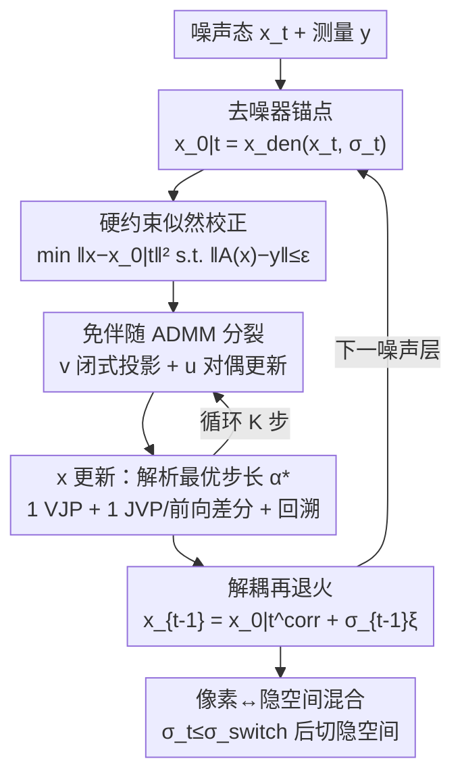

# FAST-DIPS: Adjoint-Free Analytic Steps and Hard-Constrained Likelihood Correction for Diffusion-Prior Inverse Problems

**会议**: ICLR 2026  
**OpenReview**: [https://openreview.net/forum?id=voMeZVAkKL](https://openreview.net/forum?id=voMeZVAkKL)  
**代码**: 论文称将公开（Code and data 见原文 §，未给具体仓库链接）  
**领域**: 扩散模型 / 图像恢复（逆问题求解）  
**关键词**: 扩散先验、逆问题、免伴随、ADMM、解析步长

## 一句话总结
FAST-DIPS 用一套"免伴随（adjoint-free）的硬约束似然校正"替换掉训练无关扩散逆问题求解器里昂贵的内层 MCMC / 多步梯度循环：每个噪声层只在去噪器预测点附近做一个带闭式投影 + 解析最优步长的少步 ADMM 校正，把每层计算预算压到极小，在八类线性/非线性恢复任务上质量持平甚至更好，速度最高快 19.5×。

## 研究背景与动机
**领域现状**：用预训练扩散模型当先验、不重新训练就解逆问题 $y=A(x_0)+n$（去模糊、超分、修复、相位恢复、HDR 等）是当下主流。这类 training-free 求解器从一个无条件扩散先验出发，在采样过程中通过"数据一致性 / 似然更新"把测量 $y$ 注入反向去噪轨迹，逼近后验 $p(x\mid y)\propto p(y\mid x)p(x)$。

**现有痛点**：关键在于"数据一致性怎么强加"。对少数线性退化，似然更新有闭式结构（靠显式伴随算子或伪逆 / SVD）；但当 $A$ 是复杂、病态或仿真器式的非线性前向算子、没有现成闭式伴随 / 伪逆时，似然步通常退化成**内层迭代求解器**——在数据保真目标上跑很多步梯度，或挂一条 Langevin / MCMC 子链，而且为了稳定还得用保守的小步长。结果是每个噪声层都要反复调用 $A$ 及其梯度、反复评估去噪器 / score，墙钟时间高得离谱（论文里非线性去模糊的 DAPS 在 ImageNet 上要 1453 秒一张）。

**核心矛盾**：内层循环的代价（步数 × 每步的算子/梯度调用）与重建质量被绑死——想稳就得多步小步长，想快就得牺牲一致性。再叠加一条正交的取舍轴：**像素空间 vs 隐空间**。隐扩散降维省采样成本，但若保真定义在像素空间，隐空间似然更新要对解码器 $D$ 反传 $\nabla_z\lVert A(D(z))-y\rVert^2$，解码器反传成了吞吐瓶颈。

**本文目标**：造一个 training-free 求解器，同时满足三点——(i) 不依赖算子专属原语（手写伴随 / 伪逆 / SVD）就能强加数据一致性；(ii) 每层校正轻量、固定小预算（少内步、少算子/梯度调用）却仍有竞争力的质量；(iii) 平衡像素与隐空间计算，用早期吞吐换后期保真。

**切入角度**：把"似然校正"重新表述成一个**以去噪器预测为中心的硬约束 MAP 问题**——不再用要调参、对噪声敏感的二次惩罚 $\lambda\lVert A(x)-y\rVert^2$，而是用一个可解释的"残差预算" $\varepsilon$ 定义测量空间的可行球 $\lVert A(x)-y\rVert\le\varepsilon$。这个集合约束的投影是闭式的，再配一个对当前子问题"模型最优"的解析步长，就能把内层循环砍成几步确定性更新。

**核心 idea**：用"闭式测量空间投影 + 解析最优步长的少步 ADMM 分裂"替代"内层 MCMC / 多步梯度"，全程只用自动微分给出的 VJP（以及一个 JVP 或一次前向差分探针），无需任何手写伴随，从而以极小固定预算求解非线性扩散逆问题。

## 方法详解

### 整体框架
FAST-DIPS 的反向采样在每个噪声层 $t$ 做一个"先校正、再加噪"（correct-then-noise）的更新，由三个环节组成：(1) **锚点**——直接拿预训练去噪器的预测 $x_{0\mid t}=x_{\text{den}}(x_t,\sigma_t)$ 作为局部高斯先验的中心；(2) **免伴随硬约束校正**——在以 $x_{0\mid t}$ 为中心的信任域内，强制测量残差落进可行球 $\lVert A(x)-y\rVert\le\varepsilon$，用少步 ADMM 分裂求解，分裂出的测量变量靠闭式投影更新、图像变量靠带解析步长 $\alpha^\star$ 的最速下降更新；(3) **解耦再退火**——校正完后注入下一层方差的高斯噪声 $x_{t-1}=x_{0\mid t}^{\text{corr}}+\sigma_{t-1}\xi$，把"测量感知更新"和"扩散加噪"解耦开。

整个推导建立在条件分解 $p(x_0\mid x_t,y)\propto p(x_0\mid x_t)\,p(y\mid x_0)$ 上，配两个建模选择：先验侧用以去噪器预测为中心的局部高斯（拉普拉斯）代理 $\tilde p_t(x_0\mid x_t)\propto\exp(-\frac{1}{2\gamma_t}\lVert x_0-x_{0\mid t}\rVert^2)$，其中 $\gamma_t=\sigma_t^2$ 让信任域随退火自然收紧；似然侧用集合值代理 $\tilde\ell_\varepsilon(y\mid x_0)\propto \mathbf 1\{\lVert A(x_0)-y\rVert\le\varepsilon\}$。二者相乘取众数，就得到每层要解的硬约束近端问题。

### 关键设计

**1. 硬约束可行性似然：用可解释残差预算的指示集合代替二次惩罚**

针对"二次惩罚 $\lambda\lVert A(x)-y\rVert^2$ 要调权重、对噪声标定误差敏感"这个痛点，FAST-DIPS 在 AWGN 假设下不直接用高斯似然 $p(y\mid x_0)\propto\exp(-\frac{1}{2\beta^2}\lVert A(x_0)-y\rVert^2)$，而换成集合值代理。理由很统计：若噪声标准差 $\beta$ 已知，残差 $A(x_0)-y$ 的 $(1-\delta)$ 置信域恰是欧氏球 $\{v:\lVert v-y\rVert\le\varepsilon\}$，$\varepsilon=\beta\sqrt{\chi^2_{m,1-\delta}}$；若 $\beta$ 未知，把它 profile 掉得到 $-\log p(y\mid x_0,\hat\beta)\propto m\log\lVert A(x_0)-y\rVert$，是残差范数的单调函数，同样指向"把残差压进预算 $\varepsilon$"。两条路都落到指示似然 $\tilde\ell_\varepsilon$，于是每层校正就是硬约束近端问题

$$x_{0\mid t}^{\text{corr}}\in\arg\min_{x}\ \frac{1}{2\gamma_t}\lVert x-x_{0\mid t}\rVert^2\quad\text{s.t.}\quad \lVert A(x)-y\rVert\le\varepsilon.$$

第一项是随退火收紧的信任域（锚在去噪器估计上），约束项把"测量可行性"做成一个有明确物理含义的预算 $\varepsilon$（用户指定的数据一致性容差），而不是一个需要反复 grid search 的 $\lambda$。这跟 PnP-ADMM 的本质区别在于：去噪器**不是**当成（代理）近端算子，它只提供锚点，硬约束由投影显式强加。

**2. 免伴随 ADMM 分裂 + 闭式测量球投影：把内层 MCMC 换成几步确定性迭代**

直接解上面的约束问题需要算子的逆/伴随。FAST-DIPS 用变量分裂绕开：引入辅助变量 $v\approx A(x)$ 与可行集 $C=\{v:\lVert v-y\rVert\le\varepsilon\}$，把问题写成 $\min_{x,v}\frac{1}{2\gamma_t}\lVert x-x_{0\mid t}\rVert^2+\iota_C(v)$ s.t. $A(x)-v=0$，再跑缩放 ADMM 迭代。其中 $v$ 更新是**闭式径向收缩投影**——只要把 $w=A(x)+u$ 拉回球面即可，几乎零成本：

$$\Pi_C(w)=\begin{cases}w,&\lVert w-y\rVert\le\varepsilon\\ y+\varepsilon\dfrac{w-y}{\lVert w-y\rVert},&\text{otherwise}\end{cases}$$

对偶变量 $u\leftarrow u+A(x)-v$，同样 $\mathcal O(1)$。关键是只跑很小的固定 $K$ 步、并**不精确求解** $x$ 子问题——后者交给设计 3 的解析步长最速下降。每次校正迭代只需：一次 $A$ 的前向（常被缓存复用）、一次 VJP 形成 $J_A(x)^\top(A(x)-b_k)$、外加一次 JVP 或一次前向探针。可行性在分裂变量 $v$ 上被投影硬性保证（$v_k\in C$），ADMM 耦合则推动 $A(x_k)\approx v_k$。整条路径没有手写伴随、没有内层 MCMC，因此总函数调用数比长梯度/MCMC 内循环少一个量级。

**3. 解析模型最优步长 + 回溯：去掉学习率超参，单步下降代替调好的优化器**

$x$ 子问题的光滑目标是 $F(x)=\frac{1}{2\gamma_t}\lVert x-x_{0\mid t}\rVert^2+\frac{\rho}{2}\lVert A(x)-b_k\rVert^2$，梯度 $g=\frac{1}{\gamma_t}(x-x_{0\mid t})+\rho J_A(x)^\top(A(x)-b_k)$。FAST-DIPS 不用 Adam + 调学习率，而是沿下降方向把 $A$ 线性化 $A(x-\alpha g)\approx A(x)-\alpha J_A(x)g$，得到一维二次模型，其精确最小点给出**解析步长**

$$\alpha^\star=\frac{\frac{1}{\gamma_t}\langle s,g\rangle+\rho\langle r,J_A(x)g\rangle}{\frac{1}{\gamma_t}\lVert g\rVert^2+\rho\lVert J_A(x)g\rVert^2},\qquad s:=x-x_{0\mid t},\ r:=A(x)-b_k.$$

论文证明分子可化简为 $\lVert g\rVert^2$，故 $g\neq 0$ 时 $\alpha^\star\ge 0$（clamp 只是数值保险），$g=0$ 时已是稳定点取 $\alpha=0$。Proposition 1 进一步保证：用 $\alpha^\star$ 初始化 Armijo 回溯线搜索，即便线性化只是局部精确，被接受的步也能让当前 $x$ 子问题目标单调下降。算 $\alpha^\star$ 只要一次前向 $A$（成 $r$）、一次 VJP（成 $g$）、一次 JVP（成 $J_A(x)g$）。当前向模式 JVP 不可用时，用单次前向差分探针 $J_A(x)g\approx\frac{A(x+\eta g)-A(x)}{\eta}$ 兜底（Remark 4 给了稳定化闭式）。这一步把"步长超参"彻底从系统里抹掉，是稳定性与效率的主要来源。

**4. 隐空间变体 + 一开关像素→隐空间混合调度：早期省、后期忠**

为兼顾"隐扩散省成本"与"像素保真"，FAST-DIPS 把整套每层构造在替换 $A\mapsto A\circ D$（$D$ 为预训练解码器）后照搬到隐空间：在隐变量 $z$ 上用同样的局部高斯代理（$\gamma_z=\sigma_t^2$）和同一个测量空间硬约束 $\lVert A(D(z))-y\rVert\le\varepsilon_z$，ADMM 分裂、投影、解析步长都靠链式法则 + 自动微分穿过 $D$ 和 $A$。但隐空间校正每步要对解码器反传，贵。于是用一个**一开关混合调度**：早期大 $\sigma_t$ 时在像素空间做便宜的校正（避开解码器反传），等 $\sigma_t\le\sigma_{\text{switch}}$ 后切到隐空间校正，让结果更贴合学到的流形。早便宜、晚忠实，只有一个切换超参 $\sigma_{\text{switch}}$，这也是隐空间任务能大幅提速的原因。

### 损失函数 / 训练策略
本方法是 training-free，不训练任何网络，只在采样时求解上述每层 MAP。理论上有两条支撑：Proposition 1 给出解析步长的局部模型最优性与回溯下降；Proposition 6 在局部高斯条件代理下，为"众数替换再退火"诱导的每步高斯注入分布给出显式 KL 上界。注意非线性 $A$ 下每层问题一般非凸，论文只声明局部保证，不声明全局收敛。

## 实验关键数据

### 主实验
在 100 张 FFHQ（256×256）与 100 张 ImageNet（256×256）上评测八类逆问题（五线性 + 三非线性），测量噪声 $\beta=0.05$，指标 PSNR / SSIM / LPIPS + 单图平均运行时间。下表摘取若干代表任务（FFHQ，Pixel/Latent 分组，加粗为该组最优）：

| 任务 | 方法 | PSNR↑ | SSIM↑ | LPIPS↓ | 运行时(s)↓ |
|------|------|-------|-------|--------|-----------|
| Gaussian deblur (Pixel) | DAPS | 28.895 | 0.775 | 0.253 | 50.40 |
| Gaussian deblur (Pixel) | SITCOM | 28.775 | 0.820 | 0.261 | 32.84 |
| Gaussian deblur (Pixel) | **本文** | **29.406** | **0.836** | **0.247** | **2.61** |
| Motion deblur (Pixel) | SITCOM | 31.172 | 0.872 | 0.203 | 36.68 |
| Motion deblur (Pixel) | **本文** | **31.736** | **0.878** | **0.171** | **2.62** |
| Phase retrieval (Pixel) | DAPS | 30.253 | 0.801 | 0.202 | 122.10 |
| Phase retrieval (Pixel) | **本文** | 29.253 | **0.851** | 0.218 | **10.35** |
| Inpaint random (Latent) | ReSample | 29.950 | 0.842 | 0.201 | 278.50 |
| Inpaint random (Latent) | **本文** | 30.091 | **0.877** | 0.201 | **45.34** |

核心结论：像素空间几乎所有任务质量持平或更优，但运行时大幅下降——高斯/运动去模糊上比 DAPS 快约 19.4×（FFHQ）、比 SITCOM 快约 20.8×（ImageNet）；非线性相位恢复（取四次独立运行最好）比 DAPS 快约 11.8×（FFHQ）/ 19.3×（ImageNet）且 SSIM 更高。隐空间靠混合调度避开解码器反传瓶颈，相对 ReSample / LatentDAPS 普遍快数倍。Figure 3 在"同等运行时预算"下扫采样步数，本文曲线随时间稳步上升且始终领先基线，运动去模糊与相位恢复优势尤其明显。

### 消融实验
消融研究两个内层因素（Appendix A.4 / Table 2），在匹配计算预算下对比（按一阶自动微分三元组计数：每个 $x$ 梯度步 = 1 前向 + 1 VJP + 1 JVP/前向探针）：

| 维度 | 配置 | 结论 |
|------|------|------|
| 是否投影 | ADMM + proj.（默认） vs QDP（无分裂无投影的惩罚解） | 投影强加可行性在匹配预算下**一致提升质量**；隐空间额外开销主要来自解码器反传而非投影本身 |
| 步长选择 | 调好的常数 $\alpha$ / 解析 $\alpha^\star$（1 VJP+1 JVP）/ 前向差分 $\alpha_{\text{FD}}$ | 像素线性任务（高斯模糊）$\alpha_{\text{FD}}$ 以更低成本逼近 $\alpha^\star$；非线性隐空间（HDR）对固定步敏感，JVP 版 $\alpha^\star$ 最稳健，$\alpha_{\text{FD}}$ 穿过解码器-前向栈会变差 |

### 关键发现
- 实用配方：**像素空间用 $\alpha_{\text{FD}}$（省一次 JVP）、隐空间用 $\alpha^\star$（更稳）**——这是消融直接给出的可操作建议。
- 计算-质量呈可预测的单调取舍：校正步数越多重建越好，且不依赖精心挑选的初始样本。
- 加速最猛的是那些基线内层循环最重的任务（非线性去模糊 DAPS 要上千秒），本文把每层预算压到固定小值后，墙钟优势被放大。

## 亮点与洞察
- **"硬约束 + 闭式投影"取代"软惩罚 + 调权重"**：把数据一致性从一个需要 grid search 的 $\lambda$ 变成一个有统计含义的残差预算 $\varepsilon$，投影零成本且天然抗噪声标定误差——这是把内层循环砍掉的前提。
- **解析步长是真正的"去超参"杀手锏**：一维二次模型给出闭式 $\alpha^\star$ 并被证明能配回溯单调下降，等于用一个确定性单步更新替掉了 Adam + 调学习率的整套内层优化，既快又稳，这套"局部线性化求解析步长"的思路可迁移到任何带可微前向算子的 plug-and-play 求解器。
- **免伴随是工程上的解放**：只靠自动微分的 VJP/JVP（甚至一次前向差分）就能处理没有闭式伴随/伪逆的非线性、仿真器式前向算子，不用为每个新算子手写伴随或 SVD，泛用性强。
- **一开关像素→隐混合调度**：早期像素省、后期隐空间忠，用单个切换点 $\sigma_{\text{switch}}$ 就化解了隐空间方法"解码器反传贵"的老大难，且与快采样/并行采样技术正交可叠加。

## 局限与展望
- 非线性 $A$ 下每层问题非凸，论文明确只给局部保证（步长下降 + 再退火 KL 界），**不声明全局收敛**——最终质量仍依赖去噪器锚点足够好。
- 可行性只在分裂变量 $v$ 上被投影硬保证，原变量 $x$ 的可行性靠 ADMM 耦合"鼓励"$A(x_k)\approx v_k$，少步 $K$ 下二者可能有残差 gap。
- 残差预算 $\varepsilon$ 当成用户指定容差、未用具体 $\delta$ 标定，跨任务/跨噪声水平可能需要重设；$\rho$、$K$、内步数 $S$、$\sigma_{\text{switch}}$ 等仍是需选的超参（论文称默认值已较稳健）。
- 相位恢复用"四选一最好"协议（所有方法一致），说明非线性病态任务下单次运行仍可能失败，稳定性有提升空间。
- 评测规模为各 100 张图，更大规模/更高分辨率/更极端非线性算子下的表现待验证。

## 相关工作与启发
- **vs DAPS / Latent-DAPS（Zhang et al. 2025）**：本文沿用其解耦再退火与 $\gamma_t=\sigma_t^2$ 的 schedule-aware 思路，但把内层"去噪 Langevin / 多步"替换成硬约束 ADMM + 解析步长，质量相当却快一个量级；非线性去模糊上 DAPS 的内层 MCMC 是最大瓶颈。
- **vs DPS（Chung et al. 2023a）**：DPS 用耦合的 score 引导，本文保持轨迹**解耦**，校正后再做扩散核传输（众数替换再退火），避免耦合引导的步长敏感。
- **vs PnP-ADMM（Chan 2016 / Venkatakrishnan 2013）**：PnP 把去噪器当（代理）近端算子；本文去噪器**只当锚点**，由显式投影强加硬测量约束，语义不同。
- **vs 闭式线性求解器（DDRM/Kawar、DDNM/Wang）**：那些靠显式伴随/伪逆/SVD，只覆盖线性退化；本文免伴随，能处理非线性、仿真器式前向算子。
- **vs 隐空间方法（PSLD/Rout、ReSample/Song）**：它们普遍受解码器反传拖累而运行时极长，本文用像素→隐混合调度把早期成本砍掉，速度优势显著。

## 评分
- 新颖性: ⭐⭐⭐⭐ 把硬约束可行球 + 解析最优步长 + 免伴随 ADMM 三者组合进扩散逆问题求解，思路清晰且有理论支撑，组件本身多有渊源但整合方式新。
- 实验充分度: ⭐⭐⭐⭐ 八任务 × 两数据集 × 像素/隐空间，含同预算曲线与两维消融；规模偏小（各 100 图）、部分细节在附录。
- 写作质量: ⭐⭐⭐⭐ 推导自洽、设计动机具体，方法与理论命题对应清楚。
- 价值: ⭐⭐⭐⭐ 最高 19.5× 提速且免手写伴随，对非线性/仿真器式逆问题的实用价值高，配方（像素用 FD、隐用 JVP）可直接落地。

<!-- RELATED:START -->

## 相关论文

- [\[CVPR 2026\] Dual Ascent Diffusion for Inverse Problems](../../CVPR2026/image_restoration/dual_ascent_diffusion_for_inverse_problems.md)
- [\[CVPR 2026\] PnP-CM: Consistency Models as Plug-and-Play Priors for Inverse Problems](../../CVPR2026/image_restoration/pnp-cm_consistency_models_as_plug-and-play_priors_for_inverse_problems.md)
- [\[CVPR 2026\] Outlier-Robust Diffusion Solvers for Inverse Problems](../../CVPR2026/image_restoration/outlier-robust_diffusion_solvers_for_inverse_problems.md)
- [\[ICML 2026\] Triadic Dynamics Aware Diffusion Posterior Sampling for Inverse Problems: Optimizing Guidance and Stochasticity Schedules](../../ICML2026/image_restoration/triadic_dynamics_aware_diffusion_posterior_sampling_for_inverse_problems_optimiz.md)
- [\[ICML 2026\] Solving Inverse Problems with Flow-based Models via Model Predictive Control](../../ICML2026/image_restoration/solving_inverse_problems_with_flow-based_models_via_model_predictive_control.md)

<!-- RELATED:END -->
