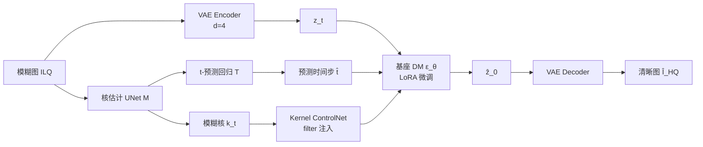

# FideDiff: Efficient Diffusion Model for High-Fidelity Image Motion Deblurring

**会议**: ICLR 2026  
**OpenReview**: [https://openreview.net/forum?id=AFJMB9SkHT](https://openreview.net/forum?id=AFJMB9SkHT)  
**代码**: [https://github.com/xyLiu339/FideDiff](https://github.com/xyLiu339/FideDiff)  
**领域**: 图像恢复 / 运动去模糊 / 扩散模型  
**关键词**: 单步扩散, 运动去模糊, 一致性模型, Kernel ControlNet, 高保真恢复  

## 一句话总结
把运动去模糊重新表述成"以模糊程度为时间步"的类扩散过程，用一致性训练让所有时间步都对齐到同一张清晰图，从而实现**单步、高保真**的预训练扩散去模糊，并配上 Kernel ControlNet 注入模糊核先验和自适应时间步预测。

## 研究背景与动机
- **领域现状**：CNN / Transformer 去模糊（Restormer、AdaRevD 等）在合成数据上 PSNR 很高，但缺乏对真实世界的理解，泛化到真实模糊场景时容易翻车；大规模预训练扩散模型（DM）自带丰富的真实世界先验，生成质量强，被寄望于成为去模糊新范式。
- **现有痛点**：把 DM 用于去模糊有两个老大难——(a) **推理太慢**，动辄几十上百步采样；(b) **保真度差**，很多方法为了感知质量（CLIPIQA、MUSIQ 这类无参考指标）牺牲了 PSNR/LPIPS 这类全参考指标，输出"看着像但不是原图"。
- **核心矛盾**：已有的单步扩散加速方案（OSEDiff、TSD-SR、FluxSR 等蒸馏路线）给所有低质图**分配固定时间步**，等于把迭代去噪坍缩成一次性回归，丢掉了扩散的归纳偏置，也无法区分不同模糊程度；同时这些方法目标错位——超分/去模糊本是全参考任务，却拿无参考感知指标当目标。
- **本文目标**：在**单步推理**的前提下，把恢复**保真度**放在第一位，让预训练 DM 真正服务于工业级图像恢复。
- **核心 idea**：**【把模糊程度当时间步】** 不再给所有图固定一个 t，而是把"逐渐变模糊"视为前向过程、每个时间步对应一档模糊严重度，再用**【跨时间一致性】** 强制 $f_\theta(z_t,t)$ 对所有 t 都预测同一张清晰图，从而天然支持准确的一步去模糊。

## 方法详解

### 整体框架
FideDiff 基于 Stable Diffusion 2.1，由三块拼成：**去模糊基座模型**（一致性训练 + GAN 判别器保真）、**Kernel ControlNet**（注入模糊核先验 + 预测时间步）和**重构后的 GoPro 训练数据**（为每张模糊图配上确定的模糊轨迹）。训练分三阶段：先训基座，再预训练核估计网络，最后冻结基座只训 Kernel ControlNet。推理时用预测的 $\hat t$ 一步出图。

### 关键设计

**1. 前向/后向重构：把运动模糊建模成类扩散链，点题在"以模糊轨迹定义前向过程"。** 运动模糊可近似为清晰图与模糊核的卷积 $I_{blur} \approx I_{sharp} * K + n$。作者把清晰图记为 $z_0$、初始核为恒等卷积 $k_0$，定义前向核生成为一条链 $q(k_{1:T}|k_0)=\prod_t q(k_t|k_{t-1:0})$，每个状态 $z_t = z_0 * k_t$ 对应一档模糊。难点在于真实核是逐像素、非马尔可夫的（受速度、冲量、惯性影响），$q(k_t|z_t,z_0)$ 一般不可解、也无法用高斯近似，标准扩散的反向推导走不通。作者的破局点是回到 DM 的本质目标——重构 $z_0$，于是绕开对核分布的精确建模，直接把训练目标改写成跨时间一致性回归。

**2. 跨时间一致性训练：让同一轨迹上所有时间步都映射到同一张清晰图，是单步推理的根基。** 核心约束是 $z_0 = f_\theta(z_t,t)=f_\theta(z_{t'},t')$，优化目标为 $\min_\theta \mathbb{E}_{t,z_0}\|f_\theta(z_t,t)-z_0\|^2$。其理论依据是：标准扩散之所以需要多步采样，是因为训练时高斯噪声与数据点的**随机配对**；只要每张图的模糊轨迹已知、且轨迹上所有点都被联合训练去映射到同一清晰目标，模型就能学到内在的时间一致性，从而一步采样。为复用预训练权重，作者保留原始扩散系数 $\alpha_t,\beta_t$，但让 $\hat\epsilon=\epsilon_\theta$ 满足 $z_t = k_t * z_0 = \sqrt{\bar\alpha_t}z_0 + \sqrt{1-\bar\alpha_t}\hat\epsilon$（这里 $\hat\epsilon$ 不必是高斯）。

**3. 匹配模糊轨迹的数据重构：没有确定轨迹，一致性就无从谈起。** 关键在于给每个模糊样本配上确定的后向轨迹 $\{z_0,z_1,...,z_t\}$。作者用 GoPro 数据集（240fps、平均 7–13 连续帧合成模糊，中间帧为清晰图），建立帧数 $n$ 到时间步 $t$ 的映射 $t=g(n)=(n-1)\times 20$，满足 $g(1)=0$。由于原始 GoPro 分布不均（大多是 11 帧），作者**手动扩充**数据集（从 2,103 对扩到 7,877 对），保证每张模糊图在其后向轨迹上至少有 3 个点，才足以支撑一致性训练。

**4. Kernel ControlNet：用 filter 而非相加来注入模糊核，因为核图与目标图没有空间对应关系。** 普通 ControlNet 把条件（depth/pose）直接映射后加到 $z_{in}$，但逐像素模糊核 $k_t=M(I_{HQ})\in\mathbb{R}^{m\times m\times H\times W}$ 与目标图无直接空间对齐，简单相加无效。作者改用类滤波模块：$z_{in2}=\mathrm{Conv}(z_{in1})$，$W=\mathrm{Conv}(\mathrm{Cat}(k_{in},z_{in2}))$，$O=W\otimes z_{in2}$，$z_{out}=z_{in1}+Z(O)$，其中 $\otimes$ 是逐元素乘、$Z$ 是零初始化卷积、$W$ 充当注意力权重。$z_{out}$ 再喂给从 DM encoder 拷贝初始化的 ControlNet。此外核估计网络 $M$ 后接一个小回归模块 $T$ 预测推理时未知的时间步 $\hat t=T(M(I_{HQ}))$——轨迹越复杂、模糊越重，$t$ 越大。

**5. 抛弃蒸馏改用 GAN 判别器保真：蒸馏偏向"自然生成"而非"还原原图"。** 作者明确放弃 SinSR/OSEDiff 那类为内容生成服务的蒸馏，改用 GAN 判别器 $D$（预训练 UNet encoder + 若干卷积块）区分真实高质表征 $z_{HQ}$ 与生成 $\hat z_0$，把生成分布拉回真实分布。基座训练损失为 $L=L_1+\lambda_1 L_{\text{EA-LPIPS}}+\lambda_2 L_G$（EA-LPIPS 是带边缘检测的 LPIPS）；核估计阶段用 reblur 损失 $L_{reblur}=L_1(M(I_{HQ})*I_{HQ}, I_{LQ})$ 约束核估计；第三阶段加上时间步回归损失 $L_{time}$。

## 实验关键数据

### 主实验（全参考指标，部分摘录）

| 数据集 | 指标 | AdaRevD (Transformer SOTA) | DiffBIR (扩散) | OSEDiff-s1 (单步扩散) | **FideDiff** |
|--------|------|------|------|------|------|
| GoPro | PSNR↑ | 34.60 | 26.15 | 24.34 | 28.79 |
| GoPro | LPIPS↓ | 0.0712 | 0.2366 | 0.1738 | **0.0831** |
| GoPro | DISTS↓ | 0.0672 | 0.1460 | 0.0834 | **0.0525** |
| RealBlur-J | PSNR↑ | 30.12 | 26.92 | 26.83 | 28.96 |
| RealBlur-J | LPIPS↓ | 0.1408 | 0.2587 | 0.1793 | **0.1142** |
| RealBlur-J | DISTS↓ | 0.1037 | 0.1599 | 0.1198 | **0.0800** |
| RealBlur-R | LPIPS↓ | 0.0621 | 0.3388 | 0.1057 | **0.0584** |

> FideDiff 在四个全参考指标上大幅超越所有扩散方法；在感知相似度（LPIPS/DISTS）上甚至**超过 Transformer SOTA**，在真实数据集 RealBlur 上泛化尤其稳。PSNR 与 Transformer 仍有差距，但相比其他扩散方法把差距大幅缩小。

### 推理速度（sec/image，GoPro）

| 模型 | 速度 |
|------|------|
| DiffBIR-s50 (多步扩散) | 25.40 |
| Diff-Plugin-s20 | 5.29 |
| AdaRevD (Transformer) | 1.09 |
| **FideDiff (d=4, 完整)** | 1.52 |
| **FideDiff (d=8, 无 KCN)** | **0.25** |

> 基座模型 d=8 时最快；为减少细节损失实际用 d=4 并加 Kernel ControlNet，速度仍与 Transformer 相当，比多步 DM 最高快 **17×**。

### 消融实验

| 模块 | GoPro PSNR↑ | GoPro LPIPS↓ |
|------|------|------|
| base | 28.68 | 0.0854 |
| + vanilla controlnet | 28.73 | 0.0844 |
| + 核相加 (kernel addition) | 28.70 | 0.0835 |
| + **Kernel ControlNet (filter)** | **28.79** | **0.0831** |

一致性训练（CT）vs 不用：GoPro LPIPS 从 0.0871 → 0.0831、DISTS 从 0.0548 → 0.0525，证明一致性训练对保真有实质帮助。

### 关键发现
- **EA-LPIPS（边缘增强）> LPIPS > DISTS** 作为感知损失，GAN 判别器在优化 DISTS 时作用尤其关键。
- **VAE 下采样 d=4 显著优于 d=8**（PSNR 26.26 → 27.77）：低分辨率数据集经 SD 的 8× 压缩细节损失太重，降到 4× 能救回大量细节。
- 可学习文本嵌入（LE）优于固定文本嵌入；filter 注入优于核直接相加；自研 Kernel ControlNet 优于基于 MISCFilter 的运动对齐模块。
- 时间步扫描显示 $t\approx 200$（对应 11 帧合成）附近 PSNR/LPIPS 最优，与 GoPro 测试集合成方式吻合。

## 亮点与洞察
- **重新定义时间步语义**：把"模糊程度"映射成扩散时间步，是本文最漂亮的一招——它让单步扩散重新拥有了"区分退化程度"的能力，而不是把所有低质图一刀切到固定 t。
- **一致性训练 + 匹配轨迹数据**是配套的：理论上一致性要求"已知轨迹"，作者就老老实实扩充 GoPro 给每张图配齐 ≥3 个轨迹点，理论与数据互相成全。
- **保真优先的价值取向**：在一片追逐无参考感知指标的单步扩散工作里，本文坚持全参考保真，把扩散方法在 PSNR/LPIPS 上拉回到能和 Transformer 掰手腕的水平，给工业落地提供了更现实的基线。
- **filter 式核注入**点出了一个易被忽视的细节：模糊核不是 depth/pose 那种空间对齐条件，照搬 ControlNet 的相加范式效果有限。

## 局限与展望
- **PSNR 仍逊于 Transformer SOTA**：在纯失真指标上（如 GoPro PSNR 28.79 vs AdaRevD 34.60）扩散路线还有明显差距，作者也坦承当前定位是"高保真扩散基线"而非全面超越。
- **强依赖匹配轨迹数据**：方法成立的前提是能为每张模糊图重构确定的模糊轨迹，这对 GoPro 这类多帧合成数据可行，但对纯真实采集、无轨迹信息的数据（如 RealBlur）只能退而用 t-prediction，泛化机制不如有轨迹时干净。
- **数据需手动扩充**：为满足一致性训练把 GoPro 从 2k 扩到近 8k 对，工程量与可复现成本不低。
- 仅在去模糊单一任务验证，迁移到去噪、超分等其他低层视觉任务的有效性尚待检验（作者将其列为未来方向）。

## 相关工作与启发
- **单步扩散加速**：OSEDiff、TSD-SR、SinSR、FluxSR 等蒸馏路线是直接对手，本文用"一致性训练替代蒸馏 + 时间步语义化"给出了不同思路。
- **一致性模型**：建立在 Song et al. (2023) 的一致性模型与 Schusterbauer/Tong 关于"多步采样源于随机配对"的洞察之上。
- **核估计去模糊**：UFPNet（归一化流表示核）、Kim et al. (2024)（核像素分类）等是核先验路线的代表，本文以 Kernel ControlNet 把核先验接入预训练 DM。
- **ControlNet 系**：从 vanilla ControlNet 到 IRControlNet（Lin et al. 2024），本文指出核条件需要 filter 式注入而非简单相加，对"如何把非空间对齐条件喂进 ControlNet"有借鉴意义。

## 评分
- **新颖性**: ⭐⭐⭐⭐ — "模糊程度即时间步 + 跨时间一致性训练"的重构很有想法，把单步扩散从"固定 t 回归"中解放出来；filter 式核注入也有细节创新。
- **实验充分度**: ⭐⭐⭐⭐ — 四数据集全参考指标、速度、感知-失真曲线、三组消融（基座/KCN/一致性）齐全，对比覆盖 Transformer 与扩散两路 SOTA。
- **写作质量**: ⭐⭐⭐⭐ — 动机分析（两大局限）清晰，公式推导完整，图表组织合理；个别理论部分（核分布不可解后如何绕开）需要读者跟上跳跃。
- **价值**: ⭐⭐⭐⭐ — 为"高保真 + 高效"的预训练扩散去模糊确立了一个扎实基线，对工业落地有现实意义，方法可启发其他低层视觉任务。

<!-- RELATED:START -->

## 相关论文

- [\[CVPR 2025\] Efficient Visual State Space Model for Image Deblurring](../../CVPR2025/image_restoration/efficient_visual_state_space_model_for_image_deblurring.md)
- [\[CVPR 2026\] FiDeSR: High-Fidelity and Detail-Preserving One-Step Diffusion Super-Resolution](../../CVPR2026/image_restoration/fidesr_high-fidelity_and_detail-preserving_one-step_diffusion_super-resolution.md)
- [\[CVPR 2026\] Spatio-Temporal Difference Guided Motion Deblurring with the Complementary Vision Sensor](../../CVPR2026/image_restoration/spatio-temporal_difference_guided_motion_deblurring_with_the_complementary_visio.md)
- [\[CVPR 2026\] Event-Based Motion Deblurring Using Task-Oriented 3D Gaussian Event Representations](../../CVPR2026/image_restoration/event-based_motion_deblurring_using_task-oriented_3d_gaussian_event_representati.md)
- [\[ICLR 2026\] FreeAdapt: Unleashing Diffusion Priors for Ultra-High-Definition Image Restoration](freeadapt_unleashing_diffusion_priors_for_ultra-high-definition_image_restoratio.md)

<!-- RELATED:END -->
