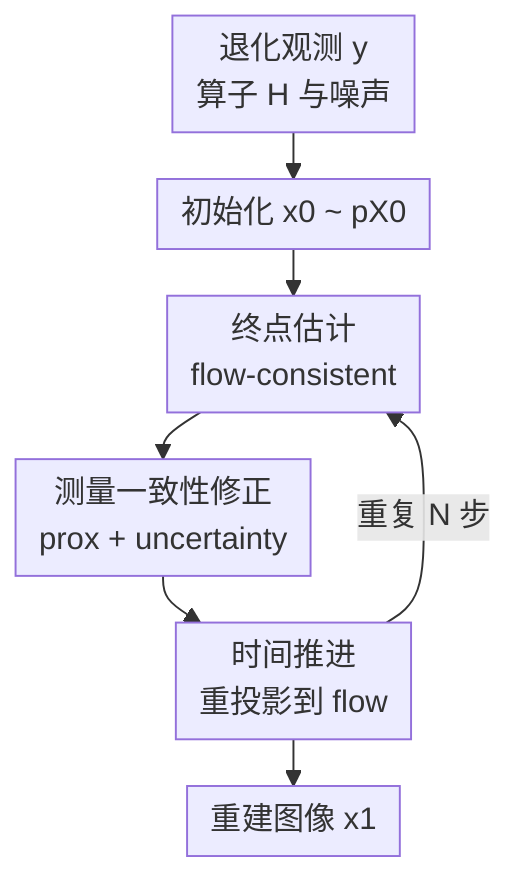

# Flower: A Flow-Matching Solver for Inverse Problems

**会议**: ICLR2026  
**OpenReview**: [https://openreview.net/forum?id=QGd34p02mI](https://openreview.net/forum?id=QGd34p02mI)  
**论文**: [OpenReview](https://openreview.net/forum?id=QGd34p02mI)  
**代码**: https://github.com/mehrsapo/Flower  
**领域**: 图像逆问题 / 图像复原  
**关键词**: flow matching, 逆问题, 图像复原, posterior sampling, plug-and-play  

## 一句话总结
Flower 把预训练 flow-matching 生成模型改造成一个线性逆问题求解器：每个时间步先预测干净终点，再用观测算子做数据一致性近端投影，最后沿 flow 轨迹推进，从而在去噪、去模糊、超分和 inpainting 等图像复原任务上取得强于现有 flow-based solver 的结果。

## 研究背景与动机
**领域现状**：图像逆问题通常从退化观测 $y = Hx + n$ 中恢复原始图像 $x$，其中 $H$ 可以是模糊核、下采样、mask 或 Fourier 采样算子。传统路线会显式设计正则项，例如 TV、稀疏先验或学习到的 patch prior；深度学习之后，plug-and-play 方法把一个预训练去噪器当作隐式近端算子，与数据一致性更新交替使用。近几年扩散模型和 flow matching 又提供了更强的生成先验，使逆问题从“找一个看起来合理的点估计”转向“从后验 $p_{X|Y=y}$ 中采样”。

**现有痛点**：扩散/flow 逆问题求解器往往需要沿生成路径加入梯度校正、score 近似或通过 ODE 反传优化 latent，这会带来两个问题：一是推理过程容易变重，尤其 D-Flow、Flow Priors 这类方法需要多次反传或迹估计；二是不同退化任务通常要重新调很多超参数，迁移到新 forward operator 时不够稳定。PnP-Flow 这类方法更轻量，但它主要是 plug-and-play 解释，缺少“为什么这些交替步骤近似后验采样”的概率论说明。

**核心矛盾**：预训练 flow-matching 模型擅长从先验 $p_{X_1}$ 生成自然图像，但逆问题需要的是条件分布 $p_{X_1|Y=y}$。如果只沿无条件 ODE 走，结果会好看但未必满足观测；如果只强行投影到观测可行集，又会丢掉生成先验带来的自然图像结构。本文要解决的关键是：怎样在每个 flow 时间步同时保留“沿生成轨迹前进”和“满足测量约束”这两件事。

**本文目标**：作者希望构造一个训练后可直接使用的 solver，不重新训练条件模型，只依赖预训练 velocity network、已知 forward operator $H$ 和噪声水平 $\sigma_n$。这个 solver 应该能覆盖多种线性成像逆问题，并且尽量少调参；同时，它还要给出一个 Bayesian ancestral sampling 的解释，而不是只停留在经验性的 PnP 更新。

**切入角度**：flow matching 的直线路径有一个很有用的性质：在时间 $t$ 的样本 $x_t$ 上，最优 velocity 可以反推出目标端 $X_1$ 的条件期望。换句话说，velocity network 不只是告诉我们下一步往哪走，还可以被看作一个“flow-consistent denoiser”，先估计当前轨迹最终会到达的干净图像。Flower 的核心就是把这个终点估计作为桥梁，在终点空间做观测约束，再把修正后的终点重新投回 flow 轨迹。

**核心 idea**：用“终点估计 → 测量一致性近端修正 → 重新沿 flow 推进”的三步循环，把无条件 flow matching 转成一个近似后验采样的图像逆问题求解器。

## 方法详解

### 整体框架
Flower 的输入是退化观测 $y$、线性 forward operator $H$、噪声标准差 $\sigma_n$ 和一个已经训练好的 flow-matching velocity network $v_t^\theta$。它从源分布 $p_{X_0}$（通常是标准高斯）采样初始 $x_0$，然后把 $[0,1]$ 离散成 $N$ 个时间步；每个时间步不再简单执行 $x_{t+\Delta t}=x_t+\Delta t v_t^\theta(x_t)$，而是先估计干净终点、再根据测量做近端投影、最后用新噪声与修正终点插值到下一时刻。

这三个步骤分别对应本文的三个贡献节点：flow-consistent destination estimation 提供生成先验，measurement-aware destination refinement 负责数据一致性，time progression 则把修正后的后验终点样本放回 flow trajectory。重复这一过程后，最终 $x_1$ 就是对原图的重建；当保留 refinement uncertainty 时，理论上可解释为近似 posterior sample，实际图像复原指标里作者发现去掉这项随机性通常更好。

### 关键设计
**1. 终点估计：把 velocity network 变成 flow-consistent denoiser**

Flower 的第一步不是直接拿 $v_t^\theta(x_t)$ 做 Euler 更新，而是用它估计当前 $x_t$ 对应的干净目标端：$\hat{x}_1(x_t)=x_t+(1-t)v_t^\theta(x_t)$。这个式子来自 straight-line flow matching：若 $x_t=(1-t)x_0+t x_1$，速度就是 $x_1-x_0$，因此从 $x_t$ 加上剩余时间长度 $(1-t)$ 乘以 velocity，就能回推出一个“终点”。论文进一步证明，在 velocity network 达到最优时，这个终点正是 $E[X_1|X_t=x_t]$。

这个设计解决的是 flow prior 和 inverse constraint 之间缺少接口的问题。很多方法直接在 $x_t$ 空间修正 velocity 或加 likelihood gradient，但那里的变量仍是中间噪声状态，数据一致性的含义不够直观。Flower 先把当前状态翻译成目标图像空间里的 $\hat{x}_1$，相当于先问生成模型“你认为最终干净图像会是什么”，再在这个空间检查它是否符合 $y=Hx+n$。因此后面的近端投影不是盲目拉动轨迹，而是在一个可解释的干净图像估计上做修正。

**2. 测量一致性修正：用近端投影把生成终点拉回可行后验**

得到 $\hat{x}_1(x_t)$ 后，Flower 假设当前终点的不确定性可近似为一个退火高斯：$\tilde{p}_{X_1|X_t=x_t}=N(\hat{x}_1(x_t),\nu_t^2 I)$，其中 $\nu_t=(1-t)/\sqrt{t^2+(1-t)^2}$。这个方差随时间减小：早期 $x_t$ 噪声大，终点估计不确定；接近 $t=1$ 时，轨迹已经靠近目标图像，终点估计应该更可信。结合线性高斯观测模型 $p_{Y|X_1=x_1}=N(Hx_1,\sigma_n^2 I)$ 后，近似后验仍是高斯，均值可以写成一个近端问题：

$$
\mu_t(x_t,y)=\operatorname{prox}_{\nu_t^2 F_y}(\hat{x}_1(x_t)),\quad F_y(x)=\frac{1}{2\sigma_n^2}\|Hx-y\|_2^2.
$$

直观上，$\mu_t$ 是在“离 flow 预测终点不要太远”和“投影后能解释观测 $y$”之间做平衡。对于去模糊、超分、inpainting 等线性任务，这一步就是解一个正定线性系统，而不是靠调很多手工梯度步长。论文还给出协方差 $\Sigma_t=(\nu_t^{-2}I+\sigma_n^{-2}H^\top H)^{-1}$，并用 $\tilde{x}_1=\mu_t+\gamma\kappa_t$ 表示是否加入 refinement uncertainty；$\gamma=1$ 对应理论上的后验采样，$\gamma=0$ 则退化成更像 MAP/MMSE 风格的稳定修正。

**3. 时间推进：把修正后的终点重新投回生成轨迹**

仅把 $\hat{x}_1$ 投影成 $\tilde{x}_1$ 还不够，因为 Flower 仍要沿 flow-matching 的连续时间路径前进。第三步用

$$
x_{t+\Delta t}=(1-t-\Delta t)\epsilon+(t+\Delta t)\tilde{x}_1(x_t,y),\quad \epsilon\sim p_{X_0}
$$

生成下一时刻样本。这个式子保留了 straight-line interpolation 的结构：下一时刻由新的源噪声和修正后的目标端共同决定；随着 $t$ 增大，噪声权重降低，测量一致的终点权重升高。这样做比“在当前 $x_t$ 上做一次修正后继续原 ODE”更符合 flow training 时的路径假设。

这一时间推进也是论文 Bayesian 论证的关键。作者把每一步看成从 $p_{X_{t+\Delta t}|X_t=x_t,Y=y}$ 近似采样：Step 1 近似 $p_{X_1|X_t=x_t}$，Step 2 加入观测得到 $\tilde{p}_{X_1|X_t=x_t,Y=y}$，Step 3 再通过源噪声和目标端插值得到下一时刻的条件分布。若初始 $X_0$ 与 $Y$ 独立，并且使用独立 coupling 的 flow-matching 设定，这个 ancestral sampling 递推就能解释为什么最终 $x_1$ 近似来自后验 $p_{X_1|Y=y}$。

### 一个完整示例
以 box inpainting 为例，观测 $y$ 包含图像外部区域，中心方框被 mask 掉，forward operator $H$ 只保留可见像素。Flower 从高斯噪声 $x_0$ 开始；在早期时间步，velocity network 的终点估计 $\hat{x}_1$ 可能已经给出一个大致自然的人脸或猫脸，但可见区域还未必和输入完全对齐。近端修正会强制未遮挡区域接近观测：对于可见像素，$Hx\approx y$ 的约束很强；对于 mask 内部，$H$ 没有观测，修正更多依赖 flow prior。

随后时间推进把这个修正后的终点与新采样的源噪声重新插值。早期新噪声比例高，图像仍较模糊；中后期终点权重越来越大，缺失区域逐渐被生成模型补全，而可见区域被 Step 2 持续拉回测量一致。论文的可视化也显示，Step 1 更像生成式去噪，Step 2 主要校正已观测区域，Step 3 则防止轨迹卡在上一步并继续让重建细节浮现。

### 损失函数 / 训练策略
Flower 本身不需要为每个逆问题重新训练条件模型，它使用的是预训练的 unconditional flow-matching velocity network。背景训练采用 conditional flow-matching loss：在 $t\sim U[0,1]$、样本对 $(x_0,x_1)$ 来自某个 coupling $\pi$ 时，让网络拟合直线路径速度 $x_1-x_0$：

$$
L_{CFM}(\theta)=E\|v_t^\theta((1-t)x_0+t x_1,t)-(x_1-x_0)\|_2^2.
$$

论文实验主要沿用 PnP-Flow benchmark 中的 U-Net backbone 和 mini-batch OT flow matching 权重；为了验证理论假设，也额外训练了 independent coupling 的 Flower-IND 版本。推理时 Flower 的主要配置很少：时间步数 $N$、噪声水平 $\sigma_n$、平均次数 $N_{Avg}$，以及 refinement uncertainty 开关 $\gamma$。虽然理论 posterior sampling 对应 $\gamma=1$，但主实验采用 $\gamma=0$，因为它在图像复原指标上更稳定，单次或少量平均即可获得更高 PSNR/SSIM。

## 实验关键数据

### 主实验
论文在 CelebA $128\times128$ 人脸和 AFHQ-Cat $256\times256$ 猫图上评估五类 restoration 任务：Gaussian denoising、deblurring、super-resolution、random inpainting 和 box inpainting。指标包括 PSNR、SSIM 和 LPIPS；PSNR/SSIM 越高越好，LPIPS 越低越好。下表摘取 CelebA 100 张测试图的代表性结果，展示 Flower 相比主要 flow-based baseline 的优势。

| 数据集 / 任务 | 指标 | Flower1-OT | PnP-Flow1 | OT-ODE | 之前最好单次结果 | 提升 |
|--------|------|------|------|------|------|------|
| CelebA / Denoising | PSNR↑ | 32.28 | 31.80 | 30.54 | PnP-GS 32.64 | 低于 PnP-GS 0.36，但优于 flow baseline |
| CelebA / Deblurring | PSNR↑ | 34.98 | 34.48 | 33.01 | PnP-Flow1 34.48 | +0.50 |
| CelebA / Super-resolution | PSNR↑ | 32.36 | 31.09 | 31.46 | DiffPIR 31.52 | +0.84 |
| CelebA / Random inpainting | PSNR↑ | 33.08 | 33.05 | 28.68 | D-Flow 33.67 | 低于 D-Flow 0.59，但速度/内存更轻 |
| CelebA / Box inpainting | PSNR↑ | 31.19 | 30.47 | 29.40 | D-Flow 30.70 | +0.49 |

在 AFHQ-Cat 上，任务更难、图像尺寸更大，Flower 依然在多项任务上保持竞争力。尤其是 deblurring 和 box inpainting，Flower1-OT 相比 PnP-Flow1 有明显提升；denoising 中 PnP-GS 仍是最强，但它不是 flow-matching solver。

| 数据集 / 任务 | 指标 | Flower1-OT | PnP-Flow1 | OT-ODE | 之前最好单次结果 | 提升 |
|--------|------|------|------|------|------|------|
| AFHQ-Cat / Denoising | PSNR↑ | 31.69 | 31.18 | 30.03 | PnP-GS 32.58 | 低于 PnP-GS 0.89，优于 flow baseline |
| AFHQ-Cat / Deblurring | PSNR↑ | 28.64 | 27.87 | 27.06 | PnP-GS 27.91 | +0.73 |
| AFHQ-Cat / Super-resolution | PSNR↑ | 26.23 | 26.94 | 25.91 | PnP-Flow1 26.94 | -0.71 |
| AFHQ-Cat / Random inpainting | PSNR↑ | 32.97 | 33.00 | 29.40 | Flow-Priors 32.37 / PnP-Flow1 33.00 | 基本持平 |
| AFHQ-Cat / Box inpainting | PSNR↑ | 26.19 | 26.00 | 24.62 | D-Flow 26.26 | 基本持平，SSIM 更高 |

### 消融实验
论文的消融主要围绕 coupling、uncertainty、平均次数和时间离散展开。下面表格摘取最关键的 CelebA coupling 消融；在 $\gamma=0,N=100$ 下，理论更匹配的 independent coupling 版本整体优于 OT coupling，但 OT 版本已经能达到主文报告的强结果。

| 配置 | 关键指标 | 说明 |
|------|---------|------|
| Flower1-OT | Deblurring PSNR 34.98 / Box PSNR 31.19 | 与其他 flow baseline 使用同类 mini-batch OT flow 权重，主文默认配置 |
| Flower5-OT | Deblurring PSNR 35.67 / Box PSNR 31.87 | 5 次重建平均后 PSNR/SSIM 进一步上升，但 LPIPS 可能略变差 |
| Flower1-IND | Deblurring PSNR 35.22 / Box PSNR 31.90 | independent coupling 更符合 Bayesian 推导，单次结果更好 |
| Flower5-IND | Deblurring PSNR 35.90 / Box PSNR 32.78 | coupling + averaging 同时使用时表现最佳 |

另一个重要消融是 $\gamma$。$\gamma=1$ 会采样 refinement uncertainty，更符合后验采样理论，在 2D Gaussian mixture toy experiment 中可以覆盖 posterior 的尾部；但图像复原主指标更偏向高概率、低噪声的重建，$\gamma=0$ 反而 PSNR 更高。论文给出去模糊例子：单次 $\gamma=1$ 只有 30.84 PSNR，而单次 $\gamma=0$ 达到 33.01；$\gamma=1$ 需要平均约 100 次才接近 $\gamma=0$ 少量平均的质量。

### 关键发现
- Flower 在 flow-based inverse solvers 中整体最稳，尤其 deblurring、box inpainting 和 CelebA super-resolution 很强；视觉结果也显示它比 OT-ODE、D-Flow、Flow-Priors 更少伪影，比 PnP-Flow 更少过平滑。
- 方法几乎不需要为每个任务重新调复杂超参数。除 $N$、$N_{Avg}$、已知噪声水平和 $\gamma$ 外，它没有像 Flow-Priors、D-Flow、PnP-Flow 那样大量任务相关步长或正则系数。
- 理论上更干净的 independent coupling 确实带来更高性能，这支持了作者关于 $p_{X_0}$ 与 $p_{X_1}$ 独立假设的分析；但即使用 OT coupling，Flower 也可以从 PnP 角度解释并保持高性能。
- 计算开销接近 PnP-Flow 和 OT-ODE。CelebA 去模糊中 Flower1 约 5.622 秒、0.217 GB，PnP-Flow1 约 3.020 秒、0.216 GB；相比 D-Flow 的 142.18 秒和 11.125 GB，Flower 明显更实用。
- 自适应时间步有潜力：把更多步数分配到轨迹后段的 $\alpha=0.5$ power schedule 在低步数时效果更好，大步数时不同 schedule 逐渐收敛。

## 亮点与洞察
- Flower 最巧妙的地方是把 velocity network 的输出解释成“终点条件期望”，而不是只把它当作 ODE 速度。这个视角让 flow model 在逆问题里有了一个自然的数据一致性接口。
- 近端修正比 likelihood gradient correction 更干净：对于线性高斯观测，后验均值和协方差都有闭式形式或可通过线性系统求解，避免了大量任务相关步长调参。
- 论文把 PnP 的经验交替更新和 Bayesian posterior sampling 联系起来。Step 1 像去噪器，Step 2 像数据一致性近端投影，Step 3 像回到生成轨迹；这让传统逆问题优化语言和生成模型采样语言对上了。
- $\gamma=1$ 与 $\gamma=0$ 的差异很有启发：后验采样并不一定等于最高 PSNR 重建。需要多样性、不确定性量化时应保留随机性；追求图像复原 benchmark 的点估计质量时，去掉随机项可能更合适。
- 这套框架可以迁移到 MRI、CT、压缩感知、mask restoration 等更广泛的线性成像任务。只要 forward operator 和其伴随算子可用，核心近端/线性系统求解就能接上。

## 局限与展望
- 理论推导依赖几个较强假设：velocity network 要足够接近最优，源分布和目标分布要独立，且观测模型是线性高斯。主实验默认的 OT coupling 并不严格满足独立假设，因此理论和实践之间仍有缝隙。
- Flower 当前主版本面向线性 inverse problems。论文讨论了 nonlinear extension，可以用 Langevin dynamics 对 $\tilde{p}_{X_1|X_t,Y}$ 采样，但这会增加计算复杂度，也会引入新的采样步数和步长选择问题。
- $\gamma=0$ 虽然指标更好，却削弱了 posterior sampling 的完整性。若任务需要不确定性估计，例如医学影像中缺失区域的多解性，单纯使用 $\gamma=0$ 可能会过度集中在高概率模式，低估后验尾部。
- 实验主要集中在人脸和猫图的标准 benchmark，真实医学、遥感或 MRI 数据的 forward operator、噪声分布和 domain shift 更复杂。后续需要在真实成像任务上验证它是否仍能保持少调参优势。
- 近端修正需要反复解 $(\nu_t^{-2}I+\sigma_n^{-2}H^\top H)z=b$。论文用 CG 处理并设置最多 50 次迭代，但在更大尺寸或更复杂算子上，线性求解成本可能成为瓶颈。

## 相关工作与启发
- **vs DPS / FlowDPS**: DPS 类方法通过近似 likelihood gradient 来修正 diffusion 或 flow 动态；Flower 不直接在中间状态上加梯度，而是在估计终点空间构造近似后验，再重新推进时间，因此数据一致性步骤更接近 closed-form Bayesian update。
- **vs ΠGDM / OT-ODE**: Flower 使用了类似 ΠGDM 的 $\tilde{p}_{X_1|X_t}=N(\hat{x}_1,\nu_t^2I)$ 近似，但 OT-ODE 更偏向构造条件 velocity field，Flower 则显式采样/修正目标端并做 ancestral transition。
- **vs DiffPIR / DDS**: DiffPIR 和 DDS 也有“生成先验 + 近端/投影”的结构，但它们主要来自扩散模型和优化视角。Flower 的贡献在于把类似结构放进 flow matching，并给出后验采样解释。
- **vs PnP-Flow**: PnP-Flow 同样把 velocity network 当作 denoiser 使用，但它的数据一致性是梯度式更新，Flower 改成近端操作，在主实验里重建质量更好，同时补上了 Bayesian 分析。
- **启发**: 对其他 generative inverse solver，一个值得借鉴的方向是先找到生成模型内部“可解释的干净变量”（例如 diffusion 的 denoised estimate、flow 的 destination estimate），再把观测约束施加在这个变量上，而不是直接粗暴修改采样轨迹。

## 评分
- 新颖性: ⭐⭐⭐⭐☆ 把 flow-matching destination estimate、近端数据一致性和 ancestral posterior sampling 串起来很清晰，单个组件并非全新，但组合与理论解释有价值。
- 实验充分度: ⭐⭐⭐⭐☆ 覆盖两类数据集、五类线性复原任务、多种 baseline 和多项消融；不足是还缺少真实医学/MRI 等更贴近 inverse problems 的大规模验证。
- 写作质量: ⭐⭐⭐⭐⭐ 方法推导、概率解释、PnP 关系和实验设置都交代得很完整，读者能顺着三步流程理解算法。
- 价值: ⭐⭐⭐⭐☆ 对 flow-matching 逆问题求解很实用，尤其适合已有强 flow prior、希望低调参迁移到多种线性成像退化的场景。

<!-- RELATED:START -->

## 相关论文

- [\[ICML 2026\] Solving Inverse Problems with Flow-based Models via Model Predictive Control](../../ICML2026/image_restoration/solving_inverse_problems_with_flow-based_models_via_model_predictive_control.md)
- [\[ICLR 2026\] Noise-Adaptive Diffusion Sampling for Inverse Problems Without Task-Specific Tuning](noise-adaptive_diffusion_sampling_for_inverse_problems_without_task-specific_tun.md)
- [\[CVPR 2026\] Dual Ascent Diffusion for Inverse Problems](../../CVPR2026/image_restoration/dual_ascent_diffusion_for_inverse_problems.md)
- [\[CVPR 2025\] FiRe: Fixed-points of Restoration Priors for Solving Inverse Problems](../../CVPR2025/image_restoration/fire_fixed-points_of_restoration_priors_for_solving_inverse_problems.md)
- [\[ICLR 2026\] FAST-DIPS: Adjoint-Free Analytic Steps and Hard-Constrained Likelihood Correction for Diffusion-Prior Inverse Problems](fastdips_adjointfree_analytic_steps_and_hardconstrained_likelihood_correction_fo.md)

<!-- RELATED:END -->
