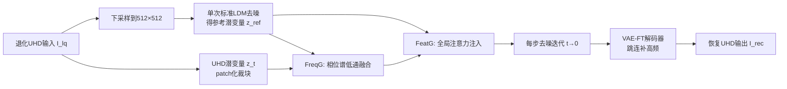

# FreeAdapt: Unleashing Diffusion Priors for Ultra-High-Definition Image Restoration

**会议**: ICLR 2026  
**OpenReview**: [https://openreview.net/forum?id=OKUGAxu6Ww](https://openreview.net/forum?id=OKUGAxu6Ww)  
**代码**: 待确认  
**领域**: 图像恢复 / 扩散模型先验 / 超高清图像处理  
**关键词**: UHD 图像恢复, 潜在扩散模型, 免训练引导, 频域引导, VAE 微调  

## 一句话总结
提出免训练的"频率-特征协同引导"(FFSG)机制，在 patch 推理的每一步去噪中用低分辨率参考图的相位谱与全局注意力约束局部生成，再配一个可选的 VAE 解码器微调模块，从而即插即用地把预训练 LDM 适配到超高清(4K/8K)图像恢复，平均带来 2 dB 以上 PSNR 提升且不动 U-Net。

## 研究背景与动机
**领域现状**：随着 4K/8K 显示与成像普及，超高清图像恢复(UHD-IR)成为热点，要在巨大分辨率下同时去低光/去雾/去模糊并保留细粒度纹理。主流做法(UHDformer、ERR、DreamUHD 等)靠堆网络结构和训练范式提升指标。

**现有痛点**：图像恢复本质是病态(ill-posed)问题，单纯改网络结构难以突破上限；而预训练潜在扩散模型(LDM)虽有强生成先验，却几乎没人探索如何把它用到 UHD-IR。直接套用 LDM 又有三个硬伤——① UHD 图太大装不进显存，被迫 patch 推理，导致条纹伪影、跨块色彩不一致；② patch 之间缺全局上下文，扩散随机性放大，平滑区域生成出虚假高频细节；③ VAE 的有损压缩本身就丢弃高频信息，限制重建保真度。

**核心矛盾**：高分辨率生成类方法(MultiDiffusion、DemoFusion)只追求"看着合理"，可以自由幻觉内容；但恢复任务要求严格忠于退化输入，任何幻觉或改动都违背目标——两种诉求根本对立。

**本文目标**：在**不修改、不微调去噪 U-Net** 的前提下，即插即用地解决伪影、全局不一致与细节丢失，让预训练 LDM 及其扩展(如 ControlNet)真正服务于 UHD-IR。

**核心 idea**：`免训练推理期引导` + `任务级 VAE 解码器微调`。前者在每步去噪注入"全局结构应该长什么样"的约束(频域相位 + 全局注意力)；后者用跳连补回 VAE 丢掉的高频，且这个先验跨扩散骨干通用。

## 方法详解

### 整体框架
FreeAdapt 把退化的 UHD 输入 $I_{lq}$ 先下采样到 LDM 原生训练分辨率(如 512×512)，跑一次标准去噪得到结构连贯的"参考图" $I_{ref}$，再上采样回 UHD、重新编码成参考潜变量 $z^{ref}_0$。随后在 UHD 潜空间做 patch 化迭代去噪，每一步都插入 FFSG 的两个模块——频率引导(FreqG)与特征引导(FeatG)——分别管全局结构一致性与局部细节真实性。最后解码时可选挂一个用跳连增强的 VAE 微调解码器(VAE-FT)补高频。整套去噪流程保持 training-free，只有 VAE-FT 是离线训练且与具体骨干无关。

### 关键设计

**1. 频率引导 FreqG：只借参考图的相位来锁全局结构。** patch 推理最大的病是跨块色彩/结构错位，作者的洞察是结构信息主要藏在相位谱里，纹理细节藏在幅值谱里。于是每步把当前潜变量 $z_t$ 与加噪参考 $z^{ref}_t$ 各做一次 FFT，得到 $FFT(z_t)=A_t e^{i\phi_t}$ 与 $FFT(z^{ref}_t)=A^{ref}_t e^{i\phi^{ref}_t}$，**只融合相位、保留各自幅值**，用一个动态低通滤波器 $K(t)$ 加权两个相位：$\phi_t=\arctan\big((1-K(t))e^{i\phi_t}+K(t)e^{i\phi^{ref}_t}\big)$。$K(t)$ 是个随去噪步推进而收缩的中心方窗(超参 $c$ 默认 0.15)——早期(高噪)窗大、强约束全局骨架，后期(低噪)窗小、把细节生成的自由度还给模型。修正后的潜变量用原幅值 $A_t$ 配融合相位 $\phi_t$ 反变换回去：$z'_t=iFFT(A_t e^{i\phi_t})$。消融里 FreqG 比 DemoFusion 的空域跳残差(导致模糊)和直接 FFT 频谱融合(导致色偏)都更稳。

**2. 特征引导 FeatG：往 U-Net 自注意力里掺全局语义，压住虚假高频。** FreqG 只管低频结构，管不住每个 patch 各自独立生成的高频——平滑区域因此长出噪点般的假细节。FeatG 让每个 patch 在算注意力时"参考"一眼全局。具体地，先算当前高分辨 patch 的局部注意力 $Attn_{local}=\text{softmax}(Q_{tile}K^T_{tile}/\sqrt{d})V_{tile}$；同时从参考图取出对齐的 query $Q^{ref}_{tile}$ 与全局的 key/value，算全局注意力 $Attn_{global}=\text{softmax}(U(Q^{ref}_{tile}){K^{ref}_{global}}^T/\sqrt{d})V^{ref}_{global}$($U$ 为上采样)；最后线性混合 $Attn_{final}=(1-\alpha)Attn_{local}+\alpha\,Attn_{global}$，$\alpha$ 默认仅 0.2，且只作用在 U-Net 解码器第 3–8 层。轻轻一掺就把跨块一致性和纹理真实度拉起来，又不喧宾夺主盖过局部细节。

**3. VAE 解码器微调 VAE-FT：用跳连把 VAE 丢掉的高频补回来，且跨骨干通用。** LDM 的 VAE 有损压缩天然丢高频(细纹理、文字)，是 UHD-IR 的瓶颈。VAE-FT 冻结编码器和 U-Net、只增强解码器：训练时低质图与高质图共享编码器，解码器在拿到高质潜变量的同时，通过**跳连**接收从退化输入提取的残差特征。这些残差先过 AdaIN 抑制退化、保结构，再经零卷积(Zero-Conv)注入对应上采样层，解码器侧只加 LoRA 做参数高效微调。损失是复合的 $L=L_{dwt}+L_{lpips}+L_{ssim}+L_{gan}$——其中 $L_{dwt}$ 在离散小波域用 L2 专门重建高频。关键巧思：它学的是"细节重建"这一**任务级先验**而非具体恢复任务，因此一次训练即可挂到 LDM/StableSR/DiffBIR 等不同骨干上，是补充而非改写扩散先验的轻量旁路。

## 实验关键数据

### 主实验(三任务 × 三骨干，Table 1 节选 UHD-LL)

| 方法 | PSNR↑ | SSIM↑ | LPIPS↓ | DISTS↓ | CLIPIQA↑ | MUSIQ↑ | MANIQA↑ |
|------|-------|-------|--------|--------|----------|--------|---------|
| Wave-Mamba | 29.84 | 0.941 | 0.185 | 0.117 | 0.410 | 41.78 | 0.337 |
| ERR | 27.57 | 0.933 | 0.214 | 0.148 | 0.501 | 42.28 | 0.344 |
| LDM-Ours | 22.21 | 0.887 | 0.253 | **0.101** | **0.569** | **49.07** | **0.372** |
| DiffBIR-Ours | 23.99 | 0.900 | 0.233 | **0.092** | 0.564 | 48.37 | 0.364 |

全参考指标(PSNR/SSIM)上不如端到端训练的非扩散法(因后者直接用 L2/感知损失对齐这些指标，但代价是过度平滑)；而在感知/无参考指标(DISTS、CLIPIQA、MUSIQ、MANIQA)上全面领先。去雾任务 DISTS 比次优 SwinIR 提升约 26.3%，去模糊 LPIPS 比 ERR 提升约 29.6%。

### 与免训练扩散适配法对比(Table 2 节选)

| 配置 | UHD-LL PSNR/LPIPS/MUSIQ |
|------|--------------------------|
| LDM-PI(patch 推理) | 18.91 / 0.386 / 44.89 |
| LDM-MultiDiffusion | 20.13 / 0.399 / 32.41 |
| LDM-DemoFusion | 21.74 / 0.417 / 23.09 |
| LDM-Ours w/o VAE-FT | 21.88 / 0.283 / 45.67 |
| **LDM-Ours** | **22.21 / 0.253 / 49.07** |
| FFSG Gain | +2.96 / -0.103 / +0.78 |

三个骨干下 FFSG 相对 patch 推理一致带来约 2–3 dB PSNR 增益，并全面压过 MultiDiffusion/DemoFusion/PixelSmith——后者为生成而设计、追求"看着像"，难保持与退化输入的严格一致。

### 消融实验(Table 3, UHD-LL/LDM)

| FreqG | FeatG | VAE-FT | PSNR↑ | LPIPS↓ |
|:---:|:---:|:---:|-------|--------|
| × | × | × | 18.91 | 0.386 |
| ✓ | × | × | 21.76 | 0.314 |
| ✓ | ✓ | × | 21.88 | 0.283 |
| ✓ | ✓ | ✓ | 22.21 | 0.253 |

FreqG 单独就把 PSNR 从 18.91 拉到 21.76(锁全局结构是最大贡献)，FeatG 主要降 LPIPS(0.314→0.283，压假高频)，VAE-FT 再补一刀感知细节。融合方式对比(Table 4)中 FreqG 的 DISTS(0.121)显著优于空域跳残差(0.312)和纯 FFT 融合(0.187)。

### 关键发现
- 相位融合 + 动态低通是 UHD patch 推理一致性的高性价比解法，免训练即可。
- 全参考指标与感知指标在恢复任务里存在天然取舍，本文站在"真实细节"一侧。
- VAE 才是 UHD-IR 保真度的隐形瓶颈，补解码器跳连收益稳定且跨骨干迁移。

## 亮点与洞察
- **相位/幅值解耦的洞察很漂亮**：把"全局结构=相位、纹理细节=幅值"这一频域常识落进逐步去噪，只融相位就同时拿到一致性又不绑死纹理。
- **三模块各司其职、可插拔**：FreqG 管低频结构、FeatG 管高频抑制、VAE-FT 管解码保真，正交且都能单独开关，工程上很友好。
- **真正的"prior 通用件"**：VAE-FT 学任务级而非模型级先验，一次训练挂三个骨干，体现了"补充而非改写扩散先验"的设计哲学。
- **首个面向 UHD-IR 的即插即用扩散先验框架**，给"该不该重训大模型"提供了低成本反例。

## 局限与展望
- **全参考指标(PSNR/SSIM)偏低**：扩散生成天然偏离像素级对齐，在以 PSNR 为唯一 KPI 的场景(如某些遥感/医学度量)可能不占优。
- **参考图依赖单次低分辨去噪**：若下采样后退化严重到结构都错，参考相位会误导全局，缺少对参考可靠性的自适应判别。
- **多次 FFT + patch 注意力的推理开销**：UHD 分辨率下每步都做频域变换与全局注意力，时延/显存代价未在笔记可见数据中量化。
- **VAE-FT 仍需离线训练高质-低质配对**，并非完全 zero-shot；对没有配对数据的全新退化类型适配性待验证。
- 展望：把参考可靠性做成动态门控、与一步/少步扩散结合降本，或将相位引导推广到视频 UHD 恢复。

## 相关工作与启发
- **UHD-IR 专用网络**：UHDformer(双路效率-精度平衡)、ERR(三阶段频谱分解)、DreamUHD(频率增强 VAE)——本文证明只改结构会撞病态上限，先验才是出路。
- **扩散高分辨率适配**：MultiDiffusion/DemoFusion/AccDiffusion/PixelSmith 走免训练优化推理路线，但为生成而生、可幻觉；本文指出恢复需"严格输入一致"，据此设计 FFSG。
- **扩散先验做恢复**：StableSR(时间感知编码器)、DiffBIR(两阶段盲恢复)、SeeSR(退化感知文本提示)、SUPIR(MLLM 提示)——多聚焦原生分辨率，本文补上 UHD 这块拼图。
- **启发**：频域相位/幅值解耦 + 注意力级全局上下文注入，是把任意预训练扩散安全搬到大尺寸 patch 场景的可复用模板。

## 评分
- **新颖性**: ⭐⭐⭐⭐ — 首个 UHD-IR 即插即用扩散先验框架；相位融合 + 全局注意力 + 任务级 VAE 先验的组合切入角度新颖、各模块虽借鉴已有思想但缝合得当。
- **实验充分度**: ⭐⭐⭐⭐ — 三任务(低光/去雾/去模糊)× 三骨干(LDM/StableSR/DiffBIR)× 七指标，外加与训练-free 适配法横评和清晰消融；唯独缺推理开销量化与全参考偏低的更深归因。
- **写作质量**: ⭐⭐⭐⭐ — 动机递进清晰(三个 bottleneck → 三个模块一一对应)，图表和增益行可读性好。
- **价值**: ⭐⭐⭐⭐ — 即插即用、跨骨干通用、不动 U-Net，给"低成本复用大扩散模型做 UHD 恢复"提供了实用范式，落地友好。

<!-- RELATED:START -->

## 相关论文

- [\[CVPR 2026\] Scan Clusters, Not Pixels: A Cluster-Centric Paradigm for Efficient Ultra-high-definition Image Restoration](../../CVPR2026/image_restoration/scan_clusters_not_pixels_a_cluster-centric_paradigm_for_efficient_ultra-high-def.md)
- [\[CVPR 2026\] UniLDiff: Unlocking the Power of Diffusion Priors for All-in-One Image Restoration](../../CVPR2026/image_restoration/unildiff_unlocking_the_power_of_diffusion_priors_for_all-in-one_image_restoratio.md)
- [\[ICLR 2026\] FideDiff: Efficient Diffusion Model for High-Fidelity Image Motion Deblurring](fidediff_efficient_diffusion_model_for_high-fidelity_image_motion_deblurring.md)
- [\[ICLR 2026\] Energy-oriented Diffusion Bridge for Image Restoration with Foundational Diffusion Models](energy-oriented_diffusion_bridge_for_image_restoration_with_foundational_diffusi.md)
- [\[ICLR 2026\] Text-Aware Image Restoration with Diffusion Models](text-aware_image_restoration_with_diffusion_models.md)

<!-- RELATED:END -->
