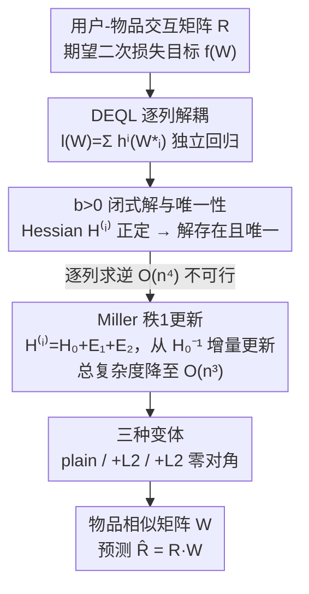

# Generalizing Linear Autoencoder Recommenders with Decoupled Expected Quadratic Loss

**会议**: ICLR 2026  
**arXiv**: [2603.07402](https://arxiv.org/abs/2603.07402)  
**代码**: [https://github.com/coderaBruce/DEQL](https://github.com/coderaBruce/DEQL)  
**领域**: 图像复原  
**关键词**: 线性自编码器, 推荐系统, 协同过滤, 期望二次损失, 闭式解  

## 一句话总结
将 EDLAE 推荐模型的目标函数推广为解耦期望二次损失（DEQL），在超参数 $b>0$ 的更广范围内推导出闭式解，并通过 Miller 矩阵逆定理将计算复杂度从 $O(n^4)$ 降至 $O(n^3)$，在多个基准数据集上超越 EDLAE 和深度学习模型。

## 研究背景与动机

**领域现状**：线性自编码器（LAE）推荐模型（如 EASE、EDLAE、ELSA）因其简洁性和闭式解的可复现性，在协同过滤任务中表现出与深度学习模型相当甚至更好的性能。它们通过学习物品-物品相似矩阵 $W \in \mathbb{R}^{n \times n}$ 来重建用户-物品交互矩阵 $R$。

**现有痛点**：EDLAE 通过引入 dropout 和强调权重矩阵 $A$（参数 $a$ 和 $b$），使训练过程更好地对齐测试场景。但原始 EDLAE 只为 $b=0$ 的特殊情况推导了闭式解，限制了模型的表达能力。

**核心矛盾**：$b>0$ 时可能存在更好的解空间，但由于 Hessian 矩阵 $H^{(i)}$ 随列索引 $i$ 变化，直接求逆的复杂度为 $O(n^4)$，计算不可行。

**本文目标**：(a) 推导 $b>0$ 情况下的闭式解；(b) 降低计算复杂度使其实用；(c) 验证扩展后的解空间能否发现更好的模型。

**切入角度**：将 EDLAE 目标函数重写为期望形式，将每列 $W_{*i}$ 的优化解耦为独立的期望二次损失问题，从而得到统一的闭式解框架。

**核心 idea**：通过将 EDLAE 推广为解耦期望二次损失 DEQL，统一推导 $b \geq 0$ 的所有闭式解，并用矩阵逆迭代定理将 $b>0$ 的计算降至 $O(n^3)$。

## 方法详解

### 整体框架
输入为用户-物品二值交互矩阵 $R \in \{0,1\}^{m \times n}$，输出为物品相似矩阵 $W \in \mathbb{R}^{n \times n}$，预测 $\hat{R} = RW$。训练目标是最小化一个带 dropout 和强调权重的期望二次损失：

$$f(W) = \mathbb{E}_\Delta[\|A \odot (R - (\Delta \odot R)W)\|_F^2]$$

其中 $\Delta$ 是 Bernoulli 随机矩阵（dropout），$A$ 是强调矩阵（被 dropout 掉的项权重为 $a$，未被 dropout 的权重为 $b$）。整篇方法围绕一个核心问题展开：EDLAE 只在 $b=0$ 时给出了闭式解，本文要把它推广到 $b\geq 0$ 的完整范围。为此先把这个期望目标重写成可逐列求解的形式（DEQL），再证明 $b>0$ 时解存在且唯一，最后用一个秩1更新技巧把原本不可行的 $O(n^4)$ 计算降到 $O(n^3)$，并叠加 $L_2$ 正则化与零对角约束三种变体。

### 关键设计

**1. 解耦期望二次损失（DEQL）：把整体目标按列拆成独立的回归问题**

直接对整个 $W$ 求解会被各列之间的耦合卡住。本文利用 Frobenius 范数可按列分解的性质，把目标写成 $l(W) = \sum_{i=1}^n h^i(W_{*i})$，其中每个 $h^i$ 只依赖第 $i$ 列 $W_{*i}$，且是一个标准的二次函数。这样每列就退化为一个独立的期望线性回归问题，闭式解直接是

$$W_{*i}^* = \mathbb{E}[X^TX]^{-1}\mathbb{E}[X^TY_{*i}]$$

解耦之后，每列的最优解可以单独分析，不再受其他列牵连。这个视角还顺带揭示了一个理论性质：当 $b=0$ 时解并不唯一（对角元素可取任意值），这正是后续讨论零对角约束的理论起点。

**2. $b>0$ 闭式解与唯一性定理：补上 EDLAE 缺失的那半个解空间**

原始 EDLAE 只在 $b=0$ 时给了解，把 $b>0$ 这片可能更优的区域留作空白。本文通过 Lemma 3.2 显式写出每列 Hessian $H^{(i)} = G^{(i)} \odot R^TR$ 和右端项 $v^{(i)}$ 的期望表达式，其中 $G^{(i)}$ 的元素是关于 $a, b, p$ 的多项式。关键结论是：当 $b>0$ 时 $G^{(i)}$ 正定，因而 $H^{(i)}$ 正定，闭式解存在且唯一。值得注意的是，即使取 $b>a$（超出 EDLAE 原本建议的 $a\geq b$ 范围）解依然成立，而实验中部分数据集恰好在 $b>a$ 时取得最佳效果——这说明 EDLAE 漏掉的解空间确实藏着更好的模型。

**3. Miller 矩阵逆迭代算法：让 $b>0$ 方案真正算得动**

$b>0$ 的麻烦在于 Hessian $H^{(i)}$ 随列索引 $i$ 变化，逐列求逆的总复杂度是 $O(n^4)$，对大规模推荐数据集完全不可行。本文把 $H^{(i)}$ 分解为 $H_0 + E_1^{(i)} + E_2^{(i)}$，其中 $H_0$ 与 $i$ 无关、只需求逆一次，而 $E_1^{(i)}$ 和 $E_2^{(i)}$ 各是一个秩1矩阵。借助 Miller 定理的秩1更新公式，从 $H_0^{-1}$ 出发增量更新，每个 $H^{(i)^{-1}}v^{(i)}$ 只需 $O(n)$ 的向量运算，全部 $n$ 列合起来把总复杂度从 $O(n^4)$ 压到 $O(n^3)$。这一步是整个方案能落地的关键——没有它，扩展解空间的理论结果只能停留在纸面上。

### 损失函数 / 训练策略
最终优化目标支持三种变体：
- **DEQL(plain)**：纯 DEQL，公式 (9)
- **DEQL(L2)**：$W^* = (H^{(i)} + \lambda I)^{-1}v^{(i)}$，将 $H_0$ 替换为 $H_0 + \lambda I$ 即可复用同一算法
- **DEQL(L2+zero-diag)**：在 L2 基础上增加零对角约束，通过公式 (17) 的投影实现

## 实验关键数据

### 主实验（强泛化设置 - LAE模型对比）

| 数据集 | 指标 | DEQL(L2) | EDLAE | EASE | 提升 |
|--------|------|----------|-------|------|------|
| Games | R@20 | **0.2891** | 0.2851 | 0.2733 | +1.4% |
| Beauty | R@20 | **0.1408** | 0.1324 | 0.1323 | +6.3% |
| Gowalla-1 | R@20 | **0.2298** | 0.2268 | 0.2230 | +1.3% |
| ML-20M | R@20 | **0.3940** | 0.3925 | 0.3905 | +0.4% |
| Netflix | R@20 | **0.3662** | 0.3656 | 0.3618 | +0.2% |
| MSD | R@20 | **0.3348** | 0.3336 | 0.3332 | +0.4% |

### 弱泛化设置（深度学习模型对比）

| 数据集 | 指标 | DEQL(L2) | SSM(最佳DL) | 提升 |
|--------|------|----------|-------------|------|
| Amazonbook | R@20 | **0.0629** | 0.0496 | +26.8% |
| Amazonbook | N@20 | **0.0362** | 0.0270 | +34.1% |
| Yelp2018 | R@20 | 0.0746 | **0.0765** | -2.5% |
| Gowalla | R@20 | 0.1824 | **0.1894** | -3.7% |

### 消融实验

| 配置 | Games R@20 | Beauty R@20 | 说明 |
|------|-----------|------------|------|
| DEQL(L2) | **0.2891** | **0.1408** | 完整模型，$b>0$ + L2 |
| DEQL(L2+zero-diag) | 0.2872 | 0.1388 | 增加零对角约束后略降 |
| DEQL(plain) | 0.2524 | 0.1093 | 无L2正则化，性能显著下降 |
| EDLAE ($b=0$) | 0.2851 | 0.1324 | 原始方法 |

### 关键发现
- $L_2$ 正则化对性能至关重要，DEQL(plain) 远不如 DEQL(L2)
- 零对角约束不一定有益，DEQL(L2) 经常优于 DEQL(L2+zero-diag)
- 在某些数据集上（如 Games），最优 $b/a$ 比值大于 1（即 $b>a$），超出了 EDLAE 原始建议的 $a \geq b$ 范围
- 在 Amazonbook 上对深度学习模型有 27-34% 的显著优势，但在 Yelp2018 和 Gowalla 上略逊于 SSM

## 亮点与洞察
- **Miller 矩阵逆迭代降复杂度**的技巧非常优雅：将矩阵逆中的列依赖项分解为两个秩1扰动，利用秩1更新公式逐列计算，把 $O(n^4)$ 降到 $O(n^3)$。这个思路可迁移到任何"矩阵逆随索引变化但变化量秩低"的场景。
- **解耦目标函数**的思路揭示了 $b=0$ 时解不唯一的理论性质（对角元素可任意），这为 Moon et al. (2023) 提出的"放松零对角约束"提供了理论解释。
- 简单线性模型在推荐系统中依然有很大潜力，关键在于正确设计训练目标使其对齐测试场景。

## 局限与展望
- 性能提升在大型数据集上较为有限（Netflix、MSD 提升 <0.5%），扩展解空间的收益递减
- $b>0$ 引入了额外超参数（$a, b, p, \lambda$ 四个），网格搜索成本较高
- 仅考虑隐式反馈（二值交互矩阵），未扩展到显式评分场景
- 在 Yelp2018 和 Gowalla 的弱泛化设置下不如 SSM 等深度模型，说明简单线性模型在图结构信息建模上的不足

## 相关工作与启发
- **vs EDLAE (Steck 2020)**: EDLAE 只解决了 $b=0$ 的特殊情况，本文将其推广到 $b \geq 0$ 的完整解空间。性能提升虽小但稳定。
- **vs EASE (Steck 2019)**: EASE 是 DEQL 在 dropout 率 $p=0$ 的特殊情况，不含强调权重机制。
- **vs LightGCN**: 深度图模型在密集交互数据上更有优势，但在稀疏数据（如 Amazonbook）上不如 DEQL。

## 评分
- 新颖性: ⭐⭐⭐ 技术推广自然但本质是对已有方法的超参数空间扩展
- 实验充分度: ⭐⭐⭐⭐ 9个数据集，多个基线，有统计显著性检验
- 写作质量: ⭐⭐⭐⭐ 数学推导清晰，但符号较重
- 价值: ⭐⭐⭐ 对 LAE 推荐模型有理论贡献，但实际性能提升有限

<!-- RELATED:START -->

## 相关论文

- [\[ICLR 2026\] LinearSR: Unlocking Linear Attention for Stable and Efficient Image Super-Resolution](linearsr_unlocking_linear_attention_for_stable_and_efficient_image_super-resolut.md)
- [\[ICML 2026\] Learning Normalized Energy Models for Linear Inverse Problems](../../ICML2026/image_restoration/learning_normalized_energy_models_for_linear_inverse_problems.md)
- [\[NeurIPS 2025\] Improving Diffusion-based Inverse Algorithms under Few-Step Constraint via Learnable Linear Extrapolation](../../NeurIPS2025/image_restoration/improving_diffusion-based_inverse_algorithms_under_few-step_constraint_via_learn.md)
- [\[ECCV 2024\] Learning Exhaustive Correlation for Spectral Super-Resolution: Where Spatial-Spectral Attention Meets Linear Dependence](../../ECCV2024/image_restoration/learning_exhaustive_correlation_for_spectral_super-resolution_where_spatial-spec.md)
- [\[ICLR 2026\] Energy-oriented Diffusion Bridge for Image Restoration with Foundational Diffusion Models](energy-oriented_diffusion_bridge_for_image_restoration_with_foundational_diffusi.md)

<!-- RELATED:END -->
