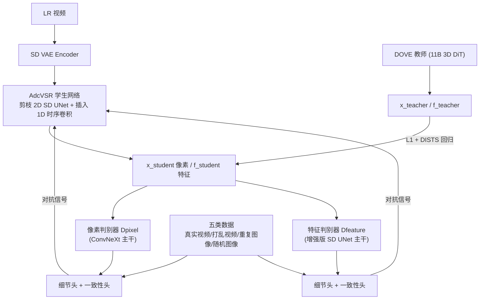

# Improved Adversarial Diffusion Compression for Real-World Video Super-Resolution

**会议**: ICLR 2026  
**OpenReview**: [https://openreview.net/forum?id=U2SJE6W3wT](https://openreview.net/forum?id=U2SJE6W3wT)  
**代码**: 待确认  
**领域**: 视频超分辨率 / 扩散模型压缩  
**关键词**: Real-VSR, 扩散模型压缩, 对抗蒸馏, 一步扩散, 时序一致性  

## 一句话总结
把 11B 的 3D DiT 视频超分教师 DOVE 压成一个 0.57B 的「2D+1D」学生网络 AdcVSR，靠双头双判别器的对抗蒸馏把「细节丰富」和「时序一致」两个互相冲突的目标解耦优化，参数砍 95%、提速 8×，画质几乎不掉。

## 研究背景与动机
**领域现状**：真实世界视频超分（Real-VSR）已从非生成式 / GAN 方法进化到扩散模型，能生成更逼真的纹理细节。一步扩散网络（SeedVR2、DOVE、DLoRAL）把多步采样压成单步，缓解了速度问题。

**现有痛点**：即便是一步网络也很重——参数普遍 ≥1.3B，生成一段 25 帧 512×512 视频要 ≥4 秒延迟。最近的对抗扩散压缩（ADC，即 AdcSR）能通过剪枝+蒸馏把扩散网络压成紧凑的 2D 学生网络，但它是为图像超分（Real-ISR）设计的，**直接搬到视频上会逐帧处理导致帧间闪烁**，因为它完全没有时序建模能力。

**核心矛盾**：Real-VSR 里「细节丰富」和「时序一致」是一对天然冲突的目标——合成精细纹理需要像素级的剧烈变化，而时序一致又要约束这些变化不能跨帧乱跳。强调感知质量的生成模型倾向于堆细节、于是闪烁；而做传播/对齐保一致性的方法又容易把细节抹平。标准的单信号对抗学习会偏向其中一个目标而牺牲另一个，在激进剪枝下尤其失效。

**本文目标**：设计一个真正适合 Real-VSR 的压缩方案，在大幅降低复杂度的同时同时守住细节和一致性。

**核心 idea**：作者提出两个关键假设——**(1) 一个 2D 扩散主干就足以合成细节**（因为 LR 视频本身已经提供了结构布局和时序连续性，3D 注意力的全局时空建模能力在超分里是冗余的）；**(2) 时序一致性只需几层轻量 1D 时序卷积就能维持**（约束帧间变化比从头合成细节简单得多）。再配上**把细节判别和一致性判别拆成两个头的对抗蒸馏**，从重型 3D DiT 教师身上学到本事。

## 方法详解

### 整体框架
AdcVSR 把 AdcSR 的剪枝版 2D SD2.1（UNet + VAE decoder）作为主干，在每个 2D 空间残差块/Transformer 块后插入 1D 时序残差块得到「2D+1D」学生网络；再用一套双头双判别器的对抗蒸馏，从大教师 DOVE 端到端蒸馏，同时拉入精心构造的五类视频/图像数据来分别监督细节和一致性。整个训练分两阶段：先纯回归蒸馏 200K 步打底，再加对抗学习微调 200K 步。

### 关键设计

**1. 「2D+1D」网络设计：用便宜的时序卷积替代昂贵的 3D 注意力**。作者的核心洞察是 3D 时空注意力的容量大量花在「从零推断全局时空结构」上，而这在 Real-VSR 里是浪费——LR 视频已经给了结构和时序连续性。于是他们直接复用 AdcSR 的剪枝 SD2.1 主干（UNet 通道剪 25%、VAE decoder 剪 50%），并在每个 UNet 块后插入一个 1D 时序残差块（一层 1D 时序卷积 + ReLU + 第二层卷积 + 跳连，卷积核 size=3、通道数与前置块对齐、零初始化）。这个「synthesize details by 2D, enforce consistency by 1D」的拆分让网络比 3D 教师 DOVE 轻得多，又避免了光流/运动引导那套复杂对齐模块。消融（Tab.2）显示：纯 2D 的 DISTS 0.2418、warping error 4.43；加上 1D 后 DISTS 降到 0.2112、warping error 砍到 1.67，只用 7% 参数就把 DISTS 与 3D 模型的差距缩到 0.0014。

**2. 双域端到端对抗蒸馏：从单点冻结升级为全网激活**。原始 ADC 只在 VAE decoder 单个特征域蒸馏、其余 decoder 块全冻结；本文同时在**像素域**和 **VAE decoder middle block 的特征域**两处蒸馏，并端到端微调整个网络。教师 DOVE 的输出像素 $x_{teacher}$ 被 SD2.1 VAE 重新编码、喂进 middle block 得到对齐特征 $f_{teacher}$ 作监督。但因为「2D+1D」学生比 3D 教师小太多、架构差异大，**纯靠 L1 回归无法精确拟合**会导致重建退化，所以作者保留回归打底、再叠加对抗损失「放松精确复制的要求」，让学生在自己容量内生成可行的高质量结果。生成器损失为：
$$L = \lambda_{pixel}L_{pixel} + \lambda_{feature}L_{feature}$$
$$L_{pixel} = \|x_{student}-x_{teacher}\|_1 + \text{DISTS}(x_{student},x_{teacher}) + \lambda_{adv}\text{Softplus}(-D_{pixel}(x_{student}))$$
$$L_{feature} = \|f_{student}-f_{teacher}\|_1 + \lambda_{adv}\text{Softplus}(-D_{feature}(f_{student}))$$
其中用 non-saturating 对抗损失，权重 $\lambda_{pixel}=0.1, \lambda_{feature}=1.0, \lambda_{adv}=1.0$。

**3. 双头判别器 + 五类标签数据：把「细节」和「一致性」彻底解耦监督**。这是解决核心矛盾的关键。每个判别器（像素域用冻结 ConvNeXt 主干、特征域用与学生同款的增强 SD UNet 主干，后接交替的 2D/1D 卷积）在尾部分叉成两个 1×1 卷积线性头——「细节头」（192 通道）和「一致性头」（64 通道），分别输出细节真实度和时序一致性的对抗信号。为了独立监督这两个属性，作者构造五类带头部专属标签的数据：① 学生输出 → 两头都标"假"；② 真实视频 → 一致性标"真"（细节留空不标）；③ 帧序打乱的视频 → 一致性标"假"；④ 重复单张细节丰富图像构成的静态伪视频 → 两头都标"真"；⑤ 随机采样无时序对应的图像序列 → 细节标"真"、一致性标"假"。判别器损失为：
$$L_{disc} = \sum_{(s,y_d,y_c)\in S}\big[\text{Softplus}(-y_d[D(s)]_d) + \text{Softplus}(-y_c[D(s)]_c)\big]$$
其中 $y_d,y_c\in\{-1,0,1\}$ 分别编码「假/未标注/真」。这样把传统单一二元信号重构成多属性形式，两个专属头持续提供独立梯度，**任一目标都不会被忽略或下调权重**，从而避免生成器塌缩到「过平滑（丢细节）」或「闪烁（丢一致性）」任一极端。

## 实验关键数据

### 主实验
在合成集 UDM10 与真实集 VideoLQ 上对比（H20 GPU，25 帧 512×512）：

| 指标 | DOVE(教师) | PiSA-SR | AdcSR | HYPIR | **AdcVSR(本文)** |
|---|---|---|---|---|---|
| UDM10 LPIPS↓ | 0.2645 | 0.3658 | 0.3781 | 0.3736 | **0.3065** |
| UDM10 MUSIQ↑ | 60.68 | 66.42 | 61.30 | 59.85 | 63.88 |
| UDM10 E*warp↓ | 2.22 | 6.96 | 6.19 | 10.68 | **1.67** |
| VideoLQ E*warp↓ | 8.41 | 12.65 | 12.47 | 23.45 | **6.74** |
| #参数(B)↓ | 10.55 | 1.30 | 0.46 | 1.55 | **0.57** |
| 推理时间(s)↓ | 4.42 | 2.94 | 0.52 | 2.81 | **0.55** |

AdcVSR 拿下**最低的 warping error**（时序一致性最佳），参数第二低、速度第二快；相比教师 DOVE 参数减 95%、提速 8×，画质仍极具竞争力。Real-ISR 方法（PiSA-SR/AdcSR/HYPIR）因无时序建模，warping error 最差。

### 消融实验

| 实验 | 配置 | 关键指标 |
|---|---|---|
| 网络设计 (UDM10) | 3D(剪枝DOVE) / 2D(AdcSR) / **2D+1D** | DISTS 0.2098 / 0.2418 / **0.2112**；E*warp 2.53 / 4.43 / **1.67**；参数 8.36B / 0.52B / **0.55B** |
| 判别器 (YouHQ40) | 单头双域 / 双头单域 / **双头双域** | CLIPIQA 0.6745 / 0.6421 / **0.6861**；E*warp 6.32 / 3.59 / **2.22** |
| 蒸馏设置 (MVSR4x) | 无对抗 / 无教师 / SeedVR2 / DLoRAL / **DOVE** | LPIPS 0.3596 / 0.3641 / 0.3489 / 0.3554 / **0.3337**；MUSIQ 54.33 / 50.32 / 60.74 / 54.61 / **61.48** |

### 关键发现
- **1D 卷积是性价比之王**：只加 0.03B 参数就把 warping error 从 4.43 砍到 1.67，验证了「一致性只需轻量时序卷积」的假设。
- **双头双域缺一不可**：单头变体一致性差、单域变体感知质量降，只有双头双域两个指标都最优。
- **Real-ISR 方法逐帧做超分的细节确实强**（MANIQA/CLIPIQA/MUSIQ 高），印证了「2D 主干足以合成细节」的假设(1)，本文正是在此基础上补时序卷积+双头蒸馏。

## 亮点与洞察
- **「分而治之」的方法论很优雅**：把超分拆成「2D 管细节、1D 管一致性、双头判别器分别监督」三条正交的线，每条都用最便宜的手段解决，整体却能逼近 11B 教师。
- **五类数据 + 头部专属标签**是个巧妙的弱监督设计：用「打乱帧序」造一致性负样本、用「重复单图」造完美一致正样本，不需要额外标注就把两个属性解耦。
- **跨架构蒸馏的现实主义**：作者清醒地认识到学生与教师架构差太大无法精确拟合，于是用对抗损失「放松复制要求」，而不是硬怼 L1，这是工程上很务实的选择。

## 局限与展望
- 教师 DOVE 本身仍是 11B 重模型，整套方案依赖一个强教师存在，**教师质量直接决定上限**（消融里换 SeedVR2/DLoRAL 当教师效果就弱了）。
- 关键假设建立在「LR 已提供大部分时空结构」上，对于退化极严重、时序信息几乎丢失的极端场景，1D 卷积能否扛住时序一致性存疑。
- PSNR/SSIM 这类保真度指标上 AdcVSR 并非最优（UDM10 PSNR 25.36 低于 DOVE 26.00），说明对抗蒸馏换来的感知质量是以一定保真度为代价的。
- 论文主体未深入分析两阶段训练对最终效果的贡献拆分，1D 卷积层数等设计选择的敏感性也留在附录。

## 相关工作与启发
- **上游基础**：直接站在 AdcSR（对抗扩散压缩 ADC for Real-ISR）和 DOVE（CogVideoX 微调的 3D DiT VSR 教师）肩膀上，本质是把 ADC 从图像扩展到视频。
- **一步扩散谱系**：与 SeedVR2（渐进蒸馏 64 步→1 步）、DLoRAL（双 LoRA 交替优化细节与一致性）、PiSA-SR（残差一步扩散）形成对比，本文走的是「先压架构再对抗蒸馏」的压缩路线。
- **启发**：双头判别器解耦冲突目标的思路可推广到任何「感知质量 vs 结构约束」对立的生成任务（如图像修复、风格迁移）；「轻量维度卷积补全主干缺失模态/维度」也是个通用的低成本扩展范式。

## 评分
- **新颖性**: ⭐⭐⭐⭐ 把 ADC 扩展到视频虽是增量，但「2D+1D」假设、双头双域判别器、五类标签数据三个设计组合得新颖且自洽，解耦冲突目标的视角有启发性。
- **实验充分度**: ⭐⭐⭐⭐ 覆盖 3 合成 + 3 真实数据集、10 个对比方法、三组消融（网络/判别器/蒸馏），效率与质量两条线都给足；但保真度指标偏弱、两阶段训练拆分分析放在附录。
- **写作质量**: ⭐⭐⭐⭐ 逻辑清晰，假设—设计—验证一一对应，Fig.1/Fig.2 把核心 idea 讲得很直观。
- **价值**: ⭐⭐⭐⭐ 0.57B / 0.55s 的实用级 Real-VSR 模型，参数减 95%、提速 8×，对工业落地（实时视频增强）有直接价值，且给出了扩散模型压缩的系统化配方。

<!-- RELATED:START -->

## 相关论文

- [\[CVPR 2025\] AdcSR: Adversarial Diffusion Compression for Real-World Image Super-Resolution](../../CVPR2025/image_restoration/adversarial_diffusion_compression_for_real-world_image_super-resolution.md)
- [\[ICLR 2026\] Learning Heterogeneous Degradation Representation for Real-World Super-Resolution](learning_heterogeneous_degradation_representation_for_real-world_super-resolutio.md)
- [\[ICLR 2026\] VARestorer: One-Step VAR Distillation for Real-World Image Super-Resolution](varestorer_one-step_var_distillation_for_real-world_image_super-resolution.md)
- [\[CVPR 2026\] One-Step Diffusion Transformer for Controllable Real-World Image Super-Resolution](../../CVPR2026/image_restoration/one-step_diffusion_transformer_for_controllable_real-world_image_super-resolutio.md)
- [\[CVPR 2026\] TextOVSR: Text-Guided Real-World Opera Video Super-Resolution](../../CVPR2026/image_restoration/textovsr_text-guided_real-world_opera_video_super-resolution.md)

<!-- RELATED:END -->
