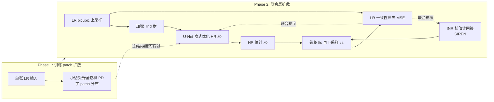

# KernelFusion: Zero-Shot Blind Super-Resolution via Patch Diffusion

**会议**: ICLR 2026  
**OpenReview**: [https://openreview.net/forum?id=wED9O48qmH](https://openreview.net/forum?id=wED9O48qmH)  
**代码**: 待确认  
**领域**: 图像恢复 / 盲超分辨率  
**关键词**: 盲超分辨率, SR-kernel 估计, 零样本扩散, patch diffusion, 内部学习, INR  

## 一句话总结
KernelFusion 只在单张 LR 图像上训练一个 patch-based 扩散模型，利用「跨尺度 patch 相似性最大化的核才是正确核」这一原理，在反向扩散过程中同时恢复任意（含非高斯）下采样核与对应 HR 图像，把盲超分推进到完全无训练分布假设的零样本范式。

## 研究背景与动机
- **领域现状**：超分（SR）的本质是反演退化 $I_{LR}=(I_{HR}*k_s)\downarrow_s$。传统 SR 假设核 $k_s$ 已知（如 bicubic），盲超分（Blind-SR）则试图去掉这一假设，用合成退化训练、隐式潜码表示核、或设计对核鲁棒的网络。
- **现有痛点**：所有外部训练的盲超分方法都被训练分布锁死——它们只能处理简单的低通核（各向同/异性高斯、运动模糊线），一旦遇到分布外的复杂核就崩溃，PSNR 甚至**低于简单 bicubic 插值**（论文实测在非高斯数据集上 DPSR/DCLS 都输给 bicubic）。
- **核心矛盾**：已有研究（Levin 2009, Efrat 2013）指出**核的准确性往往比 SR 算法本身或图像先验更关键**，但主流方法把精力放在更强的 SR 网络上，却用错了核；而纯核估计方法（KernelGAN、Michaeli & Irani）又只估核不做 SR，需要外接独立 SR 算法，导致两步误差累积、核与 HR 不一致。
- **本文目标**：从单张 LR 图像出发，**同时**恢复任意（不受核形状假设约束的）image-specific 下采样核与对应 HR 图像，证明"无限制核估计"的可行性。
- **核心 idea**：**【零样本内部学习】** 在单张 LR 上训练 patch 扩散模型捕捉其内部 patch 统计，因此不存在"分布外核"概念；**【跨尺度 patch 一致性】** 正确核应让 HR 下采样回 LR 时保持与 LR 相同的跨尺度 patch 分布，把这条原理嵌进反向扩散，让核与 HR 互相促进、联合估计。

## 方法详解

### 整体框架
KernelFusion 分两阶段：Phase 1 在单张 LR 图上训练一个**感受野极小（15×15）的全卷积 patch 扩散模型 PD**，学到该图独有的小 patch 分布；Phase 2 冻结 PD，从 bicubic 上采样结果出发做反向扩散，用一个 U-Net 隐式优化 HR 估计 $\hat{x}_0$、用一个 INR 网络隐式表示核 $\hat{k}_s$，二者在同一条 LR 一致性损失下联合训练——只要 $(\hat{x}_0 * \hat{k}_s)\downarrow_s$ 能还原出输入 LR，核与 HR 就同时被找对。

### 关键设计

**1. 小感受野 patch 扩散：把单图变成上千 patch 的分布学习器。** 直接在单张图上学分布会过拟合全局结构，KernelFusion 借鉴单图扩散的纯 CNN 思路并把感受野压到极致——用一个无 stride 的简单卷积网络（一个双 3×3 块 + 五个 3×3+1×1 块），理论感受野仅 $15\times15$（实际更小）。这样每个随机 $64\times64$ 的图像 crop 就等价于一批成千上万个小 patch，模型学的是这些小 patch 的分布而非整图。扩散采用 DDPM 框架并预测速度 $v$（受 Salimans & Ho 启发以提升少步采样稳定性）：训练目标 $\Psi=\arg\min_\psi \lVert PD_\psi(x_t)-v_t\rVert_2^2$，其中 $x_t=\sqrt{\bar\alpha_t}x_0+\sqrt{1-\bar\alpha_t}\epsilon$、$v_t=\sqrt{\bar\alpha_t}\epsilon-\sqrt{1-\bar\alpha_t}x_0$，$x_0=I_{LR}$，由 $v$ 可闭式还原干净图像。

**2. INR 表示核：摆脱 CNN/MLP 的平滑偏置，恢复非光滑复杂核。** 论文观察到 KernelGAN、IKR 等显式核估计方法只能恢复高斯和运动线核，根因是 CNN/MLP 架构的隐式偏置倾向输出平滑结果。KernelFusion 不直接对 $k_s$ 的离散权重求解，而是用一个 **SIREN 风格的隐式神经表示（INR）** 连续地表示核——正弦激活天生能拟合高频函数，从而捕捉 L 形、空心方块、实心方块这类非自然、非光滑的复杂核结构，同时通过网络本身控制正则化强度，避免过平滑。

**3. U-Net 隐式优化 HR + 双次施加保全局结构。** PD 感受野只有 $15\times15$，单靠它预测 $\hat{x}_0$ 在高噪声步会丢失全局结构。KernelFusion 不直接优化 $\hat{x}_0$，而是借鉴 DIP 用一个 U-Net 隐式生成它，给输出施加全局图像先验。U-Net 在每个时间步被**施加两次**：先对上一步 $t+1$ 的 $x_0$ 应用 U-Net 重建出当前所需 $x_t$，再在用 PD 去噪 $x_t$ 后对预测的 $x_0$ 应用 U-Net。由于 U-Net 与 INR 均从零训练，每个时间步 $t$ 做 $n_{iter}$ 步梯度更新，随反扩散逐步精修。

**4. LR 一致性损失：把核与 HR 锁在同一约束下联合求解。** Phase 2 的唯一监督是像素级 LR 一致性，$L_{cons}=\mathrm{MSE}\big(I_{LR},\,(\hat{x}_0*\hat{k}_s)\downarrow_s\big)$。它强制估计的 HR 用估计的核下采样后必须重现输入 LR，从而**阻止扩散生成 LR 不支持的幻觉结构**，并让"更好的 HR → 更准的核 → 反过来更好的 HR"形成正反馈，使核与图像在一个损失下一致地联合恢复，避免了两步法的误差累积。

## 实验关键数据

### 主实验表格（4× SR，PSNR↑/SSIM↑）

| 方法 | Blind144 | DIV2KRK(高斯) | DIV2KFK(非高斯) |
|---|---|---|---|
| Bicubic | 24.865 / 0.637 | 25.075 / 0.671 | 24.101 / 0.639 |
| SwinIR | 23.773 / 0.616 | 25.139 / 0.699 | 23.070 / 0.620 |
| DPSR | 24.824 / 0.637 | 25.317 / 0.682 | 23.977 / 0.637 |
| DCLS-SR | 24.808 / 0.633 | 27.150 / 0.748 | 23.886 / 0.634 |
| DRAT | 24.747 / 0.631 | **27.953** / 0.779 | 23.824 / 0.631 |
| RealDAN | 24.624 / 0.638 | 26.870 / 0.745 | 23.941 / 0.644 |
| KernelGAN+ZSSR | 24.529 / 0.633 | 25.895 / 0.703 | 23.617 / 0.629 |
| **KernelFusion (ours)** | **27.191 / 0.719** | 26.761 / 0.715 | **26.426 / 0.720** |

- 在两个非高斯（分布外）数据集 Blind144、DIV2KFK 上 KernelFusion 大幅领先（比次优高约 +2.4dB），而几乎所有 SotA 盲超分在这两个集上都**输给 bicubic**。
- 在高斯 DIV2KRK 上（竞品的专长领域）KernelFusion 仍保持可比（26.761），不靠专门训练也不掉队。

### 消融实验表格（Blind144, PSNR↑）

| 配置 | PSNR |
|---|---|
| DIP（U-Net 吃纯噪声 + INR + 一致性损失） | 23.663 |
| UNet only | 25.804 |
| PD + UNet | 25.481 |
| **KernelFusion（完整）** | **27.191** |

- 纯 DIP 即可借助强大的 INR 做一定的 patch 分布调整，但远不够；
- U-Net 提供全局先验、PD 提供 patch 分布约束，完整组合（PD + UNet + INR + 双次施加 + 一致性损失）带来最大增益。

### 关键发现
- **核准>算法强**：用 GT 核做精细插值（backprojection + 核伪逆）能在非高斯数据上比 SotA 盲超分再高约 +1dB，量化印证"核准确性比 SR 算法更关键"。
- **核可视化**：相比 KernelGAN（强高斯偏置）、IKR（偏运动线）、MLMC/DKP（仍偏离 GT），KernelFusion 能准确恢复 L 形、空/实心方块等极端非自然核。
- **真实世界**：在 DSLR 抖动照、老旧历史照等真实退化图上，能清晰恢复出竞品读不出的文字（如历史照中的 "OPPOSES"）。

## 亮点与洞察
- **首个能恢复任意下采样核的深度盲超分方法**，把"分布外核"这个概念从问题中彻底消除——因为只在输入图自身上训练，本就没有"分布"。
- **联合估计而非两步法**：核与 HR 在同一条一致性损失下互相促进，规避了经典"先估核再超分"的误差累积与不一致。
- **INR 是恢复复杂核的关键钥匙**：把核估计从"离散权重 + CNN 平滑偏置"换成"SIREN 连续表示"，直击非高斯核恢复失败的根因。
- 把"跨尺度 patch 相似性"这一经典 Michaeli & Irani 原理，用现代扩散 + INR 重新激活并工程化。

## 局限与展望
- 作者明确表示目标**不是交付生产级盲超分系统**，而是论证"单图无限制核估计 + 同时恢复 HR"的可行性。
- **零样本逐图训练开销大**：每张图都要训 PD 再做联合反扩散迭代，推理成本远高于前馈方法，难以实时/批量。
- 仍假设核是**全局**的（image-wide 单一核），未覆盖空间变化（spatially-varying）退化、噪声/压缩等复合退化。
- PD 感受野极小有利于学 patch 分布，但全局结构完全依赖 U-Net 先验，对结构高度复杂的场景可能受限。

## 相关工作与启发
- **跨尺度 patch 原理**：Michaeli & Irani (2013) 首次提出"正确核最大化跨尺度 patch 相似性"，KernelGAN (Bell-Kligler 2019) 用单图 GAN 实现；KernelFusion 用扩散把这条原理升级为同时出 HR 的端到端方案。
- **深度内部学习 / 单图扩散**：ZSSR、DIP、SinGAN、以及单图扩散 Nikankin et al. (2023) 为"只在一张图上训练"提供范式，本文继承并把感受野压到 patch 级。
- **扩散解逆问题**：DDRM、DPS、BlindDPS 等用预训练扩散先验解超分/去模糊，但 BlindDPS 依赖大规模合成模糊数据集预训练，KernelFusion 则完全零样本，不需任何外部核/图像先验。
- **启发**：当任务的瓶颈在"退化算子估计"而非"生成先验"时，逐样本内部学习 + 连续表示（INR）可能比堆大模型更对症；一致性损失下的"算子与信号联合估计"是规避两步误差的通用思路，可迁移到去模糊、去噪、相机 ISP 反演等盲逆问题。

## 评分
- **新颖性**: ⭐⭐⭐⭐⭐ 首个能恢复任意（非高斯）核的零样本深度盲超分，范式层面打破训练分布假设，INR+扩散联合估计设计巧妙。
- **实验充分度**: ⭐⭐⭐⭐ 三数据集 + 自建 Blind144/DIV2KFK 受控基准 + 大量竞品 + 核可视化 + 真实世界图 + 消融完整；但缺运行时/复杂度对比与失败案例分析。
- **写作质量**: ⭐⭐⭐⭐ 动机递进清晰（核准>算法强→分布外崩溃→零样本破局），图表到位；方法部分两阶段+多组件略密集。
- **价值**: ⭐⭐⭐⭐ 证明无限制核估计可行，为盲逆问题提供新思路；但逐图训练开销与"非生产级"定位限制了直接落地。

<!-- RELATED:START -->

## 相关论文

- [\[CVPR 2026\] MR. Illuminate: Zero-Shot Low-Light Image Enhancement with Diffusion Prior](../../CVPR2026/image_restoration/mr_illuminate_zero-shot_low-light_image_enhancement_with_diffusion_prior.md)
- [\[ICLR 2026\] Trust but Verify: Adaptive Conditioning for Reference-Based Diffusion Super-Resolution](trust_but_verify_adaptive_conditioning_for_reference-based_diffusion_super-resol.md)
- [\[CVPR 2026\] Zero-Shot Image Denoising via Hybrid Prior-Guided Pseudo Sample Generation](../../CVPR2026/image_restoration/zero-shot_image_denoising_via_hybrid_prior-guided_pseudo_sample_generation.md)
- [\[CVPR 2026\] Self-supervised Dynamic Heterogeneous Degradation Modeling for Unified Zero-Shot Image Restoration](../../CVPR2026/image_restoration/self-supervised_dynamic_heterogeneous_degradation_modeling_for_unified_zero-shot.md)
- [\[ICLR 2026\] Improved Adversarial Diffusion Compression for Real-World Video Super-Resolution](improved_adversarial_diffusion_compression_for_real-world_video_super-resolution.md)

<!-- RELATED:END -->
