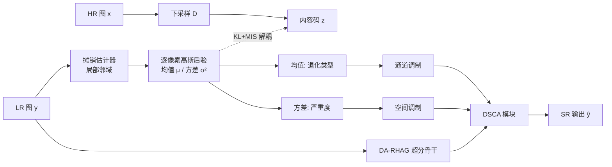

# Learning Heterogeneous Degradation Representation for Real-World Super-Resolution

**会议**: ICLR 2026  
**OpenReview**: [https://openreview.net/forum?id=IOmPy7P1y4](https://openreview.net/forum?id=IOmPy7P1y4)  
**代码**: 待确认  
**领域**: 图像恢复 / 真实世界超分辨率  
**关键词**: 真实世界超分、退化表示、变分推断、互信息抑制、空间异质退化  

## 一句话总结
本文提出 SAVL（空间摊销变分学习），把每个像素的退化建模成从局部邻域推断出的「空间变化高斯分布」，并用互信息抑制项把退化从图像内容里剥离开，得到既能刻画空间异质退化、又高度判别退化因子的隐式表示，再用后验的「均值（通道调制）+ 方差（空间调制）」双路引导超分网络重建。

## 研究背景与动机
**领域现状**：真实世界超分（RWSR）要从复杂拍摄条件下的低分辨率图恢复高分辨率图，而真实退化既因设备/ISO/ISP 而异（图间异质），又因景深/纹理复杂度在一张图内部空间变化（图内异质）。为应对未知退化，主流做法是学一个退化表示来引导上采样，分两派：显式估计（预测模糊核、噪声水平等参数）受限于预定义退化空间、难泛化；隐式退化表示（IDR，用对比学习/知识蒸馏/元学习获得）容量大、可泛化。

**现有痛点**：现有 IDR 有两个硬伤——(1) **不建模空间变化退化**，默认一张图退化均匀，与真实情况相悖；(2) **退化与内容解耦不足**，IDR 的隐空间无约束、表达力过强，容易把整张 LR 信号（含外观、语义等退化无关内容）一并编码进去，导致表示对退化"不判别"，反而误导超分。论文用 MINE 量化后发现：显式表示与内容相关性低但退化建模也弱；现有隐式表示则与内容、退化双双高相关（严重纠缠）。

**核心矛盾**：想建模空间变化退化就需要更复杂的逐像素隐空间，而隐空间越复杂越容易泄漏内容——"空间异质建模"与"退化-内容解耦"天然冲突；而且空间变化假设直接推翻了对比学习"同图不同 patch 退化相同→正样本对"的前提，使旧范式失效。

**本文目标**：在单次前向、可承受计算量下，学到一个既空间分辨、又与内容解耦、对退化高度判别的隐式退化表示，并把它有效注入超分网络。

**核心 idea**：**[变分建模]** 把逐像素退化当作从局部邻域摊销推断出的空间变化高斯后验（均值=退化类型，方差=退化严重度/不确定性）；**[信息论解耦]** 在条件 ELBO 上加互信息抑制项主动过滤退化无关内容；**[双路引导]** 用后验均值做通道调制、方差做空间调制驱动超分。

## 方法详解

### 整体框架
SAVL 用同一套摊销网络（局部感受野受限、参数跨像素/跨图共享）单次推断每个像素的退化高斯后验，框架含两条"车道"再合并：SAVL-LM 学一个空间分解的条件似然（条件 ELBO），SAVL-MIS 用 VIB + Barber–Agakov 上下界把退化 $r$ 与内容码 $z$ 的互信息 $I(r;z)$ 压低。两条车道共享估计器后塌缩成一个仅含「重建项 + KL 项」的两项损失。学到的后验直接注入退化感知超分网络（DA-RHAG/DSCA）做重建；SAVL 与超分先联合训练，收敛后冻结摊销估计器再继续微调超分。

### 关键设计

**1. 空间摊销的高斯后验建模：把退化变成逐像素可推断的分布** 论文不再给整图一个退化向量，而是把退化场 $r(\cdot)=\{r(u)\}_{u\in\Omega}$ 的每个像素建成一个均值场高斯后验，且只看该像素的局部邻域证据 $y(N_s(u))$ 推断。具体地，采用均值场高斯后验 $q_\psi(r\mid y)=\prod_u \mathcal{N}(r(u);\mu_\psi(u),\mathrm{diag}\,\sigma^2_\psi(u))$ 配空间白高斯先验 $p(r)=\prod_u\mathcal{N}(r(u);0,I)$，其中 $\mu_\psi(u),\log\sigma^2_\psi(u)=g_\psi(y(N_s(u)))$，重参数化 $r(u)=\mu_\psi(u)+\sigma_\psi(u)\odot\varepsilon(u)$。这样设计有两层好处：高斯后验天然刻画退化的空间非均匀性，而"参数跨像素共享、感受野受限"的摊销推断把昂贵的逐像素优化换成一次前向映射——这恰好契合真实退化（光学、传感器噪声、压缩）局部作用、平滑变化的物理特性，既降方差又省参数。后验的均值刻画退化类型、方差量化严重度，使表示可解释。

**2. SAVL-MIS：用互信息上界主动抑制退化-内容纠缠** 解耦是核心难点。论文从带约束的目标出发：$\max \mathbb{E}_{p_{\text{data}}}[\log p_\Theta(y\mid z)]\ \text{s.t.}\ I(r;z)\le\kappa$，用拉格朗日乘子写成惩罚式 $\mathcal{L}=\mathbb{E}[\log p_\Theta(y\mid z)]-\lambda I(r;z)$。直接算 $I(r;z)$ 不可解，于是借恒等式 $I(r;z)=I(r;y)+I(z;y)-I(y;z,r)+C$，对 $I(r;y)$ 用 VIB 式上界、对 $I(y;z,r)$ 用 Barber–Agakov 下界，得到可处理的 MIS 惩罚。这一招的妙处在于"估计器共享"：把似然项当作 critic（$\vartheta\equiv\theta$）、复用摊销后验（$\phi\equiv\psi$）、采用同一白先验后，整个目标优雅地塌缩成

$$J_{\text{SAVL}}(\theta,\psi)=-\mathbb{E}_{q_\psi}[\log p_\theta(y\mid z,r)]+(1+\lambda)\,D_{\text{KL}}(q_\psi(r\mid y)\,\|\,p(r))$$

即"重建项 + 加权 KL"两项，无需额外判别网络。实践中条件似然取高斯/拉普拉斯使重建项退化为 L2/L1 损失，最终训练目标为 $\min_{\theta,\psi}\alpha L_{\text{rec}}+\beta D_{\text{KL}}$。正是这个白先验 + KL/MIS 的组合让表示"良好约束、对退化判别"，避免逐像素隐空间泄漏内容。

**3. DSCA：用后验的均值+方差双路调制超分网络** 既然后验天然给出"均值=退化类型、方差=严重度"两个分量，论文设计 Degradation-Guided Spatial–Channel Attention（DSCA）做双重调制注入超分骨干。空间维度上，把退化严重度（由方差归一化得到 $s(u)=1-(\sigma^2_\psi(u)-\mu_{\sigma^2})/\mathrm{Var}[\sigma^2]$）用来重加权 SW-MSA 的注意力分数，促使退化相似的像素之间互相注意；通道维度上，用一个轻量卷积网络从后验均值预测逐通道调制向量，按推断出的退化类型调整特征激活。DSCA 被插在每个 DA-RHAG（退化感知残差混合注意力组）的 HAB/OCAB 之前作为首阶段，让退化信息在重建早期就介入。

## 实验关键数据

### 主实验表格（合成 + 真实 SR 基准，×4）

| 方法 | Params(M) | RealSR PSNR↑ | DRealSR PSNR↑ | DRealSR SSIM↑ | SVSR PSNR↑ |
|------|-----------|--------------|---------------|---------------|------------|
| RealESRGAN | 16.7 | 24.22 | 26.95 | 0.7812 | 24.36 |
| HAT-GAN | 20.8 | 25.17 | 27.76 | 0.7926 | 25.05 |
| StableSR(扩散) | 919 | 24.60 | 27.39 | 0.7830 | 24.49 |
| KDSR | 18.8 | 25.57 | 27.02 | 0.7787 | 25.09 |
| CDFormer | 25.0 | 25.43 | 27.11 | 0.7792 | 25.07 |
| LightBSR | 3.1 | 24.98 | 27.69 | 0.7893 | 24.93 |
| **Ours** | **14.0** | **25.80** | **28.27** | **0.8139** | **25.13** |

退化越复杂增益越大：RealSR 较 KDSR +0.23dB，高复杂度 DRealSR 较 LightBSR +0.58dB；对扩散方法在保真度上更优（DRealSR SSIM 0.8139 vs StableSR 0.7830），且避免生成式先验的幻觉/语义伪影。

### 消融实验表格

| 配置 | Scene-ID Acc↓ | Noise-Level Acc↑ | MINE(内容)↓ | RealSR PSNR↑ |
|------|---------------|------------------|-------------|--------------|
| **Ours(全模型)** | **49.97** | **94.80** | **0.1507** | **25.80** |
| Ours w/o SAVL（确定性码） | 94.04 | 81.48 | 1.0254 | — |
| Ours w/o SAVL + CLUB | 36.44 | 20.00 | 0.2700 | — |
| Ours w/o Channel Modulation | — | — | — | 25.13 |
| Ours w/o Spatial Modulation | — | — | — | 25.69 |

去掉 SAVL 退回确定性码后内容可分性飙升（Scene-ID 94%）、退化判别下降；换成 CLUB 上界则两者一起塌缩（噪声水平 20% = 随机）。通道调制比空间调制贡献更大（去掉掉 0.67dB vs 0.11dB）。

### 关键发现
- **解耦真有效**：SAVL 在保持 94.80% 退化判别的同时把内容判别压到接近随机的 49.97%，内容 MINE 比 CDFormer 低一个数量级（0.1507 vs 1.2209）。
- **空间敏感可解释**：严重度热图能反映跨设备（iPhone 退化强、热图更集中，与 NIQE 一致）与图内（随景深/纹理变化）的退化异质。
- **t-SNE 上**全模型对 ISO/焦距/传感器/纹理形成清晰簇，基线则塌成重叠嵌入。

## 亮点与洞察
- 把"空间异质退化建模"与"退化-内容解耦"这对天然矛盾，统一进一个变分框架，并通过"估计器共享"让带 MIS 的目标优雅塌缩成"重建 + KL"两项，工程上几乎零额外开销。
- 后验的均值/方差被赋予明确语义（类型/严重度），并直接转化为通道/空间双路调制，表示学习与下游使用之间衔接得非常自然。
- 用 HSIC + MINE + 线性探针三种独立工具量化"判别退化 vs 抑制内容"，论证扎实而非只看 PSNR。

## 局限与展望
- 训练用 Real-ESRGAN 合成退化管线监督，真实退化与合成管线仍有 gap，对完全 OOD 退化的泛化未充分检验。
- 高斯均值场后验 + 局部条件独立假设较强，难以刻画长程相关或非高斯的复杂退化结构。
- 采用两阶段（先联合训 200K，再冻结估计器微调超分 800K+600K）训练成本不低（8×RTX3090），且 DSCA 注意力重加权带来一定推理开销。
- 仅在 ×4 SISR 上验证，更高倍率、视频或与扩散先验结合的方向值得探索。

## 相关工作与启发
本文承接隐式退化表示（IDR）一脉：从对比学习（DASR/MoESR）、知识蒸馏（KDSR/LightBSR）、到概率/扩散建模（CDFormer），并直面其"退化-内容纠缠"与"空间均匀假设"两个共性短板。与显式退化估计（DASR、空间变化核估计）相比，它保留隐式表示的泛化力却补上了约束性。方法论上把 VIB、Barber–Agakov、摊销变分推断这些信息论/贝叶斯工具迁移到退化表示学习，启发是：当隐表示容易"学过头"时，与其堆更强的网络，不如用信息论约束主动"做减法"剥离无关信号；超分骨干则建在 HAT 的 HAB/OCAB 之上，体现退化先验与强注意力骨干的解耦组合。

## 评分
- **新颖性**: ⭐⭐⭐⭐ 把空间变化高斯后验 + 互信息抑制统一进退化表示学习，并让目标优雅塌缩成两项，视角和构造都新颖。
- **实验充分度**: ⭐⭐⭐⭐ 覆盖合成+多真实基准、HSIC/MINE/线性探针多工具量化解耦、含多组消融，较完整；但真实退化 OOD、跨倍率验证略缺。
- **写作质量**: ⭐⭐⭐⭐ 动机—矛盾—方法推导链条清晰，图示（散点/严重度热图/t-SNE）有力，公式推导规范。
- **价值**: ⭐⭐⭐⭐ 在保真度上稳超 SOTA 且避免生成式幻觉，退化表示解耦的思路对盲超分/恢复任务有较强借鉴意义。

<!-- RELATED:START -->

## 相关论文

- [\[ICLR 2026\] Improved Adversarial Diffusion Compression for Real-World Video Super-Resolution](improved_adversarial_diffusion_compression_for_real-world_video_super-resolution.md)
- [\[ICLR 2026\] VARestorer: One-Step VAR Distillation for Real-World Image Super-Resolution](varestorer_one-step_var_distillation_for_real-world_image_super-resolution.md)
- [\[ICLR 2026\] Breaking Scale Anchoring: Frequency Representation Learning for Accurate High-Resolution Inference from Low-Resolution Training](breaking_scale_anchoring_frequency_representation_learning_for_accurate_high-res.md)
- [\[CVPR 2026\] Time-Aware One Step Diffusion Network for Real-World Image Super-Resolution](../../CVPR2026/image_restoration/time-aware_one_step_diffusion_network_for_real-world_image_super-resolution.md)
- [\[CVPR 2026\] TextOVSR: Text-Guided Real-World Opera Video Super-Resolution](../../CVPR2026/image_restoration/textovsr_text-guided_real-world_opera_video_super-resolution.md)

<!-- RELATED:END -->
