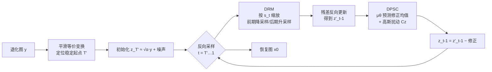

# LearnIR: Learnable Posterior Sampling for Real-World Image Restoration

**会议**: ICLR 2026  
**OpenReview**: [https://openreview.net/forum?id=aAb26aqU1E](https://openreview.net/forum?id=aAb26aqU1E)  
**代码**: [github.com/gityihang/LearnIR](https://github.com/gityihang/LearnIR)  
**领域**: 图像恢复 / 扩散模型 / 后验采样  
**关键词**: 真实世界图像恢复, 扩散后验采样, 残差扩散, 去雾, 去阴影, 动态分辨率  

## 一句话总结
LearnIR 用一个轻量网络直接学习扩散后验采样里的"梯度修正项分布"，从而摆脱传统 DPS 必须已知前向退化算子 $A$ 的限制，再配合无需 VAE 的动态分辨率模块（DRM），在去雾、去阴影等真实退化任务上做到端到端、高保真的图像恢复。

## 研究背景与动机

**领域现状**：把图像恢复建模成"以退化图为条件的生成"是当前主流，扩散模型凭借强大的分布变换能力在这条路上表现突出。围绕扩散做恢复大致有三类玩法：条件生成、扩散反演（inversion）、以及后验采样（posterior sampling）。

**现有痛点**：三类方法各有死穴。① 条件生成始终卡在"忠实还原 vs. 合理生成"的权衡上，调不到两全；② 反演式方法把退化图压回隐空间时会累积误差，输出明显偏离输入，而且要反复加噪去噪、效率低；③ 后验采样（如 DPS）理论上能把生成先验和数据一致性约束结合起来解病态逆问题，但它要求一个**精确已知的前向测量算子 $A$**（如随机掩码），并在推理时显式复用——而真实世界的雾、阴影、噪声、模糊往往交织在一起，根本写不出这样的 $A$。

**核心矛盾**：后验采样在数学上最优雅、最能保证数据一致性，却被"必须知道 $A$"这个前提锁死在合成、单一退化的玩具场景里，无法落地到真实多退化图像。

**本文目标**：构造一个**不依赖已知前向算子**的扩散后验采样框架，让后验采样的数据一致性优势能用在真实世界的去雾、去阴影任务上，同时简化管线、去掉笨重的预训练 VAE。

**核心 idea**：**[可学习的后验修正]** 利用高斯分布的封闭性（closure property），LearnIR 证明 DPS 的梯度修正项本质上等价于"前向后验分布与反向预测分布之差"，而这个差又服从一个高斯。于是直接训练一个轻量网络去预测这个高斯的均值，用学到的修正去替代必须靠 $A$ 才能算的解析梯度——这就是 **DPSC（Diffusion Posterior Sampling Correction）**；再叠加 **DRM** 做粗到细的多分辨率采样替代 VAE。

## 方法详解

### 整体框架

LearnIR 建立在残差扩散（ResFusion / RDDM）之上：先用"平滑等价变换"找到一个稳定的截断起点 $T'$（在该步状态近似只依赖退化图 $y$，与未知的干净图 $x_0$ 解耦），从而跳过反演式方法那些不稳定的中间态。在此基础上挂两个互补模块——DRM 把图像投影到一个随时间变化分辨率的隐空间，前期低分辨率抓全局结构、后期原分辨率补高频细节；DPSC 则作为即插即用的正则，在每一步采样里用学到的修正项把扩散轨迹拉回真实后验。整体是一个像素空间、无 VAE 的端到端恢复管线。

### 关键设计

**1. 残差扩散 + 平滑等价起点：把不稳定中间态绕开。** LearnIR 不从纯噪声出发，而是沿用 ResFusion 的残差思路，把退化图与干净图的残差 $R = y - x_0$ 注入前向过程：$x_t = (2\sqrt{\bar\alpha_t}-1)x_0 + (1-\sqrt{\bar\alpha_t})\,y + \sqrt{1-\bar\alpha_t}\,\epsilon$。关键观察是当系数 $(2\sqrt{\bar\alpha_t}-1)\to 0$ 时对未知 $x_0$ 的依赖消失，于是通过 $T' = \arg\min_i (\sqrt{\bar\alpha_i}-\tfrac12)^2$ 找到一个稳定时间步 $T'$，此时 $x_{T'}\approx\sqrt{\bar\alpha_{T'}}\,y + \sqrt{1-\bar\alpha_{T'}}\,\epsilon$ 几乎只由退化图决定。这样反向采样直接从 $T'$ 启动、用更少步数、还避开了反演方法在中间态累积误差的老问题，模型训练目标改为预测"残差偏移噪声" $\epsilon^{res}$。

**2. DRM 动态分辨率：用免训练插值替代 VAE 做粗到细生成。** 借鉴多尺度生成（MDM、PixelFlow），DRM 定义一个随时间变化的下采样算子 $D(\cdot, s(t))$，把干净图和退化图都映射到当前尺度的隐变量 $z_0^{(t)} = D(x_0, s(t))$、$z_y^{(t)} = D(y, s(t))$，并把残差扩散整体搬进这个变分辨率隐空间：$q(z_t \mid z_0^{(t)}) = \mathcal{N}\big(\sqrt{\bar\alpha_t}\,z_0^{(t)} + (1-\sqrt{\bar\alpha_t})R_z,\ (1-\bar\alpha_t)I\big)$。调度上，前期高噪阶段（$t\ge T/2$）用大幅降采样 $s_{down}$ 专注全局结构、抑制纹理不一致伪影，后期（$t<T/2$）切回原生分辨率 $s_{up}$ 精修高频细节。由于缩放只用免训练插值实现，LearnIR 既拿到了多尺度的好处，又彻底省掉了预训练 VAE 的算力与对齐麻烦，管线随之大幅简化。

**3. DPSC 可学习后验修正：把"必须知道 $A$"的梯度变成可预测的高斯均值。** 这是全文最核心的设计。标准去噪损失只保证每步噪声估计准，却不保证学到的反向后验 $p_\theta(z_{t-1}\mid z_t)$ 匹配真实前向后验 $q(z_{t-1}\mid z_t, z_0^{(t)})$，这种"不一致"会跨步累积成色偏等伪影。作者通过 **Theorem 1** 证明：DPS 的引导梯度其实正比于前向态与反向预测态之差，$\nabla_{z_t}\log p(z_y^{(t)}\mid z_t) \propto z_{t-1}^{pred} - z_{t-1}^{forward}$。再利用高斯封闭性，这个差本身服从高斯 $z_{t-1}^{pred} - z_{t-1}^{forward} \sim \mathcal{N}\big(\mu(z_t, z_y^{(t)}, t),\ \sigma^2 I\big)$。于是不再需要解析算子 $A$，只要训练一个修正网络 $\hat\mu_\theta$ 去回归解析均值 $\mu$，用一致性损失 $L_{consistency} = \mathbb{E}\,\|\mu - \hat\mu_\theta\|_2^2$ 监督即可。总损失 $L_{total} = L_{denoise} + \lambda L_{consistency}$。推理时每步先做常规反向更新得 $z'_{t-1}$，再用 $\mu_\theta$ 加一个高斯扰动 $Cz$ 近似 DPS 梯度并从 $z'_{t-1}$ 中减去，把轨迹拉回真实后验、压住结构偏移与色偏。

## 实验关键数据

### 主实验表格

ISTD 去阴影（256×256，mask-free 类对比，紫色为 mask-free 最佳）：

| 方法 | Mask-free | PSNR ↑ | SSIM ↑ | MAE ↓ | LPIPS ↓ |
|------|-----------|--------|--------|-------|---------|
| ShadowFormer | No | 30.47 | 0.928 | 5.34 | 0.075 |
| Resfusion | No | 30.09 | 0.932 | 4.79 | 0.068 |
| ShadowRefiner | Yes | 28.75 | 0.916 | 5.48 | 0.080 |
| **LearnIR (Ours)** | Yes | **29.57** | **0.927** | **5.12** | **0.072** |

在 mask-free 阵营里 LearnIR 拿到最佳：相比同类 PSNR +0.82 dB、SSIM +0.011、MAE −0.36，并逼近用 mask 的强模型。

去雾（512×512，三个真实数据集）：

| 方法 | O-HAZE PSNR/SSIM/LPIPS | HazyDet PSNR/SSIM/LPIPS | REVIDE PSNR/SSIM/LPIPS |
|------|------|------|------|
| ConvIR | 25.36 / 0.780 / 0.108 | 25.67 / 0.781 / 0.102 | 25.05 / 0.755 / 0.105 |
| MB-TaylorFormer V2 | 25.43 / 0.792 / 0.105 | 24.97 / 0.755 / 0.120 | 25.25 / 0.775 / 0.118 |
| **LearnIR (Ours)** | **27.70 / 0.832 / 0.055** | **27.32 / 0.905 / 0.065** | **25.43 / 0.795 / 0.085** |

O-HAZE 上 +2.27 dB PSNR / +0.04 SSIM，HazyDet 上 +1.65 dB PSNR / +0.124 SSIM，LPIPS 大幅领先（O-HAZE 0.055 vs 0.105），三集全面 SOTA。FaceShadow（新建）上相比次优 PSNR +2.44 dB、SSIM +0.073、LPIPS +0.013。

### 消融实验表格

FaceShadow 测试集上逐模块消融：

| 配置 | PSNR ↑ | SSIM ↑ | LPIPS ↓ |
|------|--------|--------|---------|
| w/o DPSC | 24.12 | 0.899 | 0.072 |
| w/o DRM | 27.25 | 0.925 | 0.063 |
| w/o DRM & DPSC | 22.86 | 0.865 | 0.103 |
| **Full Model** | **28.52** | **0.965** | **0.058** |

### 关键发现
- **DPSC 是主力**：去掉 DPSC 后 PSNR 从 28.52 暴跌到 24.12（−4.4 dB），远比去掉 DRM（27.25）影响大，证明"可学习后验修正"对压制轨迹不一致/色偏起决定性作用。
- **两模块互补且非冗余**：同时去掉两者只剩 22.86 dB，叠加效果明显优于单模块，验证 DRM 管结构、DPSC 管一致性的分工设计。
- **真实多退化场景泛化好**：在 O-HAZE、HazyDet、REVIDE、FaceShadow 等多种真实退化上一致超越 CNN/Transformer/扩散类 SOTA，LPIPS 优势尤其突出，说明感知质量提升明显。

## 亮点与洞察
- **把"必须知道前向算子 $A$"这个 DPS 的硬约束彻底解除**——通过 Theorem 1 把解析梯度重写成"前向态减反向态"，再借高斯封闭性变成可学习均值，理论干净、落地直接，这是真正打开后验采样走向真实世界的钥匙。
- **用免训练插值的 DRM 替代 VAE**，既拿到多尺度粗到细的好处，又省掉像素扩散里 VAE 的算力开销和潜空间对齐问题，是一个很实用的工程简化。
- **即插即用**：DPSC 是个轻量修正分支，可挂在残差扩散主干上当正则，迁移成本低。

## 局限与展望
- **理论推导依赖高斯假设**：DPS 梯度等价于高斯差、修正项服从高斯，都建立在 VP-SDE/DDPM 的高斯框架上，对非高斯退化或强非线性退化是否成立未充分讨论。
- **退化类型仍偏向去雾/去阴影**：虽号称真实世界多退化，但主实验集中在 haze 和 shadow，对运动模糊、复合噪声等其他退化的验证较少，FaceShadow 还是自建数据集。
- **修正网络的额外成本**：DPSC 引入一个修正分支并在每步推理调用，论文未给出与纯条件扩散在推理延迟上的细致对比。
- **mask-free 下仍略逊 mask-based**：ISTD 上 PSNR 仍低于用 mask 的 ShadowFormer，说明在有强先验（mask）可用时仍有差距。

## 相关工作与启发
- **DPS（Chung et al., 2023）**：本文的直接出发点与对照，LearnIR 的核心贡献正是去掉它对已知 $A$ 的依赖。
- **ResFusion / RDDM（Shi et al., 2024;Liu et al., 2024）**：提供残差扩散与平滑等价起点 $T'$，是 LearnIR 的主干。
- **MDM / PixelFlow（Gu et al., 2024;Chen et al., 2025）**：多尺度生成思想，启发 DRM 的粗到细分辨率调度。
- **启发**：当某个经典方法被一个"难以获得的先验"卡住时（这里是前向算子 $A$），一条高效路径是用概率结构（高斯封闭性）把那个先验改写成一个**可学习的分布**，用网络回归取代解析计算——这种"把约束学出来"的思路可迁移到其他需要已知物理算子的逆问题求解中。

## 评分
- 新颖性: ⭐⭐⭐⭐ — 用高斯封闭性把 DPS 梯度改写成可学习均值、从而摆脱已知前向算子，切入点巧妙且有理论支撑，是后验采样落地真实世界的实质性突破。
- 实验充分度: ⭐⭐⭐⭐ — 覆盖 5 个数据集、多类 SOTA 对比、清晰的逐模块消融，主实验全面领先；扣分点是退化类型偏 haze/shadow、推理成本对比缺位。
- 写作质量: ⭐⭐⭐⭐ — 动机—痛点—方法递进清晰，Theorem 1 把核心等价关系讲透，框架图与算法伪代码完整。
- 价值: ⭐⭐⭐⭐ — 解除 DPS 的核心工程瓶颈、配合无 VAE 管线，实用性强，对真实世界扩散恢复有较高参考与复用价值。

<!-- RELATED:START -->

## 相关论文

- [\[ICLR 2026\] A Statistical Benchmark for Diffusion-Posterior-Sampling Algorithms](a_statistical_benchmark_for_diffusion-posterior-sampling_algorithms.md)
- [\[ICLR 2026\] CL-DPS: A Contrastive Learning Approach to Blind Nonlinear Inverse Problem Solving via Diffusion Posterior Sampling](cl-dps_a_contrastive_learning_approach_to_blind_nonlinear_inverse_problem_solvin.md)
- [\[ICML 2026\] Triadic Dynamics Aware Diffusion Posterior Sampling for Inverse Problems: Optimizing Guidance and Stochasticity Schedules](../../ICML2026/image_restoration/triadic_dynamics_aware_diffusion_posterior_sampling_for_inverse_problems_optimiz.md)
- [\[ICLR 2026\] VARestorer: One-Step VAR Distillation for Real-World Image Super-Resolution](varestorer_one-step_var_distillation_for_real-world_image_super-resolution.md)
- [\[ICLR 2026\] Learning Heterogeneous Degradation Representation for Real-World Super-Resolution](learning_heterogeneous_degradation_representation_for_real-world_super-resolutio.md)

<!-- RELATED:END -->
