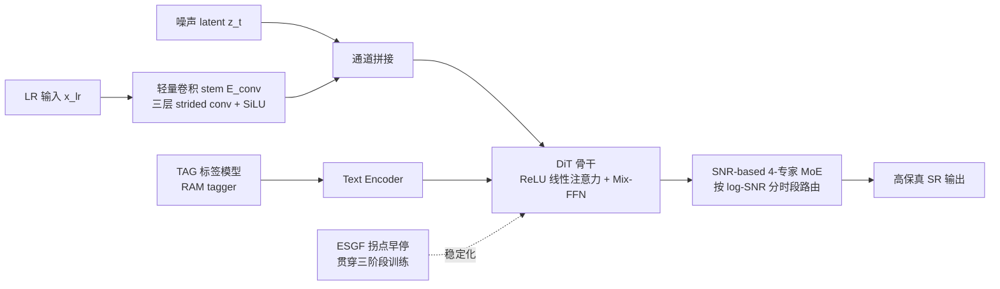

# LinearSR: Unlocking Linear Attention for Stable and Efficient Image Super-Resolution

**会议**: ICLR 2026  
**OpenReview**: [https://openreview.net/forum?id=41Pdz4r5aB](https://openreview.net/forum?id=41Pdz4r5aB)  
**代码**: 待确认  
**领域**: 图像复原 / 超分辨率（生成式 SR、扩散模型、高效注意力）  
**关键词**: Linear Attention, Image Super-Resolution, Diffusion Transformer, Flow Matching, Mixture-of-Experts, 训练稳定性

## 一句话总结
LinearSR 首次把 O(N) 的线性注意力成功用到照片级真实感的扩散超分上，靠"拐点早停微调（ESGF）+ 基于 SNR 的专家混合（MoE）+ 标签引导（TAG）"三件套同时解决了线性注意力 SR 的训练崩溃、感知-失真权衡与引导信号选择三大难题，把 1024×1024 的核心扩散前向压到 0.036s（1-NFE SOTA）的同时拿到 SOTA 级感知质量。

## 研究背景与动机
**领域现状**：生成式图像超分（SR）目前被扩散模型主导，它们依赖自注意力来合成照片级纹理细节，质量很强但代价高昂——自注意力的 $O(N^2)$ 复杂度在高分辨率输入下成为严重的计算瓶颈。线性注意力以 $O(N)$ 复杂度提供了一条出路，并已在通用图像生成（如 SANA）中被验证能高效捕捉全局依赖。

**现有痛点**：尽管线性注意力理论上很美，把它真正落到"对保真度要求极端苛刻"的 SR 任务上却异常困难，历史上一直被一连串相互纠缠、尚未解决的问题卡住：(1) **训练崩溃**——在已收敛模型上继续微调（业界标准做法）时，loss 会突然发散成 NaN，整个训练直接报废；(2) **感知-失真权衡**——想提升纹理真实感（如更细的纹理）就不得不牺牲重建保真度（如 PSNR），反之亦然，这是冲击顶级性能的最后一道墙；(3) **引导信号怎么选**——高分辨率图像配高精度标注的数据稀缺，到底该给模型喂丰富的外部文本描述，还是精确提取 LR 自身已有的特征？

**核心矛盾**：线性注意力的"高效"与超分任务的"高保真+训练稳定"之间长期对立——之前的加速工作（蒸馏、扩散反演等后处理）都没碰架构本身那个二次复杂度瓶颈，而直接换线性注意力又会触发上述系统性崩塌。

**本文目标**：提供第一套鲁棒、可复现的方法论，让线性注意力在高保真 SR 域真正可用，同时兼顾效率、稳定性和性能。

**核心 idea**：把问题拆成"稳定性、引导、权衡"三条独立战线各个击破——**用拐点早停（ESGF）治训练崩溃、用 SNR-MoE 治感知-失真权衡、用 TAG 标签引导落实"精度胜于体量"原则**，三者协同在一个条件扩散 Transformer（DiT）骨干上整合成 LinearSR。

## 方法详解

### 整体框架
LinearSR 是一个以 **ReLU 线性注意力 DiT 为骨干**的条件扩散超分框架，用 Flow Matching 目标训练。LR 图像经一个轻量卷积 stem 编码后与噪声 latent 在通道维拼接，给骨干注入结构条件；引导信号由 TAG 标签模型提供；训练分三阶段（预训练 → MoE 持续预训练 → SFT），每阶段都遵循 ESGF 在"拐点"处取 checkpoint 来保证稳定。下图概括各组件如何协同：

### 关键设计

**1. ReLU 线性注意力骨干 + Mix-FFN：把 O(N²) 拆成 O(N) 的全局摘要。** 标准自注意力要算 $N\times N$ 的两两相似度矩阵，复杂度 $O(N^2)$。线性注意力利用矩阵乘法的结合律重排运算顺序，对 query/key/value $q_i, k_j, v_j \in \mathbb{R}^d$，输出为 $o_i = \frac{\phi(q_i)\sum_{j=1}^{N}\phi(k_j)^T v_j}{\phi(q_i)\sum_{j=1}^{N}\phi(k_j)^T}$，其中 $\phi(\cdot)=\mathrm{ReLU}(\cdot)$。关键在于先把 $\sum_j \phi(k_j)^T v_j$ 及其归一化项算成一个固定大小的"全局摘要"张量，每个 query 再去和这个预计算的上下文交互，从而把整体复杂度降到 $O(N)$。由于线性注意力对局部信息建模偏弱，骨干又给它配了一个用 $3\times3$ 深度可分离卷积的 Mix-FFN 模块来补强局部处理并加速收敛。LR 条件则通过 $z'_t = \mathrm{Concat}(z_t, E_{conv}(x_{lr}))$ 注入——$E_{conv}$ 是三层带 SiLU 的 strided 卷积 stem，比双线性插值这类固定上采样能提供更优的多尺度结构引导。

**2. ESGF 拐点早停微调：用验证指标的"拐点"而非 loss 来选 checkpoint，根治训练崩溃。** 作者发现微调线性注意力 SR 模型几乎必然崩溃，根因是模型收敛到 loss 地形里一个"尖锐极小值"——这种区域泛化差、适应性不稳定，模型会过拟合到 artifact 而非学到鲁棒特征。通过把验证指标对着持续下降的训练 loss 一起追踪，他们发现一个普遍规律：性能指标会先改善、再平台、然后进入剧烈震荡（"Plateau and Oscillation Phase"），证明只看 loss 选模型是会骗人的。他们把震荡前那个泛化最优的迭代点定义为"**拐点（knee-point）**"，并对比了拐点（48k 步）与后期"不稳定峰值"（224k 步）同一层的特征图：拐点的特征结构连贯，不稳定峰值的特征则噪声化、退化严重。据此提出 ESGF——**所有微调都必须从拐点 checkpoint 初始化**，因为这个点位于更平坦、更鲁棒的 loss 区域，能为后续适应提供稳定起点。消融显示从 224k 不稳定峰值起步会在 2k 步内崩溃，而从 48k 拐点起步能稳定跑完，MUSIQ 从 60.39 提到 64.59。

**3. 基于 SNR 的 4 专家 MoE：按去噪轨迹的信噪比分段，让权衡"动态化"。** 感知-失真权衡的本质洞察是它随去噪阶段动态变化——早期高噪声（低 SNR）阶段需要的是粗结构生成，后期低噪声（高 SNR）阶段需要的是细节精修。于是作者在 log 信噪比空间 $\lambda(t)$ 里对生成轨迹分段：在有效范围 $[\lambda_{min}, \lambda_{max}]$ 内做层次化二分——先用主锚点 $\lambda_{anchor}$ 在 $t_2$ 处把轨迹切成高噪声（结构）和低噪声（精修）两个 regime，再在 log-SNR 空间里把这两段各自二分、把中点映射回时间域得到边界 $t_1$ 和 $t_3$。最终 $\{t_1, t_2, t_3\}$ 把轨迹划给四个专家（结构生成 → 结构精修 → 纹理生成 → 细节抛光）。一个门控网络按这些边界**确定性地路由**输入，每个时间步只激活一个专家，因此专门化处理几乎零推理开销。消融中这种 SNR-based 4 专家配置（边界 $[0.223, 0.875, 0.939]$）比 2 专家、朴素均匀划分（$[0.25,0.5,0.75]$）都更好。

**4. TAG 标签引导 + "精度胜于体量"原则：小而准的引导信号反而最有效。** 模型是个向量场预测网络 $v_\theta(z_t, t, c)$，用条件 Flow Matching（CFM）目标训练：$\mathcal{L}_{CFM} = \mathbb{E}_{t,z_1,z_0}\left[\|(z_1-z_0) - v_\theta((1-t)z_0 + tz_1, t, c)\|^2\right]$。关键设计是条件上下文 $c$ 怎么给——SR 和文生图不同，它本身就有 LR 这个强视觉先验，所以问题变成：是补充丰富的外部文本描述，还是精确提取 LR 内在已有的特征？作者横向比了一个谱系：CLIP（语言对齐的视觉特征）、DINO（纯自监督视觉特征）、TAG（受 SeeSR 启发用 RAM tagger 抽出的简洁物体标签）。实验出人意料：DINO 和 CLIP 的纯视觉特征都打败了冗长的句子级描述，而 TAG 标签在几乎所有关键指标上是冠军（PSNR 24.85、MUSIQ 63.93）。这验证了"**精度胜于体量**"——SR 的核心挑战不是信息不足而是信息利用，一个简洁、高召回的物体标签集比堆外部上下文更有效也更高效。

## 实验关键数据

### 主实验表格（与 SOTA 的定量对比，节选 RealLQ250 + DrealSR）

| 数据集/指标 | SeeSR | SUPIR | DreamClear | OSEDiff | AdcSR | InvSR | TSD-SR | **LinearSR** |
|---|---|---|---|---|---|---|---|---|
| RealLQ250 MANIQA↑ | 0.502 | 0.393 | 0.450 | 0.433 | 0.450 | 0.421 | 0.470 | **0.515** |
| RealLQ250 MUSIQ↑ | 70.912 | 65.476 | 67.126 | 70.013 | 70.534 | 66.831 | 71.505 | **71.914** |
| RealLQ250 CLIPIQA↑ | 0.703 | 0.574 | 0.688 | 0.692 | 0.677 | 0.704 | — | **0.720** |
| DrealSR MANIQA↑ | 0.495 | 0.403 | 0.350 | 0.475 | 0.495 | 0.461 | 0.469 | **0.510** |
| DrealSR MUSIQ↑ | 67.429 | 63.125 | 57.164 | 68.051 | 69.025 | 68.046 | 68.495 | **69.073** |

LinearSR 在 RealLQ250 上三项无参考感知指标（MANIQA/MUSIQ/CLIPIQA）全部第一，在 DIV2K-Val、DrealSR 上 MANIQA/MUSIQ 也居首；全参考指标（PSNR/SSIM）则与其他生成式 SR 一样不占优，属于该类方法的共性。

### 效率对比表格（1024×1024 SR，NVIDIA H 系列 GPU）

| 指标（越低越好） | StableSR | SUPIR | OSEDiff | AdcSR | InvSR | TSD-SR | **LinearSR** |
|---|---|---|---|---|---|---|---|
| 单图推理时间 (s) | 78.405 | 13.632 | 1.086 | 0.561 | 0.667 | 12.635 | **0.830** |
| 1-NFE 前向时间 (s) | 0.428 | 2.662 | 0.150 | 0.046 | 0.613 | 9.434 | **0.036** |

1-NFE 前向时间 0.036s 刷新 SOTA，精确度量了线性注意力对核心扩散步的架构性效率贡献；整体多步推理 0.830s 也极具竞争力，比 SUPIR 快数个量级。

### 消融实验表格

| 消融 | 配置 | 关键结果 |
|---|---|---|
| 引导方法（Tab.3） | Origin/CLIP/DINO/**TAG** | PSNR 22.05→23.79→23.83→**24.85**；MUSIQ 60.10→60.75→62.76→**63.93** |
| ESGF（Tab.4） | 224k 不稳定峰值 vs **48k 拐点** | 前者 2k 步内崩溃；后者稳定跑完，MUSIQ 60.39→**64.59** |
| MoE 配置（Tab.5, DrealSR） | Baseline/2-Expert/**4-Expert SNR**/4-Expert 均匀 | 4 专家 SNR-based MUSIQ **64.02** 优于 2 专家 63.18 与均匀划分 |

### 关键发现
- **1-NFE 0.036s 是纯架构红利**：与蒸馏、采样优化正交，意味着叠加未来蒸馏还有进一步压缩空间。
- **拐点早停是"使能器"而非"优化项"**：不做 ESGF，多阶段线性注意力 SR 训练根本跑不通（直接崩溃）。
- **引导信号"少而精"反胜"多而杂"**：纯视觉特征 > 文本描述，标签 > 纯视觉特征。

## 亮点与洞察
- **把"线性注意力做不了高保真 SR"这个长期共识第一次系统性推翻**，给出可复现方法论而非单点 trick。
- **"拐点早停"的洞察很扎实**：用特征图退化 + 指标震荡两条证据链证明"只看 loss 选模型会骗人"，这对所有易崩的微调场景都有借鉴价值。
- **SNR-MoE 把感知-失真权衡从"静态取舍"重构成"按去噪阶段动态分工"**，且确定性路由零额外推理开销，工程上很干净。
- **"精度胜于体量"引导原则**反直觉但有说服力：SR 的瓶颈是信息利用而非信息量，给后续生成式复原的条件设计提供了新视角。

## 局限与展望
- **全参考保真度指标偏弱**：和所有生成式 SR 一样，PSNR/SSIM 不占优，对追求像素级保真的场景（如医学、测量）可能不够。
- **多阶段训练成本高**：三阶段 + 4 个专家各自在 6 张 A800 上训，整体训练资源门槛不低。
- **拐点需要靠验证指标人工/经验判定**，"knee-point"的自动化识别尚未形式化，跨任务迁移时仍需调。
- **未叠加蒸馏**：作者明确把蒸馏留作 future work，当前 0.830s 的整体时间还能进一步压。
- TAG 依赖外部 tagger（RAM），标签质量受 tagger 上限约束。

## 相关工作与启发
- **效率路线对比**：此前 SR 加速主要靠蒸馏、扩散反演等后处理（OSEDiff、AdcSR、InvSR、TSD-SR），都没动二次复杂度的架构根因；LinearSR 从架构层面换线性注意力，与这些后处理正交可叠加。
- **线性注意力血脉**：源自 NLP（Linformer、Katharopoulos 等）→ 视觉密集预测（Cai 等）→ 生成（SANA），LinearSR 是其在高保真 SR 的首次落地。
- **引导范式**：延续 SeeSR 的 tag 引导思路，但把它和 CLIP/DINO 纯视觉特征做了直接横评，提炼出"精度胜于体量"原则，对生成式复原的条件工程有启发。
- **训练稳定性**：拐点早停与"尖锐极小值泛化差"（Keskar 等）的理论相呼应，把 flat-minima 观点工程化成了可操作的 checkpoint 选择策略。

## 评分
- **新颖性**: ⭐⭐⭐⭐ — 首次系统性把线性注意力用于高保真扩散 SR，ESGF 拐点早停与 SNR-MoE 两个设计都有原创洞察，"精度胜于体量"原则反直觉且有验证。
- **实验充分度**: ⭐⭐⭐⭐ — 4 个数据集、10 个 SOTA 对比、效率+质量双维度、引导/ESGF/MoE 三组消融齐全；略欠的是缺与蒸馏叠加后的上限实验。
- **写作质量**: ⭐⭐⭐⭐ — 把三大难题拆成清晰的三条战线叙述，图 2 整合框架与图 3/4 的机理图直观；个别处略带宣传腔。
- **价值**: ⭐⭐⭐⭐ — 为高效生成式 SR 立了一个架构层面的新范式，0.036s 的 1-NFE 对高分辨率部署有实际意义，方法论可复现性强。

<!-- RELATED:START -->

## 相关论文

- [\[ICCV 2025\] Emulating Self-Attention with Convolution for Efficient Image Super-Resolution](../../ICCV2025/image_restoration/emulating_self-attention_with_convolution_for_efficient_image_super-resolution.md)
- [\[NeurIPS 2025\] Spiking Meets Attention: Efficient Remote Sensing Image Super-Resolution with Attention Spiking Neural Networks](../../NeurIPS2025/image_restoration/spiking_meets_attention_efficient_remote_sensing_image_super-resolution_with_att.md)
- [\[ECCV 2024\] Learning Exhaustive Correlation for Spectral Super-Resolution: Where Spatial-Spectral Attention Meets Linear Dependence](../../ECCV2024/image_restoration/learning_exhaustive_correlation_for_spectral_super-resolution_where_spatial-spec.md)
- [\[ICLR 2026\] Trust but Verify: Adaptive Conditioning for Reference-Based Diffusion Super-Resolution](trust_but_verify_adaptive_conditioning_for_reference-based_diffusion_super-resol.md)
- [\[ICLR 2026\] Texture Vector-Quantization and Reconstruction Aware Prediction for Generative Super-Resolution](texture_vector-quantization_and_reconstruction_aware_prediction_for_generative_s.md)

<!-- RELATED:END -->
