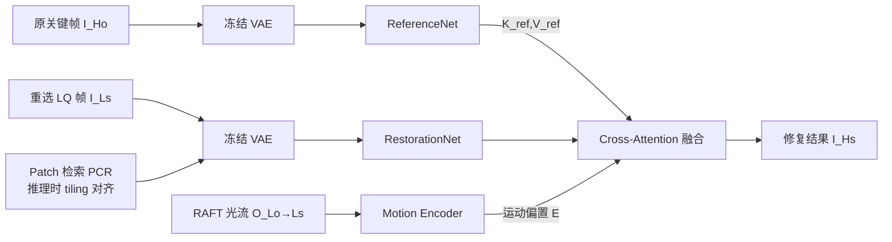

# LiveMoments: Reselected Key Photo Restoration in Live Photos via Reference-guided Diffusion

**会议**: ICLR 2026  
**OpenReview**: [https://openreview.net/forum?id=02mgFnnfqG](https://openreview.net/forum?id=02mgFnnfqG)  
**代码**: 待确认  
**领域**: 图像恢复 / 参考引导超分  
**关键词**: Live Photo, 参考引导修复, 扩散模型, 双分支网络, 运动对齐, 光流  

## 一句话总结
针对 Live Photo 中"重选关键帧"画质骤降的真实痛点，LiveMoments 用 SD3 双分支扩散网络把原始高质量关键帧当作同序列参考，再配合"潜空间运动引导注意力 + 图像级 Patch 检索对齐"双层运动对齐，把模糊错位的重选帧修复到接近原图质量。

## 研究背景与动机
**领域现状**：Live Photo 同时存一张走完完整 ISP 流水线的高质量关键帧（HQ key photo）和一段约 3 秒的低质量预览视频。用户常想从视频里挑一帧表情/时机更好的画面当新关键帧，但这些帧来自压缩、低延迟的预览流，还叠加运动模糊和传感器噪声，画质明显差一截。

**现有痛点**：作者把这个需求定义为一个新任务——**Reselected Key Photo Restoration**，本质是参考超分（RefSR）的子类，但已有方案都不合身：
- **传统 RefISR**（C2-Matching、DATSR）模型小、缺强先验，扛不住 Live Photo 里多样的退化和大幅运动错位；
- **扩散式 RefISR**只有 ReFIR（固定系数门控、鲁棒性差）和 CoSeR（用 CLIP 嵌入生成参考、忽略局部细节对齐）两种，常生成不自然纹理；
- **RefVSR**（RefVSR、ERVSR）只能处理小错位、做不了 4K，且依赖三摄同步采集的数据集；
- **单图 SISR**（StableSR、SeeSR、SUPIR、OSEDiff）干脆无视参考，运动场景下结构和细节都保不住。

**核心矛盾**：重选帧与原关键帧来自**同一序列**、共享场景语义（这是可利用的强先验），但两者之间存在**巨大质量差**和**明显运动错位**（主体移动或相机抖动），既要借参考补细节，又不能因错位而引入错误内容。

**本文目标**：在 4K 超高分辨率下，用单张原关键帧引导，把单张低质重选帧修复到与原图相当的质量，同时保持内容保真。

**核心 idea**：(1) **同序列参考 + 双分支扩散** —— 用镜像主干的 ReferenceNet 保留高分辨率细节，经 cross-attention 注入主分支，而非靠 CLIP 的粗语义对齐；(2) **统一运动对齐** —— 在潜空间用光流编码的运动偏置引导注意力，在图像级用 Patch 检索保证 tiling 推理时 patch 对齐。

## 方法详解

### 整体框架
LiveMoments 基于 Stable Diffusion 3（MM-DiT）搭双分支：**RestorationNet** 对重选 LQ 帧 $I_{Ls}$ 的噪声潜变量做条件去噪，**ReferenceNet**（结构镜像、可加载预训练权重）编码原关键帧 $I_{Ho}$ 提供高保真细节引导，两者通过 cross-attention 融合。在此之上叠一个**统一 Motion Alignment 模块**，潜空间用 RAFT 光流编码出的运动偏置纠正注意力，图像级用 Patch Correspondence Retrieval 在 tiling 推理前对齐参考 patch。训练采用 bridge matching 思路，直接学 $I_{Ls}$ 与 $I_{Hs}$ 两个分布间的速度场。

### 关键设计

**1. 同序列双分支参考注入：用镜像主干换"细节级"对齐而非"语义级"对齐**。不同于 CLIP 路线只抓低分辨率全局语义，ReferenceNet 在结构上完全镜像去噪主干，因此能从预训练 checkpoint 初始化、并在共享特征空间里与 RestorationNet 对齐。原关键帧经冻结 VAE 编码后由 DiT-based ReferenceNet 提取细节特征，再以 cross-attention 把参考的键值拼接进主分支：$\text{Cross attn} = \text{Softmax}\!\left(\frac{Q[K, K_{ref}]^\top}{\sqrt{d}}\right)[V, V_{ref}]$，其中 $Q$ 来自 RestorationNet，$K_{ref},V_{ref}$ 来自 ReferenceNet。这样模型能自适应挑选并迁移参考图里对齐良好的纹理与结构，而不是被迫吞下整张参考。

**2. 潜空间运动引导注意力：把光流当成注意力的空间偏置**。双分支的隐式匹配在重选帧又糊又错位时不够用——运动模糊+主体位移让对应关系难建立，再加上巨大质量差进一步干扰融合。作者用冻结 RAFT 估计退化后原关键帧 $I_{Lo}$ 到重选帧 $I_{Ls}$ 的稠密位移场 $O_{Lo\to Ls}$（推理时对 $I_{Ho}$ 施加同样退化以缩小质量差、让光流更可靠），经一个轻量 Motion Encoder（卷积+SiLU）变成运动嵌入 $E_{Lo\to Ls}$，作为**加性偏置**注入参考键：$\text{Cross attn}_{opt} = \text{Softmax}\!\left(\frac{Q[K, K_{ref}+E_{Lo\to Ls}]^\top}{\sqrt{d}}\right)[V, V_{ref}]$。这个偏置等于显式告诉 query 该往哪些已对齐的区域注意，错位场景下融合更连贯。

**3. 图像级 Patch Correspondence Retrieval：tiling 推理时按位移检索对齐参考 patch**。Live Photo 原图常是 3072×4096 的超高分辨率，受显存限制必须 tiling 分块推理，但主体运动会让 $I_{Ls}$ 与 $I_{Ho}$ 同位置 patch 内容错位。PCR 在 VAE 编码前介入：先估 $I_{Ls}\to I_{Lo}$ 光流，对每个标准切出的 patch $P^i_{Ls}$ 算 patch 内**平均位移** $(\Delta x_i,\Delta y_i)=\big(\tfrac{1}{p^2}\sum f^j_{x_i},\ \tfrac{1}{p^2}\sum f^j_{y_i}\big)$，再把左上角平移 $(\hat x_i,\hat y_i)=(x_i+\Delta x_i,\ y_i+\Delta y_i)$，从 $I_{Ho}$ 裁出对齐的参考 patch $\hat P^i_{Ho}$。它在 patch 级（而非逐像素 warp）做对齐，天然契合 tiling 流水线、保住空间一致性，是潜空间运动注意力的图像级补充。

**4. 任务专属的相对无参考评测指标**。真实 Live Photo 没有重选帧的 HQ ground truth，常规无参考指标又会偏向"画质高但偏离参考"的乱编结果。作者利用手上有原关键帧 $I_{Ho}$ 这一事实，把 NIQE/MUSIQ/CLIPIQA/MANIQA 改造成相对形式 $\text{metric}_{re}=\frac{|\text{metric}(\tilde I_{Hs})-\text{metric}(I_{Ho})|}{\text{metric}(I_{Ho})}$（越接近参考越好，越小越优），并新增 CLIP-Q、DINO-Q 衡量与参考的感知一致性，让评测真正贴合"参考引导修复"目标。

## 实验关键数据

### 主实验表格（真实 Live Photo，相对指标越小越好 / CLIP-Q、DINO-Q 越大越好）

| 方法 | vivoLive144 NIre↓ | MUre↓ | CAre↓ | CLIP-Q↑ | DINO-Q↑ | iPhoneLive90 NIre↓ | CLIP-Q↑ | DINO-Q↑ |
|---|---|---|---|---|---|---|---|---|
| C2-Matching | 0.2047 | 0.3512 | 0.1929 | 0.9623 | 0.8298 | 0.3147 | 0.9505 | 0.8685 |
| CoSeR | 0.1953 | 0.1865 | 0.2752 | 0.9658 | 0.9197 | 0.1774 | 0.9608 | 0.8618 |
| SUPIR | 0.2703 | 0.2545 | 0.8275 | 0.9407 | 0.8559 | 0.1805 | 0.9422 | 0.7908 |
| OSEDiff | 0.2694 | 0.3191 | 0.8206 | 0.9541 | 0.8536 | 0.2750 | 0.9444 | 0.7525 |
| **LiveMoments** | **0.0990** | **0.0893** | **0.0809** | **0.9805** | **0.9629** | **0.0801** | **0.9842** | **0.9466** |

在两个真实数据集的全部指标上均取得 SOTA，相对无参考指标比次优方法低一个数量级。

### 合成数据集 SynLive260（含全参考指标）

| 方法 | PSNR↑ | SSIM↑ | LPIPS↓ | DISTS↓ | FID↓ | CLIP-Q↑ | DINO-Q↑ |
|---|---|---|---|---|---|---|---|
| C2-Matching | 31.85 | 0.8782 | 0.2419 | 0.1250 | 18.51 | 0.9619 | 0.8391 |
| CoSeR | 27.60 | 0.8136 | 0.2436 | 0.1135 | 13.92 | 0.9699 | 0.8924 |
| OSEDiff | 26.81 | 0.7882 | 0.2915 | 0.1412 | 27.17 | 0.9566 | 0.8220 |
| **LiveMoments** | 31.65 | **0.8990** | **0.0828** | **0.0365** | **4.00** | **0.9950** | **0.9740** |

LPIPS/DISTS/FID 大幅领先（FID 4.00 vs 次优 13.92），PSNR 略低但作者指出这是全参考指标在真实修复任务里的固有局限（SUPIR 也有同样现象）。

### 消融实验表格（vivoLive144）

| 配置 | NIQEre↓ | CLIPIQAre↓ | MANIQAre↓ | CLIP-Q↑ | DINO-Q↑ |
|---|---|---|---|---|---|
| 仅 RestorationNet | 0.1677 | 0.2348 | 0.1105 | 0.9690 | 0.9081 |
| + ReferenceNet | 0.1097 | 0.0823 | 0.0631 | 0.9792 | 0.9539 |
| + warp RefImage | 0.1034 | 0.0873 | 0.0573 | 0.9774 | 0.9480 |
| + warp RefLatent | 0.1130 | 0.0850 | 0.0622 | 0.9774 | 0.9437 |
| **LiveMoments (full)** | **0.0990** | **0.0809** | **0.0556** | **0.9805** | **0.9629** |

### 关键发现
- 加入 ReferenceNet 是最大跳变（CLIPIQAre 0.2348→0.0823），证明同序列参考的价值；
- 直接对参考做 warp（图像/潜空间/KV）反而不如运动引导注意力 + PCR 的组合，说明显式偏置 + patch 级对齐比硬 warp 更稳健；
- 常规无参考指标会奖励"画质高但偏离参考"的伪影结果，相对指标才如实反映保真度。

## 亮点与洞察
- **问题定义本身就是贡献**：把手机厂商真实存在的"重选关键帧画质差"提炼成一个介于 RefISR 与 RefVSR 之间的新任务，落地价值明确（论文称已超过旗舰手机的表现）。
- **同序列参考**比外部数据库参考更优雅——天然内容一致，把"找相似参考"的难题直接消解。
- **双层运动对齐**思路清晰：潜空间用软偏置纠注意力、图像级用硬 patch 检索保 tiling 一致，分工互补。
- **配套基准与指标**：SynLive260 + vivoLive144 + iPhoneLive90 三数据集 + 相对无参考指标，把这个新任务的评测体系一并建好。

## 局限与展望
- 依赖**冻结 RAFT 光流**，大幅运动/严重模糊下光流不准会直接拖累两级对齐；
- PCR 只用 **patch 内平均位移**做平移对齐，对 patch 内部非刚性形变或旋转无能为力；
- 推理需 tiling + 双分支 SD3，**计算开销**对端侧部署仍偏重（虽宣称比 RefVSR 高效）；
- 真实数据集规模有限（vivo 144 + iPhone 90），且缺真实 GT，主要靠相对指标与视觉评估。

## 相关工作与启发
- **扩散式 SISR**（StableSR、SeeSR、SUPIR、OSEDiff、TSD-SR）提供了生成先验与一步蒸馏，但无视参考、保真不足，正是本文要补的短板；
- **RefSR**（C2-Matching、DATSR、ReFIR、CoSeR、RefVSR、ERVSR）给出参考匹配/纹理迁移范式，本文在"同序列单参考 + 4K + 大错位"设定上重新设计；
- **参考引导生成**（AnimateAnyone 类的 ReferenceNet 双分支）被迁移到修复任务，是 video 生成技术反哺图像修复的好例子；
- 启发：当"参考"天然可得（同序列、同设备多摄等），与其追求语义检索，不如直接利用时序/空间共生关系做细节级对齐。

## 评分
- **新颖性**: ⭐⭐⭐⭐ 提出落地价值明确的新任务，方法上把双分支扩散 + 双层运动对齐组合得自洽，虽各组件多为已有技术的迁移整合。
- **实验充分度**: ⭐⭐⭐⭐ 三数据集 + 十余个 SOTA 对比 + 清晰消融 + 自建相对指标，覆盖真实与合成场景；真实 GT 缺失略有遗憾。
- **写作质量**: ⭐⭐⭐⭐ 问题动机、方法分层、指标设计都讲得清楚，图示（架构图 + PCR 示意）到位。
- **价值**: ⭐⭐⭐⭐ 直接对应手机厂商真实需求，基准与指标对后续研究有铺垫意义。

<!-- RELATED:START -->

## 相关论文

- [\[ICLR 2026\] Trust but Verify: Adaptive Conditioning for Reference-Based Diffusion Super-Resolution](trust_but_verify_adaptive_conditioning_for_reference-based_diffusion_super-resol.md)
- [\[ICLR 2026\] Energy-oriented Diffusion Bridge for Image Restoration with Foundational Diffusion Models](energy-oriented_diffusion_bridge_for_image_restoration_with_foundational_diffusi.md)
- [\[CVPR 2026\] ZeroIDIR: Zero-Reference Illumination Degradation Image Restoration with Perturbed Consistency Diffusion Models](../../CVPR2026/image_restoration/zeroidir_zero-reference_illumination_degradation_image_restoration_with_perturbe.md)
- [\[ICLR 2026\] Text-Aware Image Restoration with Diffusion Models](text-aware_image_restoration_with_diffusion_models.md)
- [\[CVPR 2026\] From Events to Clarity: The Event-Guided Diffusion Framework for Dehazing](../../CVPR2026/image_restoration/from_events_to_clarity_the_event-guided_diffusion_framework_for_dehazing.md)

<!-- RELATED:END -->
