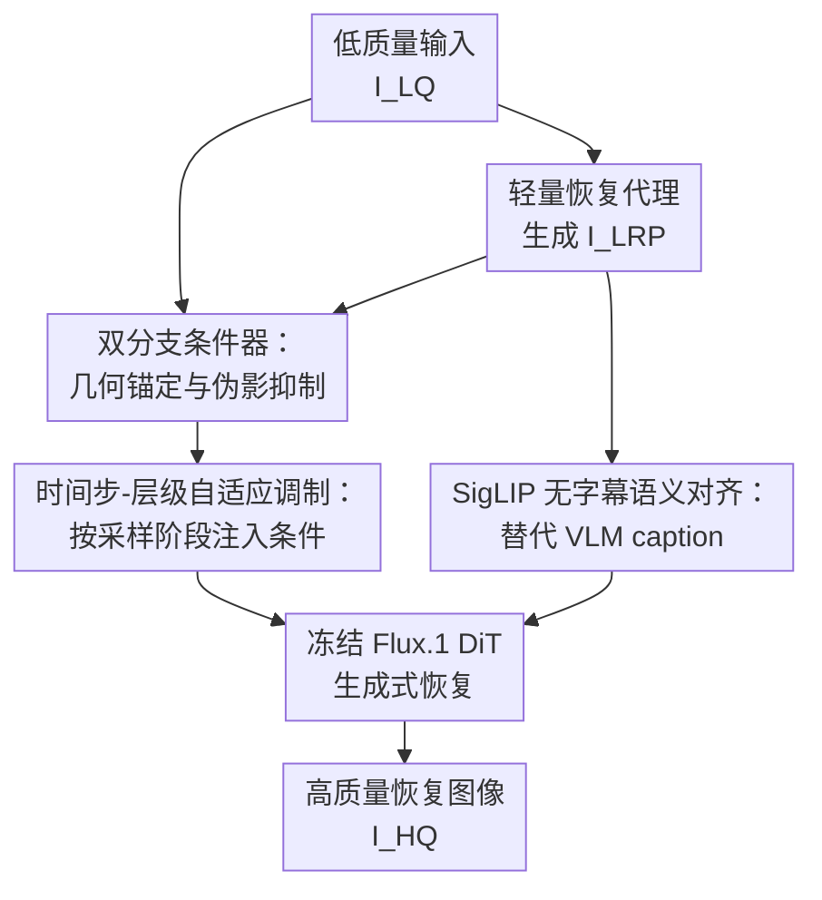

# LucidFlux: Caption-Free Photo-Realistic Image Restoration via a Large-Scale Diffusion Transformer

**会议**: ICLR2026  
**OpenReview**: [https://openreview.net/forum?id=qrCAGOE483](https://openreview.net/forum?id=qrCAGOE483)  
**代码**: https://github.com/W2GenAI-Lab/LucidFlux  
**领域**: 图像恢复  
**关键词**: 图像恢复, 扩散Transformer, 无字幕语义对齐, Flux.1, 数据筛选

## 一句话总结
LucidFlux 用冻结的 12B Flux.1 大规模扩散 Transformer 做真实图像恢复，通过双分支条件器、时间步-层级自适应调制、SigLIP 无字幕语义对齐和大规模高质量数据筛选，在多项真实与合成退化基准上取得更强的感知质量和语义一致性。

## 研究背景与动机
**领域现状**：真实世界图像恢复要把低质量图像中的噪声、模糊、压缩伪影、镜头畸变等混合退化去掉，同时尽量保住原图的语义和几何结构。传统 CNN/Transformer 判别式恢复模型在合成退化上常常有效，但遇到野外图像的未知混合退化时，容易把纹理抹平，或者只修掉一部分可见伪影。

**现有痛点**：扩散先验给这个问题带来了新的可能，因为文本到图像扩散模型本来就擅长生成真实纹理和细节。Stable Diffusion/SDXL 系列的 UNet 复原方法已经能比纯判别式模型更自然，但 UNet 容量和归纳偏置在复杂混合退化下会逐渐饱和；较新的 DiT 方法如 DreamClear 证明 Transformer 先验有潜力，却通常使用较小的 DiT 或较重的 ControlNet 风格适配器，难以充分利用 Flux.1 这类大模型的全局建模能力。

**核心矛盾**：大规模 DiT 不是简单拿来做图像恢复就能成功。低质量输入本身能提供边缘和布局，但也会把噪声、压缩块、模糊痕迹一起注入模型；轻量恢复后的代理图像更干净，却可能丢掉细节。另一方面，许多扩散恢复方法依赖 VLM 给低质量图像生成 caption，再用 caption 作为语义条件，但 caption 既慢，又可能把“模糊”“低分辨率”“破损”等退化描述当成语义写进去，从而误导生成式恢复。

**本文目标**：作者想回答的问题不是“再堆多少可训练参数”，而是“在大 DiT 的哪个时间步、哪一层、用什么条件信号”。具体来说，LucidFlux 需要同时做到三件事：从低质量图像锚定几何和细节，从轻量恢复代理中获得更干净的结构线索，在不调用 caption/VLM 的情况下保持语义一致。

**切入角度**：论文观察到扩散采样的不同时间步和 Transformer 不同层本来就有分工：早期时间步偏全局结构，后期时间步偏细节；浅层偏低级边缘，深层偏语义。因此，条件注入也不应该在所有层和所有时间步一刀切，而应该随着时间步和层号动态调整低质量分支与代理分支的权重。

**核心 idea**：用“低质量图像 + 轻量恢复代理 + SigLIP 语义特征”替代 caption 条件，并通过时间步-层级自适应调制把这些信号按需注入冻结的 Flux.1，使大规模 DiT 能做 caption-free 的真实图像恢复。

## 方法详解
### 整体框架
LucidFlux 的主干是冻结的 Flux.1 大规模扩散 Transformer，训练时只学习任务相关的条件模块。给定低质量图像 $I_{LQ}$，模型先用一个轻量恢复器生成代理图像 $I_{LRP}$，再分别从 $I_{LQ}$ 和 $I_{LRP}$ 提取条件 token；同时用 SigLIP 从 $I_{LRP}$ 提取语义特征，投影到 Flux.1 原本接收文本条件的空间中。最终，Flux.1 在这些 caption-free 条件的引导下，从噪声恢复出高质量图像 $I_{HQ}$。

这个框架的关键在于“冻结大模型、训练小模块”。Flux.1 和 VAE 保持冻结，避免破坏原有生成先验；双分支条件器、调制头和 SigLIP Connector 承担图像恢复所需的任务适配。这样做让 LucidFlux 能利用 12B 级别生成先验，又不用像完整微调那样冒着灾难性遗忘和训练不稳定的风险。

### 关键设计
**1. 双分支条件器：把细节锚定和伪影抑制拆开处理**

真实退化图像里的信息很矛盾：原始低质量图像 $I_{LQ}$ 保留了最直接的边缘、文字、脸部轮廓和局部纹理，但它同样包含噪声、压缩块和模糊痕迹；轻量恢复代理 $I_{LRP}=LRP(I_{LQ})$ 更干净，更适合作为结构参照，却可能把微小纹理和高频细节提前抹掉。LucidFlux 因此不把二者混成一个输入，而是用双分支条件器分别编码：

$$
\phi_{LQ}=DBC(I_{LQ}), \quad \phi_{LRP}=DBC(I_{LRP}).
$$

每个分支先通过 8 层 $3\times3$ 卷积编码器映射到 VAE latent 空间，再 patchify 成序列并加位置编码，最后经过两层 MMDiT。两个分支不共享权重，因为它们要学的不是同一种线索：$I_{LQ}$ 分支更像“保细节但要忍受噪声”的观察者，$I_{LRP}$ 分支更像“少伪影但可能保守”的观察者。分开训练可以避免二者的梯度互相抢方向，同时比复制完整 ControlNet 或大 DiT block 轻得多。

**2. 时间步-层级自适应调制：让条件注入跟着 DiT 的分工走**

如果把两个分支的条件 token 在每个时间步、每一层都用同样强度注入，模型很容易遇到两类问题：早期结构还没定时过早追细节，或者后期应该补纹理时仍被粗糙代理图像限制。论文把时间步 $t$ 和层号 $l$ 编成正弦位置表示，再由轻量调制头预测每个分支的通道级 scale 和 bias：

$$
\alpha^{t,l}_m,\beta^{t,l}_m = Modulation(PE(t/T,l/L)), \quad m\in\{LQ,LRP\}.
$$

随后对两个分支分别做 AdaptiveLN 风格的调制：

$$
	ilde{\phi}^{t,l}_{LQ}=\alpha^{t,l}_{LQ}\odot\phi_{LQ}+\beta^{t,l}_{LQ}, \quad
	ilde{\phi}^{t,l}_{LRP}=\alpha^{t,l}_{LRP}\odot\phi_{LRP}+\beta^{t,l}_{LRP},
$$

并融合为 $Cond^{t,l}=\tilde{\phi}^{t,l}_{LQ}+\tilde{\phi}^{t,l}_{LRP}$。这个设计把“何时看什么”显式交给调制器：在更需要全局布局的阶段，可以更多依赖干净代理；在需要补高频纹理的阶段，可以让低质量输入中的原始细节重新发挥作用。它不是简单加一个门控，而是同时按采样时间和网络深度调整条件，因此更贴合大 DiT 的层级角色。

**3. SigLIP 无字幕语义对齐：用图像语义替代不稳定 caption**

许多生成式恢复方法会让 VLM 给输入图像写 caption，再把 caption 输入扩散模型。但真实恢复场景里只有低质量图像，VLM 往往会把退化也描述进去。论文在 RealLQ250 上统计发现，LLaVA-v1.6-Vicuna-13B 生成的 caption 中有 17% 含退化相关词，Qwen2.5-VL-7B-Instruct 则达到 24%；附录还展示了同一图像多次 caption 会导致恢复结果波动，含“blurred”“damage”等描述的 caption 会让输出质量下降。

LucidFlux 直接绕开 caption：从轻量恢复代理 $I_{LRP}$ 提取 frozen SigLIP 图像特征，再经 Connector 投影到 Flux.1 的文本条件空间：

$$
z_s=Connector(SigLIP(I_{LRP})), \quad Context=Concat(z_s,c).
$$

这里 $c$ 只是少量默认提示 token，真正的语义来自 $z_s$。这个设计有两个好处：第一，训练和推理都不依赖外部 VLM，省掉约 10 秒级 caption 开销；第二，语义来自图像代理而不是文字描述，减少“把退化当语义”的风险。对恢复任务来说，这比追求更长、更漂亮的 caption 更稳，因为模型需要的是“这是什么物体和结构”，不是“这张坏图有多坏”。

**4. 可复现的大规模高质量数据筛选：让 12B 先验吃到合适的恢复数据**

大 DiT 的容量很强，但真实图像恢复不是纯文本到图像生成，训练数据必须既有结构、又有感知质量，还要覆盖足够多的场景。LucidFlux 从 Pexels、Unsplash 和 Photo-Concept-Bucket 收集约 290 万候选图像，然后用三阶段自动流程筛掉不适合恢复训练的样本。

第一步是模糊检测，用拉普拉斯方差 $S_{blur}(I)=Var(\nabla^2 I)$ 保留 $150\le S_{blur}(I)\le8000$ 的图像，排除过度模糊或高频噪声极强的样本。第二步是平坦区域检测，把图像切成 $240\times240$ patch，用 Sobel 梯度方差衡量纹理丰富度，若超过 50% patch 的 $S_{flat}<800$，就认为图像过于平坦并丢弃。第三步用 CLIP-IQA 对剩余图像排序，只保留前 20%，得到 25.7 万高质量图像；再加入 8.4 万 LSDIR 样本，最终形成 34.2 万高质量图像，并通过 Real-ESRGAN 退化流程生成 136 万训练对。

这个数据设计和模型结构是互补的：双分支条件器解决如何注入退化图像，SigLIP 解决无字幕语义，数据筛选则保证模型看到的是结构丰富、质量可靠、覆盖多样的恢复监督。消融中最大跃升来自大规模高质量数据，也说明对 12B 级模型而言，数据质量不是附属工程，而是核心方法的一部分。

### 一个完整示例
假设输入是一张低质量街景招牌图：文字边缘被压缩块污染，背景有运动模糊，招牌编号仍隐约可见。LucidFlux 先把原图作为 $I_{LQ}$ 送入低质量分支，这条分支保留“文字大概在哪、边缘方向如何、字符间距如何”等原始线索；同时 SwinIR 这类轻量恢复器生成 $I_{LRP}$，它可能已经去掉一部分压缩伪影，但也可能把细小笔画抹得更圆滑。

采样早期，模型更需要确定招牌的位置、整体透视和背景布局，时间步-层级调制会更偏向 $I_{LRP}$ 提供的干净结构；随着生成进入后期，调制器逐步加强 $I_{LQ}$ 中高频细节的作用，让数字、边缘和纹理回到画面里。与此同时，SigLIP 从 $I_{LRP}$ 提供“这是街景中的标签/招牌/工业部件”这样的图像语义，不需要 VLM 写出可能包含“blurred label”“damaged text”的 caption。最后，冻结的 Flux.1 在这些条件下生成清晰图像：它不是凭空想象一个新招牌，而是在原始几何和语义约束内补回更自然的纹理。

### 损失函数 / 训练策略
LucidFlux 使用 Flux 系列常见的 flow-matching 速度预测目标，在 latent 空间用标准 $L_2$ loss 训练新引入的任务模块。训练时 Flux.1 backbone 和 VAE 全部冻结，只优化双分支条件器、时间步-层级调制模块和 SigLIP Connector 等任务相关参数。

训练配置上，论文使用 8 张 NVIDIA A800，DeepSpeed ZeRO-2，Adafactor 优化器，学习率 $2\times10^{-5}$，weight decay 为 0.01；每张 GPU batch size 为 2，梯度累积 2 步，总有效 batch size 为 32。输入和评测分辨率为 $1024\times1024$，完整训练约 7 GPU-days。轻量恢复代理采用 SwinIR，SigLIP Connector 从 Flux.1-alpha-Redux checkpoint 初始化。

## 实验关键数据

### 主实验
论文在真实世界数据 DRealSR、RealSR、RealLQ250，以及合成数据 DIV2K-Val、LSDIR-Val 上比较 ResShift、StableSR、SinSR、DiffBIR、SeeSR、DreamClear、SUPIR 和 LucidFlux。指标覆盖 CLIP-IQA+、Q-Align、MUSIQ、MANIQA、NIMA、CLIP-IQA、NIQE，以及合成集上的 PSNR/SSIM/LPIPS。

| 数据集 | 指标 | LucidFlux | 之前最强基线 | 提升 |
|--------|------|-----------|--------------|------|
| DRealSR | CLIP-IQA+ ↑ | 0.6748 | DiffBIR 0.6475 | +0.0273 |
| DRealSR | MUSIQ ↑ | 66.6833 | SeeSR 61.3222 | +5.3611 |
| DRealSR | NIQE ↓ | 4.7034 | SUPIR 5.9091 | -1.2057 |
| RealSR | CLIP-IQA+ ↑ | 0.7074 | SeeSR 0.6731 | +0.0343 |
| RealSR | MUSIQ ↑ | 70.20 | SeeSR 67.57 | +2.63 |
| RealLQ250 | CLIP-IQA+ ↑ | 0.7406 | SeeSR 0.7034 | +0.0372 |
| RealLQ250 | Q-Align ↑ | 4.3935 | SeeSR 4.1423 | +0.2512 |
| DIV2K-Val | MUSIQ ↑ | 73.9045 | SeeSR 71.4947 | +2.4098 |
| LSDIR-Val | MANIQA ↑ | 0.5979 | SeeSR 0.5529 | +0.0450 |

这些结果说明 LucidFlux 的优势主要体现在感知质量和语义一致性上。它在真实数据上的 CLIP-IQA+、Q-Align、MUSIQ、MANIQA、NIMA 等指标普遍领先，尤其 RealLQ250 上相对 SeeSR/SUPIR/DreamClear 的提升很明显。合成数据上的 PSNR/SSIM 并不是最好，例如 DIV2K-Val 上 LucidFlux 的 PSNR 为 15.4393，低于 DiffBIR 的 20.0389；这也符合生成式恢复的常见现象：更真实的纹理有时会牺牲逐像素误差，但在感知指标和视觉结果上更自然。

论文还和商业方法比较，在 RealLQ250 上 LucidFlux 超过 Seedream 4.0、Gemini-NanoBanana、MeiTu SR 等系统：

| 方法 | CLIP-IQA+ ↑ | Q-Align ↑ | MUSIQ ↑ | MANIQA ↑ | NIMA ↑ | CLIP-IQA ↑ | NIQE ↓ |
|------|-------------|-----------|---------|----------|--------|-------------|--------|
| LQ Input | 0.6218 | 2.1693 | 44.1541 | 0.3718 | 3.8664 | 0.6079 | 6.0790 |
| Seedream 4.0 | 0.5002 | 3.6931 | 52.3771 | 0.2794 | 4.7024 | 0.4124 | 4.9393 |
| Gemini-NanoBanana | 0.3780 | 3.3114 | 44.6310 | 0.2548 | 4.6571 | 0.4434 | 6.0865 |
| MeiTu SR | 0.6653 | 4.1464 | 66.5936 | 0.4498 | 5.2103 | 0.6663 | 5.4125 |
| LucidFlux | 0.7406 | 4.3935 | 73.01 | 0.5589 | 5.4836 | 0.7122 | 3.6742 |

运行时方面，LucidFlux 的 backbone 规模达到 12B，总参数约 13.6B，其中可训练 adapter 约 1.6B。虽然推理本身约 23.612 秒，略慢于 SeeSR/SUPIR 的推理阶段，但由于 caption 预处理仅 0.012 秒，总耗时 23.612 秒；DreamClear 需要 8.7 秒 caption 和 28.9 秒推理，总耗时 37.6 秒。对 caption-based 复原来说，VLM caption 不是小开销，而是实际部署中的主要负担之一。

### 消融实验
| 配置 | CLIP-IQA | CLIP-IQA+ | MUSIQ | 说明 |
|------|----------|-----------|-------|------|
| Dual-Branch Conditioner Only | 0.585 | 0.609 | 61.582 | 只用双分支条件器，训练于 LSDIR |
| + SigLIP Alignment | 0.600 | 0.620 | 62.000 | 加入无字幕语义对齐后语义稳定性提高 |
| + TLCM | 0.622 | 0.635 | 65.500 | 加入时间步-层级调制后更好利用 DiT 层级分工 |
| + Large HQ Data | 0.7122 | 0.7406 | 73.0088 | 使用筛选后的大规模高质量数据，带来最大增益 |

caption 消融进一步验证了“无字幕”并不是为了省事，而是质量和效率都更稳。在固定 Flux.1 backbone 的 RealSR 实验中，GT caption 版本 CLIP-IQA+ 为 0.7111、MUSIQ 为 70.1654、NIQE 为 4.6775，并额外增加 10.426 秒；VLM caption 版本 CLIP-IQA+ 为 0.7060、MUSIQ 为 69.4371、NIQE 为 4.6249，并增加 10.057 秒；LucidFlux caption-free 版本 CLIP-IQA+ 为 0.7074、MUSIQ 为 70.2005、NIQE 为 4.2893，额外延迟只有 0.012 秒。也就是说，即使给模型“理想”的 GT caption，也没有稳定超过无字幕路径。

| 训练策略 | CLIP-IQA ↑ | NIQE ↓ | MUSIQ ↑ | 显存 |
|----------|------------|--------|---------|------|
| 只微调 Attention | 0.654 | 3.52 | 66.27 | 60.30 GB |
| 全量微调 | 0.594 | 3.796 | 63.30 | 76.16 GB |
| LucidFlux 冻结主干适配 | 0.7122 | 3.6742 | 73.01 | 76.53 GB |

主干更新策略的消融也很关键：只调 attention 容易遇到性能上限，全量微调又会破坏大模型原有生成先验，导致感知质量下降。LucidFlux 的做法虽然显存不低，但它把学习压力放到条件模块上，既保持 Flux.1 先验稳定，又给恢复任务足够适配能力。

### 关键发现
- 双分支条件器本身能建立恢复任务和 Flux.1 之间的接口，但单独使用还不够；SigLIP、TLCM 和数据筛选是逐级叠加的有效贡献。
- 最大提升来自大规模高质量数据，从 MUSIQ 65.500 提到 73.0088，说明 12B 级恢复模型非常依赖结构丰富、质量受控的数据，而不是随便扩大网页图像池。
- caption-free 路径在质量上至少不输 caption-based 路径，在延迟上明显更优，并且避免 VLM caption 把退化词写入条件。
- LucidFlux 在 PSNR/SSIM 等失真指标上不总是领先，这提示它更适合追求照片真实感和感知质量的复原场景，而不是严格逐像素复原任务。
- 视觉对比中，SeeSR/DreamClear 常残留伪影或纹理恢复不足，SUPIR 更干净但容易过平滑；LucidFlux 在头发、文字、高频纹理等区域更清晰。

## 亮点与洞察
- 最大亮点是把大规模生成模型适配图像恢复的问题，重新表述成“when/where/what to condition”。这比单纯扩大 adapter 或写更复杂 prompt 更抓根因，因为恢复任务真正需要的是条件信号在采样过程中的正确路由。
- 双分支条件器的直觉很实用：低质量图像和轻量恢复代理各有偏差，强行选一个都会出问题。把二者分开编码，再由时间步和层级动态融合，是一种可以迁移到去噪、去模糊、低光增强甚至视频恢复的设计。
- SigLIP 无字幕路径很有启发。很多扩散任务把文本条件当成默认入口，但图像恢复的语义其实可以来自图像本身；当 caption 会引入退化偏见时，绕开文字反而更稳。
- 数据筛选不是附录工程，而是方法的一部分。论文把 blur、flatness、CLIP-IQA 的阈值和样本规模讲清楚，使得“大规模数据”不只是口号，也让后续工作可以复现或替换其中的过滤器。
- 冻结主干适配的结果说明，大生成模型的先验很宝贵，恢复任务未必需要重写它的内部知识。更合理的做法是学会怎样把观测条件送进去，而不是把 12B 模型整个拉去适应一个退化分布。

## 局限与展望
- 训练和推理成本仍然较高。LucidFlux 虽然减少了 caption 预处理，但 12B Flux.1 + 1.6B adapter 的整体规模仍远超多数轻量恢复模型，不适合所有移动端或实时场景。
- 论文主要评估单图像恢复，尚未系统扩展到多帧/视频恢复。视频场景还需要处理时序一致性，否则逐帧生成式纹理可能带来闪烁。
- 数据筛选阈值虽然给出并做了分析，但仍是人工经验设定。未来可以研究可学习的数据选择或任务反馈驱动的样本筛选，让数据管线不只依赖固定阈值。
- 生成式恢复天然存在“看起来更真实但未必逐像素忠实”的风险。对于医学、遥感、取证等高保真应用，LucidFlux 这类方法还需要更严格的结构约束和错误检测机制。
- SigLIP 从轻量恢复代理中提取语义，如果代理图像本身在极端退化下已经丢失关键内容，语义条件仍可能偏移。未来可以考虑多尺度语义、原图与代理图双语义分支，或不确定性估计。

## 相关工作与启发
- **vs SUPIR**: SUPIR 基于 SDXL 等扩散先验做照片级恢复，视觉质量强，但仍依赖较重的生成先验和文本/提示机制，且在一些细节上容易过平滑。LucidFlux 的区别在于使用更大规模的 Flux.1 DiT，并把条件注入设计成双分支与时间步-层级自适应调制。
- **vs SeeSR**: SeeSR 强调语义感知真实图像超分，使用语义相关信号提升生成恢复质量。LucidFlux 同样重视语义，但不用 VLM caption，而是通过 SigLIP 图像特征进入文本条件空间，从源头降低 caption 延迟和退化词偏见。
- **vs DreamClear**: DreamClear 是接近本文的问题设定，使用 DiT 先验做真实图像恢复，并构建高容量恢复系统。LucidFlux 进一步把 backbone 扩展到 Flux.1 这种 12B 级模型，同时减少重型 ControlNet 式复制，用轻量双分支条件器和调制策略适配大模型。
- **vs StableSR / ResShift / SinSR**: 这些方法更偏传统扩散超分或高效扩散恢复，在速度、结构保真或训练成本上各有优势，但面对复杂野外退化时感知纹理和语义一致性不如大 DiT 路线。LucidFlux 的代价是更大模型规模，收益是更强的真实感和复杂场景鲁棒性。
- **启发**: 对其他“输入条件很脏”的生成式视觉任务，可以借鉴 LucidFlux 的思想：不要把观测直接粗暴塞进生成模型，而是构造“原始观测 + 清洁代理 + 语义代理”的多源条件，并让模型按时间、层级或尺度动态决定信任谁。

## 评分
- 新颖性: ⭐⭐⭐⭐☆ 从 Flux.1 大 DiT 做 caption-free 图像恢复的整体组合很有新意，核心模块也围绕大模型条件路由展开，但双分支和语义对齐各自有相关先例。
- 实验充分度: ⭐⭐⭐⭐⭐ 覆盖真实、合成、商业模型、caption 消融、模块消融和训练策略消融，数字较完整，且承认 PSNR/SSIM 不占优。
- 写作质量: ⭐⭐⭐⭐☆ 论文主线清楚，方法和数据管线解释充分；个别地方如内存表述和 Flux/DiT/RFT 命名略复杂，读者需要一点背景才能完全跟上。
- 价值: ⭐⭐⭐⭐⭐ 对真实照片级恢复很有价值，尤其展示了大规模生成模型不依赖 caption 也能稳定做 restoration，并给出了可复现的数据筛选 recipe。

<!-- RELATED:START -->

## 相关论文

- [\[ICLR 2026\] LiveMoments: Reselected Key Photo Restoration in Live Photos via Reference-guided Diffusion](livemoments_reselected_key_photo_restoration_in_live_photos_via_reference-guided.md)
- [\[CVPR 2026\] VoDaSuRe: A Large-Scale Dataset Revealing Domain Shift in Volumetric Super-Resolution](../../CVPR2026/image_restoration/vodasure_a_large-scale_dataset_revealing_domain_shift_in_volumetric_super-resolu.md)
- [\[ICLR 2026\] Vivid-VR: Distilling Concepts from Text-to-Video Diffusion Transformer for Photorealistic Video Restoration](vivid-vr_distilling_concepts_from_text-to-video_diffusion_transformer_for_photor.md)
- [\[ICLR 2026\] Analyzing the Training Dynamics of Image Restoration Transformers: A Revisit to Layer Normalization](analyzing_the_training_dynamics_of_image_restoration_transformers_a_revisit_to_l.md)
- [\[ECCV 2024\] Seeing the Unseen: A Frequency Prompt Guided Transformer for Image Restoration](../../ECCV2024/image_restoration/seeing_the_unseen_a_frequency_prompt_guided_transformer_for_image_restoration.md)

<!-- RELATED:END -->
