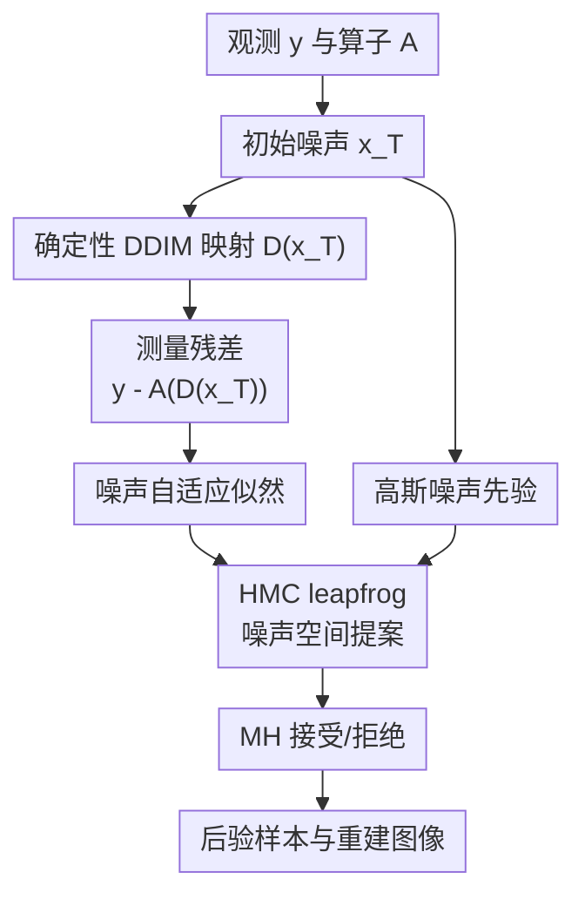

# Noise-Adaptive Diffusion Sampling for Inverse Problems Without Task-Specific Tuning

**会议**: ICLR2026  
**OpenReview**: [https://openreview.net/forum?id=Yfk4ex3Z1G](https://openreview.net/forum?id=Yfk4ex3Z1G)  
**代码**: https://github.com/NA-HMC/NA-HMC  
**领域**: 图像复原  
**关键词**: 扩散逆问题, 后验采样, Hamiltonian Monte Carlo, 未知噪声, 图像复原

## 一句话总结
这篇论文把扩散模型逆问题求解从“中间图像状态上加数据一致性梯度”改成“在 DDIM 初始噪声空间做 HMC 后验采样”，并通过边缘化未知测量噪声得到 NA-NHMC，在超分、修复、去模糊、相位恢复和 HDR 等图像逆问题上无需任务级调参就取得更稳健的重建质量。

## 研究背景与动机

**领域现状**：扩散模型已经成为图像逆问题的一类强先验。给定观测 $y=A(x)+\eta$，常见任务包括超分辨率、随机 inpainting、去模糊、相位恢复和 HDR 重建；核心目标是在满足测量一致性的同时，让重建图像仍落在自然图像分布上。现有扩散逆问题方法大致分成两类：一类在反向扩散每一步用似然梯度修正中间状态，另一类把扩散模型当作正则器或生成器，做 MAP 优化。

**现有痛点**：第一类 guidance 方法需要近似 $p(y|x_t)$，通常把测量一致性梯度直接加到中间噪声图像 $x_t$ 上。问题是扩散 denoiser 只在训练分布的噪声流形附近见过这些状态，而似然梯度可能有很大一部分指向流形外，久而久之会把 $x_t$ 推到低概率区域，导致伪影累积。第二类 MAP 方法可以得到锐利图像，但容易为了拟合观测而拟合噪声；当噪声水平高或未知时，早停、步长、数据一致性权重都要针对任务重新调。还有像 DMPlug 这样在初始噪声空间优化的方法，虽然避免了中间状态漂移，但确定性优化会卡在单一局部模式，尤其是相位恢复这种多模态问题。

**核心矛盾**：这篇论文抓住的矛盾是，逆问题既需要“探索”完整后验，又不能破坏扩散模型学到的数据流形。若在图像空间或中间扩散状态上强行贴近观测，容易 off-manifold；若只做单点优化，又容易陷入局部最优或过拟合噪声。一个理想解法应该只在扩散模型自然的潜变量空间中移动，同时显式采样 $p(x|y)$ 而不是只寻找一个 MAP 解。

**本文目标**：作者希望解决三个具体问题：一是避免中间扩散状态被测量梯度推离训练流形；二是在病态或多模态逆问题中能探索多个可能解，而不是卡在一个局部模式；三是在测量噪声类型和水平未知时，不再依赖任务专属的似然权重、早停阈值或人工调参。

**切入角度**：DDIM 的确定性采样给了一个关键观察：如果反向扩散过程固定为确定性映射 $D$，那么初始噪声 $x_T$ 可以被看成唯一潜变量，干净图像就是 $\hat{x}_0=D(x_T)$。这样逆问题不必在每个中间时间步近似 $p(y|x_t)$，而可以直接在初始噪声空间中评估 $p(y|D(x_T))$。

**核心 idea**：用 Hamiltonian Monte Carlo 在 DDIM 初始噪声空间采样后验，并用 Jeffreys 非信息先验边缘化未知噪声方差，让数据一致性强度随残差自动归一化。

## 方法详解

### 整体框架
N-HMC 把预训练扩散模型看成一个确定性生成器：从标准高斯噪声 $x_T\sim\mathcal{N}(0,I)$ 出发，经少步 DDIM 得到图像 $\hat{x}_0=D(x_T)$，再通过已知 forward operator $A$ 生成预测测量 $A(\hat{x}_0)$。因此求解逆问题就变成在 $x_T$ 空间中采样 $p(x_T|y)$，而不是直接更新图像或中间扩散状态。

NA-NHMC 是它的未知噪声版本。对于已知高斯噪声，势能里有普通的平方残差项；对于未知噪声，作者把 $\sigma_y^2$ 当作潜变量，用 Jeffreys prior 积分掉，最终得到一个不需要指定噪声水平的数据项。HMC 每轮先采样动量，再用 leapfrog 在噪声空间推进 proposal，最后用 Metropolis-Hastings 接受/拒绝来修正离散化误差。早期还使用较大的噪声 schedule 促进探索，后期再进入真正的 noise-adaptive 采样。

这个框架里真正的贡献节点有三个：噪声空间后验建模、HMC 探索机制、以及未知噪声下的自适应似然。DDIM 本身、forward operator 和最终重建只是脚手架，但它们让这三个设计能闭环工作。

### 关键设计

**1. 噪声空间后验采样：把“修图像”改成“采初始噪声”**

传统 guidance 方法的问题在于，它们要在扩散中间状态 $x_t$ 上使用 $\nabla_{x_t}\log p(y|x_t)$。可是 $x_t$ 并不是干净图像，$p(y|x_t)$ 本身需要近似；梯度一旦把 $x_t$ 推离对应噪声层的高概率流形，后续 denoiser 就会处理训练时没见过的输入。本文把 DDIM 反向过程写成确定性映射 $\hat{x}_0=D(x_T)$，于是观测似然可以直接写成 $p(y|x_T)=p(y|D(x_T))$。在已知高斯噪声下，它对应

$$
\log p(y|x_T)=-\frac{\|y-A(D(x_T))\|^2}{2\sigma_y^2}+\text{const}.
$$

这样做的好处是，HMC 的所有更新都发生在初始噪声 $x_T$ 上，而每一个 proposal 都会通过完整的 DDIM 轨迹映射回干净图像。换句话说，方法没有在中间扩散层“硬拽”状态，而是只改变生成器的输入；只要 DDIM 映射本身来自预训练扩散模型，输出就更自然地受数据流形约束。与此同时，噪声先验 $p(x_T)=\mathcal{N}(0,I)$ 很简单，score 直接是 $-x_T$，比在图像空间手写复杂先验更干净。

**2. HMC 替代 MAP 优化：用动量探索多模态解空间**

如果只在 $x_T$ 上做梯度下降，会变成类似 DMPlug 的确定性 MAP 优化：能减少残差，却可能卡在某个局部模式。本文用 HMC 的原因正是高维图像逆问题通常有很多可行解，尤其当 forward operator 丢失相位、遮挡大量像素或强降采样时，后验不是单峰的。HMC 给 $x_T$ 引入辅助动量 $p$，在势能和动能组成的 Hamiltonian 中沿轨道前进，比随机游走式 MCMC 更适合高维空间。

在 N-HMC 中，当前 Hamiltonian 可以理解为三项相加：噪声先验能量 $\frac{1}{2}\|x_T\|^2$、测量残差能量 $\frac{1}{2\sigma_y^2}\|y-A(D(x_T))\|^2$、动量能量 $\frac{1}{2}p^\top p$。leapfrog 更新会交替更新动量和位置，最后用 MH 接受概率 $\min(1,\exp(H_0-H_1))$ 修正数值误差。若 proposal 被拒绝，作者还会用因子 $\gamma$ 衰减步长，避免在低后验概率初始区域一直失败。

这个设计的关键不是“把优化器换成采样器”这么简单，而是把正则化、探索和详细平衡放进同一个机制里。高斯先验把 $x_T$ 拉回半径约为 $\sqrt{n}$ 的高维球面附近，测量项让样本解释观测，动量轨迹则能跨过较浅局部坑。论文在相位恢复实验中展示，DPS 和 DMPlug 有时能成功，但很多初始化会走到伪解；NA-NHMC 由于早期探索更充分，成功率和初始化鲁棒性更好。

**3. 噪声自适应似然：用边缘化替代手调噪声权重**

现实逆问题最麻烦的一点是，测量噪声的类型和水平经常未知。很多方法把这个不确定性转嫁给超参数：比如数据一致性权重、早停阈值、采样步长或人为缩小的 $\hat{\sigma}_y$。本文的 NA-NHMC 选择从贝叶斯建模上处理它：令 $\sigma_y^2$ 服从 Jeffreys prior $p(\sigma_y^2)\propto 1/\sigma_y^2$，再对噪声方差积分。

边缘化后，似然从固定方差的高斯形式变成

$$
p(y|x_T)\propto \left(\frac{1}{2}\|y-A(D(x_T))\|^2\right)^{-m/2},
$$

其中 $m$ 是测量维度。对应的 Hamiltonian 不再需要 $\sigma_y$，而使用 $\frac{m}{2}\log\|y-A(D(x_T))\|^2$ 作为数据项。它的梯度相当于用当前残差大小自动归一化：残差大时不过度放大数据项，残差小时也不会无限追噪声。作者进一步证明，在生成先验局部近似良好且 $\sigma_0/\sigma_y\ll1$ 的条件下，这个自适应梯度会与已知真实噪声水平的 N-HMC 梯度一致。

这解释了论文实验里的一个重要现象：同一套 NA-NHMC 超参数可以跨任务、跨噪声水平使用，而不像 DPS 的学习率 $\zeta_i$ 那样在不同任务间从 0.4 到 10.0 变化。Figure 2 还显示，在 Gaussian deblur 上，估计噪声标准差 $\|y-A(\hat{x}_0)\|/\sqrt{m}$ 会贴近真实 $\sigma_y$，说明它并不是靠过拟合观测残差取胜。

**4. 早期噪声退火：先放开探索，再收紧到后验**

HMC 从随机 $x_T$ 初始化时，初始点可能在非常低的后验区域。如果一开始就用目标噪声水平，测量项会很陡，HMC 为了维持接受率只能使用很小步长，探索会变慢甚至卡住。作者因此在采样早期使用较大的有效噪声 $\sigma_{y,k}$，让数据项先弱一些，允许轨迹在噪声空间跨得更远；等链条进入更合理区域后，再切换到目标或 noise-adaptive 似然。

默认实现里，除相位恢复外使用 $L=20$、初始步长 $\delta_0=0.05$、衰减因子 $\gamma=0.95$，前 10 个 HMC iterations 用退火 schedule，之后进入 Algorithm 3。相位恢复更病态，所以初始步长改为 $0.2$，并用更长的 50 轮退火。这个设计主要服务于多模态和高度病态任务：早期不要太快被某个局部模式吸住，后期再让测量一致性逐渐变强。

### 损失函数 / 训练策略
本文不是训练一个新扩散模型，而是直接使用预训练 diffusion model 作为先验，因此核心“训练策略”其实是推理时的采样配置。DDIM 只用两个 denoising steps，时间步为 $[375,750]$，这是为了在反向传播通过 denoising 轨迹时控制显存和时间成本。作者在附录中说明，two-step DDIM 的基线开销约为 90 秒和 3.63GB 显存；每增加一个 diffusion step，大约多 45 秒和 1.84GB，三步虽略好但收益很小。

已知噪声 N-HMC 的势能为

$$
U(x_T)=\frac{1}{2}\|x_T\|^2+\frac{1}{2\sigma_y^2}\|y-A(D(x_T))\|^2.
$$

未知噪声 NA-NHMC 则替换成

$$
U_{NA}(x_T)=\frac{1}{2}\|x_T\|^2+\frac{m}{2}\log\left(\|y-A(D(x_T))\|^2\right).
$$

前者适用于知道高斯噪声标准差的理想场景，后者是主推版本，实验中用于未知噪声类型和水平。因为方法需要对 $D(x_T)$ 反向传播，所以算力成本高于 DPS 这类简单 guidance 方法，但换来的是更稳定的后验探索和更少任务级调参。

## 实验关键数据

### 主实验
论文在 FFHQ 256×256 和 ImageNet 256×256 上评估 100 张验证图像，使用 PSNR、SSIM 和 LPIPS 衡量重建质量。任务包括四个线性逆问题：4×/16× 超分、92% 随机 inpainting、各向异性 Gaussian deblurring；以及三个非线性逆问题：nonlinear deblurring、phase retrieval、HDR reconstruction。下面摘取最能体现差异的非线性任务结果。

| 数据集 / 噪声 | 任务 | 指标 | 本文 NA-NHMC | 之前最好或代表性 SOTA | 提升 / 观察 |
|--------|------|------|------|------|------|
| FFHQ, $\sigma_y=0.05$ | Nonlinear Deblurring | PSNR / SSIM / LPIPS | 27.66 / 0.792 / 0.249 | DMPlug 27.15 / 0.784 / 0.266 | 三个指标均更好 |
| FFHQ, $\sigma_y=0.05$ | Phase Retrieval | PSNR / SSIM / LPIPS | 19.30 / 0.554 / 0.482 | DAPS 18.52 / 0.414 / 0.528 | 病态多模态任务提升明显 |
| FFHQ, $\sigma_y=0.05$ | HDR Reconstruction | PSNR / SSIM / LPIPS | 28.45 / 0.849 / 0.217 | DPS 27.46 / 0.849 / 0.168 | PSNR 最好，LPIPS 不如 DPS |
| ImageNet, $\sigma_y=0.05$ | Nonlinear Deblurring | PSNR / SSIM / LPIPS | 24.98 / 0.694 / 0.308 | DAPS 24.28 / 0.632 / 0.404 | 三个指标均更好 |
| ImageNet, $\sigma_y=0.05$ | HDR Reconstruction | PSNR / SSIM / LPIPS | 25.86 / 0.779 / 0.253 | DPS 25.31 / 0.763 / 0.248 | PSNR/SSIM 更好，LPIPS 接近 |
| FFHQ, $\sigma_y=0.20$ | Nonlinear Deblurring | PSNR / SSIM / LPIPS | 24.89 / 0.705 / 0.317 | DiffPIR 23.34 / 0.641 / 0.374 | 高噪声下优势扩大 |
| FFHQ, $\sigma_y=0.20$ | HDR Reconstruction | PSNR / SSIM / LPIPS | 26.61 / 0.793 / 0.271 | DPS 24.92 / 0.703 / 0.321 | 三个指标均更好 |

线性任务上，NA-NHMC 也大多有竞争力，但并不是每个指标都第一。例如 FFHQ、$\sigma_y=0.05$ 的 4× 超分中，SITCOM 的 PSNR/SSIM 为 27.35/0.787，NA-NHMC 为 27.29/0.770；但在 Gaussian deblurring 上，NA-NHMC 以 28.36/0.798/0.259 超过其他方法。这个结果说明本文最强的卖点不是“所有低噪声线性任务都碾压”，而是在高噪声、非线性和多模态逆问题上更稳。

### 消融实验
| 配置 / 分析 | 关键指标 | 说明 |
|------|---------|------|
| HMC step size $\epsilon=0.02\to0.20$ | SR×4 FFHQ PSNR 27.12 到 27.31，SSIM 0.745 到 0.772 | 性能对步长不敏感，说明 MH 接受/拒绝和步长衰减能缓解调参压力 |
| Leapfrog steps $L=10\to30$ | PSNR 26.86 到 27.34，LPIPS 0.318 到 0.281 | 更多 leapfrog 带来更充分探索，但收益逐渐变小 |
| 衰减因子 $\gamma=0.91\to0.99$ | PSNR 基本在 27.29 到 27.31，LPIPS 在 0.288 到 0.291 | 步长衰减因子几乎不影响最终结果 |
| HMC iterations | 约 120 轮后质量开始平台化 | 与 MAP 方法不同，继续采样没有明显过拟合退化 |
| Diffusion steps | two-step DDIM 约 90 秒 / 3.63GB；每多一步约 +45 秒 / +1.84GB | 三步略好但成本增加约 50%，主实验采用两步 |
| 时间步 schedule $[375,750]$ | SR×4 FFHQ PSNR 27.29，SSIM 0.770 | 避免从纯高斯端点开始带来的数值不稳定 |

### 未知噪声鲁棒性
| 任务 | 噪声类型 | 指标 | 本文 NA-NHMC | 最强对比方法 | 观察 |
|------|------|------|------|------|------|
| Super Resolution ×4 | Impulse | PSNR / SSIM / LPIPS | 23.42 / 0.631 / 0.382 | ReSample 22.98 / 0.639 / 0.483 | PSNR 和 LPIPS 最好，SSIM 略低 |
| Super Resolution ×4 | Speckle | PSNR / SSIM / LPIPS | 27.36 / 0.768 / 0.290 | DPS 27.00 / 0.761 / 0.246 | PSNR/SSIM 最好，LPIPS 不如 DPS |
| Nonlinear Deblurring | Impulse | PSNR / SSIM / LPIPS | 24.16 / 0.677 / 0.319 | DMPlug 23.79 / 0.662 / 0.335 | 三个指标均最好 |
| Nonlinear Deblurring | Speckle | PSNR / SSIM / LPIPS | 27.97 / 0.796 / 0.253 | SITCOM 26.49 / 0.667 / 0.295 | 三个指标均最好 |

### 关键发现
- NA-NHMC 的优势在非线性、高噪声和未知噪声场景最明显，符合它“后验探索 + 噪声自适应”的定位。
- 在 phase retrieval 中，退火 schedule 对避免局部模式很关键；论文报告 NA-NHMC 在 100 次独立运行中的像素级标准差更低，DPS 虽平均误差可接近，但初始化敏感且会出现伪影。
- 线性低噪声任务上，NA-NHMC 与 SITCOM、DPS、DMPlug 等方法互有胜负，因此不能简单概括为所有任务 SOTA；更准确的结论是它用一套超参数获得跨任务稳健表现。
- 未知 impulse / speckle 噪声下，NA-NHMC 没有改超参数仍保持强结果，说明边缘化噪声方差确实提供了自动归一化的数据项。

## 亮点与洞察
- 最巧妙的地方是把“流形可行性”问题转移到 latent/noise space：不再让似然梯度直接污染中间扩散状态，而是只移动 DDIM 初始噪声。这让扩散模型先验更像一个固定生成器，而不是一个随时被外力打断的 denoising chain。
- HMC 在这里不是炫技，而是针对逆问题多模态性的自然选择。相位恢复等任务存在大量局部模式，确定性优化容易挑错一个；HMC 的动量轨迹和 MH 修正更适合在高维后验里走远一些。
- Jeffreys prior 的使用把一个工程调参问题变成了一个可解释的贝叶斯边缘化问题。最终 $\log\|y-A(D(x_T))\|^2$ 数据项可以看作残差自归一化，避免了“噪声越大越想把噪声拟合干净”的过拟合倾向。
- 论文对方法局限没有回避：HMC 的 warmup 和反向传播成本确实更高，因此它更适合重建质量、鲁棒性和不调参比速度更重要的场景。
- 这个思路可以迁移到其他生成先验逆问题：只要有一个确定性生成映射 $D(z)$ 和可微 forward operator $A$，就可以考虑在 $z$ 空间做后验采样，并把未知噪声方差边缘化。

## 局限与展望
- 计算成本高于 DPS 等 guidance 方法。每个 HMC proposal 都要通过 DDIM 映射并反向传播，虽然作者用 two-step DDIM 控制了成本，但 warmup 仍可能很长。
- 方法依赖 forward operator $A$ 可微或至少能对 $A(D(x_T))$ 反向传播。对于不可微、黑盒或离散测量过程，直接套用会遇到困难。
- 理论分析使用了局部高斯近似和近似线性的 forward operator 假设，真实图像流形和复杂非线性成像过程未必完全满足这些条件。
- NA-NHMC 假设未知噪声的处理从高斯似然和 Jeffreys prior 出发，虽然 impulse / speckle 实验表现不错，但这更多是经验鲁棒性，不等于对任意噪声分布都有理论保证。
- 目前实验主要是 256×256 图像逆问题。更高分辨率、视频、3D 或医学成像中的复杂物理 forward model 会放大 HMC 的显存和时间压力。
- 后续可以探索更高效的梯度估计、更快的 warmup、预条件质量矩阵，或用学习到的 proposal 来减少 HMC 采样成本。

## 相关工作与启发
- **vs DPS / DDNM / DDRM / PiGDM / TMPD**: 这些方法在扩散中间状态上做 measurement guidance，优点是直接、实现简单，但需要近似 $p(y|x_t)$，容易破坏 manifold feasibility。本文把似然放到 $D(x_T)$ 上计算，避免了中间状态漂移。
- **vs DAPS**: DAPS 名义上是 posterior sampling，但使用比真实值小的启发式 $\hat{\sigma}_y$ 来增强测量一致性，因此在高噪声下会带有 MAP-like 倾向。NA-NHMC 通过边缘化未知噪声方差自动调整数据项强度。
- **vs ReSample / DiffPIR / SITCOM**: 这些方法通常能在低噪声下得到锐利重建，但对优化步数、早停和任务参数敏感。本文更强调一套固定超参数跨任务运行。
- **vs DMPlug**: DMPlug 同样注意到噪声空间的好处，但它做的是确定性优化，容易局部模式坍缩。N-HMC/NA-NHMC 保留噪声空间建模，同时用 HMC 采样完整后验。
- **对研究的启发**: 对扩散逆问题而言，“在哪个空间施加数据一致性”可能比“数据一致性项写得多复杂”更关键。若后续做医学成像、科学计算或机器人感知中的 inverse problem，可以优先考虑 latent/noise-space posterior sampling，而不是直接在生成过程内部插梯度。

## 评分
- 新颖性: ⭐⭐⭐⭐⭐ 噪声空间 HMC 和未知噪声边缘化结合得很自然，针对扩散逆问题的三个痛点给出了统一解释。
- 实验充分度: ⭐⭐⭐⭐⭐ 覆盖 FFHQ/ImageNet、线性/非线性、高斯/非高斯噪声，并有超参敏感性、步数和初始化鲁棒性分析。
- 写作质量: ⭐⭐⭐⭐☆ 论文结构清楚，图示有效；但理论假设和 NA-NHMC 公式推导对非贝叶斯读者略密集。
- 价值: ⭐⭐⭐⭐⭐ 对“不知道噪声水平还要解逆问题”的实际场景很有价值，尤其适合重建质量和稳健性优先的图像复原任务。

<!-- RELATED:START -->

## 相关论文

- [\[ICLR 2026\] Adaptive Moments are Surprisingly Effective for Plug-and-Play Diffusion Sampling](adaptive_moments_are_surprisingly_effective_for_plug-and-play_diffusion_sampling.md)
- [\[ICLR 2026\] Flower: A Flow-Matching Solver for Inverse Problems](flower_a_flow-matching_solver_for_inverse_problems.md)
- [\[CVPR 2026\] Outlier-Robust Diffusion Solvers for Inverse Problems](../../CVPR2026/image_restoration/outlier-robust_diffusion_solvers_for_inverse_problems.md)
- [\[ICML 2026\] Triadic Dynamics Aware Diffusion Posterior Sampling for Inverse Problems: Optimizing Guidance and Stochasticity Schedules](../../ICML2026/image_restoration/triadic_dynamics_aware_diffusion_posterior_sampling_for_inverse_problems_optimiz.md)
- [\[ICLR 2026\] CL-DPS: A Contrastive Learning Approach to Blind Nonlinear Inverse Problem Solving via Diffusion Posterior Sampling](cl-dps_a_contrastive_learning_approach_to_blind_nonlinear_inverse_problem_solvin.md)

<!-- RELATED:END -->
