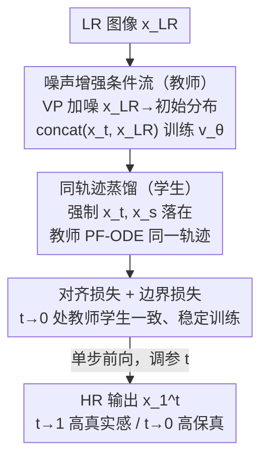

# One-Step Flow for Image Super-Resolution with Tunable Fidelity-Realism Trade-offs

**会议**: ICLR2026  
**OpenReview**: [https://openreview.net/forum?id=5iaeagjfjK](https://openreview.net/forum?id=5iaeagjfjK)  
**代码**: [https://github.com/yuanzhi-zhu/OFTSR](https://github.com/yuanzhi-zhu/OFTSR)  
**领域**: 图像超分辨率 / 图像恢复 / 扩散与流模型蒸馏  
**关键词**: 一步超分, rectified flow, 扩散蒸馏, 感知-失真权衡, 噪声增强

## 一句话总结
OFTSR 把一个噪声增强的条件 rectified flow 教师蒸馏成单步学生，并要求学生在不同时刻 $t$ 的预测落在教师同一条 PF-ODE 轨迹上，从而在**一次前向**里就能通过调节单个参数 $t$ 连续滑动 fidelity（保真）与 realism（真实感）之间的权衡，在 FFHQ / DIV2K / ImageNet 及真实超分数据集上取得一步超分的 SOTA。

## 研究背景与动机
**领域现状**：扩散与流模型在图像超分（SR）上已经能产出比 GAN / VAE 更高感知质量的结果。主流分两类：训练无关方法（把条件概率拆成先验项 + 似然项，用预训练无条件扩散当正则）和训练相关方法（用成对数据直接学条件分布，或在大生成先验上加控制模块）。

**现有痛点**：这些方法要么需要几十到上千步迭代采样才能得到高感知质量（计算开销大），要么靠常规蒸馏压成单步、但蒸出来的模型把 fidelity-realism 的权衡点**钉死成一个固定值**，失去了灵活性。

**核心矛盾**：感知-失真权衡（perception-distortion trade-off，Blau & Michaeli 2018）在数学上被证明不可兼得——同一个输出不可能既高保真又高真实感。多步扩散其实是用「调 NFE 步数」来换取这个权衡（步数少→回归均值、低失真；步数多→细节丰富、高感知），可一旦蒸成单步，这个调节旋钮就没了。而医学影像、遥感、影视修复这些场景恰恰需要不同的保真/真实感配比。

**本文目标**：要同时拿到「一步推理的效率」和「可连续调节 fidelity-realism 的灵活性」这两件原本互相冲突的东西。

**切入角度**：作者观察到，沿教师的 ODE 采样轨迹，从不同中间状态 $x_t$ 做单步估计天然落在一条 fidelity-realism 曲线上——$t$ 越接近 1 细节越丰富（低 LPIPS、高 realism），$t$ 越接近 0 越平滑（低 MMSE、高 PSNR、高 fidelity）。如果让单步学生把这条曲线「背」下来，就能用一个参数复现整条权衡曲线。

**核心 idea**：先训一个噪声增强的条件 rectified flow 当教师，再用「同一 ODE 轨迹约束」把它蒸成单步学生，使学生在任意 $t$ 的单步预测都对齐教师 PF-ODE 上对应点，从而保留可调权衡。

## 方法详解

### 整体框架
OFTSR 是一个两阶段管线。**第一阶段**训练一个噪声增强的条件 rectified flow $v_\theta$ 作为教师：把加噪后的 LR 图像当作流的初始分布、把干净 LR 当作条件，让模型学会从「一个 LR」出发重建出多样的 HR，这步同时也是一个独立可用的多步 SR 模型。**第二阶段**把教师蒸馏成单步学生 $v_\phi$：核心约束是，给定同一输入，学生在两个时刻 $t<s$ 给出的隐式中间状态 $x_t,x_s$ 必须落在教师的 PF-ODE 轨迹上（即 $x_s = x_t+(s-t)v_\theta$）；再叠加对齐损失与边界损失稳定训练。**推理时**学生一次前向就输出 $x_1^t = x_0+v_\phi(x_0,x_{LR},t)$，通过调节 $t$ 在保真与真实感之间连续滑动。

### 关键设计

**1. 噪声增强的条件 rectified flow：给「一对一坍缩」的映射注入多样性**

直接学一个把 LR 分布映射到 HR 分布的流听起来很自然，但作者的初始实验（Tab. 7 中 $\sigma_p=0$）发现效果很差：LR→HR 的映射会坍缩，推理时每个 LR 都被推向同一个 HR，细节糊成一团（FID 110、LPIPS 0.244）。原因是 LR 初始分布的支撑太「窄」，模型学不到生成多样高频细节的能力。为此本文对 LR 做方差保持（VP）加噪来扩展初始分布支撑：$x_0=\sqrt{1-\sigma_p^2}\,x_{LR}+\sigma_p\epsilon$，再把干净 $x_{LR}$ 沿通道维 concat 进网络作为条件来补偿加噪带来的信息损失，训练目标为 $L_{flow}(\theta)=\mathbb{E}\!\int_0^1 D\big(v_\theta(x_{t,LR},t),\,x_1-x_0\big)\,dt$，其中 $x_{t,LR}=\mathrm{concat}(x_t,x_{LR})$。这个 VP 形式很统一：$\sigma_p=0$ 退化为 InDI 的最小增强，$\sigma_p=1$ 等价于 SR3 的训练策略。消融显示加噪是「感知质量」的开关（$\sigma_p$ 从 0 到 0.001 就让 LPIPS 从 0.244 骤降到 0.115），但加得越多 PF-ODE 越弯、求解越费 NFE，作者最终取 $\sigma_p=0.1$ 平衡质量与效率，且 $\ell_1$ loss 优于 $\ell_2$。

**2. 同一 ODE 轨迹约束的一步蒸馏：把整条权衡曲线背进单步学生**

这是全文的核心。常规蒸馏只学终点，会把权衡点钉死；本文转而约束「学生的中间预测必须躺在教师 PF-ODE 上」。具体地，学生用单步给出任意时刻的隐式状态 $x_t=x_0+t\,v_\phi(x_0,x_{LR},t)$；对 $t<s$，要求 $x_s=x_t+(s-t)v_\theta(x_{t,LR},t)$（教师一步欧拉推进）。两式联立得到对学生的约束 $s\big(v_\phi(x_{0,LR},s)-v_\phi(x_{0,LR},t)\big)=(s-t)\big(v_\theta(x_{t,LR},t)-v_\phi(x_{0,LR},t)\big)$。仿照 BOOT 取 $dt=s-t$，并对一项做 stop-gradient 稳定训练，得到蒸馏损失

$$L_{distill}(\phi)=\mathbb{E}\Big\|v_\phi(x_{0,LR},s)-\mathrm{SG}\big[v_\phi(x_{0,LR},t)+\tfrac{dt}{s}\big(v_\theta(x_{t,LR},t)-v_\phi(x_{0,LR},t)\big)\big]\Big\|_2^2 .$$

因为 $s-t=dt$ 且 $t>0$，不存在 PINN 蒸馏里「除以 0」的数值问题；教师 $v_\theta$ 用 Euler 或 RK2（主实验用 midpoint）求解。与 BOOT 用 Signal-ODE 不同，OFTSR 直接约束学生的隐式预测 $x_t$ 落在教师 PF-ODE 上，推导更简洁、蒸馏 gap 更小（Tab. 8 中本文损失比 BOOT 的 LPIPS 好 0.1 以上：0.064 vs 0.483）。这套约束的副产物正是可调性——因为学生背下了教师整条轨迹，推理时换个 $t$ 就换一个权衡点。

**3. 对齐损失 + 边界损失：把教师学生在轨迹与边界上钉到一起**

只靠 $L_{distill}$ 还不够稳。作者要求学生输出 $x_0+v_\phi(x_{0,LR},t)$ 与教师基于学生中间态 $x_t$ 再推进得到的 $x_t+(1-t)v_\theta(x_{t,LR},t)$ 尽量一致，得到对齐损失 $L_{align}(\phi)=\mathbb{E}\big\|(1-t)\big(v_\phi(x_{0,LR},t)-v_\theta(x_{t,LR},t)\big)\big\|_2^2$；当只取 $t=0$ 时它退化为 BOOT 式的边界损失 $L_{BC}(\phi)=\mathbb{E}\|v_\phi(x_{0,LR},0)-v_\theta(x_{0,LR},0)\|_2^2$。由于训练中很难恰好采到 $t=0$，作者额外单独加这一项保证边界一致。三者合成最终目标 $L(\phi)=L_{distill}+\lambda_{align}L_{align}+\lambda_{BC}L_{BC}$。消融表明对齐与边界损失都带来小幅提升，配合 Midpoint 二阶 solver 效果最好。

### 一个完整示例
以一张噪声 4× 超分的人脸为例（对应论文 Fig. 3）：单步学生固定输入、只改 $t$，输出在一条连续曲线上滑动——$t=0$ 时 LPIPS/PSNR = 0.438/27.48（最平滑、最保真但糊），随 $t$ 增大依次给出 0.157/30.02、0.142/29.88、0.120/29.56、0.090/28.92，到 $t=1$ 时 0.055/27.66（细节最丰富、最真实但 PSNR 回落）。整条过渡都来自**同一个单步网络**的一次前向 + 一个标量 $t$，无需重训、无需多步采样，这就是「一步 + 可调」同时成立的直观体现。

### 损失函数 / 训练策略
第一阶段优化 $L_{flow}$（$\ell_1$ discrepancy，$\sigma_p=0.1$，VP 加噪 + LR 条件）。第二阶段优化 $L(\phi)=L_{distill}+\lambda_{align}L_{align}+\lambda_{BC}L_{BC}$，其中蒸馏步长 $dt=0.05$、教师用 Midpoint RK2 求解、对 $\mathrm{SG}$ 项停梯度。教师可以是自训练的（Guided Diffusion / ResShift backbone）或现成模型（DiT4SR / ResShift），蒸馏框架对任意预训练条件扩散或流的经验 PF-ODE 都适用。

## 实验关键数据

### 主实验
4× 超分，对比不同方法的 PSNR / LPIPS / FID 与 NFE（步数）。OFTSR distilled 仅需 **1 步**，通过 $t$ 在保真与真实感间切换：

| 数据集 | 方法 | NFE | PSNR↑ | LPIPS↓ | FID↓ |
|--------|------|-----|-------|--------|------|
| DIV2K | InDI | 100 | 26.45 | 0.136 | 15.39 |
| DIV2K | **Ours distilled (t=1)** | 1 | 26.87 | **0.127** | 14.58 |
| DIV2K | **Ours distilled (t=0)** | 1 | **28.99** | 0.271 | 18.07 |
| FFHQ (σ=0) | DiffPIR | 100 | 29.13 | 0.073 | 44.49 |
| FFHQ (σ=0) | **Ours distilled (t=1)** | 1 | 28.98 | **0.055** | 36.02 |
| FFHQ (σ=0) | **Ours distilled (t=0)** | 1 | **31.25** | 0.150 | 66.76 |
| ImageNet | CDDB | 100 | 23.64 | 0.191 | 58.25 |
| ImageNet | **Ours distilled (t=1)** | 1 | 24.20 | **0.135** | 52.69 |
| ImageNet (多步) | **Ours** | 26 | 23.35 | **0.132** | **46.88** |

要点：单步 $t=1$ 的 LPIPS/FID 普遍优于需要 20–100 步的训练无关方法；切到 $t=0$ 后 PSNR 大幅领先（如 FFHQ 31.25 dB），印证一个模型覆盖整条权衡曲线。真实超分（RealSR / ImageNet 退化）上单步 $t=1$ 的无参考指标（NIQE/MUSIQ/MANIQA/CLIPIQA）也优于 15 步的 ResShift 与 1 步的 SinSR。

### 消融实验

| 配置 | 关键指标 | 说明 |
|------|---------|------|
| $\sigma_p=0$（无加噪） | LPIPS 0.244 / FID 110.3 | 映射坍缩，感知质量崩 |
| $\sigma_p=0.1$（最终选择） | LPIPS 0.053 / FID 30.5 | 质量-效率平衡点 |
| $\sigma_p=0.1$ no cond | LPIPS 0.073 / FID 42.5 | 去掉 LR 条件明显变差 |
| $\sigma_p=0.1$ ℓ2 | LPIPS 0.055 | ℓ2 略逊于 ℓ1 |
| 蒸馏损失 = BOOT | LPIPS 0.483 | 比本文差 0.1+ |
| 蒸馏损失 = PINN | LPIPS 0.250 | 同样明显落后 |
| 本文损失 + Midpoint + align/BC | LPIPS 0.055–0.056 | 最优组合 |

### 关键发现
- **加噪是感知质量的总开关**：$\sigma_p$ 从 0 调到 0.001，LPIPS 直接从 0.244 掉到 0.115；但加太多会让 PF-ODE 更弯、求解更费 NFE，所以不是越大越好。
- **同轨迹约束远胜常规蒸馏**：本文蒸馏损失相对 BOOT、PINN 把 LPIPS 改善 0.1 以上，说明「约束隐式中间态落在教师 PF-ODE 上」比直接学终点或 Signal-ODE 更贴合教师。
- **步长 $dt$ 不是越小越好**：作者实验后选 $dt=0.05$；过小反而效果差。
- **LR 条件不可省**：去掉条件 concat 后 LPIPS 从 0.053 退到 0.073，验证条件用于补偿加噪信息损失。

## 亮点与洞察
- **把「多步扩散的 NFE 旋钮」翻译成「单步网络的标量 $t$」**：原本要靠步数才能换的 fidelity-realism 权衡，被压进一个单步模型的输入参数里，推理一次、调参即用，这是最「啊哈」的点。
- **蒸馏目标的几何直觉干净**：不学终点而是「让学生隐式中间态躺在教师轨迹上」，既给出可调性，又天然规避 PINN 的除零问题，推导比 BOOT 更简洁。
- **VP 加噪统一了已有方法**：$\sigma_p=0$↔InDI、$\sigma_p=1$↔SR3，把一族条件流方法收进一个参数轴，便于系统分析噪声强度与质量/效率的关系。
- **可迁移性**：蒸馏框架对任意预训练条件扩散/流的经验 PF-ODE 都适用（论文直接蒸了现成 DiT4SR、ResShift），这套「同轨迹约束 + 对齐/边界损失」可搬到其他一步图像翻译任务。

## 局限与展望
- **权衡曲线由教师决定**：学生能调的范围被教师 PF-ODE 形状框死，若教师本身权衡曲线不够宽，学生的可调区间也有限。
- **真实超分极端 $t$ 表现下滑**：在 RealSR/ImageNet 退化上 $t=0.5、t=0$ 的无参考指标（如 NIQE、MANIQA）明显变差，说明可调性在真实退化下偏向 $t\to1$ 一端更可靠。
- **仍需训练教师**：相比纯训练无关方法，OFTSR 需要先训（或拿到）一个条件流教师再蒸馏，自训练大先验（如 SD-based）成本高，只能蒸现成模型。
- **改进思路**：探索如何在蒸馏阶段主动「拉宽」可用权衡区间，或让 $t$ 的语义在真实退化下更稳定。

## 相关工作与启发
- **vs BOOT**：BOOT 让学生满足 Signal-ODE、面向文生图扩散；OFTSR 直接约束学生隐式预测落在教师 PF-ODE 上、基于 rectified flow，推导更简洁、SR 任务上蒸馏 gap 更小、权衡可调（LPIPS 0.064 vs 0.483）。
- **vs DAVI**：DAVI 用 VSD + 数据一致性训练单步 SR，但需额外训一个 fake score 跟踪生成器的去噪 score，训练效率低；OFTSR 不需要 fake score。
- **vs SinSR**：SinSR 蒸馏 ResShift 达到接近教师的性能，但训练时要模拟教师整条 ODE 轨迹、开销大；OFTSR 只需单步对齐约束。
- **vs InDI / SR3**：二者分别对应本文 VP 形式的 $\sigma_p=0$ 与 $\sigma_p=1$ 特例，OFTSR 把噪声强度作为可分析的连续轴并系统研究其对质量/效率的影响。

## 评分
- 新颖性: ⭐⭐⭐⭐⭐ 用「同轨迹约束」把可调 fidelity-realism 装进单步模型，在扩散/流 SR 中是新能力。
- 实验充分度: ⭐⭐⭐⭐⭐ 覆盖 FFHQ/DIV2K/ImageNet + 多个真实超分集，含 $\sigma_p$、蒸馏损失、solver、$dt$ 等系统消融。
- 写作质量: ⭐⭐⭐⭐ 推导清晰、图示直观，但符号与多套损失稍密集需细读。
- 价值: ⭐⭐⭐⭐⭐ 一步效率 + 可调权衡对医学/遥感/影视修复等差异化需求很实用，框架可迁移。

<!-- RELATED:START -->

## 相关论文

- [\[CVPR 2026\] IFCSR: Inference-Free Fidelity-Realism Control for One-Step Diffusion-based Real-World Image Super-Resolution](../../CVPR2026/image_restoration/ifcsr_inference-free_fidelity-realism_control_for_one-step_diffusion-based_real-.md)
- [\[ICLR 2026\] SoFlow: Solution Flow Models for One-Step Generative Modeling](soflow_solution_flow_models_for_one-step_generative_modeling.md)
- [\[CVPR 2026\] FiDeSR: High-Fidelity and Detail-Preserving One-Step Diffusion Super-Resolution](../../CVPR2026/image_restoration/fidesr_high-fidelity_and_detail-preserving_one-step_diffusion_super-resolution.md)
- [\[ICML 2026\] One-Step Residual Shifting Diffusion for Image Super-Resolution via Distillation](../../ICML2026/image_restoration/one-step_residual_shifting_diffusion_for_image_super-resolution_via_distillation.md)
- [\[ICLR 2026\] VARestorer: One-Step VAR Distillation for Real-World Image Super-Resolution](varestorer_one-step_var_distillation_for_real-world_image_super-resolution.md)

<!-- RELATED:END -->
