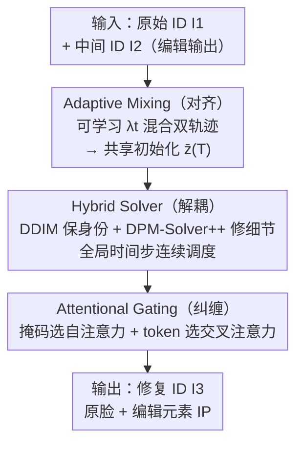

# Optimizing ID Consistency in Multimodal Large Models: Facial Restoration via Alignment, Entanglement, and Disentanglement

**会议**: ICLR 2026  
**OpenReview**: [https://openreview.net/forum?id=ohpsnceMSb](https://openreview.net/forum?id=ohpsnceMSb)  
**代码**: https://github.com/NDYBSNDY/EditedID  
**领域**: 图像恢复 / 扩散模型 / 人脸编辑  
**关键词**: 人脸身份一致性, 扩散反演, 跨源特征解耦, 即插即用, 训练无关

## 一句话总结
EditedID 是一个训练无关、即插即用的扩散反演框架，通过「对齐—解耦—纠缠」三步在不微调任何模型的前提下，把多模态编辑大模型编辑后丢失的人脸身份重新修复回来，同时保留编辑引入的配饰/服饰元素（Element IP），在单人/多人开放场景下取得 SOTA 的 ID 一致性。

## 研究背景与动机

**领域现状**：以 GPT-4o Plus、Flux.1 Kontext、In-Context Edit、InstructPix2Pix 为代表的多模态编辑大模型，能根据自然语言指令对图像做编辑（换发型、戴帽子、换衣服）。它们在卡通/插画上身份保持还行，但一旦面对真人时尚编辑就力不从心。

**现有痛点**：当指令变长、变复杂（如"给他穿浅灰夹克配黑框眼镜"），人脸会出现明显伪影、身份漂移。学术模型（In-Context Edit、InstructPix2Pix）受限于微调数据少，人脸特征抽取弱，长指令下人脸逐步劣化；工业模型（GPT-4o Plus、Qwen-Image-Edit、Flux.1 Kontext）偏重 LLM 文本可控性，忽略人脸几何约束，容易生成随机身份。由于人眼对人脸极其敏感，哪怕轻微的身份偏移都让结果不可用。而真实人脸数据集的保密性又让"针对性微调"几乎不可行。

**核心矛盾**：作者把现有人脸一致性方法（身份保持、盲复原、身份融合、换脸）的失败归因为两类跨源问题——**跨源分布偏差（Cross-source Distribution Bias）**：低分辨率/有限数据学到的身份特征与基础扩散模型的高分辨率分布不匹配，导致细节模糊、卡通化、随机人脸；**跨源特征污染（Cross-source Feature Contamination）**：在融合"原始人脸"和"编辑元素"两路特征时互相污染，把"黑框眼镜"这类细粒度属性丢掉，或在换脸时把原始 ID 丢掉。

**本文目标**：在不训练、不微调、不收集数据的前提下，做到即插即用的人脸身份重建——既要让人脸与**原始 ID（Original ID）**一致，又要让眼镜/帽子等编辑元素与**中间 ID（Intermediate ID，即编辑大模型的输出）**一致。

**切入角度**：作者从 3D 人脸处理（把眼镜、人脸等元素从不同来源分离、再重新模拟光照位置合成）得到启发，提出 2D 场景下的核心原则 **Alignment–Disentanglement–Entanglement（对齐—解耦—纠缠）**。同时通过系统分析扩散轨迹、采样器行为、注意力性质三个底层机制（论文称之为 Observation 1/2/3）来支撑每一步。

**核心 idea**：不去重新训练，而是**重用预训练扩散模型的反演动力学**——先把双 ID 的潜空间轨迹对齐到统一初始化点，再用混合采样器解耦各自的身份与细节，最后用注意力门控把"原脸 + 新元素"纠缠成修复结果。

## 方法详解

### 整体框架

EditedID 是一个基于"扩散反演 + 重建轨迹"的修复管线。输入是两张图：**原始 ID** $I_1$（要保身份的真人脸）和**中间 ID** $I_2$（编辑大模型输出、带了想要的新元素但人脸坏掉的图，若分辨率低先用 DiffBIR 超分）；输出是修复后的 $I_3$——脸来自 $I_1$、元素来自 $I_2$。整条管线对应三个核心组件，逐一解决三个挑战 C1/C2/C3：先把 $I_1$、$I_2$ 各自的 DDIM 反演轨迹用可学习权重对齐成一个共享初始噪声 $\bar z^{(T)}$（对齐，治分布偏差）；再从这个共享起点用混合采样器分别重建两路 ID、各自保住身份与细节（解耦，治特征污染）；最后在并行扩散生成 $I_3$ 时，用掩码/token 选择性地把 $I_1$ 的人脸注意力与 $I_2$ 的元素注意力替换进去（纠缠，做可控合成）。整个过程训练无关，仅需 6 步扩散、单卡即可运行。

### 关键设计

**1. Adaptive Mixing：用可学习权重对齐双 ID 的反演轨迹（治跨源分布偏差）**

直接用固定权重线性混合 $I_1$、$I_2$ 的反演潜码会两头不讨好：在反演早期（靠近 $z^{(0)}$）过度平均会抹掉各自的源特征；在反演晚期（靠近 $z^{(T)}$）又缺乏自适应、轨迹重叠导致跨源污染。作者基于 Observation 1（扩散轨迹具有"多解性"和"可控性"——多条轨迹可达到同一输出、受控扰动不损保真度）提出 Adaptive Mixing：给每个时间步一个**可学习权重** $\lambda_t \in [0, 0.5]$，用梯度下降最小化对齐损失 $L_{align} = \lVert \hat z^{(t)}_1 - \hat z^{(t)}_2 \rVert_2^2$（学习率 $\eta=0.01$）。反演时两路潜码相互交叉更新：$\hat z^{(t+1)}_1 = (1-\lambda_t)\hat z^{(t)}_1 + \lambda_t \hat z^{(t)}_2$，$\hat z^{(t+1)}_2$ 对称。$\lambda_t$ 初值取小让轨迹平滑过渡；到末段 $t=T$ 强制 $\lambda_t=0.5$ 让两轨迹收敛到统一初始化 $\bar z^{(T)} = (\hat z^{(t)}_1 + \hat z^{(t)}_2)/2$。这样得到一个共享起点 + 两条平滑合并路径，既保留个体特征（脸来自 $I_1$、眼镜来自 $I_2$）又缓解了分布偏差，避免突变伪影。

**2. Hybrid Solver：DDIM 与 DPM-Solver++ 混合采样实现身份-细节解耦（治跨源特征污染）**

对齐到共享初始化后，需要从这个点把两路 ID 各自重建出来。作者扩展 Null-text 优化，给每个 ID 优化各自的无条件嵌入 $\{\varnothing^{(t)}_i\}$ 来最小化重建潜码与对齐状态的 MSE（联合 $i=1,2$ 两路，公式 4）。关键洞察来自 Observation 2：**DDIM 重身份轻细节**（步数多 >50 时身份稳但一阶平滑丢细节），**DPM-Solver++ 重细节轻身份**（步数少 <10 时细节高保真但路径偏移丢身份）。于是 Hybrid Solver 动态切换二者——早期步（近 $\bar z^{(T)}$）用 DDIM 建立稳健身份，晚期步（近 $\bar z^{(0)}$，区间 $[s_1, s_2]$）用 DPM-Solver++ 修复纹理细节（公式 5），既在少步数下高保真重建、又解决了 DDIM 的效率-保真权衡。这里有个非平凡的工程坑：两种采样器的时间步序列计算方式不同，若用"分段预置"调度，会在切换边界（如 $t=4$）出现潜码发散、色差和重建误差。作者改用**全局时间步预置策略**——先把两个调度器的完整时间步序列 $\{\tau_t\}$、$\{\sigma_t\}$ 都预计算好，再按 $t \in [s_1,s_2]$ 取 $\sigma_t$、否则取 $\tau_t$（公式 6），保证整条 $[0\to T]$ 轨迹时间连续、平滑演化。另外要求 DPM-Solver++ 的调用在反演与重建两阶段**对称**，以保证相同噪声级下特征对齐。

**3. Attentional Gating：掩码/token 选择性注意力替换实现多元素纠缠（做可控合成）**

最后从共享潜码 $\bar z^{(T)}$ 并行生成 $I_1$、$I_2$ 和目标 $I_3$，把 $I_1$/$I_2$ 的注意力图选择性替换进 $I_3$。Observation 3 揭示：**自注意力编码单元素结构、交叉注意力编码多元素交互**，二者需协调。据此分两路替换：（i）**掩码选择性自注意力替换**——用语义掩码 $M_1$（如"脸"）、$M_2$（如"眼镜"）把 $S_1$、$S_2$ 的目标区域抠出来融合，$S^{(t)}_3 = \sum_i S^{(t)}_i \odot W_i + S^{(t)}_3 \odot W_3$（公式 7）；独占区保留各自的完整自注意力，重叠区用系数 $\hat w$ 加权融合，非目标区 $W_3$ 保留 $I_3$ 原图自注意力，替换只在 down/mid 层做以保留元素间可生成性。（ii）**token 选择性交叉注意力替换**——按目标 token 集 $T_1$（"face" 来自 $I_1$）、$T_2$（"glasses" 来自 $I_2$）用指示函数选择性替换交叉注意力图（公式 9），在整个 $t\in[0,T]$ 替换以保证语义连贯。结合 BlendDiffusion，框架既维持各源结构先验，又实现 token 级、上下文感知的交互，无需额外训练就能做到身份一致的修复。

### 损失函数 / 训练策略
方法本身**训练无关**，无需微调任何参数；仅在推理时做两类轻量优化：对齐损失 $L_{align}=\lVert\hat z^{(t)}_1-\hat z^{(t)}_2\rVert_2^2$ 优化逐步权重 $\lambda_t$（$\eta=0.01$），以及扩展 Null-text 的联合重建损失 $L_{rec}=\sum_{i=1}^{2}\lVert\hat z^{(t-1)}_i - z_{t-1}(\bar z^{(t)}_i,\varnothing^{(t)}_i,C_i)\rVert_2^2$ 优化各 ID 的无条件嵌入。整套仅需约 6 步扩散，单 ID 平均约 4.2 秒、单张 RTX4090 即可。

## 实验关键数据

### 主实验
与 9 个身份保持/融合/盲复原/换脸 SOTA 方法对比，三个指标：ID-Sim（身份相似度，同 ID >0.7）、CLIP-S（编辑元素 IP 保持）、I-Reward（人类期望符合度、排除伪影）。

| 方法 | ID-Sim↑ | CLIP-S↑ | I-Reward↑ |
|------|---------|---------|-----------|
| IP-Adapter (Ye 2023a) | 0.35 | 20.42 | 1.02 |
| DiffBIR (Lin 2024) | 0.34 | 25.43 | 1.65 |
| DeepFaceSwap | 0.52 | 28.02 | 1.69 |
| Ye et al. 2025 | 0.65 | 26.11 | 1.73 |
| **EditedID (Ours)** | **0.73** (+0.27) | **28.14** (+2.43) | **1.82** (+0.27) |

作为即插即用模块挂到编辑大模型上后，ID 一致性显著提升：

| 多模态编辑大模型 | ID-Sim↑ |
|------------------|---------|
| In-ContextEdit | 0.56 |
| Doubao | 0.63 |
| **In-Con w/ EditedID** | **0.72** (+0.16) |
| **Doubao w/ EditedID** | **0.75** (+0.12) |

现有大模型在挑战场景下 ID-Sim 普遍 <0.7（长指令多主体编辑时过多文本 token 稀释了对视觉特征的关注，丢失原始身份先验），挂上 EditedID 后学术模型 In-ContextEdit +0.16、工业模型 Doubao +0.12。

### 消融实验

| 配置 | 现象 | 说明 |
|------|------|------|
| Full model | 身份+元素均保 | 完整框架 |
| w/o Alignment | 身份错配、伪影、突变 | 去掉 Adaptive Mixing → 分布偏差未治 |
| w/o Disentanglement | 伪影/人脸扭曲 | 去掉 Hybrid Solver → 身份-细节失衡 |
| w/o Entanglement | 编辑元素（帽子/眼镜）丢失 | 去掉 Attentional Gating → 元素 IP 不保 |

### 关键发现
- 三个组件各司其职、缺一不可：去对齐→突变伪影；去解耦→人脸扭曲；去纠缠→元素 IP 丢失。作者强调 EditedID **不是模块简单堆叠**，而是对预训练扩散过程的一致性优化。
- **效率优势**：单 ID 约 4.2 秒，比基于扩散的 DiffFace 快约 6×；多 ID 场景下基线推理时间指数增长，而 EditedID 凭并行架构保持**常数推理时间**，与 ID 数量无关。
- **真实场景鲁棒**：在 45° 侧脸、复杂光照、遮挡、多人等真实场景下，IP-Adapter 在侧脸失败、DeepSwap 遮挡下丢元素并漂移身份，EditedID 凭 Adaptive Mixing 缓解分布偏差、稳定无伪影，I-Reward 平均 +0.27。

## 亮点与洞察
- **把"训练数据稀缺/保密"绕过去**：不去碰真人脸数据微调，而是重用预训练扩散动力学做即插即用修复——0MB 训练数据、单卡可跑，这对人脸这种高度敏感、数据难拿的场景是务实的工程路线。
- **三个底层机制观察驱动三个设计**：轨迹多解性/可控性→对齐；DDIM 重身份 vs DPM-Solver++ 重细节→混合采样；自注意力管结构 vs 交叉注意力管交互→门控纠缠。每个设计都精确锚定一个机制洞察，而非拍脑袋。
- **"全局时间步连续调度"是可复用的 trick**：混用不同采样器时在切换边界做全局预置而非分段拼接，避免边界发散/色差，凡是要混合多采样器的扩散流程都能借鉴。
- **副产品**：高 ID 一致性让 EditedID 可当作人脸数据集的"编辑前/后校准器"，一张样本生成多个编辑版本，缓解人脸数据稀缺与保密的长期难题。

## 局限与展望
- 依赖中间 ID（编辑大模型输出）已经"大致对"——若编辑输出的元素本身就错乱或分辨率极低（需先 DiffBIR 超分），修复上限受限于上游输出质量。
- 注意力替换依赖语义掩码 $M_1/M_2$ 与 token 集 $T_1/T_2$ 的准确划分，重叠区融合系数 $\hat w$、DPM-Solver++ 区间 $[s_1,s_2]$ 等超参的敏感性放在附录，正文未充分展开。
- 伦理风险明确：身份一致的人脸编辑可被滥用于伪造/隐私侵犯，作者声明不提供身份获取/检索组件、仅作用于用户提供图像。
- 评测样本规模与构成（"see Appendix A.6"）正文未给出明确数量，跨方法横向比较时需注意不同方法假设的应用场景差异（如多数换脸法本就不支持多人并行）。

## 相关工作与启发
- **vs 身份保持类（IP-Adapter 等）**：它们把有限数据学到的粗粒度身份特征与基础扩散的高分辨率特征强行融合，分布不匹配导致模糊/卡通化；EditedID 用 Adaptive Mixing 在潜空间对齐双源轨迹，从源头治分布偏差。
- **vs 盲复原类（DiffBIR 等）**：它们做人脸超分但不管身份一致性，生成清晰却"随机的非本人脸"；EditedID 显式以原始 ID 为约束做身份特定重建（DiffBIR 在此仅作前置超分工具）。
- **vs 身份融合类**：作为松弛的特征迁移，跨源融合时互相污染丢细粒度属性（"黑框"变没）；EditedID 用 Hybrid Solver + Attentional Gating 隔离污染、忠实保留 IP 属性（图案/logo/颜色）。
- **vs 换脸类（FaceDancer/DeepSwap）**：对编辑人脸的伪影高度敏感，几何/结构畸变下丢原始 ID，且难做多人并行；EditedID 在人脸 patch 上并行修复，支持多人、非聚焦、多元素场景。

## 评分
- 新颖性: ⭐⭐⭐⭐⭐ 把"对齐-解耦-纠缠"原则系统落到扩散反演的轨迹/采样器/注意力三层，训练无关却解决长期 ID 一致性难题
- 实验充分度: ⭐⭐⭐⭐ 对比 9 个 SOTA + 多个编辑大模型 + 效率/鲁棒/消融较全，但评测样本规模与部分超参敏感性放在附录、正文不够透明
- 写作质量: ⭐⭐⭐⭐ 机制观察→设计的逻辑链清晰，但符号与图较密、初读门槛偏高
- 价值: ⭐⭐⭐⭐⭐ 即插即用、单卡可跑、可挂到任意编辑大模型上提升 ID 一致性，工程落地价值高

<!-- RELATED:START -->

## 相关论文

- [\[NeurIPS 2025\] Adaptive Discretization for Consistency Models](../../NeurIPS2025/image_restoration/adaptive_discretization_for_consistency_models.md)
- [\[ICLR 2026\] Text-Aware Image Restoration with Diffusion Models](text-aware_image_restoration_with_diffusion_models.md)
- [\[CVPR 2026\] ZeroIDIR: Zero-Reference Illumination Degradation Image Restoration with Perturbed Consistency Diffusion Models](../../CVPR2026/image_restoration/zeroidir_zero-reference_illumination_degradation_image_restoration_with_perturbe.md)
- [\[ICLR 2026\] Energy-oriented Diffusion Bridge for Image Restoration with Foundational Diffusion Models](energy-oriented_diffusion_bridge_for_image_restoration_with_foundational_diffusi.md)
- [\[CVPR 2026\] PnP-CM: Consistency Models as Plug-and-Play Priors for Inverse Problems](../../CVPR2026/image_restoration/pnp-cm_consistency_models_as_plug-and-play_priors_for_inverse_problems.md)

<!-- RELATED:END -->
