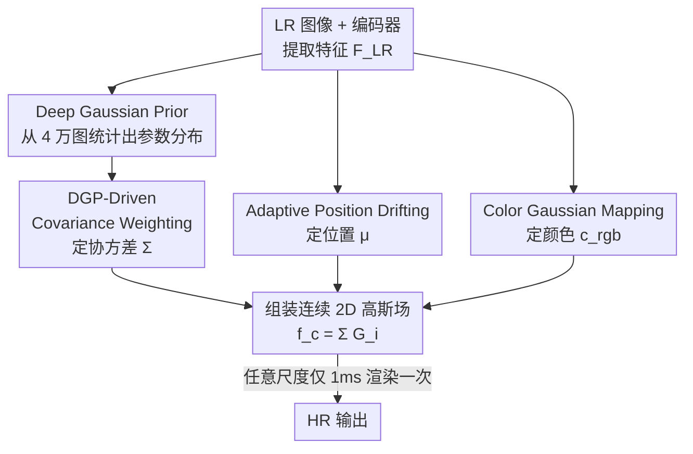

# Pixel to Gaussian: Ultra-Fast Continuous Super-Resolution with 2D Gaussian Modeling

**会议**: ICLR 2026  
**OpenReview**: [https://openreview.net/forum?id=SZvhmFntRA](https://openreview.net/forum?id=SZvhmFntRA)  
**代码**: https://github.com/peylnog/ContinuousSR  
**领域**: 图像恢复 / 任意尺度超分辨率  
**关键词**: 任意尺度超分, 2D 高斯, 高斯泼溅, 连续信号重建, 高效推理

## 一句话总结
本文提出 ContinuousSR，用「像素到高斯」范式把低分辨率图像一次性显式重建成一张连续的 2D 高斯场，之后任意放大倍数都只靠一次约 1ms 的快速渲染完成，在七个基准上质量超过 SOTA（Manga109 上 +0.18 dB）的同时，连续放大 40 个尺度时整体加速 19.5×。

## 研究背景与动机
**领域现状**：任意尺度超分（ASSR）希望用单个模型处理 ×2、×3.7、×8 等任意放大倍数，避免传统固定尺度超分要为每个倍数各训一个模型。当前主流做法是隐式神经表示（INR）：以 LIIF 为代表，用 MLP 学习「坐标 → 像素值」的连续映射，再配合上采样和解码在任意尺度上采样输出。

**现有痛点**：INR 路线有两个硬伤。其一是效率低——它的流程是 $F_{LR}=E(I_{LR})$、$F^s_{HR}=U(F_{LR},s)$、$I^s_{HR}=D(F^s_{HR})$，每换一个目标尺度 $s$ 就要重新走一遍耗时的上采样 $U$ 和解码 $D$；连续放大很多个尺度时这种重复计算非常昂贵。其二是保真度受限——基于坐标的隐式函数本身表达能力有限，很难显式地刻画出高质量的连续高分辨率信号，导致重建质量上不去。后来用高斯表示的工作（GaussianSR 在特征空间建高斯、GSASR 在 RGB 空间预测带尺度条件的高斯）也没跳出来：它们要么仍需为每个尺度单独解码，要么为每个尺度重新生成一套高斯，既慢又损害跨尺度一致性。

**核心矛盾**：成像本质上是把连续的真实信号 $f_c(x,y)$ 离散采样成 $I[m,n]=f_c(m\Delta x,n\Delta y)$。ASSR 的目标其实就是反过来恢复 $f_c(x,y)$，但隐式建模既难以显式表达这个连续函数，又把「恢复连续信号」和「按尺度采样」耦合在一起反复计算，于是质量和效率两头都吃亏。

**本文目标**：能不能直接从 LR 图像一次性重建出连续的 HR 信号，然后想要哪个尺度就轻量采样哪个尺度？

**切入角度**：用高斯函数作为连续基函数。根据高斯混合模型，任意复杂连续函数都能用若干高斯叠加表示（$f_c(x,y)=\sum_{i=1}^{N}G_i(x,y)$），理论上完备；加上高斯泼溅社区成熟的渲染工程，落地效率也好。问题是直接端到端学高斯参数极难收敛——作者实测 PSNR 卡在 10 dB 的局部最优。

**核心 idea**：先通过对 4 万张自然图像的统计发现「深度高斯先验（DGP）」——高斯场参数的分布是有规律、可追踪的；再用这个先验把「直接回归高斯参数」这个难题转化成「在预定义高斯字典上学加权系数 + 学位置偏移」，从而稳定地把 LR 一次性映射成连续高斯场。

## 方法详解

### 整体框架
ContinuousSR 的核心是把超分拆成「一次构建 + 多次渲染」两阶段。输入一张 LR 图像 $I_{LR}$，先用骨干编码器 $E$（SwinIR / HAT）提取特征 $F_{LR}$；然后由三个并行分支分别决定每个高斯核的三类参数——协方差 $\Sigma$（决定核的形状/各向异性）、位置 $\mu$、RGB 颜色 $c_{rgb}$，合起来组装成一张覆盖整图的连续 2D 高斯场 $f_c(x,y)=\sum_i G_i(x,y)$。这张场只需在一次前向中构建好；之后无论要 ×4 还是 ×33.6，都只是从这张连续场上做一次约 1ms 的快速渲染（栅格采样），彻底取代了 INR 那套按尺度反复上采样+解码的流程。

每个高斯核有 8 个待定参数：协方差矩阵 $\Sigma=\begin{bmatrix}\sigma_x^2 & \rho\sigma_x\sigma_y\\ \rho\sigma_x\sigma_y & \sigma_y^2\end{bmatrix}$、位置 $\mu=(\mu_x,\mu_y)$、颜色 $c_{rgb}=(c_r,c_g,c_b)$，核值为 $G_i(x,y)=c_{rgb}\frac{1}{2\pi|\Sigma_i|}\exp(-\tfrac12 d^\top\Sigma_i^{-1}d)$，其中 $d$ 是采样点到 $\mu$ 的偏移。三个分支正对应三个关键设计：协方差靠 DGP-Driven Covariance Weighting、位置靠 Adaptive Position Drifting、颜色靠 Color Gaussian Mapping；而它们能成立的前提是统计发现的 Deep Gaussian Prior。

### 关键设计

**1. Pixel-to-Gaussian 范式与 Deep Gaussian Prior：把不可优化的高斯空间变得可学**

直接从 LR 端到端回归高斯参数为什么不行？作者归因于两点：一是**高复杂度**——位置、协方差、RGB 等参数域基本无界（协方差理论上只要正定即可），解空间远比图像空间大、局部陷阱多；二是**高敏感性**——高斯空间里参数的微小扰动会影响整张图，而图像空间里改一个像素只影响它自己。作者做了对照实验：给两个空间加同分布噪声，图像空间 PSNR 还有 26.31 dB，高斯空间直接掉到 13.83 dB，证实高斯空间极其敏感。

为破局，作者对约 4 万张高分辨率图像用优化法 $\psi$（每张图约 1 分钟 GPU、累计 700+ GPU 小时）转成高斯场，统计 $\sigma_x^2,\sigma_y^2,\rho\sigma_x\sigma_y$ 的分布，得到 **Deep Gaussian Prior（DGP）**：约 99% 的协方差分别落在 $0\sim2.4$、$0\sim2.2$、$-0.9\sim1.5$ 的窄区间内，且整体近似高斯分布。DGP 是一次性从大规模自然图像里抽出的**固定统计先验**，训练全程不更新——它把无界、敏感的高斯空间约束成一个良态、可追踪的区域，正是后面两个模块能稳定收敛的地基。消融里去掉 DGP 字典直接学协方差会训练不稳、质量明显下降。

**2. DGP-Driven Covariance Weighting：把回归协方差改成在先验字典上学权重**

协方差最难学（范围未知、空间敏感），作者用 DGP 把它从「直接回归」转化成「字典加权」。具体地，从 DGP 的三个分布中采样协方差参数 $\sigma_{i,x}^2,\sigma_{i,y}^2,\rho_i\sigma_{i,x}\sigma_{i,y}\sim P(\cdot)$，构造一组 $N$ 个预定义高斯核字典 $K=\{G_i(\Sigma_i)\}_{i=1}^N$，这些候选核覆盖了自然图像里绝大多数协方差类型和范围。然后用一个卷积网络 $M_{weight}$ 从 $F_{LR}$ 算出归一化权重 $W=\mathrm{Softmax}(M_{weight}(F_{LR}))$，再对字典加权组合得到每个目标核 $G_{target}=\sum_{i=1}^N w_i\cdot G_i$。

这样网络只需学一组有界的 softmax 权重，而不是去搜索无界的协方差矩阵，既保证正定性又把优化难度降下来，从而避开了端到端那条 PSNR 卡在 10 dB 的局部最优曲线。消融显示协方差先验字典 $K_{DCP}$（用 DGP 构造）比把范围粗暴设成 $[0,1]$ 的 $K_1$（27.7）或 $[0,10]$ 的 $K_2$（27.1）都好，达到 28.2 dB。

**3. Adaptive Position Drifting：让高斯核按图像内容自适应聚到纹理处**

位置同样难直接学。一个偷懒方案是把每个核固定在 LR 像素中心，但这严重限制表达力——无法根据内容把更多核分配到纹理丰富的区域。本文用 **APD**：以 LR 像素中心作为初始位置 $P_{init}$，再用一个 5 层 MLP $M_{pos}$ 从 $F_{LR}$ 学一个动态偏移，并用 Tanh 把偏移限制在 $-1\sim1$，最终位置 $P_{off}=\mathrm{Tanh}(M_{pos}(F_{LR}))$、$P_{final}=P_{init}+P_{off}$。

Tanh 的有界偏移既保证优化稳定（位置不会乱跑），又让网络能把高斯核往纹理密集的地方"漂移"、做更密的覆盖，从而提升结构精度。消融里只用 $P_{init}$（27.8）或只用 $P_{off}$（10.5，等于丢了稳定初值直接崩）都不如两者并用（28.2 dB），说明"稳定初值 + 受限偏移"这对组合缺一不可。

**4. Color Gaussian Mapping 与一次构建、多尺度快速渲染：把效率优势落到实处**

RGB 取值在 $[0,1]$、相对好优化，作者用一个简洁的 **Color Gaussian Mapping（CGM）**——5 层 MLP 作用在 $F_{LR}$ 上——直接预测每个高斯核的颜色参数，不需要额外先验。协方差、位置、颜色三者凑齐后即组装成连续高斯场。

真正把效率优势兑现的是渲染方式：连续 HR 信号只构建一次，之后所有目标尺度都只做一步轻量渲染（约 1ms/尺度），而 MetaSR/LIIF 这类方法必须为每个尺度重新生成尺度相关特征。这就是为什么平均 45 个尺度下来，本文在 DIV2K 上比 GSASR 快近 124 倍；同时因为不依赖按尺度膨胀的特征图，显存几乎与尺度无关（×4 到 ×16 都约 2.5G），而 LIIF、CiaoSR 在大尺度上直接 OOM。

### 损失函数 / 训练策略
两套配置：基础版以 SwinIR 为骨干、在 DIV2K 上用 L1 损失训练，GT 裁成 $256\times256$、LR 由 bicubic 下采样且尺度从 $U(4,8)$ 采样，Adam 优化、初始学习率 $1\times10^{-4}$、每 100 epoch 衰减 0.5，共 1000 epoch、batch 128、8 卡 H20。增强版 **Ours+** 换 HAT 骨干、训练集换成 DF2K，并加上频率损失（L1 + frequency loss）联合监督，batch 64，其余不变。

## 实验关键数据

### 主实验
七个基准、PSNR / SSIM / FID / DISTS 多指标，覆盖 ×4 到 ×48 共 45 个尺度，平均推理时间 AT 以毫秒计。

| 数据集/尺度 | 指标 | 本文 Ours | 之前SOTA(GSASR) | 备注 |
|--------|------|------|----------|------|
| Urban100 ×4 | PSNR↑ | 27.65 | 27.56 | +0.09 dB |
| DIV2K ×4 | PSNR↑ | 29.71 | 29.63 | 大尺度全面领先 |
| LSDIR ×4 | PSNR↑ | 26.95 | 26.88 | — |
| Urban100 ×4 | SSIM↑ | 0.8211 | 0.8151 | +0.0060 |
| Urban100 ×4 | FID↓ | 3.06 | 4.17 | 降 0.68 量级 |
| Urban100 ×4 | DISTS↓ | 0.1415 | 0.1474 | 感知质量更好 |
| Urban100 平均 AT | 时间(ms)↓ | 3.3 | 89.1 | 约 19.5× 加速 |
| DIV2K 平均 AT | 时间(ms)↓ | 3.5 | 434.1 | 近 124× |

增强版 Ours+ 在所有数据集/尺度上再进一步（如 Urban100 ×4 到 28.22 dB）。

### 消融实验（Urban100 ×4）

| 配置 | PSNR | 说明 |
|------|---------|------|
| 仅 DDCW（无 APD） | 10.5 | 缺位置自适应直接崩 |
| 仅 APD（无 DDCW） | 12.3 | 缺协方差先验也崩 |
| DDCW + APD | 28.2 | 完整，两模块互补 |
| 仅 $P_{init}$ | 27.8 | 位置固定中心，表达力受限 |
| 仅 $P_{off}$ | 10.5 | 丢掉稳定初值，优化失败 |
| $P_{init}+P_{off}$ | 28.2 | 稳定初值 + 受限偏移最佳 |
| 字典 $K_1$(范围[0,1]) | 27.7 | 无 DGP 的粗范围 |
| 字典 $K_2$(范围[0,10]) | 27.1 | 范围过大更差 |
| 字典 $K_{DCP}$(DGP) | 28.2 | DGP 提供更好的基函数 |

### 关键发现
- DDCW 和 APD 强耦合：单独留任一个 PSNR 都崩到 10~12 dB，说明协方差先验与稳定位置初值缺一不可，二者合起来才把优化从局部最优里救出来。
- DGP 是收敛的关键先验：去掉它（用粗暴均匀范围）协方差学不好；范围越离谱（$[0,10]$）越差，印证「高斯空间敏感、需要紧致先验约束」。
- 泛化能力强：在医学图像 BRATS 上不微调即可，×4 PSNR 29.93 vs GSASR 28.02；在低分辨率+下雨的退化场景（Rain200H 模拟）也优于 LIIF/CiaoSR，显示该范式有迁移到更广低层视觉任务的潜力。
- 显存几乎与尺度无关（×4~×16 约 2.5G），而 INR 类方法在大尺度上 OOM——这是「一次构建、多次渲染」范式的直接红利。

## 亮点与洞察
- **把"难优化"问题转译成"易优化"问题**：核心不是更大的网络，而是先用统计先验 DGP 把无界敏感的高斯空间收成窄区间，再把回归协方差改成在字典上学 softmax 权重——这种"用先验降维 + 加权代替回归"的思路可迁移到其他参数空间巨大且敏感的隐式/显式表示学习。
- **"一次构建、多尺度渲染"解耦**：把"恢复连续信号"和"按尺度采样"彻底分开，是同时拿下质量和效率的关键，也是显存不随尺度膨胀、避免 OOM 的根因。
- **Tanh 受限偏移的小技巧**：位置用"固定中心初值 + Tanh 限幅偏移"既稳又灵活，消融证明去掉稳定初值就崩，是个简单但关键的工程设计。

## 局限与展望
- DGP 的获取代价高：要对 4 万张图各跑约 1 分钟优化、累计 700+ GPU 小时才统计出先验，pipeline 较重；作者计划探索能否直接从物理成像数据导出高斯规律来简化。
- 退化建模较理想化：训练/评测主要在 bicubic 下采样（外加模拟雨）上做，真实世界复杂退化（噪声、模糊、压缩）下的表现仍待验证，作者把扩展到更多低层视觉任务列为未来工作。
- 高斯核数量 $N$、字典规模等超参与不同内容/极端尺度的关系，正文未充分展开；极大尺度（×48）下各方法 PSNR 都很接近，本文优势收窄。

## 相关工作与启发
- **vs INR 类（LIIF / CiaoSR / LTE / SRNO）**：它们学坐标到像素的隐式映射，每个尺度都要重复上采样+解码，受限于坐标函数表达力；本文显式重建连续高斯场、一次构建多尺度渲染，质量和速度都更好（DIV2K 上快近 124 倍）。
- **vs GaussianSR**：它在特征空间建高斯，仍需按尺度解码，速度慢（Urban100 AT 321ms）；本文在 RGB 连续信号层面建场，1ms 渲染。
- **vs GSASR**：它预测带尺度条件的 2D 高斯，但每个尺度重新生成一套高斯，损害跨尺度一致性与效率；本文一套连续场服务所有尺度，PSNR 与速度均更优。

## 评分
- 新颖性: ⭐⭐⭐⭐⭐ 首次实现 LR→连续 HR 高斯场的表示学习，并用统计先验 DGP 破解高斯空间不可优化的难题。
- 实验充分度: ⭐⭐⭐⭐⭐ 七基准 × 多指标 × 45 尺度 + 速度/显存/泛化/退化场景消融齐全。
- 写作质量: ⭐⭐⭐⭐ 动机推导（成像反问题）清晰，图 2/图 3 配合好；部分模块（CGM）描述略简。
- 价值: ⭐⭐⭐⭐⭐ 19.5× 加速且质量更优，显存不随尺度膨胀，对实际部署的 ASSR 很有吸引力。

<!-- RELATED:START -->

## 相关论文

- [\[CVPR 2026\] Gaussian Splatting-based Low-Rank Tensor Representation for Multi-Dimensional Image Recovery](../../CVPR2026/image_restoration/gaussian_splatting-based_low-rank_tensor_representation_for_multi-dimensional_im.md)
- [\[ICLR 2026\] Continuous Space-Time Video Super-Resolution with 3D Fourier Fields](continuous_space-time_video_super-resolution_with_3d_fourier_fields.md)
- [\[CVPR 2026\] Event-Based Motion Deblurring Using Task-Oriented 3D Gaussian Event Representations](../../CVPR2026/image_restoration/event-based_motion_deblurring_using_task-oriented_3d_gaussian_event_representati.md)
- [\[CVPR 2026\] DVAR: Dynamic Visual Autoregressive Modeling for Image Super-Resolution](../../CVPR2026/image_restoration/dvar_dynamic_visual_autoregressive_modeling_for_image_super-resolution.md)
- [\[NeurIPS 2025\] The Effect of Optimal Self-Distillation in Noisy Gaussian Mixture Model](../../NeurIPS2025/image_restoration/the_effect_of_optimal_self-distillation_in_noisy_gaussian_mixture_model.md)

<!-- RELATED:END -->
