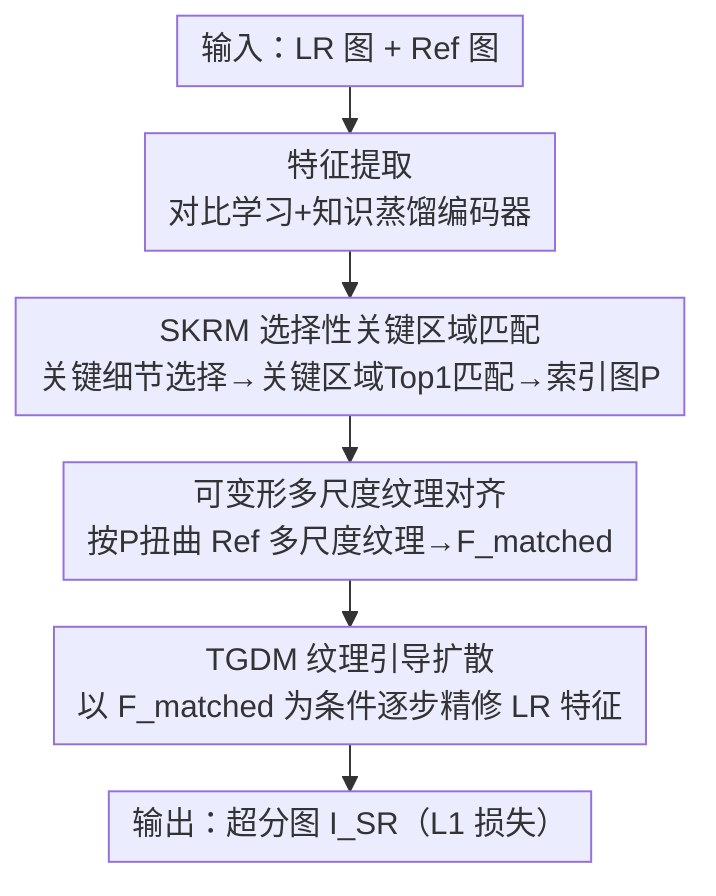

# PlantRSR：面向参考引导超分辨率的新植物数据集与方法

**会议**: ICLR 2026  
**OpenReview**: [https://openreview.net/forum?id=puJNiR7JhP](https://openreview.net/forum?id=puJNiR7JhP)  
**代码**: https://github.com/edbca/PlantRSR  
**领域**: 图像超分辨率 / 参考引导超分 / 扩散模型  
**关键词**: 参考超分辨率, 植物图像, 选择性匹配, 纹理引导扩散, 数据集

## 一句话总结
本文构建了首个面向植物场景的参考引导超分（RefSR）数据集 PlantRSR（16,585 对人工对齐的 HR–Ref 训练补丁），并提出一套专门应对植物不规则纹理的方法——用选择性关键区域匹配（SKRM）只在富纹理区域做匹配以大幅省算力，再用纹理引导扩散模块（TGDM）以匹配到的参考纹理为条件逐步精修 LR 特征，在 PlantRSR 及多个公开基准上以 11.1M 参数取得了全面领先。

## 研究背景与动机

**领域现状**：单图超分（SISR）从严重退化的 LR 图像里恢复高频细节非常困难，因为退化把原始高频信息抹掉了，网络只能"猜"。参考引导超分（RefSR）换了个思路：额外给一张高质量参考图（Ref），把 Ref 里真实存在的纹理"搬运"到 LR 上来引导重建，从而绕开纯靠先验幻想细节的瓶颈。近年的 RefSR 主流是用特征对齐、注意力或隐式对应学习把 Ref 纹理融合进来（SRNTT、TTSR、C2-Matching、DATSR 等）。

**现有痛点**：现有 RefSR 数据集（CUFED5 主打人类日常活动、LMR 主打建筑地标）覆盖的场景都是**刚性结构、几何变化有限**的内容，缺少植物这类自然精细场景。而植物图像有它独有的难点——形状大幅形变、纹理细微多变（叶脉、绒毛、花瓣）、背景常因浅景深而虚化。即便 DRefSR 在 CUFED5 基础上加了点植物图，数量和物种多样性都远远不够，导致现有方法在植物场景下泛化很差。

**核心矛盾**：一方面，RefSR 训练需要 HR 和 Ref 上"语义对齐"的成对补丁，但植物图里随机裁剪或基于关键点的自动裁剪经常切到虚化背景或语义不匹配的区域，再加上色彩、尺度、形变差异大，**自动建立可靠对应几乎不可能**；另一方面，植物的关键纹理只占图像一小部分，对整图做穷举式匹配既浪费算力又容易被背景噪声干扰。

**本文目标**：(1) 造一个真正面向植物、规模与多样性都够用的 RefSR 数据集；(2) 设计一套能高效定位关键纹理、并能精确重建不规则细纹理的 RefSR 方法。

**切入角度**：作者观察到植物图像"前景富纹理、背景多虚化"的特点——既然虚化背景本来就容易重建、不需要精确匹配，那匹配就该**只发生在关键纹理区域**；而不规则细纹理的重建恰好是扩散模型的强项，可以用匹配到的 Ref 纹理当条件来驱动扩散精修。

**核心 idea**：用"选择性关键区域匹配 + 纹理条件扩散精修"替代"整图穷举匹配 + 一次性特征融合"，并配套一个人工对齐的大规模植物数据集来支撑这一范式。

## 方法详解

### 整体框架
给定低分辨率图 $I_{LR}$ 和参考图 $I_{Ref}$，目标是生成纹理丰富的超分图 $I_{SR}$。整条流水线分三步走：先用对比学习 + 知识蒸馏训练得到的特征提取器（沿用 C2-Matching）分别编码 Ref 和上采样后的 LR，得到 $\psi_{Ref}(I_{Ref})$、$\psi_{LR}(I_{LR\uparrow})$；接着 SKRM 只在两者的关键纹理区域之间做匹配，输出对应关系索引图 $P$；然后按索引用可变形卷积把多尺度 Ref 纹理特征 $F^{Ref}_l$（尺度 $l=1,2,4$）扭曲对齐成 $F^{Ref}_{matched}$；最后 TGDM 以 $F^{Ref}_{matched}$ 为条件，用扩散过程逐步增强 LR 特征并完成多尺度融合，生成 $I_{SR}$。训练用 $L_1$ 损失。

### 关键设计

**1. SKRM 选择性关键区域匹配：只在富纹理区做匹配，省算力又抗背景干扰**

针对"植物图前景富纹理、背景多虚化，对整图穷举匹配既费算力又被背景噪声拖累"这个痛点，SKRM 先用一个**关键细节选择指标**把每张图里真正值得匹配的区域挑出来。给定特征图 $F\in\mathbb{R}^{H\times W\times C}$，定义选择度量为原特征与"先双线性下采样再上采样"重建之间的绝对差是否超过阈值：

$$M_F = S(F) = \mathbb{I}\!\left(\sum_C |F - F_{\downarrow s\uparrow s}| > \tau\right),$$

其中采样率 $s=2$，阈值 $\tau$ 取所有绝对差的均值加一个标准差，$\mathbb{I}(\cdot)$ 在超过阈值时返回 1。直觉是：经过下采样再上采样还能保留下来的就是平滑/低频区域（差很小），而差异大的恰好是高频细纹理——这正是需要匹配的关键区域。对 LR 和 Ref 都做这一步得到掩码 $M_{LR}$、$M_{Ref}$，掩码乘回特征得到关键纹理特征 $F^{key}_{LR}$、$F^{key}_{Ref}$。随后把关键特征折叠成补丁描述子 $d_{LR}=[q_1,...,q_n]$、$d_{Ref}=[k_1,...,k_m]$，对每个 LR 补丁取归一化余弦相似度最高的 Ref 补丁建立对应：$P_i = \mathrm{Top1}\!\big(\frac{q_i}{\|q_i\|}\cdot\frac{k_j}{\|k_j\|}\big)$。由于匹配只在关键区域间进行，计算量相比穷举式匹配可下降 150 倍以上（消融里 SKRM 仅 77.86 GFLOPs，而穷举式高达 11990 GFLOPs），且因为剔除了虚化背景，匹配精度反而更好。

**2. 可变形多尺度纹理对齐：把匹配到的 Ref 纹理在多个尺度上精准搬过来**

有了对应索引 $P$，还要把 Ref 的纹理真正"对齐搬运"到 LR 的几何上——因为植物图里色彩、尺度、形变差异大，简单按位置复制会错位。本文沿用 RefSR 的多尺度做法，用 VGG 编码器 $\Phi_{Ref}$ 在 $l=1,2,4$ 三个尺度上抽取 Ref 纹理特征 $F^{Ref}_l$，然后用可变形卷积按索引把它扭曲到与 LR 对齐：

$$F^{Ref}_{matched,l} = \mathrm{DConv}(F^{Ref}_l, P_i) = \sum w\,F^{Ref}_l(P + P_0 + P_i + \Delta p)\,\Delta m,$$

其中 $P_0$ 是 $3\times3$ 邻域的固定偏移，$\Delta p$、$\Delta m$ 分别是可学习的采样偏移和调制标量。可变形卷积的好处在于它能在匹配位置周围自适应地采样邻域，从而吸收植物形变带来的局部错位，把高、低层 Ref 纹理都精确对齐到 LR，为后续融合准备好"已对齐的多尺度纹理条件"。

**3. TGDM 纹理引导扩散模块：以匹配纹理为条件，用扩散逐步精修不规则细纹理**

普通 RefSR 用一次性特征聚合融合 Ref 纹理，对植物这种不规则、细碎的纹理建模能力有限。TGDM 改用**以匹配纹理为条件的扩散精修**：把 LR 特征 $F^{LR}_l$ 作为扩散起点 $Z_T$，在每一步反向去噪时，去噪网络 DN 预测以匹配纹理为条件的噪声 $\hat\epsilon_\theta(Z_t, t, F^{Ref}_{matched,l})$，按标准 DDPM 后验逐步采样：

$$\hat Z_0 = \tfrac{1}{\sqrt{\bar\alpha_t}}\Big(Z_t - \sqrt{1-\bar\alpha_t}\cdot\hat\epsilon_\theta(Z_t, t, F^{Ref}_{matched,l})\Big),$$

从 $t=T$ 迭代到 $t=1$ 得到被 Ref 纹理引导精修后的隐变量 $Z_0$。为进一步增强纹理，$Z_0$ 再过一个残差状态空间块 $\bar Z_0 = \mathrm{RSSB}(Z_0)$，然后与原 LR 特征残差相加并用亚像素卷积上采样：$F^{LR}_{2l} = \mathrm{upsample}(F^{LR}_l + \bar Z_0)$，最终 $F^{SR} = F^{LR}_4 + \bar Z_0$ 生成超分表征。把扩散当作"逐步注入 Ref 纹理"的精修器，比一次性融合更能刻画不规则细纹理；而且本文把扩散步数 $T$ 压到仅 4 步，避免了扩散方法常见的高推理成本——消融显示去掉扩散后 PSNR 从 38.62 掉到 38.52，证明扩散设计确有贡献。

### 损失函数 / 训练策略
训练目标就是简单的 $L_1$ 重建损失。扩散步数 $T=4$；ADAM 优化器（$\beta_1=0.9$、$\beta_2=0.999$），初始学习率 $10^{-4}$，每 10 万次迭代衰减 0.5，共训练 400 个 epoch，统一在 $160\times160$ 补丁上、LR 由 HR 做 4× 双三次下采样得到，单卡 NVIDIA RTX A6000。

## 实验关键数据

### 主实验
在 PlantRSR 测试集上对比多种 SOTA RefSR 方法（各方法分别在 CUFED5、DRefSR、PlantRSR 上独立训练）。本文方法在全部四个指标上、在每种训练集下都拿到最好成绩，且参数量仅 11.1M，远小于 RRSR（21.5M）、MRefSR（23.7M）。下表节选在 PlantRSR 训练集下的对比：

| 方法 | 参数量 | PSNR↑ | M-PSNR↑ | SSIM↑ | LPIPS↓ | DISTS↓ |
|------|--------|-------|---------|-------|--------|--------|
| C2-Matching | 8.9M | 38.43 | 31.20 | 0.9523 | 0.1300 | 0.0851 |
| DATSR | 18.0M | 38.48 | 31.26 | 0.9527 | 0.1304 | 0.0835 |
| SSMTF | 13.9M | 38.49 | 31.25 | 0.9528 | 0.1297 | 0.0831 |
| **Ours** | **11.1M** | **38.62** | **31.53** | **0.9538** | **0.1288** | **0.0826** |

一个值得注意的现象是：所有方法只要换到 PlantRSR 上训练，性能都比在 CUFED5/DRefSR 上训练时一致提升，说明数据集本身对复杂植物纹理更有效；而且 M-PSNR（只在纹理区算 PSNR）的提升幅度明显大于标准 PSNR，进一步印证 PlantRSR 对复杂纹理的针对性价值。

### 消融实验

| 消融对象 | 配置 | 关键指标 | 说明 |
|---------|------|---------|------|
| 匹配模块 | MEM | 620.72 GFLOPs, 38.36 | 算力高、精度低 |
| 匹配模块 | CFE-PatchMatch | 124.73 GFLOPs, 38.58 | 折中 |
| 匹配模块 | 穷举式匹配 | 11990.39 GFLOPs, 38.62 | 精度高但算力爆炸 |
| 匹配模块 | **SKRM** | **77.86 GFLOPs, 38.62** | 同等精度、算力最低 |
| 融合模块 | DA | 38.43 / 0.9513 / 31.18 | 动态聚合 |
| 融合模块 | RFA | 38.48 / 0.9521 / 31.25 | 残差特征聚合 |
| 融合模块 | TGDM(去扩散) | 38.52 / 0.9531 / 31.33 | 去掉扩散掉 0.10 |
| 融合模块 | **TGDM** | **38.62 / 0.9538 / 31.53** | 完整模块最优 |

### 关键发现
- SKRM 用 77.86 GFLOPs 就达到了穷举式匹配（11990 GFLOPs）相同的 PSNR（38.62），算力降 150 倍以上，证明"只匹配关键区域"既省算又不掉精度。
- TGDM 去掉扩散后 PSNR 从 38.62 降到 38.52、M-PSNR 从 31.53 降到 31.33，扩散精修对纹理区贡献最明显。
- 扩散步数 $T$ 增大时性能提升但在 $T=4$ 后趋于饱和，作者据此把 $T$ 固定为 4，兼顾质量与推理成本。
- 同一方法换到 PlantRSR 训练即可全面涨点，且本文方法在 CUFED5、WR-SR 等公开测试集上也一致领先，说明方法与数据集都具备跨场景价值。

## 亮点与洞察
- **"什么不该匹配"也是信息**：关键细节选择指标用"下采样-上采样能否复原"来判定平滑区，把虚化背景显式排除在匹配之外，既省算力又抗噪——这个判据简单且零额外参数，可迁移到任何需要稀疏匹配的任务。
- **把扩散当"纹理精修器"而非"生成器"**：TGDM 不是从噪声生成整图，而是以匹配纹理为条件、仅用 4 步扩散逐步增强 LR 特征，避开了扩散方法的高推理成本，是扩散在低层视觉里"轻量化条件精修"的好范例。
- **数据集即方法**：论文用人工标注换来 16,585 对真正语义对齐的植物补丁，证明在自动对应不可靠的场景里，高质量对齐数据比模型 trick 更能带来一致涨点（所有 baseline 换数据集都涨）。

## 局限与展望
- 数据集靠**人工标注**对齐 16,585 对补丁，成本高、难以快速扩展到更多物种或更大规模。
- 仅用 $L_1$ 损失优化，没有引入感知/对抗损失，纹理的视觉真实感可能仍有提升空间（虽然 LPIPS/DISTS 已领先）。
- 关键细节选择指标的阈值 $\tau$ 用固定的"均值+标准差"规则，对极端虚化或极端密集纹理的图像是否最优未充分讨论。
- 扩散步数固定为 4，作者展示了饱和趋势但未深入分析不同纹理复杂度是否需要自适应步数——可探索按纹理难度动态分配扩散步数。

## 相关工作与启发
- **vs C2-Matching / DATSR（对齐与匹配类）**：它们对整图做对应匹配并用注意力/Transformer 融合 Ref 纹理；本文在匹配阶段加了选择性（SKRM 只匹配关键区，算力大降），在融合阶段用条件扩散替代一次性聚合（TGDM 更擅长不规则细纹理）。
- **vs CoSeR / Ref-Diff（扩散类 RefSR）**：它们多用扩散去"生成"语义参考或变化先验；本文的扩散是以**真实匹配到的 Ref 纹理**为条件做轻量精修，目标是搬运而非幻想，且只需 4 步。
- **vs CUFED5 / LMR / DRefSR（数据集）**：前者聚焦人类活动/建筑等刚性场景，DRefSR 虽加入少量植物图但数量与多样性不足；PlantRSR 是首个面向植物、覆盖色彩/尺度/旋转/形变/背景五类变化、2K–8K 分辨率的人工对齐 RefSR 基准。

## 评分
- 新颖性: ⭐⭐⭐⭐ 选择性匹配 + 条件扩散精修的组合针对植物纹理很贴题，但 SKRM 的选择思路、扩散条件精修都在已有套路上演进。
- 实验充分度: ⭐⭐⭐⭐⭐ 多训练集 × 多测试集 × 多指标对比，SKRM/TGDM/数据集三方面消融齐全，含算力与采样步数分析。
- 写作质量: ⭐⭐⭐⭐ 动机清晰、公式完整，方法各模块职责分明。
- 价值: ⭐⭐⭐⭐ 首个植物 RefSR 基准 + 轻量高效方法，对植物表型/精准农业等下游有实际意义。

<!-- RELATED:START -->

## 相关论文

- [\[ICLR 2026\] Energy-oriented Diffusion Bridge for Image Restoration with Foundational Diffusion Models](energy-oriented_diffusion_bridge_for_image_restoration_with_foundational_diffusi.md)
- [\[ICLR 2026\] Trust but Verify: Adaptive Conditioning for Reference-Based Diffusion Super-Resolution](trust_but_verify_adaptive_conditioning_for_reference-based_diffusion_super-resol.md)
- [\[ICLR 2026\] Taming Score-Based Denoisers in ADMM: A Convergent Plug-and-Play Framework](taming_score-based_denoisers_in_admm_a_convergent_plug-and-play_framework.md)
- [\[ICLR 2026\] Sharpness-Aware Machine Unlearning](sharpness-aware_machine_unlearning.md)
- [\[ICLR 2026\] FideDiff: Efficient Diffusion Model for High-Fidelity Image Motion Deblurring](fidediff_efficient_diffusion_model_for_high-fidelity_image_motion_deblurring.md)

<!-- RELATED:END -->
