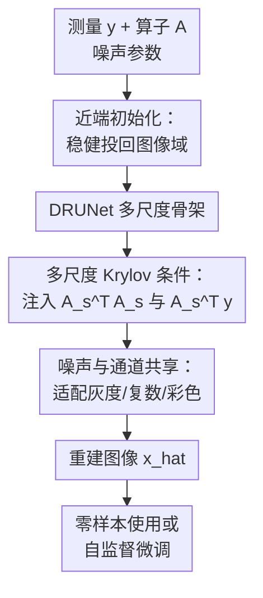

# Reconstruct Anything Model: A Lightweight General Model for Computational Imaging

**会议**: ICLR 2026  
**OpenReview**: [https://openreview.net/forum?id=Ks9zNS6OsU](https://openreview.net/forum?id=Ks9zNS6OsU)  
**代码**: https://github.com/matthieutrs/ram  
**领域**: 图像恢复 / 计算成像  
**关键词**: 计算成像, 逆问题重建, Krylov 子空间, 自监督微调, 多任务重建  

## 一句话总结
本文提出 Reconstruct Anything Model (RAM)，用一个 36M 参数的非迭代 DRUNet 系重建网络把成像算子、测量值和噪声参数直接注入特征层，在去模糊、MRI、CT、超分、补全和低光子成像等任务上实现强零样本重建，并能只用少量无真值测量进行自监督微调。

## 研究背景与动机

**领域现状**：计算成像里的许多任务都可以写成同一个逆问题：观测 $y$ 由未知图像 $x$ 经过已知成像算子 $A$ 和噪声模型 $p(y|Ax)$ 得到。MRI 的 k-space 采样、CT 的 Radon 投影、去模糊的卷积核、图像补全的 mask、超分辨率的下采样，本质上都在问同一件事：如何从不完整、有噪声或被压缩的测量里恢复干净图像。

**现有痛点**：主流学习方法大致有两类。第一类是 Plug-and-Play、扩散模型等迭代方法，它们把预训练去噪器塞进优化算法，每一步都调用网络或数据一致性更新，泛化任务多但速度慢、计算开销大，还可能因为先验和测量不匹配产生模糊。第二类是 unrolled network，把若干步优化过程展开成可学习网络，能显式用上 $A$ 和 $y$，但通常绑定特定任务、特定通道数和特定测量形式，换成多线圈 MRI、Poisson CT 或不同图像分布时就要重新训练。

**核心矛盾**：通用图像恢复模型追求一个 backbone 解决多个退化，但常把输入和输出都假设在图像域；科学与医学成像又必须尊重真实物理测量，观测可能是频域、投影域或压缩测量。也就是说，模型既要像通用 UNet 一样轻、快、可共享，又要像 unrolled 方法一样知道当前的 $A$、$y$ 和噪声条件。

**本文目标**：作者希望训练一个单一、轻量、非迭代的计算成像基础模型，覆盖灰度、彩色、复数图像以及多种高斯 / 泊松-高斯噪声；在训练分布内直接零样本使用，在分布外只用几张甚至一张测量图像做自监督微调；同时避免为每个逆问题重新设计 unrolled 架构。

**切入角度**：本文观察到，unrolled 方法真正有价值的部分不是“必须展开 K 步优化”，而是它把 $A^\top y$、$A^\top A$ 这类物理相关运算引入了网络。RAM 因此不再把优化算法完整展开，而是在 DRUNet 的多尺度特征中插入 Krylov 子空间模块，让普通卷积 backbone 直接看见成像物理。

**核心 idea**：用“近端初始化 + 多尺度 Krylov 物理条件注入 + 噪声与通道共享”的方式，把一个标准低层视觉 backbone 改造成可处理多种计算成像逆问题的轻量通用重建器。

## 方法详解

### 整体框架

RAM 的输入是测量 $y$、已知成像算子 $A$、噪声参数 $(\sigma, \gamma)$，输出是重建图像 $\hat{x}$。它先用一个近端估计把测量投回较合理的图像域初值，再沿用 DRUNet 的编码-解码骨架；不同之处在于，每个尺度的特征都会被解码到图像域，经过基于 $A_s^\top A_s$ 和 $A_s^\top y$ 的 Krylov 子空间模块处理，再编码回特征域。这样网络不是盲目从退化图像到清晰图像，而是在每个尺度都知道“当前这个逆问题的物理约束是什么”。

从计算图看，RAM 仍然是一次前向传播的非迭代模型，不需要像 DPIR 那样跑 8 步 HQS，也不需要像扩散逆问题方法那样多次采样。它的“通用性”来自两层设计：训练时混合多种任务和数据集，让主干学到跨任务共享的图像先验；推理时用 $A$、$y$、噪声参数和通道头告诉模型当前面对的是哪一种测量过程。

### 关键设计

**1. 近端初始化：在 $A^\top y$ 和伪逆之间取一个抗噪初值**

计算成像网络的第一步很关键：如果直接用 $A^\dagger y$，模型拿到的是看似已经反演的图像，但在噪声下伪逆会严重放大不稳定方向；如果只用 $A^\top y$，输入虽然稳定，却常常很模糊，后续网络需要从更差的起点恢复细节。RAM 用一个近端估计作为折中：

$$
\operatorname{prox}_{\lambda f}(A^\top y)=\arg\min_u \lambda\|Au-y\|^2+\|u-A^\top y\|^2.
$$

这里 $f$ 是数据一致性项，$\lambda$ 与输入信噪比相关，论文设为 $\lambda=\sigma\eta/\|y\|_1$，其中 $\eta$ 可学习。直观上，噪声越小，模型越可以相信测量并向伪逆方向靠；噪声越大，模型就更保守地留在稳定的 $A^\top y$ 附近。这个初值不是最终答案，而是给 DRUNet backbone 一个“既在图像域、又没有被伪逆噪声炸坏”的起跑点。

**2. 多尺度 Krylov 条件：把 unrolled 的物理运算变成特征层条件**

unrolled 网络常通过梯度步 $x_{\ell+1}=x_\ell-\gamma A^\top(Ax_\ell-y)$ 或近端步来注入数据一致性。论文把这些更新统一看成一组 Krylov 子空间里的线性组合：

$$
x_{\ell+1}=\sum_{k=0}^{K}\alpha_k(A^\top A)^k x_\ell+\beta_k(A^\top A)^k A^\top y.
$$

RAM 不真的展开优化，而是在每个尺度把中间特征解码成图像域，堆叠 $\{(A_s^\top A_s)^k x_\ell,(A_s^\top A_s)^kA_s^\top y\}$，再用 $3\times3$ 卷积学习组合系数并编码回特征域。这个模块的意义很直接：卷积 backbone 原本只能从局部纹理判断如何修复，现在它还可以看到“如果按照当前测量物理再投影回来，会发生什么”。这保留了 unrolled 方法最有用的物理归纳偏置，但没有付出多轮网络调用和任务专属展开结构的代价。

多尺度版本进一步降低了 ill-posedness。对固定测量数 $m$，图像网格越细，未知数 $n$ 越多，$A$ 的零空间越大；在粗尺度上反问题更稳定。RAM 因此定义 $A_s=A U_s$，其中 $U_s$ 是带抗混叠的上采样算子，并在每个尺度归一化 $\|A_s\|_2=1$。对于 blur 和 inpainting 这类问题，$A_s^\top A_s$ 可以直接在粗网格上用下采样卷积核或 mask 计算，避免昂贵的细尺度物理运算。

**3. 噪声与通道共享：让同一主干跨灰度、复数和彩色成像复用**

计算成像任务不仅退化不同，数据形态也不同：自然图像是 3 通道 RGB，CT 常是灰度，MRI 可能以复数形式表示为 2 通道。普通端到端网络通常一换通道数就要重训。RAM 只让少量输入 / 输出卷积层以及 KSM 里的编码解码块随通道数变化，其余主干权重共享，因此模型能在 1、2、3 通道之间复用大部分先验。

噪声条件也被显式输入网络。DRUNet 原本会把高斯噪声水平作为常数 feature map 拼到通道维；RAM 扩展为两个噪声图，对应 Poisson-Gaussian 模型

$$
y=\gamma z+\sigma n,\quad z\sim\mathcal{P}(x/\gamma),\quad n\sim\mathcal{N}(0,I).
$$

同时，作者移除了网络 bias，使模型对 $\sigma$ 和 $\gamma$ 的尺度变化更接近等变。这一点看似工程细节，但对跨噪声水平泛化很重要：模型不必把每个噪声强度记成单独任务，而是通过条件图和无偏置结构感知当前测量可靠度。

**4. 自监督微调：用测量一致性和零空间约束适配真实新任务**

RAM 的基础模型先用有真值的多任务数据监督训练，但真实科学成像常常没有干净参考图像。论文因此把 RAM 作为可微重建器，用只依赖测量的损失做少量微调：

$$
L(\theta)=\sum_{i=1}^{N}L_{MC}(\theta,y_i)+\omega L_{NULL}(\theta,y_i).
$$

$L_{MC}$ 负责 measurement consistency，即让重建再经过 $A$ 后与观测一致，并根据噪声知识选择 SURE、UNSURE 或 splitting loss；$L_{NULL}$ 处理非可逆算子的零空间信息，利用多个 forward operators 或对变换群的等变性补足测量看不到的部分。这让 RAM 在 Cryo-EM、低光子 LinoSPAD、压缩感知和 demosaicing 等分布外任务上，只用 1 到 10 张测量图像就能明显提升，而不需要人工标注的 ground truth。

### 一个完整示例

以加速 MRI 为例，观测不是图像，而是被 mask 采样的 Fourier 测量，可写成 $y=\operatorname{diag}(m)Fx+\sigma n$。传统图像恢复网络如果只看零填充反变换结果，很难知道哪些频率是真的观测到的、哪些只是网络猜出来的；unrolled MRI 网络可以利用 mask 和 Fourier 算子，但通常绑定这一种 MRI 设置。

RAM 的流程是：先用 $A^\top y$ 和近端模块得到一个稳定初值；进入 DRUNet 后，在粗尺度和细尺度分别构造 $A_s=A U_s$，让 KSM 用 $(A_s^\top A_s)^k$ 检查当前特征对应的图像是否符合 k-space 采样约束；网络再结合噪声图判断应该多信任观测、多依赖图像先验。换成 CT 时，$A$ 变成 Radon transform；换成 inpainting 时，$A$ 变成 mask；换成复数 MRI 时，通道头变化但主干大部分权重仍共享。因此同一个 RAM 前向传播可以服务不同成像物理，而不是为每个任务训练一个完全独立模型。

### 损失函数 / 训练策略

监督训练阶段，论文把每个任务 $g$ 表示为数据集 $D_g=\{x_{i,g}\}$、成像算子 $A_g$ 和 Poisson-Gaussian 噪声分布。模型最小化按任务加权的 $\ell_1$ 重建损失：

$$
L_g(\theta,x_{i,g})=\mathbb{E}_{(\sigma_g,\gamma_g)}\mathbb{E}_{y|x_{i,g}}\omega_g\|R_\theta(y,A_g,\sigma_g,\gamma_g)-x_{i,g}\|_1.
$$

作者选择 $\ell_1$ 而不是 $\ell_2$，因为低层视觉中 $\ell_1$ 往往给出更好的测试恢复质量。权重 $\omega_g=\|A_g^\top y\|_2/\sigma_g$ 用于平衡不同噪声水平和任务难度，避免训练被某些高噪声或尺度特殊的任务主导。总损失对所有任务和样本求和。

训练数据覆盖自然图像 LSDIR、CT 的 LIDC-IDRI 和 fastMRI brain-multicoil。每次抽取 $C\times128\times128$ patch，其中 $C\in\{1,2,3\}$，并用对应任务的 $A_g$ 生成测量。模型以预训练 DRUNet 去噪器初始化，batch size 为每个逆问题 16，总训练 200k steps，Adam 学习率 $10^{-4}$，在 180k steps 后降为原来的十分之一。

## 实验关键数据

### 主实验

论文的主实验覆盖训练分布内任务和分布外任务。最能说明问题的是 MRI / CT / SR 表：RAM 在单线圈 MRI、CT 和多种非图像域测量上整体优于或接近 unrolled baseline，同时参数量和 FLOPs 明显低于 untied unrolled 网络。

| 任务 | 指标 | RAM | 之前强基线 | 提升 / 结论 |
|--------|------|------|----------|------|
| MRI ×4 | PSNR / SSIM | 34.39 / 0.853 | uDPIR-tied 34.14 / 0.851 | RAM 略优，说明非迭代物理条件足够有效 |
| MRI ×8 | PSNR / SSIM | 31.50 / 0.813 | uDPIR-tied 30.86 / 0.805 | +0.64 dB，采样更稀疏时优势更明显 |
| CT Gaussian | PSNR / SSIM | 28.83 / 0.798 | uDPIR-tied 28.35 / 0.779 | +0.48 dB，细节恢复更好 |
| SR ×4 Clean | PSNR | 26.04 | SWINIR 26.16 | 略低于任务专用 SR 模型 |
| Multi-coil MRI ×8 | PSNR / SSIM | 35.62 / 0.889 | uDPIR-tied 36.06 / 0.894 | 分布外仍接近强 unrolled 基线 |
| Poisson CT | PSNR / SSIM | 28.83 / 0.798 | uDPIR-tied 14.67 / 0.462 | 对噪声模型迁移非常强 |

去模糊结果也支持同一结论。RAM 在 CBSD68 motion blur easy / medium / hard 上为 34.04 / 28.22 / 25.64 dB，整体超过 PDNet、Restormer 和 uDPIR-untied，并与甚至略优于 uDPIR-tied；在 Gaussian blur 上，RAM 在 CBSD68 达到 32.59 / 26.19 / 23.42 dB，在多个数据集上处于非迭代方法第一或第二。

### 消融实验

架构消融直接回答了“到底是哪一块在起作用”：近端输入是第一大增益，Krylov 条件是最大增益，单纯把测量 $y$ embed 进特征只能带来很小提升。

| 配置 | 训练 PSNR | 参数量 | 说明 |
|------|---------|------|------|
| base (DRUNet backbone) | 25.83 dB | 32.6M | 只用标准主干，缺少物理条件 |
| base + prox | 26.64 dB | 32.6M | 近端初始化带来 +0.81 dB |
| base + prox + embed y | 26.71 dB | 33.4M | 只注入测量本身增益有限 |
| base + prox + embed y + Krylov (RAM) | 27.61 dB | 35.6M | Krylov 模块再带来 +0.90 dB |

| 微调数据量 | Compressed Sensing RAM 自监督 | Demosaicing RAM 自监督 | 对比结论 |
|------|------|------|------|
| zero-shot | 32.84 dB | 29.49 dB | 基础模型已经明显强于随机 / 普通 DRUNet |
| N = 1 | 30.40 dB | 33.89 dB | 单张测量即可适配 demosaicing |
| N = 10 | 32.29 dB | 34.73 dB | 少量无真值样本接近监督微调 |
| N = 100 | 33.57 dB | 35.10 dB | 自监督和监督微调差距很小 |

### 关键发现

- RAM 的最大贡献不是“换一个更大的 backbone”，而是把 $A^\top A$ 的 Krylov 运算放进了多尺度特征；消融显示这个模块贡献约 +0.9 dB，是架构改动中最显著的一项。
- 近端初始化同样关键，说明计算成像基础模型不能只依赖端到端学习，第一步如何把测量投回图像域会显著影响后续恢复难度。
- 多任务训练并没有严重牺牲单任务性能。表 4 右侧显示，在 inpainting、deblurring、SR 三个任务上同时训练的模型接近单任务模型，说明合适的物理条件能减轻任务间干扰。
- 分布外能力主要来自“显式算子条件 + 自监督微调”。多线圈 MRI、Poisson CT、低光子和 Cryo-EM 都不是简单的自然图像退化，RAM 仍能用相同重建器迁移。
- 效率优势明显：论文指出 DPIR 约需要 8 倍 FLOPs，推理比 RAM 慢 3.7 倍；untied uDPIR 又因为每次迭代有独立参数，参数和 FLOPs 约为 RAM 的 8 倍。

## 亮点与洞察

- RAM 把“通用图像恢复”和“物理成像逆问题”这两条路线接起来了。它不像 all-in-one restoration 只处理图像域退化，也不像 unrolled network 为每个物理系统展开特定算法，而是把物理条件变成 backbone 的可插拔条件。
- Krylov 子空间模块很巧妙：它不是机械复刻优化迭代，而是抽取优化更新中真正有信息的 $A^\top A$ 和 $A^\top y$ 运算，让卷积网络自己学习如何组合这些物理响应。
- 多尺度条件解释了为什么模型能在复杂逆问题中稳定工作。粗尺度上零空间更小、伪逆更稳定，网络先在容易的尺度获得物理约束，再逐步回到细尺度恢复纹理。
- 自监督微调部分很有应用价值。科学成像和医学成像往往缺 ground truth，RAM 把“先训练强基模型，再用测量一致性适配现场数据”变成可行路线。
- 这篇论文也提示了一个更大的趋势：计算成像基础模型不一定要靠超大参数或生成式采样，轻量重建器只要把物理归纳偏置放对，也能覆盖很宽的任务族。

## 局限与展望

- 训练 RAM 仍需要相当 GPU 资源和多任务数据构建。虽然推理和微调轻量，但从零训练一个覆盖多种算子和噪声的基础模型并不便宜。
- 本文主要追求低失真重建，指标集中在 PSNR / SSIM。对于感知质量、纹理真实感或医学诊断一致性这类目标，RAM 未必优于扩散式或采样式方法。
- 方法默认非盲线性逆问题最自然，盲去模糊和相位恢复是通过估计算子或迭代外壳扩展的。若 $A$ 严重未知、非线性强且难以分解，RAM 的条件机制可能不够直接。
- 训练任务虽然覆盖广，但真实计算成像系统的噪声、校准误差和硬件 artifact 更复杂。论文展示了 Cryo-EM、SPAD 等案例，但大规模真实部署还需要更多跨设备验证。
- 后续可以把 RAM 作为快速重建器嵌入采样算法或不确定性估计框架，在保持速度的同时补上感知质量和 posterior uncertainty。

## 相关工作与启发

- **vs Plug-and-Play / DPIR**: DPIR 用预训练 DRUNet 在 HQS 迭代里反复调用，优点是可处理多种逆问题，缺点是慢且需要调迭代过程。RAM 只前向一次，但通过 KSM 在特征中注入物理条件，保留了多任务适配性并显著降低计算量。
- **vs diffusion inverse problem methods / DDRM**: 扩散方法能生成感知质量高的结果，但通常采样昂贵，而且低失真指标不一定占优。RAM 更像快速 deterministic reconstructor，适合医学、显微和科学成像中对稳定重建和速度敏感的场景。
- **vs unrolled networks / uDPIR / PDNet**: unrolled 方法直接来自优化算法，物理解释强，但任务绑定和计算开销大。RAM 借鉴其 $A^\top A$ 条件，却不固定迭代步数和任务结构，因此更容易跨模态共享。
- **vs all-in-one image restoration models**: AdaIR、PromptIR 等模型主要处理 denoising、deraining、dehazing 这类图像到图像退化。RAM 面向的是 measurement 不一定在图像域的计算成像问题，因此更强调 $A$、$A^\top$、噪声模型和测量一致性。
- **启发**: 如果要做新的科学成像模型，可以把 RAM 的思路迁移为“通用主干 + 物理算子条件 + 少量自监督现场适配”，而不是为每台设备或每个采样协议训练一个孤立网络。

## 评分

- 新颖性: ⭐⭐⭐⭐⭐ 把 Krylov 子空间物理条件嵌入通用 DRUNet backbone，避开完整 unrolling，思路清晰且有辨识度。
- 实验充分度: ⭐⭐⭐⭐⭐ 覆盖去模糊、MRI、CT、SR、补全、多线圈 MRI、Poisson CT、Cryo-EM、低光子和压缩感知，消融也直接对应核心模块。
- 写作质量: ⭐⭐⭐⭐☆ 论文结构清楚，公式和实验扎实；但任务和附录很多，读者需要一定逆问题背景才能快速串起来。
- 价值: ⭐⭐⭐⭐⭐ 对计算成像和医学 / 科学图像恢复很有实际价值，尤其是“基础模型 + 自监督微调”的路线值得后续复用。

<!-- RELATED:START -->

## 相关论文

- [\[ICLR 2026\] FideDiff: Efficient Diffusion Model for High-Fidelity Image Motion Deblurring](fidediff_efficient_diffusion_model_for_high-fidelity_image_motion_deblurring.md)
- [\[CVPR 2026\] UniSER: A Foundation Model for Unified Soft Effects Removal](../../CVPR2026/image_restoration/uniser_a_foundation_model_for_unified_soft_effects_removal.md)
- [\[ECCV 2024\] BAMM: Bidirectional Autoregressive Motion Model](../../ECCV2024/image_restoration/bamm_bidirectional_autoregressive_motion_model.md)
- [\[ICML 2026\] Solving Inverse Problems with Flow-based Models via Model Predictive Control](../../ICML2026/image_restoration/solving_inverse_problems_with_flow-based_models_via_model_predictive_control.md)
- [\[CVPR 2026\] Language-Guided One-Step Diffusion Model for Nighttime Flare Removal](../../CVPR2026/image_restoration/language-guided_one-step_diffusion_model_for_nighttime_flare_removal.md)

<!-- RELATED:END -->
