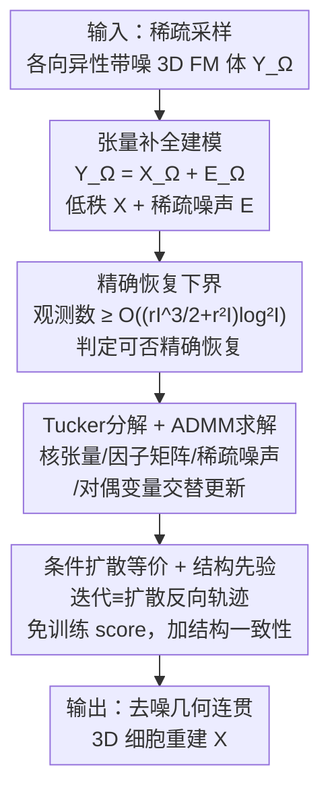

# Recover Cell Tensor: Diffusion-Equivalent Tensor Completion for Fluorescence Microscopy Imaging

**会议**: ICLR 2026  
**OpenReview**: [https://openreview.net/forum?id=AzZB0BaeT4](https://openreview.net/forum?id=AzZB0BaeT4)  
**代码**: 无  
**领域**: 图像恢复 / 荧光显微 / 张量补全 / 扩散模型  
**关键词**: 荧光显微成像、张量补全、Tucker分解、条件扩散、低秩先验

## 一句话总结
这篇论文把 3D 荧光显微（FM）活细胞成像的恢复问题，从"逆问题去模糊"换成"张量补全"视角：把 Z 轴等距稀疏采样看作一次均匀随机采样下的低秩张量补全，先推导出精确恢复的观测数下界，再证明用 Tucker 分解 + ADMM 求解这个补全问题的迭代过程在数学上等价于一条条件扩散的反向轨迹，从而无需训练 score 网络就能得到去噪、几何连贯的 3D 细胞体重建，在 SR-CACO-2 和三套真实活体 C. elegans 数据上 PSNR / SSIM / LPIPS 全面领先。

## 研究背景与动机
**领域现状**：观察活细胞分裂需要沿 Z 轴逐层扫描细胞体。为了把致命的光毒性压到最低，扫描只能在 Z 轴上以等距间隔稀疏采样，于是得到的 3D 体数据天然是**各向异性分辨率（Z 轴远稀于 XY 平面）、空间变化的强噪声、信号不完整**的。现有恢复算法绝大多数走"逆问题"路线：假设退化算子 $D(\cdot)$ 已知或可学习，训练一个 $\hat{I}_y = F(I_x;\theta)$ 去逼近退化的逆，代表方法有 SRCNN、FSRCNN、DDPM 这类监督方法，以及 CycleGAN、Deep Image Prior 这类无监督方法。

**现有痛点**：逆问题路线对 FM 成像不友好。第一，它通常需要成对的高/低质量参考体，而 3D 荧光显微根本拿不到高质量参考。第二，FM 的成像过程本质是**非线性**的——受激发、荧光发射、样本异质性、散射衰减共同影响，远不是逆问题常假设的"线性下采样 $D(I_y)=(I_y)\downarrow_s$"那么简单。第三，在高噪声、信号不完整的条件下，逆问题往往变成病态问题：输入的微小扰动会导致重建的剧烈误差，产生幻觉结构（hallucinated structures）和残留噪声——论文 Fig.1 里 CycleGAN/IPG 重建出的虚假亮点和假边缘就是典型表现，这对生命科学应用是不可接受的。

**核心矛盾**：逆问题建模假设"退化是已知、稳定、线性的"，而 FM 成像偏偏是"未知、非线性、带稀疏缺失"的；用错误的物理假设去拟合，自然得到不稳定、不可信的重建。

**本文目标**：找一个**贴合 FM 成像本性（非线性 + 不完整）**、且不依赖高质量参考、对噪声鲁棒的恢复框架，并给出可恢复性的理论保证。

**切入角度**：作者注意到——Z 轴等距稀疏采样，本质上就是在一个 3D 张量上做"均匀随机采样"，而细胞体在多个维度上有很强的结构冗余（低秩）。于是恢复缺失切片这件事，可以重述为一个**带稀疏噪声的低秩张量补全**问题，绕开"已知退化算子"的假设。

**核心 idea**：用"鲁棒张量补全"替代"逆问题"来建模 FM 恢复，并证明其 Tucker+ADMM 解等价于条件扩散反向过程，于是既有理论恢复下界、又能借扩散框架注入结构先验，得到去噪且几何连贯的重建。

## 方法详解

### 整体框架
方法整体是一条"重新建模 → 给理论保证 → 求解 → 揭示与扩散的等价并加先验"的链条。输入是稀疏采样、各向异性、带噪的 3D FM 活细胞体 $Y_\Omega$（$\Omega$ 是已观测体素的下标集），输出是去噪、各向同性、几何连贯的 3D 细胞重建 $X$。

整条链分四步：先把恢复**重述为鲁棒张量补全**——观测张量分解为低秩干净信号 $X$ 加稀疏噪声 $E$，在均匀采样下求解；然后**推导精确恢复下界**，证明只要观测体素数超过某个 $O((rI^{3/2}+r^2 I)\log^2 I)$ 量级的阈值，就有高概率精确恢复，而共聚焦显微的采样率恰好满足这个条件；接着用 **Tucker 分解 + ADMM** 把这个非凸优化拆成核张量、因子矩阵、稀疏噪声、对偶变量的交替更新；最后发现这套 ADMM 迭代与**条件扩散的反向采样轨迹数学等价**，于是把低秩投影当作 score 引导的去噪、把稀疏项当作前向噪声、把观测当作条件信号，再叠加结构一致性先验来引导生成轨迹。

### 关键设计

**1. 把荧光显微恢复重述为鲁棒张量补全：用低秩+稀疏代替逆问题**

针对"逆问题假设退化线性已知、却拟合不了 FM 的非线性与缺失"这个痛点，作者把观测张量直接分解为结构一致的干净信号加随机偏差：$Y_\Omega = X_\Omega + E_\Omega$。其中 $X$ 是低秩的体荧光信号，$E$ 是稀疏噪声/损坏。恢复目标写成一个凸优化——在已观测体素上对齐观测、同时让 $X$ 低秩、$E$ 稀疏：

$$\min_{X,E}\ \|X\|_* + \lambda_1\|E\|_1 \quad \text{s.t.}\quad P_\Omega(X+E)=Y_\Omega,\ X\ge 0$$

这里 $\|X\|_*$ 是张量核范数（如 tubal nuclear norm），强制低秩；$\|E\|_1$ 惩罚稀疏损坏；$P_\Omega$ 是到已观测集的投影算子。这一步的关键在于**视角转换**：它不再去显式估计未知的退化算子，而是利用细胞体跨切片的低秩结构冗余来补全缺失、利用稀疏项吸收噪声。低秩先验对噪声天然鲁棒，逆问题方法常见的不稳定（输入小扰动→重建大误差）在这里被低秩约束抑制，因此能给出更一致、可信的重建。

**2. 精确恢复下界：先回答"到底能不能恢复"再去恢复**

这是论文区别于一般"换个 loss"工作的硬核处。作者证明：当采样 $\Omega$ 是 $[I_1]\times\cdots\times[I_k]$ 上的均匀随机子集时（论文论证了 FM 等距 Z 轴采样可视为均匀采样），存在仅依赖维度 $k$ 的常数 $c_k$，使得只要观测数满足下界，就有 $P\{\hat T = T\}\ge 1-I^{-\beta}$ 的高概率精确恢复。对纯低秩的 Eq.3，下界量级为 $O((rI^{3/2}+r^2 I)\log^2 I)$；对低秩+稀疏的 Eq.4（Theorem 2），则要求

$$|\Omega|\ \ge\ C\cdot\big(rI^{3/2}+s\big)\cdot\log^2 I$$

其中 $r$ 是张量秩、$s=\|E\|_0$ 是稀疏度、$I=\max_j I_j$。这个下界的实际意义是给出了一个**可恢复性判据**：作者在实验里估计细胞张量的秩（均值约 20.83，呈 15 和 30 的双峰分布），发现共聚焦显微采样率下的观测体素数确实超过这个阈值，从而**理论上验证了 3D 细胞结构精确恢复的可行性**；反过来，当下采样率升高使观测数跌破阈值时，性能会明显下滑——这与 Table 3 的实验趋势一致，理论和实验互相印证。

**3. Tucker 分解 + ADMM 交替求解：把非凸补全拆成可解子问题**

针对 Eq.4 这个没有闭式解的非凸优化，作者用 Tucker 分解把干净张量写成核张量与模态因子矩阵的乘积 $X=\mathcal{G}\times_1 U^{(1)}\times_2 U^{(2)}\times_3 U^{(3)}$，由此提取全局空间相关性、压缩冗余、隔离各维度的主结构，特别适合不完整且带噪的 3D 生物图像。优化目标随之变为最小化 $\|\mathcal{G}\|_F^2 + \lambda_1\|E\|_1$。求解走 ADMM 的交替更新，每轮五步：(1) 固定因子矩阵，用最小二乘更新核张量 $\mathcal{G}^{(t+1)}$；(2) 固定核张量，逐模更新因子矩阵 $U^{(n)}$；(3) 对残差做软阈值更新稀疏噪声 $E^{(t+1)}=\mathrm{SoftThreshold}_{\lambda_1/\rho}(\cdot)$，其中 $\mathrm{SoftThreshold}_\tau(x)=\mathrm{sign}(x)\cdot\max(|x|-\tau,0)$；(4) 按标准 ADMM 规则更新对偶变量 $\Lambda^{(t+1)}=\Lambda^{(t)}+P_\Omega(X^{(t+1)}+E^{(t+1)}-Y)$；(5) 用更新后的核张量与因子矩阵重构 $X^{(t+1)}$。整个过程逐步去噪并补全缺失，是后面与扩散等价的"迭代细化"基础。秩的选取上用了固定多线性秩策略：对每种 Z 轴下采样配置，预先用截断 HOSVD 在训练集上保留 >95% 能量来定 $(r_1,r_2,r_3)$，避免测试时调参或数据泄漏。

**4. 与条件扩散等价 + 结构一致性先验：免训练 score 的生成式重建**

作者敏锐地观察到上面这套多步迭代细化，形态上极像扩散模型的反向去噪轨迹，于是建立了二者的理论等价。把三步映射到扩散语言：Tucker 投影步 $X^{(t+1)}=\arg\min_{X\in\mathcal{M}_{\text{Tucker}}}\|X-(Y_\Omega-E^{(t)}-\Lambda^{(t)})\|_F^2$ 是低秩流形上的 MAP 推断，对应扩散里学到的 score 函数 $\nabla\log p_\theta(X^{(t)}|Y_\Omega)$；稀疏噪声估计步 $E^{(t+1)}=\mathrm{prox}_{\lambda_1/\rho}(\cdot)$ 的软阈值，对应 DDPM 里对高斯噪声的去噪；对偶变量更新对应拉格朗日残差累积。三步合起来构成一个确定性 Markov 转移 $(X^{(t)},E^{(t)})\to(X^{(t+1)},E^{(t+1)})$，它逼近以观测 $c=Y_\Omega$ 为条件的反向采样轨迹

$$x_{t-1}=\frac{1}{\sqrt{\alpha_t}}\Big(x_t-\frac{1-\alpha_t}{\sqrt{1-\bar\alpha_t}}\,\epsilon_\theta(x_t,c)\Big)+\sigma_t z$$

关键区别在于：本文**不学习 score 模型**，而是用流形投影 + 近端算子来扮演去噪角色，因此是一种确定性、优化驱动的条件扩散反向链。在此基础上再注入**结构一致性先验**——强制跨平面的全局结构冗余，引导生成轨迹走向几何连贯的重建。正是这条先验保证了 YZ/XZ 平面上膜结构的完整与拓扑一致，显著压制了 GAN 类方法那种"锐利但生物上不可能"的虚假亮点与假边缘。⚠️ 结构一致性先验的具体形式论文放在补充材料，以原文为准。

### 损失函数 / 训练策略
本质上这是一个**无监督、免训练 score 网络**的优化求解方法：核心目标即 Eq.4 的低秩核范数 + 稀疏 $\ell_1$ 约束，通过 ADMM 迭代求解，超参主要是稀疏权重 $\lambda_1$ 与 ADMM 罚因子 $\rho$；多线性秩 $(r_1,r_2,r_3)$ 通过截断 HOSVD 保留 >95% 能量预先确定，不在测试时调参。

## 实验关键数据

### 主实验
在 SR-CACO-2 和两套真实活体 C. elegans 数据上对比 SOTA（含 FM 专用与通用恢复方法），评估 3D 超分（稀疏 Z 采样）与低 SNR 去噪两类任务。

| 数据集 | 指标 | 本文 | 最强基线 | 说明 |
|--------|------|------|----------|------|
| C. elegans-1 | PSNR↑ / SSIM↑ | **33.18 / 0.6682** | 32.37 / 0.6338 (Cycle+HAT/IPG) | PSNR、SSIM 双第一 |
| C. elegans-1 | LPIPS↓ | **0.3773** | 0.3941 (DBPN) | 感知质量最佳 |
| C. elegans-2 | PSNR↑ / SSIM↑ | **40.95 / 0.9868** | 39.86 / 0.9766 (Cycle+HAT/DDPM) | 全面领先 |
| C. elegans-2 | LPIPS↓ | **0.2674** | 0.3138 (Cycle+IPG) | 大幅领先 |
| SR-CACO-2 | PSNR↑ / SSIM↑ | **40.30 / 0.9476** | 40.24 / 0.9447 (DDPM) | 略优 |
| SR-CACO-2 | LPIPS↓ / NRQM↑ | **0.2305 / 4.09** | 0.3036 / 3.97 | 感知质量明显更好 |

本文在三套数据上整体取得最佳 PSNR、SSIM、NRQM，相比 DDPM 在 LPIPS、NRQM 上提升明显，同时保持可比的失真指标，说明在"保真度"和"感知质量"之间取得了好的平衡。

### 消融实验
Table 3 在 C. elegans-1 上系统改变噪声水平与下采样倍数，考察鲁棒性：

| 配置 | PSNR↑ | SSIM↑ | LPIPS↓ | 说明 |
|------|-------|-------|--------|------|
| Original (Clean) | 33.18 | 0.6682 | 0.3773 | 干净输入 |
| + Gaussian σ=0.01 | 32.58 | 0.6427 | 0.3953 | 轻噪，小幅下降 |
| + Gaussian σ=0.05 | 31.26 | 0.6257 | 0.4253 | 中噪 |
| + Gaussian σ=0.1 | 29.34 | 0.5921 | 0.4606 | 强噪，平滑下降 |
| + Downsampling ×2 | 31.53 | 0.6354 | 0.4051 | 观测仍超下界 |
| + Downsampling ×3 | 29.67 | 0.6102 | 0.4443 | 接近阈值 |
| + Downsampling ×4 | 29.01 | 0.5955 | 0.4755 | 跌破阈值，掉点最多 |

### 关键发现
- **理论下界与实验一致**：下采样倍数升高时观测数跌破精确恢复阈值，性能随之明显下滑（×4 时 PSNR 从 33.18 掉到 29.01），印证了 Theorem 2 的可恢复性判据不是摆设。
- **对噪声鲁棒**：高斯噪声从 σ=0.01 升到 0.1，PSNR/SSIM/LPIPS 都是**平滑、温和**地退化而非崩溃，说明低秩+稀疏建模确实抑制了逆问题方法常见的不稳定。
- **抑制幻觉**：通过低秩先验强制跨平面结构冗余，在 YZ/XZ 平面保持了膜的完整性与拓扑一致，避免了 Cycle+IPG 那种生物上不可能的虚假亮点；DBPN/Cycle+HAT 则常见过度平滑或结构断裂。
- **秩分布**：细胞体秩呈双峰分布（约 15 与 30，均值 20.83），多数样本观测数远超 rank-10 的理论下界，说明实践中观测充分；但多峰意味着固定阈值对部分样本仍偏紧，提示需要自适应低秩建模。

## 亮点与洞察
- **视角转换的力量**：把"逆问题去模糊"换成"张量补全"，一举绕开了 FM 拿不到高质量参考、退化非线性未知这两个死结——好的问题重述往往比堆模型更值钱。
- **理论 + 算法 + 等价三件套**：既给出精确恢复的观测数下界（可恢复性判据），又用 Tucker+ADMM 给出可解算法，还证明这套迭代等价于条件扩散反向链——三者环环相扣，理论可解释性远高于一般"端到端学个网络"。
- **免训练 score 的扩散**：用流形投影 + 近端算子扮演 score 去噪的角色，得到确定性、优化驱动的"扩散"，既享受了扩散的生成式结构先验，又不需要训练数据和 score 网络，这个连接很巧妙、也可迁移到其他低秩恢复任务。
- **可迁移性**："把 ADMM/近端迭代解读为扩散反向轨迹并注入先验"这套思路，对任何能写成低秩+稀疏约束的反演问题（如 MRI、CT 稀疏重建、视频补全）都有借鉴价值。

## 局限与展望
- **固定秩的局限**：用截断 HOSVD 预定固定多线性秩，而秩分布是双峰多模的，对结构复杂样本可能偏紧——作者自己也指出需要自适应低秩建模。
- **依赖均匀采样假设**：精确恢复下界建立在"Z 轴等距采样≈均匀随机采样"的论证上，若实际采样模式偏离均匀（如自适应采样、运动伪影），下界与等价性是否仍成立存疑。
- **加性噪声抽象**：物理成像本是 Poisson 过程，论文用加性分解 $Y=X+E$ 近似（声称对缺失切片重建足够表达），但在极低光子计数下这一近似可能不够准。
- **结构一致性先验细节未在正文给全**：先验的具体形式放在补充材料，正文只给了"引导生成轨迹"的定性描述，复现需查附录。
- **改进方向**：把固定秩换成逐样本自适应秩估计、把加性噪声换成 Poisson-aware 的去噪项、把均匀采样推广到任意采样模式下的恢复下界。

## 相关工作与启发
- **vs 逆问题恢复（SRCNN/DBPN/HAT 等）**：它们显式或隐式假设退化算子线性已知、并常需成对数据；本文不估计退化、不需参考体，用低秩+稀疏补全直接利用结构冗余，在 FM 非线性缺失场景下更稳、更少幻觉。
- **vs 无监督 GAN 类（CycleGAN/Cycle+IPG/Cycle+HAT）**：GAN 靠纹理生成锐利但易造假结构（虚假亮点、假边缘）；本文靠全局低秩先验保证跨切片几何一致，牺牲一点纹理锐度换来生物可信度。
- **vs DDPM 等扩散基线**：标准扩散需要训练 score 网络且采样随机；本文证明 Tucker+ADMM 迭代与条件扩散反向链数学等价，用确定性优化替代学到的 score，免训练且自带恢复理论保证，LPIPS/NRQM 还更优。

## 评分
- 新颖性: ⭐⭐⭐⭐⭐ 把 FM 恢复重述为张量补全并证明其与条件扩散等价，视角与理论都很新。
- 实验充分度: ⭐⭐⭐⭐ 三套真实+一套合成数据、多指标、噪声/下采样消融齐全，但缺与更多 FM 专用方法的横评和真实 GT 量化。
- 写作质量: ⭐⭐⭐⭐ 逻辑链清晰、理论推导完整，但结构先验等关键细节压在附录，正文略显意犹未尽。
- 价值: ⭐⭐⭐⭐⭐ 给活细胞成像提供了可解释、免参考、对噪声鲁棒的恢复框架，对发育生物学等下游有实际意义。

<!-- RELATED:START -->

## 相关论文

- [\[CVPR 2026\] Self-Attention Driven Tensor Representation for High-Order Data Recovery](../../CVPR2026/image_restoration/self-attention_driven_tensor_representation_for_high-order_data_recovery.md)
- [\[CVPR 2026\] Gaussian Splatting-based Low-Rank Tensor Representation for Multi-Dimensional Image Recovery](../../CVPR2026/image_restoration/gaussian_splatting-based_low-rank_tensor_representation_for_multi-dimensional_im.md)
- [\[NeurIPS 2025\] scSplit: Bringing Severity Cognizance to Image Decomposition in Fluorescence Microscopy](../../NeurIPS2025/image_restoration/scsplit_bringing_severity_cognizance_to_image_decomposition_in_fluorescence_micr.md)
- [\[CVPR 2026\] Statistical Characteristic-Guided Denoising for Rapid High-Resolution Transmission Electron Microscopy Imaging](../../CVPR2026/image_restoration/statistical_characteristic-guided_denoising_for_rapid_high-resolution_transmissi.md)
- [\[CVPR 2026\] Self-Diffusion Driven Blind Imaging](../../CVPR2026/image_restoration/self-diffusion_driven_blind_imaging.md)

<!-- RELATED:END -->
