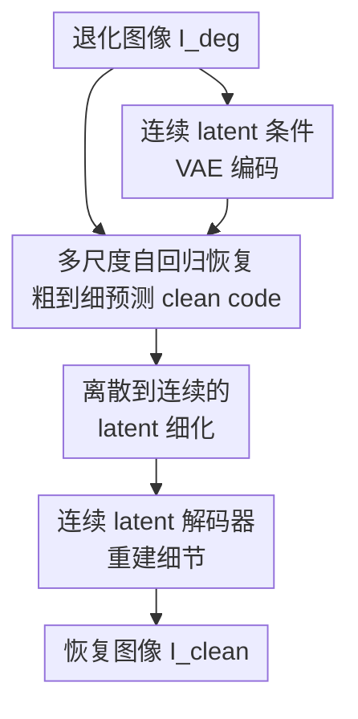

# RestoreVAR: Visual Autoregressive Generation for All-in-One Image Restoration

**会议**: ICLR 2026  
**OpenReview**: [https://openreview.net/forum?id=yvXtCn2zfz](https://openreview.net/forum?id=yvXtCn2zfz)  
**代码**: 暂未公开  
**领域**: 图像恢复 / All-in-One Image Restoration  
**关键词**: 视觉自回归, 全能图像恢复, 多尺度量化, 潜空间细化, 生成式恢复

## 一句话总结
RestoreVAR 把视觉自回归模型 VAR 从纯图像生成改造成全能图像恢复模型，用退化图像的连续 latent 做跨注意力条件，再用 latent refiner 和连续 latent 解码器补回细节，在生成式 AiOR 方法中取得更高恢复质量，并把 LDM 类方法的秒级推理压到约 0.201 秒。

## 研究背景与动机
**领域现状**：All-in-One Image Restoration（AiOR）希望用一个模型同时处理去雾、去雪、去雨、低光增强、去模糊等多种退化。传统非生成式方法，例如 PromptIR、InstructIR、AWRaCLe、DCPT、DFPIR，通常直接学习从退化图像到干净图像的确定性映射，速度快、像素指标强，但对真实世界、混合退化或未见退化的泛化能力经常不稳。近年的生成式 AiOR 则引入扩散模型或 latent diffusion model（LDM），借助大规模生成先验提升感知质量和泛化。

**现有痛点**：LDM-based AiOR 的主要代价是慢。它们在推理时需要多步去噪，例如 Diff-Plugin 约 20 步，AutoDIR 约 100 步，PixWizard 约 60 步；在本文设置下对应 2.04 秒、8.477 秒、8.247 秒每张图。对视频监控、自动驾驶、在线增强这类时间敏感场景，这个速度很难接受。另一个痛点来自 VAE：LDM 和 VAR 都常在 latent 空间工作，但 VAE 与向量量化更偏生成多样性，不一定保留低层视觉任务要求的精确结构，导致纹理、边缘、局部细节被抹掉或扭曲。

**核心矛盾**：图像恢复既需要生成式先验带来的自然图像分布知识，又不能像纯生成那样容忍幻觉；它要求输出在语义上合理，同时在空间结构和像素细节上贴近输入场景。扩散模型有生成先验但慢，非生成模型快但泛化弱，而原始 VAR 虽然快，却没有为“以退化图像为条件生成干净图像”设计，也会受到离散 latent 与 VAE 解码细节损失的限制。

**本文目标**：作者要解决三个具体问题：第一，能否用 VAR 的 scale-space autoregression 替代 LDM 的迭代去噪，从而大幅降低生成式 AiOR 的推理开销；第二，如何把退化图像的信息稳定注入 VAR，避免模型凭生成先验乱补内容；第三，如何缓解 VQ 和 VAE 解码带来的细节损失，让生成式恢复也能追上像素级指标。

**切入角度**：关键观察来自 VAR 的多尺度残差量化。作者把干净图像和退化图像的 VQ-VAE 多尺度 code 做互换实验，发现粗尺度 code 更容易携带 haze、rain、snow、blur、low-light 等退化，而细尺度 code 更多控制场景细节。也就是说，对恢复任务而言，模型不一定要像像素 AR 那样逐点重建一切；它可以先在粗尺度把退化去掉，再在细尺度补回场景细节。这正好契合 VAR 的“从粗到细预测下一尺度”机制。

**核心 idea**：用 VAR 的多尺度自回归生成替代 LDM 的多步去噪，并通过连续 latent 条件、latent refiner 和连续 latent 解码器，把一个快的图像生成 backbone 改造成适合 All-in-One Image Restoration 的生成式恢复框架。

## 方法详解

### 整体框架
RestoreVAR 的输入是一张退化图像 $I_{deg}$，目标是输出接近 ground truth $I_{gt}$ 的干净图像。训练时，干净图像经过多尺度 VQ-VAE 得到 ground-truth code-book indices，VAR transformer 用 teacher forcing 学习逐尺度预测干净 latent 的离散 code；同时，退化图像的连续 latent 被作为条件，通过每个 transformer block 的 cross-attention 注入。推理时，模型只需要沿 10 个尺度自回归预测一次，从粗到细得到离散恢复 latent，再经过 latent refinement transformer 转成连续 latent，最后由微调后的 VAE decoder 解码成图像。

训练被拆成三个目标相对独立的部分。第一部分训练 RestoreVAR transformer：它读取由 clean image 构造的多尺度 teacher-forcing 输入，同时用 degraded continuous latent 做条件，预测 clean image 的每个尺度 code。第二部分训练 latent refinement transformer（LRT）：它接收 RestoreVAR 预测的离散 latent 和最后一层 transformer 表征，预测一个 residual，把离散 latent 推向连续 latent。第三部分微调 VAE decoder：冻结 encoder 和 quantizer，只让 decoder 学会从 clean image 的连续 latent 重建高保真图像。

### 关键设计
**1. 用 VAR 的粗到细尺度空间承接恢复任务**

原始 VAR 不是逐像素或逐 token 线性扫描，而是在多尺度 VQ-VAE latent 上做 next-scale prediction。给定连续 latent $f_{cont}$，VQ-VAE 会在 $K$ 个尺度上做残差量化：第 $k$ 个尺度先量化当前 residual 的下采样结果，得到 index map $r_k$，再把 codebook embedding 上采样并累加进重建 latent。最终图像被表示为一串从粗到细的 code maps $\{r_1, r_2, \ldots, r_K\}$。VAR 学习的就是：

$$
p(r_1, r_2, \ldots, r_K)=\prod_{k=1}^{K}p(r_k \mid r_1, r_2, \ldots, r_{k-1}).
$$

本文的核心洞察是，这种尺度空间分解天然适合图像恢复。作者把 clean image 的粗尺度 code 替换成 degraded image 的粗尺度 code，退化会重新出现；只替换细尺度 code 时，图像整体仍较干净，只是细节有所损失。这说明 haze、rain、snow、low-light、blur 等退化主要占据 coarse scales，而 scene-level details 更多在 fine scales。RestoreVAR 因此把恢复问题变成“先预测不含退化的粗尺度 code，再在细尺度恢复场景细节”，比 LDM 反复 denoise 更直接，也解释了为什么它只用 10 个尺度步骤就能取得较好速度。

**2. 用退化图像的连续 latent 做逐层 cross-attention 条件**

单纯把 VAR 用在 AiOR 上会有一个风险：生成先验很强时，模型可能生成“看起来合理但不属于输入场景”的内容。RestoreVAR 的解法是在每个 transformer block 中加入 cross-attention，让预测 clean code 的过程持续参考退化图像。具体地，第 $i$ 个 block 的 FFN 输出 $x_{block_i}$ 作为 query，退化图像的连续 latent $f^{deg}_{cont}$ reshape 成 conditioning tokens 后作为 key/value，更新形式为：

$$
x_{blockCA}=x_{block_i}+g_i\times CA(x_{block_i}, f^{deg}_{cont}).
$$

这里 $g_i$ 初始化为 0，是一个很重要的稳定化处理：模型刚开始训练时保留 pretrained VAR 的行为，随后逐步学会利用退化图像条件。作者还比较了 continuous conditioning 和 discrete conditioning，发现连续 latent 明显更好；离散 latent 虽然看似更贴近 VAR 的 code prediction 目标，但量化后丢掉了恢复任务需要的细微结构，验证准确率和视觉结果都更差。为了从 256×256 扩到 512×512，模型还把原 VAR 的 absolute positional embeddings 换成 2D RoPE，并移除 AdaLN，减少约 100M 参数且几乎不伤性能。

**3. 离散到连续的 latent 细化解决 VQ 细节瓶颈**

VAR transformer 输出的是离散 latent $f^{pred}_{quant}$，直接送入 VQ-VAE decoder 会出现一个恢复任务无法忽略的问题：向量量化会把连续细节压到 codebook 近邻上，decoder 再解码时容易损失边缘、纹理和局部结构。RestoreVAR 引入轻量级 non-generative latent refinement transformer，把离散 latent 修成连续 latent：

$$
\hat f_{cont}=f^{pred}_{quant}+LRT(f^{pred}_{quant}, z),
$$

其中 $z$ 是 RestoreVAR transformer 最后一层输出，提供一种 pseudo-continuous guidance。这个条件不是装饰性的：消融显示，没有最后一层输出的 LRT 性能从 24.67/0.821 掉到 21.23/0.660，甚至比 no refiner 还差。相比 HART 的 diffusion-based MLP refiner，本文的 LRT 不需要迭代 denoising，只有约 22.97M 参数和 0.0061 秒开销，却达到更好的 PSNR/SSIM。

**4. 只在连续 latent 上微调 VAE decoder，避免恢复图像过度纹理化**

即使 LRT 能预测连续 latent，如果 decoder 本身仍按原始 VQ-VAE 的生成目标工作，输出也会保留 VAE-induced distortions。作者没有照搬 HART 的做法去同时适配离散和连续 latent，因为那样在恢复任务里会产生过度纹理化的结果；RestoreVAR 只用 ground-truth clean image 的连续 latent $f^{gt}_{cont}$ 微调 decoder，并冻结 encoder 与 quantizer。

decoder 的训练目标结合了像素、结构、感知和对抗损失：

$$
L_{dec}=\lambda_1L_{L1}+\lambda_2L_{SSIM}+\lambda_3L_{percep}+\lambda_4L_{adv}.
$$

其中权重为 $\lambda_1=2.0, \lambda_2=0.4, \lambda_3=0.2, \lambda_4=0.01$。PatchGAN discriminator 的作用是避免只用 L1/SSIM/perceptual 时输出偏糊；supplementary 的图像对比显示，加入 adversarial loss 后重建更锐利。这个 decoder 微调把 1000 个样本上的 reconstruction PSNR/SSIM 从原 VAR VQ-VAE 的 22.59/0.679 提到 28.14/0.842，也高于 HART decoder 的 26.48/0.804。

### 一个完整示例
假设输入是一张低光且有运动模糊的街景图。普通非生成式 AiOR 可能直接从像素空间回归，训练分布里如果这种混合退化少，输出容易仍然偏暗或边缘发糊；LDM 方法会把图像编码到 latent 后多步 denoise，能借助生成先验补出更自然的街景，但需要几十到一百步采样，且 VAE 可能让路牌文字、车灯边缘等细节变形。

RestoreVAR 的处理路径更像“先定整体干净结构，再补细节”。图像先被 VAE encoder 编成退化连续 latent，作为条件喂给每个 RestoreVAR block；自回归生成时，模型从 $1\times1, 2\times2, 3\times3$ 等粗尺度开始预测 clean code，这些尺度主要决定图像是否仍然低光、是否保留模糊或雾状退化。等粗尺度变干净后，后续 $18\times18, 24\times24, 32\times32$ 等细尺度再补街道纹理、车体轮廓、建筑边缘。最终离散 latent 不直接解码，而是由 LRT 根据最后一层 transformer 表征预测 residual，把 latent 推回连续空间，再交给连续 latent decoder 输出恢复图像。

这个例子也解释了 LRT 的边界：它不是一个独立恢复器。作者在 supplementary 中把 degraded latent 直接喂给 LRT，即使保留 $z$ 作为输入，输出仍然带 haze，说明真正去退化的主体是 VAR transformer；LRT 和 decoder 主要负责把已经恢复好的 latent 变得更适合像素级重建。

### 损失函数 / 训练策略
RestoreVAR 的三个组件分开训练，以避免目标相互拉扯。VAR transformer 使用 depth 16 的 pretrained VAR backbone，embedding dimension 为 1024，16 个 attention heads，预测 10 个 latent 尺度：$1\times1,2\times2,3\times3,4\times4,6\times6,9\times9,13\times13,18\times18,24\times24,32\times32$。训练目标是 clean code-book indices 的 cross-entropy loss，优化器为 AdamW，学习率 $10^{-4}$，batch size 48，训练 100 epochs。

LRT 使用 depth 12、6 heads、embedding dimension 384，训练目标是预测连续 latent 的 L1 loss，即 $L_{LRT}=L1(\hat f_{cont}, f^{gt}_{cont})$，学习率同为 $10^{-4}$，batch size 96，训练 100 epochs。VAE decoder 微调 5 epochs，学习率 $3\times10^{-4}$，batch size 12。训练数据覆盖五类恢复任务：RESIDE 去雾、Snow100k 去雪、Rain13K 去雨、LOLv1 低光增强和 GoPro 去模糊。训练在 8 张 RTX A6000 上完成，推理在 RTX 4090 上测试。

## 实验关键数据

### 主实验
RestoreVAR 的主结果有两个层面：一是标准 AiOR 数据集上的像素级和感知指标，二是真实/未见/混合退化上的泛化质量。下面的表格摘出五个任务中与生成式方法比较最关键的 PSNR 结果；可以看到 RestoreVAR 在所有五个数据集上都超过 LDM-based generative baselines。

| 数据集 / 退化 | 指标 | RestoreVAR | 最强 LDM 基线 | 提升 |
|--------|------|------|----------|------|
| RESIDE / 去雾 | PSNR↑ | 24.67 | AutoDIR 24.48 | +0.19 dB |
| Snow100k / 去雪 | PSNR↑ | 24.05 | PixWizard 21.24 | +2.81 dB |
| Rain13K / 去雨 | PSNR↑ | 23.97 | AutoDIR 23.02 | +0.95 dB |
| LOLv1 / 低光 | PSNR↑ | 21.72 | AutoDIR 19.43 | +2.29 dB |
| GoPro / 去模糊 | PSNR↑ | 23.96 | AutoDIR 23.55 | +0.41 dB |

如果看完整指标，RestoreVAR 同时在 SSIM 和 LPIPS 上大多优于 Diff-Plugin、AutoDIR、PixWizard。例如 RESIDE 上为 24.67 / 0.821 / 0.074，Snow100k 上为 24.05 / 0.713 / 0.156，Rain13K 上为 23.97 / 0.700 / 0.153，LOLv1 上为 21.72 / 0.782 / 0.126，GoPro 上为 23.96 / 0.737 / 0.167。它仍落后于一些强非生成式模型的像素指标，这是 latent generative restoration 的共同限制，但相比 LDM 类生成式方法，像素保真度已经明显更好。

| 方法 | 推理步数 | 时间 / 张 | TFLOPs | 参数量 |
|------|---------|----------|--------|--------|
| Diff-Plugin | 20 | 2.04s | 16.08 | 859.50M |
| AutoDIR | 100 | 8.477s | 67.80 | 859.50M |
| PixWizard | 60 | 8.247s | 19.27 | 2011.40M |
| RestoreVAR | 10 | 0.201s | 1.05 | 296.95M |

速度是本文最有说服力的结果之一。RestoreVAR 相比 Diff-Plugin 超过 10× 更快，相比 AutoDIR 和 PixWizard 超过 40× 更快。作者还用 DDIM 减少 diffusion sampling steps 做对照：扩散模型只有压到约 2 steps 才能接近 RestoreVAR 的时间，但这会带来超过 3 dB 的 PSNR 下降；在更多 steps 下，速度仍慢且 PSNR 仍落后。

### 消融实验
| 配置 | 关键指标 | 说明 |
|------|---------|------|
| No Refiner | 21.71 / 0.690 | 离散 latent 直接解码，细节损失明显 |
| HART Refiner | 23.48 / 0.777 | diffusion-based MLP refiner，36.06M 参数，0.0455s 开销 |
| LRT w/o Last-Block | 21.23 / 0.660 | 去掉最后层表征 $z$ 后，refiner 缺少 pseudo-continuous guidance |
| Proposed LRT | 24.67 / 0.821 | 22.97M 参数，0.0061s 开销，PSNR/SSIM 最好 |

连续 latent 条件也是关键。作者训练了 discrete conditioning 和 continuous conditioning 两个版本，前 15 个 epoch 的验证准确率显示 continuous conditioning 明显更高；视觉上，discrete conditioning 更容易幻觉。RoPE 替换 APE 的消融则说明，在 512×512 分辨率微调时 RoPE validation accuracy 更好。VAE decoder 的 loss 消融显示，只用 L1 会偏糊，加入 SSIM 改善结构，加入 perceptual loss 增强锐度，再加 discriminator 后输出进一步变清晰。

### 关键发现
- 最核心的模块是 RestoreVAR transformer 本身。supplementary 中直接让 LRT 操作 degraded quantized / continuous latent 时，结果仍然带退化，说明 LRT 不是偷偷变成一个非生成式恢复网络；它只是在 VAR 已经恢复的 latent 上做细节补偿。
- 粗尺度确实承担主要去退化作用。把 RestoreVAR 输出的粗尺度替换回 degraded image 的粗尺度，退化会重新出现；只替换细尺度，整体清洁程度变化小。这和作者在 clean/degraded pair 上做的 scale-space analysis 一致。
- 泛化实验中，RestoreVAR 在真实、未见和混合退化上平均 MUSIQ / CLIPIQA 为 56.217 / 0.383，显著高于非生成式模型平均值；用户研究中 RestoreVAR 平均得分 4.36，高于 AutoDIR 的 3.68 和多种非生成式方法，说明人的偏好更认可它的感知质量和场景一致性。
- 计算瓶颈主要在 RestoreVAR transformer。runtime breakdown 显示 VAE 编解码约 0.0086s，transformer 约 0.1863s，LRT 约 0.0061s，因此未来提速重点应是更高效的 VAR backbone 或 token pruning，而不是 decoder 或 refiner。

## 亮点与洞察
- 这篇论文最漂亮的地方不是简单说“VAR 比 diffusion 快”，而是先证明 VAR 的尺度分解和恢复任务之间存在结构对应：退化偏粗尺度，细节偏细尺度。这个观察让方法选择有了任务层面的理由，而不是只追逐一个更快的生成 backbone。
- continuous latent conditioning 是一个很务实的设计。恢复任务关心空间对应和细节，退化图像的量化 code 会丢掉很多微妙信息；直接用连续 latent 做 cross-attention，既给 VAR 足够条件，又避免把输入过早离散化。
- LRT 的定位很清晰：不是再造一个扩散 refiner，而是用非生成式 transformer 一步预测 residual，把离散 latent 推向连续 latent。它把 HART 式 refiner 的迭代开销去掉，同时保留了细节修正收益。
- decoder 微调只面向连续 latent，这个取舍很适合 image restoration。纯生成模型喜欢丰富纹理，但恢复任务怕“看似真实但不忠实”；本文避开同时适配离散 latent 的过度纹理化倾向，把 decoder 对齐到 clean image reconstruction。
- 这条路线可以迁移到其他低层视觉逆问题，例如 real-world super-resolution、低光视频增强、压缩伪影去除。关键不是把 VAR 直接套上去，而是先分析目标退化在多尺度 latent 中的分布，再决定哪些尺度该强条件、哪些阶段该保细节。

## 局限与展望
- RestoreVAR 仍受 VAE decoder 和 LRT 上限约束。作者明确指出，LRT 虽然大幅优于 no refiner，但还达不到直接从 ground-truth continuous latent 解码的上界；更好的 VQ-VAE、continuous tokenizer 或 refiner architecture 仍可能明显提升恢复质量。
- 极端退化场景仍然困难。supplementary 展示了 SID 数据集中的极暗低光样本，RestoreVAR 输出明显不如 ground truth，说明当输入信息严重缺失时，VAR 的生成先验和 latent 条件也不足以可靠恢复。
- 与非生成式方法相比，RestoreVAR 的像素指标仍不是全面最优。例如 PromptIR、AWRaCLe、DFPIR 等在部分标准数据集上 PSNR/SSIM 更高。本文的优势更偏“生成式方法内部的速度和保真度改进”以及真实/未见退化上的感知泛化。
- 当前 VAR backbone 只在约 1M ImageNet-1K 图像上预训练，而 LDM 竞争方法通常继承 Stable Diffusion 等更大规模预训练先验。未来如果 VAR backbone 扩大数据和模型规模，RestoreVAR 的泛化可能继续提升，但也需要重新评估速度、显存和训练成本。
- 方法目前覆盖五类退化，尚未证明能自然扩展到更复杂的真实相机 ISP 退化、压缩链路、多帧视频一致性或开放词汇指令式恢复。把 VAR 的尺度生成和文本/任务 prompt 结合，是一个自然后续方向。

## 相关工作与启发
- **vs Diff-Plugin / AutoDIR / PixWizard**: 这些方法都借助 LDM 或更大生成模型先验做 AiOR，优点是感知质量和真实退化泛化，缺点是多步采样慢且 VAE 细节损失明显。RestoreVAR 用 scale-space autoregression 替换 diffusion denoising，在生成式 AiOR 中同时提高 PSNR/SSIM/LPIPS 并显著降低推理时间。
- **vs PromptIR / InstructIR / AWRaCLe / DCPT / DFPIR**: 非生成式方法直接回归 clean image，速度和标准像素指标强，但真实、未见、混合退化上的感知质量不稳定。RestoreVAR 不一定在所有像素指标上赢过它们，但在人类偏好和 no-reference 泛化指标上更接近生成式方法的优势。
- **vs VarSR / Varformer**: VarSR 只做超分辨率，Varformer 使用 VAR 的中间特征去辅助一个非生成式 AiOR 网络。RestoreVAR 的不同点在于它是直接生成 clean latent 的 VAR-based generative restoration model，并围绕条件注入、latent refinement、decoder 微调系统改造。
- **vs HART refiner**: HART 用 diffusion-based MLP 把离散 latent 转连续 latent，适合高效图像生成，但对恢复任务开销偏大且效果不如本文 LRT。RestoreVAR 的 LRT 更轻、更快，还显式利用 VAR 最后一层输出作为 pseudo-continuous guidance。
- **启发**: 对低层视觉任务来说，生成模型的 tokenization 不是中性选择。本文提醒我们：如果能解释退化、结构和细节分别落在哪些 latent 尺度或 token 子空间里，模型设计会比“拿一个大生成模型做条件生成”更有针对性。

## 评分
- 新颖性: ⭐⭐⭐⭐⭐ 把 VAR 的 scale-space autoregression 系统改造成生成式 AiOR，并用尺度互换实验支撑方法动机，想法清楚且有新意。
- 实验充分度: ⭐⭐⭐⭐⭐ 覆盖五个标准恢复任务、真实/未见/混合退化、用户研究、复杂度对比和多项消融，主张基本都有证据支撑。
- 写作质量: ⭐⭐⭐⭐ 方法图和实验组织清晰，scale-space analysis 很直观；不足是部分实验表格密度较高，非生成式与生成式比较的 caveat 需要读者细看。
- 价值: ⭐⭐⭐⭐⭐ 对生成式图像恢复很有价值，尤其是给出了一条比 LDM 更快、比普通 VAR 更忠实输入的路线，适合后续扩展到更实时的恢复场景。

<!-- RELATED:START -->

## 相关论文

- [\[ICLR 2026\] Rethinking Expressivity and Degradation-Awareness in Attention for All-in-One Blind Image Restoration](rethinking_expressivity_and_degradation-awareness_in_attention_for_all-in-one_bl.md)
- [\[CVPR 2025\] Visual-Instructed Degradation Diffusion for All-in-One Image Restoration](../../CVPR2025/image_restoration/visual-instructed_degradation_diffusion_for_all-in-one_image_restoration.md)
- [\[ICLR 2026\] Learning Domain-Aware Task Prompt Representations for Multi-Domain All-in-One Image Restoration](learning_domain-aware_task_prompt_representations_for_multi-domain_all-in-one_im.md)
- [\[CVPR 2026\] DVAR: Dynamic Visual Autoregressive Modeling for Image Super-Resolution](../../CVPR2026/image_restoration/dvar_dynamic_visual_autoregressive_modeling_for_image_super-resolution.md)
- [\[CVPR 2025\] Degradation-Aware Feature Perturbation for All-in-One Image Restoration](../../CVPR2025/image_restoration/degradation-aware_feature_perturbation_for_all-in-one_image_restoration.md)

<!-- RELATED:END -->
