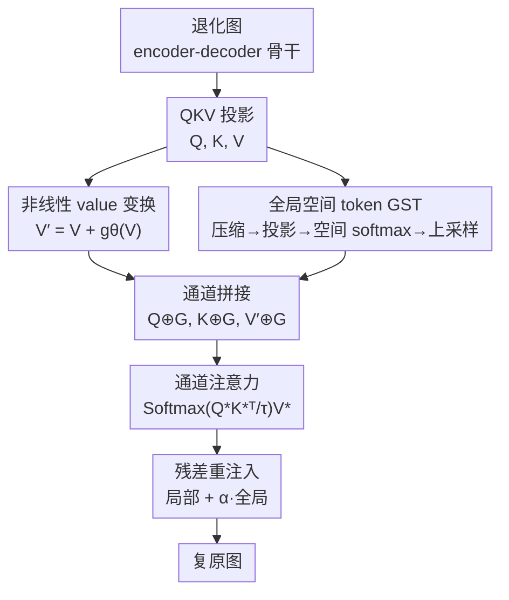

# Rethinking Expressivity and Degradation-Awareness in Attention for All-in-One Blind Image Restoration

**会议**: ICLR 2026  
**OpenReview**: [https://openreview.net/forum?id=IBzmQVia88](https://openreview.net/forum?id=IBzmQVia88)  
**论文**: [项目页 ExDA](https://amazingren.github.io/ExDA/)  
**代码**: 论文承诺接收后开源（暂未释出）  
**领域**: 图像恢复 / 注意力机制  
**关键词**: All-in-One 图像恢复, 盲恢复, Restormer, 非线性 value, 全局空间 token

## 一句话总结
针对 Restormer 式通道注意力在 All-in-One 盲图像恢复中暴露的两个被忽视的瓶颈——value 路径纯线性、缺少显式全局槽位——本文提出两个极简且骨干无关的原语（非线性 value 变换 + 全局空间 token），在几乎零额外开销下把注意力从"特征选择器"升级为"选择器+变换器"并赋予退化感知能力，在六大 All-in-One 基准上一致超越更大的 SOTA。

## 研究背景与动机

**领域现状**：All-in-One 图像恢复要求**一个模型**同时应对噪声、模糊、雨、雾、低光等多种、且在真实场景下往往混合未知的退化。这比单任务恢复本质更难——它不是学一个固定的逆映射，而是要逼近**一族异质的逆函数**。当前主流骨干是 Restormer 式架构：用通道维注意力（MDTA）替代逐 token 自注意力把复杂度降到线性，再配 gated-dconv 前馈网络（GDFN），已成为高分辨率恢复的事实标准。

**现有痛点**：作者用 All-in-One 的视角重新审视这套设计，发现两个被长期忽视的结构性缺陷。其一，注意力的 **value 路径是纯线性的**：Q、K 通过 softmax 做非线性交互，但 V 只是被线性加权聚合，导致输出被约束在输入特征的张成空间（凸包）内。更糟的是 GDFN 有一条分支本质也是线性的，让一部分信息绕过了所有非线性变换，使整个 block 的非线性更弱。其二，通道注意力**彻底丢掉了显式全局槽位**：标准 ViT 用 CLS token 聚合全局语义，但低层视觉里这个 token 常被当成"对像素级预测无用"而丢弃，Restormer 也沿用此做法，只靠局部 depth-wise 卷积。

**核心矛盾**：这两个缺陷在**单任务**里无伤大雅——逆函数固定已知，线性 value 够用、退化类型也不需要推断。但在 **All-in-One** 场景下它们成了根本瓶颈：模型既要在高频去噪和低频去雾这类截然不同的逆映射间游走（需要**表达力**），又必须从输入本身推断出当前是什么退化（需要**退化感知**），而线性 value 限死了表达力、缺失全局槽位则让退化上下文只能隐式地散布在通道里。

**本文目标**：在不引入 prompt 模块、不堆多阶段复杂结构的前提下，直接回到骨干本身，分别补上"表达力"和"退化感知"这两块短板。

**切入角度**：与近期大量转向多模态大模型、外挂 prompt 的工作相反，作者主张退化原理仍未被充分理解，应当**重新思考注意力原语本身**。从函数逼近的角度看，把非线性放在聚合**之前**才能真正扩张可实现的函数族；从诊断分析看，显式全局 token 能捕获有意义的退化上下文。

**核心 idea**：用两个极简、骨干无关的原语改造任意 Restormer 式注意力——**聚合前的非线性 value 变换**打破线性张成约束，**全局空间 token（GST）**提供显式的退化感知槽位。

## 方法详解

### 整体框架
ExDA 不改 Restormer 的宏观 encoder-decoder 形状（作者甚至专门论证简单的 encoder-decoder 骨干对 All-in-One 已经足够强），只在每个通道注意力算子内部动两处手术。一张退化图进来，经标准 QKV 投影后：先对 value 做一次轻量残差非线性变换 $V'=V+g_\theta(V)$，让聚合前的特征跳出输入张成空间；同时由输入特征生成一组内容自适应的全局空间 token $G$；把 $G$ 沿通道维拼接到 $Q,K,V'$ 上一起做注意力；最后把局部通道输出和全局 token 输出按可学习残差系数 $\alpha$ 重新融合。整个改动 backbone-agnostic、开销可忽略，却同时补上了表达力和退化感知。

### 关键设计

**1. 非线性 value 变换：把注意力从"选择器"升级为"选择器-变换器"**

这一设计直击第一个瓶颈——线性 value 把输出锁死在输入张成空间内。作者先用合成函数逼近和 MNIST 复原两组诊断实验证明这不是空谈：线性 value 注意力在关键区域系统性失败，收敛差出 50.4%，而非线性 value 在 MNIST 上带来 5.92 dB 的 PSNR 提升（19.2→25.1 dB）。修法是在聚合**之前**给 value 加一条轻量非线性支路，并用残差形式平衡保真与变换：

$$V' = V + g_\theta(V),\quad g_\theta = \text{Conv}_{1\times1}\to\text{DWConv}_{3\times3}\to\text{GELU}\to\text{Conv}_{1\times1}$$

两个细节是关键。**位置必须在聚合前**：注意力 $\text{Softmax}(QK^\top/\sqrt{d})V'$ 本身只能做线性组合，若把非线性放在聚合后，输出仍逃不出线性张成的根本约束——只有改造 $V'$ 才能真正扩张可实现的函数族。**形式必须是残差且可学习**：消融显示残差（$V+g_\theta(V)$）稳定优于原地替换（$g_\theta(V)$），可学习参数化映射也明显优于纯 Sigmoid/GELU 这类无参非线性。这样改造后，通道注意力从只会"挑选并加权已有特征"的线性选择器，变成能"挑选并变换出新特征"的非线性变换器，恰好补上单任务到 All-in-One 之间的表达力鸿沟。

**2. 全局空间 token（GST）：给注意力补一个显式的退化感知槽位**

这一设计针对第二个瓶颈——没有显式全局槽位，退化上下文只能隐式散落在局部通道交互里，模型难以区分根本不同的退化类型。作者把被丢弃的 CLS token 概念重新引入，但做成**内容自适应**而非固定全局平均池化。具体流程（Alg. 1）：对输入特征做 stride-$s$ 的高效空间压缩 $\tilde X=\text{AvgPool}_s(X)$，经多头投影得到 $\Phi$，再沿空间维做 softmax 归一化 $G_{\text{compact}}=\text{Softmax}_{\text{spatial}}(\Phi)$，最后双线性上采样回原分辨率得到 $G\in\mathbb{R}^{B\times h\times K\times HW}$。

关键在于"内容自适应池化"：每个 token 通过可学习投影 + 空间 softmax 自然发展出不同的空间强调模式，在训练中**无需任何退化标签或监督**就自发分工——噪声 token 关注分散的高频区域、模糊 token 强调平滑低频区、雾 token 响应大尺度光照结构。生成的 $G$ 直接沿通道拼接进注意力：

$$[Q^*,K^*,V^*]=[Q\oplus G,\ K\oplus G,\ V'\oplus G]$$

注意力算完后，把局部通道贡献和全局 token 贡献分开，用可学习残差系数 $\alpha$（初始化 0.1，避免一开始就压过局部特征）重新注入：

$$\text{Output}=\text{Attn}[:,:,:C,:]+\alpha\cdot\text{Attn}[:,:,C:,:]$$

stride $s$ 控制压缩粒度，$s=2$ 在信息保留与紧凑性间取得最优（32.71 dB）。t-SNE/UMAP 可视化证实：加上 GST 后退化类型的嵌入空间从相互重叠变得清晰紧凑，NMI 从 0.71 升到 0.88、ARI 从 0.56 升到 0.89，说明这个槽位确实演化成了有意义的退化嵌入。

### 损失函数 / 训练策略
方法是骨干层面的原语改造，沿用标准恢复训练流程，不引入额外 prompt 模块或多阶段策略。非线性 value 部署在 encoder 与 decoder 全部 block 时增益最大（仅放一侧均略逊）；GST 残差系数 $\alpha$ 初始化为 0.1 以实现渐进学习。

## 实验关键数据

### 主实验
在六大 All-in-One 基准（3 退化 / 5 退化 / 混合 CDD11 / 恶劣天气 / 真实 WeatherBench / 医学）上评估，ExDA 一致超越更大、甚至外挂语言/多任务/prompt 的方法。

| 设置 | 指标 | ExDA (22M) | 之前最佳 | 提升 |
|--------|------|------|----------|------|
| 3 退化 Average | PSNR | **32.96** | MoCE-IR 32.73 (25M) | +0.23 dB，少 3M 参数 |
| 5 退化 Average | PSNR | **30.83** | MoCE-IR 30.58 | +0.25 dB |
| 混合 CDD11 Avg. | PSNR | **29.97** | MoCE-IR 29.05 | +0.92 dB |
| 恶劣天气 Average | PSNR | **33.92** | Histoformer 33.68 | +0.24 dB |
| 真实 WeatherBench | PSNR | **29.68** | AdaIR 28.80 | +0.88 dB |
| 医学 3 任务 Average | PSNR | **34.30** | AMIR 34.28 | +0.02 dB |

### 消融实验
组件分析从 PromptIR 基线出发逐步叠加（3 退化设置，PSNR/SSIM）：

| 配置 | PSNR | 说明 |
|------|---------|------|
| (a) PromptIR | 32.06 / .913 | 基线 |
| (b) PromptIR w/o Prompt | 30.75 / .901 | 去掉 prompt 大幅掉点 |
| (c) b + 非线性 value | 32.54 / .917 | 单加非线性 value 即明显回升 |
| (d) b + GST | 32.67 / .918 | 单加 GST 也带来一致增益 |
| (e) c + d 完整模型 (22M) | **32.96 / .921** | 两者叠加最优 |
| (f) Ours-Small (10M) | 32.83 / .920 | 缩小仍极具竞争力 |
| (g) Ours-Tiny (6M) | 32.71 / .919 | 仅 6M 仍逼近完整模型 |

非线性 value 设计消融（Tiny 模型）：残差 + 可学习 + encoder&decoder 全部署最优（GELU 残差 32.71 vs 原地 32.45；可学习 32.71 vs 无参 32.30）。

### 关键发现
- **两个原语贡献互补且都为正**：去掉 prompt 后单加非线性 value（+1.79 dB 相对 b）或单加 GST（+1.92 dB 相对 b）都能回补，叠加才到最优 32.96，证明表达力与退化感知是两条独立短板。
- **极致轻量仍强**：Tiny 仅 6M 参数就达 32.71 dB，说明一旦核心原语设计到位，超轻量模型也能打——增益来自结构而非堆参数。
- **混合退化收益最大**：在 CDD11 混合退化上领先 0.92 dB，远超单退化上的领先幅度，印证两个原语正是为"异质逆函数族"量身设计。
- **退化感知可量化**：GST 把退化嵌入聚类的 NMI/ARI 从 0.71/0.56 提到 0.88/0.89，注意力可视化显示它确实聚焦退化相关区域（雨纹、暗区、雾团），无需标签。
- **效率友好**：延迟随分辨率近似 $O(HW)$ 线性增长（256² 到 1024² 为 54.5→840.1 ms），ExDA-Small 取得最佳精度-效率平衡。

## 亮点与洞察
- **"value 才是表达力关键"是反直觉的好观察**：以往线性化 attention 的工作多在 Q/K 上加非线性核，本文反其道而行，论证 value 空间对学鲁棒表示更关键，且非线性必须放在聚合前——这条函数逼近层面的论证简单但有说服力。
- **把被丢弃的 CLS token"废物利用"**：低层视觉一向认为全局 token 无用，本文却让它在 All-in-One 下自然演化成退化嵌入，是"老概念换新场景"的典型范例。
- **两个原语都 backbone-agnostic**：可即插即用嵌入任意 Restormer 式架构，几乎零开销，迁移成本极低，这种"最小改动+广泛适用"很适合被后续工作复用。
- **诊断驱动的设计方法论**：先用合成函数+MNIST 隔离验证瓶颈，再用 t-SNE/UMAP/谱分析印证机制，整篇把"为什么有效"讲得比"做了什么"更扎实。

## 局限与展望
- **改进幅度在饱和基准上偏小**：医学 3 任务平均仅 +0.02 dB、恶劣天气 RainDrop 上 PSNR 甚至略逊 Histoformer，说明在已接近上限的子任务上原语红利有限。
- **仍依赖回归式骨干**：方法绑定 Restormer 式通道注意力，对扩散/分布式恢复范式是否同样有效未验证。
- **GST 的可解释性主要靠定性可视化**：噪声/模糊 token 的"自发分工"目前靠注意力图和聚类指标佐证，缺乏更严格的因果验证。
- **代码与权重尚未释出**（承诺接收后开源），复现需等待。
- 可延伸方向：把非线性 value + 全局槽位的思路迁移到 Mamba/SSM 类恢复骨干，或与轻量 prompt 互补而非互斥。

## 相关工作与启发
- **vs Restormer**: Restormer 用通道注意力换线性复杂度、成为 IR 事实标准，但 value 纯线性、无全局槽位；ExDA 正是在其内部补这两刀，不改宏观结构却显著提点。
- **vs PromptIR / AdaIR（prompt 路线）**: 它们靠学习视觉 prompt 或频率感知 prompt 注入退化先验，训练成本高、效率降；ExDA 不外挂 prompt，直接在骨干算子里实现退化感知，更轻更省。
- **vs 线性化 attention（Katharopoulos / Shen / Shazeer 等）**: 它们在 Q/K 上加非线性核以高效逼近 softmax；ExDA 论证 value 空间更关键，把非线性加在聚合前的 V 上，方向正交。
- **vs MoCE-IR（当前最强 all-in-one 基线）**: MoCE-IR 用更大模型/专家混合取胜；ExDA 以更少参数（22M vs 25M）在多数基准反超，尤其混合退化领先 0.92 dB。

## 评分
- 新颖性: ⭐⭐⭐⭐⭐ 从 All-in-One 视角重新诊断注意力原语，两个极简改动直击表达力与退化感知，角度清新且论证扎实
- 实验充分度: ⭐⭐⭐⭐⭐ 六大基准 + 合成诊断 + 聚类/谱分析 + 效率曲线，组件消融与机制验证都到位
- 写作质量: ⭐⭐⭐⭐ "诊断瓶颈→提出原语→验证机制"叙事清晰，公式与图表配合好，个别段落略冗
- 价值: ⭐⭐⭐⭐⭐ backbone-agnostic、零开销、可即插即用，对整个 Restormer 式 IR 生态有直接复用价值

<!-- RELATED:START -->

## 相关论文

- [\[ICLR 2026\] RestoreVAR: Visual Autoregressive Generation for All-in-One Image Restoration](restorevar_visual_autoregressive_generation_for_all-in-one_image_restoration.md)
- [\[CVPR 2026\] Degradation-Consistent Test-Time Adaptation for All-in-One Image Restoration](../../CVPR2026/image_restoration/degradation-consistent_test-time_adaptation_for_all-in-one_image_restoration.md)
- [\[CVPR 2026\] Retrieve-to-Restore: Efficient All-in-One Image Restoration with a Retrieval-Based Degradation Bank](../../CVPR2026/image_restoration/retrieve-to-restore_efficient_all-in-one_image_restoration_with_a_retrieval-base.md)
- [\[ICLR 2026\] Learning Domain-Aware Task Prompt Representations for Multi-Domain All-in-One Image Restoration](learning_domain-aware_task_prompt_representations_for_multi-domain_all-in-one_im.md)
- [\[CVPR 2025\] Degradation-Aware Feature Perturbation for All-in-One Image Restoration](../../CVPR2025/image_restoration/degradation-aware_feature_perturbation_for_all-in-one_image_restoration.md)

<!-- RELATED:END -->
