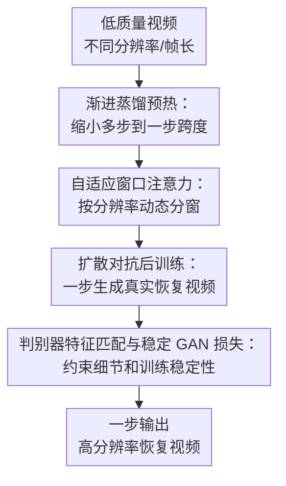

# SeedVR2: One-Step Video Restoration via Diffusion Adversarial Post-Training

**会议**: ICLR2026  
**OpenReview**: [https://openreview.net/forum?id=x1FRyko9eC](https://openreview.net/forum?id=x1FRyko9eC)  
**论文**: [Project Page](https://iceclear.github.io/projects/seedvr2/)  
**代码**: 待发布  
**领域**: 图像恢复 / 视频恢复  
**关键词**: 一步视频恢复、扩散模型加速、对抗后训练、自适应窗口注意力、视频超分辨率  

## 一句话总结
SeedVR2 把多步扩散式视频恢复模型通过扩散对抗后训练压缩成一步生成器，并用自适应窗口注意力、渐进蒸馏和判别器特征匹配损失支撑高分辨率视频恢复，在一步推理下达到接近甚至优于多步视频恢复模型的感知质量。

## 研究背景与动机
**领域现状**：真实世界视频恢复和视频超分辨率正在从传统 CNN/Transformer 恢复模型转向扩散模型。扩散模型的优势是能补出更真实的纹理和细节，尤其在重退化、AIGC 视频增强、低质真实视频修复这类没有干净退化模型的场景里，比单纯回归式方法更有生成能力。

**现有痛点**：扩散视频恢复的最大问题是推理太慢。UAV、MGLD-VSR、VEnhancer、STAR、SeedVR 这类方法为了维持稳定质量，通常需要几十步采样；当输入变成长视频或 1080p 以上高分辨率视频时，延迟会被时间维度和空间分辨率同时放大。已有一步图像恢复方法虽然说明扩散模型可以被加速，但很多方法依赖教师模型蒸馏、固定扩散先验或图像级设计，直接搬到视频恢复会遇到教师采样成本高、时间一致性不足、高分辨率窗口伪影等问题。

**核心矛盾**：视频恢复需要同时满足三个条件：一步推理要快，高分辨率细节要真实，时序和内容又不能偏离低质量输入。传统蒸馏能减少步数，却容易把学生模型限制在教师上界里，并在极少步数下产生过平滑结果；纯 GAN 式恢复虽然快，但生成能力通常不如扩散模型。本文的关键矛盾就是：怎样保留扩散 Transformer 的强生成先验，同时摆脱多步采样和教师蒸馏的成本。

**本文目标**：作者希望训练一个面向真实世界视频恢复的一步模型：输入低质量视频，输出高分辨率恢复视频；推理时只走一次生成网络；在 720p、1080p、不同长宽比和不同视频长度下都尽量稳定；同时在感知质量上不输给 50 步扩散式视频恢复模型。

**切入角度**：SeedVR2 选择从 SeedVR 这类已经训练好的大规模视频恢复扩散 Transformer 出发，不再把它当作固定教师或固定先验，而是用 Adversarial Post-Training (APT) 把整个网络继续训练成一步生成器。这个角度的好处是，模型不是只模仿教师输出，而是直接和真实数据做对抗学习，因此理论上有机会超过初始多步模型或至少摆脱教师上界。

**核心 idea**：用扩散对抗后训练把 SeedVR 变成一步视频恢复生成器，再针对视频恢复补上高分辨率自适应窗口、渐进蒸馏预热和高效特征匹配损失，使一步模型既快又能保持真实细节。

## 方法详解

### 整体框架
SeedVR2 的输入是一段低质量视频，目标是一次前向就输出高分辨率恢复视频。整体上，它先以 SeedVR 扩散 Transformer 为初始化，通过渐进蒸馏把 64 步教师逐步压到一步学生，再进入扩散对抗后训练；模型结构上，生成器和判别器都采用带自适应窗口注意力的 Swin-MMDIT，判别器不仅给 GAN logits，还抽取中间层特征来约束恢复结果。

从训练视角看，SeedVR2 并不是简单地“把采样步数设为 1”。它先让学生模型学会从一步近似多步 SeedVR 的向量场，再用真实视频对抗训练修正蒸馏带来的过平滑倾向。自适应窗口注意力贯穿生成器和判别器，解决的是高分辨率输入下窗口尺寸和训练分辨率不一致的问题；稳定 GAN 损失和特征匹配损失则解决超大生成器/判别器对抗训练容易退化的问题。

### 关键设计
**1. 渐进蒸馏预热：缩小多步到一步跨度**

如果直接把一个 64 步视频恢复扩散模型拿来做一步对抗训练，初始模型和目标一步生成器之间的差距太大，模型容易先丢掉恢复能力，再靠 GAN 慢慢补回来。SeedVR2 在对抗训练前加入 progressive distillation：以 SeedVR 为教师，从 64 个采样步开始，按 stride 2 逐步把学生蒸馏到一步，每个蒸馏阶段约训练 10K iterations，用简单的均方误差监督向量场。

这个设计并不是为了让最终模型停留在教师上界内，而是为了给后续对抗训练一个足够好的起点。作者还在对抗训练阶段把训练数据的时间长度从图像逐步扩展到不同帧数的视频片段，使模型既能处理单帧图像，也能处理不同长度的视频。一个有趣结果是，3B 版本由 7B 初始模型蒸馏而来，却在若干真实/AIGC 指标和用户偏好上比 7B 版本更讨喜，说明这个预热阶段不只是压缩步数，也可能改善一步模型的可训练性。

**2. 自适应窗口注意力：按分辨率动态分窗**

SeedVR 使用窗口注意力来降低视频 Transformer 的计算量，但固定窗口在高分辨率测试时会出问题。论文观察到，当 720p 左右训练、1080p 或更高分辨率测试时，固定窗口可能在窗口边界产生明显伪影；原因是训练时模型没有充分见过这些窗口切分和边界重叠情况，RoPE 在窗口内部的位置泛化也会被固定尺寸限制。

SeedVR2 令视频特征 $X \in \mathbb{R}^{d_t \times d_h \times d_w \times d_c}$ 的窗口大小随分辨率动态变化。训练时，在特征分辨率约为 $d_h \times d_w = 45 \times 80$ 的 720p 条件下，窗口大小由

$$
p_t = \left\lceil \frac{\min(d_t, 30)}{n_t} \right\rceil,\quad
p_h = \left\lceil \frac{d_h}{n_h} \right\rceil,\quad
p_w = \left\lceil \frac{d_w}{n_w} \right\rceil
$$

确定，其中 $n_t,n_h,n_w$ 控制三个维度上的窗口数量，$\min(d_t,30)$ 避免训练和推理时序长度差距过大。测试时，作者不是直接用测试特征的绝对高宽，而是先构造一个保持测试长宽比、面积等于训练特征面积的代理分辨率 $\tilde d_h \times \tilde d_w$，再代入同一分窗公式。这样做的直觉是：让高分辨率测试样本在“窗口相对配置”上尽量像训练样本，而不是让窗口尺寸随绝对像素暴涨。

**3. 扩散对抗后训练：一步生成而不被教师上界锁住**

APT 的核心是把预训练扩散模型改造成一步生成器，并用判别器对真实数据进行对抗学习。SeedVR2 沿用这一思想，但把场景从文本到视频生成换成条件视频恢复：生成器接收低质量视频、噪声和文本条件，输出恢复样本；判别器同样基于扩散 Transformer 初始化，并加上 cross-attention-only blocks 产生 logits。

相比单纯 distillation，扩散对抗后训练的意义在于最终优化目标不是“复刻教师输出”，而是“让恢复视频在真实数据分布上更可信”。这对视频恢复尤其重要，因为强退化场景中干净真值本身存在多解，逐像素或逐向量场模仿容易把纹理平均掉。作者在附加实验中专门比较了 progressive distillation baseline 和 SeedVR2：在 VideoLQ 上，纯蒸馏的 MUSIQ 为 45.57、DOVER 为 6.609，而 Ours-3B 达到 51.09 和 8.176；在 AIGC28 上，纯蒸馏 NIQE 为 4.857、CLIP-IQA 为 0.416，而 Ours-3B 为 3.801 和 0.561。这说明对抗阶段确实承担了恢复感知细节的核心作用。

**4. 判别器特征匹配与稳定 GAN 损失：约束细节和训练稳定性**

大规模视频恢复 GAN 很容易训练不稳。SeedVR2 首先把 APT 中的 non-saturating GAN loss 换成 RpGAN loss，并加入近似 R2 正则，惩罚判别器在假样本附近的梯度变化。近似 R2 写作

$$
L_{aR2}=\lVert D(\hat{x},c)-D(N(\hat{x},\sigma I),c)\rVert_2^2,
$$

其中 $\hat{x}$ 是由模型速度场转换出的预测样本，$c$ 是文本条件，$N(\hat{x},\sigma I)$ 表示在预测样本附近加高斯扰动。它的作用不是直接提升某个图像指标，而是让判别器不要在假样本附近形成过尖锐、过不稳定的判别边界。

另一方面，视频恢复常用 LPIPS 来改善感知质量，但 SeedVR2 的预测位于 latent space，若每次都解码到 pixel space 再算 LPIPS，高分辨率视频训练成本过高。作者改用判别器特征匹配损失：从判别器 Transformer backbone 的第 16、26、36 个 block 前抽取预测和真值的特征，用 $L_1$ 距离约束

$$
L_F=\frac{1}{3}\sum_{i=16,26,36}\lVert D_i^F(\hat{x},c)-D_i^F(x,c)\rVert_1.
$$

这相当于把判别器中间层当作任务内的感知网络，避免额外训练视频 LPIPS 或昂贵像素解码。消融表明，从 RpGAN+R1+R2+L1 到再加入 $L_F$，YouHQ40 上 LPIPS 从 0.251 降到 0.244，DISTS 从 0.099 降到 0.092；提升幅度不夸张，但方向稳定，并且没有明显增加训练成本。

### 一个完整示例
假设输入是一段 100 帧、720p 左右的低质量 AIGC 视频，里面有压缩噪声、纹理糊、局部边缘断裂。传统多步扩散视频恢复会从噪声或低质条件出发，反复采样几十步来逐渐恢复细节；SeedVR2 的推理路径更短：低质量视频先被编码到 latent/video feature，生成器只前向一次，就直接给出 4 倍上采样后的恢复结果。

在这个过程中，自适应窗口注意力会根据当前视频的时空尺寸计算窗口，而不是死用训练时的固定窗口。若测试视频长宽比和训练数据不同，模型先把它映射到训练面积一致的代理高宽，再决定窗口大小，从而减少窗口边界位置突然变成模型陌生配置的概率。最终输出会保留输入的主体结构，例如鸟的羽毛、建筑线条、文字边缘或狗脸纹理；对抗训练和特征匹配负责让这些细节看起来更真实，而渐进蒸馏预热负责避免模型为了“真实”而忘掉恢复任务本身。

### 损失函数 / 训练策略
训练资源上，SeedVR2 使用 72 张 NVIDIA H100-80G，在每个 batch 中处理约 100 帧 720p 视频，结合 sequence parallel 和 data parallel。训练数据包括约 10M 图像对和 5M 视频对，退化合成设置跟 UAV 一致。优化器为 AdamW，weight decay 为 0.01，学习率为 $1 \times 10^{-6}$。

训练流程可理解为三段：第一段先按本文自适应窗口设计训练一个 7B SeedVR 初始模型；第二段用 progressive distillation 从 64 步逐步到一步，每段约 10K iterations，蒸馏损失在 flow matching 的 vector field 上计算；第三段进入对抗后训练，生成器损失包含 GAN loss、$L_1$ loss 和 feature matching loss，默认权重在方法部分描述为 1.0，但最终模型为了更好的视觉质量，将 $L_1$ 和 $L_F$ 权重降到 0.1，以避免过度平滑。判别器更新时使用 GAN loss，并将近似 R1/R2 正则权重设为 1000。

这个训练策略的取舍很明确：蒸馏阶段负责把多步能力“搬到一步附近”，对抗阶段负责突破回归/蒸馏带来的感知上界，损失权重则在 fidelity 和 realism 之间调节。作者也提醒，过大的 $L_1$ 或特征匹配权重会提升保真度但让结果偏平滑，过强 GAN 权重则可能带来更锐但不稳的细节。

## 实验关键数据

### 主实验
论文在合成 VSR benchmark、真实 VideoLQ 和自收集 AIGC28 上评估。合成数据有 ground truth，采用 PSNR、SSIM、LPIPS、DISTS；真实和 AIGC 数据没有真值，采用 NIQE、MUSIQ、CLIP-IQA、DOVER。需要注意，SeedVR2 的主张不是每个传统失真指标都第一，而是在一步推理下给出更强感知质量和速度质量折中。

| 数据集 | 指标 | Ours-3B | Ours-7B | 对照方法 / 之前强基线 | 关键信息 |
|--------|------|---------|---------|------------------------|----------|
| SPMCS | LPIPS ↓ / DISTS ↓ | 0.306 / 0.131 | 0.322 / 0.134 | SeedVR-7B: 0.395 / 0.166 | 一步模型在感知距离上优于 50 步 SeedVR |
| UDM10 | LPIPS ↓ / DISTS ↓ | 0.218 / 0.106 | 0.203 / 0.101 | SeedVR-7B: 0.264 / 0.124 | 7B 版本在感知指标上最好 |
| YouHQ40 | LPIPS ↓ / DISTS ↓ | 0.284 / 0.122 | 0.274 / 0.110 | SeedVR-7B: 0.323 / 0.134 | 高质量视频集合上感知指标提升明显 |
| VideoLQ | MUSIQ ↑ / DOVER ↑ | 51.09 / 8.176 | 45.76 / 7.236 | SeedVR-7B: 48.35 / 7.416 | 3B 版本在无参考指标上更强 |
| AIGC28 | NIQE ↓ / MUSIQ ↑ / DOVER ↑ | 3.801 / 62.99 / 15.77 | 4.015 / 59.97 / 15.55 | SeedVR-7B: 4.294 / 56.90 / 14.77 | AIGC 视频上 Ours-3B 表现突出 |

用户研究把 Ours-7B 作为基准，比较 25 个 VideoLQ 和 25 个 AIGC28 样本。结果显示，Ours-7B 与 SeedVR-7B-50 在视觉保真度和整体质量上基本持平，但明显优于 VEnhancer、UAV、MGLD-VSR、STAR 等多步方法；Ours-3B 甚至相对 Ours-7B 获得 +16% 的视觉质量和整体质量偏好，呼应了主表中 3B 模型的若干优势。

| 方法-步数 | Visual Fidelity | Visual Quality | Overall Quality | 解读 |
|-----------|-----------------|----------------|-----------------|------|
| SeedVR-7B-50 | +2% | +10% | +10% | 多步 SeedVR 仍很强，略受偏好 |
| Ours-3B-1 | 0% | +16% | +16% | 一步 3B 相比 7B 基准更受偏好 |
| Ours-7B-1 | 0% | 0% | 0% | 用户研究基准 |
| MGLD-VSR-50 | 0% | -12% | -12% | 内容保真接近，但视觉质量落后 |
| VEnhancer-50 | -82% | -86% | -94% | 生成式增强在真实恢复保真上明显吃亏 |

速度上，附录给出 100 帧、$768 \times 1344$ 视频的推理时间。SeedVR-7B 约 1284.8 秒，Ours-7B 为 299.4 秒，Ours-3B 为 269.0 秒；即使模型参数更大，一步采样仍使总时间超过 4 倍加速。不过作者也指出，causal video VAE 编解码已经占到 720p 100 帧总时间的 95% 以上，所以真实系统瓶颈不只在 diffusion sampling。

### 消融实验
| 配置 | PSNR ↑ | SSIM ↑ | LPIPS ↓ | DISTS ↓ | 说明 |
|------|--------|--------|---------|---------|------|
| Non-saturating GAN + R1 | 22.55 | 0.612 | 0.310 | 0.136 | APT 风格基础 GAN 损失 |
| RpGAN + R1 + R2 | 22.56 | 0.603 | 0.278 | 0.109 | 感知指标明显改善，训练更稳 |
| RpGAN + R1 + R2 + L1 | 22.91 | 0.616 | 0.251 | 0.099 | 加入重建约束后保真和感知均提升 |
| RpGAN + R1 + R2 + L1 + $L_F$ | 22.91 | 0.620 | 0.244 | 0.092 | 判别器特征匹配继续降低感知距离 |
| w/ Progressive Training | 23.96 | 0.667 | 0.227 | 0.097 | 渐进训练显著提升恢复能力，DISTS 略不如上一项 |

自适应窗口注意力的消融主要是质性结果：固定窗口在 1080p 输出上出现窗口边界不一致，而自适应窗口能显著减轻边界伪影。附加实验还说明，纯 progressive distillation 不足以替代 adversarial training：在 VideoLQ 上，Prog. Distill. 的 NIQE/MUSIQ/CLIP-IQA/DOVER 为 5.365/45.57/0.230/6.609，而 Ours-3B 为 4.687/51.09/0.295/8.176；在 AIGC28 上，Prog. Distill. 为 4.857/58.85/0.416/13.11，Ours-3B 为 3.801/62.99/0.561/15.77。

### 关键发现
- SeedVR2 的强项主要体现在感知质量、用户偏好和速度质量折中，而不是传统 PSNR/SSIM 全面压制。合成数据上 RealViformer 或 MGLD-VSR 在某些失真指标上仍强，尤其 MGLD-VSR 涉及 REDS 训练数据时要谨慎比较。
- 自适应窗口注意力解决的是高分辨率部署问题，而不仅是训练技巧。固定窗口在 720p 训练和 1080p/任意比例测试之间产生配置错配，最终会表现为可见窗口边界。
- 对抗后训练比纯蒸馏更适合恢复任务的感知细节。蒸馏负责初始化，一旦只靠蒸馏，学生仍会受教师输出和回归损失限制。
- 3B 模型在不少真实/AIGC 指标和用户研究上优于 7B，这提示模型规模不是唯一变量，蒸馏路径、训练稳定性和损失权重同样决定最终视觉体验。

## 亮点与洞察
- SeedVR2 最有价值的地方是把“一步扩散视频恢复”从概念推进到大规模可训练系统。论文不是只改 sampler，而是把架构、窗口机制、蒸馏预热、GAN 损失和感知约束一起处理，说明视频恢复的一步化需要系统工程式设计。
- 自适应窗口注意力很实用。它抓住了视频恢复部署中常见但容易被忽略的问题：训练分辨率和测试分辨率/长宽比不一致时，窗口注意力的局部坐标系统会变成隐藏 failure source。
- 判别器特征匹配损失是一个干净的工程折中。相比在 pixel space 算 LPIPS，它直接复用判别器中间层，在 latent 训练流程里提供感知约束，适合高分辨率视频这种解码成本极高的任务。
- 论文对指标的态度比较诚实。作者指出 warping error 可能偏好 bicubic，因为它更看重光流对齐而不一定反映生成式恢复的时间质量；这提醒后续工作不要只拿单一视频一致性指标判断生成式恢复模型。
- 这套思路可以迁移到其他条件视频生成/增强任务，例如视频去压缩、视频去模糊、AIGC 视频修复。关键是任务必须有足够强的低质量条件，否则一步 GAN 式扩散后训练会更容易偏离内容。

## 局限与展望
- 最大系统瓶颈仍在 causal video VAE。虽然 SeedVR2 把扩散采样压到一步，但 720p 100 帧视频中，VAE 编解码占总时间超过 95%，并且比一些常用 naive VAE 慢 4 倍以上；如果不优化 VAE，端到端实时性仍受限。
- 对极重退化和超大运动仍不够稳。作者承认模型有时无法完全去除退化，或者会生成不讨喜的局部细节，这说明一步生成器虽然快，但容错空间比多步采样更小。
- 对轻退化输入可能过度生成细节。强生成能力在 720p AIGC 视频这类本来退化不重的输入上可能变成 oversharpening，需要仔细调损失权重和推理设置。
- 训练成本很高。72 张 H100、7B/3B 模型、千万级图像/视频对，让方法更像大厂级路线；中小实验室复现完整训练难度较大。
- 评估仍有主观性。用户研究能补足无参考指标缺陷，但样本数量为 50 个低质量视频、专家数为 3，后续还需要更大规模真实视频和更多下游场景验证。

## 相关工作与启发
- **vs SeedVR**: SeedVR 是多步扩散 Transformer 视频恢复模型，质量强但需要几十步采样；SeedVR2 以它为初始化，再通过渐进蒸馏和对抗后训练转成一步模型，速度大幅提升，同时在多个感知指标上达到相近或更好结果。
- **vs UAV / MGLD-VSR / VEnhancer / STAR**: 这些方法多依赖扩散先验或文本到视频/图像扩散模型，通常需要 50 步左右保持质量。SeedVR2 不冻结外部先验，而是训练一个针对视频恢复的大生成器，因此在高分辨率真实视频上更少受固定先验和多步延迟限制。
- **vs 一步图像恢复方法**: SinSR、AddSR、TSD-SR、OSEDiff 等主要处理图像，缺少视频时序和高分辨率窗口设计。SeedVR2 的贡献在于证明一步恢复可以扩展到视频，但需要重新设计注意力窗口和训练稳定化策略。
- **vs 纯蒸馏加速**: 纯 progressive distillation 可以把步数压低，但容易被教师上界和回归损失限制。SeedVR2 把蒸馏作为预热，而把最终质量交给对抗训练，适合恢复任务对真实纹理的需求。
- **vs DOVE / DLoRAL 等同期工作**: DOVE 走 VAE 适配和 pixel-domain refinement，DLoRAL 偏向 LoRA 微调冻结先验；SeedVR2 则走大规模对抗后训练路线。三者说明一步视频恢复正在形成多条技术路线，未来可能会结合更高效 VAE、参数高效微调和对抗式感知训练。

## 评分
- 新颖性: ⭐⭐⭐⭐⭐ 把扩散对抗后训练系统性引入一步视频恢复，并针对高分辨率窗口和大规模 GAN 稳定性做了关键补强。
- 实验充分度: ⭐⭐⭐⭐ 覆盖合成、真实、AIGC、用户研究、速度、消融和同期工作比较，但复现成本高，部分高分辨率结论依赖质性展示。
- 写作质量: ⭐⭐⭐⭐ 论文逻辑清楚，方法和消融能对应上，指标 caveat 也较诚实；不过主表很大，3B/7B 版本在不同指标上的差异需要读者仔细辨别。
- 价值: ⭐⭐⭐⭐⭐ 对真实世界视频恢复很有参考价值，尤其是一步扩散模型如何在速度、感知质量和训练稳定性之间落地。

<!-- RELATED:START -->

## 相关论文

- [\[ICLR 2026\] Improved Adversarial Diffusion Compression for Real-World Video Super-Resolution](improved_adversarial_diffusion_compression_for_real-world_video_super-resolution.md)
- [\[ICLR 2026\] Vivid-VR: Distilling Concepts from Text-to-Video Diffusion Transformer for Photorealistic Video Restoration](vivid-vr_distilling_concepts_from_text-to-video_diffusion_transformer_for_photor.md)
- [\[ICLR 2026\] One-Step Flow for Image Super-Resolution with Tunable Fidelity-Realism Trade-offs](one-step_flow_for_image_super-resolution_with_tunable_fidelity-realism_trade-off.md)
- [\[ICLR 2026\] Analyzing the Training Dynamics of Image Restoration Transformers: A Revisit to Layer Normalization](analyzing_the_training_dynamics_of_image_restoration_transformers_a_revisit_to_l.md)
- [\[ICLR 2026\] DiffusionBlocks: Block-wise Neural Network Training via Diffusion Interpretation](diffusionblocks_block-wise_neural_network_training_via_diffusion_interpretation.md)

<!-- RELATED:END -->
