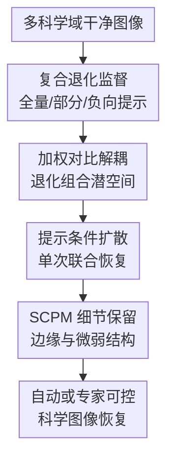

# Seeing Through the PRISM: Compound & Controllable Restoration of Scientific Images

**会议**: ICLR2026  
**OpenReview**: [https://openreview.net/forum?id=CQ0U1wZYoy](https://openreview.net/forum?id=CQ0U1wZYoy)  
**代码**: 有（论文称已开源，缓存未给出具体链接）  
**领域**: 图像恢复 / 科学图像恢复  
**关键词**: 复合退化、可控图像恢复、条件扩散、对比解耦、科学图像  

## 一句话总结
PRISM 把复合退化样本、加权对比解耦的 CLIP 表征和文本条件扩散结合起来，让科学图像可以一次性恢复多种混合退化，也能按专家提示只修正指定退化，从而在保真指标、零样本复合退化和下游科学任务上都优于现有 all-in-one / diffusion / composite restoration 基线。

## 研究背景与动机
**领域现状**：科学与环境图像的预处理长期依赖专门恢复器，例如遥感去云去雾、显微图像去噪超分、水下图像颜色校正、天文图像去卷积等。近年的 all-in-one restoration 和 blind image restoration 尝试用一个模型覆盖多种退化，扩散模型也给低层视觉任务带来了更强的生成先验与高保真输出。

**现有痛点**：真实科学图像很少只坏在一个地方。卫星图像可能同时有传感器噪声、云、雾和光照变化；相机陷阱会遇到夜间低照、运动模糊和天气干扰；显微图像里低信噪比、压缩和分辨率不足常常交织在一起。把单一退化模型串起来用，会在前一步产生伪影，后一步再放大这些伪影；把所有退化一股脑清掉，又可能把微弱但有科学意义的信号一起抹掉。

**核心矛盾**：科学图像恢复追求的不是“看起来更漂亮”，而是“恢复后还能用于测量、分类、分割和判断”。这让任务同时需要两种能力：一方面模型要能理解多个退化的组合并联合处理，避免级联误差；另一方面专家需要能指定只移除某些退化，保留对当前分析有用的微弱结构或强度分布。

**本文目标**：作者把问题拆成三个子目标：构造覆盖多科学域、多退化组合的数据和评测；训练一个能够把单一退化和复合退化放进同一可组合表征空间的恢复模型；验证“可控恢复”是否真的改善遥感、生态监测、显微和城市监测等下游科学任务。

**切入角度**：论文的关键观察是，复合退化不应只被当作一个新的类别记住，而应在潜空间里表现为若干退化 primitive 的组合。若模型能让 haze+rain 更接近 haze-only 与 rain-only，而不是接近无关的 noise，那么未见过的组合也能通过已知 primitive 的几何关系被解释；同一几何结构也能支持专家只沿某些退化方向做干预。

**核心 idea**：用 compound-aware supervision 生成全量、部分和负向提示的复合退化样本，再用加权对比学习把退化 primitive 与 mixture 对齐到可组合 CLIP 潜空间，最后将该表征与自然语言提示共同条件化一个 latent diffusion 恢复器。

## 方法详解

### 整体框架
PRISM（Precision Restoration with Interpretable Separation of Mixtures）的输入是一张带有复合退化的科学图像，以及一个可选的自然语言恢复提示；输出是按提示恢复后的图像。训练时先构造多科学域的干净图像与复合退化图像对，再微调 CLIP 图像编码器，让它既保留图像语义，又显式反映退化组合；随后冻结 CLIP 编码器，用图像退化表征和文本提示共同条件化 Stable Diffusion v1.5 的 UNet，并在解码端加入 SCPM 细节保留模块。

推理时有两种模式。专家可以直接输入“remove fog and color shift”这类自由文本，让冻结的 CLIP 文本编码器生成条件；也可以让轻量 MLP 从图像表征中预测多标签退化集合，再自动生成标准化提示，例如“remove distortions x, y, z”。两种模式都通过 cross-attention 进入扩散模型，因此恢复动作是在一次 denoising trajectory 中完成，而不是把多个单退化恢复器串起来。

### 关键设计
**1. 复合退化监督：把“全修、只修一部分、不该修”都变成训练信号**

PRISM 的数据集不是简单地给每张图随机加一个噪声，而是从 ImageNet、Sen12MS、iWildCam、EUVP、CityScapes、BioSR、脑肿瘤 MRI、Subaru/HSC 天文图像等来源采样约 200 万张干净图像，再为每张图最多叠加三种退化。退化库覆盖几何扭曲、模糊、光度变化、天气效应等，参数也随机变化，例如 blur kernel 大小、snowfall angle 或颜色偏移强度。这样得到的训练三元组可以写成 $(I_{clean}, I_{dist}, p)$，其中 $p$ 是自然语言恢复提示。

这个设计的要点在于提示不是只有“把所有退化都去掉”。作者用 GPT-4 生成多种表达方式，同时加入 partial prompts 和 negative prompts：partial prompt 要求只移除混合退化里的某个子集，negative prompt 则要求移除图中并不存在的退化。前者让模型学会“只沿指定退化方向动手”，后者约束模型不要听到一个提示就过度修图。对科学图像而言，这比普通数据增强更关键，因为很多有效信号和退化在视觉上可能非常接近，模型必须知道什么时候该停手。

**2. 加权对比解耦：让复合退化在潜空间里靠近自己的组成 primitive**

普通 CLIP 更擅长按语义聚类，例如“卫星图像”“显微图像”，但图像恢复更关心“这张图有哪些退化”。PRISM 因此先微调 CLIP 图像编码器，同时冻结文本编码器。对同一张干净图 $I_{clean}$，作者生成 $m$ 个退化版本 $I_{dist}^{(j)}$，得到退化嵌入 $e_{dist}^{(j)}$ 和干净嵌入 $e_{clean}$。对比损失一方面拉近退化图和对应干净图，另一方面把它同 sibling variants 以及 batch 内其他图像的退化版本区分开。

真正细的地方是 sibling variants 之间不是一视同仁地排斥。作者用退化集合 $d^{(j)}$ 与 $d^{(k)}$ 的 Jaccard overlap 来定义权重：

$$
w_{jk}=\exp\left(1-\frac{|d^{(j)}\cap d^{(k)}|}{|d^{(j)}\cup d^{(k)}|}\right).
$$

如果两个样本共享 haze 或 blur 这类 primitive，它们不应像完全无关的退化那样被强行推远；如果退化集合差异很大，排斥权重就更强。对应的 per-variant contrastive loss 用温度 $\tau=0.10$ 计算，并结合 batch 中其他 degraded variants 作为负样本。这个几何约束让 haze+rain、haze-only、rain-only 在潜空间里形成可解释关系，给未见过的组合恢复和提示子集控制打基础。

**3. 质量正则与条件扩散：既防止干净表征漂移，又避免级联恢复**

仅靠对比学习会让退化表征更有结构，但也可能把干净图嵌入拖向“退化敏感”的方向。PRISM 加入 quality-aware regularizer：对退化集合 $d^{(j)}$ 中的每个退化类别 $c$，惩罚分类头在 $e_{clean}$ 上预测出该退化的概率，即 $L_{qual}^{(j)}=\sum_{c\in d^{(j)}} \hat{p}(c \mid e_{clean})$。最终 CLIP 训练目标是 $L_{CLIP}=\frac{1}{m}\sum_{j=1}^{m}(L_{ctr}^{(j)}+L_{qual}^{(j)})$。这相当于告诉编码器：退化图要知道自己坏在哪里，干净图则不能凭空带上退化证据。

完成 CLIP 微调后，PRISM 冻结图像和文本编码器，把退化感知图像向量与提示文本向量拼接起来，在 Stable Diffusion v1.5 的每个 UNet block 中通过 learnable cross-attention 注入。与 sequential restoration 不同，PRISM 在一次扩散轨迹中同时看到“图像里有哪些退化”和“用户想移除哪些退化”。这能减少前后步骤互相污染的问题，也让 full restoration 与 selective restoration 共享同一套条件化机制。

**4. SCPM 细节保留：把扩散先验拉回科学测量需要的微结构**

扩散模型生成能力强，但科学图像恢复不能只靠自然图像先验补细节。显微图像里的微弱荧光点、遥感图像里的细边界、生态图像中的动物纹理，都可能在“更平滑、更干净”的输出中被抹掉。PRISM 因此沿用并集成 Semantic Content Preservation Module（SCPM），作为轻量 decoder-side refinement block，在解码阶段自适应融合 encoder 与 decoder 特征。

SCPM 的角色不是替代扩散恢复，而是在最终输出前补上边缘、小纹理和局部结构保真。论文把它放在科学图像语境下很合理：如果恢复结果 PSNR 更高但下游分割或强度测量变差，那对科学工作流没有意义；SCPM 则给模型一个保留局部语义和结构的出口，减轻 latent diffusion 过度平滑带来的风险。

### 一个完整示例
以珊瑚礁无人机图像为例，输入图像同时存在 warp、color shift 和 motion blur。自动模式下，PRISM 先用 compound-aware CLIP 图像编码器提取表征，再由轻量 MLP 预测可能存在的退化集合，生成一个组合提示并一次性恢复。这个输出适合快速预处理，但专家可能并不想一次性清掉所有变化，因为某些颜色变化可能与水深、底质或光照条件相关。

专家模式下，可以先提示 “unwarp”，让模型只修正几何扭曲；检查结果后再提示 “fix coloring”，只校正颜色偏移；最后如果边界仍然糊，再用 “unblur” 做局部视觉改善。这个过程不是换三个模型，而是在同一可组合潜空间里选择不同退化方向。论文用这个例子说明 PRISM 的控制不是界面层面的“能输入文本”，而是表征层面确实把退化拆成了可重组、可选择的因素。

### 损失函数 / 训练策略
训练分两阶段。第一阶段微调 CLIP 图像编码器，文本编码器冻结，目标由加权对比损失和质量正则组成。对每个 clean image 采样多个退化版本，batch 中包含 256 张 clean images，并额外采样 256 个来自 primitive 与 compound distortion library 的 degraded variants。对比损失中的相似度使用 cosine similarity，温度为 $\tau=0.10$。

第二阶段训练条件 latent diffusion restoration backbone。作者采用 Stable Diffusion v1.5，把第一阶段得到的 compound distortion-aware image encoder 作为图像条件来源，再拼接冻结 CLIP text encoder 的提示嵌入。训练和比较时，各基线都在同一 primitive distortion set 上训练，以避免因为退化覆盖范围不同造成不公平。论文还在附录中报告训练细节、baseline 设置、SCPM 架构、组件消融、prompt sensitivity 与运行时间。

## 实验关键数据

### 主实验
PRISM 首先在 Mixed Degradations Benchmark（MDB）上评估手动提示恢复。该测试集每张图最多含三种退化，指标同时看像素保真、结构相似和感知质量。表中可以看到，PRISM 在 PSNR、SSIM、LPIPS 上是最佳，FID 略低于 MPerceiver，但整体最均衡。

| 类别 | 方法 | PSNR ↑ | SSIM ↑ | FID ↓ | LPIPS ↓ |
|------|------|--------|--------|-------|---------|
| All-in-One | PromptIR | 18.11 | 0.801 | 62.78 | 0.298 |
| Diffusion | DiffPlugin | 19.07 | 0.821 | 53.88 | 0.255 |
| Diffusion | MPerceiver | 20.84 | 0.829 | 48.18 | 0.235 |
| Diffusion | AutoDIR | 20.42 | 0.833 | 50.75 | 0.246 |
| Composite | OneRestore | 19.36 | 0.812 | 59.42 | 0.276 |
| PRISM | PRISM | 22.08 | 0.842 | 48.97 | 0.218 |

在零样本复合退化上，PRISM 也没有只记住训练退化组合。作者在 UIEB 水下图像、POLED under-display camera 和 ThapaSet fluid lensing 上评估，这些都包含训练中没有显式出现过的复杂失真。PRISM 三个数据集均取得最佳结果，说明 compositional latent geometry 不只是 MDB 内的拟合。

| 数据集 | 方法 | PSNR ↑ | SSIM ↑ | LPIPS ↓ |
|--------|------|--------|--------|---------|
| UIEB | MPerceiver | 21.18 | 0.889 | 0.366 |
| UIEB | AutoDIR | 21.02 | 0.887 | 0.374 |
| UIEB | PRISM | 22.18 | 0.914 | 0.331 |
| POLED | MPerceiver | 17.55 | 0.669 | 0.436 |
| POLED | PRISM | 18.26 | 0.694 | 0.419 |
| ThapaSet | AutoDIR | 21.53 | 0.462 | 0.528 |
| ThapaSet | PRISM | 22.36 | 0.487 | 0.492 |

### 消融实验
论文的分析重点不是只比较最终分数，而是拆开 compound-aware supervision、contrastive disentanglement 和 controllability 的作用。图 3 显示，随着退化数量从 1 增至 4，训练在复合样本上的 PRISM 比 primitive-aware 版本和可比 baseline 更稳；图 4 显示，compound-aware CLIP 会缩小 sequential prompting 和 composite prompting 的差距，说明模型学到的是可组合退化结构，而不只是固定 prompt 模板。

| 配置 / 场景 | 关键指标 | 说明 |
|-------------|----------|------|
| Pretrained CLIP 条件 | composite 与 sequential 差距较大 | 原始 CLIP 偏语义聚类，不能稳定表达退化组合 |
| Primitive-Aware CLIP | 比 pretrained CLIP 更好 | 能识别单退化，但对混合退化的几何结构不足 |
| Compound-Aware CLIP | composite / sequential 更接近 | 加权对比约束让 mixture 接近自己的组成 primitive |
| PRISM Primitive-Aware 训练 | 退化数量增加时掉点更明显 | 只见单退化会削弱多退化联合恢复能力 |
| PRISM Compound-Aware 训练 | 复杂混合下保持最高 PSNR | full、partial、negative restoration 训练让模型更抗级联误差 |

更有价值的是下游科学任务评估。作者比较 degraded input、full restoration 和 selective restoration。结果显示，三个领域中 selective restoration 显著优于 full restoration；遥感是例外，full restoration 略好但差异不显著。

| 领域任务 | Degraded Input | Full Restoration | Selective Restoration | p-value |
|----------|----------------|------------------|------------------------|---------|
| Remote sensing Acc. ↑ | 0.781 ± 0.013 | 0.842 ± 0.011 | 0.836 ± 0.012 | 0.11 |
| Camera Traps Acc. ↑ | 0.921 ± 0.004 | 0.976 ± 0.008 | 0.984 ± 0.004 | 0.032 |
| Microscopy mIoU ↑ | 0.353 ± 0.015 | 0.475 ± 0.012 | 0.580 ± 0.010 | 0.018 |
| Urban scenes mIoU ↑ | 0.548 ± 0.018 | 0.615 ± 0.014 | 0.650 ± 0.012 | 0.041 |

### 关键发现
- 复合退化不能简单靠“先去 A 再去 B”解决。MDB 上 PRISM 比 MPerceiver 的 PSNR 高 1.24，比 AutoDIR 高 1.66，说明单次联合恢复和复合监督确实减少了级联误差。
- 可控性在科学图像里是性能需求，不只是交互体验。显微任务中 super-resolution 单独提示让分割 mIoU 达到 0.580，而 combined restoration 只有 0.475，因为额外 denoise 会压掉微弱但有生物意义的结构。
- 不同科学任务需要不同恢复策略。同一个 BioSR 输入中，分割偏好结构增强，荧光强度测量偏好强度分布保真；表 4 中 denoise 的 fluorescence MSE 最低为 0.006，但 segmentation mIoU 低于 super-resolution。
- 零样本结果表明，PRISM 更像是在已知退化 primitive 之间插值恢复策略，而不是记忆固定退化类别。UIEB 的退化预测更混合，POLED 和 ThapaSet 的主导退化更稳定，但 PRISM 都能保持优势。

## 亮点与洞察
- PRISM 把“复合退化恢复”和“选择性恢复”放在同一个表征问题里处理，这一点很干净。它不是额外做一个控制模块，而是用潜空间几何让 mixture 与 primitive 的关系变得可计算。
- negative prompt 的加入很关键。很多 restoration 论文只训练模型“做什么”，但科学场景更需要模型知道“不要做什么”，否则一个过度自信的恢复器很容易把弱信号当噪声清掉。
- 论文用下游任务而非单纯感知指标来证明价值，这比只展示视觉样例更有说服力。尤其是显微分割与荧光测量的冲突，清楚说明同一张图不存在唯一最优恢复结果。
- 这套思路可以迁移到医学影像、遥感时序和工业检测。只要能定义退化 primitive、部分恢复提示和下游任务，就可以把“恢复质量”从美学指标转向任务保真。

## 局限与展望
- 训练退化主要来自合成增强，即使覆盖了多科学域，也不可能完整模拟真实传感器、环境和采集链路中的复杂物理过程。PRISM 在 UIEB、POLED、ThapaSet 上做了零样本验证，但更稀有的仪器伪影或领域特定噪声仍可能超出 primitive library。
- 当前可控性主要是“选择移除哪些退化”，还没有细粒度控制强度、空间范围和可信度。例如专家可能只想去掉图像右上角的薄云，或把 denoise 强度限制在不改变荧光均值的范围内，这需要 localized restoration 与更细的控制接口。
- 扩散模型相对 encoder-decoder restoration 仍更耗计算。论文称 PRISM 与先进 diffusion baseline 运行时间相当，但如果要嵌入大规模遥感巡检或显微高通量分析流水线，还需要蒸馏、缓存或轻量化版本。
- 下游评估覆盖四个科学域已经不错，但仍依赖现成 pretrained downstream models。真实科研流程中的人工校验、测量不确定性和跨实验室复现，可能会给可控恢复提出更严格的校准要求。

## 相关工作与启发
- **vs PromptIR / all-in-one restoration**: PromptIR 用提示帮助一个模型处理多类退化，但重点仍在固定退化类别和通用图像质量；PRISM 显式训练复合退化和部分提示，并把科学下游任务作为核心评估目标。
- **vs AutoDIR / DiffBIR 类扩散恢复**: 这些方法利用扩散先验获得较好视觉质量，但往往把退化当作待自动识别并整体修正的问题。PRISM 的区别在于把文本提示和退化组合表征一起用于可控联合恢复，强调不能无差别“全修”。
- **vs MPerceiver**: MPerceiver 可以把多个退化编码成 token，适合 all-in-one restoration；PRISM 进一步用加权对比损失约束 mixture 与 primitive 的潜空间关系，因此在未见组合和选择性提示上更有解释性。
- **vs OneRestore / composite restoration**: OneRestore 明确处理复合退化，但缺少 prompt-driven selective control，也没有强制表征具备可组合几何。PRISM 在 MDB 上 PSNR 和 LPIPS 更好，并能通过专家提示服务不同科学任务。
- **启发**: 对科学 AI 系统而言，“可控”最好不要停留在 UI 或 prompt 层，而应落实到表示学习目标中。PRISM 给出的范式是：用任务结构定义潜空间几何，再让交互提示选择其中的方向。

## 评分
- 新颖性: ⭐⭐⭐⭐☆ 将 compound-aware supervision、加权对比退化解耦和 prompt-conditioned diffusion 组合得比较系统，核心亮点在科学图像场景下的可控恢复定义。
- 实验充分度: ⭐⭐⭐⭐⭐ 覆盖 MDB、零样本复合退化、下游任务、可控性分析和组件消融，指标也不只停留在视觉质量。
- 写作质量: ⭐⭐⭐⭐☆ 主线清楚，动机和科学任务案例有说服力；附录细节对复现很重要，但主文里部分训练与 SCPM 结构细节略压缩。
- 价值: ⭐⭐⭐⭐⭐ 对遥感、显微、生态和城市监测这类“恢复后要继续做科学分析”的场景很有价值，也提醒低层视觉不要只追求更干净的图像。

<!-- RELATED:START -->

## 相关论文

- [\[ECCV 2024\] Seeing the Unseen: A Frequency Prompt Guided Transformer for Image Restoration](../../ECCV2024/image_restoration/seeing_the_unseen_a_frequency_prompt_guided_transformer_for_image_restoration.md)
- [\[ICML 2026\] PODiff: Latent Diffusion in Proper Orthogonal Decomposition Space for Scientific Super-Resolution](../../ICML2026/image_restoration/podiff_latent_diffusion_in_proper_orthogonal_decomposition_space_for_scientific_.md)
- [\[NeurIPS 2025\] Latent Harmony: Synergistic Unified UHD Image Restoration via Latent Space Regularization and Controllable Refinement](../../NeurIPS2025/image_restoration/latent_harmony_synergistic_unified_uhd_image_restoration_with_pre-trained_diffus.md)
- [\[CVPR 2026\] Disentanglement-wise Image Dehazing through Cross-Domain Manifold Consensus](../../CVPR2026/image_restoration/disentanglement-wise_image_dehazing_through_cross-domain_manifold_consensus.md)
- [\[CVPR 2026\] NEC-Diff: Noise-Robust Event–RAW Complementary Diffusion for Seeing Motion in Extreme Darkness](../../CVPR2026/image_restoration/nec-diff_noise-robust_event-raw_complementary_diffusion_for_seeing_motion_in_ext.md)

<!-- RELATED:END -->
