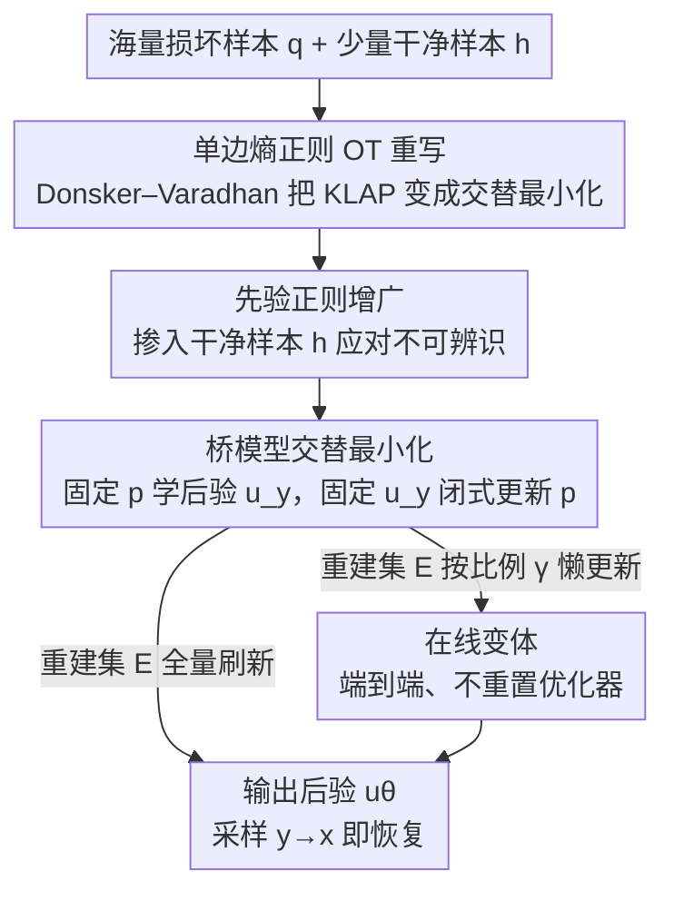

# SFBD-OMNI: Bridge Models for Lossy Measurement Restoration with Limited Clean Samples

**会议**: ICLR 2026  
**OpenReview**: [https://openreview.net/forum?id=28IuGdneJQ](https://openreview.net/forum?id=28IuGdneJQ)  
**代码**: https://github.com/watml/SFBD-omni.git  
**领域**: 扩散模型 / 图像恢复 / 逆问题  
**关键词**: 分布恢复, 桥模型, 熵正则最优传输, 可辨识性, 弱监督生成

## 一句话总结
当只有海量含损测量、却几乎没有干净样本时，本文把"从损坏分布恢复真实分布"重写成一个**单边熵正则最优传输**问题，用桥模型（bridge model）做交替最小化求解，得到一套能处理任意黑盒损坏过程（掩码、灰度、模糊、加噪等）的算法 SFBD-OMNI，并证明：损坏过程可辨识时纯靠噪声样本就能恢复，不可辨识时只需 50 张干净图就能把分布拉回真实，FID 显著优于 AmbientGAN / EMDiffusion / SFBD 等基线。

## 研究背景与动机

**领域现状**：扩散模型是当前高维分布建模最强的框架之一，但它和几乎所有生成模型一样，依赖大量高质量训练数据。现实里很多场景恰恰相反——干净数据极贵甚至拿不到（医学 X 光要加大辐射剂量、地面天文成像要长曝光理想大气），而**含损、含噪的测量却唾手可得**。

**现有痛点**：已有的"只用损坏样本训练生成模型"工作各自为政、各管一种损坏：AmbientGAN 用 GAN 的 min-max 框架，但要求损坏过程对干净输入**可微**、且训练不稳定（梯度消失、模式坍塌）；Ambient Diffusion 只管像素掩码；SFBD 只管加性高斯噪声。**没有一个框架能同时**：处理任意损坏过程、给出理论恢复保证、又吃到扩散/桥模型的红利。

**核心矛盾**：问题的根子在于 GAN 用 KL 散度的变分表示把分布恢复写成了对抗博弈，这条路天生绑定了"对损坏过程求导"和对抗训练的不稳定。而且很多实际损坏过程（灰度化、高斯模糊）是**不可辨识的**——多个不同的真实分布会塌到同一个损坏分布，纯靠噪声样本在数学上根本分不开。

**本文目标**：(1) 给"含损测量分布恢复"一个统一的、对任意黑盒损坏过程都成立的求解框架；(2) 给出何时可恢复（可辨识性判据）、不可辨识时怎么靠少量干净样本补救的理论保证；(3) 实现上避开对抗训练、能端到端跑。

**切入角度**：作者不用 KL 散度的常规变分表示，而是套 **Donsker–Varadhan 变分原理**重写 KL，发现整个问题等价于一个**只约束一侧边缘**的熵正则最优传输（one-sided entropic OT）。这个视角天然给出"交替最小化"的求解管线，且只需**黑盒访问**损坏过程（采样即可，无需求导）。

**核心 idea**：把 KLAP（Kullback–Leibler Ambient Projection）问题改写成单边熵正则 OT，用桥模型学后验、交替更新分布 $p$ 与后验 $u_y$，并用"少量干净样本作先验正则"打通不可辨识情形——这就是把 SFBD 推广到任意损坏过程的 **SFBD-OMNI**。

## 方法详解

### 整体框架

设真实干净分布为 $p_{\text{data}}$，损坏过程是一个黑盒 Markov 核 $r(y\mid x)$，对应的损坏算子 $T_r$ 把干净分布映射成损坏分布 $q = T_r p_{\text{data}}$。我们手里有海量损坏样本 $E_{\text{noisy}}$（来自 $q$）和极少量干净样本 $E_{\text{clean}}$（哪怕只有 50 张）。目标：恢复 $p_{\text{data}}$。

经典做法（AmbientGAN）是最小化 $D_{\text{KL}}(q \,\|\, T_r p)$，本文称之为 **KLAP 问题**。本文的关键转写是：用 Donsker–Varadhan 原理把这个 KL 重写后，KLAP 等价于一个交替最小化

$$\arg\min_p \min_{u_y} F_\lambda(p, u_y),$$

其中 $u_y$ 是"给定损坏观测 $y$、对应干净样本 $x$ 的后验分布"。这个嵌套最小化恰好对应一套 **EM 风格的交替迭代**：固定 $p$ 解出后验 $u_y$（用桥模型学），再固定 $u_y$ 更新 $p$（闭式）。整个 pipeline 是：用极少干净样本预训练桥模型 → 反复"重建—再训练"，逐步把 $p$ 推向 $p_{\text{data}}$；不可辨识时再掺入干净样本先验把解锁定到正确分支。

### 关键设计

**1. 单边熵正则 OT 重写：用 Donsker–Varadhan 把对抗博弈变成交替最小化**

痛点直说：AmbientGAN 把 $\min_p D_{\text{KL}}(q\|T_r p)$ 用 $f$-散度的变分表示写成 $\min_p \max_g$ 的对抗形式，于是继承了 GAN 的全部毛病（要对损坏过程求导、梯度消失、模式坍塌）。本文换了一个 KL 的变分表示——Donsker–Varadhan 原理 $\log \mathbb{E}_{x\sim p}[e^{f_y(x)}] = \max_{u_y}\big(\mathbb{E}_{x\sim u_y}[f_y(x)] - D_{\text{KL}}(u_y\|p)\big)$，其中 $f_y(x)=\log r(y\mid x)$。对 $y\sim q$ 取期望整理后得到

$$D_{\text{KL}}(q\|T_r p) = \min_{u_y}\ \mathbb{E}_{y\sim q}\big[D_{\text{KL}}(u_y\|p) - \mathbb{E}_{x\sim u_y}[f_y(x)]\big] + C.$$

这一步的妙处在于：原本的 $\min_p\max_g$ 对抗博弈，变成了关于 $p$ 和 $u_y$ 的**双重最小化**——没有对抗、没有判别器。作者进一步证明（Prop 3），令代价 $c(x,y)=-\log r(y\mid x)$，这个目标恰好就是一个**只固定 $y$ 边缘**的熵正则 OT：$\Phi(p)=\min_{\pi\in\Pi_y(q)} \iint c\,\mathrm{d}\pi + D_{\text{KL}}(\pi\|p\otimes q)$。当代价是二次型（高斯损坏）时，最优耦合 $\pi^*$ 正是薛定谔桥。于是"恢复分布"被诠释成"找一个 $p$，使损坏核诱导的运输代价最小"。这个视角不仅去掉了对抗训练，还**只要求黑盒采样** $r(y\mid x)$、不需要它对 $x$ 可微。

**2. 增广 KLAP：用少量干净样本作先验正则，攻克不可辨识损坏**

痛点直说：损坏算子 $T_r$ 是否**单射**决定了能否恢复（Prop 1）。加性高斯噪声、独立像素掩码、满列秩线性变换都单射（可辨识）；但灰度化、高斯模糊（丢高频，相当于傅里叶域投影）这类有非平凡零空间的算子**不单射**——满足 $T_r p = T_r p_{\text{data}}$ 的解构成一整个集合 $S(q)$，纯噪声样本无法把 $p_{\text{data}}$ 从中挑出来。

解法是给目标加一项先验正则：

$$J_\lambda(p) = D_{\text{KL}}(q\|T_r p) + \lambda\, D_{\text{KL}}(h\|p),$$

其中 $h$ 是少量干净样本的经验分布、$\lambda\ge 0$ 是正则强度。第二项的严格凸性保证 $\lambda>0$ 时整个目标严格凸、有唯一最优解 $p^*_\lambda$。Prop 2 给出了几何图像：当 $\lambda\to 0$ 时，第一项把 $p$ 锁在解集 $S(q)$ 内，第二项则在 $S(q)$ 里挑出离先验 $h$ 最近的那个元素 $h^\dagger$（即 $h$ 在 $S(q)$ 上的信息投影），于是 $p^*_\lambda\to h^\dagger$。直觉例子：灰度化下纯靠噪声只能恢复人脸结构、恢复不了真实颜色；给几张彩色干净图当 $h$，就能把颜色分布也拉回来。论文还强调一个常被忽视的点——**可辨识 ≠ 可恢复**：即便 $T_r$ 单射，$q$ 也只能从有限噪声样本估计，误差经 $T_r^{-1}$ 放大后样本复杂度极差，所以哪怕在可辨识情形，少量（低至 50 张）干净样本对初始化 $p_0$ 也至关重要。

**3. SFBD-OMNI 交替最小化：桥模型学后验 + 闭式更新分布**

痛点直说：上面的交替最小化要真的能跑，必须能解出两个子问题。本文证明它们都有**闭式解**：

$$u_y^k(x) = \frac{p^k(x)\, r(y\mid x)}{T_r p^k(y)},\qquad p^{k+1}(x) = \frac{1}{1+\lambda}\tilde p^{k+1}(x) + \frac{\lambda}{1+\lambda} h(x),$$

其中 $\tilde p^{k+1}(x)=\int q(y)\, u_y^k(x)\,\mathrm{d}y$。第一式说明 $u_y^k$ 就是联合分布 $\pi(x,y)=p^k(x)\,r(y\mid x)$ 下 $x$ 的后验；第二式说明新的 $p$ 是"重建分布 $\tilde p$ 与干净先验 $h$ 的凸组合"。后验 $u_y$ 没法直接写，但**正是桥模型擅长的活**：给定配对 $(x,y)$，桥模型在 $x$、$y$ 两端之间插值出一条转移路径，用条件漂移匹配损失 $L_{\text{CDM}}$ 学出从 $y$ 反解 $x$ 的后验 $u_\theta(x\mid y)$，采样方式与扩散模型如出一辙。于是算法（Alg 1）变成：先用极少干净样本预训练 $u_\theta$，再循环——用当前 $u_\theta$ 对每个噪声样本 $y$ 反解出一个 $x$、攒成重建集 $E$（近似 $\tilde p$），再以 $p=\frac{1}{1+\lambda}p_E+\frac{\lambda}{1+\lambda}h_{E_{\text{clean}}}$ 为目标继续训 $u_\theta$。当 $\lambda=0$ 且损坏是高斯加噪、后验用反向 SDE 建模时，SFBD-OMNI **退化回原始 SFBD**；它也覆盖了 EMDiffusion 启发式推出的更新规则，但本文额外给了收敛到最优解的证明。

**4. 在线变体：重建集"懒更新"实现端到端、免重置优化器**

痛点直说：Alg 1 在"训练"和"采样"之间反复横跳，每轮重建集 $E$ 剧变，导致 Adam 的历史动量失效、必须每轮重置优化器，否则训练损失会陡升且不可逆；而且为保证每轮收敛又得训很多步，反而容易在当前 $p^k$ 上过拟合、难以适应下一个目标。在线变体（Alg 2）的做法是每轮只刷新 $E$ 中**比例为 $\gamma$** 的样本，对应把 $\tilde p$ 更新成懒惰滑动平均

$$\tilde p^{k+1}(x) = \gamma\int q(y)\,u_y^k(x)\,\mathrm{d}y + (1-\gamma)\,\tilde p^k(x).$$

$\gamma=1$ 时退回标准 SFBD-OMNI。因为 $E$ 每轮只微动，$u_\theta$ 可以**不重置优化器、平滑地连续优化**，少了人工干预、还可能加速收敛。Prop 4 证明这种懒更新对任意 $\gamma\in(0,1]$ 仍收敛到最优 $p^*_\lambda$，并给出 $\min_k D_{\text{KL}}(q\|T_r p^k)\le D_{\text{KL}}(h^\dagger\|p_0)/(\gamma K)$ 的界。值得注意的是，小 $\gamma$ 虽让界看着收敛更慢，但每轮 $E$ 变化小、网络只需少量步就收敛、且优化器不重置，实测**总训练时间反而可能下降**。

### 损失函数 / 训练策略
后验 $u_\theta(x\mid y)$ 用**流匹配**（flow matching）参数化（比扩散收敛快、训练目标方差低，且对"反复对着移动目标训练"这种场景特别省算力），并对端点 $y$ 加微小高斯扰动避免确定性路径退化。为抑制过拟合用了 non-leaky augmentation。干净样本权重 $\frac{\lambda}{1+\lambda}$：经典 SFBD-OMNI 在可辨识时设为 0、不可辨识时设 0.2；流变体为稳定一律固定 0.2。噪声集更新比例默认 $\gamma=0.002$，每个 epoch 末更新一次。评测用 FID（参考集 vs 模型生成的 5 万张图）。

## 实验关键数据

### 主实验

CIFAR-10（32×32）与 CelebA（64×64）上，跨多种损坏过程比较 FID（越低越好）。除 Noise2Self 外所有方法均仅用 **50 张随机干净图**预训练。✓ 表示满足可辨识性、✗ 表示不满足。

| 数据集 | 损坏过程 | 可辨识 | SFBD-OMNI | Online SFBD-OMNI | 最强基线 |
|--------|----------|--------|-----------|------------------|----------|
| CIFAR-10 | 像素掩码 (p=0.6) | ✓ | 21.31 | 22.43 | EMDiffusion 21.08 |
| CIFAR-10 | 加性高斯 (σ=0.2) | ✓ | **10.81** | 11.06 | SFBD 13.53 |
| CIFAR-10 | 灰度化 | ✗ | 32.61 | **31.32** | EMDiffusion 115.11 |
| CelebA | 高斯模糊 (k=9,σ=2) | ✗ | 11.60 | **10.28** | EMDiffusion 91.89 |
| CelebA | 灰度化 | ✗ | 11.85 | **11.21** | EMDiffusion 59.04 |

除像素掩码外（与 EMDiffusion 持平、差距可忽略），SFBD-OMNI 及其流变体全面领先；**在不可辨识损坏上优势巨大**（灰度化 31~32 vs EMDiffusion 59~115，高斯模糊 10 vs 92）。注意在可辨识情形，流变体因始终保留非零干净样本权重，最优解会偏离真实分布，FID 略高于经典 SFBD-OMNI（如加性高斯 11.06 vs 10.81）；而不可辨识情形这点正则必不可少，流变体的平滑更新与端到端管线反而拿到更低 FID。

### 消融实验

| 配置 | 关键现象 | 说明 |
|------|---------|------|
| 干净样本权重 $\frac{\lambda}{1+\lambda}$ 扫描 | 不可辨识：权重过小收敛到 $S(q)$ 任意元、过大被先验拉偏 | 存在最优中间值；可辨识时该正则多余甚至有害 |
| 干净样本数量（灰度化, CelebA） | 越多越好但**边际递减** | 更多干净样本让 $h_{\text{clean}}$ 更接近 $p_{\text{data}}$、初始化与极限分布都更准 |
| 更新比例 $\gamma$（高斯 σ=0.5, 2k 干净样本） | 大 $\gamma$（0.5）早期降得快但 epoch 6 后 E 与新样本 FID 分叉、双双回升；小 $\gamma$ 更稳、最终更低 | $E$ 刷新太快模型来不及适应 |
| 纯噪声、无干净样本（高斯 σ=0.2, λ=0） | FID 单调下降但饱和在 **80.37** | 远差于给 50 张干净图的 10.81 |

### 关键发现
- **可辨识 ≠ 可恢复**：即便损坏算子单射、理论上纯噪声可恢复，但有限样本经 $T_r^{-1}$ 放大误差，实际饱和 FID 仍高达 80.37；只需 50 张干净图就把它降到 10.81——干净样本对**初始化** $p_0$ 的价值被严重低估。
- **干净样本权重要对症下药**：不可辨识时 $\lambda>0$ 是救命的（否则收敛到 $S(q)$ 里随便一个元）；可辨识时干净样本只该用来初始化，训练过程最好关掉正则（否则把最优解拉偏）。这与可辨识性理论严丝合缝。
- **小 $\gamma$ 更稳更省**：懒更新让重建集缓慢演化，模型有时间适应当前目标，训练更稳、FID 更低、还因免重置优化器而省时。
- 高分辨率卫星 / MRI（泊松、压缩感知损坏）上方法依然有效，但残留伪影提示**部署级重建可能还需领域先验或针对性设计**。

## 亮点与洞察
- **把分布恢复"去对抗化"的视角切换很漂亮**：同一个 KL 目标，换 Donsker–Varadhan 变分表示，就从 GAN 的 min-max 博弈变成纯交替最小化，顺带证明它等价于单边熵正则 OT、高斯情形对应薛定谔桥——一个换元打通了"含损恢复—OT—桥模型"三个世界。
- **只需黑盒损坏过程**：不像 AmbientGAN 要对损坏过程求导，本文只要能采样 $r(y\mid x)$，这让它能直接套到不可微 / 仿真器式的损坏（压缩感知、复杂成像链）上。
- **"50 张干净图"的可迁移工程经验**：在弱监督/无监督生成里，与其堆噪声样本，不如花极小代价拿几十张干净样本做先验与初始化，性价比极高——这一思路可迁移到任何"测量丰富、标准答案稀缺"的逆问题。
- **懒更新（lazy refresh）稳定移动目标训练**：当训练目标本身在动（self-distillation、EM、replay buffer 等），按比例缓慢刷新目标集 + 不重置优化器，是个能直接借用的稳定化 trick。

## 局限与展望
- 作者承认：高分辨率卫星 / MRI 上仍有残留伪影，**部署级重建可能需要领域先验或问题特定设计**，通用框架不等于开箱即用。
- 流变体为稳定固定了非零干净样本权重，导致**可辨识情形最优解系统性偏离** $p_{\text{data}}$（FID 略高）——权重是否该随损坏类型自适应、能否在线判别可辨识性并自动关正则，值得探索。
- 实验只到 CIFAR-10 / CelebA（32~64 分辨率）量级，更高分辨率、更复杂损坏链下交替最小化的稳定性与算力代价仍是开放问题。
- 收敛保证基于"温和假设"（mild assumptions）与对损坏核全支撑的设定（靠注入无穷小高斯噪声保证），实际损坏严重偏离这些假设时理论保证可能打折。

## 相关工作与启发
- **vs SFBD (Lu et al., 2025)**：SFBD 只管加性高斯噪声、靠扩散反向 SDE 在全时段 $[0,\tau]$ 上的后验关系推导收敛；本文证明当 $\lambda=0$ 且高斯损坏时 SFBD-OMNI 退化为 SFBD，但通过"只学终端后验 $p^\mu_{0|\tau}$ + 桥模型"把它推广到**任意损坏过程**，并补上不可辨识情形的处理。
- **vs AmbientGAN (Bora et al., 2018)**：同样最小化损坏分布间的 KL，但 AmbientGAN 走 GAN min-max、要求损坏过程可微、无法处理不可辨识损坏且训练不稳；本文走交替最小化、黑盒访问、无对抗，且能加先验正则攻克不可辨识。
- **vs EMDiffusion (Bai et al., 2024)**：EMDiffusion 启发式推出的迭代规则恰好与 SFBD-OMNI 在 $\lambda=0$ 时的更新一致，但它没有收敛证明、也无法处理不可辨识损坏；本文给出收敛到最优解的证明、加上在线变体与先验机制。
- **vs Ambient Diffusion (Daras & Dimakis, 2023)**：后者专为像素掩码设计的扩散训练；本文是统一框架，掩码只是其中一个 ✓ 特例。

## 评分
- 新颖性: ⭐⭐⭐⭐⭐ Donsker–Varadhan 视角把含损分布恢复统一成单边熵正则 OT，并打通桥模型求解，理论与算法都新。
- 实验充分度: ⭐⭐⭐⭐ 覆盖可辨识/不可辨识 5 种损坏 + 4 组消融 + 卫星/MRI 扩展，但分辨率与数据集规模偏小。
- 写作质量: ⭐⭐⭐⭐⭐ 理论推导清晰、可辨识性与几何直觉（Fig 1）讲得很透，命题层层递进。
- 价值: ⭐⭐⭐⭐⭐ "测量丰富、干净稀缺"是医学/天文/遥感的普遍现实，黑盒+少量干净样本的范式实用价值高。

<!-- RELATED:START -->

## 相关论文

- [\[ICLR 2026\] Energy-oriented Diffusion Bridge for Image Restoration with Foundational Diffusion Models](energy-oriented_diffusion_bridge_for_image_restoration_with_foundational_diffusi.md)
- [\[ICLR 2026\] Text-Aware Image Restoration with Diffusion Models](text-aware_image_restoration_with_diffusion_models.md)
- [\[NeurIPS 2025\] Audio Super-Resolution with Latent Bridge Models](../../NeurIPS2025/image_restoration/audio_super-resolution_with_latent_bridge_models.md)
- [\[ICLR 2026\] Optimizing ID Consistency in Multimodal Large Models: Facial Restoration via Alignment, Entanglement, and Disentanglement](optimizing_id_consistency_in_multimodal_large_models_facial_restoration_via_alig.md)
- [\[CVPR 2025\] Prior Does Matter: Visual Navigation via Denoising Diffusion Bridge Models](../../CVPR2025/image_restoration/prior_does_matter_visual_navigation_via_denoising_diffusion_bridge_models.md)

<!-- RELATED:END -->
