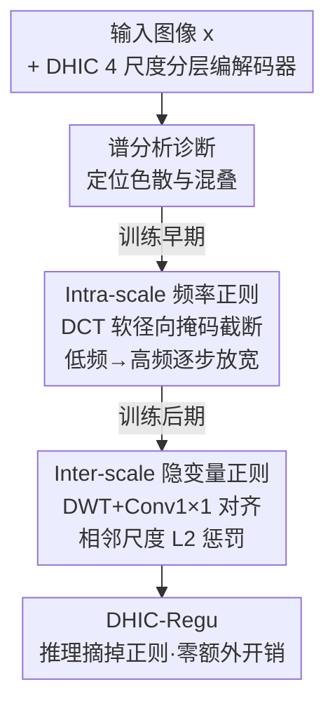

# Taming Hierarchical Image Coding Optimization: A Spectral Regularization Perspective

**会议**: ICLR 2026  
**OpenReview**: [https://openreview.net/forum?id=lO6I66lweK](https://openreview.net/forum?id=lO6I66lweK)  
**代码**: 无  
**领域**: 图像压缩 / 低层视觉  
**关键词**: 学习式图像压缩, 分层 VAE, 频率原则, 谱正则化, 训练动力学

## 一句话总结
针对分层学习式图像压缩"理论很美、实测打不过单尺度模型"的反差，本文从训练动力学的谱分析切入，定位到根因是跨尺度能量色散与谱混叠，进而提出两个只在训练期生效、推理零开销的谱正则——intra-scale 频率截断（让每个尺度低到高频逐步专精）与 inter-scale 隐变量相似度惩罚（压制尺度间频谱重叠），使训练加速 2.3×、相对 VTM-22.0 平均节省 20.65% 码率，刷新学习式图像压缩 SOTA。

## 研究背景与动机
**领域现状**：学习式图像压缩（LIC）近年已全面超越 JPEG/HEVC/VVC 等手工编解码器，主流路线是单尺度 VAE：分析变换 $y=g_a(x)$ 把图像编码成单一尺度隐变量、超先验/上下文模型估计码率、合成变换 $\hat{x}=g_s(\hat{y})$ 重建，整体用率失真损失 $L=R(y)+R(z)+\lambda\, D(x,\hat{x})$ 端到端优化。但单尺度路线在高码率、高分辨率场景下性能已逼近饱和。为突破瓶颈，分层 VAE（HVAE）把单尺度处理扩展到多尺度，理论上天然契合"频率原则"——高尺度（大感受野）该负责低频全局结构、低尺度该负责高频细节，还能支持尺度级自回归与质量可伸缩。

**现有痛点**：然而分层编码的实测表现迟迟没追上理论优势。代表性方法 QARV 在单张 RTX 3090 上要训近 10 天，某些码率区间还打不过更轻量的单尺度模型 ELIC。也就是说，分层架构的潜力远没被榨干。

**核心矛盾**：作者认为问题不在架构而在"朴素优化"——式 $L_{hier}=\sum_l R(z_l)+\lambda D(x,\hat{x})$ 让所有尺度在整个频谱上一起竞争，完全没有显式约束尺度该管哪段频率。通过对训练动力学做谱分析，作者观察到两类违反频率原则的现象：① **intra-scale 干扰**——单个尺度的谱能量在各频段色散，混入高频噪声与低频干扰，并沿层级传播，使最末尺度的频谱严重弥散；② **inter-scale 混叠**——相邻尺度频段重叠（如第 2 尺度出现本该属于第 1 尺度的异常低频带，最末尺度几乎覆盖了第 3 尺度），导致冗余频率成分被重复编码、白白浪费码率。

**本文目标**：在不增加任何推理复杂度的前提下，把分层模型显式地"训"成频率分层表示，让每个尺度专精自己该负责的频段。

**切入角度**：借用前人的"频率原则"——网络不同层对不同频段敏感度不同，训练良好的模型里每层会自然聚焦于一段特征频率。既然分层架构本就是频率原则的结构化体现，那就用显式的频率引导去促进谱收敛与解耦。

**核心 idea**：设计两个即插即用、仅训练期生效的谱正则化策略——早期用 DCT 频率截断引导各尺度低到高频依次专精，后期用隐空间相似度惩罚压制尺度间谱混叠，二者互补地把分层优化纠回频率原则的轨道上。

## 方法详解

### 整体框架
方法建立在一个自研的轻量 4 尺度分层编解码器 **DHIC（Deep Hierarchical Image Coding）** 之上——每个尺度只放单个隐变量块、用简单 CNN 替换 Transformer/Mamba 等重骨干，目的是剥离复杂架构带来的性能干扰，把变量纯粹聚焦在"加不加正则"。不加正则训练得到的是 DHIC-Base，加上本文两个正则后的是 DHIC-Regu。

整条思路是"先诊断、再分阶段开药"。先对训练过程做谱分析，确认朴素优化下存在 intra-scale 色散和 inter-scale 混叠两类病；然后顺着训练时间轴分两段下药：训练**早期**（如前 100 epoch）开 intra-scale 频率正则，用一个随 epoch 逐渐放宽的 DCT 软径向掩码把高频成分挡在外面，逼高尺度先把低频吃透、再让低尺度逐步接管高频；当各尺度的大致频段稳定下来后，训练**后期**切换到 inter-scale 隐变量正则，在相邻尺度之间插一个 DWT 下采样 + $1\times1$ 卷积对齐模块，用 L2 距离惩罚相邻隐变量过于相似，逼后一尺度只为前面没编码的频率分量花码率。关键在于：两个正则都只在训练时挂上，推理时全部摘掉，所以 DHIC-Regu 与 DHIC-Base 的参数量、KMACs、编解码时间完全一致。

### 关键设计

**1. 训练动力学的谱分析：把"分层为何打不过单尺度"诊断成色散与混叠**

这一步是后面两味药的依据。作者量化各尺度对最终重建的贡献、计算它与输入图像的谱重叠，并把这个重叠随训练 epoch 的演化画成热力图。结果呈现两阶段规律：早期不同尺度以不同速率收敛到各自频段（高尺度对低频更敏感、收敛更快，低尺度负责高频、收敛更慢），后期各尺度稳定在某个谱范围内、彼此分离形成解耦的低到高频分布——整体大致遵循频率原则。但放大看仍有两处局部病灶：**intra-scale 干扰**让谱能量与高频噪声、低频干扰纠缠，并沿层级传播使末尺度频谱严重色散；**inter-scale 混叠**让相邻尺度频段重叠、重复编码冗余频率。作者进一步用 scale-wise 的 BPP 与 MSE 曲线佐证（Fig. 8）：朴素训练下模型持续在各尺度间反复重分配码率，尺度级码率无法稳定上升，伴随剧烈震荡和突变，越深的尺度震荡越凶，最终既多花码率又抬高失真。正是这套诊断把"优化低效"翻译成了可被频率工具处理的具体病症，两个正则才有了明确靶点。

**2. Intra-scale 频率正则：用随训练放宽的 DCT 软掩码逼各尺度低到高频依次专精**

针对色散病——朴素训练里每个尺度都想在整个频谱上抓信息，高尺度甚至去硬啃不擅长的高频细节，误差还反向传播污染全局。本文的解法是一个基于 DCT 的渐进频率截断：训练初期只把输入的低频成分喂进整个模型，再随 epoch 逐步加入更高频。实现上先对训练图 $x\in\mathbb{R}^{B\times C\times H\times W}$ 做 2D-DCT 得到频谱 $F=P_H x P_W^{\top}$（$P_H,P_W$ 是正交基），再用一个随时间变化的软径向掩码做截断：

$$M(u,v;t)=\max\!\left(0,\ \frac{\tau(t)-\sqrt{(u/H)^2+(v/W)^2}}{\tau(t)}\right)$$

其中 $\sqrt{(u/H)^2+(v/W)^2}$ 是归一化频率半径，$\tau(t)$ 是控制截止半径的调度函数，从一个很小的初值（本文 $\tau(0)=0.05$）线性增长到 1。截断后的频谱 $\tilde{F}=F\cdot M(u,v;t)$ 再经 2D-IDCT 变回像素域 $\tilde{x}=P_H^{\top}\tilde{F}P_W$ 用于训练。这样在最大感受野的顶层尺度 $z_1$ 能在早期就把低频信息充分捕获、不把低频责任甩给后续尺度；低尺度则在低频表示的基础上逐步纳入各自该管的高频，避免高频噪声跨尺度乱窜。本质是用"低到高频"的课程式输入，迎合各尺度收敛速率与频段敏感度的差异，把频率原则从"碰运气涌现"变成"被显式引导"。

**3. Inter-scale 隐变量正则：用 DWT+卷积对齐 + L2 惩罚压制尺度间谱混叠**

当各尺度的大致频段稳定后，剩下的病是相邻尺度频段重叠、重复花码率。本文在相邻隐变量之间（仅训练期，推理时禁用）插一个基于离散小波变换（DWT）的卷积下采样模块：把低尺度隐变量 $z_l$ 经 DWT 分解成频率子带，再用 $1\times1$ 卷积跨通道线性重组，使其频率通道对齐到高尺度隐变量 $z_{l-1}$；然后用 L2 度量两者距离并加权进损失，逼相邻尺度的特征尽量"拉远"。最顶层尺度则与一个训练得到的初始可学习偏置先验对比。损失因此从式 $L_{hier}$ 改写为：

$$L_{hier\_regu}=\sum_{l=1}^{L} R(z_l)+\lambda\, D(x,\hat{x})-\delta\sum_{l=1}^{L} L2\big(z_{l-1},\ \mathrm{Conv}_{1\times1}(\mathrm{DWT}(z_l))\big)$$

其中权重 $\delta$ 固定为 0.1，注意惩罚项前是减号——它鼓励对齐后的低尺度隐变量**不要**去预测高尺度里已有的低频内容。这样后一尺度只会为前面尺度没表示的频率分量分配码率，从而省下重复编码冗余频谱的开销，引导模型走向更解耦、更高效的跨尺度信息分布。

### 损失函数 / 训练策略
训练分两阶段串行：前约 100 epoch 用 intra-scale DCT 截断（$\tau$ 由 0.05 线性升到 1）稳定各尺度频段收敛；之后切到 inter-scale 隐变量正则（$\delta=0.1$，DWT+Conv1×1+L2）压混叠。基础率失真目标沿用式 $L_{hier}=\sum_l R(z_l)+\lambda D(x,\hat{x})$，支持可变码率（$\lambda\in[64,4096]$）。数据用 Flickr20K/DIV2K/COCO2017/ImageNet 混合集，先在 $256\times256$ 块（batch 32）预训、再在 $512\times512$ 块（batch 4）微调；单张 RTX 4090、Adam，学习率经 ReduceLROnPlateau 从 1e-4 降到 1e-5（微调再到 1e-6）。

## 实验关键数据

### 主实验
以 VTM-22.0 为锚点的 BD-Rate（越负越好），DHIC-Regu 在三个数据集上全面领先，且推理复杂度与 DHIC-Base 完全一致（同参数量、同 KMACs、同编解码时间）。

| 模型 | Kodak (%) | CLIC Pro (%) | Tecnick (%) | 平均 (%) |
|------|-----------|--------------|-------------|----------|
| ELIC (CVPR'22) | -3.22 | -3.89 | -4.57 | -3.89 |
| TCM-Large (CVPR'23) | -9.97 | -9.65 | -13.24 | -10.95 |
| MLIC++ (ICML'23 NCW) | -11.83 | -12.18 | -17.25 | -13.75 |
| MambaIC (CVPR'25) | -15.12 | -9.98 | -13.65 | -12.92 |
| HPCM-Large (ICCV'25) | -19.19 | -18.37 | -22.20 | -19.92 |
| QARV (TPAMI'24, 分层) | -5.81 | -6.91 | -8.88 | -7.20 |
| DHIC-Base (本文, 无正则) | -9.62 | -10.79 | -13.06 | -11.16 |
| **DHIC-Regu (本文)** | **-19.73** | **-18.13** | **-24.09** | **-20.65** |

相比无正则的 DHIC-Base，DHIC-Regu 相对 VTM-22.0 多省 9.49% 码率，却没引入任何额外测试复杂度；训练上 DHIC-Regu 约 3.8 天收敛，而 TCM、QARV 等通常要近 10 天，提速约 2.3×。

### 消融实验
两个正则的单独效果（Baseline 为朴素优化模型，BD-Rate 越负越好）：

| 配置 | 训练加速 | BD-Rate (%) | 说明 |
|------|---------|-------------|------|
| 仅 Intra-Scale | 1.84× | -1.07 | 主要加速收敛，对最终率失真提升有限 |
| 仅 Inter-Scale | 0.91× | -7.66 | 略微拖慢收敛，但带来显著性能增益 |
| Both（完整） | 2.30× | -10.11 | 两者协同：又快又好 |

实现细节消融：intra-scale 的 DCT 调度里，$0.05\to1.0$ 线性最佳（1.84×, -1.07%），优于不同初值与指数增长；inter-scale 里 DWT+Conv 优于普通带步长卷积（-7.66% vs -5.49%），对齐损失用 L2 优于 L1（-7.07%）与余弦相似度（-6.55%）。

### 关键发现
- **两个正则分工互补**：intra-scale 主要管"训得快"（加速 1.84× 但单独只 -1.07%），inter-scale 主要管"压得好"（单独 -7.66% 但会略慢 0.91×），合起来产生协同——既加速 2.3× 又把增益叠到 -10.11%。
- **正则只在训练期挂载**：DHIC-Regu 与 DHIC-Base 的参数量（106.93M）、KMACs（977.73/pixel）、编解码时间（102.46/68.48 ms）逐项相同，证明性能提升完全来自更优的训练动力学而非更大的模型。
- **可视化佐证解耦**：朴素训练下各尺度隐变量纠缠不清、120 epoch 后才勉强出结构且有网格伪影；加正则后 40 epoch 就涌现出清晰、逐步精化、自然解耦的粗到细层级。
- **可迁移性**：把两个正则套到代表性分层方法 QARV 上也得到类似结论（详见原文附录），说明这是分层架构的通用优化方案而非 DHIC 专属。

## 亮点与洞察
- **把"优化低效"翻译成可操作的频率病灶**：最妙的是诊断环节——用谱重叠热力图 + scale-wise 率失真曲线，把抽象的"分层模型训不好"具体化成色散与混叠两类频率问题，于是才能对症下两味频域药。这种"先把模糊的训练问题谱分析化"的思路，可迁移到其他多尺度/分层生成模型。
- **训练期正则、推理零开销**：两个正则都是"训练脚手架"，推理时整块摘除，因此拿到性能的同时不牺牲任何部署复杂度——这是相比"靠堆更重骨干换性能"的路线最实用的差异点。
- **课程式频率输入**：用随 epoch 放宽的 DCT 软掩码做"低到高频"的输入课程，本质是把频率原则从"被动涌现"改成"主动调度"，这个 DCT 截断调度器很轻、几乎可即插到任意分层 codec。

## 局限与展望
- 两个正则切换的时机（如前 100 epoch 用 intra-scale）目前是经验设定的硬切换，并非自适应，换数据集/架构时这个时间点可能需要重调。
- 谱分析与正则都建立在"高尺度→低频、低尺度→高频"的频率原则假设上；若某些内容（强纹理/特定频率分布图像）不符合该假设，引导方向是否仍最优值得验证。
- 验证主要在自然图像基准（Kodak/CLIC/Tecnick）与自研轻量 DHIC 上；在更重的 SOTA 骨干、或医学/遥感等非自然图像域上的增益幅度尚需更多实验。
- inter-scale 正则的 $\delta=0.1$ 为固定权重，未探索随训练或随尺度自适应调权是否能进一步提升。

## 相关工作与启发
- **vs QARV（分层基线）**: QARV 用重骨干、朴素优化，训近 10 天还在某些码率打不过单尺度 ELIC；本文不改架构、只在训练期加两个谱正则，把分层潜力释放出来（平均 -20.65% vs QARV -7.20%），并验证同样的正则能反哺 QARV。
- **vs HPCM-Large（单尺度 SOTA）**: 同为强 codec，但 HPCM 走单尺度路线（-19.92%），本文以分层 DHIC-Regu 略胜（-20.65%）且解码更快，并在高分辨率上优势更明显。
- **vs 单尺度训练动力学改进（梯度调制 / 改进优化器 / 辅助网络）**: 这些工作针对单尺度 VAE 的率失真目标冲突与参数更新不稳；本文把视角搬到分层架构特有的跨尺度频率分配问题，提出的是频域而非纯优化器层面的解法。

## 评分
- 新颖性: ⭐⭐⭐⭐⭐ 从谱分析视角重新诊断分层压缩的优化病灶，并给出对症的频域训练期正则，角度新颖且自洽。
- 实验充分度: ⭐⭐⭐⭐ 三数据集主实验 + 单独/实现两套消融 + QARV 迁移验证较完整，但缺重骨干与非自然图像域的检验。
- 写作质量: ⭐⭐⭐⭐⭐ "诊断→分阶段下药"的叙事清晰，谱热力图与 scale-wise 曲线把动机讲得很有画面。
- 价值: ⭐⭐⭐⭐⭐ 训练期零推理开销即拿 2.3× 提速 + SOTA 码率，且方法可迁移到现有分层 codec，实用价值高。

<!-- RELATED:START -->

## 相关论文

- [\[CVPR 2026\] Spectral Super-Resolution via Adversarial Unfolding and Data-Driven Spectrum Regularization](../../CVPR2026/image_restoration/spectral_super-resolution_via_adversarial_unfolding_and_data-driven_spectrum_reg.md)
- [\[ICLR 2026\] Taming Score-Based Denoisers in ADMM: A Convergent Plug-and-Play Framework](taming_score-based_denoisers_in_admm_a_convergent_plug-and-play_framework.md)
- [\[ICLR 2026\] ProtoTS: Learning Hierarchical Prototypes for Explainable Time Series Forecasting](protots_learning_hierarchical_prototypes_for_explainable_time_series_forecasting.md)
- [\[ICLR 2026\] Efficient Degradation-agnostic Image Restoration via Channel-Wise Functional Decomposition and Manifold Regularization](efficient_degradation-agnostic_image_restoration_via_channel-wise_functional_dec.md)
- [\[CVPR 2026\] Rethinking Knowledge Transfer in Image Quality Assessment: A Perceptual Preference Structure Alignment Perspective](../../CVPR2026/image_restoration/rethinking_knowledge_transfer_in_image_quality_assessment_a_perceptual_preferenc.md)

<!-- RELATED:END -->
