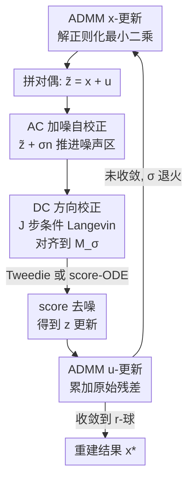

# Taming Score-Based Denoisers in ADMM: A Convergent Plug-and-Play Framework

**会议**: ICLR 2026  
**OpenReview**: [https://openreview.net/forum?id=BiXwSIIMIq](https://openreview.net/forum?id=BiXwSIIMIq)  
**代码**: https://github.com/rajeshshrestha/ACDC.git  
**领域**: 图像恢复 / 逆问题 / 扩散模型先验  
**关键词**: 即插即用、ADMM、score-based 去噪、流形失配、收敛性分析

## 一句话总结
本文提出 ADMM-PnP + AC-DC 三阶段去噪器，先用「加噪自校正 + Langevin 方向校正」把 ADMM 迭代点拉回 score 函数训练过的噪声流形，再做 score 去噪，从而把扩散先验稳定地嵌进带对偶变量的 ADMM，并首次给出该组合的不动点收敛性证明，在多类图像逆问题上一致优于 DPS/DiffPIR/DDRM 等基线。

## 研究背景与动机
**领域现状**：求解逆问题 $y = A(x) + \xi$（去模糊、超分、修复、相位恢复等）通常写成 $\min_x \ell(y\|A(x)) + h(x)$，其中 $\ell$ 是数据保真项、$h$ 是结构正则项。近年主流做法是把扩散模型预训练得到的 score 函数 $s_\theta(x,\sigma)\approx\nabla_x\log p(x_t)$ 当作强先验：要么改 MCMC 采样过程做后验采样（DPS、DDRM），要么借 Tweedie 引理把 score 当成「去噪算子」插进 proximal/变量分裂式的优化迭代里（DiffPIR、RED-diff、SNORE），即所谓即插即用（PnP）。

**现有痛点**：score 函数是在「高斯扰动构造的噪声流形」$\mathcal{M}_{\sigma(t)}=\mathrm{supp}(x_t)$ 上训练的，但优化算法产生的迭代点 $\tilde z^{(k)}$ 不一定落在任何一个 $\mathcal{M}_{\sigma(t)}$ 上——这就是**流形失配**：直接对一个「噪声几何不对」的点调用 score 去噪，效果会退化、出伪影。已有补救（往迭代点加高斯噪声做「净化」、随机正则化）只是把点推近某个流形，但**不保证对齐**，还容易过拟合测量噪声。

**核心矛盾**：把 score 去噪嵌进 ADMM 比嵌进纯原始（primal）算法更难，因为 ADMM 是原始-对偶方法，**对偶变量 $u^{(k)}$ 会进一步扭曲迭代点的「噪声」几何**——$\tilde z^{(k)} = x^{(k+1)} + u^{(k)}$ 里 $u^{(k)}$ 的分布本就不清楚，加进来后噪声分布更难刻画。这大概解释了为什么 score 去噪很少和 ADMM 这类 primal-dual 方法结合。可 ADMM 又恰恰因为能灵活处理多正则项/约束而很有吸引力。

**核心矛盾之二**：理论上，score-based PnP 的**收敛性几乎没人说清**。经典去噪器有成熟的收敛理论，但 score 去噪器因为上面的几何失配，连「迭代会不会稳定、什么条件下收敛」都不明确；现有分析也基本只覆盖 primal 算法，没覆盖 ADMM。

**本文目标**：(1) 设计一个能把 ADMM 迭代点真正对齐到 score 训练流形的去噪器；(2) 在 ADMM-PnP + score 去噪器这一组合下给出收敛保证。

**切入角度**：与其指望「加一点噪声就对齐」，不如分两步走——先用高斯噪声把点粗略推进噪声主导的区域（auto-correction），再用一段 Langevin 动力学把它**定向**拉到目标流形 $\mathcal{M}_{\sigma(k)}$（directional correction），最后才让 score 做去噪。

**核心 idea**：用「AC（加噪自校正）→ DC（条件 Langevin 方向校正）→ score 去噪」三阶段算子替换 ADMM 的 $z$-子问题去噪步，让 score 始终作用在它擅长的流形上，并证明该算子是弱非扩张/有界去噪器，从而 ADMM-PnP 收敛。

## 方法详解

### 整体框架
本文要解决的是「如何把扩散 score 去噪器稳定地塞进 ADMM 的去噪子问题」。ADMM-PnP 把原问题 $\min_{x,z}\ell(y\|A(x))+\gamma h(z)\ \text{s.t.}\ x=z$ 拆成三步交替更新：$x$-更新解一个带数据保真的正则化最小二乘（用 Adam 迭代求解）、$z$-更新本质是一个去噪问题、$u$-更新累加原始残差。经典 PnP 直接把 $z$-更新写成 $z^{(k+1)} = D_{\sigma^{(k)}}(\tilde z^{(k)})$，$\tilde z^{(k)} = x^{(k+1)} + u^{(k)}$。

本文的核心改动只在这个去噪算子 $D_{\sigma^{(k)}}$ 上：把它换成**三阶段的 AC-DC 去噪器**。给定 ADMM 当前的 $\tilde z^{(k)}$，先 **AC**：加一发高斯噪声 $z^{(k)}_{ac} = \tilde z^{(k)} + \sigma^{(k)} n$，把点推进噪声主导的区域；再 **DC**：以 $z^{(k)}_{ac}$ 为起点跑 $J$ 步条件 Langevin 动力学，把点**定向**收敛到目标噪声流形 $\mathcal{M}_{\sigma^{(k)}}$ 上、同时保留测量信息；最后 **去噪**：在已对齐的 $z^{(k)}_{dc}$ 上用 Tweedie 引理（或一段 score-ODE）做最终去噪，得到 $z^{(k+1)}$。三阶段输出回填进 ADMM 继续 $u$-更新。整套方法的关键在于：score 只在最后一步、且只作用在「已经被 AC-DC 拉回训练流形」的点上，因而去噪有效；并配套证明这个 $D_{\sigma^{(k)}}$ 满足收敛所需的算子性质。

### 关键设计

**1. AC 自校正：用加噪把迭代点先推进「噪声主导」的邻域**

直接对 ADMM 迭代点 $\tilde z^{(k)}$ 调用 score 会失配，因为它的噪声几何不明（尤其混入了对偶变量 $u^{(k)}$）。AC 阶段做一件很朴素的事：$z^{(k)}_{ac} = \tilde z^{(k)} + \sigma^{(k)} n,\ n\sim\mathcal{N}(0,I)$。把它展开可写成 $z^{(k)}_{ac} = z_{\sigma^{(k)}} + \tilde s^{(k)}$，其中 $z_{\sigma^{(k)}} = z^{(k)}_\natural + \sigma^{(k)} n_1$ 是干净信号 $z^{(k)}_\natural\sim p_{data}$ 的标准高斯扰动版本（恰好落在某个训练流形上），残差 $\tilde s^{(k)} = \sqrt2\,\sigma^{(k)} n_2 + s^{(k)}$。只要 $\sigma^{(k)}$ 足够大，$z^{(k)}_{ac}$ 就被高斯噪声主导。这一步与已有「净化（purification）」和「加噪去噪」思路同源，作用是把点粗略推进噪声区域。但作者明确指出 **AC 单独不够**：它只保证「噪声大」，不保证落在 score 真正训练过的某个 $\mathcal{M}_{\sigma(t)}$ 上，所以必须接 DC。

**2. DC 方向校正：用条件 Langevin 把点定向拉到目标流形上、且保留测量信息**

这是本文相对已有「加噪 PnP」最关键的增量。DC 以 $z^{(k)}_{ac}$ 为初值，跑 $J$ 步 Langevin 动力学去采样条件分布 $p(z_{\sigma^{(k)}}\mid z^{(k)}_{ac})$。选这个目标分布有两个好处：其支撑满足 $\mathrm{supp}(z_{\sigma^{(k)}}\mid z^{(k)}_{ac})\subseteq\mathrm{supp}(z_{\sigma^{(k)}})=\mathcal{M}_{\sigma^{(k)}}$，所以采出来的点**一定落在目标流形上**；同时该条件分布又保留了 $z^{(k)}_{ac}$（也就是测量）的信息，避免把信号细节洗掉。其条件 score 可分解为

$$\nabla\log p(z_{\sigma^{(k)}}\mid z^{(k)}_{ac}) = s_\theta(z_{\sigma^{(k)}},\sigma^{(k)}) + \nabla\log p(z^{(k)}_{ac}\mid z_{\sigma^{(k)}}).$$

第一项就是现成的预训练 score，第二项似然项无法精确得到，作者在 $\mathrm{Var}(s^{(k)})^{1/2}\ll\sigma_s^{(k)}$ 等温和条件下用局部高斯近似，得到 $\nabla\log p(z^{(k)}_{ac}\mid z_{\sigma^{(k)}})\approx -\tfrac{1}{\sigma_s^2}(z_{\sigma^{(k)}}-z^{(k)}_{ac})$，于是 Langevin 更新写成 $w^{(k,j+1)} = w^{(k,j)} + \eta^{(k)}\big(\tfrac{1}{\sigma_s^2}(z^{(k)}_{ac}-w^{(k,j)}) + s_\theta(w^{(k,j)},\sigma^{(k)})\big) + \sqrt{2\eta^{(k)}}\,n$。直观上，第一项把 $w$ 往 $z^{(k)}_{ac}$（即测量）拉、保信息，第二项 score 把它往数据流形拉、去噪声，两者平衡后落到 $\mathcal{M}_{\sigma^{(k)}}$。消融显示 $J$ 越大伪影越少（见相位恢复实验）。

**3. score 去噪：在已对齐的点上做 Tweedie / ODE 最终去噪**

经过 AC-DC，输入点 $z^{(k)}_{dc}$ 已近似落在 $\mathcal{M}_{\sigma^{(k)}}$ 上，此时再用 score 去噪才名正言顺。本文给两种等价出口：Tweedie 去噪 $z^{(k)}_{tw} = z^{(k)}_{dc} + (\sigma^{(k)})^2 s_\theta(z^{(k)}_{dc},\sigma^{(k)})$（由 Tweedie 引理直接给出条件期望 $E[z_0\mid z_t]$，记为 Ours-tweedie），或解一段概率流 ODE $\tfrac{dz_t}{dt}=\lambda(t)s_\theta(z_t,t)$ 从 $z^{(k)}_{dc}$ 积分回 $z_0$（记为 Ours-ode）。这一步本身是标准做法，本文的贡献在于**保证它的输入是「对的点」**——前两阶段把 score 从「在错误几何上被滥用」变成「在训练分布上被正确使用」。整段 $\sigma^{(k)}$ 按线性退火 $[0.1, 10]$ 衰减，使迭代后期噪声趋零，对应收敛所需的调度条件。

**4. 收敛性分析：把 ADMM-PnP 不动点收敛推广到 score 去噪器**

本文不只给方法，还首次证明 ADMM + score 去噪器能收敛，分两套结果。**第一套（强凸 $\ell$ + 固定步长）**：定义残差算子 $R_\sigma(\tilde z) = (D_{\sigma^{(k)}} - I)(\tilde z)$，若它满足「弱非扩张」假设 $\|R_\sigma(\tilde z_1)-R_\sigma(\tilde z_2)\|_2^2 \le \epsilon^2\|\tilde z_1-\tilde z_2\|_2^2 + \delta^2$（比 Ryu 等人要求的严格压缩更宽松，多了一个 $\delta^2$ 松弛项），则在 $\ell$ 是 $\mu$-强凸、固定步长 $\rho$ 且 $\tfrac{\epsilon}{\mu}(1+\epsilon-2\epsilon^2)<\tfrac1\rho$ 时，ADMM 序列以高概率收敛进半径 $r$ 的不动点球（$\delta=0$ 时退化为 Ryu 等人的结果）。进一步证明：在 $\log p_{data}$ 光滑（$M$-smooth）与强制性（coercivity）假设下，AC-DC 去噪器以概率 $1-2e^{-\nu_k}$ 满足该弱非扩张性，当 $\sigma^{(k)}$ 被调度到趋零时整条序列同时满足、从而收敛。**第二套（去掉凸性 + 自适应步长）**：很多逆问题（如压缩恢复、补全）不满足强凸，作者改用 Chan 等人的 $\rho$-递增方案，证明 AC-DC 是「有界去噪器」（$\tfrac1d\|(D_{\sigma^{(k)}}-I)(x)\|_2^2\le c_k^2$ 一致成立），在适当调度 $(\sigma^{(k)},\sigma_s^{(k)})$ 下序列以高概率收敛到不动点。两套结果都是不动点收敛（因隐式 $h(\cdot)$ 难做更强的驻点收敛），把经典 ADMM-PnP 理论延伸到了扩散 score 设置。

### 损失函数 / 训练策略
方法本身**不训练任何模型**——直接复用 Chung et al. (2023) 的预训练 score。关键超参：$\sigma^{(k)}$ 线性退火 $\sigma^{(k)} = \max(0.1,\ 10-(10-0.1)\cdot k/W)$，最大迭代 $K=W+10$；每步 $J=10$ 步 DC；$\eta^{(k)} = 5\times10^{-4}\sigma^{(k)}$，$\sigma_s^{(k)} = 0.1/\sqrt{\sigma^{(k)}}$。$x$-子问题用 Adam 最多迭代 1000 步（连续 3 步 loss 上升超 $\Delta_{tol}=0.1$ 即判停）。score-ODE 出口用 10 步、并采用 Karras 等人的预条件。

## 实验关键数据

### 主实验
数据集 FFHQ 256×256 与 ImageNet 256×256，各随机抽 100 张验证图，测量噪声 $\sigma_n=0.05$。任务涵盖超分、高斯/运动去模糊、盒状/随机修复、相位恢复、HDR、非线性去模糊。指标 PSNR / SSIM / LPIPS。表 1 报告：在几乎所有逆问题上 Ours-tweedie 与 Ours-ode 取得全部指标的最优或次优，且显著超过 DDRM、DiffPIR、RED-diff 等 PnP 基线。下面是论文配图中给出的几组定量对比：

| 任务 | 方法 | PSNR↑ | SSIM↑ | LPIPS↓ |
|------|------|-------|-------|--------|
| 随机修复 | **Ours** | **31.99** | **0.91** | **0.057** |
| 随机修复 | DDRM | 29.89 | 0.72 | 0.231 |
| 随机修复 | DiffPIR | 28.36 | 0.82 | 0.134 |
| 随机修复 | DPS | 28.41 | 0.73 | 0.180 |
| 盒状修复 | **Ours** | **22.13** | 0.82 | **0.141** |
| 盒状修复 | DAPS-4K | 21.42 | 0.81 | 0.167 |
| 盒状修复 | DPS | 21.72 | 0.81 | 0.158 |
| 盒状修复 | DiffPIR | 17.64 | 0.58 | 0.300 |
| 运动去模糊 | **Ours** | **30.70** | **0.84** | **0.194** |
| 运动去模糊 | DAPS-4K | 29.97 | 0.81 | 0.230 |
| 运动去模糊 | DPS | 24.80 | 0.67 | 0.289 |

### 消融实验

| 配置 | 现象 | 说明 |
|------|------|------|
| AC only（$J=0$，禁用 DC） | 伪影严重 | 只加噪不做定向校正，点没真正对齐流形 |
| AC-DC（$J=10$） | 明显变干净 | DC 把点拉回 $\mathcal{M}_{\sigma}$ 后 score 去噪有效 |
| AC-DC（$J=20$） | 进一步更干净 | 增大 Langevin 步数持续改善 |

### 关键发现
- **DC 是核心增量**：在最难的相位恢复任务上，$J=0$（等价于已有「加噪 PnP」做法）伪影严重，随 $J$ 增大伪影递减——这直接验证了「只加噪不够、必须定向校正」的核心论点。
- **对偶变量是 ADMM 的特有难点**：方法和理论都围绕「$u^{(k)}$ 扭曲噪声几何」展开，AC-DC 正是为弥补这一失配而设计，这也是 score 去噪此前难与 primal-dual 方法结合的原因。
- **感知指标提升尤为明显**：随机修复上 LPIPS 从基线 0.134~0.231 降到 0.057，说明 AC-DC 恢复的图更自然、伪影更少，而非单纯刷 PSNR。

## 亮点与洞察
- **把「加噪净化」升级为「加噪 + 定向校正」两段式**：已有方法停在「加高斯噪声推近流形」，本文点破其不保证对齐，再补一段条件 Langevin 真正把点拉到目标流形——这个「先粗推再精拉」的拆解思路可迁移到任何「想用 score/扩散先验、但迭代点几何不对」的优化框架。
- **条件分布选得巧**：DC 采样 $p(z_{\sigma^{(k)}}\mid z^{(k)}_{ac})$ 同时满足「支撑落在训练流形内」与「保留测量信息」两个看似冲突的诉求，是整个方法成立的关键支点。
- **方法 + 理论双落地**：不仅给出可用算法，还把弱非扩张/有界去噪器两套 ADMM-PnP 收敛理论延伸到扩散 score 去噪器，并区分了强凸（固定步长）与非凸（自适应步长）两种实际场景。
- **即插即用、零训练**：直接复用预训练 score，去噪器可插进任意 proximal 类框架（proximal gradient、变量分裂如 DiffPIR），通用性强。

## 局限与展望
- **只到不动点收敛**：作者坦承因隐式正则项 $h(\cdot)$ 未知，无法给出更强的驻点收敛，理论强度受限于 PnP 范式本身。
- **DC 引入额外计算**：每个 ADMM 迭代内嵌 $J=10$ 步 Langevin（每步都要调一次 score），叠加 $x$-子问题最多 1000 步 Adam，整体推理成本高于一次性采样类方法。
- **理论依赖较多假设**：弱非扩张/有界性证明依赖 $\log p_{data}$ 光滑、强制性、$D=\mathrm{diam}(X)<\infty$、DC 达到平稳分布等条件，且似然项用了局部高斯近似（$\mathrm{Var}(s^{(k)})^{1/2}\ll\sigma_s^{(k)}$），现实中是否严格满足存疑。
- **评测规模**：每数据集仅 100 张测试图，且都是 256×256，更高分辨率与更广任务上的稳健性有待验证。

## 相关工作与启发
- **vs DPS / DDRM（后验采样类）**: 它们改 MCMC 采样过程、用观测引导无条件 score 做后验采样，性能受 $\nabla\log p(y\mid x_t)$ 近似精度限制；本文走优化（ADMM）路线、把 score 当去噪器，且配套收敛证明。
- **vs DiffPIR / RED-diff / SNORE（PnP 类）**: 它们也把 score 插进优化迭代，但靠「加噪/净化」处理流形失配、且基本是 primal 算法、缺 ADMM 收敛理论；本文用 AC-DC 真正对齐流形、首次覆盖带对偶变量的 ADMM，定量上显著超过这几个基线。
- **vs Ryu 2019 / Chan 2016（PnP 收敛理论）**: 它们要求去噪器严格压缩/经典去噪器；本文把假设放宽到「弱非扩张（带 $\delta^2$ 松弛）」与「有界去噪器」，从而把理论延伸到扩散 score 去噪器。
- **vs D-AMP / Onsager 校正、RL 调参**: 那些「让残差噪声匹配去噪器工作区」的方法要么问题特定（依赖压缩感知结构）、要么需额外训练模型；AC-DC 是面向多类逆问题的通用校正机制、零额外训练。

## 评分
- 新颖性: ⭐⭐⭐⭐⭐ 首次把 score 去噪稳定嵌进带对偶变量的 ADMM，并配套收敛证明，AC-DC 两段校正思路有原创性。
- 实验充分度: ⭐⭐⭐⭐ 任务覆盖广、基线全、定量定性兼有，但每数据集仅 100 张且固定 256×256。
- 写作质量: ⭐⭐⭐⭐ 动机—方法—理论逻辑清晰，三阶段分解讲得透；理论部分符号密集、对读者门槛较高。
- 价值: ⭐⭐⭐⭐⭐ 给「扩散先验 + 经典优化求解器」这一活跃方向补上了 primal-dual 的方法与理论拼图，通用且即插即用。

<!-- RELATED:START -->

## 相关论文

- [\[ICLR 2026\] Adaptive Moments are Surprisingly Effective for Plug-and-Play Diffusion Sampling](adaptive_moments_are_surprisingly_effective_for_plug-and-play_diffusion_sampling.md)
- [\[CVPR 2026\] PnP-CM: Consistency Models as Plug-and-Play Priors for Inverse Problems](../../CVPR2026/image_restoration/pnp-cm_consistency_models_as_plug-and-play_priors_for_inverse_problems.md)
- [\[ECCV 2024\] BrushNet: A Plug-and-Play Image Inpainting Model with Decomposed Dual-Branch Diffusion](../../ECCV2024/image_restoration/brushnet_a_plug-and-play_image_inpainting_model_with_decomposed_dual-branch_diff.md)
- [\[NeurIPS 2025\] Learning Cocoercive Conservative Denoisers via Helmholtz Decomposition for Poisson Inverse Problems](../../NeurIPS2025/image_restoration/learning_cocoercive_conservative_denoisers_via_helmholtz_decomposition_for_poiss.md)
- [\[ICLR 2026\] FAST-DIPS: Adjoint-Free Analytic Steps and Hard-Constrained Likelihood Correction for Diffusion-Prior Inverse Problems](fastdips_adjointfree_analytic_steps_and_hardconstrained_likelihood_correction_fo.md)

<!-- RELATED:END -->
