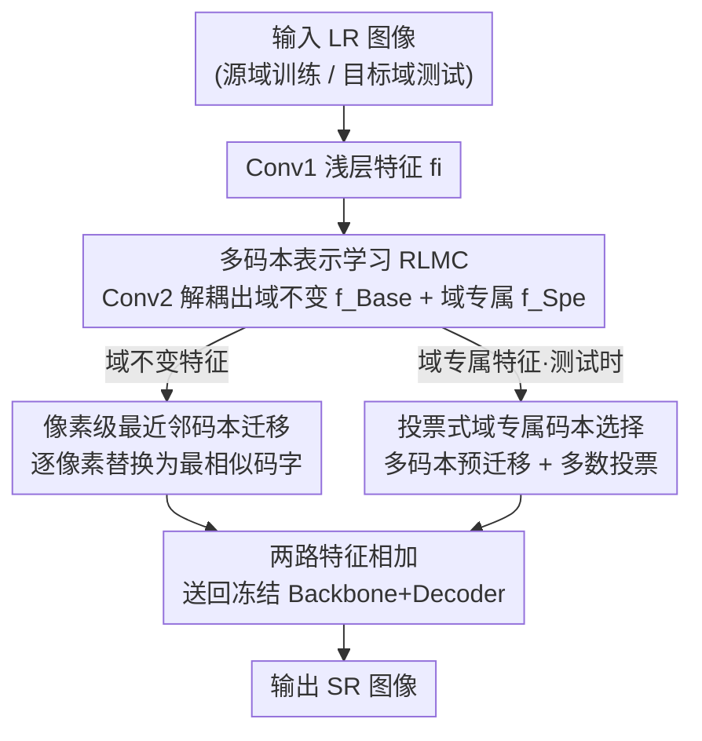

# Test-Time Domain Generalization for Image Super-Resolution

**会议**: ICLR 2026  
**OpenReview**: [https://openreview.net/forum?id=jBuMH3DOPQ](https://openreview.net/forum?id=jBuMH3DOPQ)  
**代码**: https://github.com/ZaizuoTang/MC-TTDG  
**领域**: 图像超分辨率 / 测试时域泛化 / 底层视觉  
**关键词**: 测试时域泛化, 图像超分, 多码本, 像素级特征迁移, 投票选择

## 一句话总结
针对超分这类像素级任务，本文提出 MC-TTDG：在源域上学一组「域不变码本 + 多个域专属码本」，测试时把目标域特征逐像素最近邻替换成码字来完成细粒度迁移，并用投票策略选出最合适的域专属码本，从而无需在目标域微调就显著提升了超分网络的跨域性能。

## 研究背景与动机

**领域现状**：测试时域泛化（TTDG）是应对域偏移的一类轻量方案。它在源域训练时记住源域分布的「质心」，测试时不微调网络，而是对目标域样本做风格迁移（style transfer），把目标域特征的均值/方差对齐到源域质心上，从而让源域训练好的模型在目标域上也能用。相比传统域泛化只在多源域上学不变表示、完全忽略目标域信息，TTDG 的好处是在推理时也利用了目标域样本，且省去了昂贵的目标域微调。

**现有痛点**：现有 TTDG 几乎都建立在风格迁移之上，而风格迁移是一种**全局、粗粒度**的操作——它只调整整张特征图的均值和方差。这对图像分类这种依赖整图抽象表示的高层视觉任务有效，但对超分（SR）这种像素级预测任务几乎失灵：作者用 t-SNE 可视化发现，风格迁移后的目标域样本和迁移前的样本几乎完全重叠，根本没把分布拉到源域去（图 2）。

**核心矛盾**：高层任务靠「整图全局风格」做决策，所以调全局统计量就够；而底层任务（超分）每个像素都要独立预测，需要的是**逐像素的细粒度对齐**。全局风格迁移在粒度上天然对不上底层视觉的需求。此外，现有方法用单个 backbone 或单个码本去表示多个分布迥异的源域，会把这些源域压进一个狭窄的特征空间，导致**域专属信息丢失**（图 3a）。

**本文目标**：把 TTDG 从高层视觉搬到底层视觉（超分），需要解决三件事——(1) 怎么做到像素级细粒度迁移；(2) 怎么在表示多源域时不丢域专属信息；(3) 测试时怎么为目标域选对域专属码本。

**切入角度**：作者引入**码本（codebook）**。码本由一组离散码字组成，天然适合做「逐像素最近邻替换」这种局部、离散的迁移，正好补上风格迁移缺失的细粒度。这也是据作者所知第一次把码本用进 TTDG、也是第一个为底层视觉设计的 TTDG 方法。

**核心 idea**：用「域不变码本 + 多个域专属码本」在源域学细粒度表示，测试时对目标域特征做逐像素最近邻码字替换来迁移，再用投票挑出最优域专属码本。

## 方法详解

### 整体框架
MC-TTDG 把整套流程拆成「服务器端训练 + 边缘端测试」两个阶段。训练阶段加载并**冻结**一个预训练超分网络（Conv1 + Backbone + Decoder），只训练新增的码本与解耦模块，让它们学会用「域不变 + 域专属」两套码本来重建源域特征（这一阶段的主优化目标就是赋予码本重建源域特征的能力）。测试阶段则不碰网络权重：把目标域 LR 图过同样的浅层特征提取与解耦，用域不变码本迁移域不变特征、用投票选出的域专属码本迁移域专属特征，两路相加后送回冻结网络生成 SR 图。

整体可以看成一条「浅层特征 → 解耦成两路 → 各自码本迁移 → 相加 → 解码」的流水线，训练与测试共享同一套解耦和迁移算子，区别只在于训练阶段在所有源域码本上学重建，测试阶段对单张目标图做最近邻替换 + 投票选码本。

### 关键设计

**1. 多码本表示学习 RLMC：用「不变码本 + 专属码本」把源域细粒度地拆开**

这一设计针对「单码本压缩多源域、丢失域专属信息」的痛点。作者不再用一个码本硬塞所有源域，而是给每个源域配一个**域专属码本** $\text{Codebook}^{Spe}_i$，再额外引入一个所有源域共享的**域不变码本** $\text{Codebook}^{Base}$。具体地，第 $i$ 个源域的 LR 图先过浅层提取 $f_i = \text{Conv1}(LR^S_i)$，再用一次卷积解耦：$f^{Base}_i = \text{Conv2}(f_i)$ 当作域不变部分，残差 $f^{Spe}_i = f_i - f^{Base}_i$ 当作域专属部分。两路分别用对应码本迁移得到 $f^{BQ}_i$ 和 $f^{SQ}_i$，相加后送进冻结的 backbone/decoder 生成 $SR^S_i$。

这种「域不变码本作基底、域专属码本作偏移」的分工，让每个源域既共享跨域通用结构、又保留自己的独特细节，t-SNE 可视化里多码本能给每个源域分配独立的特征空间（图 3b），而单码本会把它们挤成一团。训练目标由四项组成：超分重建损失 $Loss_{SR}=|SR^S_i - HR^S_i|$、训练码字的量化损失 $Loss_{Vq}$、约束网络层向码字靠拢的承诺损失 $Loss_{Comm}$，以及一个辅助分类损失 $Loss_{Cls}=\text{CrossEntropy}(Pre, i)$，合成 $Loss_{All}=Loss_{SR}+\lambda Loss_{Vq}+\beta Loss_{Comm}+\gamma Loss_{Cls}$。其中量化/承诺损失沿用 VQ 的梯度停止技巧 $sg(\cdot)$ 分别更新码字和网络层；分类分支只用 $f^{Spe}_i$ 预测当前域类别，但其预测在训练阶段并不参与迁移，只是为测试时的投票准备好一个判别器。

**2. 像素级最近邻码本迁移：把全局风格迁移换成逐像素码字替换**

这一设计直击「风格迁移粒度太粗、对超分无效」的核心矛盾。作者把迁移定义成一个逐像素的最近邻检索：对特征图上位置 $(x,y)$ 的像素特征 $f_{x,y}$，在码本里找欧氏距离最近的码字并直接替换，

$$\text{Transfer}(f_{x,y}, \text{Codebook}) = C_k,\quad k = \arg\min_{C_i \in \text{Codebook}} \|f_{x,y} - C_i\|_2 .$$

测试时目标域域不变特征用域不变码本迁移 $f^{BQ}_{Target} = \text{Transfer}(f^{Base}_{Target}, \text{Codebook}^{Base})$，域专属特征用选中的专属码本迁移，最后 $SR^T = \text{Decoder}(\text{Backbone}(f^{BQ}_{Target} + f^{SQ}_{Target}))$。和风格迁移只改整图均值/方差不同，这里每个像素都被独立地拉到源域码字上，迁移粒度精确到像素，从而真正把目标域分布对齐到源域（图 2 的 t-SNE 显示码本迁移后的分布确实落到了源域簇里，而风格迁移几乎不动）。消融里风格迁移（单中心/多中心）相对 baseline 几乎零提升，而码本迁移在三个目标分支上都明显涨点，印证了「粒度」才是底层视觉迁移的胜负手。

**3. 投票式域专属码本选择：用多码本预迁移 + 多数投票纠正分类网络的偏差**

有了多个域专属码本，测试时必须为目标域挑一个最合适的。最直接的做法是像 MoE 那样用一个分类网络打分、选置信度最高的专家——但分类网络是在源域上训练的，面对有域偏移的目标域样本预测会严重出错（表 3 中直接用最大预测分数的 Top-1 准确率低至 0.06~0.29）。作者的洞察是：与其相信分类网络对**原始**目标特征的一次判断，不如先用每个域专属码本各自对目标特征做一次**预迁移**，得到多份「已经被拉向某源域」的特征，再把它们分别送进分类网络统计票数，得票最高的域专属码本即为最终选择；若出现平票，则回退到用未迁移原始特征的投票结果。这相当于让多个码本「各执一词、多方会诊」，用集成的方式稳定了分类网络在分布偏移下的预测——表 3 中投票把 Top-1 准确率提升到 0.35~0.49、Top-2 普遍接近 0.78~0.88，比直接打分大幅更可靠。

## 实验关键数据

数据集用 DRealSR（含 P / IMG / Canon / Pan / Sony / DSC 多个不同相机拍摄的数据分支，分布各异）以及 Set5/Set14/B100/Urban/Manga109/DIV2K，指标为 PSNR / SSIM / LPIPS。源域取 P、IMG、Canon 三个分支训练，在 Pan、Sony、DSC 三个目标分支上测试。骨干网络验证了 AdaCode、HAT、MambaIR 等多种架构，下面消融以 MambaIR 为例。

### 主实验

| 数据集(目标域) | 指标 | MC-TTDG(本文) | 之前最好(TTMG) | 提升 |
|--------|------|------|----------|------|
| Pan | PSNR↑ | 31.15 | 30.26 | +0.89 dB |
| Pan | LPIPS↓ | 0.3593 | 0.4523 | 更优 |
| Sony | PSNR↑ | 31.29 | 30.56 | +0.73 dB |
| Sony | LPIPS↓ | 0.3157 | 0.4069 | 更优 |
| DSC | PSNR↑ | 31.21 | 30.70 | +0.51 dB |
| DSC | LPIPS↓ | 0.3583 | 0.4128 | 更优 |

对比的 TF-Cal、TSB、DG-PIC、TTDG、TTMG 都基于粗粒度风格迁移，MC-TTDG 在三个目标分支上 PSNR、SSIM、LPIPS 三项指标全面领先。

### 消融实验

| 配置 | Pan PSNR | Sony PSNR | DSC PSNR | 说明 |
|------|---------|---------|---------|------|
| Baseline | 31.0263 | 30.7220 | 30.9117 | 冻结网络，不迁移 |
| One codebook | 31.1111 | 31.1411 | 30.9640 | 单码本：有提升但丢域专属信息 |
| w/o 域不变码本 | 30.9097 | 31.0144 | 30.9043 | 只用域专属码本，反而掉点 |
| 域专属+域不变码本(Full) | 31.1571 | 31.2937 | 31.2118 | 完整 RLMC，三分支全涨 |

| 特征迁移方法 | Pan PSNR | Sony PSNR | DSC PSNR | 说明 |
|------|---------|---------|---------|------|
| Baseline | 31.0263 | 30.7220 | 30.9117 | — |
| 单中心风格迁移 | 31.0262 | 30.7171 | 30.9131 | 几乎零提升 |
| 多中心风格迁移 | 31.0261 | 30.7166 | 30.9118 | 几乎零提升 |
| 码本迁移(本文) | 31.1571 | 31.2937 | 31.2118 | 明显领先 |

| 码本选择方法 | Pan Top1 | Sony Top1 | DSC Top1 | 说明 |
|------|---------|---------|---------|------|
| 最大预测分数 | 0.2907 | 0.0596 | 0.1660 | 分类网络直接打分，偏移下很差 |
| 投票选择(本文) | 0.3726 | 0.3545 | 0.4922 | 多数投票，准确率大幅提升 |

### 关键发现
- **粒度是底层视觉迁移的胜负手**：风格迁移（无论单中心还是多中心）相对 baseline 提升几乎为零，而逐像素码本迁移在三个分支上把 PSNR 拉高 0.13~0.57 dB，说明对超分而言「像素级 vs 全局」的粒度差异比「迁移与否」更关键。
- **域不变码本不可或缺**：去掉域不变码本只留域专属码本后，多个分支甚至掉到 baseline 以下（Pan 30.91 < 31.03），说明跨域共享基底对解耦学习是必要的，缺了它网络反而分不清域不变与域专属特征。
- **投票显著纠偏**：在分布偏移下，分类网络直接打分的 Top-1 最低只有 0.06（Sony），投票把它提到 0.35，Top-2 更是普遍接近 0.78~0.88，证明「预迁移 + 多方投票」能有效抵消源域分类器在目标域上的失准。

## 亮点与洞察
- **把码本当作「迁移算子」而非「生成先验」**：以往码本（VQ-VAE / VQGAN）多用于离散表示或生成，这里被巧妙复用为「逐像素最近邻替换」的迁移工具，天然提供了风格迁移给不了的细粒度。
- **基底 + 偏移的解耦很优雅**：域不变码本作公共基底、域专属码本作偏移，用一次卷积残差 $f^{Spe}=f_i-f^{Base}$ 就把两类特征解耦开，结构简单却能在 t-SNE 上看到清晰的域分离。
- **投票纠偏思路可迁移**：「源域分类器在目标域不可信，于是先各专家预迁移再投票」这一招，本质是用集成对抗分布偏移，可迁移到任何「测试时选专家/选模块」且存在域偏移的场景（如 MoE 路由、测试时适配）。
- **冻结网络 + 外挂码本**：整套迁移完全外挂在冻结的预训练超分网络之外，不动原网络权重，适合「服务器训练码本、边缘端即插即用」的部署形态。

## 局限与展望
- **依赖明确的源域划分**：方法需要多个有标注域标签的源域来分别建专属码本，源域数量与划分质量直接影响码本质量；当源域只有一个或域边界模糊时，多码本的优势难以体现。
- **码本数随源域线性增长**：每个源域一个专属码本，源域多时码本与投票时的预迁移次数都会增加，测试开销随源域数上升。
- **提升幅度偏小**：虽然相对风格迁移类方法领先，但绝对 PSNR 提升多在 0.1~0.9 dB 量级，且评估集中在 DRealSR 多相机分支，对更剧烈的退化/跨域（如真实模糊、压缩伪影）泛化性还需更多验证。
- **投票的计算冗余**：投票需要用所有域专属码本各做一次预迁移再过分类网络，源域多时这部分是额外开销，论文未深入讨论其与精度的权衡。

## 相关工作与启发
- **vs 传统域泛化（DomainDrop 等）**: 传统 DG 只在多源域上学不变表示、优化源域网络，完全忽略测试时目标域信息；本文属于 TTDG，测试时直接对目标域样本做迁移，利用了目标域分布。
- **vs 基于风格迁移的 TTDG（TTMG / TTDG / TF-Cal 等）**: 它们用全局均值/方差对齐做粗粒度迁移，适合高层视觉；本文用码本做逐像素最近邻替换，针对超分这类底层视觉的像素级需求，实验上全面领先。
- **vs MoE 门控选择**: MoE 用分类网络（门控）选专家，但在域偏移下源域分类器失准；本文用「多码本预迁移 + 投票」替代单次门控打分，显著提升了目标域上的选择准确率。

## 评分
- 新颖性: ⭐⭐⭐⭐ 首个面向底层视觉的 TTDG，也是首次把码本引入 TTDG，切入角度新。
- 实验充分度: ⭐⭐⭐⭐ 多架构（AdaCode/HAT/MambaIR）多分支验证，消融覆盖码本配置/迁移方式/选择策略；但绝对增益偏小、跨退化类型验证有限。
- 写作质量: ⭐⭐⭐⭐ 三 challenge–solution 对应清晰，图（t-SNE/框架图）辅助到位。
- 价值: ⭐⭐⭐⭐ 给底层视觉的测试时域泛化提供了细粒度迁移的新范式，投票纠偏思路有迁移价值。

<!-- RELATED:START -->

## 相关论文

- [\[ECCV 2024\] Domain-Adaptive Video Deblurring via Test-Time Blurring](../../ECCV2024/image_restoration/domain-adaptive_video_deblurring_via_test-time_blurring.md)
- [\[ICLR 2026\] Learning Domain-Aware Task Prompt Representations for Multi-Domain All-in-One Image Restoration](learning_domain-aware_task_prompt_representations_for_multi-domain_all-in-one_im.md)
- [\[CVPR 2026\] Degradation-Consistent Test-Time Adaptation for All-in-One Image Restoration](../../CVPR2026/image_restoration/degradation-consistent_test-time_adaptation_for_all-in-one_image_restoration.md)
- [\[CVPR 2026\] Time Without Time: Pseudo-Temporal Representation for Space-Time Super-Resolution](../../CVPR2026/image_restoration/time_without_time_pseudo-temporal_representation_for_space-time_super-resolution.md)
- [\[ICLR 2026\] Continuous Space-Time Video Super-Resolution with 3D Fourier Fields](continuous_space-time_video_super-resolution_with_3d_fourier_fields.md)

<!-- RELATED:END -->
