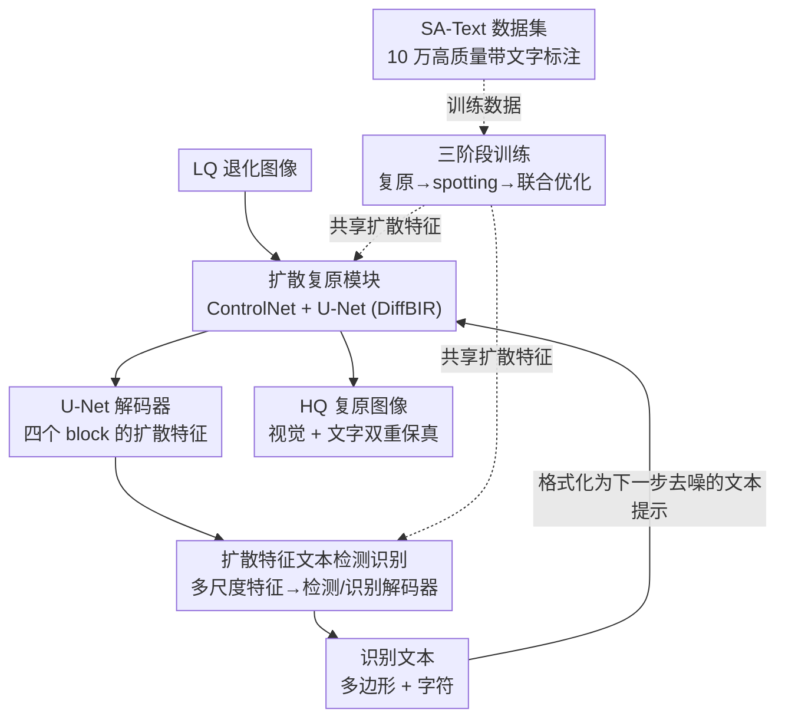

# Text-Aware Image Restoration with Diffusion Models

**会议**: ICLR 2026  
**OpenReview**: [https://openreview.net/forum?id=jt2c2H6auR](https://openreview.net/forum?id=jt2c2H6auR)  
**代码**: 论文承诺公开 code / weights / dataset（截稿时未放出）  
**领域**: 扩散模型 / 图像复原 / 场景文字  
**关键词**: 文字感知复原, 扩散模型, text-spotting, 文字幻觉, 多任务学习

## 一句话总结
本文提出"文字感知图像复原 (TAIR)"这一新任务——同时恢复画面观感与文字内容，并用一个把 text-spotting 模块嵌进扩散复原网络、共享扩散特征联合训练的模型 TeReDiff，配上 10 万张高质量带密集文字标注的 SA-Text 数据集，显著缓解了扩散复原模型"把退化文字编造成似是而非乱码"的文字幻觉问题，并在 STISR 基准 TextZoom 上刷新 SOTA。

## 研究背景与动机
**领域现状**：扩散模型凭借强大的生成先验在自然图像复原（image restoration, IR）上取得了很好的感知质量，StableSR、SeeSR、DiffBIR、SUPIR、FaithDiff 等一系列方法都能在各种退化下产出视觉上很"干净"的结果。

**现有痛点**：这些方法在**文字区域**上集体翻车。因为它们依赖扩散模型的生成先验，遇到退化的文字时，倾向于"画一片看起来像文字的纹理"而不是还原**真实的那几个字符**——本文把这种现象命名为 **text-image hallucination（文字幻觉）**：结果看着像有字，但字是错的、甚至是乱码。论文实验里能看到，退化越强（Level2/Level3），主流方法的端到端识别 F1 反而**掉到比原始低质输入还低**，等于越"复原"越糟。

**核心矛盾**：以往 IR 研究只盯着整体感知质量，从不显式地为"文字可读性"负责；而文字承载的是语义信息（文档数字化、路牌识别、AR 导航），一点点字符畸变都会累积成严重的信息损失。另一条线 STISR（场景文字超分）虽然关心文字清晰度，但它只处理**裁剪后的单词小图**（如 $64\times16$、单词假设），丢掉了全局上下文，无法保证整图视觉一致性。两边都不能兼顾"全场景视觉复原"与"文字保真"。

**本文目标**：定义并解决一个新任务 TAIR——在复原**整张场景图**的同时显式保住文字保真度，把文字语义集成进复原过程。这要拆成两个子问题：(1) 没有合适的"高分辨率 + 密集文字标注"数据集；(2) 没有能让复原过程"知道字是什么"的模型机制。

**切入角度**：作者注意到近期工作表明**扩散模型的中间特征本身就语义丰富、对下游视觉任务很有用**。那么与其外挂一个独立 OCR，不如直接拿扩散 U-Net 的解码器特征去喂一个 text-spotting 模块，让"复原"和"识别文字"通过共享特征互相促进——复原得到识别能用的特征，识别结果又反过来告诉复原"这里应该是什么字"。

**核心 idea**：用"扩散特征驱动的 text-spotting + 把识别文字作为去噪条件"的多任务闭环，替代"纯靠生成先验猜字"，从而把文字幻觉压下去。

## 方法详解

### 整体框架
TeReDiff 在 DiffBIR（U-Net $\mathcal{U}$ + ControlNet $\mathcal{C}$）这个扩散复原骨架上，挂了一个**文本检测识别（text-spotting）模块**。输入是低质图像 $I_{lq}$，输出是视觉与文字双重保真的高质图像 $I_{hq}$。复原侧把 HQ 隐变量 $z_0$ 加噪得到 $z_t$，与退化去除得到的条件隐变量 $c$ 拼成 $c_t=\text{concat}(z_t,c)$，再配上文本提示 $p_t$ 经 ControlNet 去条件化 U-Net。关键之处在于：每一步去噪时，从 U-Net 解码器抽出的扩散特征会喂给 text-spotting 模块，预测出"哪里有字、是什么字"；这些识别结果又被格式化成文本提示 $p_{t+1}$，回灌给下一步去噪。两个模块通过共享扩散特征**联合训练**，分三阶段从分立走向联合优化。整套方法还需要一个能同时提供高分辨率图像与密集文字标注的训练集，这由作者自建的 SA-Text 数据集提供。

### 关键设计

**1. SA-Text：用全自动 VLM 流水线造一个"高清 + 密集文字标注"的数据集**

TAIR 的硬门槛是数据：文字 spotting 数据集（TextOCR 等）有密集标注但分辨率低、不适合复原；IR 数据集（LSDIR、DIV2K）画质高却没有文字标注；TextZoom 两者都有但规模太小且靠人工。作者干脆基于 SA-1B（1100 万张高清图）造了一条**全自动**流水线产出 SA-Text（10 万张 $512\times512$ 高清图、密集文字标注）。流水线分两段：**检测+裁剪**先用文本检测模型在高清图上找文字，但小目标常被漏检、还混着误检，于是按初检结果切出"完整包住至少一个实例、且实例不跨多个 crop"的 $512\times512$ 小图，再在小图上重跑检测——视野变小后召回和精度都提升；**VLM 识别+过滤**则把每个文字实例的多边形 crop 同时喂给两个 VLM（Qwen2.5-VL 与 OVIS2），**只保留两者转写完全一致的实例**，借此滤掉误读、难读和误检，再用一个 VLM 按清晰度分级、剔除刻意打码的人脸/车牌等隐私区域（这些是 Laplacian 之类全局模糊指标抓不到的）。双 VLM 交叉验证让标注质量足够支撑 TAIR，且因为全自动，可轻松扩到更大规模、还语言无关。

**2. 扩散特征驱动的 text-spotting 模块：让复原与识别共享同一套语义特征**

这是缓解文字幻觉的核心机制。以往 text-spotting 用的是 ResNet 特征，而本文**直接复用扩散 U-Net 的中间特征**——做完一次前向后，从 U-Net $\mathcal{U}$ 的四个解码器 block 抽特征，各自过一层卷积对齐通道维，堆成多尺度输入 $F\in\mathbb{R}^{L\times D}$（$L$ 是 token 数，$D$ 是 transformer 隐藏维）。$F$ 送进一个 transformer 编码器 $\mathcal{E}$ 和检测、识别两个解码器 $\mathcal{D}_{det},\mathcal{D}_{rec}$，解码出多边形-字符元组 $Y=\{(d_t^{(i)},r_t^{(i)})\}_{i=1}^{K}$，其中 $d_t^{(i)}$ 是多边形控制点、$r_t^{(i)}$ 是识别字符、$K$ 是置信度超过阈值 $\mathcal{T}$ 的实例数。这样设计的好处是双向的：扩散特征语义丰富，能提升 spotting；而 spotting 的梯度又会反传回复原模块，**逼着复原网络学到"文字感知"的表征**，从源头上让它别再凭生成先验乱编字符。

**3. 三阶段训练：从分立到联合，避免互相拖累**

直接联合训两个异质模块容易互相干扰，作者把训练拆成三步循序渐进。**Stage 1** 只训复原模块：冻住 text-spotting，用描述文字的提示 $p_t$ 引导，U-Net 与 ControlNet 学一个噪声预测网络 $\epsilon_\theta$ 去拟合加在 HQ 隐变量上的噪声（扩散损失 $\mathcal{L}_{diff}$）。**Stage 2** 只训 text-spotting：沿用 transformer spotting 的常规做法，用二分匹配把预测和 GT 对齐，编码器分支做分类+定位、解码器分支细化多边形与字符转写（$\mathcal{L}_{det}+\mathcal{L}_{rec}$），只是把输入换成扩散特征。**Stage 3** 联合优化两者：总损失把复原损失与检测、识别损失用权重系数加权平衡，让复原从文字监督里受益、spotting 又从更干净的图像特征里受益，形成互利。

**4. 推理期文本提示引导：把"上一步识到的字"喂给"下一步去噪"形成闭环**

训练完成后，作者把 spotting 的输出在推理时也用起来，构成一个去噪闭环。在每个去噪时刻，text-spotting 给出多边形-字符元组；把 $t$ 时刻识别分支预测的字符 $\{r_t^{(i)}\}_{i=1}^{K}$ 格式化成文本提示 $p_{t+1}$，作为 $t+1$ 时刻复原的文本条件。随着图像被逐步复原，检测框和识别文字也会被不断修正——论文给的例子里，字符 'S' 在去噪过程中被纠正成 'I'（"LOUSS VUITTON"→"LOUIS VUITTON"），生动展示了这个自我修正回路。提示风格上，作者发现**描述式提示**（"A realistic scene where the texts text1, text2, ... appear clearly on signs, boards, buildings..."）比**标签式提示**（直接 "text1, text2, ..."）效果更好。

### 损失函数 / 训练策略
复原侧用扩散损失 $\mathcal{L}_{diff}$；spotting 侧用检测+识别损失 $\mathcal{L}_{det}+\mathcal{L}_{rec}$（二分匹配关联 GT）；Stage 3 三者加权联合。复原模块由 DiffBIR 初始化，text-spotting 由 TESTR 初始化；AdamW，Stage 1/2 学习率 $1\times10^{-4}$、Stage 3 降到 $1\times10^{-5}$；输入输出均为 $512\times512$。

## 实验关键数据

### 主实验
在自建 SA-Text 测试集上用两个 text-spotting 模型（ABCNet v2 / TESTR）评测检测与端到端识别（下表为 TESTR、Level1 退化的代表性数值，↑ 越高越好）：

| 方法 | 检测 F1 | End-to-End (None) | End-to-End (Full) |
|------|--------|-------------------|-------------------|
| LQ 输入 | 44.47 | 25.93 | 34.73 |
| DiffBIR | 64.34 | 25.51 | 35.47 |
| SeeSR | 65.32 | 23.31 | 32.82 |
| FaithDiff | 66.23 | 22.50 | 31.59 |
| **TeReDiff (本文)** | **67.47** | **28.19** | **36.99** |

在真实世界 Real-Text 上优势更明显（TESTR）：检测 F1 **74.89** vs FaithDiff 70.57、DiffBIR 68.35；End-to-End(None) **49.39** vs 次优 41.64。在 STISR 基准 TextZoom 上也刷新 SOTA——以 CRNN 识别器为例平均识别率 **72.4%**，远超 TextSR(58.7%) 等专门的 STISR 方法，逼近 HR 上界 72.4%。

图像质量上（PSNR/SSIM/LPIPS/DISTS/FID），TeReDiff 在 SA-Text 测试集的参考类指标全面优于 baseline DiffBIR（如 SSIM 0.5717 vs 0.4965、LPIPS 0.2828 vs 0.3636、FID 36.94 vs 45.10），非参考类指标持平——说明引入文字目标**没有牺牲整体观感**。

### 消融实验
在 SA-Text（Level2 退化、TESTR）上验证多阶段训练与文本提示：

| 配置 | 文本条件 | 检测 F1 | E2E(None) | E2E(Full) |
|------|---------|--------|-----------|-----------|
| Stage1 | Null | 59.99 | 21.24 | 29.79 |
| Stage1 | Captioner(LLaVA) | 61.99 | 24.76 | 31.70 |
| Stage1 | Ground-truth | 71.44 | 32.51 | 42.71 |
| Stage3 | Null | 67.50 | 23.46 | 32.72 |
| Stage3 | Captioner(本文) | 65.75 | 26.39 | 35.13 |
| Stage3 | Ground-truth | 71.85 | 33.31 | 43.40 |

提示风格消融（Level2）：描述式 vs 标签式，给定预测文本时 E2E(Full) 35.13 vs 31.94，给定 GT 文本时 43.40 vs 42.12——描述式一致更优。

### 关键发现
- **联合训练（Stage3）是文字感知能力的来源**：在 Null/Captioner/Ground-truth 三种条件下，Stage3 相对 Stage1 都涨点（如 Null 下检测 F1 59.99→67.50），证明复原模块确实从 spotting 的梯度里学到了文字感知特征。
- **文本提示有效且"越准越好"**：用 GT 文本作提示能逼出最高分（E2E None 32.51→33.31），说明瓶颈在"识别得准不准"，本文的闭环正是在缩小这个差距。
- **退化越强，本文优势越大**：主流方法在 Level2/Level3 会掉到比 LQ 输入还低（文字幻觉加剧），而 TeReDiff 始终保持识别性能，这正是它要解决的核心场景。
- **描述式提示 > 标签式提示**：把识别到的词包进"清晰出现在招牌/建筑上"这类自然语句，比裸列单词更能引导扩散模型。

## 亮点与洞察
- **给一个被忽视的失败模式起了名字并系统化解决**："text-image hallucination"一词精准点出扩散 IR 的盲区——指标看着好、字却是错的，光靠 PSNR/LPIPS 根本测不出来，作者顺势用 text-spotting 指标补上了评测维度。
- **"复用扩散特征做下游任务"的巧妙落地**：不外挂独立 OCR，而是直接拿 U-Net 解码器特征喂 spotting，让识别的梯度反哺复原，一份特征两头用，这个多任务耦合是缓解幻觉的关键，也可迁移到"分割感知复原""版面感知复原"等场景。
- **推理期闭环自纠错很有画面感**：识别结果作为下一步去噪条件、字符在去噪过程中被逐步纠正（S→I），把"生成"从开环猜测变成带反馈的迭代。
- **全自动双 VLM 交叉验证造数据**：用"两个 VLM 转写一致才保留"做高精度伪标注，是一个低成本、可扩展、语言无关的数据 curation 范式，值得复用。

## 局限与展望
- 现有图像质量指标（PSNR/LPIPS 等）本就抓不住文字幻觉，作者依赖 text-spotting 指标侧面度量，缺一个直接的"文字保真"统一指标。
- 闭环强依赖 text-spotting 的识别准确率：GT 提示能逼出明显更高的分数，说明当识别本身出错时，错误提示可能反过来误导去噪（潜在风险，论文未深入分析失败传播）。
- SA-Text 虽宣称语言无关、附了中文示例，但主体实验聚焦英文场景文字，对密集文档、手写、艺术字等更难版式的泛化尚待验证。
- 三阶段训练 + 每步去噪都跑一次 spotting，推理与训练开销相对单纯复原更大，论文未给出效率/延迟对比。

## 相关工作与启发
- **vs STISR（TextDiff / TCDM / DCDM / TextSR）**：它们在裁剪后的单词小图（单词假设）上做超分，丢掉全局上下文；本文 TAIR 处理全场景 $512\times512$ 多文字复杂背景，层级上更广更难，且在 STISR 的窄子任务 TextZoom 上反而刷新 SOTA，说明全场景训练带来了更强的泛化。
- **vs DiffBIR / SeeSR / SUPIR / FaithDiff 等扩散 IR**：它们只优化整体感知质量、靠生成先验"猜"文字，强退化下文字幻觉加剧；本文显式注入文字语义（spotting + 文本提示）守住文字保真，且不牺牲观感。
- **vs 同期基于分割图的文字感知复原（Hu et al., 2025）**：对方用分割掩码引导，本文直接用 text recognition 拿到语言信息做显式 OCR 引导，更直接地利用了字符级语义。

## 评分
- 新颖性: ⭐⭐⭐⭐⭐ 提出并命名 TAIR 新任务 + text-image hallucination 现象，配套数据集与模型形成完整闭环。
- 实验充分度: ⭐⭐⭐⭐⭐ SA-Text/Real-Text/TextZoom 三套基准、三档退化、两个 spotting 评测器、参考与非参考多指标，消融到位。
- 写作质量: ⭐⭐⭐⭐ 动机与方法叙述清晰、图示得当；部分损失细节放在附录，正文略简。
- 价值: ⭐⭐⭐⭐⭐ 同时交付任务定义、可扩展数据集与强基线，对文档/路牌/AR 等文字关键场景有直接实用价值。

<!-- RELATED:START -->

## 相关论文

- [\[ICLR 2026\] Energy-oriented Diffusion Bridge for Image Restoration with Foundational Diffusion Models](energy-oriented_diffusion_bridge_for_image_restoration_with_foundational_diffusi.md)
- [\[ICLR 2026\] Vivid-VR: Distilling Concepts from Text-to-Video Diffusion Transformer for Photorealistic Video Restoration](vivid-vr_distilling_concepts_from_text-to-video_diffusion_transformer_for_photor.md)
- [\[ICLR 2026\] Trajectory-aware Shifted State Space Models for Online Video Super-Resolution](trajectory-aware_shifted_state_space_models_for_online_video_super-resolution.md)
- [\[ICML 2026\] Consistent Diffusion Language Models](../../ICML2026/image_restoration/consistent_diffusion_language_models.md)
- [\[ICLR 2026\] Horizon Imagination: Efficient On-Policy Rollout in Diffusion World Models](horizon_imagination_efficient_on-policy_rollout_in_diffusion_world_models.md)

<!-- RELATED:END -->
