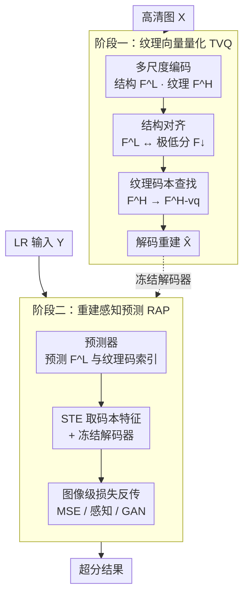

# Texture Vector-Quantization and Reconstruction Aware Prediction for Generative Super-Resolution

**会议**: ICLR 2026  
**OpenReview**: [https://openreview.net/forum?id=OCN81ZmYYj](https://openreview.net/forum?id=OCN81ZmYYj)  
**代码**: https://github.com/LabShuHangGU/TVQ-RAP  
**领域**: 图像恢复 / 生成式超分辨率 / 向量量化  
**关键词**: 超分辨率, 向量量化, 纹理码本, 直通估计器, 重建感知

## 一句话总结
针对 VQ 类生成式超分的两大顽疾——码本编码误差大、预测器用「码级」监督训练，本文提出**纹理向量量化（TVQ）**只把 LR 里缺失的纹理交给码本、把结构剥离出去，再用**重建感知预测（RAP）**借助直通估计器把图像级重建损失直接灌给索引预测器，从而以极小算力（38ms/图）拿到 SOTA 级感知质量。

## 研究背景与动机

**领域现状**：生成式超分（GSR）要从低分辨率图恢复出逼真高清图。早期 PSNR 导向方法会把结果磨得过平、丢纹理；GAN 与扩散方法能建模先验、生成逼真纹理，但 GAN 训练不稳、扩散推理太慢。近年 VQ-VAE 这条线（VQGAN、FeMaSR、AdaCode、VARSR 等）用一个离散视觉码本编码特征、再训一个索引预测网络来建模视觉先验，在精度和效率上展现出竞争力。

**现有痛点**：VQ 类方法有两个具体问题。其一，它们直接把连续视觉特征替换成最近邻码本项，而自然图像信号极其丰富，要保证编码精度往往得堆一个超大码本——既吃显存又难训练（论文 Figure 1 显示 vanilla VQ 即便 8192 项 rFID 仍有 11.0）。其二，预测器用**码级交叉熵**训练，把「索引预测准不准」当作首要优化目标，可这和「最终图像好不好」并不严格对齐：所有偏离 ground-truth 索引的预测都被一视同仁地惩罚，哪怕某个「错码」其实重建出来视觉上完全合理，导致优化停滞、先验建模次优。

**核心矛盾**：码本既要「编码精度」又要「规模可控」，二者难两全；而预测器的「码级准确率」与「图像级质量」目标错位。

**切入角度**：作者抓住超分任务的独特结构——**推理时 LR 已知**，意味着图像里的「结构/低频」成分本就能从 LR 估出来，根本不需要让码本去费力编码它。受经典字典学习「去掉低频分量以增强字典表达力」的启发，只把码本留给 LR 里缺失的**纹理/高频**信息，特征空间的多样性骤降、编码误差自然下来。

**核心 idea**：**结构走连续旁路、纹理走码本**（TVQ）解决码本规模与精度的矛盾；**用 STE 把图像级损失直接回传给索引预测器**（RAP）让训练目标对齐重建质量。

## 方法详解

### 整体框架

整个方法是**两阶段串行**：第一阶段训练一个会「分离结构与纹理、并只对纹理做向量量化」的自编码器（TVQ）；第二阶段冻结这个解码器，训练一个从 LR 预测「结构特征 + 纹理码索引」的预测器，并用重建感知方式（RAP）微调它。

第一阶段里，编码器把高清图 $X$ 编成两路特征：低分辨率结构特征 $F^L$（相对 HR 下采 32×）和高分辨率纹理特征 $F^H$（下采 8×）。为了逼 $F^L$ 真的只装结构，作者额外在一张「极低分辨率」下采图 $X_\downarrow$ 上训一个自编码器得到 $F_\downarrow$（只含基本结构），再把 $F^L$ 对齐到 $F_\downarrow$；这样剩下要靠 $F^H$ 才能重建的部分，自然就被逼成「去结构后的纹理」。只有 $F^H$ 过码本量化成 $F^{H\text{-}vq}$，最后 $F^L$ 与 $F^{H\text{-}vq}$ 一起解码出 $\hat X$。

第二阶段里，因为训练时用的 $X_\downarrow$ 比测试 LR 输入 $Y$ 还要小，$F^L$ 里的结构信息可以被 $Y$ 轻松回归，超分真正的难点只剩「从 $Y$ 预测纹理码索引 $F^{H\text{-}vq}$」。预测器先用码级交叉熵预热，再用 RAP——把预测的 one-hot 索引经直通估计器送进**冻结的预训练解码器**生成 HR，再把 MSE/感知/GAN 重建损失直接反传回索引预测器。

### 关键设计

**1. 纹理向量量化（TVQ）：只把 LR 里缺失的纹理交给码本**

这一招直接针对「码本要编码整个复杂特征空间、必须堆大码本」的痛点。作者用多尺度自编码器把高清图编成结构特征 $F^L\in\mathbb{R}^{C_L\times H_L\times W_L}$ 和纹理特征 $F^H\in\mathbb{R}^{C_H\times H_H\times W_H}$（$[F^H,F^L]=E(X)$）。关键在于怎么保证 $F^L$ 真只装结构：作者把 $X$ 下采 8× 得到极低分图 $X_\downarrow$，单独训一个自编码器 $F_\downarrow=E_\downarrow(X_\downarrow)$、$\hat X_\downarrow=D_\downarrow(F_\downarrow)$，由于 $X_\downarrow$ 比测试 LR 还小，$F_\downarrow$ 只能保留基本结构；再用欧氏距离把 $F^L$ 对齐到 $F_\downarrow$。因为最终重建 $\hat X=D(F^{H\text{-}vq},F^L)$ 既要 $F^L$ 也要量化后的 $F^H$，当结构被 $F^L$ 接管后，$F^H$ 就被「逼」着去表达去结构的纹理。只有 $F^H$ 走码本：$F^{H\text{-}vq}=\mathrm{Lookup}(F^H,C_T)$。

去掉结构后特征空间多样性大幅下降，码本编码误差随之降低——这正是经典字典学习「去低频增表达」思想在 VQ 上的复现。效果立竿见影：相同码本规模下 TVQ 的 rFID 全面碾压 vanilla VQ（如码本 256 时 14.7→9.2，8192 时 5.1→较 vanilla 大幅领先），甚至 TVQ-256 训 100k 步就超过 VQ-8192 训 300k 步，说明小码本也能撑起更强先验。

**2. 重建感知预测（RAP）：用直通估计器把图像级监督直接灌给索引预测器**

这一招针对「码级交叉熵与图像质量目标错位」。第二阶段要从 LR 预测纹理码索引，vanilla 做法是最小化码级交叉熵 $L_{CE}=-\sum_i I^H_i\log(\hat I_i)$，它把所有非 ground-truth 预测一律惩罚，无视不同错码造成的视觉影响差异。作者改成图像级监督：先把预测概率取 one-hot $\hat I^{one\text{-}hot}_i=\mathrm{OneHot}(\hat I_i)$，查码本得 $\hat F^{H\text{-}vq}_i=C_T(\hat I^{one\text{-}hot}_i)$，再塞进**预训练好的冻结解码器**生成 HR 估计，回传 MSE+感知+GAN 损失训练预测器。

难点是 OneHot/argmax 不可导。作者用直通估计器（STE）把它改写成

$$\hat I^{one\text{-}hot}_i=\hat I_i+\big(\hat I^{one\text{-}hot}_i-\hat I_i\big).\mathrm{detach}$$

前向得到离散 one-hot、反向梯度直接绕过 detach 项流回 $\hat I_i$，于是可微解码器的梯度能一路传到索引预测网络。这样预测器不再为「猜中索引」服务，而是为「重建出好图」服务，优化目标和超分的真正目的对齐。一个有意思的结果是：加图像级监督后索引准确率反而从 6.8% 掉到 4.4%，但 FID、LPIPS、CLIPIQA 等感知指标全面变好——直接印证了「码级准确率≠图像质量」这个动机。此外结构分支 $\hat F^L$ 因为连续、且 $X_\downarrow$ 比 LR 更小，简单用 MSE 对齐 $F^L$ 监督即可。

### 损失函数 / 训练策略
- **阶段一（TVQ）**：沿用 VQGAN 的 MSE + 感知 + GAN 损失优化 $X$ 与 $\hat X$；$F^L$ 与 $F_\downarrow$ 用欧氏距离对齐；码本反传沿用 VQ-VAE 的 stop-gradient 技巧。码本 1024 项，512×512 图训练 450K 步。
- **阶段二（RAP）**：预测器先用码级交叉熵预热 300K 步（省时），再用图像级重建感知损失微调 10K 步；结构分支 $\hat F^L$ 用 MSE 监督。
- 结构/纹理分支相对 HR 分别下采 32×/8×，通道 64/256。

## 实验关键数据

### 主实验（ImageNet-Test，合成退化）

| 方法 | LPIPS↓ | DISTS↓ | CLIPIQA↑ | MUSIQ↑ | MANIQA↑ | FID↓ |
|------|--------|--------|----------|--------|---------|------|
| ResShift-15 | 0.237 | 0.1716 | 0.586 | 53.182 | 0.4191 | **19.53** |
| SinSR-1 | 0.218 | 0.1808 | 0.611 | 53.632 | 0.4161 | 25.58 |
| UPSR-5 | 0.246 | 0.2017 | 0.633 | 59.227 | 0.4591 | 37.92 |
| **TVQ&RAP（本文）** | **0.210** | 0.1784 | **0.730** | **63.873** | **0.5530** | 26.57 |

本文在全部无参考感知指标（CLIPIQA/MUSIQ/MANIQA）及 LPIPS 上拿到最优，仅 PSNR/SSIM 有小幅退化（生成式超分的常见取舍）；FID 略逊于 ResShift。真实数据集 RealSR / RealSet65 上无参考指标也基本占据最优或次优。

### 效率对比（64×64 输入，单卡 RTX 3090）

| 方法 | Runtime | Params | LPIPS↓ | MUSIQ↑ | CLIPIQA↑ |
|------|---------|--------|--------|--------|----------|
| ResShift-15 | 689ms | 119M | 0.2371 | 53.128 | 0.586 |
| SinSR-1 | 65ms | 119M | 0.2183 | 52.632 | 0.611 |
| UPSR-5 | 230ms | 119M | 0.2460 | 59.227 | 0.633 |
| **Ours** | **38ms** | 57M | **0.2101** | **63.873** | **0.730** |

只用 ResShift-15 约 5.5%、UPSR-5 约 16.5% 的运行时，参数量约为扩散方法的一半，质量却更好。

### 消融实验

| 配置 | r-PSNR↑ | r-LPIPS↓ | r-FID↓ | PSNR↑ | LPIPS↓ | FID↓ |
|------|---------|----------|--------|-------|--------|------|
| Vanilla VQ | 23.29 | 0.1271 | 12.81 | 22.87 | 0.2707 | 44.54 |
| **TVQ** | **26.20** | **0.0733** | **6.49** | **24.10** | **0.2216** | **33.23** |

（码本均 1024、仅用码级损失隔离 TVQ 效果；TVQ 在重建和超分两端都大幅领先。）

| 配置 | Accuracy↑ | DISTS↓ | LPIPS↓ | FID↓ | CLIPIQA↑ | MUSIQ↑ |
|------|-----------|--------|--------|------|----------|--------|
| 仅码级监督 | 6.8% | 0.1935 | 0.2159 | 32.876 | 0.6971 | 61.687 |
| **+图像级监督（RAP）** | 4.4% | **0.1784** | **0.2101** | **26.567** | **0.7304** | **63.873** |

### 关键发现
- **TVQ 是表征质量的主引擎**：去结构后小码本也能高保真，TVQ-256@100k 步即超过 VQ-8192@300k 步，说明瓶颈不在码本大小而在「编码空间是否过复杂」。
- **RAP 揭示「码级准确率≠图像质量」**：加图像级监督后索引准确率反降（6.8%→4.4%），感知指标却全面提升——错码不一定带来差图，只盯准确率会误导优化。
- **特征分辨率有甜点**：结构分支虽然 16×/8× 下采的重建更好，但 32× 在超分上最优；过大特征图即便有对齐损失也难压住残留纹理，反而干扰结构分支。

## 亮点与洞察
- **任务结构换编码预算**：超分推理时 LR 已知，于是「结构不必进码本」——把任务先验转成码本复杂度的削减，是很漂亮的「省在刀刃上」。
- **STE 把不可导的离散预测变成可端到端优化**：用 $\hat I+(\,\hat I^{one\text{-}hot}-\hat I)\.\mathrm{detach}$ 这一行就让图像级梯度穿过 one-hot 流回预测器，这个 trick 可迁移到任何「离散 token 预测 + 可微解码器」的生成任务（如离散扩散、自回归图像生成的质量微调）。
- **「准确率掉、质量升」的反直觉证据**：直接用消融数字把动机钉死，比空谈「对齐目标」有说服力得多。

## 局限与展望
- PSNR/SSIM 仍逊于保真导向方法，且 FID 不及 ResShift——纯感知指标的领先在某些保真敏感场景未必够。
- 依赖「结构能被 LR 充分估计」的假设，对极端退化或结构本身也大量缺失的场景（如超大倍率、严重模糊）是否成立未充分验证。
- 两阶段 + 先 CE 预热再 RAP 微调的流程较繁琐；RAP 只微调 10K 步，是否能从头端到端训、收益边界在哪，值得进一步探究。

## 相关工作与启发
- **vs FeMaSR / AdaCode（VQ 超分）**：它们沿用 vanilla 码本编码整个特征空间、且用码级监督，FeMaSR 在复杂场景吃力、AdaCode 多码本推高训练推理成本；本文用纹理码本 + 图像级监督，同等质量下更轻更准。
- **vs VARSR（多尺度残差量化 + 大自回归预测器）**：VARSR 性能强但依赖复杂多尺度残差量化和大预训练 AR 预测器，继承了扩散式高算力问题；本文走「小码本 + 轻预测器 + STE 直训」，38ms 即出图。
- **vs 扩散超分（ResShift / SinSR / UPSR）**：扩散靠多步采样建先验、推理昂贵；本文用离散纹理先验 + 单次预测，以 5.5%~16.5% 的运行时拿到可比或更好的感知质量。

## 评分
- 新颖性: ⭐⭐⭐⭐⭐ 「结构剥离 + 纹理码本」与「STE 图像级监督训练索引预测器」两点都切中 VQ 超分的真痛点，且互相独立可组合。
- 实验充分度: ⭐⭐⭐⭐ 合成 + 真实数据集、效率对比、两条主线各自消融齐全；FID 不占优、超大倍率等极端场景缺验证。
- 写作质量: ⭐⭐⭐⭐ 动机—方法—消融逻辑闭环，图 1/图 2 把两条创新讲得很直观。
- 价值: ⭐⭐⭐⭐⭐ 38ms 拿 SOTA 级感知质量，对实时/端侧生成式超分有很强实用价值。

<!-- RELATED:START -->

## 相关论文

- [\[ICCV 2025\] Outlier-Aware Post-Training Quantization for Image Super-Resolution](../../ICCV2025/image_restoration/outlier-aware_post-training_quantization_for_image_super-resolution.md)
- [\[CVPR 2026\] ExpoCM: Exposure-Aware One-Step Generative Single-Image HDR Reconstruction](../../CVPR2026/image_restoration/expocm_exposure-aware_one-step_generative_single-image_hdr_reconstruction.md)
- [\[ICLR 2026\] Trajectory-aware Shifted State Space Models for Online Video Super-Resolution](trajectory-aware_shifted_state_space_models_for_online_video_super-resolution.md)
- [\[ICLR 2026\] Trust but Verify: Adaptive Conditioning for Reference-Based Diffusion Super-Resolution](trust_but_verify_adaptive_conditioning_for_reference-based_diffusion_super-resol.md)
- [\[CVPR 2026\] Edit-aware RAW Reconstruction](../../CVPR2026/image_restoration/edit-aware_raw_reconstruction.md)

<!-- RELATED:END -->
