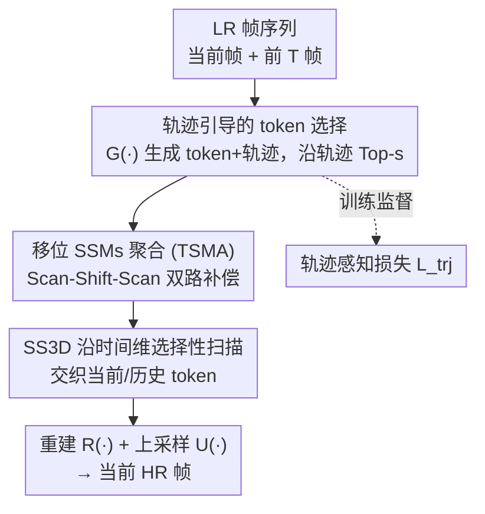

# Trajectory-aware Shifted State Space Models for Online Video Super-Resolution

**会议**: ICLR 2026  
**OpenReview**: [https://openreview.net/forum?id=RygnSGcV49](https://openreview.net/forum?id=RygnSGcV49)  
**代码**: https://github.com/QZ1-boy/TS-Mamba (有)  
**领域**: 图像恢复 / 视频超分辨率  
**关键词**: 在线视频超分、状态空间模型、Mamba、轨迹建模、Hilbert 扫描

## 一句话总结
本文提出 TS-Mamba，把"视频轨迹建模"和"低复杂度 Mamba"结合起来做在线视频超分：先沿轨迹从历史帧里挑出与当前 token 最相似的若干 token，再用一组带"移位"的状态空间模型块在时空维上聚合它们，从而在保持长程时序建模能力的同时，相比现有在线 VSR 方法把计算量（MACs）降低 22.7% 以上，并在多数测试集上取得 SOTA。

## 研究背景与动机
**领域现状**：在线视频超分（online VSR）面向直播、视频会议这类低延迟场景，只能用当前低分辨率帧 $I_{LR}^{t}$ 加上之前的帧来重建当前高分辨率帧，不能看未来帧。为了满足实时性，主流在线方法都用轻量的时序对齐模块——轻量光流网络（CKBG）、可变形注意力金字塔（DAP）、流引导可变形注意力（FDAN）、时序运动传播（TMP）等。

**现有痛点**：这些方法为了省算力，几乎都只用**一帧**相邻的历史帧做对齐，且大多基于 CNN，本质是"短程"时序建模。这限制了重建质量上限——长程信息没用上。而想引入长程对齐（如双向传播、Transformer、扩散模型），复杂度又会陡增，无法满足实时约束。

**核心矛盾**：长程时序建模能力与在线 VSR 的低复杂度/低延迟要求之间存在矛盾。Transformer 类全局建模质量好但太贵；CNN 类轻量但只能看一帧。

**本文目标**：找到一个既能做长程时空聚合、又足够轻量的建模工具，并解决它用在图像上时固有的"空间不连续"问题。

**切入角度**：状态空间模型（SSM / Mamba）有线性复杂度和近似全局的感受野，天然适合"便宜的长程建模"。但 Mamba 把 2D 图像展平成 1D token 序列时会丢失空间连续性，现有 Mamba 视觉方法只是反复堆多种扫描来弥补，既没分析不连续到底在哪、又徒增复杂度。

**核心 idea**：用"轨迹"先在历史帧里精准选出真正相关的 token（而非整帧对齐），再用"扫描—移位—再扫描"的移位 SSM 在 token 级做时空聚合，针对性补偿 Hilbert 扫描的不连续，从而以低复杂度实现长程在线 VSR。这也是首个基于 SSM 的在线 VSR 模型。

## 方法详解

### 整体框架
TS-Mamba 要解决的是"如何便宜地从多帧历史里聚合长程时空信息来重建当前 HR 帧"。整条管线是：把当前帧和前 $T$ 帧的 LR 帧一起送进 token 与轨迹生成模块 $G(\cdot)$，得到当前帧 token $Q=\{q_i^t\}$ 和历史帧 token $V=\{v_i^k\}$，并构造每个 token 随时间的运动轨迹 $\mathcal{T}^t$；然后沿轨迹用余弦相似度从历史帧里挑出 $s$ 个最相似的 token $V_s$；把 $Q$ 和 $V_s$ 一起喂进轨迹感知移位 Mamba 聚合模块（TSMA），用"Scan-Shift-Scan"的移位 SSM 块在时空维上聚合，得到聚合特征 $F_{LR}^t = \mathrm{TSMA}(Q, V_s)$；最后聚合特征过重建网络 $R(\cdot)$，叠加当前帧的双三次上采样 $U(I_{LR}^t)$，得到超分结果 $I_{SR}^t = R(F_{LR}^t) + U(I_{LR}^t)$。训练时额外用轨迹感知损失监督轨迹的准确性。

### 关键设计

**1. 轨迹引导的 token 选择：用运动轨迹替代整帧对齐，只取真正相关的历史 token**

现有在线 VSR 要么整帧对齐（贵），要么只看一帧（短程）。本文换了一个粒度：在 token 级建模。$G(\cdot)$ 由一个卷积层加 $N_1$ 个残差块构成，从每帧抽出 token；同时为每个当前 token $q_i^t$ 构造一条贯穿时间的轨迹 $\tau_i^k = (x_i^k, y_i^k),\ k\in[t-T, t]$，记录它在历史每一帧里的坐标（轨迹由一个轻量光流网络更新）。有了轨迹，就能把"该看历史帧的哪个位置"这件事变成显式可监督的几何对应，而不是让网络盲目去整帧搜索。

选 token 时，沿轨迹计算当前 token 与历史 token 的余弦相似度，取 Top-$s$：

$$\{h_j\}_{j=1}^{s} = \underset{k}{\mathrm{Top\text{-}k}}\ \left\langle \frac{q_{\tau_i^t}}{\|q_{\tau_i^t}\|_2^2}, \frac{v_{\tau_i^k}}{\|v_{\tau_i^k}\|_2^2} \right\rangle,\quad V_s = \{v_{\tau_i^{h_j}}\}_{j=1}^{s}$$

这样长程的 $T$ 帧历史被压成每个位置只保留 $s$ 个最相关 token（实验取 $s=3$），既保住了长程信息，又把要聚合的数据量压到很小——这是它能"长程又便宜"的前提。

**2. 移位 SSMs 块：先分析 Hilbert 扫描在哪不连续，再用"扫描—移位—再扫描"针对性补偿**

Mamba 把 2D 图像按某种扫描路径拉成 1D 序列时，空间上相邻的像素在序列里可能被拉得很远，造成空间连续性丢失。本文不像旧方法那样盲目堆多种扫描，而是先**量化**不连续：定义不连续度 $D_d$，在一个由四个相邻区域组成的局部区块里，若四区按顺序被连续扫到则 $D_d=0$，否则 $D_d$ 等于"没被连续扫到的区域数"，取值范围 $\{0,1,2,3\}$。在 $8\times8$ 网格上把区块分成四个 $4\times4$ 局部窗口后，作者发现 Hilbert 扫描同时存在**窗口内不连续**和**窗口间不连续**（窗口间中心区域间隔最大，$D_d$ 可达 3）。

针对这两类不连续，本文提出"Scan-Shift-Scan"流程：第一次扫描后按某个方向/步长做窗口移位（如向上 1 格 $U(1)$、左上 3 格 $UL(3)$），再做第二次扫描，让第二次扫描刚好把第一次扫描断开的地方接上。一个流程记作 $P(l, Sf(p), j) = Sc_1(l) \to Sf(p) \to Sc_2(j)$，并用消除值 $\delta = \delta_{intra} + \delta_{inter}$ 度量它补偿了多少不连续度（$\delta\in[4,18]$）。作者据此构造两条并行的补偿支路——窗口内补偿支路 IntraWCB 和窗口间补偿支路 InterWCB：例如路径 ① 用 $P(1, U(1), 3) + P(1, UL(3), 3)$，路径 ② 用 $P(2, L(1), 4) + P(2, LU(3), 4)$，两路各含一个标准 SSM 块和两个并行 S-SSM 块，输出拼接后再经卷积和可变形注意力块（DAB）融合。这套"先诊断不连续、再用移位精准补"的做法，是它相比现有 Mamba 视觉方法的关键区别——补得准而不是补得多。

**3. SS3D：沿时间维的 Hilbert 选择性扫描，让当前 token 和历史 token 真正交织**

光选出历史 token 还不够，得让它们在时空维上互通信息。SS3D（spatial Hilbert selective scanning along temporal dimension）把当前 token $\{q_{\tau_i^t}\}$ 和选出的历史 token $\{v_{\tau_i^{h_j}}\}_{j=1}^{s}$ 一起按 Hilbert 路径扫描成 1D 序列，扫描时把历史 token 与当前 token **交织**排列，于是信息能在空间与时间两个维度上交互。逐窗口的选择性扫描既保住了局部空间信息，又逐步捕获全局时间模式——这是 TSMA 真正实现"长程时空聚合"的扫描机制，和上面的移位补偿配合，构成完整的 SSM 聚合块。

**4. 轨迹感知损失：监督轨迹生成，保证 token 选得准**

整个方法的有效性建立在"轨迹选对了相关 token"之上，所以轨迹本身需要被监督。本文用 HR 视频按同样方式生成轨迹 $\mathcal{T}^t_{HR}$，再把它下采样到 LR 尺度作为监督信号：

$$L_{trj} = \left\| \mathcal{T}^t - ((\mathcal{T}^t_{HR})\downarrow_{\hat{s}})/\hat{s} \right\|$$

空间重建用 Charbonnier 损失 $L_{spa} = \sqrt{\|I_{HR}^t - I_{SR}^t\|^2 + \epsilon^2}$，总损失 $L_{total} = L_{spa} + \lambda L_{trj}$（$\lambda=0.1$）。消融显示去掉 $L_{trj}$ 后 PSNR 从 30.73 掉到 30.70，说明它确实在帮轨迹学得更准。

### 损失函数 / 训练策略
训练集为 REDS 与 Vimeo-90K，分别在 REDS4、Vid4、Vimeo-90K-T 上评测，含 BI（双三次）和 BD（高斯模糊后下采样）两种退化，放大倍数 $\hat{s}=4$。$N_1=2$、$N_2=13$，token 尺寸 $4\times4$、窗口 $8\times8$、选取 token 数 $s=3$、时间窗 $T=15$。Adam + Cosine Annealing，HR patch $256\times256$，batch 8，共 600K 次迭代，2 张 RTX 3090。

## 实验关键数据

### 主实验
在三个数据集、两种退化下与五个在线 VSR 方法对比。TS-Mamba 在多数设置取得最优 PSNR/SSIM，同时复杂度显著更低（MACs 仅 112G，是在线方法里最低之一）。复杂度按 $180\times320$ 的 LR 帧统计。

| 数据集 (退化) | 指标 | TS-Mamba | FDAN | KSNet | TMP |
|--------|------|------|------|------|------|
| REDS4 (BI, RGB) | PSNR/SSIM | **30.73 / 0.8727** | 30.71 / 0.8723 | 30.69 / 0.8724 | 30.67 / 0.8710 |
| Vid4 (BI, Y) | PSNR/SSIM | **27.17 / 0.8209** | 27.14 / 0.8206 | 27.14 / 0.8208 | 27.10 / 0.8167 |
| Vimeo-90K-T (BI, Y) | PSNR/SSIM | 37.36 / 0.9482 | 37.36 / 0.9483 | 37.34 / 0.9490 | 37.33 / 0.9481 |
| 复杂度 | MACs(G) / Params(M) | **112 / 3.0** | 146 / 3.9 | 145 / 3.0 | 176 / 3.1 |

相比 TMP，TS-Mamba 的 MACs 降低约 36.3%；相比图 1 中对比的 SOTA，整体 MACs 降低 22.7% 以上。运行时 29ms / 33.5 FPS，是在线方法里第二快（TMP 因用了 CUDA 加速器在 runtime 上更快，但 MACs 更高）。

### 消融实验
在 REDS4（BI）上验证各组件贡献：

| 配置 | PSNR/SSIM | MACs(G) | 说明 |
|------|---------|------|------|
| TS-Mamba (完整) | 30.73 / 0.8727 | 112 | 完整模型 |
| v1.1 w/o Trajectory | 30.45 / 0.8678 | 84 | 去掉 $G(\cdot)$+token 选择，掉 0.28dB（最大） |
| v1.2 w/o $L_{trj}$ | 30.70 / 0.8721 | 112 | 去轨迹损失，轨迹学得不准 |
| v1.3 w/o IntraWCB | 30.58 / 0.8702 | 97 | 去窗口内补偿支路 |
| v1.4 w/o InterWCB | 30.61 / 0.8706 | 97 | 去窗口间补偿支路 |
| v1.5 w/o Intra+InterWCB | 30.52 / 0.8689 | 85 | 两条补偿支路都去 |
| v1.8 w/o 全部移位 | 30.61 / 0.8702 | 111 | 移位操作全去 |

token 数 $s$ 的消融：$s=1\to30.64$、$s=2\to30.68$、$s=3\to30.73$、$s=4\to30.74$（提升饱和但复杂度更高），故取 $s=3$ 折中。

### 关键发现
- **轨迹/token 选择贡献最大**：去掉后掉 0.28dB，远超其他组件，说明"沿轨迹精准选 token"是 TS-Mamba 的核心收益来源。
- **两条补偿支路缺一不可**：单去 IntraWCB 或 InterWCB 各掉约 0.12–0.15dB，两条都去掉掉到 30.52，证明窗口内/窗口间不连续都需要补偿。
- **token 数收益递减**：$s$ 从 3 增到 4，PSNR 几乎不动（30.73→30.74）却要多付 8G MACs，验证了"少量最相关 token 已足够"的设计直觉。
- **失败场景**：当车轮等出现高速旋转时，轨迹生成不准、旋转信息难以重建——这是旋转运动建模本身的难点，其他在线 VSR 方法同样失败。

## 亮点与洞察
- **首个把"轨迹"引入 Mamba、也是首个 SSM 在线 VSR 模型**：把 token 选择从"整帧/单帧对齐"升级为"沿运动轨迹选最相关 token"，长程信息被压成极少量 token，是"长程又便宜"的关键。
- **"先诊断、再补偿"的扫描方法学**：用不连续度 $D_d$ 和消除值 $\delta$ 把 Hilbert 扫描的空间断裂量化出来，再用"Scan-Shift-Scan"针对性补，而不是盲目堆多种扫描——这套思路可迁移到任何基于扫描的 Mamba 视觉模型。
- **可监督的轨迹**：用 HR 轨迹下采样监督 LR 轨迹，把"选 token 准不准"这件事变成显式损失项，思路简单但有效。

## 局限与展望
- **旋转/高动态运动失效**：作者承认在高速旋转场景下轨迹不准、重建退化，这是轨迹建模范式的固有短板。
- **依赖外部光流网络更新轨迹**：轨迹质量受光流网络精度影响，光流不准会连带影响 token 选择。
- **移位组合靠手工搜索**：两条补偿支路用的 $P(\cdot)$ 组合是作者枚举消除值后人工挑的，缺少自动化/可学习的扩展；不同分辨率或场景下是否仍最优有待验证。
- **实时性受实现限制**：TS-Mamba MACs 最低，但 runtime 不及做了 CUDA 加速的 TMP，说明 SSM 块的工程实现还有优化空间。

## 相关工作与启发
- **vs CNN 类在线 VSR（FDAN / KSNet / TMP）**: 它们基于 CNN 做短程（多为单帧）时序对齐，本文用轨迹 + Mamba 做长程 token 级聚合，在更低 MACs 下质量更优。
- **vs Mamba 视觉 SR（VSRM / MamEVSR）**: 它们忽视 Mamba 的局部空间连续性、靠反复多扫描弥补；本文先量化 Hilbert 扫描的不连续，再用移位操作精准补偿，效率更高。
- **vs 双向传播方法（BasicVSR++ / IART / VSRM）**: 那些方法靠未来帧和双向传播拿到更高 PSNR，但需要 future frame、复杂度高（MACs 数千），不满足在线约束；TS-Mamba 在仅用历史帧的在线设定下取得在线 SOTA。

## 评分
- 新颖性: ⭐⭐⭐⭐⭐ 首个 SSM 在线 VSR，把轨迹引入 Mamba 并提出可量化的扫描不连续补偿，角度新。
- 实验充分度: ⭐⭐⭐⭐ 三数据集两退化 + 完整消融 + token 数/失败案例分析，但 PSNR 提升幅度较小（0.02–0.06dB 量级）。
- 写作质量: ⭐⭐⭐⭐ 方法叙述清晰、图示充分；移位流程符号略密集。
- 价值: ⭐⭐⭐⭐ 在线 VSR 实测低 MACs 高质量，扫描补偿方法学对 Mamba 视觉模型有通用启发。

<!-- RELATED:START -->

## 相关论文

- [\[ICLR 2026\] Continuous Space-Time Video Super-Resolution with 3D Fourier Fields](continuous_space-time_video_super-resolution_with_3d_fourier_fields.md)
- [\[AAAI 2026\] MFmamba: A Multi-function Network for Panchromatic Image Resolution Restoration Based on State-Space Model](../../AAAI2026/image_restoration/mfmamba_a_multi-function_network_for_panchromatic_image_resolution_restoration_b.md)
- [\[CVPR 2025\] QMambaBSR: Burst Image Super-Resolution with Query State Space Model](../../CVPR2025/image_restoration/qmambabsr_burst_image_super-resolution_with_query_state_space_model.md)
- [\[ICLR 2026\] Text-Aware Image Restoration with Diffusion Models](text-aware_image_restoration_with_diffusion_models.md)
- [\[CVPR 2025\] Efficient Visual State Space Model for Image Deblurring](../../CVPR2025/image_restoration/efficient_visual_state_space_model_for_image_deblurring.md)

<!-- RELATED:END -->
