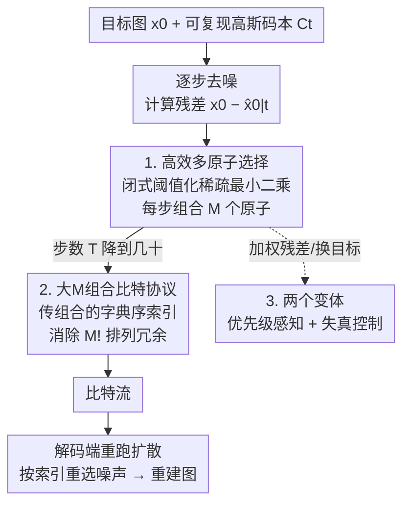

# Turbo-DDCM: Fast and Flexible Zero-Shot Diffusion-Based Image Compression

**会议**: ICLR 2026  
**OpenReview**: [https://openreview.net/forum?id=eIF1QvC94Z](https://openreview.net/forum?id=eIF1QvC94Z)  
**代码**: 见论文项目主页（有）  
**领域**: 扩散模型 / 图像压缩  
**关键词**: 零样本压缩, 扩散模型, DDCM, 稀疏最小二乘, 优先级感知

## 一句话总结
本文把零样本扩散压缩方法 DDCM 的逐步"贪心匹配追踪"换成一个闭式的稀疏最小二乘选择规则，每一步一次性组合上百个噪声原子，从而把扩散步数砍掉 92%，单图往返压缩-解压时间从 65 秒降到 1.8 秒，质量与 SOTA 持平，并顺带支持区域优先和按目标 PSNR 压缩两种灵活变体。

## 研究背景与动机
**领域现状**：图像压缩近年从神经网络方法转向扩散模型，其中"零样本"路线最有吸引力——它直接复用一个预训练扩散骨干，不为压缩单独训练或微调，同一个模型还能顺便做生成、修复、编辑，骨干一升级所有任务同时受益。代表方法 DDCM（Denoising Diffusion Codebook Models）把标准 DDPM 反扩散里的"随机采样高斯噪声"改成"从可复现的码本里挑一个最匹配目标图的噪声原子"，于是只要存下每步选中的原子索引就能重建图像，机制极其简洁。

**现有痛点**：零样本扩散压缩"慢得离谱"。DDCM 要几百步去噪才能达到够用的重建质量，单图往返要 65 秒；PSC 要几分钟；即便是上了定制 CUDA kernel 的 DiffC 也要约 10 秒，且依赖硬件特化、不同图像/不同码率下码率和耗时都漂得厉害。相比之下训练型方法一次前向就出结果，零样本路线在实用性上完全不占优。

**核心矛盾**：DDCM 想提高码率有两条路，但都被卡死——加大去噪步数 $T$ 会成倍增加昂贵的去噪器调用；加大码本 $K$ 只能让码率对数增长却让搜索急剧变慢。作者提出过用匹配追踪（MP）在每步组合 $M$ 个原子来拓宽码率，但 MP 是贪心迭代+穷举搜索，一次就要 0.1 秒还要乘以 $T$ 步，且因为只能取非负凸组合系数，单独增大 $M$ 收益有限、必须同时增大系数比特 $C$，而运行时随 $C$ 指数膨胀。本质矛盾是：**每步想组合更多原子来减少步数，但现有组合方式（MP）的代价随原子数爆炸**。

**本文目标**：找到一种"每步能廉价地组合任意多个噪声原子"的选择规则，让少数几步强估计替代几百步弱估计，同时配一套不浪费比特的编码协议，并把方法扩展到区域优先和失真可控两种实用场景。

**切入角度**：作者抓住一个高维几何事实——**高斯随机码本的原子在高维空间里近似正交**。在近似正交假设下，"用 $M$ 个原子线性逼近残差"这个稀疏最小二乘问题不需要迭代搜索，存在闭式解。

**核心 idea**：用闭式的阈值化稀疏最小二乘（thresholding）替代 DDCM 的贪心匹配追踪，一次性选出并组合上百个原子，使每步残差估计大幅增强、扩散步数锐减；再配一套消除排列冗余的组合编码协议。

## 方法详解

### 整体框架
Turbo-DDCM 站在 DDCM 的肩膀上：DDCM 的反扩散每步把随机高斯噪声替换成"从可复现码本 $C_t=[z_t^{(1)},\dots,z_t^{(K)}]$ 里选一个原子"，压缩时选与残差 $x_0-\hat x_{0|t}$ 内积最大的那个，存下索引序列即可重建。Turbo-DDCM 改两处：**第一**，把"每步选 1 个原子"升级为"每步闭式组合 $M$ 个原子"，用阈值化稀疏最小二乘求解，代价几乎与 $M$ 无关，于是每步残差估计强很多，总步数能从几百步降到几十步（$T=30$）；**第二**，针对大 $M$ 组合设计了一套去除排列冗余的比特协议，把这些索引高效编码成比特流。解码端则跑同一套生成式扩散，按解码出的索引重新选码本噪声、复现重建图。两个灵活变体在选择规则上加权或换目标，分别支持区域优先与按 PSNR 压缩。

### 关键设计

**1. 高效多原子选择：用闭式阈值化替代贪心匹配追踪**

这一步直击"每步组合更多原子代价爆炸"的核心矛盾。作者把每一步的噪声构造写成一个带稀疏与量化约束的最小二乘：用恰好 $M$ 个非零量化系数的原子线性组合去逼近残差，$s_t^*=\arg\min_{s_t}\|C_t s_t-(x_0-\hat x_{0|t})\|_2^2$，约束 $\|s_t\|_0=M$ 且系数取自量化集 $V\cup\{0\}$。关键洞察是高斯码本在高维近似正交，于是稀疏最小二乘有闭式解（thresholding 算法）：先算每个原子与残差的归一化内积 $(u_t)_i=\langle z_t^{(i)},x_0-\hat x_{0|t}\rangle/\|z_t^{(i)}\|_2$，取绝对值最大的 $M$ 个，系数就是对应内积。作者进一步把量化约束并进来，并针对论文统一采用的 $V=[-1,+1]$ 简化为：选中原子的系数直接取内积符号 $(s_t^*)_i=\mathrm{sign}((u_t)_i)$，其余置零。

这套规则与 DDCM 的 MP 有四点本质不同，正是它的威力来源：**(1) 构造效率**——闭式 TopM 选取，比 MP 的迭代穷举快几个数量级；**(2) 所需步数**——运行时几乎不随 $M$ 增长，于是 $M$ 可放大到上百，每步残差估计更强，扩散步数砍掉 92%；**(3) 量化取值**——MP 因依赖凸组合只能取非负系数，本文允许正负系数，等于让组合方向能指向相反方向，表示能力翻倍，更好逼近残差；**(4) 超参**——只需调 $M$ 单个超参就能细粒度控码率且运行时稳定，而 DDCM 单调 $M$ 没用、必须连带调 $C/K/T$ 导致码率间耗时剧烈波动。此外由于 $T$ 大幅减少，作者在最后几步用 DDIM 采样替换合成噪声 $z_t^*$ 来提升低码率下的感知质量，DDIM 步数 $N$ 随码率启发式递减。

**2. 大 M 组合的高效比特协议：消除排列冗余逼近信息下界**

当 $M$ 很大时，沿用 DDCM 的比特协议会严重浪费。DDCM 每步用 $\lceil\log_2 K\rceil M$ 比特并**保留原子被选中的顺序**（它的解码噪声构造依赖顺序）。但在本文的阈值化方案里，原子顺序毫无语义、只有身份重要，于是朴素地编码 $M$ 个索引会产生 $M!$ 种等价表示，整段序列就有 $(M!)^{T-1}$ 个完全等价的压缩结果——哪怕 $M=5,T=30$ 这种保守参数也约有 $2^{200}$ 个等价表示，纯属浪费。

作者据此重新计费：每步真正要传的是"从 $K$ 个原子里无序无重复选 $M$ 个的组合"加上 $M$ 个量化系数，可能数为 $\binom{K}{M}\cdot(2^C)^M$，对应下界 $\lceil\log_2\binom{K}{M}\rceil+MC$ 比特。他们提出一个达到该下界的协议：传**选中组合在 $\{1,\dots,\binom{K}{M}\}$ 里的字典序索引**，再按规范顺序传 $M$ 个量化系数——既消除了阶乘冗余，又传了完全等价的信息。最终码率 $\mathrm{BPP}=(T-N-1)(\lceil\log_2\binom{K}{M}\rceil+MC)/\text{像素数}$，相比 DDCM 协议为典型配置省约 40% 比特。

**3. 两个灵活变体：把同一选择规则改成区域优先与失真可控**

作者展示这套选择规则的可塑性。**优先级感知（priority-aware）变体**面向医学影像、视频会议等"重点区域要清晰"的场景：引入一个隐空间优先级掩码 $w$（由像素级优先图下采样得到），把最小二乘目标改成对残差加权 $\|C_t s_t-w\odot(x_0-\hat x_{0|t})\|_2^2$，于是原子选择会优先压低高权重像素的误差，把比特倾斜给重点区域。妙在 $w$ **不需要传给解码端**，编码协议和 BPP 都不变，运行时几乎无影响，且这套加权思路能自然推广到 DDCM 和 DiffC。**失真控制变体**则针对"固定码率下不同图像失真波动很大"的问题，改为针对每张图给定一个目标 PSNR 来压缩（而非固定 BPP），大幅压缩失真的图间方差。这两个变体据作者所知是零样本扩散压缩里首次具备的能力。

## 实验关键数据

### 主实验
在 Kodak24 与 DIV2K（中心裁剪到 $512\times512$）上评测，骨干统一用 SD 2.1 Base，Turbo-DDCM 固定 $T=30,K=16384,C=1$，靠 $M\in[45,300]$ 调码率；失真用 PSNR/LPIPS，感知用 FID，耗时为 A40 上往返压缩-解压的 process time。

| 对比维度 | Turbo-DDCM | DDCM | DiffC (CUDA) | PSC |
|----------|-----------|------|--------------|-----|
| 往返耗时 | **1.8 秒**（最快） | 65 秒 | ~10 秒 | >300 秒 |
| 相对加速 | — | >34× (高码率) | 3×~近 10× | 极慢 |
| 失真/感知 | 持平或更好 | 持平 | 低码率感知略优 | 全面落后 |
| 硬件特化 | 不需要 | 不需要 | 需定制 kernel | 不需要 |

在率-失真-感知平面上，Turbo-DDCM 超过 PSC，且对 DDCM 达到相等或更好的失真与感知质量；相比非神经/微调/训练型方法，除了为每个码率单独特化的 StableCodec 外，它在该平面上优于所有先前方法。低码率下即便对比 PerCo (SD)、DiffEIC 这类感知导向方法也有更好失真；高码率下因 SD 2.1 编解码器自身的失真上界（latent 空间压缩天然受限）在失真上略逊。

### 速度与消融分析
| 配置 / 维度 | 效果 | 说明 |
|-------------|------|------|
| 闭式选择替代 MP | 步数 −92% | 每步组合上百原子，强估计替代弱估计 |
| 允许正负系数 | 表示能力翻倍 | MP 只能非负凸组合 |
| 新比特协议 | BPP −~40% | 消除 $M!$ 排列冗余、逼近信息下界 |
| 仅调 $M$ 控码率 | 跨码率耗时近恒定 | DDCM 必须连调 $C/K/T$ 致耗时漂移 |

### 关键发现
- 速度提升的根本来源是"每步更强的残差估计"——闭式多原子选择让少数几十步替代几百步，这是 92% 步数削减的真正杠杆，而非单纯工程加速。
- 运行时优势在高码率尤为明显（对 DDCM >34×、对带 CUDA kernel 的 DiffC 也接近一个数量级），且 Turbo-DDCM 跨码率耗时近乎恒定、同一目标码率下不同图像码率恒定，这是其它零样本方法做不到的实用性优势。
- 高码率失真受限于 SD 2.1 编解码器的固有失真上界，是 latent 扩散压缩的共性天花板，非本方法独有缺陷。

## 亮点与洞察
- **高维近似正交把迭代搜索变成闭式解**：这是全文最漂亮的一招——MP 之所以慢是因为原子相关需要贪心去耦，而高维高斯码本近似正交后，稀疏最小二乘退化成"取 TopM 内积 + 取符号"，把每步代价从 $O(\text{穷举})$ 降到一次内积排序。
- **顺序无关 → 用组合的字典序索引计费**：识别出"阈值化选原子时顺序无意义"这一冗余，并精确算到 $\binom{K}{M}$ 信息下界再用字典序枚举编码，是把信息论计费落到实处的范例，可迁移到任何"无序集合选择"的编码场景。
- **同一选择规则的两次轻量改写就长出两个实用能力**：优先级感知只是给残差加权、失真控制只是换目标量，且优先级掩码无需传输不增码率——说明这套框架的接口很"干净"，扩展成本极低。

## 局限与展望
- 作者承认：训练型方法已能一次前向达到相近重建质量，本文虽快但仍是多步；理想的"一步零样本"方法能进一步提速并保留零样本灵活性。
- 部分非零样本方法在率-失真-感知权衡上仍优于本方法，说明零样本路线在质量上限上还有差距。
- 高码率失真受 SD 2.1 编解码器上界限制——这是 latent 扩散压缩的结构性瓶颈，换更强骨干或在像素空间操作才可能突破，但会牺牲零样本的通用性。
- 作者指出 DDCM 类压缩缺一套完整理论，近似正交假设在不同码本规模/维度下的影响边界仍待系统刻画。

## 相关工作与启发
- **vs DDCM**：同一可复现码本+残差匹配的思路，但 DDCM 每步选 1 原子、靠 MP 才能升码率而代价爆炸；本文用闭式阈值化每步组合上百原子、允许正负系数、并重做比特协议，质量持平而快一个数量级以上。
- **vs DiffC**：DiffC 走反向信道编码（RCC）路线并靠定制 CUDA kernel 提速到约 10 秒，但依赖硬件特化、码率/耗时随图像和码率大幅漂移；Turbo-DDCM 无需特制硬件就更快，且码率与耗时跨图像/跨码率都稳定。
- **vs ROI/优先级压缩（如 Xu et al. 2025）**：已有 ROI 压缩多在训练型框架里实现；本文首次把按像素优先级的区域优先能力引入零样本扩散压缩，且优先级掩码无需传输、不增码率。

## 评分
- 新颖性: ⭐⭐⭐⭐ 用高维近似正交把贪心 MP 换成闭式稀疏最小二乘，配信息下界编码协议，切入点扎实漂亮。
- 实验充分度: ⭐⭐⭐⭐ 两数据集、多类基线、率-失真-感知-耗时全维度对比，并有两个变体的定性验证。
- 写作质量: ⭐⭐⭐⭐ 动机—矛盾—方法逻辑清晰，四点对比 MP 讲得透彻。
- 价值: ⭐⭐⭐⭐ 把零样本扩散压缩耗时压到 1.8 秒并保持竞争力，显著推进了该路线的实用性。

<!-- RELATED:START -->

## 相关论文

- [\[ICLR 2026\] KernelFusion: Zero-Shot Blind Super-Resolution via Patch Diffusion](kernelfusion_zero-shot_blind_super-resolution_via_patch_diffusion.md)
- [\[CVPR 2026\] MR. Illuminate: Zero-Shot Low-Light Image Enhancement with Diffusion Prior](../../CVPR2026/image_restoration/mr_illuminate_zero-shot_low-light_image_enhancement_with_diffusion_prior.md)
- [\[ICLR 2026\] Improved Adversarial Diffusion Compression for Real-World Video Super-Resolution](improved_adversarial_diffusion_compression_for_real-world_video_super-resolution.md)
- [\[CVPR 2026\] Zero-Shot Image Denoising via Hybrid Prior-Guided Pseudo Sample Generation](../../CVPR2026/image_restoration/zero-shot_image_denoising_via_hybrid_prior-guided_pseudo_sample_generation.md)
- [\[ICLR 2026\] Energy-oriented Diffusion Bridge for Image Restoration with Foundational Diffusion Models](energy-oriented_diffusion_bridge_for_image_restoration_with_foundational_diffusi.md)

<!-- RELATED:END -->
