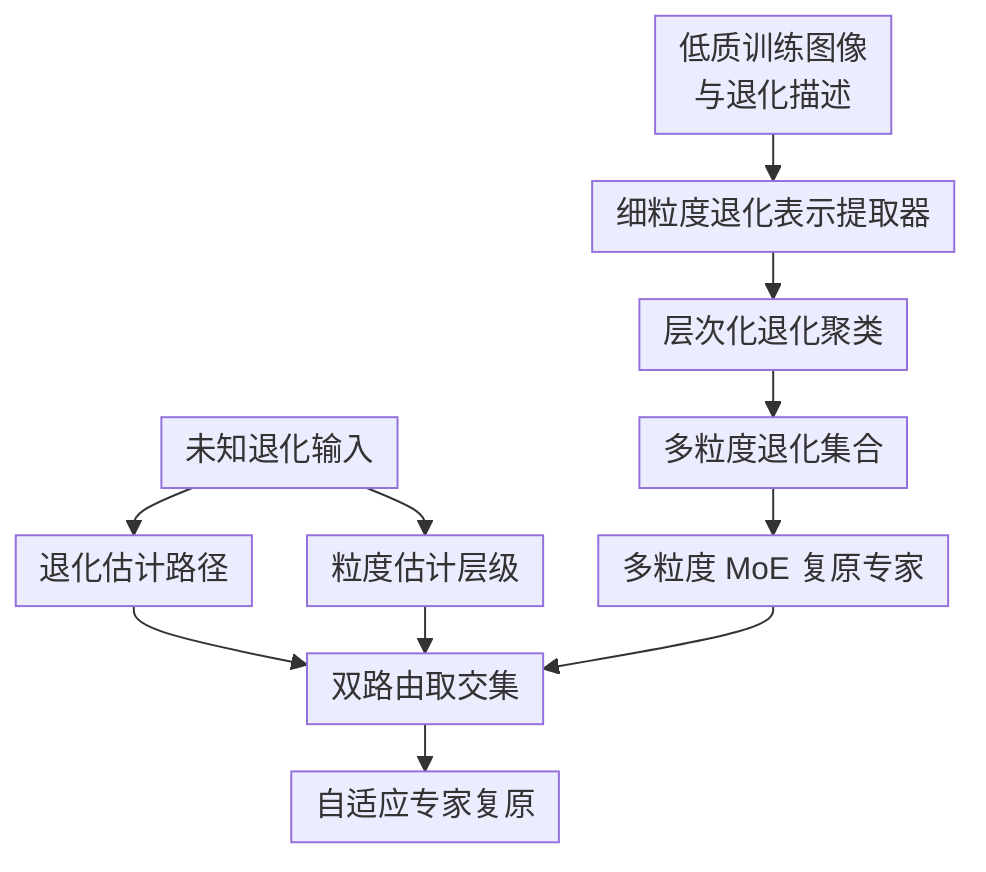

# UniRestorer: Universal Image Restoration via Adaptively Estimating Image Degradation at Proper Granularity

**会议**: ICLR2026  
**OpenReview**: [https://openreview.net/forum?id=nDrZow7fCF](https://openreview.net/forum?id=nDrZow7fCF)  
**代码**: https://github.com/mrluin/UniRestorer  
**领域**: 图像恢复 / 通用图像复原  
**关键词**: 通用图像复原、多退化建模、多粒度退化表示、混合专家、鲁棒路由  

## 一句话总结
UniRestorer 把图像退化空间层次化成多粒度退化组，并训练与之对应的 MoE 复原专家，再用退化估计和粒度估计共同路由，使全能图像复原模型既能利用细粒度退化先验，又不至于被错误退化估计拖垮。

## 研究背景与动机
**领域现状**：图像恢复长期按任务拆分：去雨、去雾、去噪、去模糊、低光增强、去雪、压缩伪影去除等任务各自训练专门模型。近年的 all-in-one image restoration 希望用一个统一模型处理多种低质输入，常见路线包括直接把所有任务混在一起训练共享骨干、给不同退化加入 prompt / adapter，或者用 MoE、LoRA、滤波器等专家模块做条件化处理。

**现有痛点**：完全退化无关的共享模型虽然简单，但很难学到不同退化的专门处理方式，去噪和去模糊这类任务甚至会互相冲突。退化感知方法看似更合理，因为它能先估计输入是什么退化，再激活对应 prompt 或专家；问题是 all-in-one 场景里的退化空间太大，尤其混合退化和退化强度连续变化时，退化估计本身不可避免会错。一旦路由把大雪图像送进轻雪专家，或者把低光+雨图像送进单一雨专家，专家越专门，错误路由造成的损失反而越大。

**核心矛盾**：通用复原想要两件彼此拉扯的能力：一方面要足够细地识别退化，才能利用具体退化先验、接近单任务模型；另一方面又要在估计不确定时保持稳健，不能把输入硬塞给过窄的专家。已有方法大多只在单一粒度上做退化表示和路由，因此只能在“粗专家稳但不够准”和“细专家准但怕错路由”之间二选一。

**本文目标**：作者把问题拆成三个子问题：先学一个能区分退化类型和退化强度的细粒度退化表示；再把训练集中的退化表示组织成由粗到细的层次化退化集合，并为每个退化组训练专家；最后在测试时同时估计“像哪类退化”和“应该用多细的粒度”，从而选择更合适的专家。

**切入角度**：论文的观察很直白但关键：退化估计不是永远可靠的标量分类结果，而应当带有不确定性。当输入退化清晰、落在训练分布内时，模型可以大胆使用细粒度专家；当输入退化混合、强度偏离训练分布或估计模糊时，模型应退回到更粗粒度的专家，用泛化性换稳定性。

**核心 idea**：用“多粒度退化表示 + 多粒度 MoE 专家 + 退化/粒度双路由”替代单一退化路由，让通用图像复原模型按当前退化估计的可靠程度自适应选择专家。

## 方法详解

### 整体框架
UniRestorer 的整体流程可以分成训练前的退化空间构建、专家训练、测试时双路由复原三段。训练时，作者先用细粒度退化文本监督训练一个退化表示提取器，再把所有低质训练图像映射到退化表示空间并做层次聚类，得到从粗到细的退化组；随后每个退化组对应训练一个复原专家。推理时，对未知退化图像同时估计最可能的细粒度退化路径和合适粒度层级，两者取交集后激活对应专家输出复原图像。

图里的贡献节点和关键设计是一一对应的：细粒度退化表示提取器负责让退化空间可分，层次化退化聚类和多粒度 MoE 复原专家把“粗稳细准”的能力显式建出来，退化估计路径与粒度估计层级共同决定最终专家，从而缓解错误路由。

### 关键设计
**1. 细粒度退化表示提取器：先让模型看见退化强度，而不只是退化类型**

很多 all-in-one 方法把退化当成“去雨 / 去雾 / 去噪”这样的粗标签，但真实复原难点经常藏在强度和组合里：小噪声、中噪声、大噪声需要的处理力度不同，轻雪和大雪也不是同一个问题。UniRestorer 以 DA-CLIP 为基础训练退化表示提取器，借助 CLIP/DA-CLIP 的图文对齐能力，把低质图像映射成退化表示 $e = D(X)$。关键变化是监督文本不只写“noise”或“snow”，而是细化成 small / medium / large noise、normal / thick haze、small / large blur 等强度描述，再结合 BLIP 为干净图像生成的内容 caption，让表示既保留图像内容，又对退化类型和退化程度敏感。

这个设计解决的是后续聚类的根基问题：如果特征空间里轻噪和重噪混在一起，再复杂的专家路由也只能学到模糊边界。论文附录里用 T-SNE 和退化分类结果说明，直接 resize 到 $224 \times 224$ 会破坏噪声这类细粒度退化信息，因此作者在训练退化提取器时采用裁剪高分辨率图像到 $224 \times 224$ patch 后再加退化的方式，尽量避免下采样把退化本身抹掉。

**2. 层次化退化聚类与多粒度专家：把“粗泛化”和“细专精”同时放进模型**

得到所有训练图像的退化表示后，UniRestorer 不直接训练一个 flat 的专家集合，而是从粗到细做层次聚类。最粗层可以看成覆盖全部退化空间的根节点；下一层把退化空间分成若干较大的 DR group；最细层再把这些组拆成更具体的退化簇。形式上，作者在某一层对表示集合做 K-means，得到聚类中心 $\{u_{1,i}\}$，再按 $\arg\min_u \|e_j-u\|_2^2$ 把样本分配给最近中心；对新形成的组继续递归聚类，最终得到多粒度退化集合。

每个退化组都对应一个复原专家 $F_{i,j}$，其中 $i$ 表示粒度层级，$j$ 表示该层中的组编号。粗粒度专家见过更宽的退化范围，适合估计不确定或分布外输入；细粒度专家训练在更一致的退化子集上，适合恢复明确退化下的细节。完整版本中专家可以是 full-parameter restoration network，论文主要采用 Restormer，并在低光退化主导的簇中使用更适合低光增强的 RetinexFormer；为了降低参数冗余，作者还提供 LoRA 版本，以最粗粒度专家作为 base model，其他细粒度专家只学习 rank 8 的 LoRA 权重。

**3. 退化估计 + 粒度估计双路由：估计不准时主动退回粗专家**

单一退化路由默认“估计出的类别就是可靠答案”，而 UniRestorer 明确把可靠性也纳入路由。模型在退化提取器 $D$ 之上训练两个分支：$H_d$ 产生细粒度退化估计向量 $e_d$，用于判断输入最像哪条叶子路径；$H_g$ 产生粒度估计向量 $e_g$，用于判断应该在这条路径上使用多粗或多细的专家。退化路由 $G_d$ 先选出从根到某个叶子的专家路径 $P(k)$，粒度路由 $G_g$ 再选出第 $t$ 层的所有专家，最终专家由二者交集确定。

直觉上，如果输入像“强雪”且退化表示离某个细粒度中心很近，粒度路由会倾向选择细层专家，让模型充分利用专门知识；如果输入是混合退化或强度超出训练分布，退化估计离中心较远，粒度估计会把它送到更粗层专家，避免细专家因为过窄而误处理。这个机制把错误路由从“选错具体专家”降级成“在更宽的退化组里保守处理”，因此能在 in-distribution 和 out-of-distribution 两端同时保持较好表现。

**4. 不确定性式训练目标：用距离中心的误差学习粒度可靠性**

粒度估计不是凭空加一个分类头，而是通过类似数据不确定性学习的目标把 $e_d$ 和 $e_g$ 绑在一起。主文给出的损失为 $\mathcal{L}_{dg}=\mathbb{E}[\frac{1}{2e_g}\|u-e_d\|^2 + \frac{1}{2}\log e_g]$，其中 $u$ 是最细粒度聚类中心。若当前退化估计 $e_d$ 与对应中心距离小，模型可以学习较小的 $e_g$，表示估计有信心；若距离大，较大的 $e_g$ 能缓解第一项惩罚，同时表示当前样本应被视为不确定。

训练总目标为 $\mathcal{L}_{total}=\ell_1+\alpha\mathcal{L}_{dg}+\beta\mathcal{L}_{aux}$。其中 $\ell_1=\|\hat{Y}-Y\|_1$ 用来训练复原质量，$\mathcal{L}_{aux}$ 是 MoE 常用的 load balancing loss，避免路由坍缩到少数专家；论文中设置 $\alpha=0.1$、$\beta=0.01$。附录进一步从高斯分布 $\mathcal{N}(\mu_i,\sigma_i^2I)$ 的负对数似然解释该损失：$\mu_i$ 对应退化估计，$\sigma_i^2$ 对应估计不确定性，因此粒度路由可以被看作一种面向退化表示可靠性的自适应专家选择。

### 损失函数 / 训练策略
训练流程是分阶段的。第一阶段训练细粒度退化表示提取器，作者合成多种退化并按强度构造文本 caption，例如雨强度 $[0,50)$、$[50,100)$、$[100,150]$ 分别对应 small / medium / large rain，噪声 $\sigma$ 的不同区间对应 small / medium / large noise。第二阶段固定退化表示空间，对训练图像做层次聚类，记录每个 DR group 中的训练样本。第三阶段为每个退化组训练复原专家；专家训练使用 AdamW、batch size 8、patch size 128、初始学习率 $3\times10^{-4}$ 和 CosineAnnealing 调度。第四阶段冻结专家，只训练退化估计、粒度估计和路由器；路由训练使用 Adam、batch size 8、patch size 256、固定学习率 $10^{-3}$。

论文还提供 auto mode 与 instruction mode。auto mode 完全由输入图像完成“提取-识别-路由-复原”；instruction mode 允许用户给出退化类型作为指令，用 mask 剪枝不相关退化组，再在剩余退化空间里做退化/粒度双路由。后者用于和单任务模型公平比较，因为单任务模型通常默认知道当前任务类型。

## 实验关键数据

### 主实验
论文在单一退化 all-in-one、混合退化 CDD-11、真实世界退化、未见退化、单任务模型对比和效率开销上都做了实验。主结论非常集中：UniRestorer 相比已有 all-in-one 方法提升很大，并且在 instruction mode 下已经接近甚至超过一些单任务模型。

| 设置 | 数据 / 指标 | UniRestorer | 最强对比方法 | 提升或结论 |
|------|-------------|-------------|--------------|------------|
| 单一退化 7T all-in-one | 平均 PSNR | 32.77 | MoCEIR-5T 30.58 | +2.19 dB，且覆盖 7 个任务 |
| 单一退化 5T all-in-one | 平均 PSNR | 33.38 | MoCEIR-5T 30.58 | +2.80 dB |
| 单一退化 3T all-in-one | 平均 PSNR | 36.71 | MoCEIR-3T 32.73 | +3.98 dB |
| 混合退化 CDD-11 | 平均 PSNR | 30.90 | MoCE-IR-S 29.05 | +1.85 dB |
| 真实世界泛化 | Derain / Low-light / Desnow 平均 | 29.70 | Restormer 27.26 | +2.44 dB |
| 未见退化 | Raindrop / UDC / Underwater | 24.91 / 29.64 / 18.07 | 各任务最强基线低于本文 | 三类未见退化均领先 |

单任务对比中，UniRestorer 采用 instruction mode。它在 Rain100L 去雨达到 41.68 dB，高于 Restormer 的 39.60 dB；在 SOTS 去雾达到 37.45 dB，高于 Restormer 的 33.18 dB；在 LOLv1 低光增强达到 27.25 dB，高于 NAFNet 的 23.75 dB。作者的解释是，所谓“单任务”内部也存在退化强度差异，例如 Snow100K 中小雪、中雪、大雪并不相同，而 UniRestorer 的细粒度专家能比单任务模型更精确地处理这些子分布。

| 单任务设置 | 指标 | UniRestorer† | Restormer | NAFNet | 观察 |
|------------|------|--------------|-----------|--------|------|
| Derain / Rain100L | PSNR | 41.68 | 39.60 | 38.36 | 细粒度去雨专家明显占优 |
| Denoise / BSD68 σ=15 | PSNR | 35.00 | 34.92 | 34.80 | 与强单任务骨干相当 |
| Desnow / Snow100K-L | PSNR | 31.14 | 30.86 | 29.50 | 对不同雪强度划分有效 |
| CAR / LIVE1 q=10 | PSNR | 27.94 | 27.89 | 27.95 | 压缩伪影上基本持平 |
| Lowlight / LOLv1 | PSNR | 27.25 | 23.66 | 23.75 | 低光簇使用 RetinexFormer 专家很关键 |
| Deblur / GoPro | PSNR | 33.71 | 32.92 | 33.69 | 与最佳单任务基线接近或略高 |
| Dehaze / SOTS | PSNR | 37.45 | 33.18 | 22.70 | 去雾提升最显著 |

### 消融实验
消融实验围绕两个问题展开：退化组要多细，以及多粒度路由是否真的有用。只用单一粒度时，in-distribution 性能随 DR group 从 1 增加到 8 基本上升，但 out-of-distribution 在过细时不稳定；加入多个粒度后，模型能同时保留细粒度性能和粗粒度泛化。

| 路由 | 粒度层数 | DR 组数 | In-dist. PSNR | Out-dist. PSNR | 说明 |
|------|----------|---------|---------------|----------------|------|
| $G_d$ | 1 | {1} | 22.06 | 17.23 | 单共享专家，泛化和专精都弱 |
| $G_d$ | 1 | {4} | 23.75 | 18.49 | 细分退化后明显提升 |
| $G_d$ | 1 | {8} | 24.22 | 18.35 | in-dist. 更好，但 out-dist. 不再提升 |
| $G_d, G_g$ | 2 | {1, 8} | 24.27 | 18.86 | 粗细结合改善泛化 |
| $G_d, G_g$ | 3 | {1, 4, 8} | 24.46 | 19.45 | 性能、训练成本和学习难度的折中 |
| $G_d, G_g$ | 4 | {1, 4, 8, 16} | 24.41 | 19.47 | out-dist. 略高，但复杂度增加 |

损失函数消融进一步说明，$\mathcal{L}_{dg}$ 和 load balancing 都不是装饰。只用 $\ell_1$ 时 in-dist. / out-dist. 为 24.14 / 18.37；加入 $\mathcal{L}_{dg}$ 后提升到 24.35 / 18.76；再加入 $\mathcal{L}_{load}$ 后达到 24.46 / 19.45。也就是说，本文最大的收益不是简单多放几个专家，而是让路由知道“什么时候该信细粒度估计，什么时候该保守”。

### 关键发现
- 细粒度退化表示是整个方法的前提。VGG、ESRGAN、DA-CLIP 等通用或粗粒度特征都不如本文训练的 DR extractor；在扩展去雨实验中，Ours 在 Rain200H / Rain200L / Test1200 / Test2800 上都达到最高 PSNR。
- 多粒度比单粒度更重要。只追求更细的 DR group 会让 in-dist. 提升但不保证 out-dist.；加入粒度估计后，模型在退化偏离训练分布时会自动更多选择粗层专家。
- LoRA 版本虽然参数更少，但仍显著优于已有 all-in-one 方法。UniRestorer-LoRA 在 7T 平均达到 31.81 dB，高于 MoCEIR-5T 的 30.58 dB，说明方法贡献不只是堆 full-parameter 专家。
- 开销方面，完整模型总参数 627M、推理 FLOPs 1155.8G、延迟 0.484s；由于 MoE 稀疏激活，它的推理开销只比 Restormer 略高，但训练参数和训练成本明显更大。

## 亮点与洞察
- **把错误路由从类别问题改写成粒度问题**：很多退化感知复原方法的脆弱点是“分类错了就全错”。本文不强行要求模型永远精确识别退化，而是允许模型在不确定时选择更粗粒度专家，这个思路比单纯提升退化分类准确率更实际。
- **层次化退化空间比 flat MoE 更贴合低层视觉**：图像退化本来就是连续、有强度、有组合的空间，不像高层类别那样天然离散。用层次聚类把大退化组逐层拆细，能同时表达“这是雪”和“这是大雪”，也能在混合退化里找到相近子空间。
- **细粒度 caption 是低成本但很有效的监督信号**：作者没有依赖昂贵人工标注，而是根据合成退化参数把文本描述细化成小/中/大噪声、小/大模糊等，再和 DA-CLIP 对齐。这给其他低层视觉任务一个启发：视觉语言模型不只可做语义理解，也能通过更精细的文本标签学习退化强度。
- **通用模型接近单任务模型的关键不只是规模**：论文还比较了 scaling-up 的 Restormer、PromptIR、MoCE-IR，即便把训练参数扩到约 200M，它们仍落后于 UniRestorer-LoRA。这说明低层视觉里的“扩展”更像是扩展退化空间覆盖与专家结构，而不只是加宽骨干网络。
- **instruction mode 提供了实际部署接口**：当用户或系统已知当前退化类型时，可以把这个信息作为 mask 剪枝退化空间，再进行双路由。这个混合用法比纯自动识别更可靠，也适合实际图像编辑/增强工具中的半自动工作流。

## 局限与展望
- 训练成本和工程复杂度较高。完整版本要先训练退化提取器、做层次聚类、分别训练多个 full-parameter 专家、再训练路由器，论文也承认联合训练专家和路由容易不稳定，顺序训练更稳但耗时。
- 数据规模仍是瓶颈。作者指出训练数据主要来自公开数据集，许多低层视觉数据集规模很小，例如 Rain100L 训练集只有 200 对，这会限制大规模通用复原模型的上限。
- 真实退化空间还没有完全覆盖。实验包含真实世界数据集和未见退化，但训练退化空间仍大量依赖合成管线和公开 benchmark；真实照片中的传感器噪声、ISP、运动、压缩和天气退化往往更复杂。
- 聚类和专家数量仍带有经验选择。主文采用单退化 {1, 7, 19}、混合退化 {1, 4, 8}，附录讨论了 adaptive clustering 能进一步提升 CDD-11 LoRA 版本平均 PSNR，但这也说明退化树结构本身仍有调参空间。
- 低光等特殊任务需要换专家骨干。论文在低光主导簇中使用 RetinexFormer，而非全用 Restormer，这提升了性能，但也让“通用框架”依赖一定的任务先验和工程判断。

## 相关工作与启发
- **vs PromptIR / InstructIR**: PromptIR 和 InstructIR 通过 prompt 或 instruction 调制共享骨干，优势是结构轻、部署简单；UniRestorer 则显式训练多粒度专家，牺牲训练复杂度换来更强的退化专门性和错误路由鲁棒性。
- **vs AirNet / DA-CLIP 系列退化表示方法**: AirNet 和 DA-CLIP 证明退化表示能帮助通用复原，但通常仍偏向单层退化嵌入。UniRestorer 的改进在于让退化表示进入层次聚类和 MoE 路由，使表示不只是 prompt，而是专家组织结构的依据。
- **vs GRIDS / RestoreAgent**: GRIDS 和 RestoreAgent 也把退化空间划分成子空间并训练专家，但它们更多依赖单一粒度的退化估计。UniRestorer 的关键差异是显式建出粗细多层退化集合，并用粒度估计在这些层之间选择。
- **vs MoCE-IR / LoRA-IR**: MoCE-IR 等专家方法强调不同复杂度或不同任务专家，LoRA-IR 强调参数高效专家。UniRestorer-LoRA 说明多粒度退化树也能和 LoRA 结合，在控制参数冗余的同时保留主要收益。
- **对后续工作的启发**: 这个框架可以迁移到视频复原、真实世界超分、医学图像增强等退化连续变化明显的任务。一个自然延伸是把层次聚类从离线 K-means 推进到可增量更新的退化树，让模型随着真实用户数据不断扩展新的退化分支。

## 评分
- 新颖性: ⭐⭐⭐⭐☆ 多粒度退化集合与粒度路由的组合很有辨识度，单个组件并非全新，但系统化整合到 all-in-one image restoration 很有效。
- 实验充分度: ⭐⭐⭐⭐⭐ 覆盖单退化、混合退化、真实世界、未见退化、单任务模型、效率和多组消融，证据链比较完整。
- 写作质量: ⭐⭐⭐⭐☆ 主线清楚，图 1 和图 3 能很好解释动机；但部分公式排版和附录表述有小瑕疵，例如个别拼写与编号问题。
- 价值: ⭐⭐⭐⭐⭐ 对通用图像复原很有参考价值，尤其是“估计不确定时退回粗专家”的思想，适合被后续低层视觉通用模型复用。

<!-- RELATED:START -->

## 相关论文

- [\[ICCV 2025\] Towards a Universal Image Degradation Model via Content-Degradation Disentanglement](../../ICCV2025/image_restoration/towards_a_universal_image_degradation_model_via_content-degradation_disentanglem.md)
- [\[ICLR 2026\] Rethinking Expressivity and Degradation-Awareness in Attention for All-in-One Blind Image Restoration](rethinking_expressivity_and_degradation-awareness_in_attention_for_all-in-one_bl.md)
- [\[ICLR 2026\] Efficient Degradation-agnostic Image Restoration via Channel-Wise Functional Decomposition and Manifold Regularization](efficient_degradation-agnostic_image_restoration_via_channel-wise_functional_dec.md)
- [\[ICCV 2025\] UniRes: Universal Image Restoration for Complex Degradations](../../ICCV2025/image_restoration/unires_universal_image_restoration_for_complex_degradations.md)
- [\[ECCV 2024\] MoE-DiffIR: Task-customized Diffusion Priors for Universal Compressed Image Restoration](../../ECCV2024/image_restoration/moe-diffir_task-customized_diffusion_priors_for_universal_compressed_image_resto.md)

<!-- RELATED:END -->
