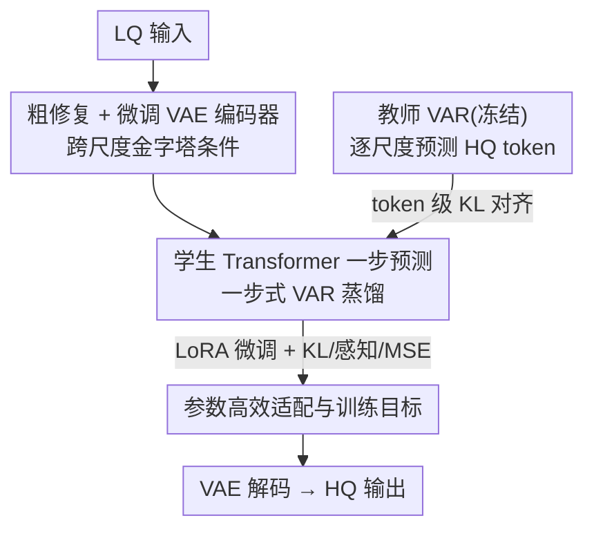

# VARestorer: One-Step VAR Distillation for Real-World Image Super-Resolution

**会议**: ICLR 2026  
**OpenReview**: [https://openreview.net/forum?id=T2Oihh7zN8](https://openreview.net/forum?id=T2Oihh7zN8)  
**代码**: https://github.com/EternalEvan/VARestorer  
**领域**: 图像恢复 / 真实世界超分 / 视觉自回归模型 / 模型蒸馏  
**关键词**: Real-ISR, VAR, 分布匹配蒸馏, 一步推理, 跨尺度条件

## 一句话总结
把一个预训练的文生图视觉自回归模型（VAR）通过 token 级分布匹配蒸馏成一步式真实世界超分模型，再配上跨尺度金字塔条件让低质输入信息被充分利用，只微调 1.2% 参数就在 DIV2K-Val 上拿到 72.32 MUSIQ / 0.7669 CLIPIQA，同时把推理加速约 10 倍。

## 研究背景与动机
**领域现状**：真实世界图像超分（Real-ISR）要把野外采集、带噪声/模糊/下采样/压缩的低质（LQ）图像还原成高质（HQ）结果。主流路线有三类：预测式（估计模糊核）、GAN 式、以及近年最火的扩散式——后者借预训练扩散先验做去噪采样，效果好但采样慢。视觉自回归模型 VAR 用「下一尺度预测」（next-scale prediction）把图像建成多尺度 token 图序列，生成质量和可扩展性都很强，天然带有「从粗到细」的层级结构，看起来和超分非常契合。

**现有痛点**：直接把 VAR 搬到超分上有两个硬伤。其一，VAR 的因果注意力（scale-wise causal attention）让低尺度 token 看不到高尺度信息，无法充分利用全局 LQ 上下文，零样本上采样会产生模糊、不一致的伪影；其二，自回归的逐尺度迭代预测会**误差累积**——前面尺度的一点小错会被一路带到后面尺度并放大。生成任务能容忍中间步骤的偏差（只要最终图像看着合理就行），但恢复任务要求输出和输入/GT 高度对齐，这种累积误差就特别致命。扩散蒸馏虽然能减步，但常出现过平滑、多样性下降。

**核心矛盾**：要用 VAR 的丰富生成先验，就得跑它的多步自回归；可一旦多步迭代，误差累积又毁掉恢复任务要的一致性。即「利用 VAR 生成能力」和「避免迭代误差」之间存在矛盾。

**本文目标**：把多步 VAR 压成**一步**推理，既消除误差累积、又把生成先验保住，同时让 LQ 输入信息在自回归架构里被充分吃进去。

**切入角度**：作者借鉴扩散蒸馏里的「分布匹配」思想——不去逐 token 对齐像素，而是让一步学生模型的 token 分布去匹配多步教师 VAR 的 token 分布；并且不大改架构，只把 VAR 的因果注意力放开成全注意力来注入跨尺度条件。

**核心 idea**：用 token 级分布匹配蒸馏把预训练 VAR 变成一步超分模型，再用跨尺度金字塔条件喂入 LQ，从而「一次前向预测出所有尺度的 HQ token」。

## 方法详解

### 整体框架
VARestorer 把一个预训练文生图 VAR 同时当作**教师**（冻结）和**学生**（初始化）。训练时，教师沿用 VAR 原生的逐尺度自回归，给定 GT 的前序尺度 token 一步步预测下一尺度的 HQ token 分布；学生则被要求在**一次前向**里、仅凭 LQ 输入就直接吐出所有尺度的 token。两者在每个尺度上做 token 级 KL 对齐，把教师的生成知识压进学生的一步映射里。为了让 LQ 信息真正进得去，学生侧先对 LQ 做轻量粗修复、再用微调过的 VAE 编码器抽出多尺度金字塔 token 图，并把 VAR 的因果注意力换成跨尺度全注意力，使各分辨率层级能双向交互。推理时只跑学生：LQ →（粗修复 + 金字塔编码）→ 学生一步预测全尺度 token → VAE 解码 → HQ，整个过程单步完成。

### 关键设计

**1. 一步式 VAR 蒸馏：用 token 级分布匹配消除迭代误差**

这一步直击「多步迭代导致误差累积」的痛点。作者不让学生模仿教师逐尺度采样的轨迹，而是把蒸馏写成一个 KL 散度优化问题：教师在给定 GT 前序尺度 token $r_{HQ,<k}$ 时预测第 $k$ 尺度的分布 $p_T(r_k\mid r_{HQ,<k})$，学生只凭 LQ 输入一次性预测所有尺度 $p_S(\hat r_k\mid r_{LQ})$，目标是把每个尺度上的两个分布对齐：

$$\mathcal{L}_{KL}=\sum_k D_{KL}\big(p_T(r_k\mid r_{HQ,<k})\,\|\,p_S(\hat r_k\mid r_{LQ})\big)$$

其中 $p_T(r_k\mid r_{HQ,<k})=F_T(r_{HQ,<k})$、$p_S(\hat r\mid r_{LQ})=F_S(r_{LQ})$。与逐像素 L2 不同，KL 鼓励学生学到「多样且高质」的 token 分布，而不是把一对多的可能输出平均成一张糊图——这正契合超分本身的一对多病态性。因为扩散里那套「用两个去噪网络估计分布密度梯度」的做法在 VAR 上不适用（VAR 与扩散的图像/分布建模根本不同），作者改成直接在 VAR 预测的跨尺度 token 分布上写 KL。结果是：学生一次前向就能拟合教师多步生成的质量，迭代被压成单步，自然就没有误差累积的空间，推理也大幅加速。

**2. 跨尺度金字塔条件：放开因果注意力让低质输入被吃透**

VAR 的逐尺度因果注意力让低尺度 token 看不到高尺度，低尺度因此「不知道该为后续尺度铺什么底」，导致全局模糊和块状伪影；同时「每个尺度该放多少控制 token」也是难题——naive 地按 $r_k$ 数量匹配会让低尺度的引导信号失效，而直接套 ControlNet 又会破坏 VAR 的自回归生成、需要大改重训。作者的做法是微调 VAR 的 VAE 编码器，把 LQ 编成**多尺度金字塔 token 图**（每一层捕捉不同粒度，高层语义 + 细节结构都保留），再把自回归 Transformer 里的 scale-wise 因果注意力掩码改成**跨尺度全注意力**，让所有分辨率层级能直接双向交互。这样既不大改原架构、保住了 VAR 的生成先验，又让靠后的 LQ token 不会在 transformer 里被忽视，从根上缓解了「低尺度看不到高尺度」的失谐。消融里去掉它（w/o cross）MUSIQ 从 72.32 掉到 63.72，是掉点最狠的组件。

**3. 参数高效适配与训练目标：只动 1.2% 参数，KL+感知+MSE 三项配平**

为了在保住 VAR 表达力的同时让微调代价极低，学生只用 LoRA（rank=32）解冻 cross-attention / self-attention 模块，可训练参数仅占 transformer 的约 1.2%（27.3M），其余冻结。输入端用一个轻量模块对 LQ 做粗修复打底，并用 BLIP 自动生成文本 prompt，把 VAR 在生成任务里学到的视觉-语言先验也调动起来。训练总损失在 KL 之外再加感知损失和像素 MSE，保证学生输出 $x_S$ 与 GT 在保真度上不跑偏：

$$\mathcal{L}=\lambda_{KL}\mathcal{L}_{KL}+\lambda_{perc}\mathcal{L}_{perc}+\lambda_{MSE}\lVert x_S-x_{GT}\rVert_2^2$$

权重取 $\lambda_{KL}=0.1$、$\lambda_{perc}=0.25$、$\lambda_{MSE}=0.5$。KL 负责「真实感/多样性」，感知 + MSE 负责「与 GT 的一致性/保真」，三者配平后既不过平滑也不失真，是这套蒸馏能端到端跑通的工程支点。

### 损失函数 / 训练策略
训练数据用 LSDIR（约 85k 张高质图）经高阶退化合成 LQ-HQ 对，退化流程为 $x_{LQ}=[(k*x_{HQ})\downarrow_r+n]_{JPEG}$（模糊、噪声、下采样、JPEG 压缩）。学生/教师都用预训练 T2I VAR 的自回归 transformer 块初始化；batch size 32、学习率 1e-6、AdamW（weight decay 1e-2）、训练 10K 步、8×Nvidia L20。

## 实验关键数据

### 主实验
在合成 DIV2K-Val 与真实 DrealSR / RealSR 上对比 DiffBIR、SeeSR、PASD、ResShift、VARSR、OSEDiff、SinSR（方法名后数字为推理步数）。VARestorer 在无参考感知指标上几乎全面领先，且只用一步：

| 数据集 | 指标 | VARestorer-1 | 次优方法 | 说明 |
|--------|------|------|----------|------|
| DIV2K-Val | MUSIQ↑ | **72.32** | 71.48 (VARSR-10) | 一步 vs 十步 |
| DIV2K-Val | CLIPIQA↑ | **0.7669** | 0.7330 (VARSR-10) | 感知质量最高 |
| DIV2K-Val | NIQE↓ | **4.410** | 4.581 (PASD-20) | 纹理自然度最佳 |
| DrealSR | MANIQA↑ | **0.5638** | 0.5543 (DiffBIR-50) | 真实退化 |
| RealSR | MANIQA↑ | **0.5655** | 0.5583 (DiffBIR-50) | — |
| RealSR | FID↓ | **117.2** | 123.5 (OSEDiff-1) | 分布级最优 |

注：参考类指标（PSNR/SSIM/LPIPS）上 VARestorer 不是最高（如 DIV2K PSNR 21.08 低于 ResShift 的 22.66），作者认为这些指标会惩罚高频细节（如发丝纹理），因此更看重无参考感知指标与 FID。

参数与推理效率（DIV2K-Val）：

| 方法 | 可训练参数 | 推理时间(s) | MANIQA↑ | MUSIQ↑ |
|------|-----------|-------------|---------|--------|
| DiffBIR | 380.0M | 10.27 | 0.5664 | 69.87 |
| VARSR | 1101.9M | 0.63 | 0.5173 | 71.48 |
| OSEDiff | 8.5M | 0.18 | 0.4410 | 67.96 |
| **VARestorer** | **27.3M** | **0.23** | **0.5590** | **72.32** |

相比同为 VAR 路线的 VARSR（10 步、>1B 参数），VARestorer 一步、27.3M 可训练参数，质量更好、推理快约 10 倍。

### 消融实验
在 DIV2K-Val 上逐一去掉组件：

| 配置 | LPIPS↓ | MUSIQ↑ | NIQE↓ | CLIPIQA↑ | 说明 |
|------|--------|--------|-------|----------|------|
| w/o distill | 0.3723 | 62.22 | 6.283 | 0.4794 | 退回多步 VAR+ControlNet，伪影明显 |
| w/o cross | 0.4224 | 63.72 | 6.029 | 0.3910 | 保留因果注意力，全局模糊+块状伪影 |
| w/o $\mathcal{L}_{KL}$ | 0.3214 | 69.73 | 4.372 | 0.6682 | 图像干净但真实感弱、纹理失真 |
| **VARestorer** | **0.3131** | **72.32** | **4.410** | **0.7669** | 完整模型 |

### 关键发现
- **跨尺度全注意力贡献最大**：去掉后 MUSIQ 从 72.32 掉到 63.72、CLIPIQA 从 0.7669 掉到 0.3910，说明「让低尺度看到高尺度」是质量主力，因果注意力会造成跨尺度 token 失谐。
- **一步蒸馏是质量底座**：w/o distill（退回多步 VAR + ControlNet）MUSIQ 仅 62.22，验证了误差累积在恢复任务里的破坏性，单步映射才是关键。
- **KL 负责真实感**：去掉 $\mathcal{L}_{KL}$ 后图像仍「干净」但缺乏真实细节、出现不真实纹理，说明分布匹配补的是「realness/多样性」这一块，而非单纯的保真度。
- 作者还把 VARestorer 扩展到去雨、低光增强等任务（附录 C），显示框架的通用性。

## 亮点与洞察
- **把扩散里的分布匹配蒸馏「移植」到 VAR 上**：关键洞察是 VAR 与扩散的分布建模不同，不能照搬「双去噪网络估计密度梯度」，于是改成直接在跨尺度 token 分布上写 KL——这是让 VAR 蒸馏跑通的核心适配。
- **「不大改架构、只放开注意力掩码」的轻量条件注入**：相比给 VAR 硬塞 ControlNet（会破坏自回归、需重训），把因果掩码改成全注意力 + 微调 VAE 编码器出金字塔条件，既省事又有效，这个思路可迁移到其他自回归视觉模型的条件控制。
- **一步 + 1.2% 参数 + 10× 加速**：在效率敏感的真实部署里很有吸引力，且证明了 VAR 生成先验可以被高效复用到判别性更强的恢复任务上。

## 局限与展望
- 作者承认：面对**严重噪声或重度压缩**时仍会失败（附录 E 给了失败案例），说明一步映射在极端退化下表达力不够。
- 参考类指标（PSNR/SSIM/LPIPS）并不领先，论文用「这些指标惩罚高频细节」来解释，但这也意味着在强调像素保真的场景（如医学/测量）未必占优。
- 依赖 BLIP 生成 prompt 和预训练 T2I VAR，方法效果与这些外部模块的质量绑定；prompt 不准时的鲁棒性未充分讨论。
- 改进方向：可探索「难度自适应的少步」策略（极端退化退回 2-3 步），或把分布匹配做成 GT 无关的自蒸馏以摆脱对教师逐尺度 GT 条件的依赖。

## 相关工作与启发
- **vs 扩散蒸馏（OSEDiff / SinSR）**：他们蒸馏扩散到一步，但常过平滑、多样性低；本文蒸馏的是 VAR 的层级 token 分布，KL 对齐保住了细节多样性，感知指标更高（DIV2K MUSIQ 72.32 vs OSEDiff 67.96）。
- **vs VARSR（多步 VAR 超分）**：同走 VAR 路线但 VARSR 要 10 步、>1B 参数且受误差累积之害；本文一步、27.3M 可训练参数，质量更好、快约 10 倍。
- **vs ControlNet 式 VAR 条件**：先前工作直接把 ControlNet 套到 VAR 会扰乱自回归生成；本文用跨尺度全注意力 + 金字塔条件，保留生成先验的同时注入 LQ 信息。

## 评分
- 新颖性: ⭐⭐⭐⭐ 首次把分布匹配蒸馏 + 跨尺度全注意力系统性地落到 VAR 超分上，适配点选得准。
- 实验充分度: ⭐⭐⭐⭐ 三数据集、九指标、效率对比 + 消融 + 跨任务扩展齐全，仅极端退化分析略简。
- 写作质量: ⭐⭐⭐⭐ 动机—矛盾—方法逻辑清晰，公式与图示到位。
- 价值: ⭐⭐⭐⭐ 一步、1.2% 参数、10× 加速，对真实部署和 VAR 先验复用都有参考价值。

<!-- RELATED:START -->

## 相关论文

- [\[CVPR 2026\] One-Step Diffusion Transformer for Controllable Real-World Image Super-Resolution](../../CVPR2026/image_restoration/one-step_diffusion_transformer_for_controllable_real-world_image_super-resolutio.md)
- [\[ICML 2026\] One-Step Residual Shifting Diffusion for Image Super-Resolution via Distillation](../../ICML2026/image_restoration/one-step_residual_shifting_diffusion_for_image_super-resolution_via_distillation.md)
- [\[CVPR 2026\] Time-Aware One Step Diffusion Network for Real-World Image Super-Resolution](../../CVPR2026/image_restoration/time-aware_one_step_diffusion_network_for_real-world_image_super-resolution.md)
- [\[ICLR 2026\] Learning Heterogeneous Degradation Representation for Real-World Super-Resolution](learning_heterogeneous_degradation_representation_for_real-world_super-resolutio.md)
- [\[ICLR 2026\] Improved Adversarial Diffusion Compression for Real-World Video Super-Resolution](improved_adversarial_diffusion_compression_for_real-world_video_super-resolution.md)

<!-- RELATED:END -->
