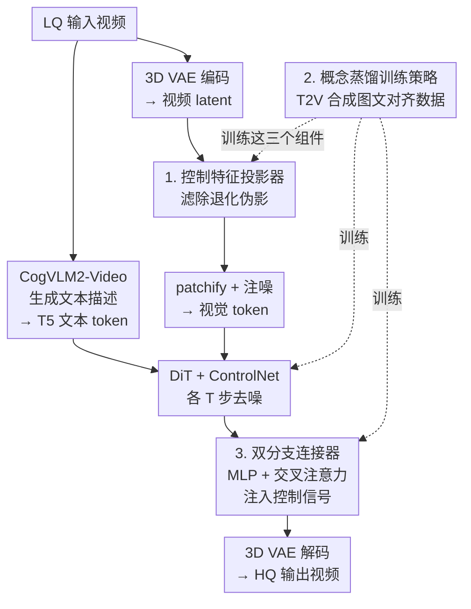

# Vivid-VR: Distilling Concepts from Text-to-Video Diffusion Transformer for Photorealistic Video Restoration

**会议**: ICLR 2026  
**OpenReview**: [https://openreview.net/forum?id=YV5Zgv8pdg](https://openreview.net/forum?id=YV5Zgv8pdg)  
**代码**: https://github.com/csbhr/Vivid-VR  
**领域**: 视频恢复 / 扩散模型  
**关键词**: 视频恢复, 文本到视频, DiT, ControlNet, 概念蒸馏

## 一句话总结
Vivid-VR 在预训练 T2V 扩散 Transformer（CogVideoX1.5-5B）上接 ControlNet 做生成式视频恢复，通过一套「概念蒸馏」训练策略让 T2V 模型自己合成图文对齐的训练数据来抑制微调时的分布漂移，再配上轻量控制特征投影器和双分支连接器，从而在真实、合成与 AIGC 视频上同时拿到更真实的纹理和更稳的时序一致性。

## 研究背景与动机

**领域现状**：视频恢复的目标是把低质量（LQ）视频里丢失的纹理、细节和结构恢复成高质量（HQ）。传统重建式方法用 CNN / Transformer 直接从退化输入回归，缺乏先验、面对严重退化时只能产出过度平滑的结果；GAN 能补一点纹理但生成能力有限。扩散模型崛起后，先是 T2I 扩散被用于图像恢复并取得亮眼效果，随后 DiT 架构催生了高质量、时序稳定的 T2V 模型，于是出现了 SeedVR、STAR 等基于 T2V 的视频恢复方法。

**现有痛点**：尽管接上了强大的 T2V 底座，现有恢复方法在纹理真实感和时序一致性上仍然明显**落后于原生 T2V 模型**——也就是说，微调反而把底座模型本来很好的生成能力给损坏了。

**核心矛盾**：根因是微调阶段的**分布漂移（distribution drift）**。T2V 预训练用的是海量、多样、图文高度对齐的数据，所以漂移不明显；但做视频恢复微调时，训练数据的图文对齐是靠 VLM captioner 生成的，天然不完美，这种「不完美的多模态对齐」在微调中被放大，表现为纹理失真、时序抖动。换句话说，问题不在网络结构，而在**训练数据的图文对齐质量**。

**本文目标**：在不损坏底座 T2V 生成能力的前提下做可控视频恢复，需要解决两件事——(1) 抑制微调时的分布漂移；(2) 把 LQ 控制信号干净、动态地注入生成管线。

**切入角度**：作者的关键观察是——与其费力去训一个更准的 VLM captioner（成本高、且 latent 空间里的差异可能依旧存在），不如**让 T2V 模型自己来生成图文对齐的训练数据**。T2V 模型对「文本概念」的理解本就内嵌在它的 latent 空间里，用它做一遍文本引导的视频翻译，产出的视频天然和文本概念对齐。

**核心 idea**：用预训练 T2V 模型把真实视频「半加噪再去噪」，合成出图文对齐更好的训练样本，把 T2V 的概念理解能力「蒸馏」进恢复模型，从而消除分布漂移、保住纹理与时序质量；同时重设计 ControlNet 的特征预处理与连接器。

## 方法详解

### 整体框架

Vivid-VR 以冻结的 CogVideoX1.5-5B 为 T2V 底座，用 ControlNet 把 LQ 视频作为条件注入生成过程。一次推理的数据流是：LQ 视频先经 CogVLM2-Video 生成文本描述、再由 T5 编码成文本 token；同时 LQ 视频经 3D VAE 编码成 latent，由**控制特征投影器**滤掉退化伪影，再 patchify、注噪得到视觉 token。文本 token、视觉 token 和时间步嵌入一起喂给 DiT（$N$ 个 block）和 ControlNet（$N/7$ 个 block，从 DiT 前 $N/7$ 个初始化），二者各做 $T$ 步去噪，ControlNet 的视觉 token 通过 $N$ 个**双分支连接器**融合进 DiT。去噪完成后由 3D VAE 解码器重建出 HQ 视频。

训练上，全程只训练**控制特征投影器、ControlNet、连接器**三部分，其余参数全冻结；训练数据则由**概念蒸馏策略**专门构造，是整套方法压制分布漂移的源头。整体框架由三个贡献组件支撑——概念蒸馏（管数据）、控制特征投影器（管输入纯净度）、双分支连接器（管控制注入），分别对应下面三个关键设计。

### 关键设计

**1. 控制特征投影器：用轻量 CNN 在 latent 入口就清掉退化伪影**

底座 T2V 是在 HQ 视频上训练的，直接把 LQ 视频的 VAE latent 喂进去会伤害生成质量——latent 里既有内容信息，也夹带着模糊轮廓之类的退化伪影，这些伪影会一路传播污染生成。SUPIR 的做法是单独微调 VAE 编码器来对付它，但解耦优化会让 VAE 特征和后续 DiT / ControlNet 不兼容，效果反而不好（消融 (b)）；联合微调 VAE 编码器又太贵（如 FaithDiff）。本文把它做成 VAE 编码器后面挂的一个**轻量扩展**：三个级联的时空残差块，专门把退化特征滤掉、输出更干净的 latent。可视化（论文 Fig.6）显示，过投影器之前特征轮廓模糊，过完之后明显变锐利、边界清晰，证明它确实滤掉了退化信号，且训练成本远低于动 VAE 编码器。

**2. 概念蒸馏训练策略：让 T2V 模型自己合成图文对齐的训练数据来消除分布漂移**

这是全文的核心。微调时分布漂移的根因是 VLM captioner 给出的图文对齐不完美（论文 Fig.3 上排可见源视频和文本对不太齐）。作者不去训更准的 captioner，而是直接**蒸馏 T2V 底座对文本概念的理解**：给定一对图文样本，先对源视频加噪到对应 $T/2$ 时间步的标准差，再用 CogVideoX1.5-5B 在文本条件下去噪 $T/2$ 步，得到一段**在 T2V latent 空间里与文本概念天然对齐**的合成视频——它大体保留源内容，但把一些概念改得更贴合文本描述。作者从构建的 500K 多模态数据集里随机抽样、用这套流程生成 100K 对样本，再和原始训练数据混合来微调控制模块。

之所以是「半加噪」而不是「从零生成」，是因为从零合成会完全脱离源视频内容（论文 Fig.7、消融 (h) "From scratch" 比 (i) 差）。Table 3 给出了量化证据：用了概念蒸馏后训练数据的图文对齐分（FGA-BLIP2）从 3.49 升到 3.97，恢复质量（DOVER）从 12.99 升到 14.46；而若在蒸馏时打乱文本（Shuffled Text），对齐分崩到 1.77、质量也跟着掉，说明「文本-视觉对齐」正是带来增益的关键变量，而非单纯多了点数据。

**3. 双分支 ControlNet 连接器：MLP 做特征映射、交叉注意力做动态检索**

把 ControlNet 的控制视觉 token 注入 DiT 时，已有连接器（如 ZeroSFT）没有恰当考虑 DiT 自身的特征，融合质量受限。本文设计双分支结构：MLP 分支负责把控制特征映射进来、保内容，交叉注意力分支负责**动态检索**控制特征、做自适应调制。对第 $i$ 个连接器，融合写作

$$\hat f^i = f^i + \mathrm{MLP}(c^{\lfloor i/7\rfloor}) + \mathrm{CA}(f^i,\, c^{\lfloor i/7\rfloor}),$$

其中 $f^i$ 是第 $i$ 个 DiT block 的视觉 token，$c^{\lfloor i/7\rfloor}$ 是与之对齐的 ControlNet block 视觉 token。两个分支缺一不可：只留 MLP（去掉 CA）细节不足（消融 (c)）；只留 CA、把 MLP 换成 skip 连接，模型因为只挑 DiT 式特征而无法收敛、输出和输入内容对不上（消融 (d)）。相比 ZeroSFT，本设计还避开了它归一化操作带来的相邻帧残影、以及去掉归一化后的梯度爆炸问题。

### 损失函数 / 训练策略

沿用 CogVideoX1.5-5B 的 v-prediction 目标：

$$L = \mathbb{E}_{x_0,t,\epsilon}\big[\,\|v - v_\theta(x_t, x_{lq}, x_{text}, t)\|^2\,\big],$$

其中 $x_0$ 是 HQ 视频，$x_{lq}$ 是用 Real-ESRGAN 退化模型合成的 LQ 视频，$x_{text}$ 是文本描述，$x_t=\sqrt{\bar\alpha_t}x_0+\sqrt{1-\bar\alpha_t}\,\epsilon$ 是加噪 latent，优化目标 $v=\sqrt{\bar\alpha_t}\,\epsilon-\sqrt{1-\bar\alpha_t}\,x_0$。训练数据为 500K 真实视频 + 100K 概念蒸馏合成视频；图像缩放短边到 1024 后中心裁成 $1024\times1024$，帧数在 17–37 间随机；AdamW（lr=1e-4）+ 余弦退火，32 张 H20-96G、batch 1/卡、30K 迭代、约 6K GPU 小时。推理用 DPM solver 跑 50 步，高分辨率输入用直接拼块的聚合采样以避免重叠区伪影。

## 实验关键数据

### 主实验

在合成（SPMCS / UDM10 / YouHQ40）、真实（VideoLQ / UGC50）与 AIGC（AIGC50）共 6 个 testset 上对比 Real-ESRGAN、SUPIR、MGLD、UAV、STAR、DOVE、SeedVR-7B、SeedVR2-7B。Vivid-VR 在几乎所有**无参考**感知指标上取得最佳，下面摘录几个代表性数据集：

| 数据集 | 指标 | Vivid-VR | 次优方法 |
|--------|------|----------|----------|
| SPMCS | MUSIQ ↑ | **70.03** | 66.11 (UAV) |
| SPMCS | DOVER ↑ | **11.35** | 10.07 (SUPIR) |
| SPMCS | MD-VQA ↑ | **86.55** | 83.07 (UAV) |
| VideoLQ | MUSIQ ↑ | **62.47** | 57.70 (MGLD) |
| VideoLQ | MD-VQA ↑ | **83.14** | 80.67 (MGLD) |
| AIGC50 | MUSIQ ↑ | **67.18** | 62.07 (DOVE) |
| AIGC50 | MD-VQA ↑ | **89.69** | 86.97 (STAR) |

全参考指标（PSNR/SSIM/LPIPS）上 Vivid-VR 并不突出，作者归因于这些指标本身在生成式恢复场景下与人类感知偏好不一致——严重退化允许多个合理 HQ 解，全参考指标难以衡量；论文举例 Fig.4(g1)/(i1) 的 LPIPS 为 0.3112/0.4297，但人更偏好 LPIPS 更差的 (i1)。

### 消融实验

在 UGC50 上，(i) 为完整 Vivid-VR：

| 配置 | NIQE ↓ | MUSIQ ↑ | CLIP-IQA ↑ | DOVER ↑ | 说明 |
|------|--------|---------|------------|---------|------|
| (i) Full | **4.361** | **67.61** | **0.450** | **14.46** | 完整模型 |
| (a) w/o 投影器 | 4.622 | 63.06 | 0.414 | 13.98 | 去掉控制特征投影器 |
| (b) 微调 VAE 编码器 | 4.632 | 64.31 | 0.408 | 14.40 | 用 SUPIR 式解耦微调代替投影器 |
| (c) w/o CA（仅 MLP） | 5.183 | 59.78 | 0.374 | 13.04 | 去掉交叉注意力分支 |
| (d) SK+CA（MLP→skip） | 4.730 | 63.91 | 0.401 | 13.71 | 去掉 MLP 特征映射 |
| (e) ZeroSFT 连接器 | 4.771 | 61.21 | 0.389 | 13.77 | 换成 ZeroSFT |
| (f) w/o 概念蒸馏 | 5.364 | 57.36 | 0.363 | 12.99 | 只用采集视频训练 |
| (g) QW captioner | 5.253 | 60.88 | 0.354 | 13.45 | 换 Qwen2.5-VL 重标注 |
| (h) From scratch 蒸馏 | 4.710 | 62.66 | 0.391 | 13.27 | 蒸馏时从零生成而非半加噪 |

### 关键发现
- **概念蒸馏贡献最大**：去掉它 (f) 时 MUSIQ 从 67.61 掉到 57.36、DOVER 从 14.46 掉到 12.99，是所有消融里掉点最猛的，且视觉上出现过锐纹理和时序抖动（Fig.5(f)）。
- **换更强 captioner 没用**：用 Qwen2.5-VL 重标注 (g) 反而更差——印证作者论点，问题不在 captioner 准不准，而在 T2V latent 空间里的概念对齐，只有蒸馏才解决。
- **双分支缺一不可**：仅 MLP (c) 细节不足；仅 CA（MLP→skip，(d)）虽能靠 skip 保收敛但恢复质量明显下降；纯去掉 MLP 则直接不收敛。
- **半加噪优于从零生成**：(h) From scratch 全面差于 (i)，说明保留源视频内容、只「微调概念」是合成数据有效的前提。

## 亮点与洞察
- 把「修不准的数据对齐」问题转化成「让底座模型自产对齐数据」——不去训更贵的 captioner，而是用 T2V 自己的 latent 空间当对齐裁判，这个换框架的思路很巧，且 Table 3 用对齐分直接量化了因果链。
- 「半加噪再去噪」是一个可复用的轻量数据增强范式：既保住源内容、又把图文概念拉齐，适合任何「底座生成模型强但下游微调数据对齐差」的可控生成任务。
- 控制特征投影器把「净化 LQ 输入」从昂贵的 VAE 联合微调降级成三层时空残差块的轻量插件，性价比高且即插即用。

## 局限与展望
- 成本不低：依赖 CogVideoX1.5-5B 这种大底座，训练 6K GPU 小时、推理 50 步且固定 $1024\times1024$，实时/高分辨率场景受限（需聚合采样拼块）。
- 概念蒸馏可能「改内容」：半加噪去噪会修改部分概念使其贴合文本，对于要求严格保真（如取证、医学）的恢复任务，这种「为了对齐而改内容」可能不可接受。
- 全参考指标偏弱：虽作者论证 PSNR/LPIPS 不可靠，但缺乏更有说服力的保真度证据（如人评规模、内容一致性定量分析），AIGC 视频的「恢复」边界也较模糊。
- 改进方向：蒸馏数据的加噪强度 $T/2$ 是否最优、能否自适应；以及把投影器/连接器思路迁移到一步扩散（one-step）以降推理成本。

## 相关工作与启发
- **vs SeedVR / STAR**: 同为 T2V 底座的视频恢复，但它们直接微调、受分布漂移之苦（Fig.5 时序抖动、纹理过锐）；本文用概念蒸馏从数据侧根治漂移，纹理与时序都更接近原生 T2V。
- **vs SUPIR / FaithDiff**: 它们靠（联合或独立）微调 VAE 编码器来净化输入，解耦微调带来特征不兼容、联合微调又贵；本文用轻量控制特征投影器以更低成本达到类似效果。
- **vs ZeroSFT 连接器**: ZeroSFT 没充分考虑 DiT 特征，且归一化带来相邻帧残影、去归一化又梯度爆炸；本文双分支（MLP 保内容 + CA 动态检索）规避了这些问题。

## 评分
- 新颖性: ⭐⭐⭐⭐⭐ 用 T2V 自产对齐数据来治微调漂移，是对「数据对齐」这一根因的巧妙重构
- 实验充分度: ⭐⭐⭐⭐ 6 个 benchmark + 完整消融 + 对齐分因果验证，但全参考保真度证据偏弱
- 写作质量: ⭐⭐⭐⭐ 动机—方法—消融逻辑闭环清晰，图示丰富
- 价值: ⭐⭐⭐⭐ 在生成式视频恢复上明显抬升感知质量，概念蒸馏范式有迁移潜力

<!-- RELATED:START -->

## 相关论文

- [\[ICLR 2026\] Text-Aware Image Restoration with Diffusion Models](text-aware_image_restoration_with_diffusion_models.md)
- [\[ICLR 2026\] Improved Adversarial Diffusion Compression for Real-World Video Super-Resolution](improved_adversarial_diffusion_compression_for_real-world_video_super-resolution.md)
- [\[CVPR 2026\] TextOVSR: Text-Guided Real-World Opera Video Super-Resolution](../../CVPR2026/image_restoration/textovsr_text-guided_real-world_opera_video_super-resolution.md)
- [\[ICLR 2026\] Trajectory-aware Shifted State Space Models for Online Video Super-Resolution](trajectory-aware_shifted_state_space_models_for_online_video_super-resolution.md)
- [\[CVPR 2026\] Gyro-based Deep Video Deblurring](../../CVPR2026/image_restoration/gyro-based_deep_video_deblurring.md)

<!-- RELATED:END -->
