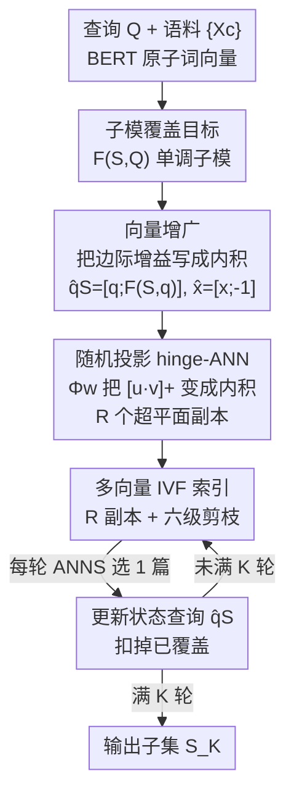

# A Dense Subset Index for Collective Query Coverage

**会议**: ICLR2026  
**OpenReview**: [https://openreview.net/forum?id=cUdODCFjUM](https://openreview.net/forum?id=cUdODCFjUM)  
**代码**: https://github.com/structlearning/DISCo  
**领域**: 信息检索 / 稠密检索 / 子模优化 / 近似最近邻  
**关键词**: 集合覆盖检索, 子模最大化, 多向量检索, 随机投影, ANN 索引

## 一句话总结
DISCO 把"多个文档协作覆盖一个复杂查询"建模成一个单调子模的覆盖目标，再通过向量增广 + 随机投影把贪心算法每轮的边际增益改写成可索引的内积形式，从而用一个改造过的多向量 IVF 索引在亚线性时间里逼近贪心解，在覆盖度与延迟的权衡上比贪心快 100 倍以上、比传统 IR 索引覆盖度更高。

## 研究背景与动机
**领域现状**：传统信息检索（IR）默认"一个相关文档就能独立满足查询"，于是不同文档互相是竞争者，按相关性打分取 top-K。现代稠密检索（ColBERT 系列）用 MaxSim（Chamfer 相似度）给查询-文档打分，再配 IVF 倒排索引做亚线性检索。

**现有痛点**：在多跳问答、表格问答、text-to-SQL 这类场景里，"自完备文档"的前提失效了——回答一个查询往往需要把分散在多个文档里的信息拼起来。论文给的例子很直白："来自 Clamart、当过 Algorithmica 编辑的计算机科学家是谁？"可能没有任何一个段落同时包含 Clamart 和 Algorithmica，必须把"Chazelle 生于 Clamart"和"Chazelle 是 Algorithmica 编辑"两段拼起来。此时独立打分会误导：某个 Chazelle 的传记段落可能排得很高却不覆盖 Algorithmica。

**核心矛盾**：现有两段式做法（先用膨胀的 K 召回一个超集、再过滤）有两个相关的毛病——top 分的文档之间高度冗余（比如多份 Chazelle 传记重复覆盖同一面），却共同漏掉查询的某些方面。根因在于打分对象错了：相关性应该挂在**文档子集**上，而不是单个文档上；可一旦把目标改成子集覆盖，最优子集选择是组合爆炸，而朴素贪心每轮要扫全库，对 880 万段的 MS-MARCO 选 10 篇就要 8800 万次边际增益计算，单查询要跑一天多。

**本文目标**：(1) 给"集合协作覆盖查询"一个干净的打分目标；(2) 设计一个亚线性时间的可扩展算法；(3) 给出能落地的向量数据库实现。

**切入角度**：作者注意到，如果把覆盖目标设成 facility-location 风格的"软集合覆盖"，它天然是**单调子模**的，于是标准贪心就有 $(1-1/e)$ 的近似保证；剩下的唯一障碍是"每轮怎么快速找到边际增益最大的文档"——而这本质上又是一个检索问题，只是打分函数换成了边际增益。把这个边际增益重写成可被 ANN 索引的内积形式，整条管线就通了。

**核心 idea**：用"覆盖（coverage）"代替"相关性（relevance）"作为子集级目标，并通过**向量增广 + 随机投影**把子模贪心的边际增益伪装成 MaxSim 式的内积，从而复用多向量 IVF 索引，在亚线性时间内逼近贪心解。

## 方法详解

### 整体框架
DISCO（Dense Index for Set Coverage）要解决的是：给一个查询 $Q$（拆成原子词向量集合 $\{q_1,\dots,q_M\}$）和一个百万级语料 $\{X_c\}$，快速选出一个大小为 $K$ 的文档子集 $S$，使这些文档的原子向量**集体覆盖**查询的每个原子向量。整体逻辑分三层：先把"协作检索"形式化成单调子模的覆盖目标 $F(S,Q)$，这样贪心就有近似保证；再把贪心每轮的边际增益 $F(c\mid S,Q)$ 经过两步改造（向量增广把它写成内积、随机投影抹掉里面的 hinge 非线性）变成可索引的形式；最后把改造后的打分塞进一个多副本、六级剪枝的多向量 IVF 索引里，每轮用近似最近邻搜索 (ANNS) 在亚线性时间挑出当前增益最大的文档。

整条管线是 $K$ 轮迭代：每轮 ANNS 选出一篇文档加入 $S$，并把"已覆盖到什么程度"写回查询向量，下一轮的检索就会自动避开已被覆盖的查询原子，从而避免冗余。

### 关键设计

**1. 集合覆盖目标 F(S,Q)：把"协作"写成单调子模函数**

要让"一组文档共同覆盖查询"可优化，先得有一个奖励"集体覆盖"而非"重复覆盖"的目标。作者沿用 facility-location 思路，把子集 $S$ 对查询的覆盖定义为对每个查询原子取其在 $S$ 全体文档原子里的最大相似度，再求和：

$$F(S, Q) = \sum_{q\in Q} \max_{x\in \cup_{c\in S}X_c} q^\top x, \qquad \max_{S\subset C}\, F(S,Q)\ \text{s.t.}\ |S|\le K.$$

它和 ColBERT 的 top-K MaxSim 目标 $\max_{|S|=K}\sum_{c\in S}\mathrm{MaxSim}(Q,X_c)$ 的关键区别在那个 **outer max vs outer sum**：MaxSim 把每个文档独立打分再相加，于是多份文档重复覆盖同一查询原子会被重复记分，鼓励冗余；而 $F(S,Q)$ 对每个查询原子只取一次最大覆盖，重复覆盖不再加分。$F$ 可证是单调且子模的（覆盖只增不减、边际收益递减），因此朴素贪心——每轮加入边际增益 $F(c\mid S,Q)=F(S\cup\{c\},Q)-F(S,Q)$ 最大的文档——就有 $(1-1/e)\approx63\%$ 的近似保证。这一步把"组合爆炸的子集选择"降成"有保证的贪心"，但贪心每轮 $\Theta(|C|)$ 次增益计算仍然太贵，是后两个设计要拆掉的瓶颈。

**2. 向量增广：把边际增益改写成内积，剥离对当前集合 S 的依赖**

要索引就必须把打分写成"可预计算的语料表示 × 与语料无关的查询表示"的相似度，但边际增益里藏着对 $S$ 的耦合。作者先把边际增益展开成对每个查询原子的"超出当前最佳覆盖的新增贡献"之和（hinge 形式）：

$$F(c\mid S,Q)=\sum_{q\in Q}\max_{x\in X_c}\Big[\,q^\top x-\max_{u\in S}\max_{x'\in X_u}q^\top x'\,\Big]_+$$

问题在于第二项 $\max_{u\in S}\max_{x'\in X_u}q^\top x'$ 同时耦合了 $S$ 和 $Q$，语料原子 $x'$ 被 $S$ 绑死，没法预计算。关键观察是：这一项其实就是单原子 $q$ 在当前集合上的覆盖值 $F(S,q)$。于是作者把这个标量塞进一个**增广（lifted）向量空间**：查询原子写成 $\hat q_S:=[q;\,F(S,q)]\in\mathbb{R}^{d+1}$，语料原子写成 $\hat x:=[x;\,-1]\in\mathbb{R}^{d+1}$。两者点积 $\hat q_S^\top\hat x = q^\top x - F(S,q)$ 正好复现 hinge 里的内容，于是

$$F(c\mid S,Q)=\sum_{q\in Q}\max_{x\in X_c}\big[\hat q_S^\top\hat x\big]_+.$$

这一招把"对 $S$ 的依赖"全部转移到了**查询侧**的 $\hat q_S$ 上（每轮更新它即可），而语料侧 $\hat x$ 与 $S,Q$ 都无关、可以一次性预计算并索引——这正是支持"查询无关、一次性预处理"的关键。

**3. 随机投影 hinge-ANN：把 [u·v]₊ 的非线性变成可索引的内积**

剩下的最后一个障碍是 hinge $[\cdot]_+$ 的非线性，标准 ANN 只认内积/余弦，不认这个截断。作者用一个随机特征映射把它"线性化"：对随机超平面 $w\sim\mathcal N(0,I_{d+1})$，定义

$$\Phi_w(u)\triangleq\big[\,u;\ \mathrm{sign}(w^\top u)\cdot u\,\big]/\sqrt2,$$

则 $\Phi_w(u)^\top\Phi_w(v)$ 要么等于 $u^\top v$、要么等于 0，取决于 $w$ 是否把 $u,v$ 分到同侧。基于 Charikar (2002) 的 sign-LSH 碰撞概率，可证 $\Phi_w(u)^\top\Phi_w(v)=[u^\top v]_+$ 以概率 $p\ge0.5$ 成立。单个超平面太弱，于是采 $R$ 个独立超平面并对各自的投影内积取 max 聚合：

$$G_{w_{1:R}}(c;S,Q)=\sum_{q\in Q}\max_{r\in[R]}\max_{x\in X_c}\Phi_{w_r}(\hat q_S)^\top\Phi_{w_r}(\hat x).$$

理论上只要 $R\ge\log(|Q|/\delta)$，$G$ 就以概率 $\ge1-\delta$ 等于真边际增益；实践中查询原子数 $|Q|<32$ 时 $R=8$ 即可达 0.875 的成功率。$G$ 的形式和 MaxSim（公式 1）几乎一样——内层 max + 外层求和——所以可以直接套用多向量索引。把这个近似代进贪心后，整条算法仍享有 $(1-1/e-\delta)$ 的期望近似保证，几乎不损失最优性。

**4. 多副本多向量 IVF 索引 + 六级剪枝：在亚线性时间执行每轮 ANNS**

有了可索引的 $G$，DISCO 在 PLAID（多向量 IVF + 质心-残差编码 + 质心优先剪枝）的基础上做适配。**索引阶段**：先把每个语料原子增广成 $\hat x=[x;-1]$；对 $R$ 个投影向量各建一个子索引，把 $\Phi_{w_r}(\hat x)$ 做 k-means 聚成 $B$ 个质心、每个质心挂一条 posting list（文档 ID），并用质心+量化残差 $\Delta$ 压缩存储——于是有 $R$ 份倒排/前向索引副本。**检索阶段**每轮做一次 ANNS，经过六级由粗到精的剪枝：① 副本级粗过滤（每个查询原子探最近质心的 posting list 取并集）；② 副本级质心剪枝（用查询-质心相似度估分、低于阈值 $\tau$ 丢弃、留 top-$n$）；③ 副本池化（把各副本候选并起来）；④ 细粒度过滤（跨副本 max 聚合更逼近 $G$、留 $n/4$）；⑤ 残差打分（用残差重建近似 token 向量、留 top-$n'$）；⑥ 全精度打分与选择（在很小的候选集 $C_3$ 上算精确边际增益 $F(c\mid S,Q)$、选增益最大的 $c_k$ 加入 $S_k$）。选完一篇就更新 $\hat q_S$ 进入下一轮。这六级把"每轮扫全库"变成"每轮亚线性的 $o(C)$ 检索"，是 100 倍加速的工程来源。其中**早期池化（步骤 ②③ 在副本内先剪、再池化）** 是关键工程选择，比"各副本独立取 top-$n'$ 再合并"的晚期池化更能提前丢掉低分候选、更忠实地逼近池化目标。

### 一个完整示例
以多跳查询"来自 Clamart、当过 Algorithmica 编辑的计算机科学家是谁？"为例，$Q$ 被 BERT 编码成若干原子向量（含 Clamart、Algorithmica、editor 等）。第 1 轮：$S_0=\emptyset$，$\hat q_{S}$ 中每个原子的覆盖项 $F(\emptyset,q)=0$，ANNS 选出边际增益最大的文档——比如"Chazelle 是 Algorithmica 编辑"那段，它一次覆盖了 Algorithmica/editor 两个原子。更新 $\hat q_S$：这两个原子的 $F(S,q)$ 被抬高，对应增广维度变化，使它们在下一轮的 hinge $[\hat q_S^\top\hat x]_+$ 里贡献趋零。第 2 轮：检索自然偏向还没被覆盖的 Clamart 原子，选出"Chazelle 生于 Clamart"那段。两轮就集齐了 $|S_{\mathrm{gold}}|=2$ 的金标准集合——这正是 HotpotQA 上 DISCO"几乎都在 2（偶尔 3）轮内召回全部金标准文档"的来源，而独立打分的 IR 方法常把最后一个相关项排到更靠后的位置。

## 实验关键数据

### 主实验
7 个数据集（MS-MARCO、HotpotQA、Fever 来自 BEIR；Pooled/Technology/Writing/Science 来自 LoTTE），7 个基线，统一 $K=10$，BERT-base-uncased 编码。评价主轴是"平均覆盖度 $\overline{F}_K$ vs 相对 Exact Greedy 的效率（时间比）"的权衡曲线（图 2）。

| 数据集 | 对比维度 | DISCO 表现 | 说明 |
|--------|---------|-----------|------|
| MS-MARCO | 覆盖度 vs 效率 | 覆盖度追平贪心，效率 ≥100× | 比 Exact/Lazy/Stochastic/Lazier 贪心快至少百倍 |
| HotpotQA | 同上 | 权衡曲线最优（右上角） | IR 基线效率高但覆盖度低 |
| Fever | 同上 | 权衡曲线最优 | — |
| Pooled | 同上 | 权衡曲线最优 | — |

在 HotpotQA 金标准（$|S_{\mathrm{gold}}|=2$，$K=2$）上的对齐度（表 3）：

| 方法 | Error(F) ↓ | MAP ↑ |
|------|-----------|-------|
| Exact Greedy | 0.69 | 0.83 |
| Lazy Greedy | 0.69 | 0.83 |
| Stochastic Greedy | 2.77 | 0.19 |
| Lazier-than-lazy Greedy | 3.09 | 0.14 |
| PLAID | 1.30 | 0.81 |
| MUVERA | 3.55 | 0.49 |
| WARP | 1.51 | 0.77 |
| **DISCO** | **0.68** | **0.84** |

DISCO 的 Error(F) 最低、MAP 最高，说明它检索到的子集覆盖度最贴近金标准、排序也最对齐人工标注；且在追平 Exact/Lazy Greedy 质量的同时效率高出两个数量级。

### 消融实验

| 配置 | 关键现象 | 说明 |
|------|---------|------|
| 超平面数 $R$（图 5） | $R$ 越大覆盖轨迹越高；$R=5$ 即追平 Exact Greedy | 验证随机投影近似 $G$ 的质量随 $R$ 提升 |
| 早期池化（DISCO 默认） | 效率与最终覆盖度均最优 | 提前丢低分候选、更忠实逼近池化目标 |
| 晚期池化 $n'\in\{1,10,15,20\}$（图 6） | 效率与覆盖度都更差 | 各副本独立取 top-$n'$ 再合并，少了细粒度过滤 |

### 关键发现
- **覆盖目标 vs 相关性目标是胜负手**：Stochastic/Lazier-than-lazy Greedy 因为"查询无关的随机剪枝"在覆盖度和 MAP 上崩盘（MAP 仅 0.14–0.19），说明剪枝必须查询相关；这也间接印证 DISCO 的"用已覆盖状态编辑查询向量"为何重要。
- **多向量索引优于单向量**：IR 基线里 PLAID（多向量）表现最好、MUVERA（单向量）最差，DISCO 沿用多向量路线是对的。
- **$R$ 很小就够用**：理论上 $R\ge\log(|Q|/\delta)$，实测 $R=5\sim8$ 即可匹配精确贪心，随机投影开销可控。

## 亮点与洞察
- **把"子集级检索"重新归约成"逐轮的单文档检索"**：通过子模性 + 贪心，把组合爆炸的子集选择拆成 $K$ 个"找当前边际增益最大文档"的子问题，每个子问题又被伪装成熟悉的 MaxSim 式检索——这套"换目标但复用基础设施"的思路非常优雅，可迁移到任何"子集级打分 + 已有 ANN 索引"的场景。
- **增广向量把"状态"塞进查询维度**：$\hat q_S=[q;F(S,q)]$ 把"已覆盖到哪"编码进多出来的一维，使语料侧保持静态可索引、状态全压到查询侧每轮更新——这是"有状态检索"做成"无状态索引 + 可变查询"的通用配方。
- **随机投影线性化 hinge**：用 sign-LSH 特征映射把 $[u^\top v]_+$ 变成内积、再多采样 max 聚合提精度，给"非内积相似度也想用 ANN"提供了一个干净的模板。

## 局限与展望
- **覆盖目标基于 token 级内积**：$F$ 完全由原子向量的最大相似度堆出来，可能对"语义需要推理才能拼起来、但 token 层面不相似"的多跳查询力不从心；作者也把"更丰富的查询-文档交互、加权覆盖"列为未来工作。
- **多副本带来的存储/索引开销**：$R$ 份 IVF 副本意味着 $R$ 倍的索引内存与构建成本，论文主打延迟而非内存，大 $R$ 下的空间代价没充分讨论。
- **近似保证里的 $\delta$ 与池化阈值耦合**：六级剪枝引入 $\tau,n,n'$ 等多个超参，理论保证 $(1-1/e-\delta)$ 只覆盖随机投影那一步，剪枝级联的额外召回损失没有端到端的理论刻画，实际全靠经验设阈值。
- **固定 $K=10$**：所有实验用统一 $K$，自适应停止（覆盖度饱和就停）这类更省算力的策略只在展望里提了一句。

## 相关工作与启发
- **vs PLAID / WARP / MUVERA（多向量 IR 索引）**：它们都基于独立 top-K 的 MaxSim 打分，文档之间互为竞争者；DISCO 直接把目标换成子集覆盖，并复用了 PLAID 的多向量 IVF + 质心-残差工程，区别在于"打分函数从 MaxSim 变成可索引化的边际增益"，因此在多跳类查询上覆盖度更高、把全部金标准文档召回到更靠前的位置。
- **vs Exact / Lazy / Stochastic / Lazier-than-lazy Greedy（子模最大化）**：这些方法解的是同一个子模目标，但要么扫全库（Exact/Lazy）太慢、要么查询无关随机剪枝（Stochastic/Lazier）掉质量；DISCO 的贡献是把贪心的"找最大边际增益"这一步做成亚线性的索引检索，从而既保住近似质量又快百倍。
- **vs 多样性重排（MMR / DPP / 子主题覆盖）**：传统做法把子模/多样性奖励放在**重排阶段**，作用于第一阶段已召回的小候选集，因此受制于第一阶段的召回上限；DISCO 把覆盖目标直接做进**第一阶段检索**，从源头避免"该拼的文档在召回阶段就被漏掉"。

## 评分
- 新颖性: ⭐⭐⭐⭐⭐ 把集合覆盖检索做成可索引的子模贪心，向量增广 + 随机投影两招都很巧。
- 实验充分度: ⭐⭐⭐⭐ 7 数据集 7 基线 + $R$/池化消融，但缺内存开销和大规模 $K$ 自适应的分析。
- 写作质量: ⭐⭐⭐⭐ 从动机到三步改造逻辑链清晰，理论与工程衔接好；六级剪枝细节略密。
- 价值: ⭐⭐⭐⭐⭐ 给多跳/表格/text-to-SQL 的第一阶段检索提供了可落地的覆盖式向量数据库。

<!-- RELATED:START -->

## 相关论文

- [\[ACL 2026\] When Does Mixing Help? Analyzing Query Embedding Interpolation in Multilingual Dense Retrieval](../../ACL2026/information_retrieval/when_does_mixing_help_analyzing_query_embedding_interpolation_in_multilingual_de.md)
- [\[ICLR 2026\] Query-Level Uncertainty in Large Language Models](query-level_uncertainty_in_large_language_models.md)
- [\[ICLR 2026\] Revela: Dense Retriever Learning via Language Modeling](revela_dense_retriever_learning_via_language_modeling.md)
- [\[ICLR 2026\] Query-Aware Flow Diffusion for Graph-Based RAG with Retrieval Guarantees](query-aware_flow_diffusion_for_graph-based_rag_with_retrieval_guarantees.md)
- [\[ICLR 2026\] LightRetriever: A LLM-based Text Retrieval Architecture with Extremely Faster Query Inference](lightretriever_a_llm-based_text_retrieval_architecture_with_extremely_faster_que.md)

<!-- RELATED:END -->
